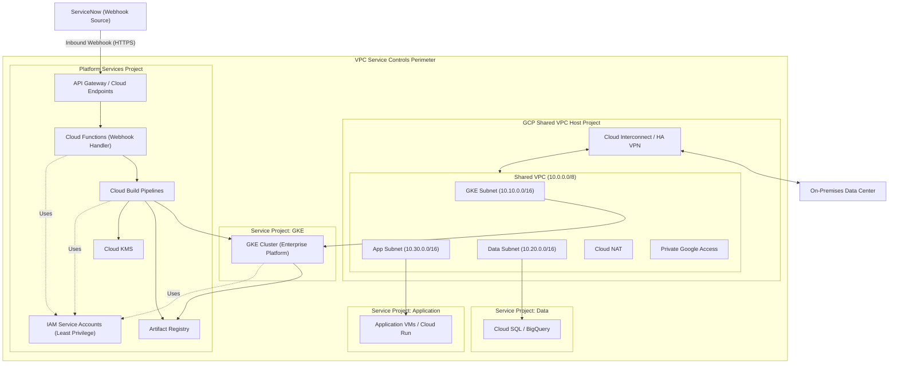
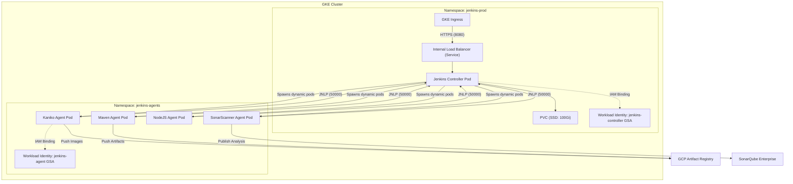

# GCP Centralized Shared VPC Architecture

## 1. GCP Centralized Shared VPC Architecture

```mermaid
graph TD
    %% GCP Shared VPC Host Project
    subgraph HostProject["GCP Shared VPC Host Project"]
        subgraph SharedVPC["Shared VPC (10.0.0.0/8)"]
            SubnetGKE["GKE Subnet (10.10.0.0/16)"]
            SubnetData["Data Subnet (10.20.0.0/16)"]
            SubnetApp["App Subnet (10.30.0.0/16)"]
            CloudNAT["Cloud NAT"]
            PGA["Private Google Access"]
        end
        Interconnect["Cloud Interconnect / HA VPN"]
    end

    %% Service Projects
    subgraph ServiceProjectGKE["Service Project: GKE"]
        GKECluster["GKE Cluster (Enterprise Platform)"]
    end

    subgraph ServiceProjectApp["Service Project: Application"]
        AppVMs["Application VMs / Cloud Run"]
    end

    subgraph ServiceProjectData["Service Project: Data"]
        CloudSQL["Cloud SQL / BigQuery"]
    end

    %% Security & Platform Services
    subgraph PlatformServices["Platform Services Project"]
        CloudBuild["Cloud Build Pipelines"]
        CloudFunctions["Cloud Functions (Webhook Handler)"]
        ArtifactRegistry["Artifact Registry"]
        CloudKMS["Cloud KMS"]
        IAMSA["IAM Service Accounts (Least Privilege)"]
        APIGateway["API Gateway / Cloud Endpoints"]
    end

    %% Service Perimeter
    subgraph VPCServiceControls["VPC Service Controls Perimeter"]
        HostProject
        ServiceProjectGKE
        ServiceProjectApp
        ServiceProjectData
        PlatformServices
    end

    %% External Connections
    OnPrem["On-Premises Data Center"]
    ServiceNow["ServiceNow (Webhook Source)"]

    %% Edges
    Interconnect <--> OnPrem
    Interconnect <--> SharedVPC
    SharedVPC --- SubnetGKE
    SharedVPC --- SubnetData
    SharedVPC --- SubnetApp
    
    SubnetGKE --> GKECluster
    SubnetApp --> AppVMs
    SubnetData --> CloudSQL

    ServiceNow -- "Inbound Webhook (HTTPS)" --> APIGateway
    APIGateway --> CloudFunctions
    CloudFunctions --> CloudBuild
    CloudBuild --> GKECluster
    CloudBuild --> ArtifactRegistry
    CloudBuild --> CloudKMS
    
    GKECluster --> ArtifactRegistry
    GKECluster -. "Uses" .-> IAMSA
    CloudFunctions -. "Uses" .-> IAMSA
    CloudBuild -. "Uses" .-> IAMSA
```

## 2. Jenkins on GKE Architecture

```mermaid
graph TD
    subgraph GKECluster["GKE Cluster"]
        
        subgraph JenkinsProd["Namespace: jenkins-prod"]
            Ingress["GKE Ingress"]
            InternalLB["Internal Load Balancer (Service)"]
            JenkinsController["Jenkins Controller Pod"]
            PVC["PVC (SSD: 100Gi)"]
            GSAController["Workload Identity: jenkins-controller GSA"]
        end
        
        subgraph JenkinsAgents["Namespace: jenkins-agents"]
            KanikoAgent["Kaniko Agent Pod"]
            MavenAgent["Maven Agent Pod"]
            NodeJSAgent["NodeJS Agent Pod"]
            SonarScannerAgent["SonarScanner Agent Pod"]
            GSAAgent["Workload Identity: jenkins-agent GSA"]
        end
        
    end
    
    ArtifactRegistryExt["GCP Artifact Registry"]
    SonarQube["SonarQube Enterprise"]
    
    %% Connections
    Ingress -- "HTTPS (8080)" --> InternalLB
    InternalLB --> JenkinsController
    JenkinsController --> PVC
    JenkinsController -. "IAM Binding" .-> GSAController
    
    %% Agent Provisioning & Communication
    JenkinsController -- "Spawns dynamic pods" --> KanikoAgent
    JenkinsController -- "Spawns dynamic pods" --> MavenAgent
    JenkinsController -- "Spawns dynamic pods" --> NodeJSAgent
    JenkinsController -- "Spawns dynamic pods" --> SonarScannerAgent
    
    KanikoAgent -- "JNLP (50000)" --> JenkinsController
    MavenAgent -- "JNLP (50000)" --> JenkinsController
    NodeJSAgent -- "JNLP (50000)" --> JenkinsController
    SonarScannerAgent -- "JNLP (50000)" --> JenkinsController
    
    KanikoAgent -. "IAM Binding" .-> GSAAgent
    KanikoAgent -- "Push Images" --> ArtifactRegistryExt
    MavenAgent -- "Push Artifacts" --> ArtifactRegistryExt
    SonarScannerAgent -- "Publish Analysis" --> SonarQube
```
