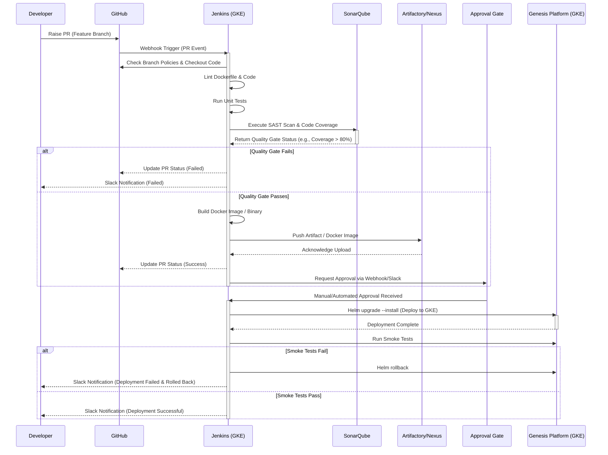

# CI/CD Flow

```mermaid
sequenceDiagram
    participant Dev as Developer
    participant Git as GitHub
    participant Jenkins as Jenkins (GKE)
    participant Sonar as SonarQube
    participant AR as Artifactory/Nexus
    participant Approver as Approval Gate
    participant Genesis as Genesis Platform (GKE)

    Dev->>Git: Raise PR (Feature Branch)
    Git->>Jenkins: Webhook Trigger (PR Event)
    activate Jenkins
    Jenkins->>Git: Check Branch Policies & Checkout Code
    Jenkins->>Jenkins: Lint Dockerfile & Code
    Jenkins->>Jenkins: Run Unit Tests
    Jenkins->>Sonar: Execute SAST Scan & Code Coverage
    activate Sonar
    Sonar-->>Jenkins: Return Quality Gate Status (e.g., Coverage > 80%)
    deactivate Sonar
    alt Quality Gate Fails
        Jenkins-->>Git: Update PR Status (Failed)
        Jenkins-->>Dev: Slack Notification (Failed)
    else Quality Gate Passes
        Jenkins->>Jenkins: Build Docker Image / Binary
        Jenkins->>AR: Push Artifact / Docker Image
        AR-->>Jenkins: Acknowledge Upload
        Jenkins-->>Git: Update PR Status (Success)
        Jenkins->>Approver: Request Approval via Webhook/Slack
    end
    deactivate Jenkins

    Approver->>Jenkins: Manual/Automated Approval Received
    activate Jenkins
    Jenkins->>Genesis: Helm upgrade --install (Deploy to GKE)
    activate Genesis
    Genesis-->>Jenkins: Deployment Complete
    deactivate Genesis
    Jenkins->>Genesis: Run Smoke Tests
    alt Smoke Tests Fail
        Jenkins->>Genesis: Helm rollback
        Jenkins-->>Dev: Slack Notification (Deployment Failed & Rolled Back)
    else Smoke Tests Pass
        Jenkins-->>Dev: Slack Notification (Deployment Successful)
    end
    deactivate Jenkins
```
