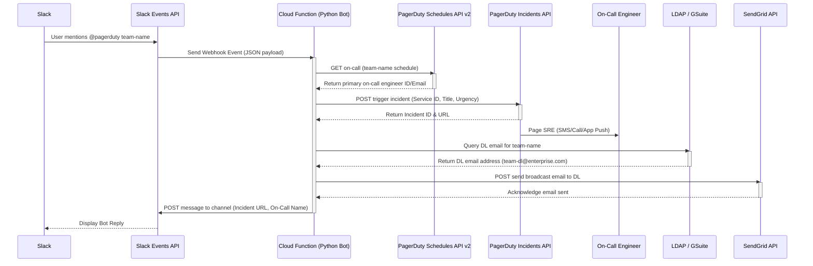

# SRE Alert Flow

```mermaid
sequenceDiagram
    participant SlackMsg as Slack
    participant SlackAPI as Slack Events API
    participant CF as Cloud Function (Python Bot)
    participant PD_Schedules as PagerDuty Schedules API v2
    participant PD_Incidents as PagerDuty Incidents API
    participant SRE as On-Call Engineer
    participant LDAP as LDAP / GSuite
    participant SendGrid as SendGrid API

    SlackMsg->>SlackAPI: User mentions @pagerduty team-name
    SlackAPI->>CF: Send Webhook Event (JSON payload)
    activate CF
    
    %% Determine on-call
    CF->>PD_Schedules: GET on-call (team-name schedule)
    activate PD_Schedules
    PD_Schedules-->>CF: Return primary on-call engineer ID/Email
    deactivate PD_Schedules
    
    %% Trigger incident
    CF->>PD_Incidents: POST trigger incident (Service ID, Title, Urgency)
    activate PD_Incidents
    PD_Incidents-->>CF: Return Incident ID & URL
    deactivate PD_Incidents
    
    PD_Incidents->>SRE: Page SRE (SMS/Call/App Push)
    
    %% Get distribution list
    CF->>LDAP: Query DL email for team-name
    activate LDAP
    LDAP-->>CF: Return DL email address (team-dl@enterprise.com)
    deactivate LDAP
    
    %% Send broadcast
    CF->>SendGrid: POST send broadcast email to DL
    activate SendGrid
    SendGrid-->>CF: Acknowledge email sent
    deactivate SendGrid
    
    %% Reply to Slack
    CF->>SlackAPI: POST message to channel (Incident URL, On-Call Name)
    deactivate CF
    SlackAPI-->>SlackMsg: Display Bot Reply
```
