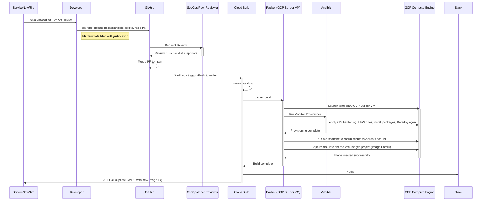

# Golden VM Image GitOps Flow

```mermaid
sequenceDiagram
    participant SNow as ServiceNow/Jira
    participant Dev as Developer
    participant Git as GitHub
    participant Sec as SecOps/Peer Reviewer
    participant CB as Cloud Build
    participant Packer as Packer (GCP Builder VM)
    participant Ansible as Ansible
    participant GCP as GCP Compute Engine
    participant Slack as Slack

    SNow->>Dev: Ticket created for new OS Image
    Dev->>Git: Fork repo, update packer/ansible scripts, raise PR
    note right of Dev: PR Template filled with justification
    
    Git->>Sec: Request Review
    activate Sec
    Sec->>Git: Review CIS checklist & approve
    deactivate Sec
    
    Git->>Git: Merge PR to main
    Git->>CB: Webhook trigger (Push to main)
    activate CB
    
    CB->>CB: packer validate
    CB->>Packer: packer build
    activate Packer
    
    Packer->>GCP: Launch temporary GCP Builder VM
    activate GCP
    
    Packer->>Ansible: Run Ansible Provisioner
    activate Ansible
    Ansible->>GCP: Apply CIS hardening, UFW rules, install packages, Datadog agent
    Ansible-->>Packer: Provisioning complete
    deactivate Ansible
    
    Packer->>GCP: Run pre-snapshot cleanup scripts (sysprep/cleanup)
    Packer->>GCP: Capture disk into shared-vpc-images project (Image Family)
    GCP-->>Packer: Image created successfully
    deactivate GCP
    
    Packer-->>CB: Build complete
    deactivate Packer
    
    CB->>Slack: Notify #sre-alerts (Golden Image v1.x created)
    CB->>SNow: API Call (Update CMDB with new Image ID)
    deactivate CB
```
