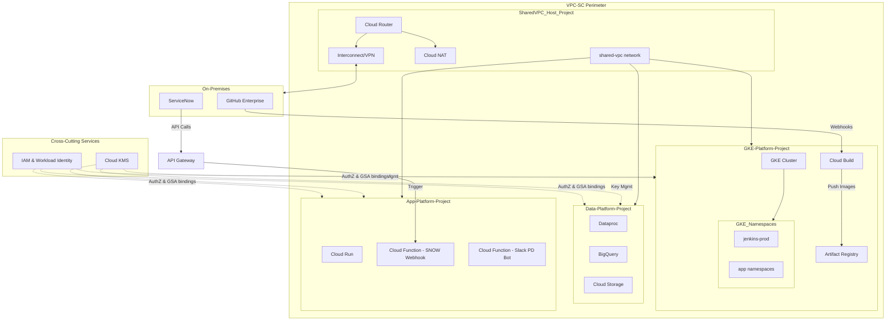
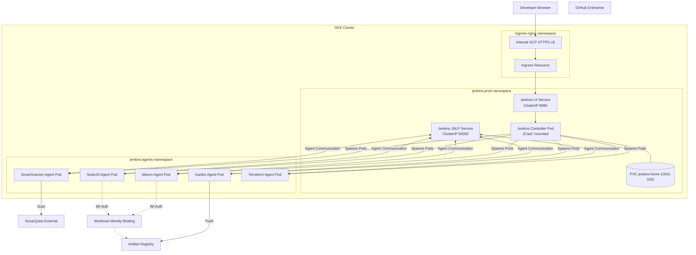
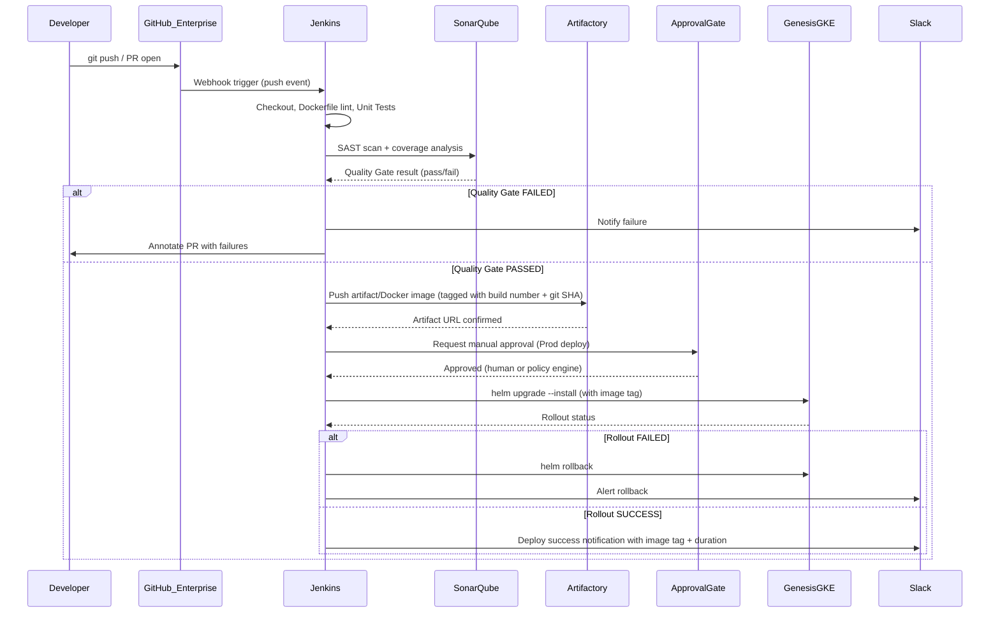
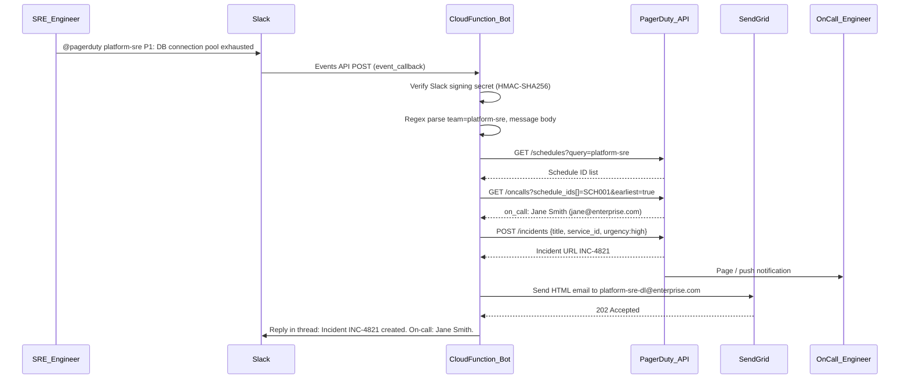
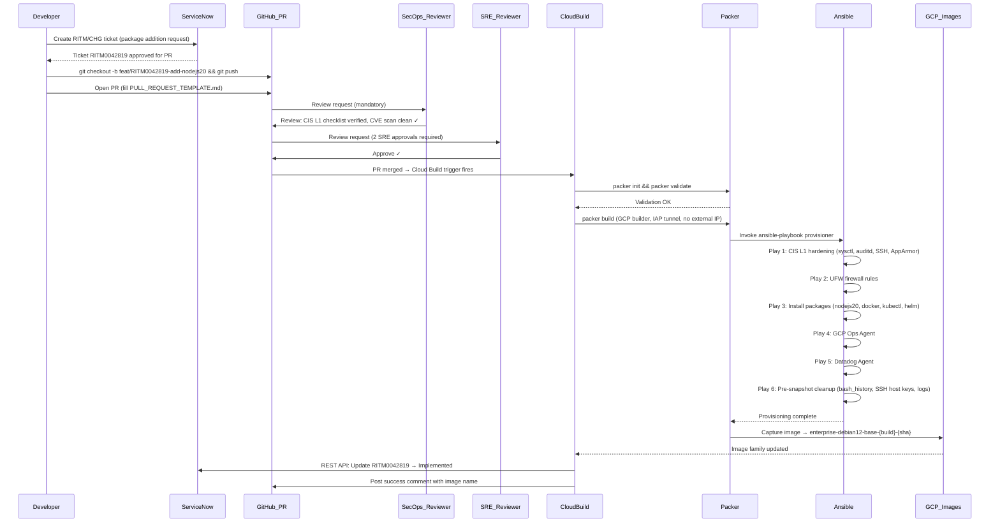

# Architecture Diagrams

Welcome to the Enterprise GCP DevOps & SRE Platform architecture documentation. This platform embodies a strong GitOps culture, ensuring that all infrastructure and platform changes are version-controlled, auditable, and peer-reviewed. The diagrams below map out the critical systems within our environment, illustrating how the centralized shared VPC, CI/CD pipelines, SRE alert flows, and golden image pipelines are orchestrated to deliver a secure, scalable, and resilient platform.

---

## 1. GCP Centralized Shared VPC — Platform Overview

Our GCP infrastructure leverages a Centralized Shared VPC model to maintain strict network isolation and centralized security controls. The Shared VPC Host Project provides the core networking infrastructure, including the shared-vpc network, Cloud NAT, Cloud Router, and Interconnect/VPN back to our on-premises data centers. Service projects are attached to this host, allowing the GKE Platform, Data Platform, and App Platform to consume the shared network while remaining logically isolated. Additionally, VPC Service Controls establish a security perimeter around these projects to prevent data exfiltration, and Private Google Access ensures secure communication with Google APIs.

---

## 2. Jenkins on GKE — Controller & Dynamic Agent Architecture

Our CI/CD workhorse is Jenkins running securely on Google Kubernetes Engine. Configuration is managed strictly via Jenkins Configuration as Code (JCasC), minimizing drift and manual UI changes. The setup relies on the Kubernetes Cloud plugin to dynamically provision ephemeral build agents tailored to specific tasks, minimizing resource usage and attack surface. Agents authenticate to Google services, such as Artifact Registry, seamlessly and securely via Workload Identity without needing static service account keys, while the Jenkins Controller relies on a resilient regional SSD PersistentVolumeClaim (PVC) for configuration and job history persistence.

---

## 3. CI/CD Pipeline — Git to Genesis Platform (GKE)

The core deployment pipeline enforces a strict progression from version control to the production Genesis GKE platform. It guarantees that all code is validated, scanned, and formally approved before taking effect. Upon a Git push, Jenkins orchestrates linting, unit tests, and a rigorous SonarQube SAST and coverage analysis. Failure at the quality gate blocks the pipeline and alerts the developer; success triggers the creation and storage of an immutable artifact in Artifactory. Following manual or policy-engine approval, Jenkins initiates a Helm-based deployment to the Genesis cluster, equipped with automated rollback in case the new release fails to stabilize.

---

## 4. SRE Alert Flow — Slack to PagerDuty to Engineer

In high-pressure situations, manual incident escalation is prone to delays. Our custom Slack bot streamlines the process by integrating directly with the PagerDuty API v2. When an engineer triggers an alert via Slack, a Cloud Function verifies the payload security and parses the request. It then dynamically looks up the current on-call engineer using PagerDuty's schedule and on-call endpoints before creating a high-urgency incident. Simultaneously, a formal notification is broadcasted to the SRE distribution list via SendGrid, and the engineer in Slack receives a thread reply confirming the incident assignment.

---

## 5. Golden Image Baking — GitOps Flow

To ensure all compute instances comply with enterprise security standards, we employ an automated GitOps workflow for building Golden Images. The process is fully auditable, originating from a ServiceNow ticket and progressing through mandatory peer and SecOps reviews on GitHub. Cloud Build coordinates the execution of Packer and Ansible, which harden the base image according to CIS Level 1 benchmarks, configure firewalls, install necessary toolchains (like Node.js, Docker, Kubernetes tools), and embed monitoring agents. The resulting immutable image serves as the single source of truth for VM deployments, and the provisioning system automatically updates CMDB records upon success.

---

## Key Design Principles

The architecture illustrated above is governed by a set of core engineering principles designed to meet enterprise compliance and availability requirements:

*   **GitOps Single Source of Truth:** All infrastructure and platform configurations are declared in version control. Direct manual changes to resources are prohibited.
*   **Immutable Images:** Virtual machines and containers are deployed from immutable golden images that pass rigorous security checks during the build phase.
*   **Workload Identity:** Services authenticate dynamically using Google Cloud Workload Identity. No static, long-lived service account keys are stored or transmitted.
*   **Least-Privilege IAM:** Access to resources and APIs is strictly limited by fine-grained Identity and Access Management policies, enforcing minimum necessary permissions.
*   **VPC Service Controls:** Cloud resources are encapsulated within a secure perimeter, preventing unauthorized data access or exfiltration.
*   **CIS L1 Baseline Mandatory:** All OS images and Kubernetes clusters are continuously audited against the Center for Internet Security Level 1 benchmarks.
*   **Peer and SecOps Review Required:** Changes to critical infrastructure code require multiple layers of automated checks and manual approvals from relevant domain experts.
*   **Automated CMDB Updates:** Infrastructure state changes and deployment events automatically synchronize with the central Configuration Management Database (ServiceNow) for audit and tracking.
