# 📘 SQL — Comprehensive Cheat Sheet

**Author:** AI Technical Writer
**Date:** 2026-08-05
**Scope:** SQL Fundamentals, DDL, DML, DQL, Joins, DCL, TCL, Window Functions, CTEs, Advanced SQL, Practical Patterns, and Quick References.
**Target Audience:** Beginner to Advanced SQL Developers, Data Engineers, and Database Administrators.
**Sections:** 15

---

## 📑 Table of Contents
1. [SQL Fundamentals](#1-sql-fundamentals)
2. [DDL (Data Definition Language)](#2-ddl-data-definition-language)
3. [DML (Data Manipulation Language)](#3-dml-data-manipulation-language)
4. [DQL (Data Query Language)](#4-dql-data-query-language)
5. [JOINs](#5-joins)
6. [DCL (Data Control Language)](#6-dcl)
7. [TCL (Transaction Control Language)](#7-tcl)
8. [Window Functions](#8-window-functions)
9. [CTEs and Recursive Queries](#9-ctes-and-recursive-queries)
10. [Advanced SQL](#10-advanced-sql)
11. [Practical SQL Patterns](#11-practical-sql-patterns)
12. [Quick Reference Tables](#12-quick-reference-tables)
13. [Database Architectural Taxonomy & Enterprise Admin Mastery](#13-database-architectural-taxonomy--enterprise-admin-mastery)
14. [Visualizing & Mental-Model Decomposition of Complex SQL Queries](#14-visualizing--mental-model-decomposition-of-complex-sql-queries)
15. [SQL Keyword & Architectural Concept Disambiguation Master Matrix (When to Use vs. When NEVER to Use)](#15-sql-keyword--architectural-concept-disambiguation-master-matrix-when-to-use-vs-when-never-to-use)

---

## 1. SQL FUNDAMENTALS

### History & SQL Standards
Structured Query Language (SQL) is the standard language for relational database management systems. Created in the early 1970s at IBM by Donald D. Chamberlin and Raymond F. Boyce, it was initially called SEQUEL (Structured English Query Language). Since then, it has become the ubiquitous standard for working with structured data.

*   **SQL-92 (SQL2):** A major revision that established the core foundation of modern SQL. It standardized the `JOIN` syntax, added new data types, and provided schemas.
*   **SQL:1999 (SQL3):** Introduced major programming capabilities like triggers, Common Table Expressions (CTEs), recursive queries, and boolean data types. It also started adding object-relational features.
*   **SQL:2003:** Brought XML related features, window functions (analytic functions), and sequence generators. Window functions fundamentally changed how analytical queries are written, removing the need for complex self-joins in many cases.
*   **SQL:2011:** Added support for temporal databases (system-versioned tables) allowing queries to evaluate data as it existed at any point in time. Enhanced the `MERGE` statement.
*   **SQL:2016:** Introduced comprehensive JSON support (functions and operators) acknowledging the rise of NoSQL and document stores, and added Row Pattern Recognition (useful in time-series analysis).
*   **SQL:2023:** The latest major standard. It introduces Property Graph Queries (PGQ) bringing graph database capabilities into standard SQL, and adds multidimensional arrays and new JSON features.

### SQL Dialects Comparison Table
While the ANSI/ISO standard exists, database vendors implement their own "dialects."

| Feature / Syntax | PostgreSQL | MySQL | SQL Server (T-SQL) | Oracle (PL/SQL) | SQLite |
| :--- | :--- | :--- | :--- | :--- | :--- |
| **String Concatenation** | `str1 \|\| str2` | `CONCAT(str1, str2)` | `str1 + str2` | `str1 \|\| str2` | `str1 \|\| str2` |
| **Auto-increment** | `SERIAL` or `GENERATED ALWAYS AS IDENTITY` | `AUTO_INCREMENT` | `IDENTITY(1,1)` | `GENERATED ALWAYS AS IDENTITY` | `AUTOINCREMENT` |
| **Current Date/Time** | `CURRENT_TIMESTAMP` or `NOW()` | `NOW()` | `GETDATE()` or `SYSDATETIME()`| `SYSDATE` or `SYSTIMESTAMP` | `DATETIME('now')` |
| **Limit / Offset** | `LIMIT x OFFSET y` | `LIMIT y, x` | `OFFSET y ROWS FETCH NEXT x ROWS ONLY`| `FETCH FIRST x ROWS ONLY` | `LIMIT x OFFSET y` |
| **String Literal Quotes**| Single quotes `'string'` | Single or double quotes | Single quotes `'string'` | Single quotes `'string'` | Single quotes `'string'` |
| **Case Sensitivity** | Case-sensitive (data) | Case-insensitive (default) | Case-insensitive (default) | Case-sensitive (data) | Case-sensitive (data) |

### Comprehensive Data Types
Choosing the right data type is crucial for database performance, integrity, and disk space usage.

#### Numeric Types
*   **Integer Types:**
    *   `SMALLINT`: 2 bytes, typically -32,768 to 32,767.
    *   `INTEGER` / `INT`: 4 bytes, typically -2 billion to 2 billion.
    *   `BIGINT`: 8 bytes, very large numbers.
*   **Exact Decimal Types:**
    *   `DECIMAL(precision, scale)` or `NUMERIC(p, s)`: Stores exact numeric values. Example: `DECIMAL(10, 2)` stores up to 8 digits before the decimal and 2 after. Essential for financial data.
*   **Approximate Floating-Point Types:**
    *   `REAL`: 4 bytes, ~6 decimal digits precision.
    *   `DOUBLE PRECISION`: 8 bytes, ~15 decimal digits precision.
    *   `FLOAT`: Variable depending on dialect, approx math. Not for money!
*   **Auto-incrementing Types:**
    *   PostgreSQL: `SERIAL`, `BIGSERIAL` (legacy), or modern `INT GENERATED ALWAYS AS IDENTITY`.
    *   MySQL: `INT AUTO_INCREMENT`.
    *   SQL Server: `INT IDENTITY(1,1)`.

#### String Types
*   `CHAR(n)`: Fixed-length string. Pads with spaces if the string is shorter than `n`. Fast, but wastes space if lengths vary.
*   `VARCHAR(n)`: Variable-length string with a limit of `n`. Uses only the space needed plus 1-2 bytes for length.
*   `TEXT`: Variable-length string with virtually no limit (often up to 1GB or more). Use for large bodies of text.
*   `NCHAR(n)`, `NVARCHAR(n)`, `NTEXT`: SQL Server variants for storing Unicode data (uses 2 bytes per character).
*   `CLOB`: Character Large Object, used in Oracle/DB2 for huge text storage.

#### Date/Time Types
*   `DATE`: Stores date only (YYYY-MM-DD). Example: `2024-10-31`.
*   `TIME`: Stores time of day only (HH:MM:SS.sss). Example: `14:30:00`.
*   `TIMESTAMP` or `DATETIME`: Stores both date and time. `TIMESTAMP` often converts to UTC for storage and back to local timezone for retrieval, while `DATETIME` stores exactly what you provide.
*   `INTERVAL`: Represents a span of time (e.g., '3 days', '2 hours').
*   `YEAR`: MySQL specific, stores a year (1901 to 2155).

#### Boolean Types
*   `BOOLEAN`: True/False/Null (PostgreSQL).
*   `BIT`: Stores 0 or 1. Used in SQL Server in place of a true boolean. MySQL uses `TINYINT(1)`.

#### Binary Types
*   `BINARY(n)` / `VARBINARY(n)`: Stores binary data (byte strings).
*   `BLOB`: Binary Large Object. For images, PDFs, etc. (MySQL/SQLite).
*   `BYTEA`: PostgreSQL equivalent of BLOB.

#### Special Types (Dialect Specific)
*   **JSON / JSONB:** Stores JSON documents. `JSONB` in PostgreSQL stores it in a decomposed binary format for much faster processing and indexing.
*   **XML:** For storing XML documents with validation.
*   **UUID / UNIQUEIDENTIFIER:** Stores universally unique identifiers (e.g., `550e8400-e29b-41d4-a716-446655440000`). Excellent for distributed systems.
*   **ARRAY:** (PostgreSQL) Allows a column to hold a variable-length multidimensional array of another type.
*   **ENUM:** Defines a static, ordered set of string values.
*   **Network Types:** (PostgreSQL) `INET`, `CIDR`, `MACADDR` for optimized IP/MAC address storage and querying.
*   **Geospatial:** `GEOMETRY`, `GEOGRAPHY` (requires PostGIS in PostgreSQL, native in SQL Server).

> 💡 **Best Practice:** Never use `FLOAT` or `REAL` for financial data, as you will suffer from rounding errors due to floating-point arithmetic. Always use `DECIMAL(p, s)` or `NUMERIC(p, s)`.
>
> 🔧 **DevOps Pro Tip:** When defining schema in migration scripts, always use the most standard data types across environments unless you are locked into a specific engine. Avoid `TEXT` in indexing; use `VARCHAR(255)` if an index is required.

---

## 2. DDL (Data Definition Language)

DDL statements create and modify database schemas and objects (tables, indexes, views, etc.).

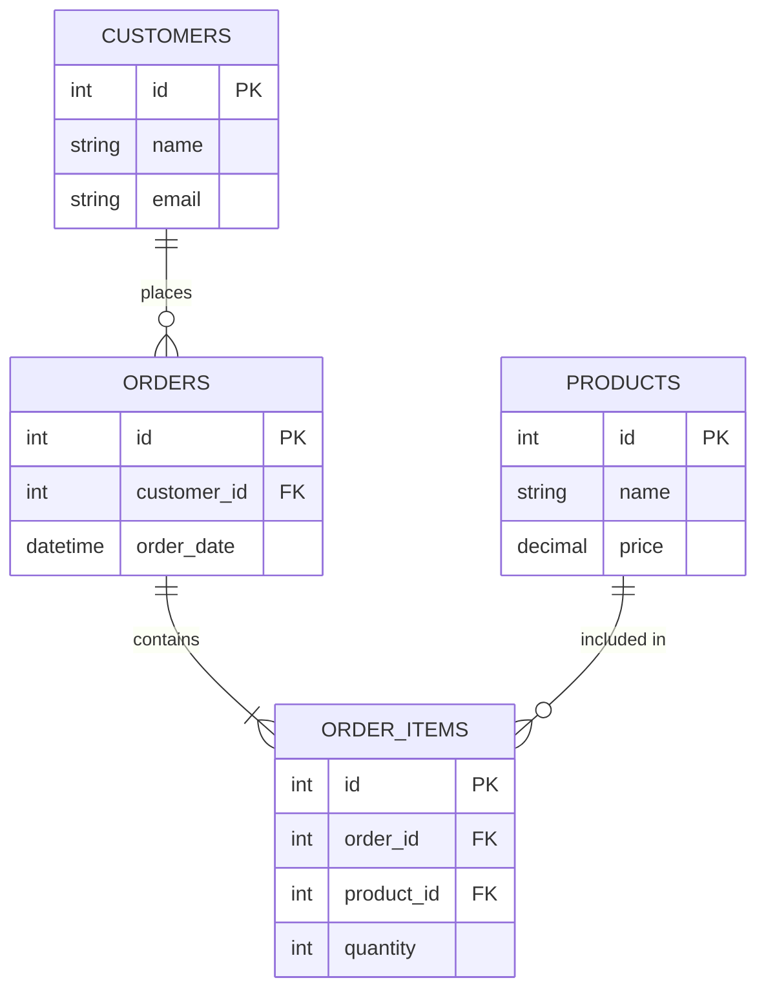
```mermaid
erDiagram
    CUSTOMERS ||--o{ ORDERS : places
    ORDERS ||--|{ ORDER_ITEMS : contains
    PRODUCTS ||--o{ ORDER_ITEMS : "included in"
    
    CUSTOMERS {
        int id PK
        string name
        string email
    }
    ORDERS {
        int id PK
        int customer_id FK
        datetime order_date
    }
    ORDER_ITEMS {
        int id PK
        int order_id FK
        int product_id FK
        int quantity
    }
    PRODUCTS {
        int id PK
        string name
        decimal price
    }
```

### CREATE TABLE (Constraints Deep Dive)
Constraints enforce rules at the database level, ensuring data integrity.

*   `PRIMARY KEY`: Uniquely identifies each record. (Implicitly `NOT NULL` and `UNIQUE`).
*   `FOREIGN KEY`: Enforces referential integrity by linking to a primary key in another table.
*   `UNIQUE`: Ensures all values in a column are distinct.
*   `NOT NULL`: Prevents NULL values in a column.
*   `CHECK`: Validates that a value meets a specific boolean condition.
*   `DEFAULT`: Assigns a default value if none is provided.

**Example 1: Basic Table with Common Constraints**
```sql
CREATE TABLE products (
    product_id INT GENERATED ALWAYS AS IDENTITY PRIMARY KEY, -- Modern PostgreSQL identity
    sku VARCHAR(50) UNIQUE NOT NULL,                         -- Must be unique and present
    name VARCHAR(255) NOT NULL,
    price NUMERIC(10, 2) CHECK (price >= 0),                 -- Price cannot be negative
    created_at TIMESTAMP DEFAULT CURRENT_TIMESTAMP           -- Automatically sets current time
);
```

**Example 2: Foreign Keys and Cascading Actions**
```sql
CREATE TABLE order_items (
    item_id INT GENERATED ALWAYS AS IDENTITY PRIMARY KEY,
    order_id INT NOT NULL,
    product_id INT NOT NULL,
    quantity INT CHECK (quantity > 0),
    
    -- If an order is deleted, delete these items automatically
    CONSTRAINT fk_order FOREIGN KEY (order_id) 
        REFERENCES orders(order_id) ON DELETE CASCADE,
        
    -- Prevent deletion of a product if it has existing order items
    CONSTRAINT fk_product FOREIGN KEY (product_id) 
        REFERENCES products(product_id) ON DELETE RESTRICT
);
```

**Example 3: Composite Primary Key and Table-level Constraints**
```sql
CREATE TABLE user_roles (
    user_id INT,
    role_id INT,
    assigned_by INT,
    assigned_at TIMESTAMP DEFAULT NOW(),
    
    -- Composite primary key: The combination of user_id and role_id must be unique
    PRIMARY KEY (user_id, role_id),
    
    FOREIGN KEY (user_id) REFERENCES users(user_id),
    FOREIGN KEY (role_id) REFERENCES roles(role_id),
    FOREIGN KEY (assigned_by) REFERENCES users(user_id)
);
```

### CREATE DATABASE, SCHEMA, SEQUENCE

**Example 1: Databases and Schemas**
```sql
-- Create a new database
CREATE DATABASE company_db;

-- Switch to database (Dialect specific, e.g., \c company_db in psql, USE company_db in MySQL/SQL Server)

-- Schemas act as logical namespaces within a database (PostgreSQL/SQL Server)
CREATE SCHEMA hr;
CREATE SCHEMA accounting;

-- Create table inside a specific schema
CREATE TABLE hr.employees ( id INT PRIMARY KEY );
```

**Example 2: Sequences (PostgreSQL, Oracle, SQL Server)**
Sequences generate unique numeric values independently of tables.
```sql
CREATE SEQUENCE invoice_seq 
    START WITH 1000 
    INCREMENT BY 1 
    MAXVALUE 999999;

-- Usage:
INSERT INTO invoices (invoice_no) VALUES (NEXTVAL('invoice_seq'));
```

### CREATE INDEX Deep Dive
Indexes are crucial for read performance but incur a cost on write operations (`INSERT`, `UPDATE`, `DELETE`) and consume disk space.

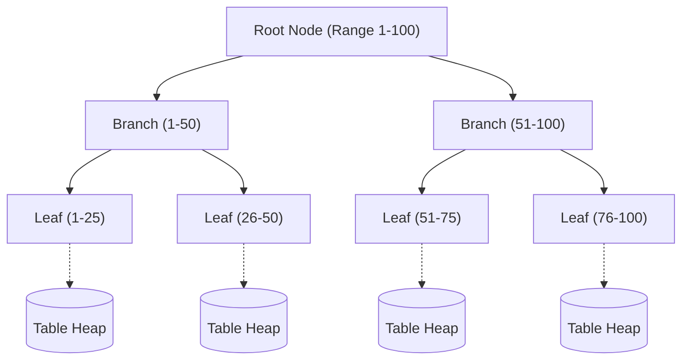
```mermaid
graph TD
    Root["Root Node (Range 1-100)"] --> Branch1["Branch (1-50)"]
    Root --> Branch2["Branch (51-100)"]
    Branch1 --> Leaf1["Leaf (1-25)"]
    Branch1 --> Leaf2["Leaf (26-50)"]
    Branch2 --> Leaf3["Leaf (51-75)"]
    Branch2 --> Leaf4["Leaf (76-100)"]
    
    Leaf1 -.-> Data1[("Table Heap")]
    Leaf2 -.-> Data2[("Table Heap")]
    Leaf3 -.-> Data3[("Table Heap")]
    Leaf4 -.-> Data4[("Table Heap")]
```

*   **B-tree:** The default index. Organizes data in a balanced tree. Excellent for equality (`=`) and range (`<`, `>`, `BETWEEN`) queries.
*   **Hash:** Useful only for equality comparisons (`=`). Rarely used as B-trees perform similarly and offer range capabilities.
*   **GIN (Generalized Inverted Index):** PostgreSQL specific. Perfect for indexing values that contain multiple elements, like arrays, JSONB, and full-text search vectors.
*   **GiST (Generalized Search Tree):** PostgreSQL specific. Used for complex geometric/spatial data (PostGIS) or network address data.
*   **BRIN (Block Range Index):** PostgreSQL specific. Stores summary info for blocks of pages. Extremely small footprint, ideal for massive, naturally ordered tables (like time-series logs).

**Example 1: Basic and Multi-column Indexes**
```sql
-- B-Tree index on a single column
CREATE INDEX idx_users_last_name ON users(last_name);

-- Multi-column (Composite) Index
-- Order matters! This optimizes queries filtering on 'last_name' OR 'last_name AND first_name'. 
-- It DOES NOT help queries filtering ONLY on 'first_name'.
CREATE INDEX idx_users_name ON users(last_name, first_name);
```

**Example 2: Partial Indexes (PostgreSQL, SQL Server)**
Indexes a subset of data, saving disk space and speeding up targeted queries.
```sql
-- Only index active users. Queries filtering "WHERE is_active = true" will use this fast, small index.
CREATE INDEX idx_active_users ON users(email) WHERE is_active = true;
```

**Example 3: Covering Indexes / Index with INCLUDE (PostgreSQL, SQL Server)**
Prevents the database from having to look up the actual table row (heap fetch) by storing extra columns in the index leaf nodes.
```sql
-- When a query asks for just product_id and price based on sku, 
-- all data is read directly from the index (Index Only Scan).
CREATE UNIQUE INDEX idx_products_sku ON products(sku) INCLUDE (product_id, price);
```

**Example 4: Expression Indexes (PostgreSQL)**
Indexes the result of a function or expression.
```sql
-- Speeds up case-insensitive searches like: WHERE LOWER(email) = 'test@test.com'
CREATE INDEX idx_users_email_lower ON users(LOWER(email));
```

### CREATE VIEW
Views are virtual tables representing the result of a stored query.
*   They simplify complex queries.
*   They provide a security layer (restricting column/row access).
*   *Note:* Simple views can be updatable, but complex views (with JOINs or aggregations) generally are not.

**Example 1: Simple View**
```sql
CREATE VIEW active_customers AS
SELECT customer_id, first_name, last_name, email
FROM customers
WHERE is_active = true;
```

**Example 2: Complex View with JOINs**
```sql
CREATE VIEW monthly_sales_report AS
SELECT 
    DATE_TRUNC('month', o.order_date) AS sales_month,
    p.category,
    SUM(oi.quantity * oi.unit_price) AS total_revenue
FROM orders o
JOIN order_items oi ON o.order_id = oi.order_id
JOIN products p ON oi.product_id = p.product_id
GROUP BY 1, 2;
```

**Example 3: View WITH CHECK OPTION**
Prevents inserting or updating data through the view that would violate the view's `WHERE` clause.
```sql
CREATE VIEW high_value_orders AS
SELECT * FROM orders WHERE total_amount > 1000
WITH CHECK OPTION;
-- Trying to INSERT an order with total_amount = 500 through this view will fail.
```

### ALTER TABLE (All Operations)
Used to modify the structure of an existing table without dropping it.

**Example 1: Column Modifications**
```sql
-- Add column
ALTER TABLE users ADD COLUMN phone VARCHAR(20);

-- Drop column
ALTER TABLE users DROP COLUMN phone;

-- Change Data Type (PostgreSQL syntax)
ALTER TABLE users ALTER COLUMN phone TYPE VARCHAR(50);

-- Rename Column
ALTER TABLE users RENAME COLUMN phone TO mobile_number;
```

**Example 2: Modifying Constraints**
```sql
-- Add NOT NULL
ALTER TABLE users ALTER COLUMN email SET NOT NULL;

-- Drop NOT NULL
ALTER TABLE users ALTER COLUMN email DROP NOT NULL;

-- Add Default
ALTER TABLE users ALTER COLUMN status SET DEFAULT 'pending';

-- Drop Default
ALTER TABLE users ALTER COLUMN status DROP DEFAULT;
```

**Example 3: Table Level Modifications**
```sql
-- Rename Table
ALTER TABLE users RENAME TO system_users;

-- Add Table Constraint (Check)
ALTER TABLE system_users ADD CONSTRAINT chk_age CHECK (age >= 18);

-- Drop Constraint
ALTER TABLE system_users DROP CONSTRAINT chk_age;
```

### DROP vs TRUNCATE vs DELETE
| Feature | DELETE | TRUNCATE | DROP |
| :--- | :--- | :--- | :--- |
| **Command Type** | DML | DDL | DDL |
| **What it does** | Removes rows one by one. | Empties the entire table immediately. | Removes the table entirely from schema. |
| **WHERE clause** | Supported. | Not supported. | Not applicable. |
| **Transaction Log** | Logs every row deletion (slow). | Logs page deallocations (extremely fast). | Logs metadata change. |
| **Triggers Fired** | Yes (`AFTER/BEFORE DELETE`). | No. | No. |
| **Identity Reset** | Does not reset auto-increment. | Resets auto-increment seed. | N/A. |
| **Rollback** | Yes. | Yes (in SQL Server/PostgreSQL). No (in MySQL). | Yes (usually). |

**Examples:**
```sql
DELETE FROM orders WHERE order_date < '2020-01-01'; -- Deletes specific rows
TRUNCATE TABLE staging_data;                        -- Empties table quickly
DROP TABLE legacy_users IF EXISTS;                  -- Destroys table
```

### Temporary Tables
Temporary tables exist only for the duration of a session or transaction and are automatically dropped when the session ends.
```sql
-- PostgreSQL/MySQL syntax
CREATE TEMPORARY TABLE temp_process_log (
    log_id INT,
    status VARCHAR(50)
);

-- SQL Server syntax (prefix with # for local temp table)
CREATE TABLE #temp_process_log (
    log_id INT,
    status VARCHAR(50)
);
```

### Generated / Computed Columns
Columns whose values are mathematically derived from other columns in the same row.
```sql
CREATE TABLE rectangles (
    width NUMERIC,
    height NUMERIC,
    -- VIRTUAL: calculated on the fly upon SELECT
    area NUMERIC GENERATED ALWAYS AS (width * height) VIRTUAL, 
    -- STORED: calculated on INSERT/UPDATE and saved to disk
    perimeter NUMERIC GENERATED ALWAYS AS (2 * (width + height)) STORED
);
```

### Table Partitioning
Partitioning splits a massive logical table into smaller physical pieces (partitions) to improve query performance and data management (e.g., dropping an old partition is an instant DDL operation, unlike a massive DELETE).

*   **RANGE Partitioning:** Divides data by ranges (usually dates).
*   **LIST Partitioning:** Divides data by explicit lists of values (e.g., region).
*   **HASH Partitioning:** Divides data evenly using a hash function.

**Example: Range Partitioning (PostgreSQL)**
```sql
-- 1. Create the parent partitioned table
CREATE TABLE sales_log (
    id SERIAL,
    sale_date DATE NOT NULL,
    amount NUMERIC
) PARTITION BY RANGE (sale_date);

-- 2. Create the physical partitions
CREATE TABLE sales_log_2023 
    PARTITION OF sales_log FOR VALUES FROM ('2023-01-01') TO ('2024-01-01');

CREATE TABLE sales_log_2024 
    PARTITION OF sales_log FOR VALUES FROM ('2024-01-01') TO ('2025-01-01');
```

### CREATE TABLE AS SELECT (CTAS)
Creates a new table and populates it with the results of a SELECT query in one step. Extremely useful for materialized snapshots or backups.
```sql
CREATE TABLE employees_backup_2024 AS
SELECT * FROM employees WHERE is_active = true;
```

---

## 3. DML (Data Manipulation Language)

### INSERT
Adds new rows to a table.

**Example 1: Basic and Multi-row Inserts**
```sql
-- Single row
INSERT INTO categories (name, description) 
VALUES ('Electronics', 'Gadgets and devices');

-- Multiple rows (batching is highly recommended for performance)
INSERT INTO categories (name, description) 
VALUES 
    ('Books', 'Physical and digital books'),
    ('Clothing', 'Apparel and accessories'),
    ('Home', 'Furniture and decor');
```

**Example 2: INSERT INTO ... SELECT**
Copies data from one table to another.
```sql
INSERT INTO premium_customers (customer_id, join_date)
SELECT id, CURRENT_DATE 
FROM customers 
WHERE lifetime_value > 10000;
```

**Example 3: INSERT ... RETURNING (PostgreSQL)**
Returns values of the newly inserted rows, extremely useful for getting the generated auto-increment ID back to your application code in a single round-trip.
```sql
INSERT INTO users (email, password_hash) 
VALUES ('newuser@example.com', 'hash_value')
RETURNING user_id, created_at;
```

### UPDATE
Modifies existing rows. **Always use a WHERE clause unless you intend to modify every row.**

**Example 1: Single and Multiple Columns**
```sql
-- Update single column
UPDATE employees SET status = 'Inactive' WHERE last_login < '2023-01-01';

-- Update multiple columns
UPDATE products 
SET price = price * 0.9, 
    updated_at = NOW() 
WHERE category_id = 4;
```

**Example 2: Conditional UPDATE using CASE**
Allows complex update logic in a single statement without needing multiple queries.
```sql
UPDATE inventory
SET stock_level = CASE
    WHEN product_id = 1 THEN stock_level + 50
    WHEN product_id = 2 THEN stock_level + 100
    ELSE stock_level
END
WHERE product_id IN (1, 2);
```

**Example 3: UPDATE with JOIN**
Syntax varies heavily by dialect.

```sql
-- PostgreSQL Syntax
UPDATE employees e
SET salary = e.salary * 1.1
FROM departments d
WHERE e.department_id = d.id AND d.name = 'Engineering';

-- MySQL Syntax
UPDATE employees e
JOIN departments d ON e.department_id = d.id
SET e.salary = e.salary * 1.1
WHERE d.name = 'Engineering';

-- SQL Server (T-SQL) Syntax
UPDATE e
SET e.salary = e.salary * 1.1
FROM employees e
JOIN departments d ON e.department_id = d.id
WHERE d.name = 'Engineering';
```

### DELETE
Removes rows. **Always use a WHERE clause!**

**Example 1: Basic Delete**
```sql
DELETE FROM session_logs WHERE created_at < NOW() - INTERVAL '30 days';
```

**Example 2: DELETE with JOIN**
```sql
-- PostgreSQL Syntax (using USING)
DELETE FROM order_items oi
USING orders o
WHERE oi.order_id = o.id AND o.status = 'Cancelled';

-- MySQL Syntax
DELETE oi FROM order_items oi
JOIN orders o ON oi.order_id = o.id
WHERE o.status = 'Cancelled';
```

**Example 3: DELETE ... RETURNING (PostgreSQL)**
```sql
DELETE FROM task_queue 
WHERE status = 'Pending' 
RETURNING task_id, payload;
```

### UPSERT / MERGE
An "Upsert" performs an UPDATE if the record exists, or an INSERT if it does not.

**Example 1: PostgreSQL (`INSERT ... ON CONFLICT`)**
```sql
-- Requires a UNIQUE constraint on user_id
INSERT INTO user_settings (user_id, theme)
VALUES (101, 'dark')
ON CONFLICT (user_id) 
DO UPDATE SET theme = EXCLUDED.theme, updated_at = NOW();

-- Do nothing if it exists (INSERT IGNORE equivalent)
INSERT INTO tags (name) VALUES ('sql')
ON CONFLICT (name) DO NOTHING;
```

**Example 2: MySQL (`INSERT ... ON DUPLICATE KEY UPDATE`)**
```sql
INSERT INTO page_visits (url, count)
VALUES ('/home', 1)
ON DUPLICATE KEY UPDATE count = count + 1;
```

**Example 3: SQL Standard `MERGE` (SQL Server, Oracle, PostgreSQL 15+)**
```sql
MERGE INTO target_inventory AS tgt
USING source_shipment AS src
ON tgt.product_id = src.product_id
WHEN MATCHED THEN
    UPDATE SET tgt.quantity = tgt.quantity + src.quantity
WHEN NOT MATCHED THEN
    INSERT (product_id, quantity) VALUES (src.product_id, src.quantity);
```

> ⚠️ **Pitfall:** Avoid using `REPLACE INTO` (MySQL/SQLite) unless you know what you are doing. `REPLACE` actually executes a `DELETE` followed by an `INSERT` under the hood. This can unexpectedly break foreign key constraints or trigger delete triggers. Use `UPSERT` mechanisms instead.

---

## 4. DQL (Data Query Language)

The `SELECT` statement is the heart of SQL.

### The SELECT Clause
Retrieves columns from database tables.

```sql
-- Select all (Avoid in production for performance and stability reasons)
SELECT * FROM users;

-- Select specific columns with aliases
SELECT first_name AS f_name, last_name AS l_name FROM users;

-- DISTINCT: Removes duplicate rows from the result set
SELECT DISTINCT department_id FROM employees;

-- DISTINCT ON (PostgreSQL specific): Keeps only the first row of each group defined by the ON clause, based on the ORDER BY
SELECT DISTINCT ON (customer_id) customer_id, order_date, total
FROM orders
ORDER BY customer_id, order_date DESC; -- Gets the MOST RECENT order for each customer
```

### The WHERE Clause and Operators
Filters records based on conditions.

**1. Comparison Operators:**
```sql
SELECT * FROM items WHERE price = 100;
SELECT * FROM items WHERE price <> 100; -- Not equal (standard)
SELECT * FROM items WHERE price != 100; -- Not equal (common alternative)
SELECT * FROM items WHERE price > 50 AND price <= 200;
```

**2. Range Operators:**
```sql
SELECT * FROM events WHERE event_date BETWEEN '2023-01-01' AND '2023-12-31';
SELECT * FROM events WHERE event_date NOT BETWEEN '2023-01-01' AND '2023-12-31';
```

**3. List Operators:**
```sql
SELECT * FROM users WHERE role_id IN (1, 2, 5);
SELECT * FROM users WHERE role_id NOT IN (3, 4);
```

**4. Pattern Matching:**
*   `%`: Matches zero or more characters.
*   `_`: Matches exactly one character.
```sql
-- Case sensitive (usually)
SELECT * FROM customers WHERE email LIKE '%@gmail.com'; 

-- Case insensitive (PostgreSQL)
SELECT * FROM customers WHERE name ILIKE 'john%';

-- Underscore example (matches 'cat', 'bat', 'rat' etc.)
SELECT * FROM words WHERE text LIKE '_at';
```

#### 💡 Case Study: Finding Words that Start with Specific Letters (3 Methods)
A very common logic puzzle (often found on platforms like HackerRank) is filtering rows where a string starts with a specific set of letters, like vowels (`A`, `E`, `I`, `O`, `U`). Because there is no universal `STARTS_WITH()` function in SQL, here are the 3 ways to solve it:

**Option 1: The `LEFT()` Function (Easiest)**
The `LEFT(column, number)` function extracts a specific number of characters starting from the left side of the string. To get the first letter, use `LEFT(city, 1)`.
```sql
SELECT DISTINCT city 
FROM station 
WHERE LEFT(city, 1) IN ('A', 'E', 'I', 'O', 'U');
```
*(Note: To find cities that **end** with a vowel, you would simply use `RIGHT(city, 1)`!)*

**Option 2: The `LIKE` Operator (Verbose)**
If you don't use a function, you can use `LIKE` with the `%` wildcard. This reads naturally but requires writing the column name multiple times with `OR`.
```sql
SELECT DISTINCT city 
FROM station 
WHERE city LIKE 'A%' OR city LIKE 'E%' OR city LIKE 'I%' OR city LIKE 'O%' OR city LIKE 'U%';
```

**Option 3: Regular Expressions `REGEXP` (Advanced & Clean)**
MySQL supports Regular Expressions using the `REGEXP` operator. The `^` symbol means "starts with", and `[aeiou]` means "any of these letters". This is the shortest and most professional way to write it.
```sql
-- Finds any city starting with a, e, i, o, or u (case-insensitive by default in MySQL)
SELECT DISTINCT city 
FROM station 
WHERE city REGEXP '^[aeiou]';
```

**5. NULL Checking:**
*   Never use `column = NULL`. NULL is an unknown state, so nothing equals NULL, not even NULL itself.
```sql
SELECT * FROM tasks WHERE completed_at IS NULL;
SELECT * FROM tasks WHERE completed_at IS NOT NULL;
```

**6. Existence & Quantified:**
```sql
-- EXISTS: Returns true if the subquery returns ANY rows. Very fast.
SELECT name FROM departments d
WHERE EXISTS (SELECT 1 FROM employees e WHERE e.department_id = d.id);

-- ANY / ALL: Compares a value to a set of values.
-- Find employees who earn more than ANY (at least one) manager.
SELECT * FROM employees WHERE salary > ANY (SELECT salary FROM managers);
```

### ORDER BY Clause
Sorts the result set.

```sql
-- Basic sort (Ascending is default)
SELECT * FROM users ORDER BY last_name ASC;

-- Multiple columns
SELECT * FROM users ORDER BY department_id ASC, salary DESC;

#### 💡 Deep Dive: How Multi-Column Tie-Breakers Work
When you use `ORDER BY col1, col2`, the database always sorts the entire table by the **first column first**. The second column is *only* used as a **tie-breaker**!

*   **If No Tie:** The second rule is completely ignored. If Alice has a completely different `department_id` than Bob, their salaries don't matter for their relative sorting.
*   **If There is a Tie:** The second rule steps in to organize *only the tied rows*.

**What happens if you don't provide a tie-breaker?**
If you just write `ORDER BY LENGTH(city) ASC LIMIT 1`, and there is a tie (e.g., "Roy" and "Amo" are both 3 letters long), the database will arbitrarily pick whichever one it reads first from the disk. On coding platforms like HackerRank, this will often cause your test cases to fail because they expect a predictable answer (usually alphabetical). Always add a tie-breaker (like `ORDER BY LENGTH(city) ASC, city ASC`) to guarantee deterministic results!

-- NULLS FIRST / LAST (Standardized behavior control)
SELECT * FROM tasks ORDER BY due_date ASC NULLS LAST;

-- Ordering by expressions
SELECT * FROM products ORDER BY (price * tax_rate) DESC;
```

### GROUP BY Clause
Groups rows that have the same values into summary rows, often used with aggregate functions.

**Example 1: Simple GROUP BY**
```sql
SELECT category, COUNT(*) as product_count, MAX(price) as highest_price
FROM products
GROUP BY category;
```

**Example 2: Multiple Columns**
```sql
SELECT year, month, SUM(revenue) 
FROM sales
GROUP BY year, month;
```

**Example 3: ROLLUP, CUBE, GROUPING SETS (Advanced)**
Used to generate subtotals and grand totals in a single query.

```sql
-- ROLLUP: Creates hierarchical subtotals.
-- Output: (Region, Store), (Region, NULL [subtotal]), (NULL, NULL [grand total])
SELECT region, store, SUM(sales)
FROM sales_data
GROUP BY ROLLUP (region, store);

-- CUBE: Creates all possible combinations of subtotals.
-- Output: (Region, Store), (Region, NULL), (NULL, Store), (NULL, NULL)
SELECT region, store, SUM(sales)
FROM sales_data
GROUP BY CUBE (region, store);
```

### HAVING Clause
Filters groups based on aggregate conditions. `WHERE` filters *before* grouping; `HAVING` filters *after* grouping.

```sql
SELECT department_id, AVG(salary) AS avg_salary
FROM employees
GROUP BY department_id
HAVING AVG(salary) > 75000; -- Cannot use WHERE for an aggregate
```

#### 🔍 Step-by-Step Execution Order for the Above Query:
1. **`FROM employees`**: The database pulls the raw data from the `employees` table.
2. **`GROUP BY department_id`**: It groups the employees into buckets based on their department.
3. **`HAVING AVG(salary) > 75000`**: *After* grouping, it calculates the average salary for each bucket. Any bucket whose average is under 75,000 is thrown away entirely!
4. **`SELECT department_id, AVG(...)`**: Finally, it returns the surviving buckets to the user.

### LIMIT / OFFSET / FETCH FIRST

#### 🧠 Mental Model: The Camera Viewfinder
Imagine you have a long scrolling list of 1,000 products. 
- **`OFFSET 10`**: This tells the camera to scroll down and *skip* the first 10 products entirely without looking at them.
- **`LIMIT 50`** (or `FETCH FIRST 50 ROWS ONLY`): This sets the size of the camera's viewfinder to snap a picture of exactly the next 50 products. 
*Used together, they are the standard engine for building "Page 2" of a website's search results!*

Paginates results.

```sql
-- PostgreSQL / MySQL / SQLite
SELECT * FROM logs ORDER BY created_at DESC LIMIT 50 OFFSET 100;

-- SQL Server (T-SQL)
SELECT * FROM logs ORDER BY created_at DESC 
OFFSET 100 ROWS FETCH NEXT 50 ROWS ONLY;

-- Oracle (12c+)
SELECT * FROM logs ORDER BY created_at DESC 
OFFSET 100 ROWS FETCH FIRST 50 ROWS ONLY;
```

### CASE WHEN Expressions

#### 🧠 Mental Model: The Train Track Switcher
Think of `CASE WHEN` like a train approaching a series of track switches.
1. **`WHEN condition_1 THEN route_A`**: The database checks the first switch. If it matches, the data goes down route A and *stops checking*.
2. **`WHEN condition_2 THEN route_B`**: If switch 1 didn't match, it checks switch 2.
3. **`ELSE route_C`**: If no switches matched, it gets dumped into the default ELSE bucket.
*Important:* It evaluates sequentially top-to-bottom. The first TRUE condition wins!

SQL's `if-then-else` logic.

**Example 1: Simple CASE**
```sql
SELECT order_id, status,
    CASE status
        WHEN 'P' THEN 'Pending'
        WHEN 'S' THEN 'Shipped'
        WHEN 'D' THEN 'Delivered'
        ELSE 'Unknown'
    END AS status_desc
FROM orders;
```

**Example 2: Searched CASE**
```sql
SELECT employee_name, salary,
    CASE 
        WHEN salary >= 100000 THEN 'Executive'
        WHEN salary >= 50000 THEN 'Management'
        ELSE 'Staff'
    END AS compensation_tier
FROM employees;
```

**Example 3: Conditional Aggregation (Pivoting)**
Extremely powerful technique to pivot rows into columns.
```sql
SELECT department_id,
    SUM(CASE WHEN gender = 'M' THEN 1 ELSE 0 END) AS male_count,
    SUM(CASE WHEN gender = 'F' THEN 1 ELSE 0 END) AS female_count
FROM employees
GROUP BY department_id;
```

### Aggregate Functions

#### 🧠 Mental Model: The Data Blender
Aggregate functions take multiple distinct rows of data and "blend" them together until only a single drop (value) comes out. 
- You put 100 employee salaries into the blender.
- `SUM()` blends them into one total number.
- `MAX()` throws away everything except the highest number.
*Because you blended the rows, the original individual row details (like employee names) are destroyed in the output unless you use a Window Function!*

Operate on a group of rows and return a single value.

*   `COUNT(*)`: Counts all rows, including NULLs.
*   `COUNT(column_name)`: Counts non-NULL values in the column.
*   `COUNT(DISTINCT column_name)`: Counts unique, non-NULL values.
*   `SUM(column)`: Sums numeric values.
*   `AVG(column)`: Averages numeric values.
*   `MIN(column)` / `MAX(column)`: Lowest/Highest value.

**String Aggregation (Group Concat)**
Combines multiple string values from a group into a single string.
```sql
-- PostgreSQL: STRING_AGG
SELECT department_id, STRING_AGG(first_name, ', ') AS employee_list 
FROM employees GROUP BY department_id;

-- MySQL: GROUP_CONCAT
SELECT department_id, GROUP_CONCAT(first_name SEPARATOR ', ') AS employee_list 
FROM employees GROUP BY department_id;

-- SQL Server: STRING_AGG (2017+) or FOR XML PATH (Older)
SELECT department_id, STRING_AGG(first_name, ', ') AS employee_list 
FROM employees GROUP BY department_id;
```

**Array / JSON Aggregation (PostgreSQL)**
#### 🧠 Mental Model: The Stapler
Instead of "blending" data into a single math number (like `SUM`), array/JSON aggregation acts like a stapler. It takes 5 distinct rows (like 5 separate order items) and staples them together into a single JSON list (`[item1, item2, item3]`) so they can easily be sent to a frontend web application in one neat package.

```sql
-- ARRAY_AGG: Collects values into an array
SELECT dept_id, ARRAY_AGG(emp_id) FROM employees GROUP BY dept_id;

-- JSON_AGG: Collects values into a JSON array
SELECT category, JSON_AGG(JSON_BUILD_OBJECT('id', id, 'name', name)) 
FROM products GROUP BY category;
```

### Set Operations Deep Dive

#### 🧠 Mental Model: Stacking Lego Baseplates
Unlike `JOIN`s which glue tables together *horizontally* (adding more columns side-by-side), Set Operations glue query results together *vertically* (stacking rows on top of each other).
Imagine two identical Lego baseplates (queries with the exact same column structures). You are simply snapping one baseplate on top of the other to create a taller stack of rows.

Set operations combine the result sets of two or more queries into a single column structure. Number of columns and data types must match.

*   **`UNION`**: Combines results and *removes duplicates*. Requires a sort, which is slow on large datasets.
*   **`UNION ALL`**: Combines results and *keeps duplicates*. Much faster. Always use this unless you explicitly need deduplication.
*   **`INTERSECT`**: Returns only rows that appear in *both* result sets.
*   **`EXCEPT` (or `MINUS` in Oracle)**: Returns rows from the first query that are *not present* in the second query.

```sql
-- UNION ALL Example
SELECT id, name, 'Customer' AS role FROM customers
UNION ALL
SELECT id, name, 'Supplier' AS role FROM suppliers;

#### 🔍 Step-by-Step Execution Order for the Above Query:
1. **Top `SELECT`**: The database executes the entire first query against the `customers` table independently.
2. **Bottom `SELECT`**: The database executes the entire second query against the `suppliers` table independently.
3. **`UNION ALL`**: It takes the two resulting datasets and physically stacks them on top of each other into one giant list. Because it's `ALL`, it skips the slow step of searching for and removing duplicates.

-- INTERSECT Example (Find users who are both customers and employees)
SELECT email FROM customers
INTERSECT
SELECT email FROM employees;

-- EXCEPT Example (Find products with NO sales)
SELECT product_id FROM products
EXCEPT
SELECT product_id FROM order_items;
```

---

## 5. JOINS

JOINs are fundamental to relational databases, allowing you to combine data from multiple tables based on related columns.

### Inner Join
#### 📊 Diagram: Inner Join
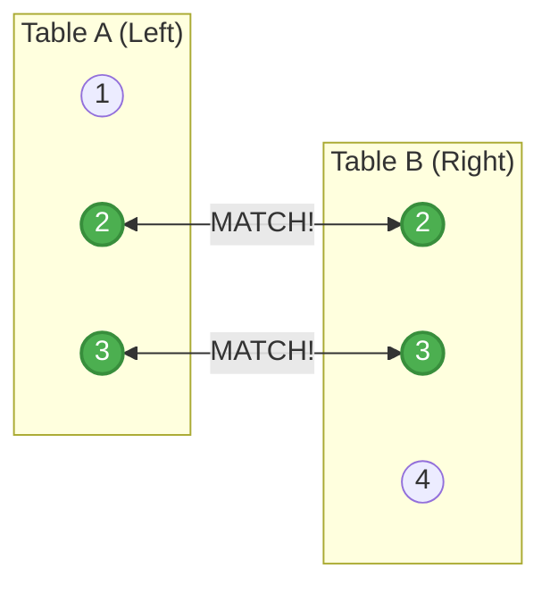
```mermaid
flowchart LR
    subgraph "Table A (Left)"
        A1(("1"))
        A2(("2"))
        A3(("3"))
    end
    subgraph "Table B (Right)"
        B2(("2"))
        B3(("3"))
        B4(("4"))
    end
    A2 <-->|"MATCH!"| B2
    A3 <-->|"MATCH!"| B3
    style A2 fill:#4CAF50,stroke:#388E3C,stroke-width:2px,color:#fff
    style A3 fill:#4CAF50,stroke:#388E3C,stroke-width:2px,color:#fff
    style B2 fill:#4CAF50,stroke:#388E3C,stroke-width:2px,color:#fff
    style B3 fill:#4CAF50,stroke:#388E3C,stroke-width:2px,color:#fff
```
Returns only the records that have matching values in BOTH tables. If there is no match, the row is dropped from the result.

```sql
-- Example 1: Basic Inner Join
SELECT c.name, o.order_date, o.total
FROM customers c
INNER JOIN orders o ON c.id = o.customer_id;

-- Example 2: Multi-condition Inner Join
-- Join on employee and their specific active assignments
SELECT e.first_name, p.project_name
FROM employees e
INNER JOIN assignments a ON e.id = a.emp_id AND a.is_active = true
INNER JOIN projects p ON a.project_id = p.id;
```

### Left (Outer) Join
#### 📊 Diagram: Left Join
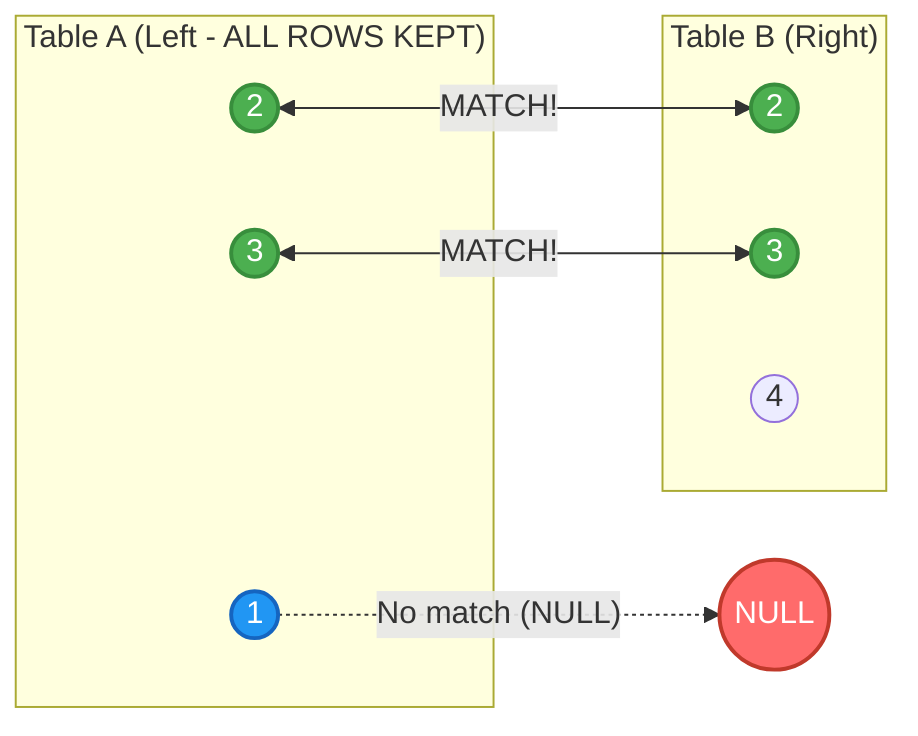
```mermaid
flowchart LR
    subgraph "Table A (Left - ALL ROWS KEPT)"
        A1(("1"))
        A2(("2"))
        A3(("3"))
    end
    subgraph "Table B (Right)"
        B2(("2"))
        B3(("3"))
        B4(("4"))
    end
    A1 -.->|"No match (NULL)"| NullNode(("NULL"))
    A2 <-->|"MATCH!"| B2
    A3 <-->|"MATCH!"| B3
    style A1 fill:#2196F3,stroke:#1565C0,stroke-width:2px,color:#fff
    style A2 fill:#4CAF50,stroke:#388E3C,stroke-width:2px,color:#fff
    style A3 fill:#4CAF50,stroke:#388E3C,stroke-width:2px,color:#fff
    style B2 fill:#4CAF50,stroke:#388E3C,stroke-width:2px,color:#fff
    style B3 fill:#4CAF50,stroke:#388E3C,stroke-width:2px,color:#fff
    style NullNode fill:#ff6b6b,stroke:#c0392b,stroke-width:2px,color:#fff
```
Returns ALL records from the left table, and the matched records from the right table. If there is no match, the result is NULL on the right side.

```sql
-- Example 1: Basic Left Join
-- Get all customers and their orders (if they have any)
SELECT c.name, o.order_date
FROM customers c
LEFT JOIN orders o ON c.id = o.customer_id;

-- Example 2: Filtering using Left Join (Anti-Join Pattern)
-- Find customers who have NEVER placed an order
SELECT c.name
FROM customers c
LEFT JOIN orders o ON c.id = o.customer_id
WHERE o.id IS NULL; -- The order ID is null because no match was found
```

### Right (Outer) Join
#### 📊 Diagram: Right Join
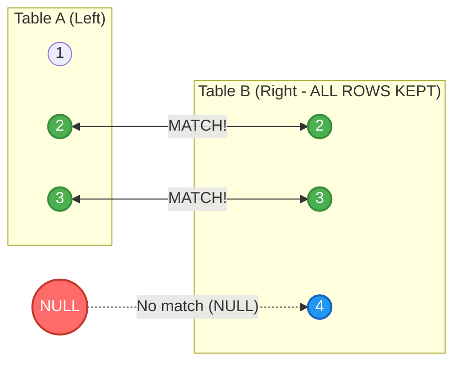
```mermaid
flowchart LR
    subgraph "Table A (Left)"
        A1(("1"))
        A2(("2"))
        A3(("3"))
    end
    subgraph "Table B (Right - ALL ROWS KEPT)"
        B2(("2"))
        B3(("3"))
        B4(("4"))
    end
    NullNode(("NULL")) -.->|"No match (NULL)"| B4
    A2 <-->|"MATCH!"| B2
    A3 <-->|"MATCH!"| B3
    style B4 fill:#2196F3,stroke:#1565C0,stroke-width:2px,color:#fff
    style A2 fill:#4CAF50,stroke:#388E3C,stroke-width:2px,color:#fff
    style A3 fill:#4CAF50,stroke:#388E3C,stroke-width:2px,color:#fff
    style B2 fill:#4CAF50,stroke:#388E3C,stroke-width:2px,color:#fff
    style B3 fill:#4CAF50,stroke:#388E3C,stroke-width:2px,color:#fff
    style NullNode fill:#ff6b6b,stroke:#c0392b,stroke-width:2px,color:#fff
```
Returns ALL records from the right table, and matched records from the left. Functionally identical to a LEFT JOIN with the tables swapped. Rarely used in practice to maintain reading left-to-right consistency.

### Full Outer Join
#### 📊 Diagram: Full Outer Join
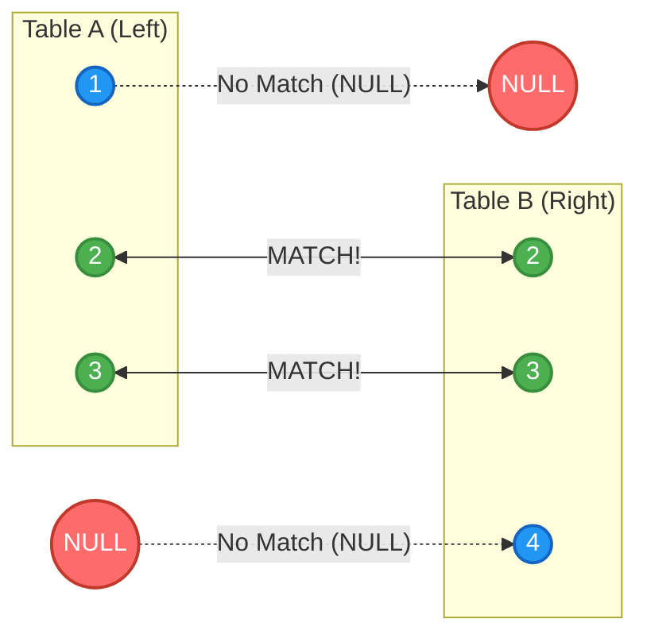
```mermaid
flowchart LR
    subgraph "Table A (Left)"
        A1(("1"))
        A2(("2"))
        A3(("3"))
    end
    subgraph "Table B (Right)"
        B2(("2"))
        B3(("3"))
        B4(("4"))
    end
    A1 -.->|"No Match (NULL)"| NullB(("NULL"))
    NullA(("NULL")) -.->|"No Match (NULL)"| B4
    A2 <-->|"MATCH!"| B2
    A3 <-->|"MATCH!"| B3
    style A1 fill:#2196F3,stroke:#1565C0,stroke-width:2px,color:#fff
    style B4 fill:#2196F3,stroke:#1565C0,stroke-width:2px,color:#fff
    style A2 fill:#4CAF50,stroke:#388E3C,stroke-width:2px,color:#fff
    style A3 fill:#4CAF50,stroke:#388E3C,stroke-width:2px,color:#fff
    style B2 fill:#4CAF50,stroke:#388E3C,stroke-width:2px,color:#fff
    style B3 fill:#4CAF50,stroke:#388E3C,stroke-width:2px,color:#fff
    style NullA fill:#ff6b6b,stroke:#c0392b,stroke-width:2px,color:#fff
    style NullB fill:#ff6b6b,stroke:#c0392b,stroke-width:2px,color:#fff
```
Returns ALL records when there is a match in either left or right table. Returns NULLs for missing matches on either side.

```sql
-- Example: Full Outer Join (PostgreSQL, SQL Server)
-- Find all employees and all projects, matching them up where assignments exist, 
-- but showing employees without projects AND projects without employees.
SELECT e.name, p.project_name
FROM employees e
FULL OUTER JOIN projects p ON e.project_id = p.id;

-- MySQL does not support FULL OUTER JOIN. You must emulate it using UNION:
SELECT e.name, p.project_name FROM employees e LEFT JOIN projects p ON ...
UNION
SELECT e.name, p.project_name FROM employees e RIGHT JOIN projects p ON ...;
```

### Cross Join
#### 📊 Diagram: Cross Join (Cartesian Product)
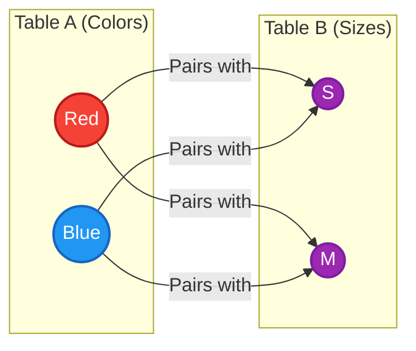
```mermaid
flowchart LR
    subgraph "Table A (Colors)"
        Red(("Red"))
        Blue(("Blue"))
    end
    subgraph "Table B (Sizes)"
        S(("S"))
        M(("M"))
    end
    Red -->|"Pairs with"| S
    Red -->|"Pairs with"| M
    Blue -->|"Pairs with"| S
    Blue -->|"Pairs with"| M
    style Red fill:#f44336,stroke:#b71c1c,stroke-width:2px,color:#fff
    style Blue fill:#2196F3,stroke:#1565C0,stroke-width:2px,color:#fff
    style S fill:#9C27B0,stroke:#7B1FA2,stroke-width:2px,color:#fff
    style M fill:#9C27B0,stroke:#7B1FA2,stroke-width:2px,color:#fff
```
Returns the Cartesian product of rows from tables in the join. In other words, it pairs every row of the first table with every row of the second table.

```sql
-- Example: Generating a matrix
-- Table 'sizes' has 3 rows (S, M, L). Table 'colors' has 2 rows (Red, Blue).
-- Result will be 3 x 2 = 6 rows.
SELECT s.size_name, c.color_name
FROM sizes s
CROSS JOIN colors c;
```

### Self Join
#### 📊 Diagram: Self Join (Hierarchical)
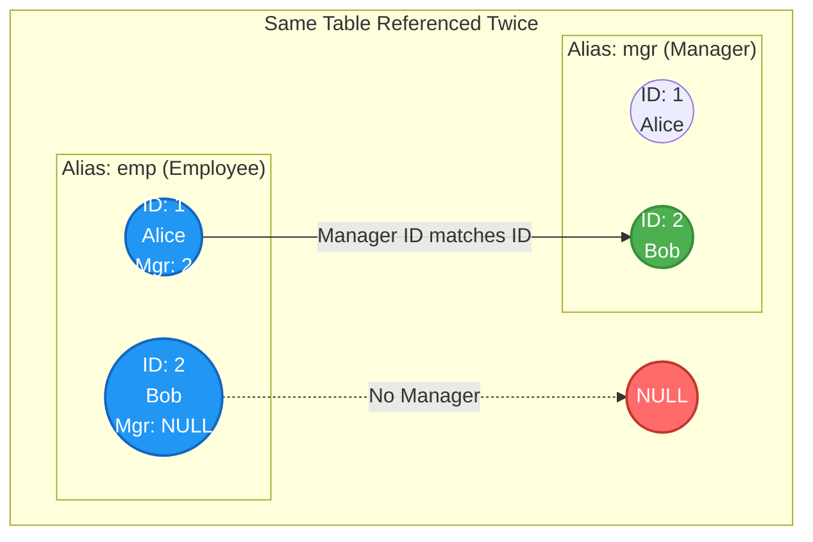
```mermaid
flowchart TD
    subgraph "Same Table Referenced Twice"
        direction LR
        subgraph "Alias: emp (Employee)"
            E1(("ID: 1<br>Alice<br>Mgr: 2"))
            E2(("ID: 2<br>Bob<br>Mgr: NULL"))
        end
        subgraph "Alias: mgr (Manager)"
            M1(("ID: 1<br>Alice"))
            M2(("ID: 2<br>Bob"))
        end
        E1 -->|"Manager ID matches ID"| M2
        E2 -.->|"No Manager"| NullMgr(("NULL"))
    end
    style E1 fill:#2196F3,stroke:#1565C0,stroke-width:2px,color:#fff
    style E2 fill:#2196F3,stroke:#1565C0,stroke-width:2px,color:#fff
    style M2 fill:#4CAF50,stroke:#388E3C,stroke-width:2px,color:#fff
    style NullMgr fill:#ff6b6b,stroke:#c0392b,stroke-width:2px,color:#fff
```
A table joined with itself. Requires table aliases to differentiate the two instances.

```sql
-- Example 1: Employee and Manager Relationship
SELECT emp.first_name AS employee, mgr.first_name AS manager
FROM employees emp
LEFT JOIN employees mgr ON emp.manager_id = mgr.id;

-- Example 2: Finding Duplicate Emails
SELECT a.id, a.email, b.id
FROM users a
INNER JOIN users b ON a.email = b.email AND a.id <> b.id;
```

### Lateral Join / Cross Apply
A highly advanced join (called `LATERAL` in PostgreSQL, `CROSS APPLY` in SQL Server) that allows a subquery in the FROM clause to reference columns provided by preceding FROM items. It's essentially a `FOR EACH` loop in SQL.

```sql
-- Example: Get the TOP 3 most recent orders for EACH customer (PostgreSQL)
SELECT c.name, recent_orders.order_date, recent_orders.total
FROM customers c
CROSS JOIN LATERAL (
    SELECT order_date, total
    FROM orders o
    WHERE o.customer_id = c.id
    ORDER BY order_date DESC
    LIMIT 3
) AS recent_orders;
```

### Join Conditions: ON vs USING
*   `ON`: The standard, explicit way to define join conditions (`ON a.id = b.a_id`).
*   `USING`: A shorthand used when the column names are identical in both tables (`USING (customer_id)`). It merges the join columns in the output, preventing ambiguous column errors in `SELECT *`.

```sql
SELECT * FROM orders INNER JOIN customers USING (customer_id);
```

### Join Performance & Algorithms
When executing a join, the DB engine chooses an algorithm based on table statistics, indexes, and memory.
1.  **Nested Loop Join:** "For every row in Table A, scan Table B for matches." Efficient when one table is tiny (especially if the inner table is indexed). Terrible for two massive tables.
2.  **Hash Join:** "Build a hash table of Table A in memory, then scan Table B and probe the hash table." Very fast for large, unindexed data, but requires memory. Supports only equality (`=`) conditions.
3.  **Merge Join:** "Sort both tables by the join key, then zip them together." Fastest for massive tables if they are already sorted (e.g., via a B-tree index).

### Multi-Table Joins (3+ Tables)
Yes, joining 3, 4, or 5 tables is **standard industry practice** in normalized relational databases! As long as the tables are properly indexed on their foreign keys, modern SQL engines are highly optimized to handle 5-7 table joins in milliseconds. 
*(Anti-pattern warning: Joining 10+ massive fact tables together without filters or indexes will cause exponential performance degradation).*

#### 🧠 Mental Model: Pairwise Assembly
SQL does not throw all 4 tables into a giant blender at once. It evaluates them **pairwise, strictly from top to bottom (Left to Right)**. 
1. It joins `Table 1` and `Table 2` to create an invisible, temporary "Virtual Table A".
2. It takes "Virtual Table A" and joins it to `Table 3` to create "Virtual Table B".
3. It takes "Virtual Table B" and joins it to `Table 4` to get the final result.

#### 📊 Diagram: 4-Table Join Execution Flow
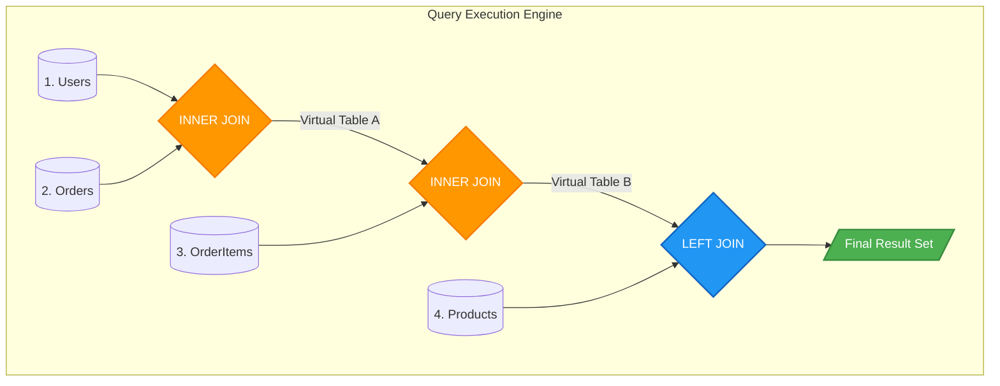
```mermaid
flowchart TD
    subgraph "Query Execution Engine"
        T1[("1. Users")]
        T2[("2. Orders")]
        T3[("3. OrderItems")]
        T4[("4. Products")]
        
        Join1{"INNER JOIN"}
        Join2{"INNER JOIN"}
        Join3{"LEFT JOIN"}
        
        T1 --> Join1
        T2 --> Join1
        Join1 -->|Virtual Table A| Join2
        T3 --> Join2
        Join2 -->|Virtual Table B| Join3
        T4 --> Join3
        Join3 --> Result[/"Final Result Set"/]
    end
    
    style Join1 fill:#FF9800,stroke:#F57C00,stroke-width:2px,color:#fff
    style Join2 fill:#FF9800,stroke:#F57C00,stroke-width:2px,color:#fff
    style Join3 fill:#2196F3,stroke:#1565C0,stroke-width:2px,color:#fff
    style Result fill:#4CAF50,stroke:#388E3C,stroke-width:2px,color:#fff
```

**Example: The E-Commerce 4-Table Join**
```sql
-- Get all users, their orders, the items in those orders, and the product names.
-- Notice how the ON clause always hooks the NEW table into the existing chain!
SELECT 
    u.username,
    o.order_date,
    oi.quantity,
    p.product_name
FROM users u
INNER JOIN orders o       ON u.id = o.user_id           -- Chain link 1
INNER JOIN order_items oi ON o.id = oi.order_id         -- Chain link 2
LEFT JOIN products p      ON oi.product_id = p.id;      -- Chain link 3 (Left join incase product was deleted)
```

#### 🔍 Step-by-Step Execution Order for the Above Query:
1. **`FROM users u INNER JOIN orders o`**: The DB matches Users and Orders. It creates a temporary, invisible "Virtual Table A" containing only users who made an order.
2. **`INNER JOIN order_items oi`**: The DB takes Virtual Table A and matches it against `order_items`. Now it has a bigger "Virtual Table B" containing the users, their orders, and the specific items in those orders.
3. **`LEFT JOIN products p`**: The DB takes Virtual Table B and matches it to `products` to get the actual names of the items. Because it is a `LEFT JOIN`, if a product was deleted from the database but still exists in the order history, the row survives and the `product_name` column is just filled with `NULL`.
4. **`SELECT ...`**: It extracts the exact columns requested from the final Virtual Table C.

### 💡 Case Study: The Lexical Order Trap (Joins vs. Group By)

**The Problem:** The administration wants to know which courses have the highest enrollment. You need a list of courses and the number of students enrolled, sorted highest to lowest. You have an `enrollments` table and a `courses` table.

**The Beginner Mistake:**
```sql
-- ❌ Syntax Error!
SELECT c.course_id, c.name, COUNT(*) 
FROM enrollments e
GROUP BY c.course_id, c.name    <-- Error! Grouping before joining!
INNER JOIN courses c ON e.course_id = c.course_id;
```
*Why this fails:* You cannot put ingredients into a blender (`GROUP BY`) before you've gathered them from the fridge (`FROM` and `JOIN`). The database engine must glue the tables together *first*.

**The Correct Approach (Following Execution Order):**
```sql
-- ✅ Production Ready
SELECT 
    c.course_id, 
    c.name, 
    COUNT(*) AS enrollment_count            -- 3. Pick the columns to display
FROM enrollments e
INNER JOIN courses c ON e.course_id = c.course_id   -- 1. Gather and glue the tables first
GROUP BY 
    c.course_id, 
    c.name                                  -- 2. Then group the glued rows into buckets
ORDER BY 
    enrollment_count DESC;                  -- 4. Finally, sort the output
```

---

## 6. DCL (Data Control Language)

Controls access to data. Crucial for database security.

### GRANT and REVOKE
```sql
-- Example 1: Granting granular permissions
GRANT SELECT, INSERT, UPDATE ON table_name TO app_user;

-- Example 2: Granting execute on a function/procedure
GRANT EXECUTE ON FUNCTION calculate_tax TO finance_role;

-- Example 3: Revoking
REVOKE UPDATE ON table_name FROM app_user;

-- Example 4: WITH GRANT OPTION
-- Allows the user to grant this same privilege to others
GRANT SELECT ON sensitive_data TO manager WITH GRANT OPTION;
```

### Managing Users and Roles
*Roles* are groups of privileges. Users can be assigned to roles.
```sql
-- PostgreSQL syntax
CREATE ROLE read_only_role;
GRANT SELECT ON ALL TABLES IN SCHEMA public TO read_only_role;

CREATE USER reporting_agent WITH PASSWORD 'secure_pass';
GRANT read_only_role TO reporting_agent;

-- Change password
ALTER USER reporting_agent WITH PASSWORD 'new_pass';
```

### Row-Level Security (RLS) - PostgreSQL specific
Allows you to control access to individual rows within a table based on the user executing the query. Perfect for multi-tenant applications.

```sql
-- 1. Enable RLS on the table
ALTER TABLE tenant_data ENABLE ROW LEVEL SECURITY;

-- 2. Create a policy
-- Users can only SELECT rows where the tenant_id matches their session variable
CREATE POLICY tenant_isolation_policy ON tenant_data
FOR SELECT
USING (tenant_id = current_setting('app.current_tenant')::int);
```

---

## 7. TCL (Transaction Control Language)

Transactions ensure data integrity by grouping multiple SQL statements into a single, atomic unit of work.

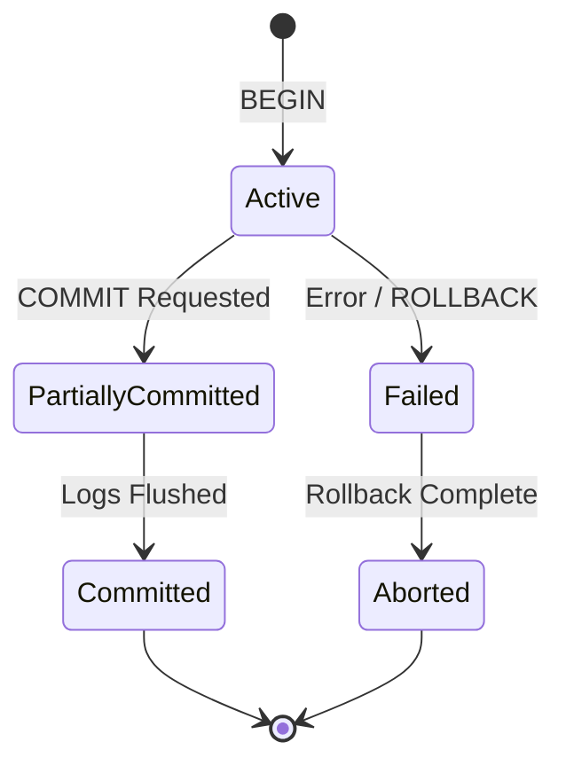
```mermaid
stateDiagram-v2
    [*] --> Active : BEGIN
    Active --> PartiallyCommitted : COMMIT Requested
    PartiallyCommitted --> Committed : Logs Flushed
    Active --> Failed : Error / ROLLBACK
    Failed --> Aborted : Rollback Complete
    Committed --> [*]
    Aborted --> [*]
```

### Basic Transaction Commands
```sql
BEGIN TRANSACTION; -- or just BEGIN (PostgreSQL), START TRANSACTION (MySQL)

UPDATE accounts SET balance = balance - 500 WHERE account_id = 1; -- Debit
UPDATE accounts SET balance = balance + 500 WHERE account_id = 2; -- Credit

-- If everything above succeeds:
COMMIT;

-- If something fails or business logic isn't met:
ROLLBACK;
```

### Savepoints
Allows partial rollbacks within a larger transaction.

```sql
BEGIN;
INSERT INTO audit_log (msg) VALUES ('Transaction started');

SAVEPOINT my_sp;

UPDATE inventory SET stock = stock - 100 WHERE id = 5;
-- Wait, that was a mistake, undo just the inventory update!
ROLLBACK TO SAVEPOINT my_sp; 

COMMIT; -- audit_log insert is committed.
```

### ACID Properties Explained
*   **Atomicity:** "All or nothing." If a transaction has 5 steps and step 4 fails, steps 1-3 are rolled back as if they never happened. (Example: Bank transfer—money leaves account A, MUST enter account B).
*   **Consistency:** The database rules (constraints, cascades) are enforced. The transaction cannot leave the DB in an invalid state. (Example: Cannot commit an order with a negative total if `CHECK (total > 0)` exists).
*   **Isolation:** Concurrent transactions execute as if they were running serially, without interfering with each other. (Example: Two users booking the exact same seat simultaneously—one will wait or fail).
*   **Durability:** Once `COMMIT` is successful, the changes are permanent and survive power loss or crashes (written to non-volatile storage/write-ahead logs).

### Isolation Levels
Define how strictly transactions are isolated from one another. Trade-off between consistency and performance.

1.  **READ UNCOMMITTED (Lowest):** Allows "Dirty Reads" (reading data another transaction modified but hasn't committed yet). If the other transaction rolls back, you read fake data.
2.  **READ COMMITTED (Default in PG/SQL Server):** Prevents Dirty Reads. However, allows "Non-repeatable reads" (if you run `SELECT` twice in the same transaction, another transaction might have `UPDATE`d the data in between, giving you different results).
3.  **REPEATABLE READ (Default in MySQL):** Prevents Dirty and Non-repeatable reads. You will always see the same data across your transaction. However, allows "Phantom Reads" (another transaction might `INSERT` new rows that match your `WHERE` clause).
4.  **SERIALIZABLE (Highest):** Prevents all anomalies. Transactions run as if strictly sequential. Uses heavy locking. Slowest, but safest.

```sql
SET TRANSACTION ISOLATION LEVEL SERIALIZABLE;
BEGIN;
-- ... queries ...
COMMIT;
```

### Locking
*   **Shared Lock (Read Lock):** Multiple transactions can hold this lock. Prevents anyone from getting an Exclusive lock (modifying the data).
*   **Exclusive Lock (Write Lock):** Only one transaction can hold this. Prevents reading (in some isolation levels) and writing.
*   **`FOR UPDATE`:** Manually acquires an exclusive lock on selected rows. Use when you read data with the intent to update it immediately.

```sql
-- Lock specific rows to prevent concurrent modification
SELECT * FROM tickets WHERE status = 'available' LIMIT 1 FOR UPDATE;
-- (Other transactions trying to read these same rows FOR UPDATE will block and wait)

-- SKIP LOCKED: Useful for building queue workers. 
-- Skips rows locked by others and grabs the next available one.
SELECT * FROM job_queue WHERE status = 'pending' LIMIT 1 FOR UPDATE SKIP LOCKED;
```

---

## 8. WINDOW FUNCTIONS

#### 💡 Simple Explanation & Example
**What it is:** Imagine looking at a list of employees and their salaries. A regular `GROUP BY` would squish all employees in the same department into one single row showing the total department salary. You lose the individual employee names!
A **Window Function** lets you keep every single employee's row visible, but adds a new column next to them showing the total department salary. It opens a "window" to look at the group's data without collapsing the rows.

**Example:**
```sql
SELECT 
    employee_name,
    department,
    salary,
    -- The Window Function calculates total per department but keeps every row!
    SUM(salary) OVER(PARTITION BY department) AS total_dept_salary
FROM employees;
```
*Notice how `OVER()` tells the database this is a window function, and `PARTITION BY` tells it to calculate the sum per department.*

---

Window functions compute values over a set of rows (the "window" or "frame") related to the current row, without collapsing the result set (like `GROUP BY` does). They are essential for advanced analytics.

**Syntax Structure:**
`FUNCTION_NAME(args) OVER (PARTITION BY col1 ORDER BY col2 ROWS BETWEEN ...)`

#### 🧠 Mental Model: How `OVER()` and `PARTITION BY` Actually Work

**`OVER()` (The Window Maker):**
Whenever you type `OVER()`, you are telling the database: *"Do not squish these rows! Keep the original rows exactly as they are, but open a 'window' to let me calculate a new column based on a broader group of rows."*

**`PARTITION BY` (The Bucket Divider):**
This lives inside the `OVER(...)` clause. It tells the window exactly how to group the rows for the calculation. 

Think of it like this:

**1. The Original Dataset:**
```text
Department   Employee   Salary
Math         Alice      $50k
Math         Bob        $60k
Physics      Charlie    $70k
Physics      Dave       $80k
```

**2. When you write `SUM(salary) OVER(PARTITION BY Department)`:**
*   **The Partitioning:** It groups the rows into isolated buckets (just like `GROUP BY` does).
    *   *Math Bucket:* Alice, Bob
    *   *Physics Bucket:* Charlie, Dave
*   **The Math:** It calculates the sum for each bucket.
    *   *Math Sum:* $110k
    *   *Physics Sum:* $150k
*   **The Magic of `OVER()`:** Instead of returning just 2 rows (which `GROUP BY` would do), it pastes that bucket's sum onto *every single original row* in that bucket!

**3. The Final Output:**
```text
Department   Employee   Salary   total_dept_salary
Math         Alice      $50k     $110k  <-- Math Bucket Sum pasted here
Math         Bob        $60k     $110k  <-- Math Bucket Sum pasted here
Physics      Charlie    $70k     $150k  <-- Physics Bucket Sum pasted here
Physics      Dave       $80k     $150k  <-- Physics Bucket Sum pasted here
```

### Numbering Functions
#### 🧠 Mental Model: The Ticket Dispenser vs. The Olympic Podium
- **`ROW_NUMBER()`** is like a deli counter ticket dispenser. Everyone gets a unique, strictly sequential number (1, 2, 3, 4), even if they have the exact same score. There are NEVER ties.
- **`RANK()`** is like the Olympic podium. If two people tie for Gold, they both get 1st place (1, 1). But the next person gets Bronze (3rd place). It leaves gaps!
- **`DENSE_RANK()`** is a friendlier podium. Ties get the same rank (1, 1), but the very next person gets 2nd place. No gaps!

**Execution Order Note:** Window functions evaluate *after* the `WHERE` and `GROUP BY` clauses, meaning they number the rows that survived the initial filtering.

**1. `ROW_NUMBER()`**
Assigns a unique sequential integer to rows within a partition.
```sql
-- Example: Get the Top 2 highest paid employees per department
WITH RankedEmployees AS (
    SELECT id, name, department_id, salary,
           ROW_NUMBER() OVER (PARTITION BY department_id ORDER BY salary DESC) as rn
    FROM employees
)
SELECT * FROM RankedEmployees WHERE rn <= 2;
```

#### 🔍 Step-by-Step Execution Order for the Above Query:
1.  **`FROM employees` (Inner Query)**: The database pulls all raw data from the `employees` table.
2.  **`PARTITION BY department_id`**: The database groups these employees into temporary "buckets" based on their department.
3.  **`ORDER BY salary DESC`**: *Inside* each department bucket, the database sorts the employees from highest salary to lowest.
4.  **`ROW_NUMBER()`**: Now that they are grouped and sorted, the "ticket dispenser" assigns `1` to the highest paid, `2` to the second highest, etc., restarting at `1` when it moves to the next department bucket.
5.  **`WITH RankedEmployees AS (...)`**: This entire intermediate result (the raw data + the new `rn` numbering column) is saved in a temporary workspace named `RankedEmployees`.
6.  **`SELECT * FROM RankedEmployees` (Outer Query)**: The database prepares to read from the temporary workspace.
7.  **`WHERE rn <= 2`**: The outer query scans the workspace and filters out anyone whose ticket number (`rn`) is 3 or higher, successfully leaving only the top 2 earners per department!

**2. `RANK()` vs `DENSE_RANK()`**
Both assign ranks based on ordering.
*   If values tie, they get the same rank.
*   `RANK()` leaves gaps (1, 2, 2, 4).
*   `DENSE_RANK()` leaves no gaps (1, 2, 2, 3).
```sql
SELECT name, score,
       RANK() OVER (ORDER BY score DESC) as rank_with_gaps,
       DENSE_RANK() OVER (ORDER BY score DESC) as dense_rank
FROM game_scores;
```

#### 🔍 Step-by-Step Execution Order for the Above Query:
1. **`FROM game_scores`**: The database pulls the raw scores.
2. **`OVER (ORDER BY score DESC)`**: The database dumps everyone into a single giant bucket and sorts them from highest score to lowest.
3. **`RANK() / DENSE_RANK()`**: The engine walks down the sorted list handing out medals. If two people tie, they both get the exact same medal (e.g., 1st place). `RANK()` will skip the next medal (handing out 3rd place next), while `DENSE_RANK()` will hand out the very next medal (2nd place) regardless of ties.

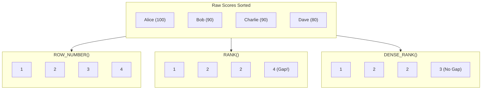
```mermaid
flowchart TD
    subgraph Data ["Raw Scores Sorted"]
        direction TB
        S1["Alice (100)"]
        S2["Bob (90)"]
        S3["Charlie (90)"]
        S4["Dave (80)"]
    end
    
    subgraph RN ["ROW_NUMBER()"]
        direction TB
        R1["1"]
        R2["2"]
        R3["3"]
        R4["4"]
    end

    subgraph RK ["RANK()"]
        direction TB
        K1["1"]
        K2["2"]
        K3["2"]
        K4["4 (Gap!)"]
    end

    subgraph DR ["DENSE_RANK()"]
        direction TB
        D1["1"]
        D2["2"]
        D3["2"]
        D4["3 (No Gap)"]
    end
    
    Data --> RN
    Data --> RK
    Data --> DR
```

**3. `NTILE(n)`**
Distributes rows into a specified number of roughly equal groups (e.g., quartiles, deciles).
```sql
-- Divide products into 4 price tiers (Quartiles)
SELECT product_name, price,
       NTILE(4) OVER (ORDER BY price DESC) as price_quartile
FROM products;
```

#### 🔍 Step-by-Step Execution Order for the Above Query:
1. **`FROM products`**: The database pulls the raw product list.
2. **`OVER (ORDER BY price DESC)`**: It sorts all products from most expensive to least expensive.
3. **`NTILE(4)`**: The engine counts the total number of rows (e.g., 100), divides it by 4 (e.g., 25), and simply chops the sorted list into 4 perfectly equal chunks, assigning `1` to the first chunk, `2` to the second, etc.

### Navigation Functions
#### 🧠 Mental Model: The Time Traveler
Navigation functions let a row reach out and "grab" data from neighboring rows without needing a complex `JOIN`.
- **`LAG(column, 1)`**: Looks in the *rearview mirror*. "Grab the value from the row immediately before me." Perfect for calculating month-over-month growth (Current Month - Previous Month).
- **`LEAD(column, 1)`**: Looks through *binoculars*. "Grab the value from the row immediately after me."
- **`FIRST_VALUE()` / `LAST_VALUE()`**: "Give me the absolute first (or last) row's value inside my current partition bucket."

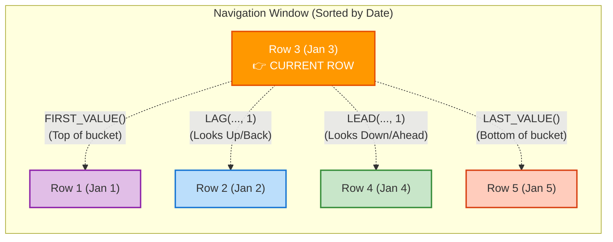
```mermaid
flowchart TD
    subgraph Navigation ["Navigation Window (Sorted by Date)"]
        direction TB
        R1["Row 1 (Jan 1)"]
        R2["Row 2 (Jan 2)"]
        R3["Row 3 (Jan 3) <br> 👉 CURRENT ROW"]
        R4["Row 4 (Jan 4)"]
        R5["Row 5 (Jan 5)"]
        
        R3 -. "LAG(..., 1) <br> (Looks Up/Back)" .-> R2
        R3 -. "LEAD(..., 1) <br> (Looks Down/Ahead)" .-> R4
        R3 -. "FIRST_VALUE() <br> (Top of bucket)" .-> R1
        R3 -. "LAST_VALUE() <br> (Bottom of bucket)" .-> R5
    end
    
    style R3 fill:#ff9800,stroke:#e65100,stroke-width:2px,color:#fff
    style R2 fill:#bbdefb,stroke:#1976d2,stroke-width:2px
    style R4 fill:#c8e6c9,stroke:#388e3c,stroke-width:2px
    style R1 fill:#e1bee7,stroke:#8e24aa,stroke-width:2px
    style R5 fill:#ffccbc,stroke:#d84315,stroke-width:2px
```

**1. `LEAD()` and `LAG()`**
Access data from subsequent or previous rows in the same partition. Incredible for time-series and year-over-year comparisons.
```sql
-- Calculate Day-over-Day revenue growth
SELECT date, daily_revenue,
       LAG(daily_revenue, 1) OVER (ORDER BY date) as previous_day_revenue,
       daily_revenue - LAG(daily_revenue, 1) OVER (ORDER BY date) as daily_difference
FROM sales;
```

#### 🔍 Step-by-Step Execution Order for the Above Query:
1. **`FROM sales`**: The database pulls the raw sales data.
2. **`OVER (ORDER BY date)`**: The database implicitly groups everything into one giant bucket (since there is no `PARTITION BY`) and sorts the bucket chronologically by date.
3. **`LAG(daily_revenue, 1)`**: The database looks at the current day's row, reaches *up* exactly 1 row (to yesterday), grabs that revenue value, and pastes it into the new column.
4. **`SELECT ...`**: It calculates the difference between today's revenue and the pasted yesterday's revenue, returning the final table.

**2. `FIRST_VALUE()`, `LAST_VALUE()`, `NTH_VALUE()`**
Returns specific values from the window frame.
```sql
-- Find the first person hired in each department, displayed next to every employee
SELECT name, department_id, hire_date,
       FIRST_VALUE(name) OVER (PARTITION BY department_id ORDER BY hire_date ASC) as first_hire
FROM employees;
```

#### 🔍 Step-by-Step Execution Order for the Above Query:
1. **`FROM employees`**: Pulls raw employee data.
2. **`PARTITION BY department_id`**: Groups employees into buckets by department.
3. **`ORDER BY hire_date ASC`**: Sorts employees within each bucket from oldest hire to newest.
4. **`FIRST_VALUE(name)`**: The engine looks at the very first row at the top of the current bucket (the oldest hire) and copies their name onto *every single row* in that bucket.

### Aggregate Window Functions
#### 🧠 Mental Model: The Running Calculator
Instead of squishing the whole department into one sum, you can keep a running total. Imagine walking down a line of employees and adding their salaries to a notepad as you pass each one. By the time you reach the end of the line, you have the grand total.

You can use standard aggregates (`SUM`, `AVG`, `MIN`, `MAX`, `COUNT`) as window functions.

**Example 1: Percentage of Total**
```sql
-- Calculate what percentage of total company revenue each department contributes
SELECT department_id, revenue,
       revenue / SUM(revenue) OVER () * 100 as pct_of_total
FROM department_finances;
```

#### 💡 What does an empty `OVER ()` mean?
An empty `OVER ()` means **"Do not partition, and do not sort. Treat the entire table as one single, giant bucket."** 

#### 🔍 Step-by-Step Execution Order for the Above Query:
1. **`FROM department_finances`**: Pulls the department data.
2. **`SUM(revenue) OVER ()`**: Because the window is empty, it calculates the grand total sum of all revenue across the entire table.
3. **`revenue / SUM(...)`**: It takes the current row's individual revenue and divides it by that grand total, giving you the percentage.

**Example 2: Running Totals (Cumulative Sum)**
```sql
SELECT order_date, total_amount,
       SUM(total_amount) OVER (ORDER BY order_date) as cumulative_revenue
FROM orders;
```

#### 🔍 Step-by-Step Execution Order for the Above Query:
1. **`FROM orders`**: Pulls the raw orders.
2. **`ORDER BY order_date`**: Sorts the entire table chronologically.
3. **`SUM(total_amount)`**: Because there is an `ORDER BY` but no `PARTITION BY`, the window automatically defaults to a "Running Calculator" from the beginning of time up to the current row. As the engine moves down the list, it continuously adds the current row's amount to the running grand total.

### Window Frames (`ROWS BETWEEN`)
#### 🧠 Mental Model: The Moving Spotlight
When calculating a moving average (like a 3-day moving average), you don't want to sum the *entire* partition. You want a "spotlight" that only shines on a few specific rows, and that spotlight moves down one row at a time as the database processes the data.

*   `ROWS BETWEEN 2 PRECEDING AND CURRENT ROW`: The spotlight shines on the current row AND the 2 rows directly above it.
*   `ROWS BETWEEN UNBOUNDED PRECEDING AND UNBOUNDED FOLLOWING`: The spotlight illuminates the entire partition bucket from top to bottom (this is the default for standard aggregates).

Controls exactly which rows relative to the current row are included in the calculation.

*   `UNBOUNDED PRECEDING`: From the start of the partition.
*   `N PRECEDING`: N rows before the current row.
*   `CURRENT ROW`: Just the current row.
*   `N FOLLOWING`: N rows after the current row.
*   `UNBOUNDED FOLLOWING`: To the end of the partition.

**Example: Moving Averages**
```sql
-- Calculate a 7-day trailing moving average
SELECT date, revenue,
       AVG(revenue) OVER (
           ORDER BY date 
           ROWS BETWEEN 6 PRECEDING AND CURRENT ROW
       ) as moving_avg_7d
FROM daily_sales;
```

#### 🔍 Step-by-Step Execution Order for the Above Query:
1. **`FROM daily_sales`**: Pulls the raw sales data.
2. **`ORDER BY date`**: Sorts the data chronologically.
3. **`ROWS BETWEEN 6 PRECEDING AND CURRENT ROW`**: As the database evaluates a specific row, it creates a "moving spotlight". The spotlight shines on the current row and the 6 rows immediately above it (representing 7 days total).
4. **`AVG(revenue)`**: It calculates the average revenue of only the 7 rows currently illuminated by the spotlight, pastes that average next to the current row, and then moves the spotlight down one row to repeat the process.

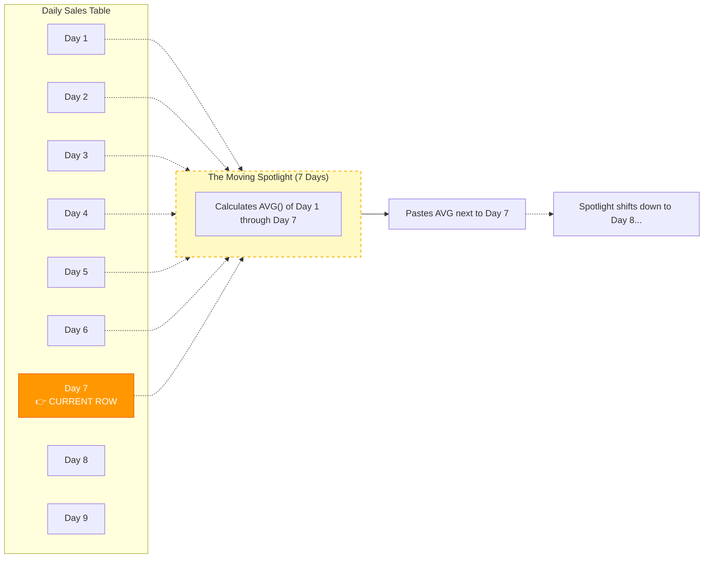
```mermaid
flowchart LR
    subgraph Table ["Daily Sales Table"]
        direction TB
        D1["Day 1"]
        D2["Day 2"]
        D3["Day 3"]
        D4["Day 4"]
        D5["Day 5"]
        D6["Day 6"]
        D7["Day 7 <br> 👉 CURRENT ROW"]
        D8["Day 8"]
        D9["Day 9"]
    end
    
    subgraph Window ["The Moving Spotlight (7 Days)"]
        direction TB
        W["Calculates AVG() of Day 1 through Day 7"]
    end
    
    D1 -.-> Window
    D2 -.-> Window
    D3 -.-> Window
    D4 -.-> Window
    D5 -.-> Window
    D6 -.-> Window
    D7 -.-> Window
    
    Window --> Result["Pastes AVG next to Day 7"]
    Result -.-> Move["Spotlight shifts down to Day 8..."]
    
    style Window fill:#fff9c4,stroke:#fbc02d,stroke-width:2px,stroke-dasharray: 5 5
    style D7 fill:#ff9800,stroke:#e65100,color:#fff
```

---

## 9. CTES AND RECURSIVE QUERIES

Common Table Expressions (CTEs) define temporary, named result sets. They make complex queries drastically more readable by breaking them into logical steps.

### Basic CTEs
#### 🧠 Mental Model: The Assembly Station
Imagine building a car. Instead of doing everything on one giant chaotic assembly line, you create smaller "sub-stations."
*   **Station 1 (CTE 1):** Builds the engine.
*   **Station 2 (CTE 2):** Builds the chassis.
*   **Final Assembly (Outer Query):** Takes the finished engine and chassis and puts them together.
A CTE creates a temporary, named workspace that exists ONLY for the split-second your main query is running.

#### 📊 Diagram: CTE Execution Flow
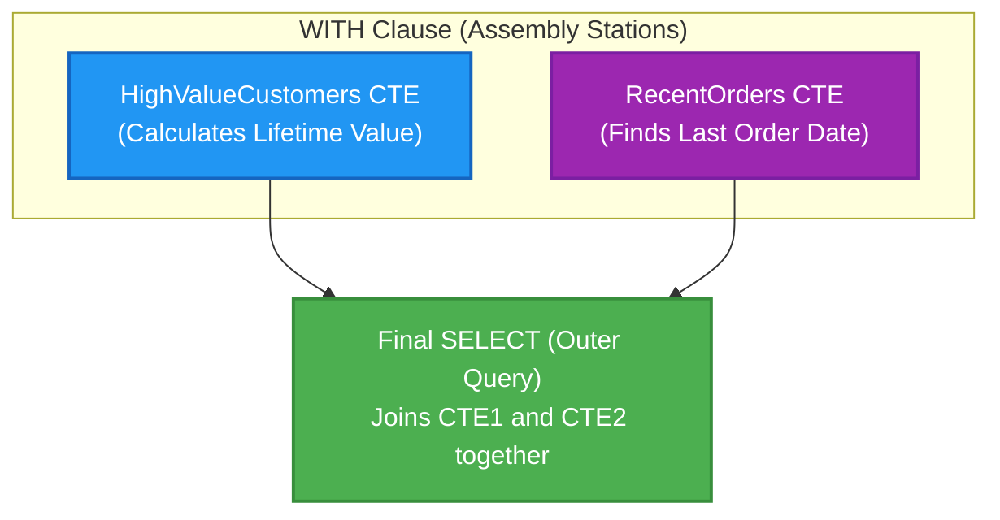
```mermaid
flowchart TD
    subgraph "WITH Clause (Assembly Stations)"
        CTE1["HighValueCustomers CTE<br/>(Calculates Lifetime Value)"]
        CTE2["RecentOrders CTE<br/>(Finds Last Order Date)"]
    end
    Final["Final SELECT (Outer Query)<br/>Joins CTE1 and CTE2 together"]
    CTE1 --> Final
    CTE2 --> Final
    style CTE1 fill:#2196F3,stroke:#1565C0,stroke-width:2px,color:#fff
    style CTE2 fill:#9C27B0,stroke:#7B1FA2,stroke-width:2px,color:#fff
    style Final fill:#4CAF50,stroke:#388E3C,stroke-width:2px,color:#fff
```

```sql
-- Example 1: Simplifying complex logic
WITH HighValueCustomers AS (
    SELECT customer_id, SUM(total) as lifetime_value
    FROM orders GROUP BY customer_id HAVING SUM(total) > 10000
),
RecentOrders AS (
    SELECT customer_id, MAX(order_date) as last_order_date
    FROM orders GROUP BY customer_id
)
SELECT h.customer_id, h.lifetime_value, r.last_order_date
FROM HighValueCustomers h
JOIN RecentOrders r ON h.customer_id = r.customer_id;
```

#### 🔍 Step-by-Step Execution Order for the Above Query:
1. **`HighValueCustomers` CTE**: The engine runs this entire block first, filtering for customers who spent over $10,000, and stores the result in temporary memory.
2. **`RecentOrders` CTE**: The engine runs this second block, finding the last order date for every customer, and stores it in temporary memory.
3. **Final Outer Query**: The engine takes the two temporary tables (`h` and `r`) and `JOIN`s them together. By breaking it into CTEs, the engine doesn't have to calculate the $10,000 filter and the MAX date at the exact same time in one messy, unreadable query.

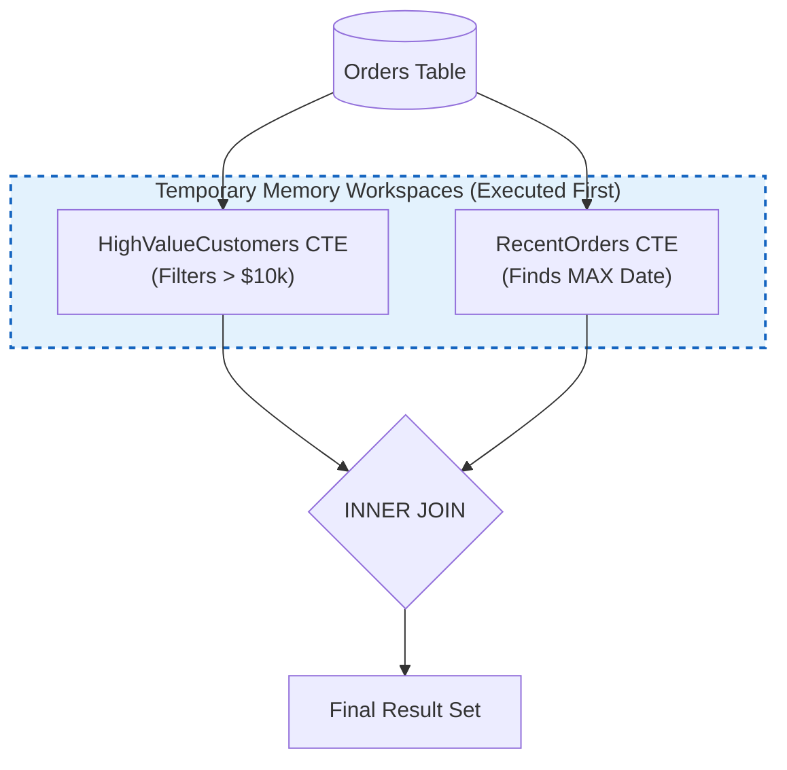
```mermaid
flowchart TD
    DB[(Orders Table)]
    
    subgraph CTEs ["Temporary Memory Workspaces (Executed First)"]
        direction LR
        CTE1["HighValueCustomers CTE <br> (Filters > $10k)"]
        CTE2["RecentOrders CTE <br> (Finds MAX Date)"]
    end
    
    DB --> CTE1
    DB --> CTE2
    
    CTE1 --> JOIN{"INNER JOIN"}
    CTE2 --> JOIN
    
    JOIN --> Output["Final Result Set"]
    
    style CTEs fill:#e3f2fd,stroke:#1565c0,stroke-width:2px,stroke-dasharray: 5 5
```

### Recursive CTEs
#### 🧠 Mental Model: Climbing the Family Tree
Imagine climbing a tree to count all the branches.
1.  **Anchor (Base Case):** You start by standing on the trunk (the CEO). You write down "Trunk".
2.  **UNION ALL:** You prepare to add your next findings to the list.
3.  **Recursive Step:** You look at the Trunk and ask, "What branches are directly attached to me?" You climb up to those branches (Managers), write them down, and then *repeat the question* for each of those branches until there are no more branches left (Leaf nodes / Entry-level employees).

#### 📊 Diagram: Recursive Cycle
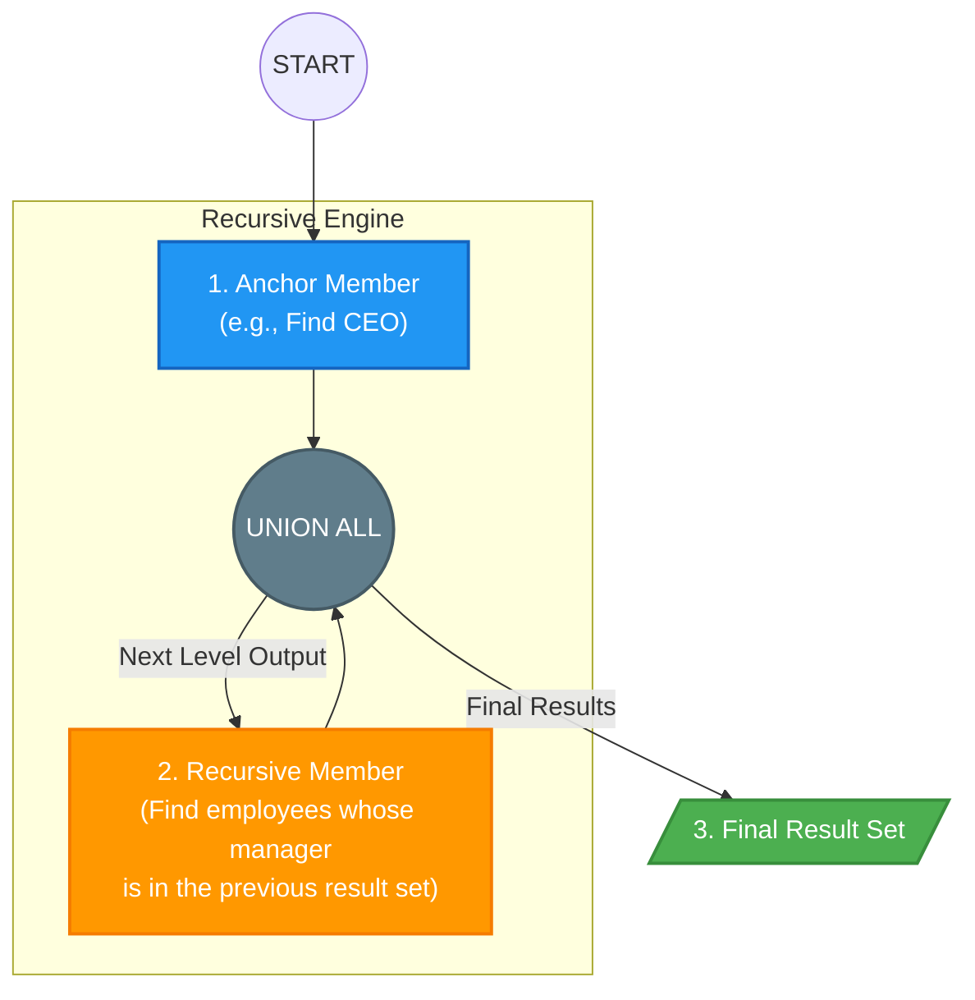
```mermaid
flowchart TD
    Start(("START")) --> Anchor
    subgraph "Recursive Engine"
        Anchor["1. Anchor Member<br/>(e.g., Find CEO)"]
        Union(("UNION ALL"))
        Recursive["2. Recursive Member<br/>(Find employees whose manager<br/>is in the previous result set)"]
    end
    Anchor --> Union
    Recursive --> Union
    Union -->|Next Level Output| Recursive
    Union -->|Final Results| Output[/"3. Final Result Set"/]
    style Anchor fill:#2196F3,stroke:#1565C0,stroke-width:2px,color:#fff
    style Recursive fill:#FF9800,stroke:#F57C00,stroke-width:2px,color:#fff
    style Union fill:#607D8B,stroke:#455A64,stroke-width:2px,color:#fff
    style Output fill:#4CAF50,stroke:#388E3C,stroke-width:2px,color:#fff
```

Used for querying hierarchical data (trees, graphs, org charts). A recursive CTE requires:
1.  An **Anchor member** (the base case).
2.  A `UNION ALL`.
3.  A **Recursive member** that references the CTE itself.

**Example 1: Organizational Chart (Hierarchical Data)**
```sql
WITH RECURSIVE EmployeeHierarchy AS (
    -- 1. Anchor: Start with the CEO (no manager)
    SELECT id, name, manager_id, 1 as level, CAST(name AS VARCHAR(1000)) as path
    FROM employees 
    WHERE manager_id IS NULL
    
    UNION ALL
    
    -- 2. Recursive Step: Find employees whose manager is in the previous result set
    SELECT e.id, e.name, e.manager_id, h.level + 1, CAST(h.path || ' -> ' || e.name AS VARCHAR(1000))
    FROM employees e
    INNER JOIN EmployeeHierarchy h ON e.manager_id = h.id
)
-- 3. Final selection
SELECT name, level, path FROM EmployeeHierarchy ORDER BY path;
```

#### 🔍 Step-by-Step Execution Order for the Above Query:
1. **The Anchor (`SELECT ... WHERE manager_id IS NULL`)**: The database runs this first and finds the CEO (who has no manager). It assigns them `level = 1` and places them in the output bucket.
2. **The `UNION ALL` Trigger**: The database sees this is a recursive query and prepares a looping engine.
3. **The First Recursion (`INNER JOIN EmployeeHierarchy`)**: The database takes the *previous* output (just the CEO) and looks for any employees whose manager is the CEO. It finds the VPs, assigns them `level = 2`, and adds them to the output bucket.
4. **The Second Recursion**: The database takes the *previous* output (just the VPs) and looks for any employees managed by them. It finds Directors, assigns them `level = 3`, and adds them to the output bucket.
5. **Termination**: It loops until a recursive step returns zero new employees.
6. **Outer Query**: It returns the giant accumulated output bucket containing the entire company tree!

**Example 2: Number/Date Generation**
Generating a sequence of dates without a physical calendar table.
```sql
WITH RECURSIVE DateSeries AS (
    SELECT '2024-01-01'::DATE as d -- Anchor
    UNION ALL
    SELECT d + INTERVAL '1 day'    -- Recursive
    FROM DateSeries 
    WHERE d < '2024-01-31'::DATE
)
SELECT d FROM DateSeries;
```

#### 🔍 Step-by-Step Execution Order for the Above Query:
1. **The Anchor**: The engine executes `SELECT '2024-01-01'`. This creates the very first row of the table.
2. **The Recursion**: The engine takes the previous output (`2024-01-01`), adds 1 day to it (`2024-01-02`), and outputs it.
3. **The Loop**: It takes `2024-01-02`, adds 1 day, and outputs `2024-01-03`.
4. **The Termination**: It repeats this cycle until the `WHERE d < '2024-01-31'` condition fails. 
5. **Final Output**: It returns the massive accumulated list of consecutive dates.

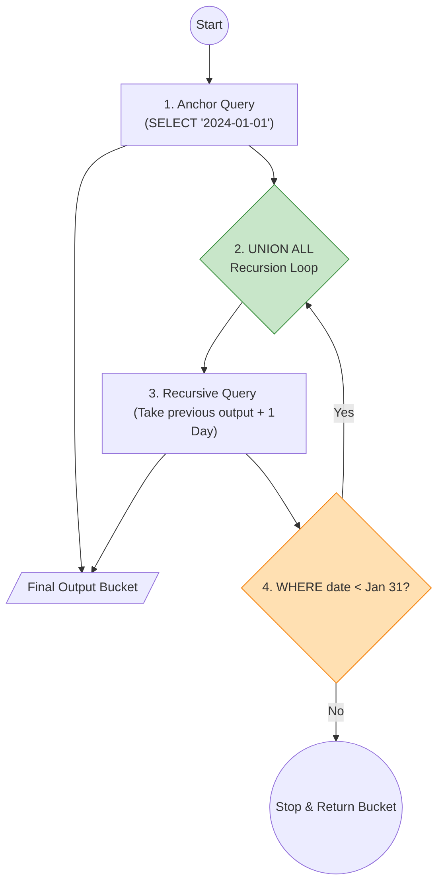
```mermaid
flowchart TD
    Start(("Start")) --> Anchor["1. Anchor Query <br> (SELECT '2024-01-01')"]
    Anchor --> Bucket[/"Final Output Bucket"/]
    
    Anchor --> Loop{"2. UNION ALL <br> Recursion Loop"}
    
    Loop --> Recurse["3. Recursive Query <br> (Take previous output + 1 Day)"]
    Recurse --> Bucket
    
    Recurse --> Check{"4. WHERE date < Jan 31?"}
    Check -- Yes --> Loop
    Check -- No --> Stop(("Stop & Return Bucket"))
    
    style Loop fill:#c8e6c9,stroke:#388e3c
    style Check fill:#ffe0b2,stroke:#f57c00
```

---

## 10. ADVANCED SQL

### Stored Procedures vs User-Defined Functions (UDFs)

#### 🧠 Mental Model: The Calculator vs. The Factory Worker
*   **Functions (The Calculator)**: You hand it numbers, it computes a result, and hands a number back. It is strictly **read-only**. You use it *inside* a `SELECT` statement (e.g., `SELECT get_tax(price)`). It **cannot** alter the database (`INSERT`/`UPDATE`) and **cannot** manage transactions (`COMMIT`/`ROLLBACK`).
*   **Procedures (The Factory Worker)**: You tell it to do a job. It can run massive batch jobs, modify tables, and importantly, it **can** control Transactions (it can `COMMIT` halfway through, or `ROLLBACK` on failure). You do not use it in a `SELECT`; you call it directly (e.g., `CALL daily_cleanup()`).

| Feature | User-Defined Function (UDF) | Stored Procedure |
| :--- | :--- | :--- |
| **Primary Goal** | Compute and return a value | Perform a business action |
| **Usage** | Inside a query: `SELECT my_func()` | Standalone: `CALL my_proc()` |
| **DML Allowed?** | No (Read-only) | Yes (`INSERT`, `UPDATE`, `DELETE`) |
| **Transactions?** | No | Yes (Can `COMMIT` / `ROLLBACK`) |

```sql
-- PostgreSQL Function Example (The Calculator)
CREATE OR REPLACE FUNCTION get_discount(price NUMERIC, tier VARCHAR)
RETURNS NUMERIC AS $$
BEGIN
    IF tier = 'Gold' THEN RETURN price * 0.20;
    ELSIF tier = 'Silver' THEN RETURN price * 0.10;
    ELSE RETURN 0;
    END IF;
END;
$$ LANGUAGE plpgsql;

-- Usage: Used inside a standard SELECT query
SELECT product, price, get_discount(price, customer_tier) FROM sales;
```

### Triggers
#### 🧠 Mental Model: The DB Tripwire
Triggers are invisible tripwires attached to a table. When a specific event happens (`INSERT`, `UPDATE`, or `DELETE`), the tripwire snaps and automatically runs a function. They are heavily used for **Audit Logging** (tracking who changed what) and **Validation** (rejecting bad data before it saves).

*   **`BEFORE` Triggers**: The tripwire snaps *before* the data is saved. Use this to modify the incoming data or cancel the save entirely.
*   **`AFTER` Triggers**: The data is already saved. Use this to log the change to an audit table or cascade the update elsewhere.

```sql
-- Example: Audit logging trigger (PostgreSQL)

-- 1. Create the function the tripwire will trigger
CREATE FUNCTION log_price_change() RETURNS trigger AS $$
BEGIN
    -- 'NEW' holds the incoming data. 'OLD' holds the existing data in the DB.
    IF NEW.price <> OLD.price THEN
        INSERT INTO price_audit (product_id, old_price, new_price, changed_at)
        VALUES (OLD.id, OLD.price, NEW.price, NOW());
    END IF;
    RETURN NEW;
END;
$$ LANGUAGE plpgsql;

-- 2. Attach the tripwire to the table
CREATE TRIGGER trg_price_change
AFTER UPDATE ON products
FOR EACH ROW
EXECUTE FUNCTION log_price_change();
```

#### 🔍 Step-by-Step Execution Order for a Trigger:
1. **The Event**: A user runs `UPDATE products SET price = 50 WHERE id = 1;` (The old price was 40).
2. **Memory Allocation**: The database intercepts the command. It temporarily places the existing row into a pseudo-record called `OLD` (price: 40) and the requested changes into `NEW` (price: 50).
3. **The Tripwire**: The database sees the `AFTER UPDATE` trigger on the `products` table.
4. **The Function**: It executes `log_price_change()`.
5. **The Logic**: The function checks `IF NEW.price (50) <> OLD.price (40)`. It is true! It inserts a new row into the `price_audit` table documenting the change.

### JSON Processing (PostgreSQL JSONB focus)
#### 🧠 Mental Model: The Schema-less Vault
Historically, relational databases required rigid columns. If a product had 50 optional specs, you needed 50 empty columns. With `JSONB`, you have a "Schema-less Vault." You can dump a massive, deeply nested dictionary of data into a single column, and PostgreSQL can query *inside* that dictionary instantly.

**The Golden Rule of JSON Operators:**
*   **`->` (Single Arrow)**: Returns a **JSON Object**. Use this when you need to keep digging deeper into the nest.
*   **`->>` (Double Arrow)**: Returns pure **TEXT**. Use this at the very end of your chain when you actually want to read the value or use it in a `WHERE` clause.

```sql
-- Create table with JSONB column
CREATE TABLE user_profiles (id SERIAL, data JSONB);
INSERT INTO user_profiles (data) VALUES ('{"name": "Alice", "age": 30, "tags": ["sql", "python"]}');

-- ❌ BAD: Returns a JSON object {"name": "Alice"}. Hard to filter on.
SELECT data->'name' FROM user_profiles; 

-- ✅ GOOD: Returns raw text "Alice".
SELECT data->>'name' AS name FROM user_profiles;

-- Filter by JSON property (Requires ->> to compare to text '30')
SELECT * FROM user_profiles WHERE data->>'age' = '30';

-- Filter if a JSON array contains a specific value (@> operator)
SELECT * FROM user_profiles WHERE data->'tags' @> '"sql"';

-- Update a specific field deeply nested inside the JSON (jsonb_set)
UPDATE user_profiles
SET data = jsonb_set(data, '{age}', '31')
WHERE data->>'name' = 'Alice';
```

> [!TIP]
> **Why JSONB is insanely fast:** Postgres converts `JSONB` into a binary format when saving. You can place a **GIN Index** on a `JSONB` column. This means querying `WHERE data->>'age' = '30'` on a table with 10 million JSON documents returns instantly, exactly as fast as if `age` was a normal indexed SQL column!

### EXPLAIN / Query Plan Analysis

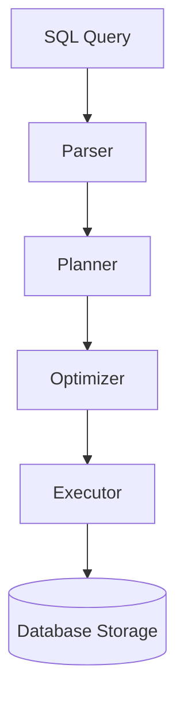
```mermaid
graph TD
    A["SQL Query"] --> B["Parser"]
    B --> C["Planner"]
    C --> D["Optimizer"]
    D --> E["Executor"]
    E --> F[("Database Storage")]
```

To optimize a query, you must look at how the DB engine executes it using `EXPLAIN`.

```sql
-- Add ANALYZE to actually run the query and get real timings (PostgreSQL)
EXPLAIN ANALYZE SELECT * FROM users WHERE email = 'test@test.com';
```
**Things to look for in the output:**
*   **Seq Scan (Table Scan):** Bad for large tables. Means the DB read every row sequentially. Usually means a missing index.
*   **Index Scan:** Good. DB traversed the B-tree to find specific rows.
*   **Index Only Scan:** Excellent. DB got all needed data straight from the index without touching the table heap.
*   **Nested Loop:** Good for small datasets, terrible for large ones.
*   **Hash Join / Merge Join:** Expected for large data joins.
*   **Actual Rows vs Estimated Rows:** If these differ wildly, your database statistics are out of date (`RUN ANALYZE table_name;`).

### 15 Essential Query Optimization Techniques
1.  **Do not use `SELECT *`**: Network I/O is expensive.
2.  **Index filtering conditions:** Ensure columns in `WHERE` and `JOIN ON` clauses are indexed.
3.  **Avoid functions on left-side of WHERE:** `WHERE YEAR(date) = 2023` breaks indexes (non-sargable). Use `WHERE date >= '2023-01-01'`.
4.  **Covering Indexes:** If a query constantly asks for `colA` and `colB` based on `colC`, create an index on `colC INCLUDE (colA, colB)`.
5.  **Use `EXISTS` over `IN`:** For large subqueries, `EXISTS` stops searching the moment it finds one match (early exit), whereas `IN` evaluates everything.
6.  **`UNION ALL` over `UNION`:** `UNION` forces a massive internal sort to remove duplicates.
7.  **Pagination:** Avoid high `OFFSET`. Use Keyset/Cursor pagination (`WHERE id > last_seen_id`).
8.  **Avoid Correlated Subqueries:** Subqueries that rely on the outer query execute row-by-row. Rewrite using `JOIN` or Window Functions.
9.  **Batch Inserts/Updates:** Never run 1,000 individual `INSERT` statements. Run one statement with 1,000 values.
10. **Partitioning:** Partition massive tables by date range to allow quick dropping of old data and parallel processing.
11. **Connection Pooling:** Use PgBouncer or similar to avoid the huge overhead of constantly opening/closing DB connections.
12. **Avoid Implicit Conversions:** `WHERE string_col = 123` forces the DB to convert every string to a number to check, ignoring indexes.
13. **Update Statistics:** DB engines use statistics to build plans. Run `ANALYZE` or `UPDATE STATISTICS` regularly.
14. **Use Temporary Tables for complex aggregations:** If joining 10 tables takes too long, break it up. Select intermediate data into a temp table, index it, then join.
15. **Pre-aggregate Data:** Use Materialized Views or ETL jobs to pre-calculate daily rollups instead of running heavy `GROUP BY` queries on live data.

---

## 11. PRACTICAL SQL PATTERNS

### 1. Gap Detection (Missing Sequences)
Finding missing sequential numbers (e.g., finding skipped invoice numbers).
```sql
SELECT a.id + 1 AS gap_start, MIN(b.id) - 1 AS gap_end
FROM invoices a
LEFT JOIN invoices b ON a.id < b.id
GROUP BY a.id
HAVING a.id + 1 < MIN(b.id);
```

### 2. Gaps and Islands Problem
Grouping contiguous sequential data (islands) and separating breaks (gaps). E.g., find periods of continuous user login streaks.
```sql
WITH Grouped AS (
    SELECT login_date,
           -- Subtracting the row number (as days) from the date. 
           -- Contiguous dates will result in the same "anchor" date.
           login_date - CAST(ROW_NUMBER() OVER(ORDER BY login_date) AS INT) as grp
    FROM user_logins
    WHERE user_id = 1
)
SELECT MIN(login_date) as streak_start, 
       MAX(login_date) as streak_end,
       COUNT(*) as streak_length
FROM Grouped
GROUP BY grp
ORDER BY streak_start;
```

### 3. Pivot / Crosstab
Transforming row data into columns.
```sql
-- Manual Pivot using conditional aggregation (works in all dialects)
SELECT year,
    SUM(CASE WHEN quarter = 'Q1' THEN revenue ELSE 0 END) AS Q1,
    SUM(CASE WHEN quarter = 'Q2' THEN revenue ELSE 0 END) AS Q2,
    SUM(CASE WHEN quarter = 'Q3' THEN revenue ELSE 0 END) AS Q3,
    SUM(CASE WHEN quarter = 'Q4' THEN revenue ELSE 0 END) AS Q4
FROM financial_results
GROUP BY year;
```

### 4. Hierarchical Data Models Comparison
| Model | Write Speed | Read Speed (Querying Tree) | Deletion | Use Case |
| :--- | :--- | :--- | :--- | :--- |
| **Adjacency List (manager_id)** | Fast | Slow (Requires Recursive CTE) | Difficult | Standard org charts, simple relations. |
| **Materialized Path ('1/4/9')** | Fast | Fast (using `LIKE '1/4/%'`) | Moderate | File systems, simple hierarchies. |
| **Nested Set (lft, rgt values)** | Very Slow | Extremely Fast | Complex | Rarely updated taxonomies (product categories). |
| **Closure Table (separate table)**| Moderate | Fast | Easy | Complex, many-to-many hierarchies. |

---

## 12. QUICK REFERENCE TABLES

### String Functions Summary
| Function | Description | Example Output (`str` = 'Hello') |
| :--- | :--- | :--- |
| `LENGTH(str)` / `LEN()` | Returns string length. | 5 |
| `LOWER(str)` / `UPPER(str)`| Changes case. | 'hello' / 'HELLO' |
| `TRIM(str)` | Removes leading/trailing spaces. | 'Hello' |
| `SUBSTRING(str, 1, 3)` | Extracts part of string. | 'Hel' |
| `REPLACE(str, 'l', 'x')` | Replaces characters. | 'Hexxo' |
| `COALESCE(val1, val2)` | Returns first non-NULL value. | (Not strictly string, but vital) |

### Math Functions Summary
| Function | Description | Example |
| :--- | :--- | :--- |
| `ABS(x)` | Absolute value. | `ABS(-5)` → 5 |
| `CEIL(x)` / `CEILING()` | Rounds up to nearest integer. | `CEIL(4.2)` → 5 |
| `FLOOR(x)` | Rounds down to nearest integer. | `FLOOR(4.8)` → 4 |
| `ROUND(x, d)` | Rounds to `d` decimal places. | `ROUND(4.56, 1)` → 4.6 |
| `MOD(x, y)` | Remainder of division. | `MOD(10, 3)` → 1 |

### Conditional Functions
| Function | Dialect | Equivalent To |
| :--- | :--- | :--- |
| `COALESCE(a, b)` | Standard | Returns `a` if not null, else `b`. Can take >2 args. |
| `NULLIF(a, b)` | Standard | Returns NULL if `a = b`, else returns `a`. (Great for preventing divide-by-zero: `x / NULLIF(y, 0)`) |
| `IFNULL(a, b)` | MySQL | Same as 2-arg COALESCE. |
| `ISNULL(a, b)` | SQL Server | Same as 2-arg COALESCE. |
| `NVL(a, b)` | Oracle | Same as 2-arg COALESCE. |

---

## 13. Database Architectural Taxonomy & Enterprise Admin Mastery

### 🌐 Intuitive Real-World Analogy (The Metropolitan Storage & Transport Matrix):
*   **RDBMS (PostgreSQL / MySQL):** An automated underground bank vault safety ledger. Every transaction is heavily secured, audited, and strictly validated against ACID guarantees. Ideal for financial accounts, order billing, and structured user identity schemas!
*   **In-Memory Cache (Redis / Memcached):** A whiteboard sitting directly on your office desk. Extremely lightning-fast read/write microsecond access ($O(1)$ lookup), but when power goes out or cleaning staff arrives, data vanishes (unless snapshot strategies like RDB/AOF are enabled!). Ideal for session tokens, leaderboards, rate-limiting semaphores, and Pub/Sub streams!
*   **Document & Wide-Column NoSQL (MongoDB / DynamoDB / Cassandra):** An expansive industrial shipping warehouse with open storage bays and flexible crates. You can stack crates of varying shapes and sizes without pre-defining exact internal layouts (schema-less / polymorphic JSON documents). Ideal for IoT device telemetry streams, rapidly evolving product catalogs, and massive horizontal scaling!
*   **Vector Databases for AI & RAG (pgvector / Milvus / ChromaDB / Pinecone / Qdrant):** An art curation museum. Instead of locating items by exact barcode or title, artworks are mapped across a multi-dimensional semantic gallery based on theme and conceptual resemblance (high-dimensional floating-point embeddings). When querying for "serene autumn sunrise," it navigates directly to the closest mathematical clusters (using Cosine similarity `<=>` distance and HNSW graph traversal!) even if those specific words never appear in the metadata!
*   **Time-Series & OLAP Analytics (ClickHouse / TimescaleDB / Snowflake / DuckDB):** A high-speed multi-lane freight highway optimized for massive volume transport and columnar compression. Instead of inspecting individual cars (rows), it computes statistics across entire traffic streams simultaneously!

### Comprehensive Database Selection Flowchart (Mermaid):
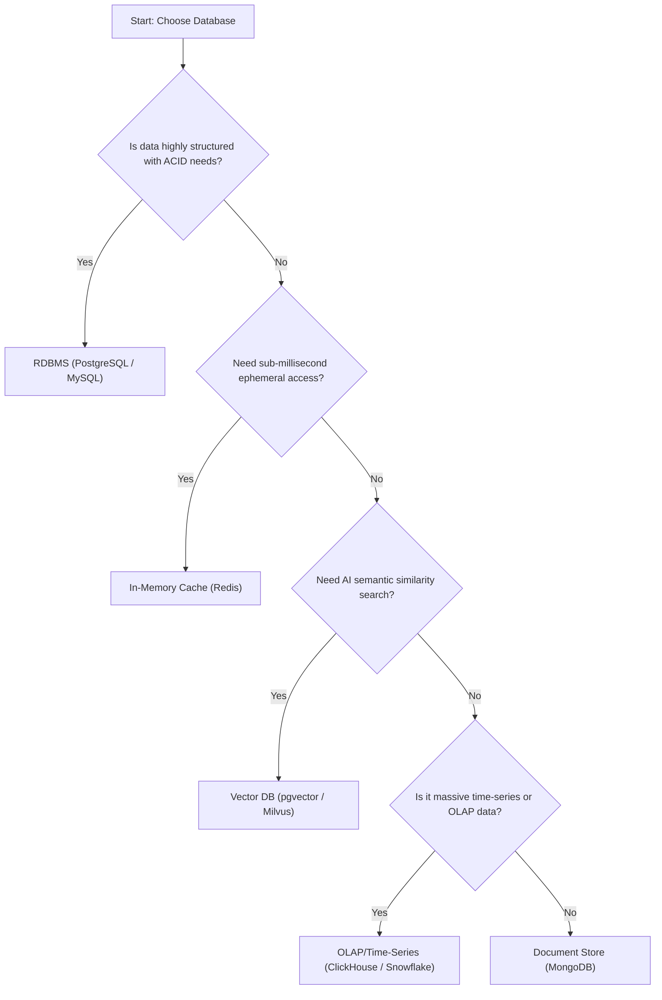
```mermaid
flowchart TD
    Start["Start: Choose Database"] --> Structured{"Is data highly structured with ACID needs?"}
    Structured -- Yes --> RDBMS["RDBMS (PostgreSQL / MySQL)"]
    Structured -- No --> Cache{"Need sub-millisecond ephemeral access?"}
    Cache -- Yes --> Redis["In-Memory Cache (Redis)"]
    Cache -- No --> Semantics{"Need AI semantic similarity search?"}
    Semantics -- Yes --> VectorDB["Vector DB (pgvector / Milvus)"]
    Semantics -- No --> Analytics{"Is it massive time-series or OLAP data?"}
    Analytics -- Yes --> OLAP["OLAP/Time-Series (ClickHouse / Snowflake)"]
    Analytics -- No --> NoSQL["Document Store (MongoDB)"]
```

### Enterprise Database Management & Admin Mastery Suite:
*   **PostgreSQL (RDBMS):** Active lock inspection (`pg_stat_activity`), VACUUM & index maintenance (`VACUUM FULL ANALYZE;`, `REINDEX TABLE;`), RBAC grants (`GRANT SELECT, INSERT ON ALL TABLES...`), and fast parallel backups (`pg_dump -Fd -j 4 -U postgres dbname -f /backup/dir` / `pg_restore`).
*   **MySQL / MariaDB (RDBMS):** Process inspection (`SHOW FULL PROCESSLIST;`, `KILL <id>;`), storage engine optimization (`OPTIMIZE TABLE table_name;`), replication lag verification (`SHOW REPLICAS;` / `SHOW SLAVE STATUS;`), and consistent dumping (`mysqldump --single-transaction --quick -u root -p dbname > backup.sql`).
*   **Redis (In-Memory DB):** Memory profiling (`INFO memory`, `MEMORY STATS`), safe production iteration (`SCAN 0 MATCH "session:*" COUNT 100` instead of dangerous `KEYS *`!), latency profiling (`redis-cli --latency`), and persistence control (`BGSAVE`, `BGREWRITEAOF`).
*   **MongoDB / Document Stores:** Index generation (`db.collection.createIndex({ "user_id": 1, "created_at": -1 }, { background: true })`), profiler execution (`db.setProfilingLevel(2)`), and backup mechanics (`mongodump --db=analytics --out=/backup/` / `mongorestore`).
*   **AI Vector DB Management (PostgreSQL with `pgvector`):** Enabling vector support (`CREATE EXTENSION IF NOT EXISTS vector;`), defining embedding schemas (`embedding vector(1536)`), indexing for rapid similarity lookups (`CREATE INDEX ON ai_documents USING hnsw (embedding vector_cosine_ops);`), and querying semantic distance (`SELECT doc_id, content FROM ai_documents ORDER BY embedding <=> '[0.012, -0.045, ...]' LIMIT 5;`).

---

## 14. Visualizing & Mental-Model Decomposition of Complex SQL Queries

### 🌐 The Mental Model (The Factory Assembly Line vs. Lexical Order):
Explain why complex analytical SQL feels difficult to write: because human syntax (Lexical Order: `SELECT -> FROM -> WHERE -> GROUP BY`) is written *in reverse* compared to how the database query engine actually evaluates data (Logical Order: `FROM/JOIN -> WHERE -> GROUP BY -> HAVING -> SELECT -> DISTINCT -> ORDER BY -> LIMIT`)!
Demonstrate how to decompose massive queries into modular Common Table Expressions (CTEs), turning complex nested subquery spaghetti (`SELECT ... FROM (SELECT ... FROM ...)`) into a clean, linear **Factory Assembly Line** where each CTE acts as an isolated processing station!

### Two Print-Ready Visual Mermaid Architecture Diagrams:

**Diagram 1 (Logical vs Lexical Order):**
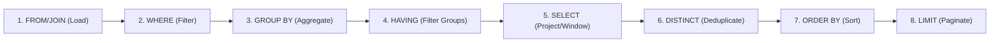
```mermaid
flowchart LR
    FROM["1. FROM/JOIN (Load)"] --> WHERE["2. WHERE (Filter)"]
    WHERE --> GROUP["3. GROUP BY (Aggregate)"]
    GROUP --> HAVING["4. HAVING (Filter Groups)"]
    HAVING --> SELECT["5. SELECT (Project/Window)"]
    SELECT --> DISTINCT["6. DISTINCT (Deduplicate)"]
    DISTINCT --> ORDER["7. ORDER BY (Sort)"]
    ORDER --> LIMIT["8. LIMIT (Paginate)"]
```

**Diagram 2 (Modular CTE Pipeline Decomposition):**
```mermaid
flowchart TD
    BaseOrders["orders"] --> CTE1["territory_sales (CTE)"]
    BaseReps["reps"] --> CTE1
    CTE1 --> CTE2["ranked_performance (CTE)"]
    CTE2 --> Final["Final SELECT Projection"]
```

### Step-by-Step Problem Deconstruction & Complete Working Code Suite:
Present an intimidating real-world business intelligence challenge: *"Find the top 3 revenue-generating sales reps in each operational territory who exceeded their quarterly target ($100,000), displaying their rolling 3-month sales moving average and their percentage contribution to their territory's total revenue."*

Provide the step-by-step visual logic explanation for each CTE building block.

```sql
WITH territory_totals AS (
    -- Step 1: Calculate total revenue per territory for percentage contribution
    SELECT 
        territory_id,
        SUM(revenue) AS total_territory_revenue
    FROM sales
    WHERE quarter = 'Q4'
    GROUP BY territory_id
),
rep_metrics AS (
    -- Step 2: Calculate individual rep metrics including moving averages
    SELECT 
        s.rep_id,
        s.territory_id,
        s.revenue,
        AVG(s.revenue) OVER(
            PARTITION BY s.rep_id 
            ORDER BY s.month 
            ROWS BETWEEN 2 PRECEDING AND CURRENT ROW
        ) AS rolling_3_month_avg
    FROM sales s
    WHERE s.quarter = 'Q4'
),
ranked_performance AS (
    -- Step 3: Rank reps within their territories and filter by target
    SELECT 
        rm.rep_id,
        rm.territory_id,
        rm.revenue,
        rm.rolling_3_month_avg,
        tt.total_territory_revenue,
        (rm.revenue / tt.total_territory_revenue) * 100 AS pct_contribution,
        DENSE_RANK() OVER(
            PARTITION BY rm.territory_id 
            ORDER BY rm.revenue DESC
        ) AS rank_in_territory
    FROM rep_metrics rm
    JOIN territory_totals tt ON rm.territory_id = tt.territory_id
    WHERE rm.revenue > 100000
)
-- Step 4: Final Projection
SELECT 
    rep_id,
    territory_id,
    revenue,
    rolling_3_month_avg,
    pct_contribution
FROM ranked_performance
WHERE rank_in_territory <= 3
ORDER BY territory_id, rank_in_territory;
```

*   **💡 Best Practice:** Always construct complex analytical queries using Common Table Expressions (CTEs) rather than deeply nested subqueries to ensure clean readability, intuitive testing, and seamless teamwork peer review!
*   **⚠️ Common Pitfalls:** Attempting to reference an alias defined in the `SELECT` clause directly inside a `WHERE` or `GROUP BY` clause (which fails because `WHERE` runs *before* `SELECT`!); running expensive window functions across millions of unindexed rows before filtering out dead data in an initial CTE stage!
*   **🔧 DevOps Pro Tip:** When optimizing or debugging an intimidating 200-line reporting pipeline in production, debug each CTE block independently by temporarily altering the terminal command to `SELECT * FROM intermediate_cte_step LIMIT 10;`. Once verified, attach `EXPLAIN (ANALYZE, BUFFERS)` to the complete pipeline and trace execution nodes from inside-out, aligning every B-Tree Index Scan directly to your visual CTE diagrams!

---

## 15. SQL Keyword & Architectural Concept Disambiguation Master Matrix (When to Use vs. When NEVER to Use)

### 🌐 Intuitive Real-World Analogy (The Master Chef's Knife Rack vs. The Dining Table Silverware)
In database engineering, many SQL keywords and structural clauses sound identical to beginners because they achieve superficially similar goals—like eliminating duplicates (`DISTINCT` vs. `UNIQUE`), filtering rows (`WHERE` vs. `HAVING`), or combining data sets (`UNION` vs. `JOIN`). 
Think of a **heavy butcher cleaver** (`UNIQUE`, `PRIMARY KEY`, `WHERE`) and a **delicate table salad fork** (`DISTINCT`, `HAVING`). Both instruments handle food, but using a heavy butcher cleaver to eat dinner at a fine dining table—or trying to bone a raw 50-pound steer with a plastic salad fork—is a catastrophic failure! Every SQL keyword operates at a strict lifecycle phase where it is legally mandatory, and has explicit operational boundaries where using it is an anti-pattern, a severe performance bottleneck, or a syntax crash!

---

### 🏛️ SQL Execution & Constraint Lifecycle Mapping (Mermaid Architecture Diagram)
This chart illustrates exactly where Database Integrity Rules execute (during writes) vs. where Query Keywords execute (during reads) across the database storage and evaluation engine:

```mermaid
flowchart TD
    subgraph Write_Pipeline ["Write Pipeline (INSERT / UPDATE / DDL)"]
        W1["Client Write Request"] --> W2{"Check Schema & Rules"}
        W2 -- "Enforce UNIQUE / PRIMARY KEY / CHECK" --> W3["B-Tree Index & Table Storage"]
    end

    subgraph Read_Pipeline ["Read Pipeline (SELECT / DQL Engine)"]
        R1["1. FROM / JOIN (Load Tables)"] --> R2["2. WHERE (Filter Raw Rows Before Grouping)"]
        R2 --> R3["3. GROUP BY (Aggregate Group Buckets)"]
        R3 --> R4["4. HAVING (Filter Calculated Groups)"]
        R4 --> R5["5. SELECT Projection (Evaluate Expressions)"]
        R5 --> R6["6. DISTINCT / UNION (Deduplicate & Sort Final Results)"]
        R6 --> R7["7. ORDER BY / LIMIT (Return Output)"]
    end
```

---

### ⚙️ Behind-the-Scenes Query Engine Mechanics: Virtual Tables, Logical Execution Order & Row-First Evaluation

To write production-grade database code, engineers must move beyond reading syntax left-to-right and understand exactly how relational query planners evaluate data in hardware memory.

#### 1. Virtual Result Sets & The `DISTINCT` Filter Mechanics
When you execute a `SELECT` statement, the database query engine compiles your criteria and generates a temporary, virtual table in system memory (formally known as a **Result Set**). 
When you include the `DISTINCT` keyword, the database engine waits until that intermediate virtual result table is fully assembled in memory, iterates across the projected output rows, and mathematically scrubs any exact row duplicates before rendering the final visual data grid to your SQL client.

#### 2. The Complete Logical Query Processing Order (Execution Pipeline)
While SQL grammar requires developers to type commands starting with the `SELECT` clause, the actual underlying database query execution engine evaluates commands in a strictly defined sequential processing order:
1. **`FROM` / `JOIN`** — Identifies, loads, and merges physical tables into a working Cartesian memory workspace.
2. **`WHERE`** — Filters raw individual database rows before any grouping occurs.
3. **`GROUP BY`** — Bundles surviving rows into statistical group buckets.
4. **`HAVING`** — Filters aggregated group summary buckets based on calculations (`SUM`, `COUNT`, `AVG`).
5. **`SELECT` / `DISTINCT`** — Projects requested column attributes, evaluates mathematical expressions, and strips duplicate rows.
6. **`ORDER BY`** — Sorts the final projected output rows chronologically or numerically.
7. **`LIMIT` / `OFFSET`** — Restricts and truncates the final rendered row count returned to the client application.

#### 3. How `WHERE` Works Behind the Scenes: Row-First vs. Column-First Evaluation
A fundamental architectural rule of database systems is that **the database engine evaluates rows first, not columns!**
During the `WHERE` phase, the query parser does not care about what columns you specified in your `SELECT` projection line. It operates strictly at the storage and table level, scanning complete rows vertically to determine if they pass your logical condition.

*   **Step 1: Vertical Row Filtering (`WHERE`)**
    *   The engine navigates to the table specified in the `FROM` clause and inspects the data row-by-row (vertically). For every single row, it evaluates the boolean condition specified in your `WHERE` clause.
    *   If a row successfully matches the condition, **the entire record (including all original table columns)** is preserved inside the database's temporary working memory buffer.
    *   If a row fails the evaluation, the entire record is immediately discarded and purged from temporary working memory.
*   **Step 2: Horizontal Column Projection (`SELECT`)**
    *   **Only after** the `WHERE` clause has fully concluded filtering rows does the query execution engine advance to the `SELECT` projection phase.
    *   The database engine now looks exclusively at the surviving rows in working memory and trims them horizontally, retaining only the specific columns you explicitly requested and discarding the unneeded column data from memory.

#### 💡 A Practical Engineering Example (Step-by-Step Memory Breakdown)
Imagine you manage an `employees` table with 4 columns (`id`, `name`, `department`, `salary`) containing **1,000 physical rows**. You run this analytical query:

```sql
SELECT name FROM employees WHERE salary > 50000;
```

Here is exactly what the database engine executes in hardware memory:
1. **`FROM employees`**: The database targets and opens the table storage structure.
2. **`WHERE salary > 50000` (Row-First Evaluation)**: The database scans all 1,000 rows. It does not inspect just the `name` or `salary` column in isolation; it evaluates complete rows against the wage criteria. Let us assume **200 rows** pass this threshold test. The database engine now retains **200 complete records (containing all 4 columns: `id`, `name`, `department`, `salary`)** inside its active working memory buffer!
3. **`SELECT name` (Column-Second Projection)**: The database engine iterates across those 200 surviving rows and horizontally trims away `id`, `department`, and `salary`. It hands you only the remaining `name` column inside your final visual table result grid!

#### ⚠️ Why This Matters: The Fatal Column Alias Trap
Because physical database rows are evaluated and filtered inside `WHERE` *before* columns are projected inside `SELECT`, **you can never reference a column alias created in your `SELECT` clause inside your `WHERE` clause!**

```sql
-- ❌ FATAL SYNTAX CRASH: Attempting to filter on a SELECT alias inside WHERE
SELECT first_name AS name 
FROM employees 
WHERE name = 'John';
```

*   **Why It Fails:** When the database engine is evaluating rows during the early `WHERE` execution step, the `SELECT` projection step literally has not happened yet—meaning the logical alias `name` **does not yet exist in the engine's symbol dictionary!** To filter successfully, you must always reference the true underlying database column attribute name (`WHERE first_name = 'John'`)!

---

### 1. Deduplication & Identity Mechanics
#### 🔹 `DISTINCT` (The Query Filter)
#### 🔹 `UNIQUE` (The Table Rule)
#### 🔹 `PRIMARY KEY` (The Sovereign Identity Anchor)

#### 📋 Summary of Differences
*   **If you want to** read temporary query data without seeing duplicates in your result set, use **`DISTINCT`**.
*   **If you want to** protect database storage tables from ever receiving duplicate data writes, use **`UNIQUE`**.
*   **If you want to** establish an immutable, strictly non-null master identifier for relational row referencing across foreign keys, use **`PRIMARY KEY`**.

#### 📊 Quick Comparison Table
| Feature / Metric | `DISTINCT` | `UNIQUE` | `PRIMARY KEY` |
| :--- | :--- | :--- | :--- |
| **Type & Classification** | Query keyword / DQL clause | Database structural constraint / DDL rule | Database identity constraint / DDL rule |
| **Primary Purpose** | Filters out duplicate rows from temporary read query results | Prevents duplicate data values from ever being written into a database table | Uniquely identifies every physical row; enforces relational structural integrity |
| **Null Tolerance** | Collapses multiple NULLs into a single NULL output row | Allows NULL values (multiple NULLs permitted in standard SQL, only 1 in SQL Server!) | **Strictly forbids NULL values** (Implicitly enforces `NOT NULL + UNIQUE`) |
| **Quantity per Table** | Unlimited (can apply across any query projection combination) | Multiple unique constraints permitted per table | **Exactly one Primary Key permitted per table** (can be composite multi-column) |

*   **✅ Where it WILL Be Used:** Use `DISTINCT` to clean up legitimate duplicate reporting values resulting from many-to-one analytical joins (`SELECT DISTINCT city FROM orders;`). Use `UNIQUE` across account attributes that must remain mutually exclusive across users (email addresses, SSN numbers, SKU barcodes). Use `PRIMARY KEY` on standard relational row IDs (`user_id BIGINT PRIMARY KEY`).
*   **❌ Where it should NEVER Be Used (Anti-Patterns):** **Never use `DISTINCT` as a lazy bug-fix to hide duplicate rows caused by a broken or incomplete `JOIN` (Cartesian product)!** Using `DISTINCT` to mask a broken join forces the engine to waste massive RAM and CPU cycles building and stripping millions of erroneous rows! Never put `UNIQUE` constraints on low-cardinality status columns (`gender`, `is_active`, `country`), or else your second insert of `'active'` will crash!

---

### 2. Filtering & Condition Matching Mechanics
#### 🔹 `WHERE` (The Raw Row Gatekeeper)
#### 🔹 `HAVING` (The Grouped Aggregate Bouncer)
#### 🔹 `ON` (The Relational Join Bridgekeeper)

#### 📋 Summary of Differences
*   **If you want to** filter raw, unaggregated records directly from disk *before* any grouping occurs, use **`WHERE`**.
*   **If you want to** filter calculated statistical summaries (`SUM`, `COUNT`, `AVG`) *after* rows have been grouped, use **`HAVING`**.
*   **If you want to** specify exactly how two distinct tables bind together during a relational merge, use **`ON`**.

#### 📊 Quick Comparison Table
| Feature / Metric | `WHERE` Clause | `HAVING` Clause | `ON` Clause |
| :--- | :--- | :--- | :--- |
| **Execution Phase** | Runs **before** `GROUP BY` grouping occurs | Runs **after** `GROUP BY` grouping occurs | Runs during the table execution and row pairing phase of a `JOIN` |
| **Target Data Scope** | Individual raw database rows straight from disk or joins | Aggregated statistical group buckets (`COUNT(*) > 5`) | Relational foreign key bindings (`a.user_id = b.user_id`) |
| **Index Utilization** | **Directly leverages B-Tree table indexes** for rapid row lookup | Cannot use standard table indexes; evaluates calculated RAM arrays | Fully utilizes foreign key and primary key table indexes |
| **Aggregate Support** | **Cannot** contain aggregate functions (`WHERE COUNT(*) > 5` crashes!) | **Must** or typically contains aggregate functions | Can contain compound filters, but cannot use group aggregates |

*   **✅ Where it WILL Be Used:** Use `WHERE` to shrink your working dataset early (`WHERE created_at >= '2026-01-01'`). Use `HAVING` to isolate high-performing client groups (`GROUP BY customer_id HAVING SUM(total) > 10000`). Use `ON` to map relational parent-child table linkages (`JOIN orders o ON u.user_id = o.user_id`).
*   **❌ Where it should NEVER Be Used (Anti-Patterns):** **Never use `HAVING` to filter standard unaggregated attributes that could have gone into `WHERE`!** Writing `SELECT dept, COUNT(*) FROM employees GROUP BY dept HAVING dept = 5;` forces a full table scan across the entire company just to throw away 99% of the departments after memory grouping! Always put simple attribute filtering in `WHERE`! Never put simple filtering conditions on the primary left table inside an `ON` clause during a `LEFT JOIN` (it silently converts your left join logic or returns misleading row counts; place them in `WHERE`!).

---

### 3. Set Operations & Combining Datasets
#### 🔹 `UNION` (The Deduplicating Stacker)
#### 🔹 `UNION ALL` (The Rapid Raw Stacker)
#### 🔹 `JOIN` (The Horizontal Column Merger)
#### 🔹 `INTERSECT` (The Commonality Finder)
#### 🔹 `EXCEPT` / `MINUS` (The Discrepancy Subtracter)

#### 📋 Summary of Differences
*   **If you want to** stack rows vertically from two tables while stripping out any duplicate occurrences, use **`UNION`**.
*   **If you want to** achieve maximum performance stacking rows vertically without spending CPU cycles sorting or deduplicating, use **`UNION ALL`**.
*   **If you want to** fuse columns horizontally by pairing related rows across different tables, use **`JOIN`**.
*   **If you want to** return only the precise rows that exist simultaneously in **both** independent datasets, use **`INTERSECT`**.
*   **If you want to** subtract one dataset from another to reveal rows present in the first query but completely missing in the second, use **`EXCEPT`** (or **`MINUS`** in Oracle).

#### 📊 Quick Comparison Table
| Feature / Metric | `UNION` | `UNION ALL` | `JOIN` | `INTERSECT` | `EXCEPT` / `MINUS` |
| :--- | :--- | :--- | :--- | :--- | :--- |
| **Operation Type** | Vertical Set Stacking (Appends Rows) | Vertical Set Stacking (Appends Rows) | Horizontal Column Fusion (Appends Columns) | Set Intersection (Extracts Overlap) | Set Difference (Subtracts Output) |
| **Schema Alignment** | Column counts and data types MUST match | Column counts and data types MUST match | Tables can have completely different schemas | Column counts and data types MUST match | Column counts and data types MUST match |
| **Deduplication Cost** | **High CPU/Memory cost** due to silent sort/hash algorithm | **Zero overhead**: instantly dumps all rows sequentially | Not applicable; matches based on relational `ON` keys | Deduplicates overlapping results automatically | Deduplicates and subtracts sets automatically |

*   **✅ Where it WILL Be Used:** Use `UNION ALL` by default when concatenating historical partitioned archives where rows are already guaranteed to be mutually exclusive (`sales_2025` + `sales_2026`). Use `INTERSECT` to identify overlapping loyalty customers across two different brand acquisitions. Use `EXCEPT` to run fast database reconciliation audits finding records that exist in billing but are missing from shipping fulfillment logs!
*   **❌ Where it should NEVER Be Used (Anti-Patterns):** **Never use standard `UNION` (without ALL) when combining datasets where duplicate rows cannot physically exist!** Using naked `UNION` forces the database engine to execute an expensive hash-table or sort algorithm across millions of rows just to prove zero duplicates exist, degrading performance by up to 10x! Never use `JOIN` to horizontally stack historical archive tables that share identical schemas!

---

### 4. Table & Data Destruction Commands
#### 🔹 `DELETE` (The Surgical Scalpel)
#### 🔹 `TRUNCATE` (The Instant Guillotine)
#### 🔹 `DROP` (The Demolition Wrecking Ball)

#### 📋 Summary of Differences
*   **If you want to** remove specific individual rows while keeping transaction undo logs and firing deletion triggers, use **`DELETE`**.
*   **If you want to** wipe an entire table's rows instantaneously in milliseconds without destroying the schema structure, use **`TRUNCATE`**.
*   **If you want to** permanently erase the table data, schema structure, indexes, constraints, and triggers from the database entirely, use **`DROP`**.

#### 📊 Quick Comparison Table
| Feature / Metric | `DELETE` | `TRUNCATE` | `DROP` |
| :--- | :--- | :--- | :--- |
| **Command Category** | DML (Data Manipulation Language) | DDL (Data Definition Language) | DDL (Data Definition Language) |
| **Target Scope** | Removes specified rows via `WHERE` (or all rows if omitted) | Instantly wipes ALL rows; keeps table schema and indexes intact | Completely destroys ALL data, table schema, indexes, constraints, and triggers |
| **Transaction Rollback** | Fully supported inside an uncommitted transaction block | Dialect-dependent (PostgreSQL supports rollback; MySQL autocommits!) | Cannot be rolled back in MySQL/Oracle; supported in PostgreSQL blocks |
| **Trigger Execution** | Executes `ON DELETE` database auditing triggers row-by-row | **Bypasses all DML triggers** (no row-level auditing fires!) | Destroys triggers along with the table structure |
| **Execution Speed** | Slow on large tables; writes individual row deletions to logs | Millisecond instant execution; deconstructs data pages in metadata | Instant execution; reclaims all table storage space immediately |

*   **✅ Where it WILL Be Used:** Use `TRUNCATE` to instantly wipe daily ETL staging data warehouses or temp batch log tables in milliseconds without transaction log bloat. Use `DELETE` for surgical row removal (`DELETE FROM sessions WHERE expired < NOW()`).
*   **❌ Where it should NEVER Be Used (Anti-Patterns):** **Never use `TRUNCATE` on production compliance or financial accounting tables** where regulatory rules dictate that every deleted record must trigger an audit log insertion (`AFTER DELETE` triggers do not execute during `TRUNCATE`!). Never execute `DELETE FROM huge_table;` without a `WHERE` clause when wiping a 50-million-row staging table—it will generate gigabytes of transaction undo logs and lock the storage database for hours!

---

### 5. Subquery Evaluation & NULL Safeguarding
#### 🔹 `IN` / `NOT IN` (The Static List Checker)
#### 🔹 `EXISTS` / `NOT EXISTS` (The Correlated Radar Scout)
#### 🔹 `ANY` / `SOME` (The Flexible Comparator)
#### 🔹 `ALL` (The Strict Universal Comparator)

#### 📋 Summary of Differences
*   **If you want to** match a single value against a small, static in-memory list or clean non-null subquery, use **`IN`** (`status IN ('pending', 'active')`).
*   **If you want to** perform lightning-fast, short-circuit boolean existence checking across massive indexed tables without risking fatal NULL traps, use **`EXISTS`** / **`NOT EXISTS`**.
*   **If you want to** evaluate whether an attribute is greater than, less than, or equal to **at least one** candidate value returned by a subquery, use **`ANY`** (or its synonym **`SOME`**).
*   **If you want to** verify that an attribute is strictly greater than or less than **every single** candidate value returned by a subquery, use **`ALL`**.

#### 📊 Quick Comparison Table
| Feature / Metric | `IN` / `NOT IN` | `EXISTS` / `NOT EXISTS` | `ANY` / `SOME` | `ALL` |
| :--- | :--- | :--- | :--- | :--- |
| **Execution Engine Logic** | Evaluates entire subquery first into an in-memory token array | Correlated boolean test; evaluates row-by-row against outer table | Compares candidate expression against array until 1 match succeeds | Compares candidate expression against entire array until all succeed |
| **Short-Circuit Speed** | No short-circuiting; converts entire set into static RAM | **Instant short-circuiting**: stops scanning when 1 match is found! | Short-circuits upon encountering the first successful evaluation | Short-circuits immediately upon encountering the first failed match |
| **The Fatal NULL Trap** | **Critical Pitfall**: If inner list contains even one `NULL`, `NOT IN` returns ZERO rows! | Fully immune to `NULL` traps; evaluates pure boolean occurrence | If subquery returns empty/NULL, evaluates to false/unknown | If subquery returns empty, evaluates to `TRUE` (vacuously true!) |
| **Optimal Performance** | Best when outer table is huge and inner subquery/list is extremely small | Best when outer table is small/medium and inner target table is massive and indexed | Flexible dynamic range filtering across intermediate subsets | Universal threshold benchmarking across historical benchmarks |

*   **✅ Where it WILL Be Used:** Use `NOT EXISTS` by default when checking for missing child records across large databases (e.g., finding active inventory products never purchased in 2026: `WHERE NOT EXISTS (SELECT 1 FROM orders WHERE product_id = p.id)`). Use `> ALL (SELECT price FROM competitors)` when identifying elite tier luxury items costing more than every competitor product!
*   **❌ Where it should NEVER Be Used (Anti-Patterns):** **Never use `NOT IN` with subqueries whenever the inner target column contains nullable values!** If even one record in the subquery returns `NULL`, SQL three-valued logic triggers (`x NOT IN (1, 2, NULL)` evaluates to `NULL` rather than `TRUE`), causing your outer query to silently return ZERO rows! Always use `NOT EXISTS` or append `WHERE column IS NOT NULL`!

---

### 6. Counting & Aggregating NULLs
#### 🔹 `COUNT(*)` (The Absolute Row Counter)
#### 🔹 `COUNT(column)` (The Non-Null Attribute Checker)
#### 🔹 `COUNT(DISTINCT column)` (The Unique Item Census)

#### 📋 Summary of Differences
*   **If you want to** count every single physical row in a dataset regardless of whether columns are empty or completely `NULL`, use **`COUNT(*)`** (or its identical execution equivalent **`COUNT(1)`**).
*   **If you want to** count only the records that actually contain a non-empty, valid value inside a specific field, use **`COUNT(column_name)`**.
*   **If you want to** count how many mutually exclusive, unique non-null values exist inside a specific field, use **`COUNT(DISTINCT column_name)`**.

#### 📊 Quick Comparison Table
| Command Variant | NULL Handling Mechanics | Performance & Execution Optimization | Enterprise Use Case |
| :--- | :--- | :--- | :--- |
| **`COUNT(*)` / `COUNT(1)`** | Counts every physical row, **including rows where every attribute is NULL**. | Optimal speed; database optimizer uses metadata or traverses the tightest index! | Measuring absolute row quantities in a table or tracking total transaction attempts. |
| **`COUNT(column)`** | **Ignores and skips NULL values**; counts strictly rows where `column IS NOT NULL`. | Requires reading the specified column attributes from table pages or indexes. | Measuring how many users opted-in to provide optional attributes (`COUNT(phone_number)`). |
| **`COUNT(DISTINCT column)`** | Strips out all NULLs *and* eliminates duplicate values, returning unique counts. | Most computational cost; requires memory sorting or hash deduplication arrays. | Measuring distinct daily active users, unique visitor IP addresses, or unique SKUs sold. |

*   **✅ Where it WILL Be Used:** Use `COUNT(*)` for total pagination row calculation and structural audits. Use `COUNT(DISTINCT ip_address)` to calculate unique network visitor metrics.
*   **❌ Where it should NEVER Be Used (Anti-Patterns):** **Never write `COUNT(primary_key_column)` thinking it is faster or more accurate than `COUNT(*)`!** Modern relational cost-based optimizers instantly recognize `COUNT(*)` as an instruction to read metadata rows or traverse the tightest available index; specifying a column explicitly forces unnecessary attribute checking!

---

### 7. JOIN Architectural Taxonomy
#### 🔹 `INNER JOIN` (The Intersection Matchmaker)
#### 🔹 `LEFT JOIN` / `RIGHT JOIN` (The Preserving Directional Anchor)
#### 🔹 `FULL OUTER JOIN` (The Universal Gatherer)
#### 🔹 `CROSS JOIN` (The Cartesian Combiner)
#### 🔹 `SELF JOIN` (The Hierarchical Mirror)

#### 📋 Summary of Differences
*   **If you only want** records that have matching relational keys in **both** tables simultaneously, use **`INNER JOIN`**.
*   **If you want all** records from your primary anchor table even if child tables have zero matching details (filling missing data with NULLs), use **`LEFT JOIN`** (or **`RIGHT JOIN`**).
*   **If you want every** record from both tables combined regardless of whether matching keys exist on either side, use **`FULL OUTER JOIN`**.
*   **If you want to** generate every possible pairing combination between two independent lists ($M \times N$ Cartesian product), use **`CROSS JOIN`**.
*   **If you need a table to reference itself** to resolve organizational management charts or sequential historical rows, use a **`SELF JOIN`**.

#### 📊 Quick Comparison Table
| Join Variant | Unmatched Left Rows | Unmatched Right Rows | Resulting Row Count Range ($M$ left, $N$ right) | Enterprise Use Case |
| :--- | :--- | :--- | :--- | :--- |
| **`INNER JOIN`** | Discarded | Discarded | $0$ to $M \times N$ (typically $\le \min(M,N)$) | Pairing confirmed invoices to verified customer accounts. |
| **`LEFT JOIN`** | **Preserved (NULL padded)**| Discarded | $M$ to $M \times N$ (guarantees at least $M$ rows!) | Auditing all products, including item inventory that has never been sold. |
| **`FULL OUTER JOIN`** | **Preserved (NULL padded)**| **Preserved (NULL padded)**| $\max(M, N)$ to $M + N$ | Reconciling disconnected legacy ERP databases during corporate mergers. |
| **`CROSS JOIN`** | Paired against all | Paired against all | Strictly $M \times N$ (Cartesian multiplication) | Generating combinatorial testing matrix arrays (e.g., all 50 US States $\times$ 12 Months). |
| **`SELF JOIN`** | Dependent on join logic | Dependent on join logic | Variable based on self relational conditions | Resolving employee-to-manager hierarchies (`e.manager_id = m.id`). |

*   **✅ Where it WILL Be Used:** Use `LEFT JOIN` combined with `WHERE child.id IS NULL` to locate orphaned accounts or zero-sales items. Use `CROSS JOIN` when synthesizing reporting date scaffold frameworks. Use `SELF JOIN` when traversing adjacency tree organizational tables.
*   **❌ Where it should NEVER Be Used (Anti-Patterns):** **Never execute an unrestricted `CROSS JOIN` across multi-million row transactional tables!** Cross joining two tables of 1,000,000 rows each will instruct the database engine to construct an unindexed result set of 1 Trillion rows in RAM, instantly triggering an Out-of-Memory server kill! Never use `RIGHT JOIN` in complex multi-table reporting queries; standard enterprise readability practices mandate writing left-to-right pipelines using strictly `LEFT JOIN`!

---

### 8. Analytical Calculation Structures
#### 🔹 `GROUP BY` (The Aggregator & Compressor)
#### 🔹 `WINDOW FUNCTIONS` / `OVER()` (The Analytical Inspector & Row Preserver)
#### 🔹 `PARTITION BY` (The Window Grouping Scope)

#### 📋 Summary of Differences
*   **If you want to** collapse multiple database rows into a single summary statistical line per group (permanently reducing row count!), use **`GROUP BY`**.
*   **If you want to** calculate running totals, moving averages, or percentile ranks **without** collapsing or reducing individual rows, use **Window Functions** (`OVER()`).
*   **If you want to** divide your dataset into isolated reporting buckets specifically for window analytical math without triggering a query-wide grouping collapse, use **`PARTITION BY`** inside your `OVER()` clause.

#### 📊 Quick Comparison Table
| Feature / Metric | `GROUP BY` | Window Functions (`OVER()`) | `PARTITION BY` (Inside `OVER()`) |
| :--- | :--- | :--- | :--- |
| **Row Count Impact** | **Collapses rows**: returns exactly 1 summary row per distinct group | **Zero row reduction**: returns every single original row untouched | Restricts analytical calculations to specific subset bucket bounds |
| **Attribute Visibility** | Cannot select non-aggregated attributes unless included in `GROUP BY` | Can select any raw unaggregated column alongside window statistics! | Defines the resetting partition boundary for window functions |
| **Filtering Mechanism** | Post-group filtering executed via `HAVING` clause | Post-window filtering must be wrapped inside a CTE or Outer Query | Operates purely as a partitioning designator inside expressions |
| **Common Functions** | `SUM()`, `COUNT()`, `AVG()`, `MIN()`, `MAX()` | `ROW_NUMBER()`, `RANK()`, `LAG()`, `LEAD()`, `SUM() OVER(...)` | Used as the scoping argument: `OVER(PARTITION BY dept_id ORDER BY date)` |

*   **✅ Where it WILL Be Used:** Use `GROUP BY` for high-level quarterly summary financial statements. Use Window Functions (`SUM(revenue) OVER(ORDER BY order_date ROWS BETWEEN 2 PRECEDING AND CURRENT ROW)`) to calculate 3-day rolling sales averages directly alongside individual customer transaction details!
*   **❌ Where it should NEVER Be Used (Anti-Patterns):** **Never attempt to filter directly on a Window Function alias inside a `WHERE` or `HAVING` clause!** Because window functions execute *after* `WHERE`, `GROUP BY`, and `HAVING` have fully run, writing `WHERE ROW_NUMBER() OVER(...) <= 5` causes an illegal SQL grammar syntax crash! Always wrap window expressions inside a Common Table Expression (CTE) first, then filter on the alias in an outer query!

---

### 9. Temporary Architecture & Subquery Refactoring
#### 🔹 `CTE` / `WITH` (The Modular Assembly Station)
#### 🔹 `DERIVED TABLE` / Inline Subquery (The Single-Use Disposable Bracket)
#### 🔹 `TEMP TABLE` (The Session-Bound Storage Cache)
#### 🔹 `VIEW` (The Saved Query Lens)
#### 🔹 `MATERIALIZED VIEW` (The Pre-Computed Physical Snapshot)

#### 📋 Summary of Differences
*   **If you want** clean, human-readable, highly testable query pipelines or recursive hierarchical tree traversals, use **Common Table Expressions (`WITH` CTEs)**.
*   **If you only need** a trivial, single-use intermediate calculation inside a `FROM` or `JOIN` block without reusability, use a **Derived Table Inline Subquery**.
*   **If you need to write** massive intermediate results to physical temporary storage that survives across multiple separate SQL execution statements inside an ETL script session, use a **`TEMP TABLE`** (`CREATE TEMP TABLE`).
*   **If you want to save** a complex SQL query as a reusable virtual logical table without consuming physical database disk storage, use a standard **`VIEW`**.
*   **If your query executes** massive analytical calculations across terabytes of historical data and requires instantaneous sub-millisecond read speeds by caching pre-computed physical results to disk, use a **`MATERIALIZED VIEW`** (`REFRESH MATERIALIZED VIEW`).

#### 📊 Quick Comparison Table
| Structure Variant | Storage Location & Footprint | Reusability Across Queries / Sessions | Supports Recursive Loops | Enterprise Use Case |
| :--- | :--- | :--- | :--- | :--- |
| **`WITH` (CTE)** | In-memory query evaluation space | Valid only for the single immediate SQL execution query | **Yes** (`WITH RECURSIVE`) | Modularizing complex multi-stage analytical transformation queries. |
| **Derived Table** | In-memory anonymous buffer | Disposable; valid only inside its specific surrounding brackets | No | Quick localized parameter scoping or scalar subquery comparison. |
| **`TEMP TABLE`** | Physical temporary disk session pages | Valid across multiple distinct SQL commands until session disconnects | No | Multi-stage ETL pipelines requiring index creation on staging results. |
| **`VIEW`** | Zero storage; query plan saved in system catalog | Persistent and global across all database client sessions | No | Simplifying complex joins and restricting user visibility via RBAC lenses. |
| **`MATERIALIZED VIEW`**| **Physical disk storage pages** (like a real table!) | Persistent; requires periodic manual or scheduled background refreshes | No | Ultra-fast enterprise executive dashboards and AI embedding indexes. |

*   **✅ Where it WILL Be Used:** Use CTEs for team code readability and unit-testing intermediate staging outputs. Use `CREATE TEMP TABLE` during 10-step procedural Python ETL data munging jobs where staging tables must be indexed midway through the script. Use `MATERIALIZED VIEW` for expensive dashboard metrics where computing aggregates on the fly across 100 million rows would lag interactive web UX!
*   **❌ Where it should NEVER Be Used (Anti-Patterns):** **Never nest deeply bracketed derived subqueries 4 levels deep (`FROM (SELECT... FROM (SELECT...))`)!** This creates unreadable, unmaintainable spaghetti SQL; refactor to top-down modular CTEs! Never use standard `VIEW` structures on top of other complex views ("view inception")—the query optimizer will unfold 5 layers of views into a catastrophic 20-table Cartesian join!

---

### 10. NULL Handling & Conditional Evaluation
#### 🔹 `COALESCE` (The Fallback Cascade Protector)
#### 🔹 `NULLIF` (The Divide-By-Zero Neutralizer)
#### 🔹 `IFNULL` / `ISNULL` / `NVL` (The Dialect-Specific Twin-Arg Shims)
#### 🔹 `CASE WHEN` (The Conditional Branching Router)

#### 📋 Summary of Differences
*   **If you want to** evaluate a sequence of potential fallback expressions and output the very first non-empty value, use ANSI-standard **`COALESCE(val1, val2, val3, 'default')`**.
*   **If you want to** force an expression to return `NULL` whenever two target values match exactly (essential for neutralizing divide-by-zero fatal crashes!), use **`NULLIF(expression, target_value)`**.
*   **If you are writing** restricted vendor-specific code in MySQL (`IFNULL`), T-SQL (`ISNULL`), or Oracle (`NVL`) and only need to evaluate exactly two fallback arguments, use their native twin-arg shims (though standard `COALESCE` is superior!).
*   **If you want** multi-path conditional data categorization and boolean evaluation branching (equivalent to programming `if/else if/else`), use **`CASE WHEN ... THEN ... ELSE ... END`**.

#### 📊 Quick Comparison Table
| Command Variant | Dialect Standard | Maximum Argument Intake | Short-Circuit Evaluation | Enterprise Use Case |
| :--- | :--- | :--- | :--- | :--- |
| **`COALESCE(a, b, c...)`**| Universal ANSI SQL | Unlimited arguments | **Yes**: stops evaluating upon discovering first non-null | Providing fallback defaults for missing profile names or billing addresses. |
| **`NULLIF(a, b)`** | Universal ANSI SQL | Strictly 2 arguments | Not applicable; evaluates equality condition | Neutralizing division crashes: `revenue / NULLIF(total_units, 0)`. |
| **`IFNULL` / `ISNULL` / `NVL`**| MySQL / SQL Server / Oracle | Strictly 2 arguments | Dialect dependent (T-SQL `ISNULL` evaluates both!) | Legacy script maintenance; convert to standard `COALESCE` in modern code! |
| **`CASE WHEN ... END`**| Universal ANSI SQL | Unlimited conditional branches | **Yes**: executes first matching `WHEN` expression | Dynamically categorizing transaction risk tiers (`'High'`, `'Medium'`, `'Low'`). |

*   **✅ Where it WILL Be Used:** Use `COALESCE` in production API pipelines to guarantee JSON payloads never emit broken NULL attributes (`COALESCE(phone, 'Unregistered')`). Use `NULLIF` whenever computing ratios across arbitrary data where denominators might equal zero (`conversion_rate = sales / NULLIF(clicks, 0)` returns simple NULL instead of crashing!).
*   **❌ Where it should NEVER Be Used (Anti-Patterns):** **Never use T-SQL `ISNULL(expensive_subquery(), 'default')` when complex expressions are involved!** Unlike standard `COALESCE`, SQL Server's legacy `ISNULL` often evaluates the second fallback argument in memory even when the first argument is valid and not null—wasting expensive query performance! Always use `COALESCE`!

---

### 11. Transaction Locking & Concurrency Safeguards
#### 🔹 `FOR UPDATE` (The Exclusive Write Lock Protector)
#### 🔹 `FOR SHARE` / `LOCK IN SHARE MODE` (The Read-Only Safeguard Lock)
#### 🔹 `NOWAIT` (The Immediate Failover Toggle)
#### 🔹 `SKIP LOCKED` (The High-Throughput Queue Harvester)

#### 📋 Summary of Differences
*   **If you are reading** database rows with the intention of updating them in the same transaction block and want to block all concurrent peers from modifying or locking them, use **`SELECT ... FOR UPDATE`**.
*   **If you want to** read rows and guarantee nobody deletes or alters them during your transaction—while still allowing concurrent peers to read them—use **`SELECT ... FOR SHARE`** (or MySQL's **`LOCK IN SHARE MODE`**).
*   **If you want your query** to instantly throw an error exception rather than sitting in an idle execution queue waiting for another transaction's lock to release, append **`NOWAIT`**.
*   **If you are building** a high-throughput database job worker queue and want concurrent workers to instantly grab the next open task while silently jumping past rows locked by active peers, append **`SKIP LOCKED`**.

#### 📊 Quick Comparison Table
| Locking Variant | Blocks Concurrent Readers? | Blocks Concurrent Writers? | Behavior Encountering Existing Locks | Enterprise Use Case |
| :--- | :--- | :--- | :--- | :--- |
| **`FOR UPDATE`** | Blocks other `FOR UPDATE` / `FOR SHARE` | **Yes**: Blocks all UPDATE / DELETE operations | Waits in execution line until blocking transaction completes | Financial account balance adjustments and seat reservation pipelines. |
| **`FOR SHARE`** | No (Concurrent peers can also read) | **Yes**: Blocks UPDATE / DELETE operations | Waits in execution line until blocking transaction completes | Verifying parent foreign key integrity while creating child records. |
| **`FOR UPDATE NOWAIT`** | Blocks lock readers | Blocks writers | **Aborts immediately with SQL error exception** | High-priority booking systems where UI must fail fast if resource is locked. |
| **`FOR UPDATE SKIP LOCKED`**| Blocks lock readers | Blocks writers | **Silently ignores and skips over locked rows** | Multi-threaded PostgreSQL / MySQL database job queue processing architecture! |

*   **✅ Where it WILL Be Used:** Use `SELECT * FROM tasks WHERE status = 'pending' ORDER BY created_at LIMIT 1 FOR UPDATE SKIP LOCKED;` in distributed enterprise background worker environments to allow 50 parallel instances to safely dequeue distinct jobs without locking collisions!
*   **❌ Where it should NEVER Be Used (Anti-Patterns):** **Never use `SELECT ... FOR UPDATE` without an index or on unindexed text columns!** If your query fails to locate rows via a direct B-tree index, the database engine will escalate row-level locks into a catastrophic Full Table Lock—halting all read and write traffic across the entire enterprise application!

---

### 12. Database Index Architectures
#### 🔹 `B-TREE INDEX` (The Balanced Universal Finder)
#### 🔹 `HASH INDEX` (The Exact Match Microsecond Lookup)
#### 🔹 `GIN` / `GiST INDEX` (The Inverted Array & Full-Text Navigator)
#### 🔹 `COVERING INDEX` / `INCLUDE` (The Table Scan Eliminator)

#### 📋 Summary of Differences
*   **If you need** universal sorting (`ORDER BY`) and numerical or date range lookups (`>`, `<`, `BETWEEN`) across standard relational columns, use the industry default **`B-TREE INDEX`**.
*   **If you are performing** exclusively point-in-time exact equality comparisons (`=` only) on keys without any range checking requirements, use a high-performance **`HASH INDEX`**.
*   **If you are querying** inside multi-value arrays, polymorphic JSON/JSONB document fields, or full-text linguistic text dictionaries, use a Generalized Inverted Index (**`GIN`** or **`GiST`**).
*   **If you want to** execute a read query entirely from fast index memory without the engine ever reading physical table disk storage pages (Index-Only Scans), use a **Covering Index (`INCLUDE`)**.

#### 📊 Quick Comparison Table
| Index Architecture | Supported Operations | Range Query Speed (`>`, `<`) | JSON / Array Support | Enterprise Use Case |
| :--- | :--- | :--- | :--- | :--- |
| **`B-TREE INDEX`** | `=`, `>`, `<`, `BETWEEN`, `IN`, `ORDER BY` | **Optimal and logarithmic ($O(\log N)$)**| Poor (cannot look inside nested JSON syntax) | Universal default for primary IDs, timestamps, foreign keys, and prices. |
| **`HASH INDEX`** | Strictly exact equality (`=` only) | **Not supported** (Fails range lookups!) | Not supported | High-speed cache lookup mappings and temporary exact match session ID indexes. |
| **`GIN` / `GiST INDEX`** | Array element containment (`@>`, `?`), full-text | Not applicable; operates on inverted token lists | **Optimal**: indexes individual JSON key-value tokens | Postgres JSONB column indexing, array membership tags, and geographic GIS queries! |
| **`COVERING` (`INCLUDE`)**| Index search keys plus passive payload columns | Optimal on search keys; passive payload included | Passive storage only | Eliminating disk I/O reads for high-frequency public reporting APIs! |

*   **✅ Where it WILL Be Used:** Use standard B-Tree for timestamp filters (`created_at`). Use GIN indexes when building instant product filter APIs over JSON attributes (`CREATE INDEX idx_props ON products USING GIN (attributes);`). Use Covering indexes (`CREATE INDEX idx_user_lookup ON users(email) INCLUDE (display_name, avatar_url);`) so auth lookups execute in pure RAM!
*   **❌ Where it should NEVER Be Used (Anti-Patterns):** **Never place a Hash Index on columns requiring chronological sorting or range evaluation!** A Hash Index hashes values into randomized memory buckets—writing `WHERE timestamp > '2026-01-01'` on a Hash Index forces a silent full table scan! Never index every single column in a high-write transactional table—each index adds write overhead to every `INSERT` and `UPDATE`!

---

### 13. Data Modification & Conflict Mitigation Strategies
#### 🔹 `INSERT` (The Raw Writer)
#### 🔹 `INSERT ... ON CONFLICT DO UPDATE` / `MERGE` (The Smart Synchronizer)
#### 🔹 `INSERT ... ON CONFLICT DO NOTHING` (The Idempotent Silencer)

#### 📋 Summary of Differences
*   **If you want to** append brand-new records where keys are guaranteed to be empty or new, use standard **`INSERT INTO`**.
*   **If you want to** atomically insert a new record if it does not exist—or instantly update existing properties if a matching primary key or unique constraint collision occurs (without raising database fatal errors!), use **`INSERT ... ON CONFLICT DO UPDATE`** (PostgreSQL/SQLite) or **`MERGE` / `ON DUPLICATE KEY UPDATE`** (MySQL/SQL Server/Oracle).
*   **If you want to** ingest noisy high-volume data streams and silently ignore and discard any incoming rows that already exist in storage, use **`INSERT ... ON CONFLICT DO NOTHING`**.

#### 📊 Quick Comparison Table
| Command Variant | Behavior Encountering Unique Key Collision | Transaction Status Upon Collision | Enterprise Use Case |
| :--- | :--- | :--- | :--- |
| **Standard `INSERT`** | Aborts immediately with SQL duplicate key violation error | **Transaction fails and rolls back** | Initializing verified new user registration accounts. |
| **`ON CONFLICT DO UPDATE` (`UPSERT` / `MERGE`)**| Intercepts collision and atomically overwrites existing row attributes | **Transaction succeeds smoothly** | Syncing user profile state updates or updating product inventory counters. |
| **`ON CONFLICT DO NOTHING`**| Intercepts collision and silently discards duplicate incoming row | **Transaction succeeds smoothly** | Idempotent IoT sensor telemetry ingestion and deduplication log pipelines! |

*   **✅ Where it WILL Be Used:** Use `ON CONFLICT DO UPDATE` when writing resilient syncing microservices where network retries might re-transmit duplicate payloads. Use `ON CONFLICT DO NOTHING` when scraping external web logs to guarantee idempotent data pipelines!
*   **❌ Where it should NEVER Be Used (Anti-Patterns):** **Never execute an application-level read-then-write check (`SELECT id FROM table WHERE id=1; if not found: INSERT...`) in concurrent multi-threaded environments!** This race condition causes duplicate key crashes when two concurrent workers pass the `SELECT` check simultaneously! Always rely on native database atomic UPSERT commands (`ON CONFLICT DO UPDATE`)!

---

### 14. Timestamp Arithmetic & Date Interval Evaluation Mechanics
#### 🔹 `DATE_SUB` / `DATE - INTERVAL` (The Chronological Rewinder)
#### 🔹 `DATE_ADD` / `DATE + INTERVAL` (The Future Projection Animator)
#### 🔹 `DATEDIFF` / `EXTRACT` / `AGE` (The Time Horizon Calculator)
#### 🔹 `DATE_TRUNC` / `DATE_FORMAT` (The Temporal Bucket Normalizer)

#### 📋 Summary of Differences
*   **If you want to** subtract an interval of years, months, days, or hours from a target reference timestamp to evaluate historical service tenure, data retention windows, or lookback analytics, use **`DATE_SUB()`** (MySQL/MariaDB/SQLite) or ANSI **`DATE - INTERVAL`** (PostgreSQL).
*   **If you want to** project timestamps forward into the future to establish account expiration dates, subscription renewal deadlines, or scheduled SLA reminders, use **`DATE_ADD()`** (MySQL/MariaDB/SQLite) or ANSI **`DATE + INTERVAL`** (PostgreSQL).
*   **If you want to** compute the exact integer duration elapsed between two specific historical timestamps or extract atomic chronological attributes (year, month, day, hour, minute), use **`DATEDIFF()`**, **`AGE()`**, or **`EXTRACT()`**.
*   **If you want to** floor or normalize raw high-precision transaction timestamps down to clean hourly, daily, weekly, or monthly boundaries for standardized time-series rollup reporting, use **`DATE_TRUNC()`** (PostgreSQL/SQL Server 2022+) or **`DATE_FORMAT()`** (MySQL).

#### 📊 Quick Comparison Table & Dialect Compatibility Matrix
| Function / Capability | MySQL / MariaDB / SQLite Syntax | PostgreSQL Dialect Standard | SQL Server (T-SQL) Standard | Primary Enterprise Engineering Use Case |
| :--- | :--- | :--- | :--- | :--- |
| **Interval Subtraction** | `DATE_SUB(NOW(), INTERVAL 2 YEAR)` | `CURRENT_TIMESTAMP - INTERVAL '2 years'` | `DATEADD(year, -2, GETDATE())` | Evaluating SARGable historical tenures or auditing 90-day GDPR data retention purge policies. |
| **Interval Addition** | `DATE_ADD(dt, INTERVAL 30 DAY)` | `dt + INTERVAL '30 days'` | `DATEADD(day, 30, dt)` | Projecting 30-day trial account expirations and automated subscription billing invoice cycles. |
| **Date Difference** | `DATEDIFF(end_date, start_date)` *(Returns days)* | `EXTRACT(day FROM end - start)` or `AGE(end, start)` | `DATEDIFF(day, start_date, end_date)` *(Note parameter order!)* | Auditing supply chain fulfillment delays or computing customer account lifecycle persistence. |
| **Timestamp Truncation**| `DATE_FORMAT(dt, '%Y-%m-01')` or `DATE(dt)` | `DATE_TRUNC('month', dt)` | `DATETRUNC(month, dt)` or `CAST(dt AS DATE)` | Aggregating raw log stream events into consistent monthly or daily revenue bucket dashboards! |

*   **✅ Where it WILL Be Used:** Use `DATE_SUB()` and `DATE_ADD()` strictly on the right-hand side of comparison operators against static anchor timestamps (`NOW()`, `CURRENT_DATE`, or string literals like `'2024-12-20'`) so your queries remain entirely SARGable and instantaneously leverage B-Tree timestamp indexes (`WHERE created_at >= DATE_SUB(NOW(), INTERVAL 7 DAY)`). Use `DATE_TRUNC('month', created_at)` in analytical reporting pipelines when grouping millions of records by month (`GROUP BY 1`).
*   **❌ Where it should NEVER Be Used (Anti-Patterns):** **Never perform date math or interval addition directly on physical table timestamp columns inside a `WHERE` clause!** Writing `WHERE DATE_ADD(hire_date, INTERVAL 2 YEAR) <= NOW()` or `WHERE YEAR(NOW()) - YEAR(hire_date) >= 2` forces the storage engine to compute mathematical function transformations acrossliterally every single row on disk, blinding your B-Tree indexes and triggering sluggish full table scans! Always keep your database column isolated and untouched on the left side of the comparison operator!

---

### 📦 Complete Working SQL Demonstration (Valid Standard vs. Anti-Pattern Execution)

```sql
-- ============================================================================
-- MASTER SQL DISAMBIGUATION RUNNABLE DEMONSTRATION SUITE
-- Tested across PostgreSQL / MySQL / Enterprise RDBMS Engines
-- ============================================================================

-- 1. DDL & CONSTRAINT MASTERY (PRIMARY KEY vs UNIQUE vs INDEX ARCHITECTURE)
CREATE TABLE IF NOT EXISTS enterprise_transactions (
    txn_id BIGINT PRIMARY KEY,               -- Sovereign identity; immutable and non-null
    invoice_uuid VARCHAR(64) UNIQUE NOT NULL,-- UNIQUE prevents duplicated billing records at write time!
    client_id INT NOT NULL,                  -- Relational lookup foreign key
    amount DECIMAL(12, 2) NOT NULL,
    txn_status VARCHAR(20) DEFAULT 'settled',
    metadata_tags VARCHAR(255)               -- Nullable optional attribute
);

-- Build targeted indexing architectures
CREATE INDEX IF NOT EXISTS idx_client_status ON enterprise_transactions(client_id, txn_status);
-- Covering Index example (PostgreSQL 11+ syntax) to allow Index-Only Scans on dashboards:
-- CREATE INDEX idx_cover_dashboard ON enterprise_transactions(client_id) INCLUDE (amount, txn_status);

-- Insert transactional test rows with Idempotent Deduplication Silencing!
INSERT INTO enterprise_transactions (txn_id, invoice_uuid, client_id, amount, txn_status, metadata_tags) VALUES
(1001, 'uuid-001-alpha', 501, 1250.00, 'settled', '["recurring", "q1_billing"]'),
(1002, 'uuid-002-beta',  501, 340.50,  'settled', NULL),                                -- NULL metadata tag!
(1003, 'uuid-003-gamma', 502, 8900.00, 'pending', '["annual_license"]'),
(1004, 'uuid-004-delta', 503, 450.00,  'disputed', NULL)
ON CONFLICT (txn_id) DO NOTHING;             -- Idempotently bypasses errors if demo script re-runs!

-- ============================================================================
-- 2. QUERY KEYWORDS (WHERE vs. HAVING & AGGREGATE NULL COUNTING)
-- ============================================================================

-- ✅ PRODUCTION STANDARD: Pre-filter rows with WHERE, evaluate summary groups with HAVING,
-- and expose the analytical differences between COUNT(*), COUNT(col), and COUNT(DISTINCT col)!
SELECT 
    client_id,
    COUNT(*) AS total_txns_logged,              -- Absolute row counter (counts all 2 rows for client 501!)
    COUNT(metadata_tags) AS tagged_txns,        -- Non-null attribute checker (skips row 1002 NULL; outputs 1!)
    COUNT(DISTINCT txn_status) AS unique_states,-- Unique item census (outputs 1 distinct status 'settled')
    SUM(amount) AS total_client_spend
FROM enterprise_transactions
WHERE txn_status != 'disputed'                  -- WHERE runs BEFORE grouping; directly leverages B-Tree indexes!
GROUP BY client_id
HAVING SUM(amount) >= 1000.00;                  -- HAVING runs AFTER grouping; inspects calculated statistical buckets!

-- ============================================================================
-- 3. SUBQUERY NULL TRAPS (NOT IN vs. NOT EXISTS)
-- ============================================================================
CREATE TABLE IF NOT EXISTS blacklisted_clients (
    client_id INT PRIMARY KEY,
    reason VARCHAR(100)
);
INSERT INTO blacklisted_clients VALUES (999, 'Known Fraudster') ON CONFLICT DO NOTHING;

-- ✅ PRODUCTION STANDARD (NOT EXISTS Correlated Short-Circuiting):
-- Completely immune to three-valued SQL NULL logic; instantly halts scan upon discovering 1 match!
SELECT txn_id, amount 
FROM enterprise_transactions t
WHERE NOT EXISTS (
    SELECT 1 
    FROM blacklisted_clients b 
    WHERE b.client_id = t.client_id
);

-- ============================================================================
-- 4. CONCURRENT WORKER QUEUE HARVESTING (SKIP LOCKED)
-- ============================================================================
-- ✅ PRODUCTION STANDARD: Safe multi-threaded background task processing
-- Allows concurrent cron workers to grab distinct rows without blocking collisions!
SELECT txn_id, invoice_uuid, amount 
FROM enterprise_transactions
WHERE txn_status = 'pending'
ORDER BY txn_id ASC
LIMIT 1
FOR UPDATE SKIP LOCKED;                         -- Silently leaps across rows locked by parallel worker instances!

-- ============================================================================
-- 5. SET COMBINING ARCHITECTURE (UNION ALL vs. UNION)
-- ============================================================================
-- ✅ PRODUCTION STANDARD: Relying on zero-overhead UNION ALL for mutually exclusive sets
SELECT txn_id, amount, 'High Value Account' AS tier_tag 
FROM enterprise_transactions WHERE amount >= 5000.00
UNION ALL                                       -- Bypasses sort algorithms; instantaneously concatenates sets!
SELECT txn_id, amount, 'Standard Account' AS tier_tag 
FROM enterprise_transactions WHERE amount < 5000.00;
```

---

## 16. Real-World SQL Problem Solving, Interview Case Studies & Query Decomposition Repository (Living Problem Casebook)

### 🌐 Overview & Standardized Case Study Template
This section serves as an evergreen, continuously expanding technical problem repository designed to translate theoretical database mechanics into solving real-world business prompts, engineering architecture audits, and coding interview challenges.
To maintain absolute architectural clarity as new problem scenarios are appended over time, every case study adheres to a standardized **7-Stage Engineering Problem Decomposition Template**:
1. 📋 **Business Problem & Prompt Specification**: The explicit real-world reporting or diagnostic requirement.
2. 📊 **Sample Table Layout & Dataset**: Complete tabular visual schemas showing state before query execution.
3. ⚠️ **The Beginner Trap / Anti-Pattern Approach**: Common syntactic flaws, erroneous assumptions, or silent logic traps.
4. ✅ **The Production Solution**: The optimized, high-performance SQL query architecture.
5. ⚙️ **Step-by-Step Engine Decomposition**: A sequential breakdown of exactly how the storage engine and memory buffers process the query according to strict Logical Execution Order.
6. 🖥️ **Final Visual Output Table**: The rendered grid presented to the client application or assessment platform.
7. 💡 **Golden Rule of Thumb**: Reusable heuristics and decision frameworks to instantly master similar future scenarios.

---

### Case Study 1: Unique Category Inventories (Why `GROUP BY` Beats `DISTINCT` for Aggregations)

#### 📋 Business Problem & Prompt Specification
> *"The bookstore marketing staff is preparing for a nationwide genre-focused promotion. They need a list of all unique genres in the database, along with the exact count of physical books available in each genre category. Can you provide this reporting query?"*

#### 📊 Sample Table Layout & Dataset (`books`)
| id | title | author | publication_year | genre | price | stock |
| :--- | :--- | :--- | :--- | :--- | :--- | :--- |
| 1 | *To Kill a Mockingbird* | Harper Lee | 1960 | **Fiction** | 12.99 | 10 |
| 2 | *1984* | George Orwell | 1949 | **Science Fiction** | 10.99 | 15 |
| 3 | *Pride and Prejudice* | Jane Austen | 1813 | **Romance** | 9.99 | 5 |
| 4 | *The Hobbit* | J.R.R. Tolkien | 1937 | **Fantasy** | 14.99 | 20 |
| 5 | *The Catcher in the Rye* | J.D. Salinger | 1951 | **Fiction** | 11.99 | 8 |

#### ⚠️ The Beginner Trap / Anti-Pattern Approach
```sql
-- ❌ ANTI-PATTERN ATTEMPT: Trying to combine DISTINCT with stock quantities
SELECT DISTINCT genre, stock 
FROM books;
```
*   **Why This Fails:** When you apply `DISTINCT` across multiple columns (`genre, stock`), the database literally evaluates **unique value pairs**. If two fiction books happen to share different stock levels (`Fiction, 10` vs `Fiction, 8`), `DISTINCT` treats them as two unique rows! Furthermore, `DISTINCT` lacks any analytical calculation engine to count total titles or aggregate inventory items.

#### ✅ The Production Solution
To accurately solve this requirement, you must command the database query engine to organize your records by category first, and then apply mathematical enumeration across each isolated bucket:

```sql
SELECT 
    genre, 
    COUNT(*) AS book_count
FROM books
GROUP BY genre;
```

#### ⚙️ Step-by-Step Engine Decomposition (How the DB Processes the Query)
Let us apply the formal **Logical Query Execution Order** to trace exactly how hardware RAM compiles this query:
1. **`FROM books`**: The database query engine navigates to disk storage and loads the complete `books` table structure into working memory.
2. **`GROUP BY genre`**: The database engine iterates across all loaded rows and partitions them into logical in-memory **"Buckets"** based strictly on matching text values inside the `genre` attribute:
   *   **Bucket 1 (`Fiction`)**: Contains 2 complete physical records (*To Kill a Mockingbird* and *The Catcher in the Rye*).
   *   **Bucket 2 (`Science Fiction`)**: Contains 1 physical record (*1984*).
   *   **Bucket 3 (`Romance`)**: Contains 1 physical record (*Pride and Prejudice*).
   *   **Bucket 4 (`Fantasy`)**: Contains 1 physical record (*The Hobbit*).
3. **`SELECT genre, COUNT(*)`**: The projection engine inspects each grouped memory bucket independently. It projects the bucket's shared categorical header name (`genre`), and then invokes the `COUNT(*)` function, which counts literally how many physical database records are sitting inside that specific bucket!

#### 🖥️ Final Visual Output Table
The assessment platform or dashboard client receives an exact, cleanly aggregated presentation:

| genre | book_count |
| :--- | :--- |
| Fiction | 2 |
| Science Fiction | 1 |
| Romance | 1 |
| Fantasy | 1 |

#### 💡 Golden Rule of Thumb
> **Whenever a real-world prompt or analytical problem asks for a list of unique categories or items *"along with the count of / total of / average of..."*, you almost ALWAYS need `GROUP BY` paired with an Aggregate Function instead of `DISTINCT`!** Reserve `DISTINCT` strictly for deduplicating raw observational read queries where literally zero mathematical counts or calculations are required.

---

### Case Study 2: Filtering on Calculated Totals (The `WHERE` vs. `HAVING` Payroll Trap)

#### 📋 Business Problem & Prompt Specification
> *"The VP of Engineering requires an audit report listing every corporate engineering team whose total annual base payroll exceeds $150,000. However, to ensure budget accuracy, external contract consultants must be excluded; only permanent Full-Time staff members should be evaluated in the payroll calculation."*

#### 📊 Sample Table Layout & Dataset (`engineering_staff`)
| id | employee_name | department | employment_type | salary |
| :--- | :--- | :--- | :--- | :--- |
| 101 | Alice Vance | **Cloud Infrastructure** | Full-Time | 110000 |
| 102 | Bob Miller | **Cloud Infrastructure** | Contract | 95000 |
| 103 | Charlie Wu | **Cloud Infrastructure** | Full-Time | 105000 |
| 104 | Diana Prince | **Frontend Security** | Full-Time | 85000 |
| 105 | Evan Wright | **Frontend Security** | Full-Time | 60000 |
| 106 | Fiona Gallagher | **Data Pipeline** | Full-Time | 140000 |

#### ⚠️ The Beginner Trap / Anti-Pattern Approach
```sql
-- ❌ FATAL ENGINE CRASH: Attempting to evaluate aggregated mathematical sums inside WHERE
SELECT department, SUM(salary) AS total_payroll
FROM engineering_staff
WHERE employment_type = 'Full-Time' AND SUM(salary) >= 150000
GROUP BY department;
```
*   **Why This Fails:** As established in our Behind-the-Scenes Query Mechanics (Section 15), the `WHERE` clause executes **before** the database groups rows or computes statistical formulas. Attempting to evaluate `SUM(salary)` inside `WHERE` triggers an immediate fatal syntax crash because aggregated bucket totals literally do not exist yet during vertical row filtering!

#### ✅ The Production Solution
We must apply a two-stage filtering architecture: use `WHERE` to scrub raw contract workers before grouping, and use `HAVING` to evaluate group payroll ceilings after grouping:

```sql
SELECT 
    department, 
    SUM(salary) AS total_department_payroll
FROM engineering_staff
WHERE employment_type = 'Full-Time'          -- Stage 1: Pre-aggregation row filtering
GROUP BY department                          -- Stage 2: Bucket grouping
HAVING SUM(salary) >= 150000;                -- Stage 3: Post-aggregation statistical evaluation
```

#### ⚙️ Step-by-Step Engine Decomposition (How the DB Processes the Query)
1. **`FROM engineering_staff`**: The query engine opens the staff employee table in memory.
2. **`WHERE employment_type = 'Full-Time'` (Row-First Filter)**: The engine inspects all 6 rows vertically. Bob Miller (Contract, $95k) fails the boolean check and is instantly purged from working memory. Only 5 permanent rows survive!
3. **`GROUP BY department`**: The 5 surviving rows are segregated into categorical department buckets:
   *   **Bucket A (`Cloud Infrastructure`)**: Alice ($110k) + Charlie ($105k) = Total sum $215,000.
   *   **Bucket B (`Frontend Security`)**: Diana ($85k) + Evan ($60k) = Total sum $145,000.
   *   **Bucket C (`Data Pipeline`)**: Fiona ($140k) = Total sum $140,000.
4. **`HAVING SUM(salary) >= 150000` (Group Bouncer)**: The engine inspects the computed bucket totals against the $150k floor. Buckets B ($145k) and C ($140k) fail the threshold test and are dropped.
5. **`SELECT department, SUM(salary)`**: Only Bucket A survives! The projection layer renders the department label and formatted total.

#### 🖥️ Final Visual Output Table
| department | total_department_payroll |
| :--- | :--- |
| Cloud Infrastructure | 215000 |

#### 💡 Golden Rule of Thumb
> **Remember the Two-Bouncer Doctrine:** Think of your query as an exclusive club with two VIP bouncers. The front-door bouncer (**`WHERE`**) checks individual IDs row-by-row before anyone steps onto the dance floor. The VIP Lounge bouncer (**`HAVING`**) only evaluates groups that have already merged together inside VIP buckets (`SUM`, `AVG`, `COUNT`). Never send group aggregate math to the front-door bouncer!

---

### Case Study 3: Identifying Orphaned Inventory (The Fatal `NOT IN` vs. `NOT EXISTS` Null Trap)

#### 📋 Business Problem & Prompt Specification
> *"The Warehouse Operations team wants to clear out dead retail stock. They require an inventory audit query to identify every catalog product title that has **NEVER** been purchased in any customer order in company history."*

#### 📊 Sample Table Layout & Dataset
**Table 1: `catalog_products` (Parent Inventory)**
| product_id | sku_name | category |
| :--- | :--- | :--- |
| 501 | Titanium Mechanical Keyboard | Hardware |
| 502 | Ergonomic Mesh Desk Chair | Furniture |
| 503 | Ultrahd 4K Studio Monitor | Hardware |
| 504 | Noise-Canceling Headphones | Accessories |

**Table 2: `customer_order_items` (Child Transactions)**
| order_item_id | product_id | order_date | customer_id |
| :--- | :--- | :--- | :--- |
| 9001 | 501 | 2026-07-15 | 1004 |
| 9002 | 503 | 2026-07-18 | 1089 |
| 9003 | **NULL** | 2026-07-20 | 1012 |

*(Note: Transaction 9003 contains a `NULL` product_id due to an upstream legacy POS system sync glitch!)*

#### ⚠️ The Beginner Trap / Anti-Pattern Approach
```sql
-- ❌ CATASTROPHIC SILENT FAILURE: Using NOT IN against a subquery containing NULLs
SELECT product_id, sku_name 
FROM catalog_products 
WHERE product_id NOT IN (SELECT product_id FROM customer_order_items);
```
*   **Why This Fails:** In our database example, product `502` and product `504` appear to be unsold. However, executing this query returns буквально **ZERO ROWS!** 
    Why? Because SQL evaluates `NOT IN (501, 503, NULL)` into sequential inequality comparisons: `product_id != 501 AND product_id != 503 AND product_id != NULL`. In three-valued database logic, comparing *anything* against `NULL` (e.g., `502 != NULL`) evaluates to **`UNKNOWN`** (not `TRUE`!). When `AND UNKNOWN` corrupts a boolean chain, the database drops every single record, falsely claiming literally zero products are unsold!

#### ✅ The Production Solution
For negative relational audits, production systems must utilize correlated **`NOT EXISTS`** or **`LEFT JOIN` exclusion** architectures, which are 100% immune to NULL contamination:

```sql
-- Solution A: Correlated NOT EXISTS (High-Performance Index Short-Circuiting & NULL Immune!)
SELECT p.product_id, p.sku_name
FROM catalog_products p
WHERE NOT EXISTS (
    SELECT 1 
    FROM customer_order_items o 
    WHERE o.product_id = p.product_id
);

-- Solution B: LEFT JOIN Exclusion (Identical Execution Plan & Highly Visual)
SELECT p.product_id, p.sku_name
FROM catalog_products p
LEFT JOIN customer_order_items o ON p.product_id = o.product_id
WHERE o.product_id IS NULL;
```

#### ⚙️ Step-by-Step Engine Decomposition (How the DB Processes `NOT EXISTS`)
1. **`FROM catalog_products p`**: The database iterates across candidate products sequentially (Outer loop).
2. **`WHERE NOT EXISTS (SELECT 1 ... o.product_id = p.product_id)` (Inner Correlated Scout)**: For each candidate catalog product, the engine checks the B-Tree index on `customer_order_items.product_id`:
   *   **Evaluate Product 501 (Keyboard)**: Scout finds match at transaction `9001`. `EXISTS` is `TRUE`, so `NOT EXISTS` flips to `FALSE`. Product 501 is discarded from output.
   *   **Evaluate Product 502 (Chair)**: Scout traverses orders index. literally zero rows match `502`. It encounters transaction `9003` (`NULL`); because `502 = NULL` evaluates to `UNKNOWN` (falsey in equality matching), the scout ignores it! `EXISTS` remains `FALSE`. Therefore, **`NOT EXISTS` evaluates to `TRUE`**! Product 502 survives!
   *   **Evaluate Product 503 (Monitor)**: Scout instantly discovers transaction `9002`. Discarded.
   *   **Evaluate Product 504 (Headphones)**: Zero matches found in transaction index. Survived!

#### 🖥️ Final Visual Output Table
| product_id | sku_name |
| :--- | :--- |
| 502 | Ergonomic Mesh Desk Chair |
| 504 | Noise-Canceling Headphones |

#### 💡 Golden Rule of Thumb
> **The NULL Subquery Rule:** Never execute `NOT IN` against a database subquery or table column that could ever possibly hold a `NULL` value! For negative relational lookup tasks (*"find records in Table A that do NOT exist in Table B"*), always default to **`NOT EXISTS (Correlated Subquery)`** or **`LEFT JOIN ... WHERE child.id IS NULL`**. Both alternatives are strictly immune to NULL boolean corruption and enable fast index short-circuiting!

---

### Case Study 4: Employee Service Tenure & Date Interval Arithmetic (Dialect-Aware SARGable Time Comparisons)

#### 📋 Business Problem & Prompt Specification
> *"The HR corporate benefits committee requires a reporting roster of all employees who have achieved a corporate service tenure exceeding literally 2 years of continual employment. To ensure determinism and reproducibility across assessment environments, assume the static system evaluation comparison date is literally **`'2024-12-20'`**."*

#### 📊 Sample Table Layout & Dataset (`employees`)
| id | name | department | position | hire_date | salary |
| :--- | :--- | :--- | :--- | :--- | :--- |
| 1 | John Doe | Sales | Manager | **2020-01-15** | 75000.00 |
| 2 | Jane Smith | Marketing | Specialist | **2021-03-01** | 60000.00 |
| 3 | Bob Johnson | IT | Developer | **2019-11-01** | 80000.00 |
| 4 | Alice Brown | HR | Coordinator | **2022-06-15** | 55000.00 |

#### ⚠️ The Beginner Trap / Anti-Pattern Approach
```sql
-- ❌ ANTI-PATTERN ATTEMPT: Using non-SARGable column transformations and crude year subtraction
SELECT * 
FROM employees 
WHERE YEAR('2024-12-20') - YEAR(hire_date) >= 2;
```
*   **Why This Fails & Two Fatal Flaws:** 
    1. **Loss of Day & Month Precision**: Subtraction on isolated calendar years (`2024 - 2022 = 2`) completely disregards the specific month and day of hiring! If an employee was hired on December 31, 2022 (`2022-12-31`), simple year subtraction erroneously awards them 2 years of tenure by December 20, 2024, literally 11 days prematurely!
    2. **Index Destruction (Non-SARGable)**: Wrapping the database table attribute inside a scalar transformation function (`YEAR(hire_date)` or `DATE_ADD(hire_date, ...)`) completely blinds database B-Tree index optimization. The storage engine is forced to forfeit high-speed range scanning and execute an expensive, sequential full table scan across millions of rows!

#### ✅ The Production Solution (Dialect-Aware Date Interval Mathematics)
To guarantee exact chronological precision while maintaining lightning-fast B-Tree index seeking, production queries must compare the raw table column directly against a calculated date interval expression:

```sql
-- ⭐ Option 1: Using Date Subtraction / Interval against the Target Anchor (Most Common & Recommended!)
-- Subtracts literally 2 years from the target current date anchor to establish a firm chronological cutoff threshold:

-- MySQL / MariaDB / SQLite Dialect Standard:
SELECT * 
FROM employees 
WHERE hire_date <= DATE_SUB('2024-12-20', INTERVAL 2 YEAR);

-- PostgreSQL Dialect Standard:
-- SELECT * FROM employees WHERE hire_date <= DATE '2024-12-20' - INTERVAL '2 years';

-- SQL Server (T-SQL) Dialect Standard:
-- SELECT * FROM employees WHERE hire_date <= DATEADD(year, -2, '2024-12-20');


-- 🔸 Option 2: Using Forward Year Addition against the Hire Date
-- Alternatively, you can project an employee's 2-year anniversary forward in time and compare against current date:
SELECT * 
FROM employees 
WHERE '2024-12-20' >= DATE_ADD(hire_date, INTERVAL 2 YEAR);
```
*(Note: Option 1 is architecturally superior in production because leaving `hire_date` untouched on the left-hand side allows the query optimizer to utilize covering indexes without table scanning!)*

#### ⚙️ Step-by-Step Engine Decomposition (How the DB Processes Option 1)
Let us trace how the query evaluation engine compiles and executes the interval subtraction logic:
1. **Step 1: Constant Cutoff Pre-Computation (The Anchor Date)**
   * Before evaluating a single row, the database execution optimizer evaluates the static expression on the right-hand side of the comparison operator: `DATE_SUB('2024-12-20', INTERVAL 2 YEAR)`.
   * It subtracts literally 24 months from December 20, 2024, compiling an immutable timestamp threshold in working RAM: **`'2022-12-20'`**. Any employee hired *on or before* December 20, 2022 has achieved $\ge 2$ years of corporate tenure!
2. **Step 2: Indexed Range Evaluation (`WHERE hire_date <= '2022-12-20'`)**
   * The database evaluates each employee row vertically against the calculated cutoff date threshold:
   * **John Doe (`2020-01-15`)**: Hired before December 2022. $\rightarrow$ **More than 4 years tenure (✓ Passed)**
   * **Jane Smith (`2021-03-01`)**: Hired before December 2022. $\rightarrow$ **More than 3 years tenure (✓ Passed)**
   * **Bob Johnson (`2019-11-01`)**: Hired before December 2022. $\rightarrow$ **More than 5 years tenure (✓ Passed)**
   * **Alice Brown (`2022-06-15`)**: Hired in June 2022. $\rightarrow$ **Exactly 2 years and 6 months tenure (✓ Passed)**

*(Note: In this specific sample dataset, literally all four employees have been with the company for more than 2 years!)*

#### 🖥️ Final Visual Output Table
The assessment platform or corporate HR reporting module displays all 4 qualifying employee records:

| id | name | department | position | hire_date | salary |
| :--- | :--- | :--- | :--- | :--- | :--- |
| 1 | John Doe | Sales | Manager | 2020-01-15 | 75000.00 |
| 2 | Jane Smith | Marketing | Specialist | 2021-03-01 | 60000.00 |
| 3 | Bob Johnson | IT | Developer | 2019-11-01 | 80000.00 |
| 4 | Alice Brown | HR | Coordinator | 2022-06-15 | 55000.00 |

#### 💡 Golden Rule of Thumb
> **The SARGable Time Horizon Rule:** When filtering timestamps, auditing service tenures, or calculating historical time horizons, **NEVER execute functions or mathematical transformations directly on your database table column (`YEAR(hire_date)` or `DATE_ADD(hire_date, ...)`)!** Doing so renders your query non-SARGable (Search Argument Able), blinding your database's B-Tree indexes and causing sluggish full table scans. Always perform your interval addition or subtraction directly against the **static anchor comparison timestamp on the right-hand side of the operator** (`WHERE hire_date <= DATE_SUB(NOW(), INTERVAL 2 YEAR)`). This guarantees high-speed index lookups alongside absolute month-and-day arithmetic precision!

---

---
**End of Document**


