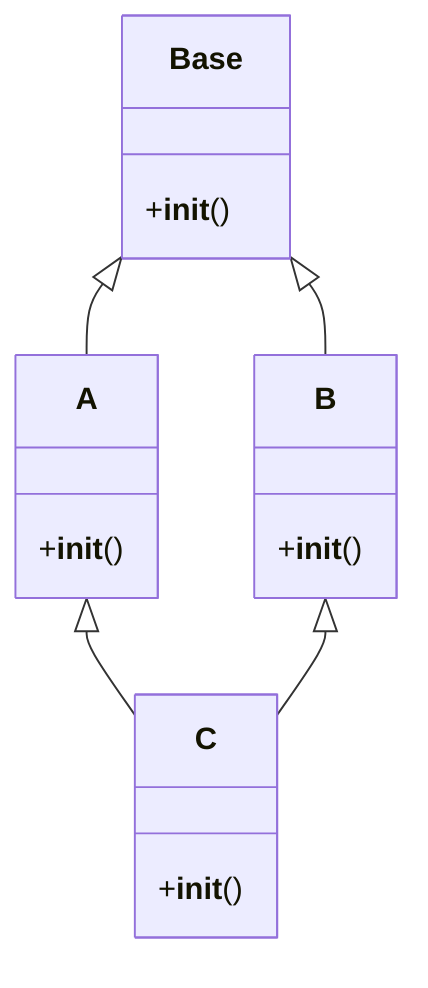
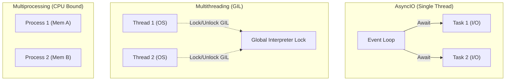
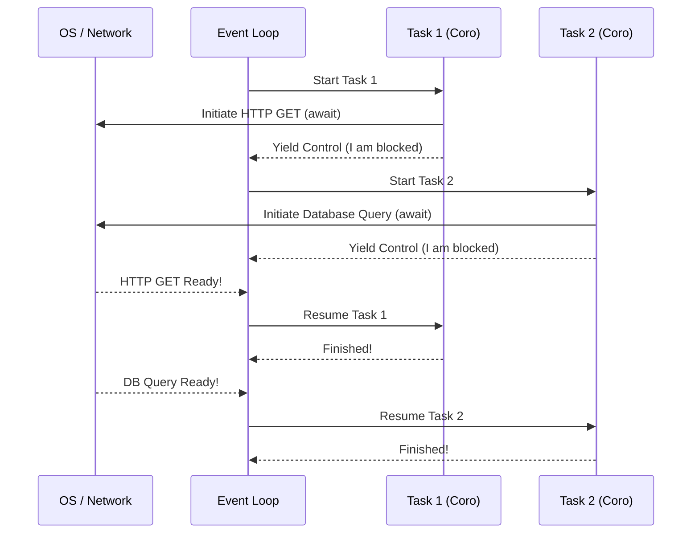
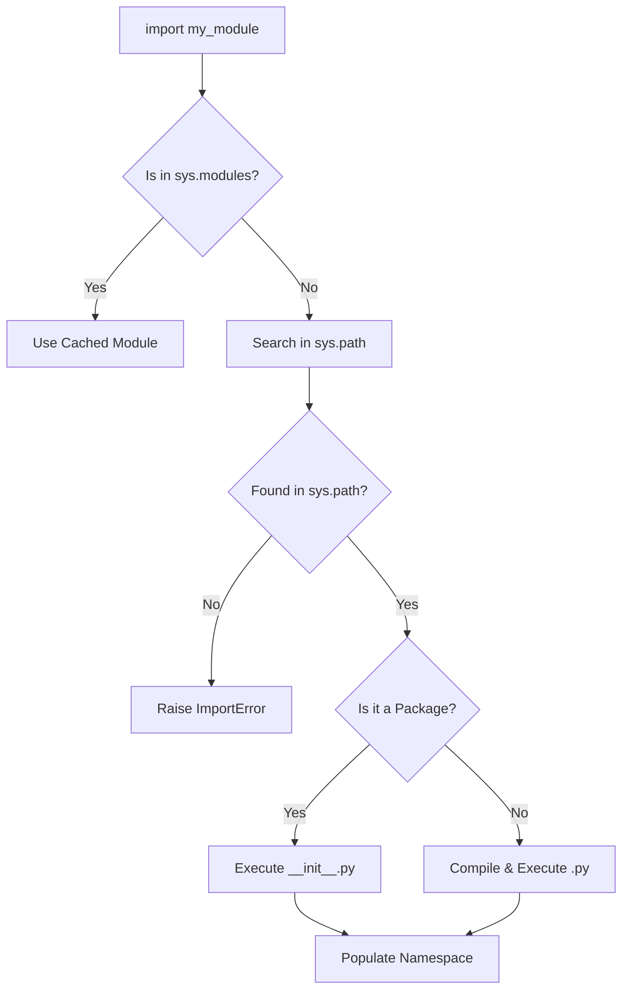
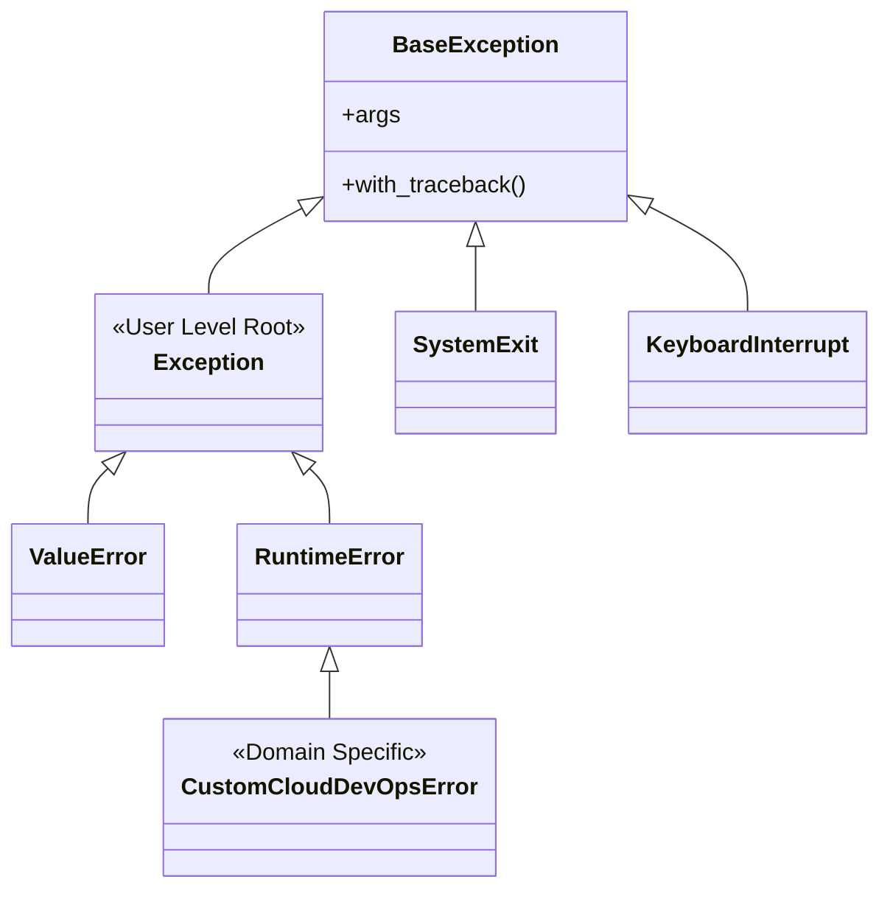
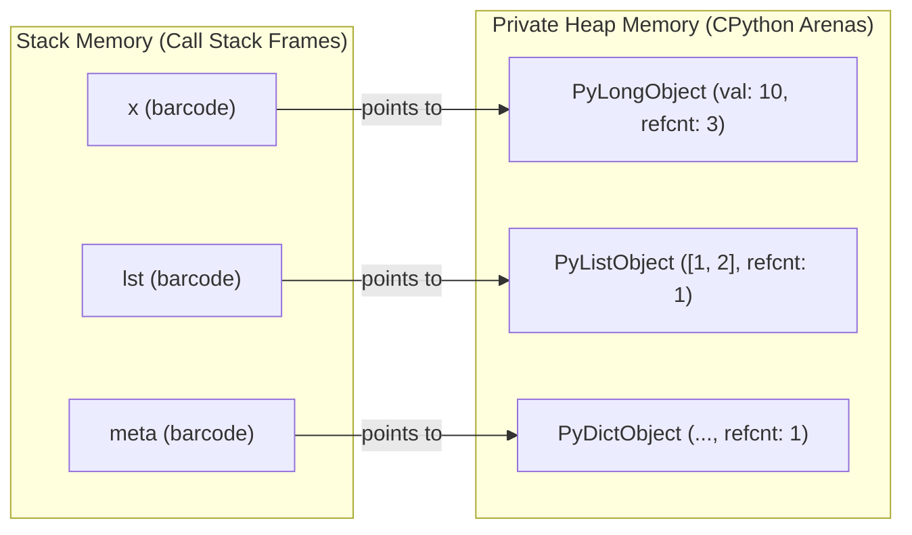
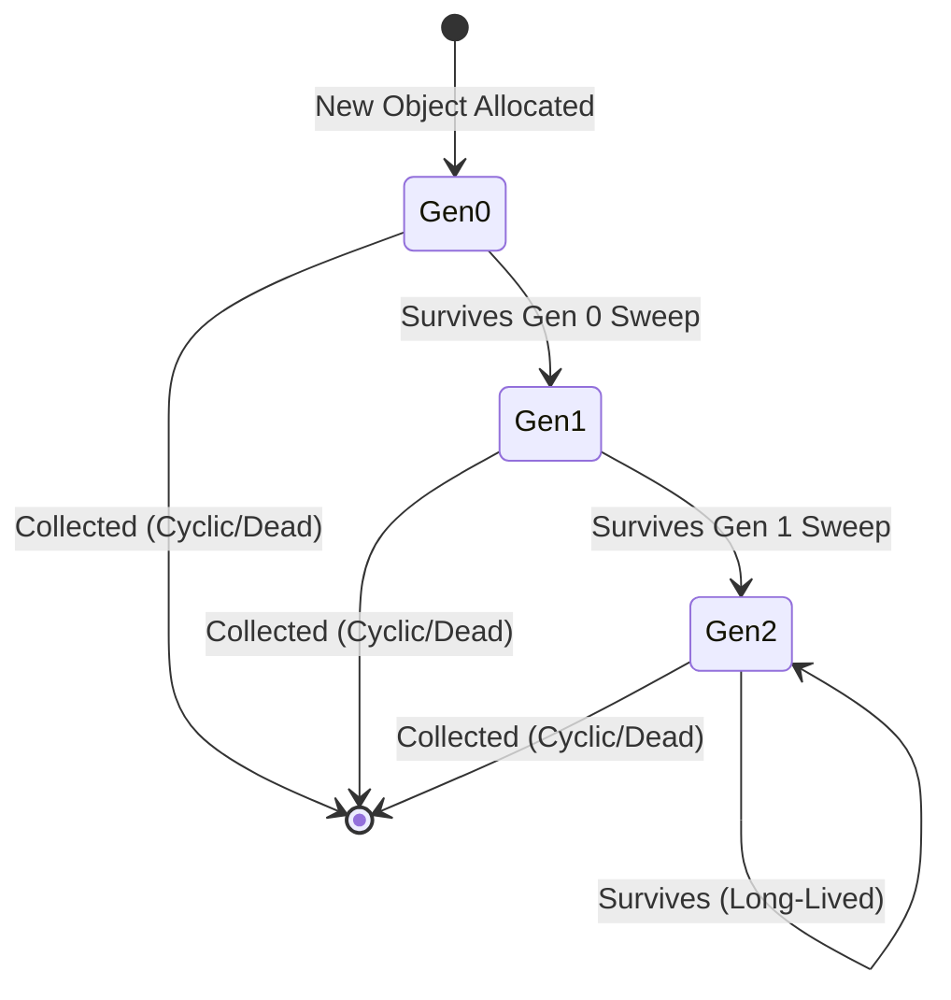

# 📘 Python Core — Comprehensive Cheat Sheet

## 📑 Table of Contents
1. [Python Fundamentals](#1-python-fundamentals)
2. [OOP Classes & Objects](#2-oop-classes--objects)
3. [OOP Inheritance](#3-oop-inheritance)
4. [OOP Encapsulation](#4-oop-encapsulation)
5. [OOP Polymorphism](#5-oop-polymorphism)
6. [Design Patterns](#6-design-patterns)
7. [OOP Advanced](#7-oop-advanced)
8. [Generators](#8-generators)
9. [Lambda Functions](#9-lambda-functions)
10. [Higher-Order Functions](#10-higher-order-functions)
11. [Iterators](#11-iterators)
12. [Threading](#12-threading)
13. [Multiprocessing](#13-multiprocessing)
14. [AsyncIO](#14-asyncio)
15. [String Methods](#15-string-methods)
16. [List Methods](#16-list-methods)
17. [Dictionary Methods](#17-dictionary-methods)
18. [Tuple Methods](#18-tuple-methods)
19. [Set Methods](#19-set-methods)
20. [Context Managers](#20-context-managers)
21. [Modules, Packages, and `__init__.py` Mastery](#21-modules-packages-and-__init__py-mastery)
22. [Advanced Exception Handling & Error Engineering Mastery](#22-advanced-exception-handling--error-engineering-mastery)
23. [Python Runtime Memory Architecture & Garbage Collection Mastery](#23-python-runtime-memory-architecture--garbage-collection-mastery)
24. [Global Interpreter Lock (GIL) Architecture & Performance Engineering](#24-global-interpreter-lock-gil-architecture--performance-engineering)

---

## 1. PYTHON FUNDAMENTALS

Python fundamentals form the bedrock of everything you build. This section delves into variables, type hints, string interpolation using f-strings, the walrus operator, comprehensions, unpacking mechanics, and control flow tools like ternaries and truthiness. Understanding these concepts at a deep level ensures that you can write idiomatic, readable, and performant Python code.

### Variables and Type Hints
Python is dynamically typed, meaning you don't need to declare types explicitly for variables. However, with the introduction of PEP 484, Python supports optional type hinting. Type hints do not affect runtime execution but are invaluable for static analysis (using tools like `mypy`), IDE autocompletion, and overall code readability.

Advanced type hints introduce generic programming, protocols (structural subtyping), and literal types, allowing you to express complex constraints on your data structures and functions.

```python
# Basic Variables and Type Hints
age: int = 30
name: str = "Alice"
is_active: bool = True
prices: list[float] = [19.99, 29.99, 4.50]

# Advanced Type Hints (Optional, Union, Literal, TypeVar, Generic)
from typing import Optional, Union, Literal, TypeVar, Generic, Protocol

# Optional means the value can be of the specified type or None
user_id: Optional[int] = None 

# Union allows multiple distinct types
status_code: Union[int, str] = 200

# Literal restricts values to specific literal choices
Mode = Literal['read', 'write', 'append']
def open_file(mode: Mode) -> None:
    pass

# TypeVar and Generic for defining generic functions/classes
T = TypeVar('T')

class Stack(Generic[T]):
    def __init__(self) -> None:
        self._items: list[T] = []
        
    def push(self, item: T) -> None:
        self._items.append(item)
        
    def pop(self) -> T:
        return self._items.pop()

# Protocol for structural subtyping (Duck typing for type hints)
class Drawable(Protocol):
    def draw(self) -> None:
        ...

def render(item: Drawable) -> None:
    item.draw()
```

> [!TIP]
> **DevOps Pro Tip:** In CI/CD pipelines, always run `mypy --strict` to catch type errors before they reach production. Strict typing drastically reduces runtime `TypeError` and `AttributeError` exceptions.

### F-Strings (Formatted String Literals)
Introduced in Python 3.6, f-strings provide a concise and readable way to embed expressions inside string literals. They are evaluated at runtime and are generally faster than older formatting methods like `%` formatting or `str.format()`.

```python
import datetime

user = "Admin"
login_attempts = 3
last_login = datetime.datetime.now()

# Basic f-string
msg = f"User {user} has logged in {login_attempts} times."

# Debugging with = (Python 3.8+)
print(f"{user=} | {login_attempts=}") # Output: user='Admin' | login_attempts=3

# Conversion flags: !s (str), !r (repr), !a (ascii)
raw_str = f"Raw repr: {user!r}"

# Formatting specifications
pi = 3.14159265
formatted_pi = f"Pi to 3 decimal places: {pi:.3f}"
padded_num = f"Padded: {login_attempts:0>5}" # Output: Padded: 00003

# Date formatting directly in f-string
date_msg = f"Last login was at {last_login:%Y-%m-%d %H:%M}"

# Nested f-strings for dynamic formatting specs
width = 10
precision = 4
dynamic_fmt = f"Value: {pi:{width}.{precision}f}"
```

### The Walrus Operator (`:=`)
Introduced in Python 3.8, the assignment expression operator (walrus operator) allows you to assign and return a value in the same expression. This is exceptionally useful in `while` loops, comprehensions, and `if` statements where a value is calculated, checked, and then used.

```python
# 1. In while loops (Reading lines or chunks)
import re

# Old way:
# line = file.readline()
# while line:
#     process(line)
#     line = file.readline()

# Walrus way:
# while (line := file.readline()):
#     process(line)

# 2. In list comprehensions to avoid recalculating
data = [1, 2, 3, 4, 5, 6, 7, 8, 9]
def expensive_computation(x: int) -> int:
    return x * x * x

# Only include if computation > 100, avoiding calling the function twice
results = [res for x in data if (res := expensive_computation(x)) > 100]

# 3. In if/elif blocks
pattern = re.compile(r'\d+')
text = "The answer is 42"

if match := pattern.search(text):
    print(f"Found a number: {match.group()}")
```

### Comprehensions (List, Dict, Set, Generator)
Comprehensions provide a concise way to create collections based on existing iterables. They are heavily optimized in CPython, often executing faster than standard `for` loops.

```python
# 1. List Comprehension with condition and nested loops
matrix = [[1, 2, 3], [4, 5, 6], [7, 8, 9]]
flattened_evens = [num for row in matrix for num in row if num % 2 == 0]

# 2. Dictionary Comprehension
keys = ['a', 'b', 'c']
values = [1, 2, 3]
# Using zip to create a dict, squaring the values
my_dict = {k: v**2 for k, v in zip(keys, values) if v > 1}

# 3. Set Comprehension (removes duplicates automatically)
words = ["apple", "banana", "apple", "cherry"]
unique_lengths = {len(word) for word in words}

# 4. Generator Expression (lazy evaluation, memory efficient)
import sys
large_gen = (x**2 for x in range(1_000_000))
print(f"Generator size: {sys.getsizeof(large_gen)} bytes") # Constant small size
```

### Unpacking Mechanics
Unpacking allows you to assign elements of an iterable to multiple variables in a single statement. Python supports extended unpacking, making it highly versatile for processing varying sequence lengths.

```python
# Basic unpacking
x, y, z = (10, 20, 30)

# Extended unpacking with * (gather remaining items)
first, *middle, last = [1, 2, 3, 4, 5]
# first=1, middle=[2, 3, 4], last=5

# Unpacking in function calls (*args, **kwargs)
def print_vector(x: int, y: int, z: int) -> None:
    print(f"<{x}, {y}, {z}>")

vec = (100, 200, 300)
print_vector(*vec) # Unpacks tuple into positional arguments

# ** for dictionary unpacking
params = {'x': 1, 'y': 2, 'z': 3}
print_vector(**params)

# Force keyword-only arguments using * in signature
def configure_server(host: str, *, port: int, secure: bool) -> None:
    pass

# configure_server("localhost", 8080, True) # TypeError!
configure_server("localhost", port=8080, secure=True) # Correct
```

### Truthiness and Control Flow
Python evaluates objects in boolean contexts implicitly. Understanding what constitutes "falsy" or "truthy" is vital for writing concise `if` statements.

| Falsy Values | Truthy Values |
| --- | --- |
| `None`, `False` | `True` |
| Numeric zero: `0`, `0.0`, `0j` | Non-zero numbers: `1`, `-1`, `3.14` |
| Empty collections: `""`, `[]`, `()`, `{}`, `set()` | Non-empty collections: `"a"`, `[1]`, `(False,)` |

```python
# Ternary Operator (Conditional Expression)
status_code = 404
message = "Success" if status_code == 200 else "Error"

# Chained Comparisons
temperature = 25
if 15 <= temperature <= 30:
    print("Comfortable weather")

# Truthiness in action (idiomatic checking)
my_list = []
if not my_list:
    print("List is empty!") # Idiomatic, avoid: if len(my_list) == 0:
```

---

## 2. OOP CLASSES & OBJECTS

Object-Oriented Programming (OOP) is a programming paradigm based on the concept of "objects," which can contain data and code. Python's OOP implementation is dynamic and highly flexible, providing deep hooks via "dunder" (double underscore) methods to customize object behavior.

### Class Anatomy and Instantiation
A class serves as a blueprint. The `__init__` method initializes the state of an instance.

```python
class DatabaseConnection:
    """Represents a connection to a database."""
    
    # Class Variable: Shared across all instances
    active_connections = 0
    
    def __init__(self, host: str, port: int = 5432) -> None:
        # Instance Variables: Unique to each instance
        self.host = host
        self.port = port
        self.is_connected = False
        # Increment class variable safely
        DatabaseConnection.active_connections += 1
        
    def connect(self) -> None:
        """Instance method taking 'self' as first parameter."""
        self.is_connected = True
        print(f"Connected to {self.host}:{self.port}")

# Instantiation
db1 = DatabaseConnection("localhost")
db2 = DatabaseConnection("remote.host.com", 3306)
```

**Instance vs Class vs Static Variables**

| Variable Type | Scope | Access Syntax | Description |
| --- | --- | --- | --- |
| Instance Variable | Bound to a specific object | `self.var_name` | Unique state for each object instance. |
| Class Variable | Bound to the class | `ClassName.var_name` | Shared state across all instances of the class. |
| Static Variable | (Same as Class Variable in Python) | `ClassName.var_name` | Conceptually static, physically a class attribute. |

### String Representation: `__str__`, `__repr__`, `__format__`

| Method | Intended Audience | Fallback | Goal |
| --- | --- | --- | --- |
| `__str__` | End Users | Falls back to `__repr__` if not defined | Readable, informative string |
| `__repr__` | Developers | Object memory address | Unambiguous, ideally executable string |
| `__format__` | Used by `f-strings`, `format()` | Falls back to `__str__` | Customized formatting specs |

```python
class Point:
    def __init__(self, x: float, y: float):
        self.x = x
        self.y = y
        
    def __repr__(self) -> str:
        # Developer view
        return f"Point(x={self.x}, y={self.y})"
        
    def __str__(self) -> str:
        # User view
        return f"({self.x}, {self.y})"
        
    def __format__(self, format_spec: str) -> str:
        # Custom format spec implementation
        if format_spec == "short":
            return f"{self.x},{self.y}"
        return str(self)

p = Point(10.5, 20.2)
print(repr(p))        # Point(x=10.5, y=20.2)
print(str(p))         # (10.5, 20.2)
print(f"Formatted: {p:short}") # Formatted: 10.5,20.2
```

### Class and Static Methods
Methods decorated with `@classmethod` take the class (`cls`) as the first argument, making them ideal for alternative constructors. Methods decorated with `@staticmethod` take neither `self` nor `cls`, functioning like regular functions grouped within the class namespace.

```python
import datetime

class User:
    def __init__(self, username: str, birth_year: int):
        self.username = username
        self.birth_year = birth_year
        
    # @classmethod Use Case 1: Alternative Constructor from birth date string
    @classmethod
    def from_birth_date_string(cls, username: str, date_string: str) -> 'User':
        year = int(date_string.split('-')[0])
        return cls(username, year)
        
    # @classmethod Use Case 2: Factory method
    @classmethod
    def guest_user(cls) -> 'User':
        return cls("Guest", datetime.datetime.now().year)
        
    # @staticmethod Use Case 1: Utility function
    @staticmethod
    def is_valid_username(username: str) -> bool:
        return len(username) >= 3 and username.isalnum()

u1 = User.from_birth_date_string("john_doe", "1990-12-01")
u2 = User.guest_user()
is_valid = User.is_valid_username("a b") # False
```

### Properties and `__slots__`
`@property` allows you to define methods that can be accessed like attributes, providing encapsulation and validation without breaking the API.
`__slots__` explicitly declares instance attributes, preventing the creation of a dynamic `__dict__` for each instance, saving significant memory for classes instantiated millions of times.

```python
class Temperature:
    # Restrict attributes to save memory
    __slots__ = ['_celsius']
    
    def __init__(self, celsius: float):
        self._celsius = celsius
        
    @property
    def celsius(self) -> float:
        """Getter for celsius."""
        return self._celsius
        
    @celsius.setter
    def celsius(self, value: float) -> None:
        """Setter with validation."""
        if value < -273.15:
            raise ValueError("Temperature below absolute zero is impossible.")
        self._celsius = value
        
    @property
    def fahrenheit(self) -> float:
        """Computed property."""
        return (self.celsius * 9/5) + 32

temp = Temperature(25)
temp.celsius = 30 # Triggers setter
print(temp.fahrenheit) # Triggers getter
# temp.new_attr = 100 # AttributeError: 'Temperature' object has no attribute 'new_attr'
```

### Dataclasses
Introduced in Python 3.7, `@dataclass` automatically generates boilerplate code like `__init__`, `__repr__`, `__eq__`, and more.

```python
from dataclasses import dataclass, field
import uuid

@dataclass(order=True, frozen=True, kw_only=True, slots=True)
class ConfigEntry:
    # order=True: generates __lt__, __gt__, etc.
    # frozen=True: makes instances immutable
    # kw_only=True: requires keyword arguments for init
    # slots=True: generates __slots__ (Python 3.10+)
    
    name: str
    value: int
    # Exclude from comparison and repr
    id: str = field(default_factory=lambda: str(uuid.uuid4()), compare=False, repr=False)
    tags: list[str] = field(default_factory=list)
    
    def __post_init__(self):
        # Called automatically after generated __init__
        # Since it's frozen, we must use object.__setattr__
        if self.value < 0:
            object.__setattr__(self, 'value', 0)

entry1 = ConfigEntry(name="Timeout", value=30)
entry2 = ConfigEntry(name="Retries", value=-5) # value will become 0
```

---

## 3. OOP INHERITANCE

Inheritance allows a class (subclass) to inherit attributes and methods from another class (superclass), promoting code reuse and establishing a hierarchical relationship.

### Single and Multiple Inheritance
Python supports both single and multiple inheritance. When resolving method calls in complex hierarchies, Python uses the Method Resolution Order (MRO), specifically the C3 Linearization algorithm.

```python
# Single Inheritance
class Animal:
    def speak(self) -> str:
        return "Generic animal sound"

class Dog(Animal):
    def speak(self) -> str:
        return "Woof!"

# Multiple Inheritance
class Logger:
    def log(self, msg: str) -> None:
        print(f"[LOG]: {msg}")

class DatabaseMixin:
    def connect(self) -> None:
        print("Connected to DB")

class Service(Logger, DatabaseMixin):
    def run(self) -> None:
        self.connect()
        self.log("Service is running")

svc = Service()
svc.run()
```

### Understanding `super()` and MRO
`super()` does not simply return the parent class; it returns a proxy object that delegates method calls to a parent or sibling class in the MRO. This is crucial for cooperative multiple inheritance.



```python
class Base:
    def __init__(self):
        print("Base Init")
        super().__init__()

class A(Base):
    def __init__(self):
        print("A Init")
        super().__init__()

class B(Base):
    def __init__(self):
        print("B Init")
        super().__init__()

class C(A, B):
    def __init__(self):
        print("C Init")
        super().__init__()

# The Diamond Problem Resolution
c = C()
# Output:
# C Init
# A Init
# B Init
# Base Init
print(C.mro())
# [<class '__main__.C'>, <class '__main__.A'>, <class '__main__.B'>, <class '__main__.Base'>, <class 'object'>]
```

### Abstract Base Classes (ABC)
ABCs define a rigid interface that subclasses must implement. This is a form of structural typing combined with runtime enforcement.

```python
from abc import ABC, abstractmethod

class PaymentProcessor(ABC):
    @abstractmethod
    def process_payment(self, amount: float) -> bool:
        """Must be implemented by subclasses."""
        pass
        
    @property
    @abstractmethod
    def is_connected(self) -> bool:
        pass

class StripeProcessor(PaymentProcessor):
    def process_payment(self, amount: float) -> bool:
        print(f"Processing ${amount} via Stripe")
        return True
        
    @property
    def is_connected(self) -> bool:
        return True

# proc = PaymentProcessor() # TypeError: Can't instantiate abstract class
stripe = StripeProcessor() # OK
```

---

## 4. OOP ENCAPSULATION

Encapsulation is the bundling of data and the methods that operate on that data, restricting direct access to some of an object's components. Python relies on naming conventions rather than strict access modifiers.

### Public, Protected, and Private Members
- **Public:** No underscores. Accessible from anywhere.
- **Protected:** Single leading underscore (`_name`). A convention indicating internal use; not strictly enforced.
- **Private:** Double leading underscore (`__name`). Triggers name mangling to prevent accidental overriding in subclasses.

```python
class BankAccount:
    def __init__(self, owner: str, balance: float):
        self.owner = owner          # Public
        self._currency = "USD"      # Protected (convention)
        self.__balance = balance    # Private (name mangled)
        
    def deposit(self, amount: float) -> None:
        if amount > 0:
            self.__balance += amount
            
    def get_balance(self) -> float:
        return self.__balance

account = BankAccount("Alice", 1000)
print(account.owner)       # Alice
print(account._currency)   # USD (accessible, but bad practice)
# print(account.__balance) # AttributeError
print(account._BankAccount__balance) # 1000 (Name mangling bypass - avoid this!)
```

### Best Practices for Information Hiding
Always use `@property` for attributes that require validation or derived computation instead of exposing internal state. Expose only what is necessary through public methods.

---

## 5. OOP POLYMORPHISM

Polymorphism allows objects of different classes to be treated as objects of a common superclass. Python achieves this through method overriding, duck typing, and operator overloading (dunder methods).

### Duck Typing
"If it walks like a duck and quacks like a duck, it must be a duck." In Python, an object's suitability is determined by the presence of certain methods and properties, rather than its inheritance hierarchy.

```python
class Duck:
    def quack(self) -> None:
        print("Quack!")

class Person:
    def quack(self) -> None:
        print("I'm pretending to be a duck!")

def make_it_quack(entity) -> None:
    entity.quack() # Doesn't care about the type, just the method

make_it_quack(Duck())
make_it_quack(Person())
```

### Operator Overloading (Magic/Dunder Methods)
Python allows you to define how standard operators work with your custom objects by implementing specific dunder methods.

```python
class Vector:
    def __init__(self, x: float, y: float):
        self.x = x
        self.y = y
        
    # Arithmetic: +
    def __add__(self, other: 'Vector') -> 'Vector':
        return Vector(self.x + other.x, self.y + other.y)
        
    # String representation
    def __str__(self) -> str:
        return f"({self.x}, {self.y})"
        
    # Comparison: ==
    def __eq__(self, other: object) -> bool:
        if not isinstance(other, Vector):
            return NotImplemented
        return self.x == other.x and self.y == other.y
        
    # Callable: allows object()
    def __call__(self, scale: float) -> 'Vector':
        return Vector(self.x * scale, self.y * scale)
        
    # Container/Subscriptable: []
    def __getitem__(self, index: int) -> float:
        if index == 0: return self.x
        if index == 1: return self.y
        raise IndexError("Index out of bounds")

v1 = Vector(2, 3)
v2 = Vector(4, 5)

print(v1 + v2)    # (6, 8)
print(v1 == v2)   # False
print(v1(2))      # (4, 6)
print(v1[0])      # 2
```

---

## 6. DESIGN PATTERNS

Design patterns are typical solutions to common problems in software design. In Python, many patterns are simplified or built-in due to the language's dynamic nature.

### Singleton Pattern
Ensures a class has only one instance and provides a global point of access to it.
```python
# Implementation using a Metaclass (Most robust)
class SingletonMeta(type):
    _instances = {}
    
    def __call__(cls, *args, **kwargs):
        if cls not in cls._instances:
            instance = super().__call__(*args, **kwargs)
            cls._instances[cls] = instance
        return cls._instances[cls]

class Database(metaclass=SingletonMeta):
    def connect(self):
        pass

db1 = Database()
db2 = Database()
print(db1 is db2) # True
```

### Factory Method
Creates objects without specifying the exact class to create.
```python
from abc import ABC, abstractmethod

class Animal(ABC):
    @abstractmethod
    def speak(self) -> str:
        pass

class Dog(Animal):
    def speak(self) -> str: return "Woof"

class Cat(Animal):
    def speak(self) -> str: return "Meow"

class AnimalFactory:
    @staticmethod
    def get_animal(animal_type: str) -> Animal:
        if animal_type == "dog": return Dog()
        if animal_type == "cat": return Cat()
        raise ValueError("Unknown animal")

dog = AnimalFactory.get_animal("dog")
print(dog.speak())
```

---

## 7. OOP ADVANCED

Advanced OOP techniques provide immense metaprogramming capabilities.

### Metaclasses
Metaclasses are the classes of classes. They define how a class behaves.
```python
class MetaCheck(type):
    def __new__(cls, name, bases, attrs):
        if 'my_method' not in attrs:
            raise TypeError(f"Class {name} must implement 'my_method'")
        return super().__new__(cls, name, bases, attrs)

class ValidClass(metaclass=MetaCheck):
    def my_method(self):
        pass

# class InvalidClass(metaclass=MetaCheck):
#     pass # Raises TypeError
```

### Descriptors
Descriptors are objects that manage the access (get, set, delete) of attributes in other classes.
```python
class Validator:
    def __set_name__(self, owner, name):
        self.public_name = name
        self.private_name = '_' + name

    def __get__(self, obj, objtype=None):
        return getattr(obj, self.private_name)

    def __set__(self, obj, value):
        if value < 0:
            raise ValueError(f"{self.public_name} must be >= 0")
        setattr(obj, self.private_name, value)

class Product:
    price = Validator() # Uses the descriptor

    def __init__(self, price: float):
        self.price = price

p = Product(10)
# p.price = -5 # ValueError
```

---

## 8. GENERATORS

Generators simplify the creation of iterators. A function containing `yield` is a generator function. It pauses execution and saves its state, resuming where it left off when next called.


### Basic Generators and State
```python
def count_up_to(max_val):
    count = 1
    while count <= max_val:
        yield count
        count += 1

counter = count_up_to(3)
print(next(counter)) # 1
print(next(counter)) # 2
print(next(counter)) # 3
# print(next(counter)) # StopIteration
```

### Yield From (Delegating Generators)
```python
def generate_letters():
    yield 'A'
    yield 'B'

def generate_numbers():
    yield 1
    yield 2

def combined_generator():
    yield from generate_letters()
    yield from generate_numbers()

print(list(combined_generator())) # ['A', 'B', 1, 2]
```

---

## 9. LAMBDA FUNCTIONS

Lambdas are small, anonymous functions defined using the `lambda` keyword. They are restricted to a single expression.

```python
# Syntax: lambda arguments: expression
add = lambda x, y: x + y
print(add(5, 3)) # 8

# Often used with sorting complex objects
users = [
    {'name': 'Alice', 'age': 30},
    {'name': 'Bob', 'age': 25},
    {'name': 'Charlie', 'age': 35}
]

# Sort by age
sorted_users = sorted(users, key=lambda u: u['age'])
```

---

## 10. HIGHER-ORDER FUNCTIONS

Functions that take other functions as arguments or return them as results.

### Map, Filter, Reduce
```python
from functools import reduce

nums = [1, 2, 3, 4, 5]

# map: transform each element
squares = list(map(lambda x: x**2, nums))

# filter: keep elements that match condition
evens = list(filter(lambda x: x % 2 == 0, nums))

# reduce: cumulative operation
total = reduce(lambda acc, x: acc + x, nums)
```

### Decorators
Decorators wrap a function, modifying its behavior.
```python
from functools import wraps
import time

def timer(func):
    @wraps(func)
    def wrapper(*args, **kwargs):
        start = time.time()
        result = func(*args, **kwargs)
        end = time.time()
        print(f"{func.__name__} took {end - start:.4f}s")
        return result
    return wrapper

@timer
def heavy_computation():
    time.sleep(1)
    return "Done"

heavy_computation()
```

---

## 11. ITERATORS

Objects implementing `__iter__()` and `__next__()`. The `itertools` module provides fast, memory-efficient tools for manipulating iterables.

```python
import itertools

# Infinite Iterator: count
counter = itertools.count(start=10, step=2)
print(next(counter), next(counter)) # 10, 12

# Combinatorics: product
cartesian = list(itertools.product([1, 2], ['a', 'b']))
# [(1, 'a'), (1, 'b'), (2, 'a'), (2, 'b')]

# Grouping
data = [("A", 1), ("A", 2), ("B", 3)]
grouped = {k: list(g) for k, g in itertools.groupby(data, key=lambda x: x[0])}
```

---

## 12. THREADING

**🌐 Intuitive Real-World Analogy (The Restaurant Kitchen Protocol):**
- **Sequential:** A single chef staring at water waiting for it to boil for 10 minutes before slicing vegetables. Terribly inefficient!
- **Multithreading & Concurrency (Under the GIL):** One master chef rapidly switching between stations on a single kitchen stove. While waiting for water to boil (I/O Wait), they turn to slice vegetables, then turn back when the kettle whistles. This is **Concurrency (interleaved execution on a single CPU core under the Global Interpreter Lock)**—only one task runs at a precise millisecond, but total idle waiting is minimized!
- **Multiprocessing (True Parallelism):** Four completely distinct kitchens, each staffed by its own private chef with their own individual stoves and utensils (separate OS processes with isolated memory heaps and dedicated Python interpreters!). All four chefs sear steaks simultaneously at the exact same microsecond. This is **Parallelism (multi-core CPU execution bypassing the GIL)**!
- **AsyncIO (Cooperative Single-Threaded Event Loop):** A super-efficient head chef with an order ticket bell and a chore queue (The Event Loop). Instead of an arbitrary kitchen manager cutting the chef off mid-chop (preemptive switching), the chef explicitly states: "I am putting a roast in the oven (`await oven_timer()`), ring me when ready; give me the next ticket now!" (Cooperative execution!).

**Deep Architectural Comparison Matrix Table**

| Feature | Threading | Multiprocessing | AsyncIO |
| --- | --- | --- | --- |
| **Execution Model** | Preemptive (OS controlled) | Preemptive (OS controlled) | Cooperative (Event Loop) |
| **GIL Status** | Bound (Only 1 thread executes Python bytecode at a time) | Bypassed (Each process has its own GIL) | Single-Threaded (No GIL contention) |
| **Memory Overhead** | Medium (~8MB stack per thread) | High (Full OS process memory duplication) | Ultra-Low (<1KB per coroutine) |
| **Primary Bottleneck Solved** | Network I/O, File I/O wait times | Heavy CPU math, Cryptography, Compression | Ultra-high concurrency, WebSockets, HTTP streaming |
| **Inter-task Communication** | `queue.Queue`, Locks, Events | `multiprocessing.Queue`, Pipes, Shared Memory | `asyncio.Queue`, Futures, Event Loop |



Multithreading allows concurrent execution. Best for I/O-bound tasks due to Python's Global Interpreter Lock (GIL).

### Under the Hood
Threads share the same memory space and are scheduled preemptively by the OS. However, due to the Global Interpreter Lock (GIL) in CPython, only one thread can execute Python bytecode at any given moment. This means threading doesn't provide true parallelism for CPU-bound tasks, but it is excellent for hiding I/O latency (like network requests or disk reads) because the GIL is released during I/O operations. Synchronization primitives like `threading.Lock`, `threading.Semaphore`, and `threading.Event` are essential to prevent race conditions when multiple threads modify shared state.

```python
import threading
import time
import queue
from concurrent.futures import ThreadPoolExecutor, as_completed

# Legacy Manual Threading Example (Original)
def worker(name):
    print(f"Worker {name} starting")
    time.sleep(1)
    print(f"Worker {name} finished")

threads = []
for i in range(3):
    t = threading.Thread(target=worker, args=(i,))
    threads.append(t)
    t.start()

for t in threads:
    t.join() # Wait for completion

# Production-Grade: Enterprise Concurrent Network Port Monitor
def check_port(host: str, port: int) -> dict:
    """Simulates a blocking network socket connection."""
    time.sleep(0.5) # Simulating network latency (GIL released!)
    is_open = port % 2 == 0 # Mock result
    return {"host": host, "port": port, "status": "OPEN" if is_open else "CLOSED"}

def run_port_scanner(targets: list[tuple[str, int]], max_threads: int = 10):
    results_queue = queue.Queue()
    
    print(f"Starting port scan on {len(targets)} targets using {max_threads} threads...")
    start_time = time.time()
    
    # Context manager ensures threads are cleaned up properly
    with ThreadPoolExecutor(max_workers=max_threads) as executor:
        # Submit all tasks to the thread pool
        futures = {executor.submit(check_port, host, port): (host, port) for host, port in targets}
        
        # Process as they complete
        for future in as_completed(futures):
            try:
                result = future.result()
                results_queue.put(result)
            except Exception as e:
                host, port = futures[future]
                print(f"Error scanning {host}:{port} -> {e}")
                
    print(f"Scan complete in {time.time() - start_time:.2f} seconds.")
    return list(results_queue.queue)

if __name__ == '__main__':
    targets_list = [("10.0.0.1", p) for p in range(80, 100)]
    # print(run_port_scanner(targets_list, max_threads=10)) # Uncomment to run
```

> [!TIP]
> **💡 Best Practice:** Always prefer the `concurrent.futures.ThreadPoolExecutor` context manager over manual `threading.Thread` creation and `.join()` loops. It handles pooling, exception propagation, and resource cleanup automatically.

> [!WARNING]
> **⚠️ Common Pitfalls:** Avoid writing heavy CPU loops in threads (it will stall your entire program due to GIL contention). Be extremely careful with nested locks to guard against deadlocks (lock inversion).

> [!NOTE]
> **🔧 DevOps Pro Tip:** Use threading in your CI/CD scripts to concurrently pull Docker images or download artifacts from multiple S3 buckets. The I/O wait times will overlap perfectly.

---

## 13. MULTIPROCESSING

Bypasses the GIL by using separate memory spaces (subprocesses). Best for CPU-bound tasks.

### Under the Hood
Multiprocessing creates distinct operating system processes via `fork` (POSIX) or `spawn` (Windows/macOS). Each process gets its own memory heap, its own Python interpreter, and crucially, its own GIL. This enables true parallelism across multiple CPU cores. However, this isolation means processes cannot trivially share memory. Inter-Process Communication (IPC) requires serialization (usually via `pickle`) to pass data through `multiprocessing.Queue` or pipes, which introduces overhead.

```python
import multiprocessing
import os
import time
import hashlib
from concurrent.futures import ProcessPoolExecutor

# Legacy Manual Multiprocessing Example (Original)
def compute_square(n):
    return n * n

if __name__ == '__main__':
    with multiprocessing.Pool(processes=4) as pool:
        results = pool.map(compute_square, [1, 2, 3, 4, 5])
        print(results) # [1, 4, 9, 16, 25]

# Production-Grade: High-Throughput Parallel Log Hashing
def hash_log_entry(log_line: str) -> str:
    """Heavy CPU-bound cryptography task."""
    # Simulating intensive computation bypassing the GIL
    for _ in range(1000): 
        h = hashlib.sha256(log_line.encode('utf-8')).hexdigest()
    return f"{log_line.strip()} -> {h[:8]}"

def process_logs_in_parallel(log_data: list[str]):
    # Note: Using multiprocessing.cpu_count() securely
    cores = os.cpu_count() or 4
    print(f"Processing {len(log_data)} logs across {cores} CPU cores...")
    start_time = time.time()
    
    results = []
    # Use ProcessPoolExecutor to map CPU-bound work across all cores
    with ProcessPoolExecutor(max_workers=cores) as executor:
        # chunksize groups items into batches, vastly reducing IPC serialization overhead
        for result in executor.map(hash_log_entry, log_data, chunksize=50):
            results.append(result)
            
    print(f"Parallel hashing complete in {time.time() - start_time:.2f} seconds.")
    return results

if __name__ == '__main__':
    mock_logs = [f"INFO: User {i} logged in" for i in range(200)]
    # process_logs_in_parallel(mock_logs) # Uncomment to run
```

> [!TIP]
> **💡 Best Practice:** When using `.map()`, always set an appropriate `chunksize`. Sending 1,000,000 tiny items to worker processes one-by-one destroys performance due to IPC overhead. Chunking them into batches of 1,000 minimizes this tax.

> [!WARNING]
> **⚠️ Common Pitfalls:** Never pass massive objects (like gigabyte-sized Pandas DataFrames) directly through multiprocessing queues or function arguments. The slow `pickle` serialization overhead will negate any parallel speedup. 

> [!NOTE]
> **🔧 DevOps Pro Tip:** Always guard your script entry points with `if __name__ == '__main__':` on Windows. Windows uses `spawn` instead of `fork`, meaning it imports your module from scratch in the subprocess. Without the guard, it will recursively launch infinite fork bombs, crashing your system! For large data matrices, use `multiprocessing.shared_memory` to zero-copy map numpy arrays across processes.

---

## 14. ASYNCIO

Asynchronous I/O for single-threaded concurrency.

### Under the Hood
AsyncIO operates on a single-threaded cooperative event loop. Functions defined with `async def` become coroutines. When a coroutine hits an `await` statement (like network I/O), it yields control *back* to the Event Loop, essentially saying: "I am blocked waiting for a response, go run another task while I wait." The event loop uses highly optimized OS-level selector engines (`epoll` on Linux, `kqueue` on macOS) to instantly know which file descriptors or sockets are ready to resume. 



```python
import asyncio
import time

# Legacy Basic AsyncIO Example (Original)
async def fetch_data(id):
    print(f"Fetching data {id}...")
    await asyncio.sleep(1) # Simulate I/O
    return f"Data {id}"

async def main_legacy():
    # Gather runs tasks concurrently
    results = await asyncio.gather(
        fetch_data(1),
        fetch_data(2),
        fetch_data(3)
    )
    print(results)

# asyncio.run(main_legacy())

# Production-Grade: High-Concurrency DevOps Cloud Health Checker
async def check_service_health(service_name: str, delay: float, semaphore: asyncio.Semaphore) -> str:
    """Simulates an async HTTP request to check service health, governed by a semaphore limit."""
    async with semaphore: # Strict rate-limiting block
        print(f"[{time.strftime('%X')}] Requesting {service_name}...")
        await asyncio.sleep(delay) # Cooperative yield (simulating async network wait)
        
        if service_name == "Database":
            raise ConnectionError("Timeout connecting to DB!")
            
        return f"{service_name} is UP"

async def main():
    print("Initiating cloud health sweep...")
    start = time.perf_counter()
    
    # Semaphore strictly limits concurrent outbound API bursts to 5 at a time
    concurrency_limit = asyncio.Semaphore(5)
    
    services = {
        "Frontend": 1.5,
        "Auth_API": 1.0,
        "Database": 2.0,
        "Cache": 0.5,
        "Payment_GW": 1.2
    }
    
    # Create non-blocking task futures
    tasks = [
        asyncio.create_task(check_service_health(name, delay, concurrency_limit))
        for name, delay in services.items()
    ]
    
    # Gather all results, gracefully swallowing exceptions in the output array instead of crashing
    results = await asyncio.gather(*tasks, return_exceptions=True)
    
    for name, result in zip(services.keys(), results):
        if isinstance(result, Exception):
            print(f"❌ {name} failed: {type(result).__name__} - {result}")
        else:
            print(f"✅ {result}")
            
    print(f"Sweep completed in {time.perf_counter() - start:.2f}s")

if __name__ == '__main__':
    pass
    # asyncio.run(main()) # Uncomment to run event loop
```

> [!TIP]
> **💡 Best Practice:** When scraping thousands of endpoints, wrap your requests in an `asyncio.Semaphore(N)` context manager to gracefully throttle your outbound concurrency. Without it, you will flood the OS with thousands of open sockets simultaneously, resulting in `Too many open files` errors.

> [!WARNING]
> **⚠️ Common Pitfalls:** NEVER call blocking synchronous functions (like `time.sleep()`, synchronous `requests.get()`, or heavy DB operations) directly inside a coroutine. A single blocking call freezes the *entire* Event Loop, halting all other tasks. Use native async clients like `httpx` or `aiohttp`!

> [!NOTE]
> **🔧 DevOps Pro Tip:** If you are forced to use a legacy synchronous library inside an AsyncIO application, offload the blocking call to a thread pool so it doesn't freeze the loop. In Python 3.9+, you can do this cleanly via `await asyncio.to_thread(blocking_function, args)`.

---

## 15. STRING METHODS

Strings are immutable sequences of Unicode characters.

```python
text = "  Hello, Python World!  "

# Strip whitespace
print(text.strip())

# Change case
print(text.upper())
print(text.lower())
print(text.title())

# Search and Replace
print(text.replace("Python", "Async"))
print(text.find("World"))
print(text.startswith(" "))

# Split and Join
words = text.split(',')
print("-".join(words))
```

---

## 16. LIST METHODS

Lists are mutable, ordered arrays.

```python
my_list = [10, 20, 30]

# Add elements
my_list.append(40)
my_list.extend([50, 60])
my_list.insert(0, 5)

# Remove elements
my_list.remove(20) # by value
popped = my_list.pop() # by index, defaults to last

# Sorting
my_list.sort(reverse=True) # In-place
```

---

## 17. DICTIONARY METHODS

Key-value mapping. Keys must be hashable.

```python
my_dict = {"a": 1, "b": 2}

# Access
print(my_dict.get("c", 0)) # Safe access with default

# Update
my_dict.update({"c": 3, "d": 4})
# Python 3.9+ Merge operator
new_dict = my_dict | {"e": 5}

# Iterate
for k, v in my_dict.items():
    print(k, v)
```

---

## 18. TUPLE METHODS

Immutable sequences. Faster and use less memory than lists.

```python
t = (1, 2, 3, 2, 1)

print(t.count(1)) # 2
print(t.index(2)) # 1

# NamedTuple for readable struct-like types
from collections import namedtuple
Point = namedtuple('Point', ['x', 'y'])
p = Point(10, 20)
print(p.x)
```

---

## 19. SET METHODS

Unordered collections of unique elements. Fast O(1) lookups.

```python
s1 = {1, 2, 3}
s2 = {3, 4, 5}

# Operations
print(s1 | s2) # Union
print(s1 & s2) # Intersection
print(s1 - s2) # Difference
print(s1 ^ s2) # Symmetric Difference

s1.add(6)
s1.discard(1) # Safe remove
```

---

## 20. CONTEXT MANAGERS

Resource management using the `with` statement.

```python
# Function-based using contextlib
from contextlib import contextmanager

@contextmanager
def open_file(name):
    f = open(name, 'w')
    try:
        yield f
    finally:
        f.close()

with open_file('test.txt') as f:
    f.write('Hello Context Manager')
```

---

## 21. MODULES, PACKAGES, AND `__init__.py` MASTERY

Understanding how Python structures, imports, and resolves code is critical for building scalable applications and reusable libraries. This section covers the internal mechanics of imports, the distinction between modules and packages, and how to harness `__init__.py` to create clean, professional APIs.

### How Python Imports Work



When you execute an `import` statement, Python goes through a specific sequence to locate and load the code.

1. **`sys.modules` Caching:** Python first checks the `sys.modules` dictionary to see if the module is already imported. If found, it uses the cached version. This is why module-level code only runs once, no matter how many times it is imported.
2. **`sys.path` Resolution:** If not cached, Python searches through a list of directories defined in `sys.path`. This list includes the directory of the running script, standard library directories, and site-packages (where `pip` installs libraries).
3. **Compilation & Execution:** Once found, Python compiles the source to bytecode (`.pyc` files in `__pycache__`) if necessary, executes the module top-to-bottom, and populates its namespace.

**Absolute vs Relative Imports:**
- **Absolute Imports:** Specify the full path from the project's root (e.g., `from my_project.utils.string_utils import slugify`). Preferred for clarity.
- **Relative Imports:** Use dot notation relative to the current module's location (e.g., `from .string_utils import slugify` or `from ..database import get_db`). Only works within packages.

```python
import sys
import math # Absolute import of standard library
from datetime import datetime # Absolute import of specific symbol

# Relative imports (only valid inside a package)
# from . import sibling_module
# from ..parent_package import parent_module

def inspect_imports():
    # Check if a module is cached
    is_cached = 'math' in sys.modules
    print(f"Is 'math' cached? {is_cached}")
    
    # View the import search path
    print("Top 3 sys.path entries:")
    for path in sys.path[:3]:
        print(f" - {path}")

inspect_imports()
```

### Module vs Package and the Role of `__init__.py`

- **Module:** A single `.py` file containing Python code.
- **Package:** A directory containing multiple modules (or sub-packages). Historically, Python required an `__init__.py` file in a directory for it to be treated as a package.

The `__init__.py` file executes automatically when its package (or a module within it) is imported. It serves two primary purposes:
1. **Directory Marker:** It tells Python "treat this directory as a package".
2. **Initialization:** It allows you to run initialization code for the package, set up package-level state, or consolidate imports to create a clean public API.

### Mastering `__init__.py`

A well-crafted `__init__.py` transforms a messy directory of files into a cohesive, easy-to-use library.

**1. Exposing a Cleaner Public API and `__all__`**
Instead of forcing users to import deeply `from my_package.sub_module.core import MyClass`, you can import `MyClass` into `__init__.py`. The `__all__` list restricts what gets exported when someone uses `from my_package import *`.

```python
# File: my_package/core/database.py
class DatabaseConnection:
    pass

# File: my_package/utils/helpers.py
def complex_helper():
    pass

def _internal_helper():
    pass # Private to module
```

```python
# File: my_package/__init__.py
"""
my_package: A robust data processing library.
"""
import logging

# Package metadata
__version__ = "1.2.0"
__author__ = "DevOps Engineering Team"

# Initialize package-scoped logger
logger = logging.getLogger(__name__)
logger.setLevel(logging.INFO)
logger.addHandler(logging.NullHandler()) # Best practice for library loggers

# Consolidate imports for a clean public API
from .core.database import DatabaseConnection
from .utils.helpers import complex_helper

# Restrict wildcard imports (from my_package import *)
__all__ = [
    "DatabaseConnection",
    "complex_helper",
    "__version__"
]
```

**End-User Experience:**
```python
# Now users can import cleanly from the root package
from my_package import DatabaseConnection, __version__

print(f"Using my_package version {__version__}")
db = DatabaseConnection()
```

> [!TIP]
> **💡 Best Practice:** Keep `__init__.py` lightweight. Use it for API consolidation (`__all__`), docstrings, and simple initialization (like loggers). Heavy logic slows down imports. Always use absolute imports for reliability.

> [!WARNING]
> **⚠️ Common Pitfalls:** Circular Imports often occur when module A imports module B, and module B imports module A, exacerbated by heavy `__init__.py` files. Fix by moving imports inside functions or refactoring. Also, avoid shadowing standard libraries (like naming a module `csv.py`).

> [!TIP]
> **🔧 DevOps Pro Tip:** Use Namespace Packages (PEP 420) in Python 3.3+ to create packages without `__init__.py`, perfect for splitting large packages across multiple repos. Also, transition to `pyproject.toml` for modern packaging instead of `setup.py`.

```toml
# Example pyproject.toml for modern packaging
[build-system]
requires = ["setuptools>=61.0"]
build-backend = "setuptools.build_meta"

[project]
name = "my_package"
version = "1.2.0"
description = "A robust data processing library"
authors = [{ name = "DevOps Team", email = "devops@example.com" }]
dependencies = [
    "requests>=2.28.0",
    "pydantic>=2.0"
]
```

---

## 22. Advanced Exception Handling & Error Engineering Mastery

### 🌐 Intuitive Real-World Analogy & Simple Explanation
Think of exceptions as emergency safety pressure relief valves and circuit interrupters in a power grid. Instead of a localized voltage spike blowing up an entire city grid, engineered interrupters safely redirect power, trip isolated switches, and alert engineers while keeping core infrastructure operational. Proper exception handling allows a catastrophic error in one minor task to be safely contained and handled without bringing down an entire mission-critical service.

### What is it? & Under the Hood Mechanics
The Python Exception Hierarchy is split significantly between `Exception` (intended for user-level errors) and `BaseException` (the root of all exceptions). Catching `BaseException` is dangerous because it intercepts system-level signals like `SystemExit`, `KeyboardInterrupt` (Ctrl+C), and `GeneratorExit`, which breaks graceful shutdowns and container SIGTERM handling.
When an exception occurs, Python unwinds the Call Stack looking for a matching `except` block. You can inspect the traceback interactively using `sys.exc_info()` and the `traceback` module to capture raw stack traces as formatted strings for telemetry or logging.

### Visual Architecture Diagram


### Exception Chaining & Context
Python supports explicit exception chaining. By raising a new exception `from original_error`, you preserve the `__cause__` and the original stack trace. This provides full context for debugging. Suppressing context is possible using `from None`, which deliberately hides the originating exception, useful when the inner exception exposes sensitive internal details.

### Python 3.11+ Exception Groups & `except*`
Python 3.11 introduced `ExceptionGroup` and the `except*` syntax. This allows multiple exceptions to be raised and handled simultaneously, which is critical for managing concurrent failures across asynchronous event loops, task groups (`asyncio.TaskGroup`), and multi-threading. The `except*` block can match multiple exceptions of a specific type out of an `ExceptionGroup` and route them appropriately without swallowing unhandled ones.

### Production Working Code Example
```python
import asyncio
import traceback
import sys
import datetime

# 1. Enterprise Custom Domain Exception Hierarchy
class DevOpsAutomationError(Exception):
    """Base class for DevOps domain exceptions."""
    def __init__(self, message: str, error_code: int):
        super().__init__(message)
        self.error_code = error_code
        self.timestamp = datetime.datetime.now(datetime.timezone.utc).isoformat()

class ClusterConnectionError(DevOpsAutomationError):
    pass

class DeploymentValidationFailed(DevOpsAutomationError):
    pass

# 2. Context-Preserving Retry Execution Engine
def robust_deployment_step(config: dict) -> None:
    try:
        if not config.get("valid"):
            raise ValueError("Configuration missing required 'valid' key")
    except ValueError as e:
        # Context-preserving exception chaining
        raise DeploymentValidationFailed("Validation phase failed", 4001) from e

def execute_with_telemetry():
    try:
        robust_deployment_step({"valid": False})
    except DeploymentValidationFailed as e:
        # Extracting raw stack trace formatted string
        error_telemetry = {
            "msg": str(e),
            "code": e.error_code,
            "time": e.timestamp,
            "cause": str(e.__cause__),
            "traceback": traceback.format_exc()
        }
        print(f"[Telemetry Event Emit]: {error_telemetry}")

# 3. Python 3.11+ ExceptionGroup & except* with asyncio.TaskGroup
async def deploy_pod(pod_name: str, fail_type: str = None):
    await asyncio.sleep(0.1)
    if fail_type == "connection":
        raise ClusterConnectionError(f"Cannot connect to pod {pod_name}", 5002)
    elif fail_type == "validation":
        raise DeploymentValidationFailed(f"Pod {pod_name} validation failed", 4003)
    return f"Pod {pod_name} deployed."

async def concurrent_deployments():
    try:
        async with asyncio.TaskGroup() as tg:
            tg.create_task(deploy_pod("pod-1"))
            tg.create_task(deploy_pod("pod-2", fail_type="connection"))
            tg.create_task(deploy_pod("pod-3", fail_type="validation"))
            tg.create_task(deploy_pod("pod-4", fail_type="connection"))
    except* ClusterConnectionError as e:
        print(f"Handled {len(e.exceptions)} ClusterConnectionErrors:")
        for exc in e.exceptions:
            print(f" - {exc.error_code}: {exc}")
    except* DeploymentValidationFailed as e:
        print(f"Handled {len(e.exceptions)} DeploymentValidationFailed errors.")

if __name__ == "__main__":
    execute_with_telemetry()
    asyncio.run(concurrent_deployments())
```

### 💡 Best Practice, ⚠️ Common Pitfalls, & 🔧 DevOps Pro Tip
> [!TIP]
> **💡 Best Practice:** Subclass only from `Exception`, keep custom error messages structured with attributes (e.g., `error_code`, `timestamp`, `service_name`), and always use `raise ... from e` to preserve stack traces.

> [!WARNING]
> **⚠️ Common Pitfalls:** Using bare `except:` or `except Exception: pass`, shadowing builtin names, and losing original tracebacks by raising a brand new exception without the `from` keyword. Catching `BaseException` is an anti-pattern as it breaks container lifecycle handling!

> [!TIP]
> **🔧 DevOps Pro Tip:** Hook `sys.excepthook` and `threading.excepthook` to intercept globally unhandled crash exceptions in daemon services. This allows you to automatically emit structured diagnostic JSON webhooks to Slack/PagerDuty/ElastAlert before executing a controlled exit code!

### Integrated Production Example: Exception Engineering Paired with Structured Logging

```python
import logging
import traceback
import sys
import datetime

# Structured Logging Setup
logger = logging.getLogger("DevOpsPipeline")
logger.setLevel(logging.DEBUG)
formatter = logging.Formatter('{"time": "%(asctime)s", "level": "%(levelname)s", "msg": "%(message)s", "error_code": "%(error_code)s"}')
ch = logging.StreamHandler(sys.stdout)
ch.setFormatter(formatter)
logger.addHandler(ch)

class PipelineError(Exception):
    def __init__(self, message: str, error_code: int):
        super().__init__(message)
        self.error_code = error_code
        self.timestamp = datetime.datetime.now(datetime.timezone.utc).isoformat()

class ClusterConnectionError(PipelineError):
    pass

class DeploymentValidationFailed(PipelineError):
    pass

def connect_to_cluster(cluster_id: str):
    raise ConnectionRefusedError(f"TCP timeout to cluster {cluster_id}")

def deploy_to_kubernetes():
    try:
        connect_to_cluster("k8s-prod-us-east")
    except ConnectionRefusedError as e:
        raise ClusterConnectionError("Failed to establish secure connection to Kubernetes cluster", 5001) from e

def run_pipeline():
    try:
        deploy_to_kubernetes()
    except PipelineError as e:
        raw_traceback = traceback.format_exc()
        logger.error(
            f"Deployment failed: {e}. Cause: {e.__cause__}. Traceback: {raw_traceback}",
            extra={"error_code": e.error_code}
        )
        # We do NOT raise here, allowing the daemon orchestration to continue!
        print("Pipeline daemon gracefully recovered and is ready for the next job.")

if __name__ == "__main__":
    run_pipeline()
```

---

## 23. Python Runtime Memory Architecture & Garbage Collection Mastery

### 🌐 Intuitive Real-World Analogy
Think of memory like a secure corporate bank vault and archival warehouse. Variables in your Python code are merely clipboard barcode tags and inventory pointers (names on the Execution Frame / Stack Memory) kept at the front reception desk. The actual valuable data assets (integers, lists, custom class instances) are physical locked security deposit boxes stored deep inside the private high-security bank vault (Private Heap Memory managed exclusively by CPython's memory allocators!).

### Under the Hood Mechanics & Architecture
- **Stack Memory (Name Binding) vs. Private Heap Memory:** Why variables in Python are NOT raw value containers like C/C++, but rather pointers binding names on the function call stack to immutable or mutable `PyObject` structures residing in Python's Private Heap memory.
- **Anatomy of a PyObject:** Every object in CPython memory consists of at least a reference count integer (`ob_refcnt`) and a type pointer (`ob_type`).
- **The CPython Allocator Hierarchy:** How Python minimizes expensive operating system syscall fragmentation ($O(N)$ malloc overhead) by dividing heap RAM into **Arenas (256KB)** -> **Pools (4KB virtual pages)** -> **Blocks** of fixed size classes (8, 16, 32 bytes up to 512 bytes).
- **Interning & Optimization Secrets:** Small integer caching (the default array of integer objects from -5 to 256), string interning, and why `a = 10; b = 10; a is b` evaluates to True while large dynamic allocations occupy independent memory addresses!
- **The Dual-Engine Garbage Collector:** Layer 1: Deterministic Reference Counting (instant deallocation the exact microsecond `ob_refcnt == 0`). Layer 2: Nondeterministic Generational Cyclic Garbage Collection (`gc` module with Generation 0, 1, and 2 thresholds) designed explicitly to detect and destroy self-referential reference loops that reference counting alone cannot reclaim!

### Visual Architecture Diagram





### Production Working Code Example

```python
import gc
import sys
import tracemalloc

# Enable memory tracing for diagnostic snapshots
tracemalloc.start()

class WorkerNode:
    def __init__(self, name: str):
        self.name = name
        self.peer = None
        print(f"WorkerNode {self.name} initialized at address {hex(id(self))}")

def memory_diagnostics_demo():
    print(f"Initial GC thresholds: {gc.get_threshold()}")
    
    node_a = WorkerNode("A")
    node_b = WorkerNode("B")
    
    # Check ref count (+1 because passing to getrefcount creates a temporary reference)
    print(f"Ref count for A: {sys.getrefcount(node_a)}")
    print(f"Size of A in bytes: {sys.getsizeof(node_a)}")
    
    # Create an intentional cyclic reference
    node_a.peer = node_b
    node_b.peer = node_a
    
    # Delete stack references (pointers), but the objects remain in heap due to cycle
    del node_a
    del node_b
    
    # Take a memory snapshot
    snapshot1 = tracemalloc.take_snapshot()
    
    # Manually trigger garbage collection (Layer 2)
    unreachable_reclaimed = gc.collect()
    print(f"Garbage collector reclaimed {unreachable_reclaimed} objects from cyclic loops.")
    
    # Snapshot after GC
    snapshot2 = tracemalloc.take_snapshot()
    
    # Diff snapshots to identify leaks
    top_stats = snapshot2.compare_to(snapshot1, 'lineno')
    print("[Memory Diff] Top 3 memory changes:")
    for stat in top_stats[:3]:
        print(stat)

if __name__ == "__main__":
    memory_diagnostics_demo()
    tracemalloc.stop()
```

> [!TIP]
> **💡 Best Practice:** Use generators (`yield`) instead of materialized lists in memory for large dataset streaming ($O(1)$ RAM usage vs $O(N)$ heap bloat); use `__slots__` on data-heavy OOP classes to bypass default per-instance `__dict__` hash table allocations!

> [!WARNING]
> **⚠️ Common Pitfalls:** Unintentional cyclic references caused by circular data closures, global caching dictionaries growing unbound without LRU eviction, and misunderstanding `sys.getrefcount()` returning $+1$ due to passing the object as a function argument!

> [!TIP]
> **🔧 DevOps Pro Tip:** In long-running worker processes (like Celery, Gunicorn, or custom Kubernetes Python sidecars), set an intentional worker restart threshold (e.g. `max_requests = 1000`) or invoke `gc.freeze()` after initialization to move immutable bootstrap modules into a shared Copy-on-Write OS page pool before forking multi-process workers!

---

## 24. Global Interpreter Lock (GIL) Architecture & Performance Engineering

### 🌐 Intuitive Real-World Analogy (The Single Talking-Stick in a Crowded Room)
Imagine a corporate board meeting with 8 brilliant executives (8 OS CPU Threads) sitting in a conference room (A single multi-core CPU machine / CPython interpreter space). Even though all 8 executives have powerful brains (CPU cores) and want to compute financials simultaneously, board rules dictate: *"You can only compute or speak if you are physically holding the single ceremonial Talking-Stick (The GIL)!"*

Consequently, Executive 1 grabs the stick, crunches numbers for 5 milliseconds, then drops it so Executive 2 can grab it. Whenever an executive steps out of the room to fetch coffee from the machine (I/O Wait / Network Socket), they place the Talking-Stick on the table so someone else can compute! This prevents two executives from shouting simultaneously and confusing the minute-taker (preventing race conditions from corrupting CPython reference counts `ob_refcnt`!), but it prevents simultaneous multi-brain computational math!

### Under the Hood Mechanics & Why CPython Needs the GIL
- **Why does the GIL exist?** Because CPython's memory management relies on reference counting (`ob_refcnt`). If multiple threads simultaneously incremented or decremented an object's reference count across separate CPU cores without locking, race conditions would cause memory leaks (objects never deallocated) or fatal segmentation faults (objects deallocated while in use!). Rather than putting thousands of granular fine-grained mutexes on every single `PyObject` in memory (which would degrade single-threaded performance via lock contention!), CPython employs one master mutex: the Global Interpreter Lock.
- **Bytecode Execution & Check Intervals:** A Python thread must acquire the GIL before executing Python bytecode instructions. Every 5 milliseconds (default switch interval in modern CPython, inspectable/adjustable via `sys.getswitchinterval()` and `sys.setswitchinterval()`) or whenever a thread invokes a blocking I/O system call (network read, disk read, `time.sleep()`), CPython forces the thread to release the GIL, allowing waiting threads to acquire it!
- **PEP 703 & Free-Threaded Python (3.13+):** Python 3.13+ introduces experimental build flags (`--disable-gil` / free-threaded Python) utilizing biased reference counting and localized thread-safe allocators to finally enable true multi-threaded CPU concurrency without a GIL!

### Print-Ready Visual Mermaid Architecture Diagram

```mermaid
sequenceDiagram
    participant TA as "OS Thread A (Core 1)"
    participant GIL as "The GIL"
    participant TB as "OS Thread B (Core 2)"
    participant IO as "External I/O (Disk/Net)"
    
    TA->>+GIL: Request GIL
    GIL-->>-TA: Acquire GIL (Hold)
    Note over TA: Executing CPython Bytecode
    TB->>GIL: Request GIL (Block)
    Note over TB: Blocked Waiting for GIL
    
    TA->>+IO: Initiate Blocking Socket Read
    TA->>GIL: Release GIL (I/O Wait)
    GIL-->>-TB: Acquire GIL (Hold)
    Note over TB: Executing CPython Bytecode
    
    IO-->>-TA: I/O Complete
    TA->>GIL: Request GIL (Block)
    Note over TA: Blocked Waiting for GIL
```

### Production Working Code Example (Empirical GIL Bottleneck & Bypass Benchmark)

```python
import sys
import time
import math
from concurrent.futures import ThreadPoolExecutor, ProcessPoolExecutor

def cpu_heavy_task(n: int) -> float:
    """A CPU-bound mathematical task (e.g., calculating sum of squares)."""
    return sum(math.sqrt(i) for i in range(n))

def benchmark():
    N = 25_000_000
    print(f"GIL Switch Interval: {sys.getswitchinterval()} seconds\n")
    
    # 1. Single-Threaded Execution (Baseline)
    start_time = time.perf_counter()
    res1 = cpu_heavy_task(N)
    res2 = cpu_heavy_task(N)
    single_thread_time = time.perf_counter() - start_time
    print(f"[Baseline] Single-Threaded Time: {single_thread_time:.4f}s")
    
    # 2. Multi-Threaded Execution (GIL Bottleneck)
    start_time = time.perf_counter()
    with ThreadPoolExecutor(max_workers=2) as executor:
        futures = [executor.submit(cpu_heavy_task, N) for _ in range(2)]
        results = [f.result() for f in futures]
    multi_thread_time = time.perf_counter() - start_time
    print(f"[Threads] Multi-Threaded Time: {multi_thread_time:.4f}s (No Speedup Due to GIL Thrashing!)")
    
    # 3. Multi-Process Execution (GIL Bypass)
    start_time = time.perf_counter()
    with ProcessPoolExecutor(max_workers=2) as executor:
        futures = [executor.submit(cpu_heavy_task, N) for _ in range(2)]
        results = [f.result() for f in futures]
    multi_process_time = time.perf_counter() - start_time
    print(f"[Processes] Multi-Process Time: {multi_process_time:.4f}s (~2x Speedup Bypass!)")

if __name__ == "__main__":
    benchmark()
```

> [!TIP]
> **💡 Best Practice:** For CPU-intensive data crunching (Data Science, cryptography, compression), always offload work to C-extensions that release the GIL natively (such as NumPy, Pandas, or Cython blocks with `with nogil:`) or leverage `ProcessPoolExecutor`!

> [!WARNING]
> **⚠️ Common Pitfalls:** Attempting to optimize a computationally heavy sorting or JSON parsing algorithm by simply adding more threads (`ThreadPoolExecutor(max_workers=20)`)—it will actually run slower due to GIL thrashing! Modifying `sys.setswitchinterval(0.0001)` to hyper-fast switching without realizing it massively increases OS thread context-switching CPU overhead!

> [!TIP]
> **🔧 DevOps Pro Tip:** When engineering custom DevOps automation daemons, infrastructure monitors, or Kubernetes operators in Python, run single-threaded AsyncIO or multithreading for all I/O network orchestration logic (where the GIL is cleanly released), and delegate CPU-heavy tasks (such as parsing multi-gigabyte Docker images or compressing database archive bundles) to an external process pool!

---

*End of Cheat Sheet.*
