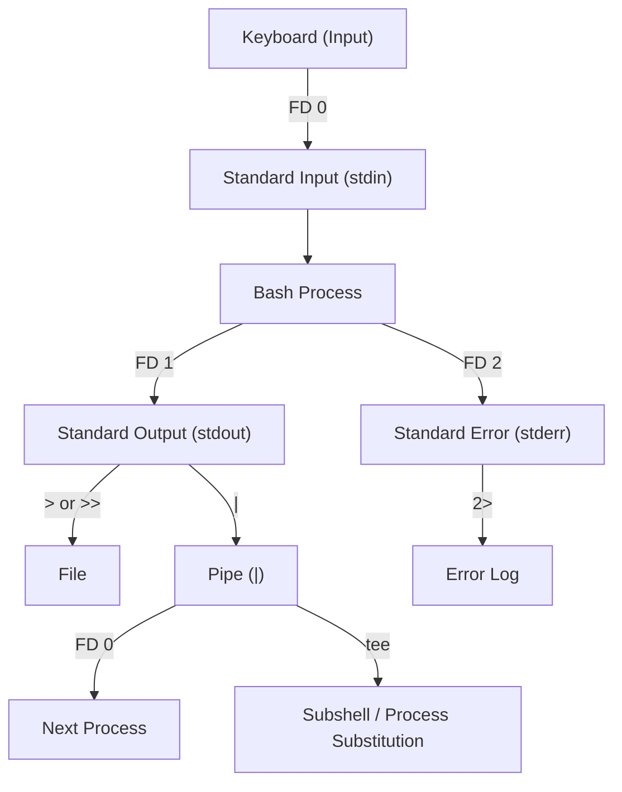
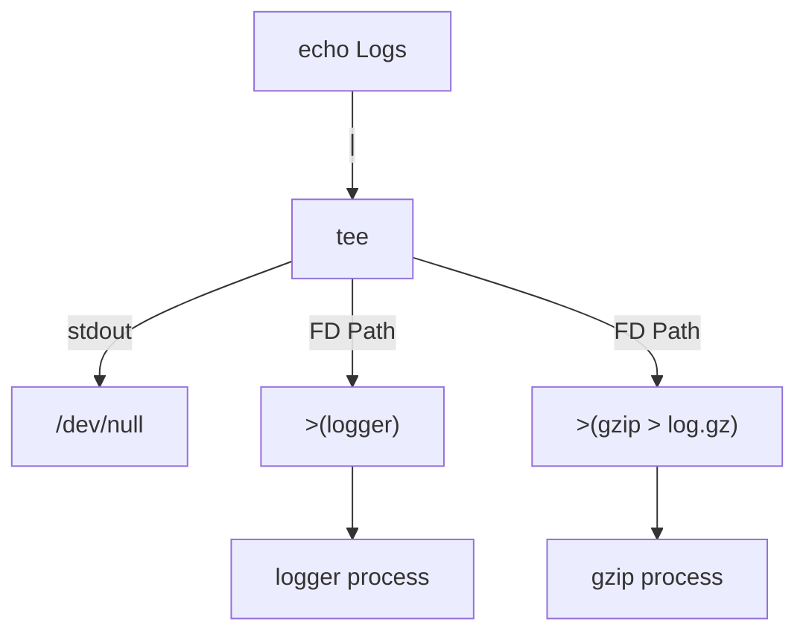
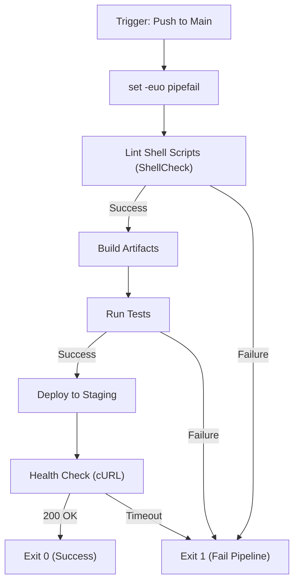

# 📘 Bash Scripting & DevOps — Comprehensive Cheat Sheet

**Author:** Antigravity AI  
**Date:** 2026-08-05  
**Pages/Sections:** 18 Extensive Sections  
**Examples:** 500+ Code Snippets  

---

## 📑 Table of Contents

1. [BASH FUNDAMENTALS](#1-bash-fundamentals)
2. [VARIABLES](#2-variables)
3. [QUOTING](#3-quoting)
4. [CONTROL FLOW](#4-control-flow)
5. [FUNCTIONS](#5-functions)
6. [ARRAYS](#6-arrays)
7. [STRING OPERATIONS](#7-string-operations)
8. [I/O & REDIRECTION](#8-io--redirection)
9. [FILE OPERATIONS](#9-file-operations)
10. [GREP](#10-grep)
11. [SED](#11-sed)
12. [AWK](#12-awk)
13. [PROCESS MANAGEMENT](#13-process-management)
14. [NETWORKING](#14-networking)
15. [SYSTEM ADMINISTRATION](#15-system-administration)
16. [SCRIPTING BEST PRACTICES](#16-scripting-best-practices)
17. [DEVOPS PATTERNS](#17-devops-patterns)
18. [ONE-LINERS & REFERENCE](#18-one-liners--reference)

---

## 1. BASH FUNDAMENTALS

Bash (Bourne Again Shell) is an sh-compatible command language interpreter that executes commands read from the standard input or from a file. 

### Shell Types Comparison Table

| Shell Type | Description | Common Use Case |
|------------|-------------|-----------------|
| sh | The Bourne Shell. Original standard. | POSIX compliance |
| bash | Bourne Again Shell. GNU project standard. | Most Linux scripts |
| zsh | Z Shell. Highly customizable. | Interactive use, macOS default |
| ksh | Korn Shell. Similar to bash. | Legacy UNIX systems |
| dash | Debian Almquist shell. Minimal, fast. | System boot scripts (Ubuntu) |

### The Shebang
The shebang (`#!`) at the beginning of a script tells the operating system which interpreter to use.
```bash
#!/bin/bash
# Absolute path to bash

#!/usr/bin/env bash
# More portable: finds bash in the system PATH (Best Practice)
```

💡 **Best Practice**: Always use `#!/usr/bin/env bash` for maximum portability across different OS distributions.

### Execution Methods
```bash
# 1. Execute with bash (does not require execute permissions)
bash script.sh

# 2. Execute directly (requires execute permissions: chmod +x script.sh)
./script.sh

# 3. Source the script (runs in the current shell context)
source script.sh
# or
. script.sh
```

### Interactive vs Non-interactive, Login vs Non-login
- **Interactive**: Started without non-option arguments, unless `-c` is specified. Connected to a terminal. `$-` contains `i`.
- **Non-interactive**: Scripts running in the background.
- **Login Shell**: First process after login. Reads `/etc/profile`, `~/.bash_profile`, `~/.bash_login`, `~/.profile`.
- **Non-login Shell**: Opened via a terminal emulator. Reads `/etc/bash.bashrc`, `~/.bashrc`.

### Command Chaining
- `;` : Run sequentially.
- `&&` : Run next command ONLY if the first succeeds (exit 0).
- `||` : Run next command ONLY if the first fails (exit != 0).
- `|` : Pipe standard output of first to standard input of second.
- `&` : Run command in the background.

```bash
# Examples
mkdir test_dir ; cd test_dir
make && make install
cat not_found.txt || echo "File missing!"
ls -l | grep "Aug 5"
sleep 100 &
```

---

## 2. VARIABLES

Bash variables are untyped character strings. No spaces are allowed around the `=`.

### Declaration
```bash
MY_VAR="Hello World"
readonly MY_VAR="Cannot be changed"
declare -i NUM=10      # Integer
declare -r CONST="A"   # Readonly
declare -x EXPORTED="B" # Exported to child processes
```

### Quoting Rules Comparison Table
| Quote | Evaluates Variables | Evaluates Commands | Example | Result |
|-------|---------------------|--------------------|---------|--------|
| `' '` | No | No | `'${PATH}'` | `${PATH}` |
| `" "` | Yes | Yes | `"${USER}"` | `root` |
| `` ` ` `` | Yes | Yes | `` `date` `` | `Wed Aug 5...` |

### Special Variables
| Var | Meaning | Var | Meaning |
|---|---|---|---|
| `$0` | Script name | `$?` | Exit status of last command |
| `$1-$9` | Arguments 1 to 9 | `$$` | PID of current shell |
| `${10}` | Argument 10 and beyond | `$!` | PID of last background process |
| `$#` | Number of arguments | `$-` | Current option flags |
| `$@` | All arguments (quoted individually) | `$_` | Last argument of previous command |
| `$*` | All arguments (as a single string) | `$RANDOM` | Random integer (0-32767) |
| `$LINENO` | Current line number in script | `$SECONDS`| Seconds since script started |

### Parameter Expansions

#### Default Values
```bash
# Use Default Value (if unset or null)
echo "${VAR:-default_value}"

# Assign Default Value (if unset or null)
echo "${VAR:=default_value}"

# Display Error if Null or Unset
echo "${VAR:?Variable is not set!}"

# Use Alternative Value (if SET and NOT null)
echo "${VAR:+alternative_value}"
```

#### String Operations
```bash
STR="hello world"
# Substring (Offset:Length)
echo "${STR:0:5}"    # "hello"
echo "${STR:6:5}"    # "world"

# Length
echo "${#STR}"       # 11
```

#### Pattern Matching & Substitution
```bash
FILE="example.tar.gz"

# Remove shortest match from beginning
echo "${FILE#*.}"    # tar.gz
# Remove longest match from beginning
echo "${FILE##*.}"   # gz

# Remove shortest match from end
echo "${FILE%.*}"    # example.tar
# Remove longest match from end
echo "${FILE%%.*}"   # example

# Substitution
echo "${STR/world/universe}"  # Replace first occurrence
echo "${STR//o/0}"            # Replace all occurrences
echo "${STR/#hello/hi}"       # Replace prefix
echo "${STR/%world/earth}"    # Replace suffix
```

#### Case Conversion
```bash
# Requires Bash 4.0+
LOWER="bash"
UPPER="BASH"

echo "${LOWER^^}"   # BASH (All upper)
echo "${LOWER^}"    # Bash (First upper)
echo "${UPPER,,}"   # bash (All lower)
echo "${UPPER,}"    # bASH (First lower)
```

#### Indirect Expansion
```bash
VAR_NAME="ACTUAL_VALUE"
POINTER="VAR_NAME"
echo "${!POINTER}"  # ACTUAL_VALUE
```

---

## 3. QUOTING

Quoting is used to remove the special meaning of certain characters or words.

### Types of Quotes
```bash
# Single Quotes: Literal string, no interpolation.
echo 'Cost is $100'  # Output: Cost is $100

# Double Quotes: Allows interpolation of variables and command substitution.
echo "User is $USER" # Output: User is root (or your username)

# ANSI-C Quoting: Expands escape sequences.
echo $'Line1\nLine2\tTabbed'
```

### Here Documents
Used to pass multi-line strings to a command.
```bash
# Standard Here-Doc
cat <<EOF
This is a multi-line string.
Variables like $USER are evaluated.
EOF

# Stripping Leading Tabs
cat <<-EOF
	This line's leading tabs will be ignored.
	Variables $HOME are still evaluated.
EOF

# Literal Here-Doc (No interpolation)
cat <<'EOF'
No variables $USER will be evaluated here.
EOF
```

### Here Strings
Passes a single string to a command's standard input.
```bash
grep "foo" <<< "foo bar baz"
tr 'a-z' 'A-Z' <<< "lowercase string"
```

---

## 4. CONTROL FLOW

### if/elif/else
```bash
# Example 1: Basic
if [ -f "config.yml" ]; then
    echo "Found config."
fi

# Example 2: Else
if [ "$USER" == "root" ]; then
    echo "Root access."
else
    echo "Normal user."
fi

# Example 3: Elif
if [ $COUNT -gt 100 ]; then
    echo "High"
elif [ $COUNT -gt 50 ]; then
    echo "Medium"
else
    echo "Low"
fi

# Example 4: Compound conditions (using [[ ]])
if [[ -f "file.txt" && -s "file.txt" ]]; then
    echo "File exists and is not empty."
fi

# Example 5: Regex matching
if [[ "example@email.com" =~ ^[a-zA-Z0-9._%+-]+@[a-zA-Z0-9.-]+\.[a-zA-Z]{2,4}$ ]]; then
    echo "Valid email."
fi
```

### `[ ]` (test) vs `[[ ]]` (bash extension)
| Feature | `[ ]` (POSIX) | `[[ ]]` (Bash) |
|---------|---------------|----------------|
| Portability | High (POSIX sh) | Bash/Zsh only |
| Logical AND | `-a` (deprecated) | `&&` |
| Logical OR | `-o` (deprecated) | `||` |
| Pattern Matching| No | Yes (`== *pattern*`) |
| Regex Matching | No | Yes (`=~`) |
| Word Splitting | Yes (needs quotes)| No |

### File Test Operators
- `-e file` : Exists
- `-f file` : Regular file
- `-d dir`  : Directory
- `-r file` : Readable
- `-w file` : Writable
- `-x file` : Executable
- `-s file` : Size > 0
- `-L file` : Symbolic link

### String Operators
- `-z str` : Length is 0
- `-n str` : Length is > 0
- `str1 == str2` : Equal
- `str1 != str2` : Not equal
- `str1 < str2` : Sorts before (in `[[ ]]`)

### Integer Operators
- `-eq` : Equal
- `-ne` : Not equal
- `-gt` : Greater than
- `-ge` : Greater than or equal
- `-lt` : Less than
- `-le` : Less than or equal

### Case / Esac
```bash
case "$1" in
    start)
        echo "Starting..."
        ;; # Terminate block
    stop)
        echo "Stopping..."
        ;;
    restart|reload)
        echo "Restarting..."
        ;;
    *) # Default
        echo "Usage: $0 {start|stop|restart}"
        exit 1
        ;;
esac

# Fall-through variations in Bash 4+
case $VAR in
    a) echo "A" ;&  # Falls through to next pattern unconditionally
    b) echo "B" ;;& # Tests subsequent patterns
    c) echo "C" ;;
esac
```

### For Loops
```bash
# 1. Iterate over list
for item in apple banana cherry; do
    echo $item
done

# 2. Iterate over array
for item in "${ARRAY[@]}"; do
    echo $item
done

# 3. Iterate over files
for file in *.txt; do
    echo "Processing $file"
done

# 4. Command substitution
for user in $(cat users.txt); do
    echo "User: $user"
done

# 5. C-style for loop
for (( i=0; i<10; i++ )); do
    echo "Count: $i"
done
```

### While / Until
```bash
# While
COUNT=0
while [ $COUNT -lt 5 ]; do
    echo "Count: $COUNT"
    ((COUNT++))
done

# Until
COUNT=5
until [ $COUNT -eq 0 ]; do
    echo "Count down: $COUNT"
    ((COUNT--))
done
```

### Select Menu
```bash
PS3="Choose your environment: "
select env in dev staging prod quit; do
    case $env in
        dev|staging|prod) echo "Deploying to $env"; break;;
        quit) break;;
        *) echo "Invalid option";;
    esac
done
```

### Arithmetic Evaluation `(( ))`
```bash
# 1. Assignment
(( a = 10 ))

# 2. Operations
(( b = a + 5 ))

# 3. Increment
(( a++ ))

# 4. C-style evaluation
if (( a > b && b != 0 )); then
    echo "Math is fun"
fi

# 5. Arithmetic expansion
RESULT=$(( a * 10 / 3 ))
```

---

## 5. FUNCTIONS

### Definition Styles
```bash
# Style 1 (Standard)
function_name() {
    echo "Hello"
}

# Style 2 (Bash-specific with keyword)
function my_func {
    echo "World"
}
```

### Arguments, Scope, Returns
```bash
my_script() {
    # Local variables (highly recommended to prevent global scope pollution)
    local arg1="$1"
    local arg2="$2"
    
    # Check args
    if [ $# -lt 2 ]; then
        echo "Missing arguments"
        return 1 # Exit function with code 1
    fi
    
    echo "Args: $arg1, $arg2"
    
    # Return string values by echoing them, capture via substitution
    echo "success"
    return 0
}

RESULT=$(my_script "foo" "bar")
```

### Exporting and Libraries
```bash
# common.sh (Library)
log_info() { echo "[INFO] $1"; }

# main.sh
source common.sh
log_info "Application started."

# Export function to subshells
export -f log_info
```

---

## 6. ARRAYS

### Indexed Arrays
```bash
# Declaration
arr=("apple" "banana" "cherry")

# Assignment
arr[3]="date"

# Length
echo "${#arr[@]}"  # 4

# Access elements
echo "${arr[0]}"   # apple
echo "${arr[@]}"   # all elements

# Iterate
for item in "${arr[@]}"; do
    echo "$item"
done

# Slicing
echo "${arr[@]:1:2}" # banana cherry
```

### Associative Arrays (Bash 4+)
```bash
declare -A map

map=(["dev"]="10.0.0.1" ["prod"]="10.0.0.2")
map["staging"]="10.0.0.3"

# Access value
echo "${map[dev]}"

# Access all keys
echo "${!map[@]}"

# Access all values
echo "${map[@]}"
```

### Mapfile (Readarray)
```bash
# Read lines from a file into an array
mapfile -t lines < file.txt

# Read command output into array
mapfile -t processes < <(ps aux)
```

---

## 7. STRING OPERATIONS

### Native String Ops
(Covered extensively in Section 2: Parameter Expansions)

### External Tools for Strings
```bash
# tr: Translate or delete characters
echo "hello" | tr 'a-z' 'A-Z'    # HELLO
echo "a b c" | tr -d ' '         # abc

# cut: Extract sections
echo "user:x:1000:1000" | cut -d':' -f1,3   # user:1000

# paste: Merge lines of files
paste -d',' file1.txt file2.txt

# printf: Formatted output
printf "%-10s %5d\n" "Apples" 50
printf "%-10s %5d\n" "Bananas" 120
```

---

## 8. I/O & REDIRECTION



### Redirection Operators
- `>` : Redirect stdout, overwrite
- `>>` : Redirect stdout, append
- `2>` : Redirect stderr
- `2>>`: Redirect stderr, append
- `&>` : Redirect both stdout and stderr
- `2>&1`: Redirect stderr to stdout
- `<` : Redirect stdin

```bash
# Examples
echo "log" >> app.log
grep "error" sys.log 2> /dev/null
run_job.sh > output.txt 2>&1
run_job.sh &> output.txt
```

### File Descriptors & Exec
```bash
# Open file descriptor 3 for reading/writing
exec 3<> file.txt
echo "Writing to fd 3" >&3
exec 3>&- # Close fd 3
```

### Process Substitution
Allows a command's input/output to be treated as a file.



```bash
diff <(sort file1.txt) <(sort file2.txt)
echo "Logs" | tee >(logger) >(gzip > log.gz) > /dev/null
```

### The `read` Command
```bash
# -p: Prompt
# -s: Silent (for passwords)
# -t: Timeout in seconds
# -r: Raw input (do not interpret backslashes - BEST PRACTICE)
read -p "Username: " -r user
read -s -p "Password: " -r pass
read -t 5 -p "Press any key... " -n 1 char

# Reading CSV with IFS
IFS=',' read -r col1 col2 col3 <<< "val1,val2,val3"
```

---

## 9. FILE OPERATIONS

### find
```bash
# 1. Find by name
find . -name "*.txt"
# 2. Find by type (file) and ignore case
find . -type f -iname "*.log"
# 3. Find files modified in last 7 days
find /var/log -mtime -7
# 4. Find files larger than 100MB
find / -size +100M
# 5. Find and delete
find /tmp -type f -name "*.tmp" -delete
# 6. Execute command on found files
find . -type f -name "*.sh" -exec chmod +x {} \;
# 7. Execute command efficiently (pass multiple args)
find . -type f -name "*.txt" -exec cat {} +
```

### xargs
```bash
# 1. Basic usage
find . -name "*.bak" | xargs rm
# 2. Handle filenames with spaces (use with find -print0)
find . -name "*.log" -print0 | xargs -0 rm
# 3. Parallel execution (run 4 instances)
cat urls.txt | xargs -P 4 -I {} curl -O {}
# 4. Prompt before execution
ls | xargs -p rm
```

### rsync
```bash
# 1. Basic local sync
rsync -a source/ dest/
# 2. Sync with verbosity and human-readable progress
rsync -avh --progress source/ dest/
# 3. Sync to remote
rsync -avz local_dir/ user@remote:/path/to/remote_dir/
# 4. Delete extraneous files in destination
rsync -avz --delete source/ dest/
# 5. Exclude files
rsync -avz --exclude="*.bak" --exclude=".git/" source/ dest/
```

### tar
```bash
# Create archive
tar -czvf archive.tar.gz /path/to/dir
# Extract archive
tar -xzvf archive.tar.gz -C /extract/path
# View contents
tar -tzvf archive.tar.gz
```

---

## 10. GREP

Global Regular Expression Print.

### Key Options
- `-r` : Recursive
- `-i` : Case insensitive
- `-v` : Invert match (exclude)
- `-c` : Count matches
- `-l` : Print file names only
- `-L` : Print file names without matches
- `-n` : Print line numbers
- `-w` : Match whole words
- `-x` : Match whole lines
- `-E` : Extended regex (`egrep`)
- `-P` : Perl-compatible regex
- `-o` : Print only the matched part
- `-A n`: Print n lines AFTER match
- `-B n`: Print n lines BEFORE match
- `-C n`: Print n lines BEFORE and AFTER
- `-q` : Quiet (exit 0 if found)

### Practical Examples
```bash
# 1. Find IP addresses
grep -E -o "([0-9]{1,3}\.){3}[0-9]{1,3}" access.log

# 2. Exclude comments and empty lines
grep -v -E "^#|^$" config.ini

# 3. Search multiple words (OR)
grep -E "ERROR|WARN|FATAL" app.log

# 4. Recursively search only .py files
grep -r --include="*.py" "def main" .

# 5. Find exact word boundary
grep -w "user" /etc/passwd

# 6. Show 2 lines before and after match
grep -C 2 "Exception" server.log
```

---

## 11. SED

Stream Editor, used for text transformation.

### Syntax
`sed [OPTIONS] 'COMMAND' file`

### Substitution (`s`)
```bash
# Replace first occurrence on each line
sed 's/foo/bar/' file.txt

# Replace all occurrences (global)
sed 's/foo/bar/g' file.txt

# Ignore case
sed 's/foo/bar/gi' file.txt

# Print only changed lines
sed -n 's/foo/bar/p' file.txt

# In-place edit (WARNING: overwrites file)
sed -i 's/foo/bar/g' file.txt

# In-place with backup
sed -i.bak 's/foo/bar/g' file.txt

# Use alternative delimiter (if regex contains slashes)
sed 's|/var/www|/opt/web|g' config.txt
```

### Deletion (`d`)
```bash
# Delete line 5
sed '5d' file.txt

# Delete lines 2 through 4
sed '2,4d' file.txt

# Delete from line 3 to end of file
sed '3,$d' file.txt

# Delete blank lines
sed '/^$/d' file.txt
```

### Other Commands
```bash
# Print line 5
sed -n '5p' file.txt

# Insert before line 2
sed '2i\New Line' file.txt

# Append after line 2
sed '2a\New Line' file.txt

# Multiple commands
sed -e 's/foo/bar/g' -e '/baz/d' file.txt
```

---

## 12. AWK

Text processing language, excellent for column-based data.

### Basics
`awk 'pattern { action }' file`

### Built-in Variables
- `$0` : Entire line
- `$1, $2` : Field 1, Field 2, etc.
- `NF` : Number of fields in current record
- `NR` : Number of records (lines) processed so far
- `FNR`: Record number in current file
- `FS` : Field Separator (default whitespace)
- `OFS`: Output Field Separator (default space)

### Examples
```bash
# 1. Print first and third column
awk '{print $1, $3}' data.txt

# 2. Custom Field Separator (CSV)
awk -F',' '{print $2}' data.csv

# 3. Print last field of every line
awk '{print $NF}' data.txt

# 4. Pattern matching (print lines containing "ERROR")
awk '/ERROR/ {print $0}' app.log

# 5. Conditional (print if 3rd col > 50)
awk '$3 > 50 {print $0}' scores.txt

# 6. Formatting with printf
awk '{printf "Name: %-10s Score: %5d\n", $1, $2}' scores.txt

# 7. BEGIN and END blocks (Calculate sum)
awk 'BEGIN {sum=0} {sum+=$1} END {print "Total: ", sum}' numbers.txt

# 8. Associative Arrays (Count occurrences of col 1)
awk '{count[$1]++} END {for (word in count) print word, count[word]}' words.txt
```

---

## 13. PROCESS MANAGEMENT

### Job Control
```bash
# Start in background
./long_script.sh &

# List jobs
jobs

# Bring to foreground
fg %1

# Send suspended to background
bg %1
```

### Detaching Processes
```bash
# nohup: Ignore HUP (hangup) signal, keeps running after logout
nohup ./script.sh &> script.log &

# disown: Remove job from shell's active job list
./script.sh &
disown %1
```

### Signals & Traps
Used to catch signals and perform cleanup.
```bash
# Catch Ctrl+C (SIGINT) and SIGTERM
trap 'echo "Script interrupted. Cleaning up..."; rm -f /tmp/tempfile; exit 1' INT TERM

# Catch Exit (Runs when script exits naturally or via exit command)
trap 'echo "Execution finished."' EXIT

# Catch ERR (Runs when a command fails)
trap 'echo "Error on line $LINENO"' ERR
```

---

## 14. NETWORKING

### curl
```bash
# 1. Basic GET
curl http://example.com

# 2. Download file (-O keeps original filename)
curl -O http://example.com/file.zip

# 3. Follow redirects
curl -L http://example.com

# 4. HTTP Headers (Send)
curl -H "Authorization: Bearer TOKEN" http://api.example.com

# 5. POST request with JSON
curl -X POST -H "Content-Type: application/json" \
     -d '{"key":"value"}' http://api.example.com/data

# 6. View headers only (-I)
curl -I http://example.com

# 7. Write out custom format (Performance metrics)
curl -w "Time: %{time_total}s\n" -s -o /dev/null http://example.com
```

### SSH
```bash
# 1. Basic login
ssh user@host

# 2. Using identity file (private key)
ssh -i ~/.ssh/id_rsa user@host

# 3. Local Port Forwarding (Tunneling)
# Forwards local port 8080 to remote DB 3306 via jump host
ssh -L 8080:db.internal:3306 user@jump.host

# 4. ProxyJump (Jump through bastion)
ssh -J bastion_user@bastion_host app_user@app_host
```

### netcat (nc)
```bash
# 1. Simple port scan
nc -zv 192.168.1.1 22-80

# 2. Listen on port (Server)
nc -l -p 8080

# 3. Connect to port (Client)
nc 127.0.0.1 8080
```

---

## 15. SYSTEM ADMINISTRATION

### Permissions
```bash
# chmod: Change mode
chmod 755 script.sh   # rwxr-xr-x
chmod u+x script.sh   # add execute to user
chmod -R 644 /var/www # Recursive

# chown: Change owner/group
chown root:root file.txt
chown -R www-data:www-data /var/www
```

### Monitoring
```bash
# View processes
ps aux
# Tree view
ps f
# Search for process
pgrep nginx

# Systemctl (Systemd)
systemctl status nginx
systemctl restart nginx
systemctl enable nginx # Start on boot

# Journalctl (Logs)
journalctl -u nginx # Logs for nginx service
journalctl -f       # Follow tail
journalctl -n 50    # Last 50 lines
```

### Cron
Format: `Minute Hour Day Month DayOfWeek Command`
```bash
# Run every day at 2:30 AM
30 2 * * * /path/to/script.sh

# Run every 15 minutes
*/15 * * * * /path/to/script.sh

# Run Monday-Friday at 5 PM
0 17 * * 1-5 /path/to/script.sh
```

---

## 16. SCRIPTING BEST PRACTICES

### The Strict Mode
Always start serious scripts with:
```bash
set -euo pipefail
```
- `-e`: Exit immediately if a command exits with a non-zero status.
- `-u`: Treat unset variables as an error when substituting.
- `-o pipefail`: The return value of a pipeline is the status of the last command to exit with a non-zero status.

### Argument Parsing (getopts)
```bash
while getopts "a:b:c" opt; do
  case ${opt} in
    a ) ARG_A=$OPTARG ;;
    b ) ARG_B=$OPTARG ;;
    c ) FLAG_C=true ;;
    \? ) echo "Usage: cmd [-a arg] [-b arg] [-c]"
      exit 1
      ;;
  esac
done
shift $((OPTIND -1))
```

### ANSI Colors for Logging
```bash
RED='\033[0;31m'
GREEN='\033[0;32m'
YELLOW='\033[1;33m'
NC='\033[0m' # No Color

log_info() { echo -e "${GREEN}[INFO]${NC} $1"; }
log_warn() { echo -e "${YELLOW}[WARN]${NC} $1"; }
log_err()  { echo -e "${RED}[ERROR]${NC} $1"; }

log_info "Deployment started..."
```

---

## 17. DEVOPS PATTERNS



### Robust Backup Script Pattern
```bash
#!/usr/bin/env bash
set -euo pipefail

SOURCE_DIR="/var/data"
BACKUP_DIR="/backup"
DATE=$(date +%Y%m%d_%H%M%S)
ARCHIVE_NAME="data_backup_${DATE}.tar.gz"
RETENTION_DAYS=7

echo "Starting backup of ${SOURCE_DIR} to ${BACKUP_DIR}/${ARCHIVE_NAME}"

# Create backup
tar -czf "${BACKUP_DIR}/${ARCHIVE_NAME}" -C "$(dirname ${SOURCE_DIR})" "$(basename ${SOURCE_DIR})"

# Verify backup
if [ -f "${BACKUP_DIR}/${ARCHIVE_NAME}" ]; then
    echo "Backup completed successfully."
else
    echo "Backup failed!" >&2
    exit 1
fi

# Rotate old backups
echo "Cleaning up backups older than ${RETENTION_DAYS} days..."
find "${BACKUP_DIR}" -type f -name "data_backup_*.tar.gz" -mtime +${RETENTION_DAYS} -exec rm -f {} \;

echo "Done."
```

### Health Check Pattern
```bash
#!/usr/bin/env bash
set -euo pipefail

URL="http://localhost:8080/health"
MAX_RETRIES=10
RETRY_DELAY=5

check_health() {
    curl -s -o /dev/null -w "%{http_code}" "$URL"
}

for ((i=1; i<=MAX_RETRIES; i++)); do
    STATUS=$(check_health || echo "000")
    if [ "$STATUS" == "200" ]; then
        echo "Service is up!"
        exit 0
    fi
    echo "Attempt $i/$MAX_RETRIES: Service not ready (HTTP $STATUS). Waiting ${RETRY_DELAY}s..."
    sleep $RETRY_DELAY
done

echo "Service failed to become ready in time." >&2
exit 1
```

---

## 18. ONE-LINERS & REFERENCE

- **Serve current directory over HTTP**: `python3 -m http.server 8000`
- **Extract IP addresses from file**: `grep -oE "\b([0-9]{1,3}\.){3}[0-9]{1,3}\b" file.txt`
- **Find top 10 largest files/dirs**: `du -hs * | sort -rh | head -10`
- **Clear a file quickly**: `> file.log`
- **Watch a command output**: `watch -n 1 "ps aux | grep nginx"`
- **List listening ports**: `ss -tulnp`

### Exit Codes Quick Reference
| Code | Meaning |
|------|---------|
| 0 | Success |
| 1 | General error |
| 2 | Misuse of shell built-ins |
| 126 | Command invoked cannot execute (permissions) |
| 127 | Command not found |
| 128 | Invalid argument to exit |
| 130 | Script terminated by Control-C |

---
*End of Cheat Sheet. Use this as your primary daily reference for Bash scripting and DevOps automation tasks.*
