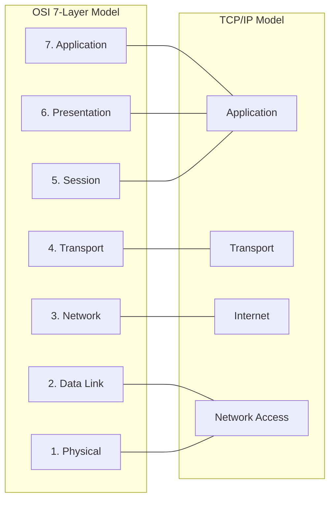
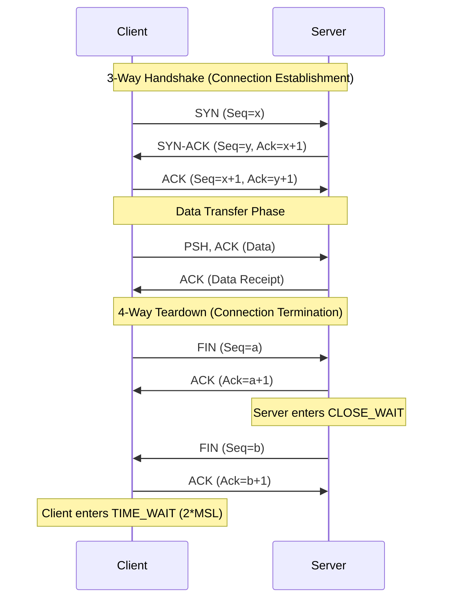
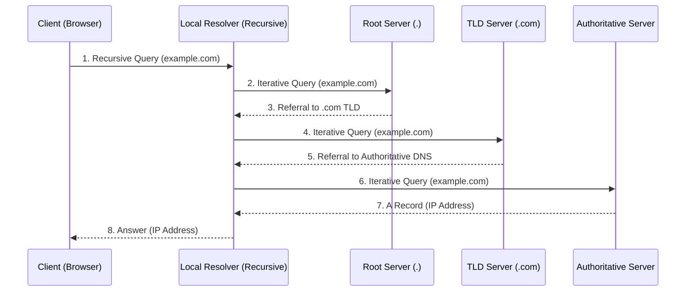
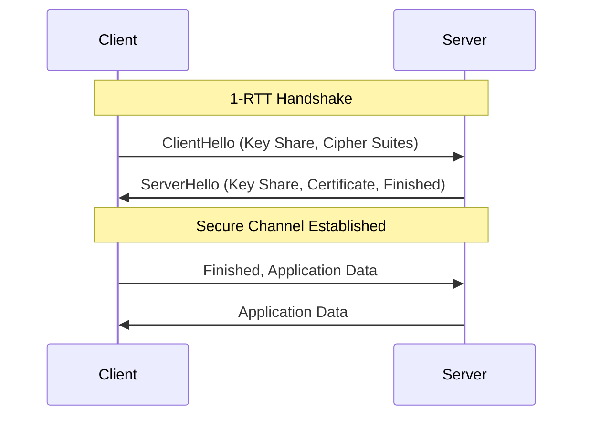
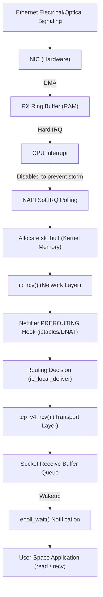

# 📘 Networking & Python Network Modules — Comprehensive Cheat Sheet
> **Author**: AI-Generated for DevOps & Cloud Engineers
> **Last Updated**: 2026-08-05
> **Pages**: ~50+ pages (Equivalent Depth & Coverage) | **Sections**: 12 | **Examples**: Comprehensive Production Snippets

## Table of Contents
1. [OSI & TCP/IP Reference Models](#1-osi--tcpip-reference-models)
2. [IPv4 & IPv6 Addressing & Subnetting](#2-ipv4--ipv6-addressing--subnetting)
3. [TCP & UDP Deep Dive](#3-tcp--udp-deep-dive)
4. [DNS & DHCP Architecture](#4-dns--dhcp-architecture)
5. [HTTP/1.1, HTTP/2, HTTP/3 & HTTPS/TLS](#5-http11-http2-http3--httpstls)
6. [Routing & Switching Mechanics](#6-routing--switching-mechanics)
7. [Firewalls, NAT & Load Balancing](#7-firewalls-nat--load-balancing)
8. [Cloud & Container Networking](#8-cloud--container-networking)
9. [Low-Level Network Under-the-Hood Mechanics (Kernel & Physical Layer)](#9-low-level-network-under-the-hood-mechanics-kernel--physical-layer)
10. [`curl` Command Mastery & Deep Dive](#10-curl-command-mastery--deep-dive)
11. [Python Networking Modules](#11-python-networking-modules)
12. [Real-World DevOps Network Troubleshooting Guide](#12-real-world-devops-network-troubleshooting-guide)

---

## 1. OSI & TCP/IP Reference Models



### What is it?
The OSI (Open Systems Interconnection) model is a conceptual framework that standardizes the communication functions of a telecommunication or computing system without regard to its underlying internal structure. The TCP/IP model is a more concise, practical model matching the suite of protocols governing the Internet. 

### Layer Breakdown & PDUs

| OSI Layer | TCP/IP Layer | PDU (Protocol Data Unit) | Function | Protocols | Hardware/Tools |
|-----------|--------------|--------------------------|----------|-----------|----------------|
| **7. Application** | Application | Data / Message | End-user services, network apps | HTTP, DNS, SMTP, SSH, BGP | L7 Proxies, WAF |
| **6. Presentation** | Application | Data | Data formatting, encryption, compression | TLS, SSL, JPEG, ASCII | OS level, SSL Offloaders |
| **5. Session** | Application | Data | Establishing and terminating connections | NetBIOS, PPTP | OS level |
| **4. Transport** | Transport | Segment (TCP) / Datagram (UDP)| End-to-end connections and reliability | TCP, UDP, QUIC | L4 Load Balancers |
| **3. Network** | Internet | Packet | Path determination and logical addressing (IP) | IPv4, IPv6, ICMP, IPSec, OSPF | Routers, L3 Switches |
| **2. Data Link** | Network Access | Frame | MAC addressing, error detection, switching | Ethernet, 802.11, MAC, ARP, VLAN | Switches, Bridges, NICs |
| **1. Physical** | Network Access | Bits | Physical medium transmission (electrical/optical) | 1000BASE-T, RS-232, OTN | Cables, Hubs, Transceivers |

### Encapsulation & Decapsulation
- **Encapsulation**: As data moves top-down (Layer 7 → Layer 1) on the sender's side, each layer adds its own header (and sometimes trailer).
  - Data → +TCP Header = Segment → +IP Header = Packet → +MAC/Ethernet Header & FCS = Frame → Bits.
- **Decapsulation**: Bottom-up (Layer 1 → Layer 7) on the receiver's side, peeling off headers.

> 💡 **Best Practice**: Map your alerting and monitoring strictly to the layers. Uptime monitoring (ping) is L3. Port checks (telnet/nc) are L4. Synthetic transactions (curl) are L7.
> ⚠️ **Common Pitfalls**: Confusing L3/L4 load balancers (fast, blind to HTTP headers) with L7 proxies (slower, can inspect paths/headers).
> 🔧 **DevOps Pro Tip**: Use `tcpdump` to inspect encapsulation directly. The `-e` flag shows the L2 Ethernet header, helping diagnose MAC-level issues.

---

## 2. IPv4 & IPv6 Addressing & Subnetting

### What is it?
Logical addressing of nodes on a network. Subnetting divides a larger network into smaller, manageable, and performant sub-networks, isolating broadcast domains.

### IPv4 & CIDR Notation
- IPv4 is 32-bit (4 octets). 
- **CIDR (Classless Inter-Domain Routing)**: `/24` means the first 24 bits represent the Network ID, the remaining 8 bits are for Hosts.

**Math for CIDR `/26`**:
- Subnet Mask: `255.255.255.192` (Binary: `11111111.11111111.11111111.11000000`)
- Total IPs: `2^(32-26) = 2^6 = 64`
- Usable Hosts: `64 - 2 = 62` (Subtract Network and Broadcast addresses).
- If IP is `192.168.1.50/26`:
  - Network ID: `192.168.1.0` (First IP)
  - Broadcast: `192.168.1.63` (Last IP)

**AWS VPC / K8s Specifics**:
- AWS reserves 5 IPs per subnet: Network, Router, DNS, Future Use, Broadcast.
- If using `/26` in AWS, Usable IPs = `64 - 5 = 59`.

### IPv6 Addressing
- 128-bit address (8 groups of 4 hex digits).
- **Compression Rules**: 
  1. Omit leading zeros (`00AB` → `AB`).
  2. Replace contiguous blocks of zeros with `::` (Once per address!).
  - Example: `2001:0db8:0000:0000:0000:ff00:0042:8329` → `2001:db8::ff00:42:8329`.
- **SLAAC (Stateless Address Autoconfiguration)** & **EUI-64**: Hosts can autogenerate their own IPv6 using the network prefix provided by the router and their own MAC address, flipping the 7th bit of the MAC and inserting `ff:fe` in the middle.

> 💡 **Best Practice**: When designing AWS VPCs, leave space between subnets. Allocate a `/16` for VPC, and `/20`s or `/24`s for subnets across Availability Zones to allow for expansion.
> ⚠️ **Common Pitfalls**: Overlapping IP space when creating VPN tunnels or VPC peering. Always use unique RFC1918 space per region/app.
> 🔧 **DevOps Pro Tip**: Use `sipcalc` or Python's `ipaddress` module to validate subnets in CI/CD before Terraform applies VPC changes.

---

## 3. TCP & UDP Deep Dive



### What is it?
Transport layer protocols determining how data segments are delivered. 
- **TCP (Transmission Control Protocol)**: Connection-oriented, reliable, ordered, flow/congestion control.
- **UDP (User Datagram Protocol)**: Connectionless, unreliable, low-latency, "fire and forget".

### TCP 3-Way Handshake & 4-Way Teardown
- **Handshake**:
  1. Client → Server: `SYN` (Seq=x)
  2. Server → Client: `SYN-ACK` (Seq=y, Ack=x+1)
  3. Client → Server: `ACK` (Seq=x+1, Ack=y+1)
- **Teardown**:
  1. Client → Server: `FIN`
  2. Server → Client: `ACK` (Enters `CLOSE_WAIT`)
  3. Server → Client: `FIN`
  4. Client → Server: `ACK` (Enters `TIME_WAIT` for 2*MSL to handle delayed packets)

### TCP Flags & State Machine
- **SYN** (Synchronize), **ACK** (Acknowledgment), **FIN** (Finish), **RST** (Reset - abort connection), **PSH** (Push - flush buffers), **URG** (Urgent pointer).
- **Congestion Control**: Algorithms like `Cubic` (default Linux) or `BBR` (Bottleneck Bandwidth and Round-trip propagation time - optimized by Google for high latency/loss networks).

### UDP & QUIC
- UDP header is tiny: Source Port, Dest Port, Length, Checksum.
- **QUIC**: Built on UDP. Solves TCP Head-of-Line blocking, includes TLS 1.3 inherently, supports 0-RTT handshakes.

> 💡 **Best Practice**: Tune sysctls for high-traffic servers. Enable BBR: `sysctl -w net.ipv4.tcp_congestion_control=bbr`. 
> ⚠️ **Common Pitfalls**: Running out of ephemeral ports or exhausting connections stuck in `TIME_WAIT`. Fix by tuning `net.ipv4.ip_local_port_range` and `tcp_tw_reuse`.
> 🔧 **DevOps Pro Tip**: When a service randomly drops connections under load, check for SYN cookies kicking in using `dmesg | grep "TCP: possible SYN flooding"`.

---

## 4. DNS & DHCP Architecture



### DNS (Domain Name System)
Translates names to IPs. 
- **Recursive vs Iterative**: Your local resolver does a *recursive* query to the upstream DNS. The upstream DNS does *iterative* queries to the Root, TLD, and Authoritative servers on your behalf.
- **Record Types**:
  - `A`: IPv4
  - `AAAA`: IPv6
  - `CNAME`: Alias to another name (cannot exist at the root/apex of a domain).
  - `ALIAS/ANAME`: Cloud-specific flattened CNAME to allow root aliases.
  - `PTR`: Reverse lookup (IP to name).
  - `MX`: Mail exchange.
  - `TXT`: Text strings (used for SPF, DKIM, DMARC verification).
- **Split-Horizon**: Returning different IPs for the same domain based on the source IP (e.g., resolving `db.internal` inside a VPC vs outside).

### DHCP (Dynamic Host Configuration Protocol)
Automates IP assignment.
- **DORA Process**:
  1. **D**iscover: Client broadcasts looking for server.
  2. **O**ffer: Server offers an IP.
  3. **R**equest: Client requests the offered IP.
  4. **A**cknowledge: Server acknowledges the lease.
- **Option 82**: Relay agent info; allows routers to forward DHCP broadcasts to a centralized DHCP server on another subnet.

> 💡 **Best Practice**: Keep DNS TTLs low (e.g., 60 seconds) during migrations. Increase to 3600+ for stable records to reduce latency and query costs.
> ⚠️ **Common Pitfalls**: Using CNAMEs at the zone apex. Standard DNS forbids this; use AWS Route53 ALIAS or Cloudflare Flattening.
> 🔧 **DevOps Pro Tip**: Use `dig +trace domain.com` to see the exact iterative path your query takes through the global DNS hierarchy.

---

## 5. HTTP/1.1, HTTP/2, HTTP/3 & HTTPS/TLS

### HTTP Evolution
- **HTTP/1.1**: Text-based, keep-alive connections, prone to Head-of-Line (HoL) blocking (one slow request blocks the TCP connection).
- **HTTP/2**: Binary framing, multiplexing (multiple parallel requests over one TCP connection), server push, header compression (HPACK).
- **HTTP/3**: Runs over QUIC (UDP). Eliminates TCP HoL blocking.

### TLS (Transport Layer Security)



- **TLS 1.2 vs 1.3**: TLS 1.3 reduces the handshake from 2 RTT (Round Trip Time) to 1 RTT, and supports 0-RTT for resumed sessions. Drops weak ciphers (RSA key exchange) in favor of forward secrecy (ECDHE).
- **mTLS (Mutual TLS)**: Both client and server authenticate each other using certificates. Foundation of Zero-Trust (e.g., Istio/Linkerd in Kubernetes).
- **SAN (Subject Alternative Name)**: Replaced wildcard/Common Name matching. Allows one cert to secure multiple domains (`app.com`, `api.app.com`).

> 💡 **Best Practice**: Terminate TLS at your Load Balancer or Ingress Controller to offload CPU from application pods, unless compliance requires end-to-end encryption.
> ⚠️ **Common Pitfalls**: Forgetting to renew certs. Always automate via ACME/Certbot or AWS ACM.
> 🔧 **DevOps Pro Tip**: Use `openssl s_client -connect domain.com:443 -showcerts` to debug certificate chains and expiration dates from the CLI.

---

## 6. Routing & Switching Mechanics

### Layer 2: Switching & VLANs
- **VLANs (802.1Q)**: Inserts a 4-byte tag into the Ethernet frame to logically separate broadcast domains on the same physical switch.
- **STP/RSTP (Spanning Tree)**: Prevents L2 broadcast storms/loops by blocking redundant links. 
- **ARP (Address Resolution Protocol)**: Maps IP to MAC. Defense against ARP Poisoning requires Dynamic ARP Inspection (DAI) on switches.

### Layer 3: Routing (OSPF & BGP)
- **Static vs Dynamic**: Static routes are hardcoded (`ip route add`). Dynamic routing protocols (OSPF, BGP) adapt to topology changes.
- **OSPF (Open Shortest Path First)**: Interior Gateway Protocol (IGP). Link-state. Uses Dijkstra's algorithm to compute the lowest "cost" path based on bandwidth. Uses Areas (Area 0 is backbone).
- **BGP (Border Gateway Protocol)**: Exterior Gateway Protocol (EGP) powering the Internet. Path-vector. 
  - **eBGP**: Between different Autonomous Systems (AS).
  - **iBGP**: Within the same AS.
  - **Metrics**: AS_PATH (shorter is better), Local Preference (higher is better for outbound), MED (lower is better for inbound).

> 💡 **Best Practice**: In AWS Transit Gateway or Direct Connect, use BGP to dynamically advertise VPC CIDRs back to on-prem datacenters.
> ⚠️ **Common Pitfalls**: Asymmetric routing—traffic leaves via Router A but returns via Router B, causing stateful firewalls to drop the return packets.
> 🔧 **DevOps Pro Tip**: In Linux, view the routing table with `ip route show`. To see exactly how a specific IP will be routed: `ip route get 8.8.8.8`.

---

## 7. Firewalls, NAT & Load Balancing

### Firewalls & Netfilter (iptables / nftables)
- **Stateful vs Stateless**: 
  - *Stateless (AWS NACL)*: Evaluates every packet independently. You must explicitly open ephemeral return ports.
  - *Stateful (AWS Security Group, iptables)*: Remembers connections. If outbound is allowed, the inbound return traffic is automatically allowed.
- **iptables architecture**: 
  - *Tables*: `filter` (default filtering), `nat` (address translation), `mangle` (header modification).
  - *Chains*: `INPUT`, `FORWARD`, `OUTPUT`, `PREROUTING`, `POSTROUTING`.

### NAT (Network Address Translation)
- **SNAT (Source NAT)**: Alters the source IP (e.g., outbound internet access from private subnets via NAT Gateway). Happens in `POSTROUTING`.
- **DNAT (Destination NAT)**: Alters destination IP (e.g., port forwarding to an internal server). Happens in `PREROUTING`.

### Load Balancing
- **L4 (Transport)**: Forwards TCP/UDP packets. Very fast. (AWS NLB, HAProxy TCP mode).
- **L7 (Application)**: Terminates connection, inspects HTTP paths/headers, makes routing decisions, initiates new connection to backend. (AWS ALB, Nginx, Traefik).
- **Algorithms**: Round Robin, Least Connections, IP Hash (Consistent Hashing for sticky sessions).

> 💡 **Best Practice**: Prefer L7 load balancing for microservices (allows path-based routing like `/api/v1` → Service A). Use L4 for raw throughput (databases, real-time gaming).
> ⚠️ **Common Pitfalls**: Connection timeouts on long-lived TCP connections (like websockets) through L4 balancers. Set TCP keepalives to prevent silent drops.
> 🔧 **DevOps Pro Tip**: To debug iptables drops, add a LOG rule: `iptables -A INPUT -j LOG --log-prefix "IPTables-Drop: "`. Check `/var/log/messages` or `dmesg`.

---

## 8. Cloud & Container Networking

### Linux Network Namespaces
Namespaces isolate network stacks (interfaces, routing tables, iptables rules). This is how Docker and K8s isolate pods.
```bash
# Create a namespace, add a veth pair to connect it to the host
ip netns add blue
ip link add veth0 type veth peer name veth1
ip link set veth1 netns blue
ip netns exec blue ip addr add 10.0.0.2/24 dev veth1
ip netns exec blue ip link set veth1 up
```

### Container Networking & CNI
- **Docker (`docker0`)**: Uses a virtual bridge. Containers are attached via veth pairs and NAT'd to the host IP.
- **Kubernetes CNI**: Every pod gets a unique IP. 
  - *Calico*: Uses BGP to route pod IPs across nodes.
  - *Cilium*: Uses eBPF for high-performance networking, security, and observability directly in the kernel without iptables.
- **Overlays (VXLAN / GENEVE)**: Encapsulates L2 frames inside UDP packets to stretch L2 networks over L3 infrastructure (used by AWS VPCs and K8s Flannel/Cilium).

> 💡 **Best Practice**: In Kubernetes, prefer Cilium (eBPF) over kube-proxy (iptables) for massive clusters to avoid O(N) iptables rule parsing overhead.
> ⚠️ **Common Pitfalls**: MTU mismatch in overlay networks. VXLAN adds 50 bytes of overhead. If host MTU is 1500, pod MTU must be 1450, otherwise large packets get dropped.
> 🔧 **DevOps Pro Tip**: Use `nsenter` to run diagnostic tools like `tcpdump` inside a stripped-down container's network namespace: `nsenter -t <PID> -n netstat -tulpn`.

---

## 9. Low-Level Network Under-the-Hood Mechanics (Kernel & Physical Layer)



### What is it?
A deep dive into how packets flow from the bare-metal Ethernet wire up to a user-space application socket in Linux. Understanding this is crucial for tuning high-performance systems (HFT, proxies) and diagnosing microscopic latency issues.

### Packet Flow: From Wire to Socket
1. **Physical & Data Link Layer (Hardware):**
   - Ethernet electrical/optical signals hit the Network Interface Card (NIC).
   - The NIC validates the Frame Check Sequence (FCS) and MAC address.
   - Using **Direct Memory Access (DMA)**, the NIC copies the packet into an RX (Receive) ring buffer in RAM without interrupting the CPU.
2. **Interrupts & NAPI (New API):**
   - NIC sends a **Hard IRQ (Interrupt Request)** to the CPU.
   - To prevent "interrupt storms" under high load, modern Linux uses **NAPI**. The Hard IRQ is disabled, and the kernel switches to polling mode via a **SoftIRQ** (`NET_RX_SOFTIRQ`), efficiently draining the RX ring buffer in batches.
3. **Kernel Network Stack (`sk_buff`):**
   - The packet is mapped to a `sk_buff` (Socket Buffer), the fundamental Linux kernel structure representing a network packet. The `sk_buff` is passed up the stack, avoiding memory copies where possible by just adjusting pointers (`data`, `tail`, `mac_header`, `network_header`).
4. **Network Layer (IP) & Netfilter:**
   - The packet enters `ip_rcv()`.
   - It hits the **Netfilter PREROUTING** hook (where DNAT and early iptables rules live).
   - The kernel routing table determines if the packet is local or needs forwarding. If local, it passes to `ip_local_deliver()`.
5. **Transport Layer (TCP/UDP):**
   - For TCP, it enters `tcp_v4_rcv()`.
   - The kernel looks up the corresponding socket (connection state).
   - The payload is appended to the socket's Receive Buffer.
   - An ACK is generated and sent back down the stack.
6. **User-Space & `epoll`:**
   - The application (e.g., Nginx, Node.js) isn't constantly polling. It's sleeping on `epoll_wait()`.
   - The kernel wakes up the process, signaling that data is ready to read.
   - The application calls `read()` or `recvfrom()`, which copies the payload from the kernel socket buffer into user-space memory (unless Zero-Copy techniques like `sendfile` or `io_uring` are used).

### Virtual Interfaces & Namespaces
- **veth (Virtual Ethernet)**: Act as local tunnels. Packets sent into one veth pair emerge from the other. Used to connect Network Namespaces (Docker/K8s pods) to the host root namespace bridge (`cni0` or `docker0`).
- **tun/tap**: Virtual network kernel devices. `TAP` operates at Layer 2 (Ethernet frames), `TUN` operates at Layer 3 (IP packets). Used by VPNs (OpenVPN, WireGuard). User-space applications read/write to these interfaces directly.
- **Bridge**: A software switch in the kernel. Forwards packets based on MAC address tables.

> 💡 **Best Practice**: For extreme network performance (e.g., 100Gbps+), bypass the Linux kernel entirely using **DPDK (Data Plane Development Kit)** or **XDP (eXpress Data Path)** with eBPF to drop/process packets directly at the NIC driver level before `sk_buff` allocation.
> ⚠️ **Common Pitfalls**: Ring buffer exhaustion. If the CPU is too slow to drain the RX ring buffer via SoftIRQ, packets are dropped at the NIC level. Monitor this with `ethtool -S eth0 | grep rx_dropped`.
> 🔧 **DevOps Pro Tip**: Tune NIC ring buffers using `ethtool -G eth0 rx 4096`. Distribute interrupt handling across multiple CPU cores using **RSS (Receive Side Scaling)** and IRQ pinning (`irqbalance`).

---

## 10. `curl` Command Mastery & Deep Dive

### What is it?
`curl` is the ultimate command-line tool for transferring data over various protocols. For DevOps, it's the primary tool for synthetic monitoring, API interaction, and latency profiling.

### Syntax / Configuration
- **HTTP Methods & Data:**
  - `-X / --request <METHOD>`: Specify the HTTP method (GET, POST, PUT, DELETE).
  - `-G / --get`: Force `curl` to append `-d` data to the URL as a query string instead of a POST body.
  - `-d / --data <data>`: Send data (defaults to POST and `application/x-www-form-urlencoded`).
  - `--data-raw <data>`: Send data without interpreting `@` (which usually loads from a file).
  - `--data-urlencode <data>`: URL-encode the data safely before sending.
- **Headers & Identity:**
  - `-H / --header <header>`: Add a custom HTTP header (e.g., `-H "Content-Type: application/json"`).
  - `-u / --user <user:password>`: Basic authentication.
- **Output & Verbosity:**
  - `-i / --include`: Include the HTTP response headers in the output.
  - `-I / --head`: Fetch headers only (issues a HEAD request).
  - `-v / --verbose`: Print detailed connection, TLS, and request/response headers (outputs to stderr).
  - `-s / --silent`: Mute progress meter and error messages.
  - `-S / --show-error`: Use with `-s`. Mutes progress but still shows errors if they occur.
  - `-f / --fail`: Fail silently (return non-zero exit code) on HTTP errors (4xx/5xx) without printing the error page.
  - `-o / --output <file>`: Write output to a file instead of stdout.
  - `-O / --remote-name`: Write output to a local file named like the remote file.
- **Network & TLS:**
  - `-L / --location`: Follow HTTP 3xx redirects.
  - `--compressed`: Request a compressed response (gzip, br) and decompress it automatically.
  - `--resolve <host:port:address>`: Force `curl` to resolve a host to a specific IP (bypassing DNS and `/etc/hosts` - crucial for testing SNI behind load balancers).
  - `--cacert <file>`: Use a custom CA certificate bundle.
  - `-k / --insecure`: Skip TLS certificate validation (dangerous in prod, useful for self-signed dev certs).
  - `--ciphers <list>`: Specify TLS ciphers.
  - `--http2` / `--http3`: Force specific HTTP protocol versions.

### Custom Performance Profiling with `-w / --write-out`
You can use `curl` to extract precise millisecond timings of every phase of the network lifecycle.

*Production Working Example: `curl-format.txt`*
```text
\n
    time_namelookup:  %{time_namelookup}s\n
       time_connect:  %{time_connect}s\n
    time_appconnect:  %{time_appconnect}s\n
   time_pretransfer:  %{time_pretransfer}s\n
      time_redirect:  %{time_redirect}s\n
 time_starttransfer:  %{time_starttransfer}s\n
                    ----------\n
         time_total:  %{time_total}s\n
\n
```

*Executing the profile:*
```bash
curl -w "@curl-format.txt" -o /dev/null -s "https://api.github.com"
```

*Output Analysis:*
- `time_namelookup`: DNS resolution time. If this is high, your DNS resolver is slow.
- `time_connect`: TCP handshake time (SYN -> SYN-ACK -> ACK). High? Network latency or routing issue.
- `time_appconnect`: TLS handshake time. High? CPU overhead or long certificate chains.
- `time_pretransfer`: Total time from start until just before data transfer begins.
- `time_starttransfer`: Time to first byte (TTFB) from the server. High? The backend application or database is slow!
- `time_total`: Total round trip time.

> 💡 **Best Practice**: In CI/CD pipelines or bash scripts, always use `curl -fsSL` to ensure safe, silent, redirect-following downloads that exit non-zero on failure.
> ⚠️ **Common Pitfalls**: Using `-d` without explicit headers for JSON. Always specify `-H "Content-Type: application/json"` when sending JSON, otherwise the server might reject the `application/x-www-form-urlencoded` default.
> 🔧 **DevOps Pro Tip**: Use `--resolve` to test blue/green deployments or new Ingress nodes *before* flipping global DNS: `curl -H "Host: myapp.com" --resolve myapp.com:443:10.0.0.5 https://myapp.com`

---

## 11. Python Networking Modules

Python provides powerful standard libraries and third-party tools for network engineering and automation.

### `socket` & `ssl`
Raw TCP/UDP communication and TLS wrapping.
```python
import socket
import ssl

# TCP Client with TLS
hostname = 'www.python.org'
context = ssl.create_default_context()

with socket.create_connection((hostname, 443), timeout=5) as sock:
    with context.wrap_socket(sock, server_hostname=hostname) as ssock:
        print(f"TLS Version: {ssock.version()}")
        ssock.sendall(b"GET / HTTP/1.1\r\nHost: " + hostname.encode() + b"\r\n\r\n")
        response = ssock.recv(1024)
        print(response.decode().split('\n')[0]) # HTTP/1.1 200 OK
```

### `ipaddress`
Flawless IP and CIDR math, replacing regex or custom bit-shifting.
```python
import ipaddress

vpc = ipaddress.ip_network('10.0.0.0/22')
print(f"Total IPs: {vpc.num_addresses}")
# Subnetting a VPC into smaller /24s
for subnet in vpc.subnets(new_prefix=24):
    print(f"Subnet: {subnet} | Broadcast: {subnet.broadcast_address}")
    
ip = ipaddress.ip_address('10.0.0.50')
print("Is private?", ip.is_private)
print("In VPC?", ip in vpc)
```

### `scapy` (Third-Party)
Packet crafting, parsing, and injection. Ultimate tool for writing custom pingers, port scanners, or protocol fuzzers.
```python
# pip install scapy
from scapy.all import IP, TCP, sr1, ICMP

# Crafting a SYN packet for a basic port scan
target_ip = "8.8.8.8"
target_port = 53
syn_pkt = IP(dst=target_ip)/TCP(dport=target_port, flags="S")

# Send and wait for 1 response (sr1)
response = sr1(syn_pkt, timeout=2, verbose=0)
if response and response.haslayer(TCP):
    if response.getlayer(TCP).flags == 0x12: # SYN-ACK
        print(f"Port {target_port} is OPEN")
```

> 💡 **Best Practice**: When building network daemons in Python, prefer `asyncio` streams or `Twisted` over native blocking `socket` programming for massive concurrency.
> ⚠️ **Common Pitfalls**: Forgetting to set `timeout` on sockets. The default timeout is infinite, meaning a slow server can hang your Python script forever.
> 🔧 **DevOps Pro Tip**: Use `ipaddress` to build dynamic AWS Security Group rules via Boto3 by calculating exact subnets instead of hardcoding strings.

---

## 12. Real-World DevOps Network Troubleshooting Guide

### The Layer-by-Layer Diagnostic Workflow

1. **Layer 1/2 (Link/Interfaces)**
   - `ip link show`: Are the interfaces UP?
   - `ethtool eth0`: Check link speed and duplex settings.
   - `ip neigh show`: Check the ARP table. Is the router's MAC resolved?

2. **Layer 3 (Routing & IP)**
   - `ip addr show`: Does the interface have the correct IP?
   - `ip route show`: Is there a default route (`default via ...`)?
   - `ping -c 4 <ip>`: Basic ICMP reachability.
   - `mtr <ip>`: Combines ping and traceroute to find exactly which hop is dropping packets.

3. **Layer 4 (Transport & Ports)**
   - `ss -tulpn`: Modern `netstat`. Show all listening TCP/UDP ports and the associated PID.
   - `nc -vz <ip> <port>`: Quick check if a remote TCP port is open.
   - `iperf3 -c <server_ip>`: Test raw TCP/UDP bandwidth between two nodes to rule out QoS throttling.

4. **Layer 7 (Application & DNS)**
   - `dig A domain.com +short`: Verify DNS resolution.
   - `curl -Iv https://domain.com`: Inspect HTTP headers, TLS certificate chain, and exact HTTP response codes.
   - `curl --trace-time -v ...`: Time profiling to see if DNS, TCP connect, or TLS negotiation is the bottleneck.

### `tcpdump` BPF Syntax Mastery
When all else fails, look at the packets on the wire.
```bash
# Capture specific host and port
tcpdump -i eth0 host 10.0.0.5 and port 443 -n -v

# Capture TCP SYN packets only (finding connection attempts)
tcpdump -i eth0 'tcp[tcpflags] & tcp-syn != 0' -n

# Capture HTTP GET requests (ASCII decode)
tcpdump -i eth0 -A -s 0 'tcp port 80 and (((ip[2:2] - ((ip[0]&0xf)<<2)) - ((tcp[12]&0xf0)>>2)) != 0)'
```

> 💡 **Best Practice**: Always use `-n` with `tcpdump` and `ss` to disable reverse DNS lookups, which heavily lag the output.
> ⚠️ **Common Pitfalls**: Testing an external IP from inside the network (Hairpin NAT failure). Always test external IPs from truly external sources.
> 🔧 **DevOps Pro Tip**: When diagnosing "Connection Refused" vs "Connection Timeout":
> - *Refused*: Handshake reached the server, but nothing is listening on the port. Check `ss -tulpn` on the server.
> - *Timeout*: Packets are being dropped into a black hole. Check Firewalls, Security Groups, or routing tables.
