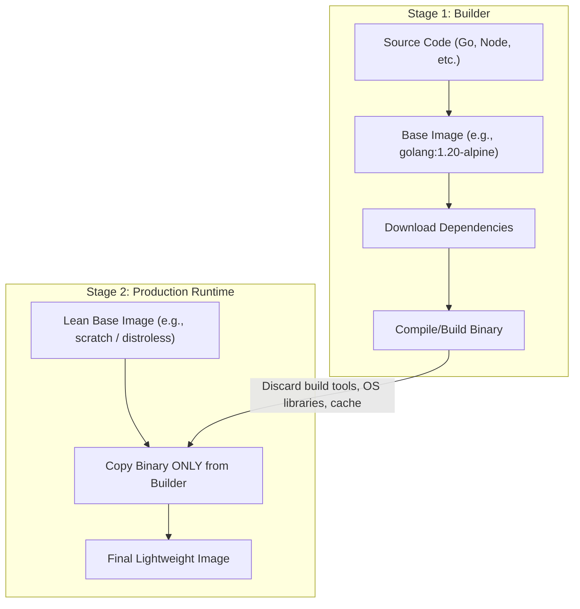
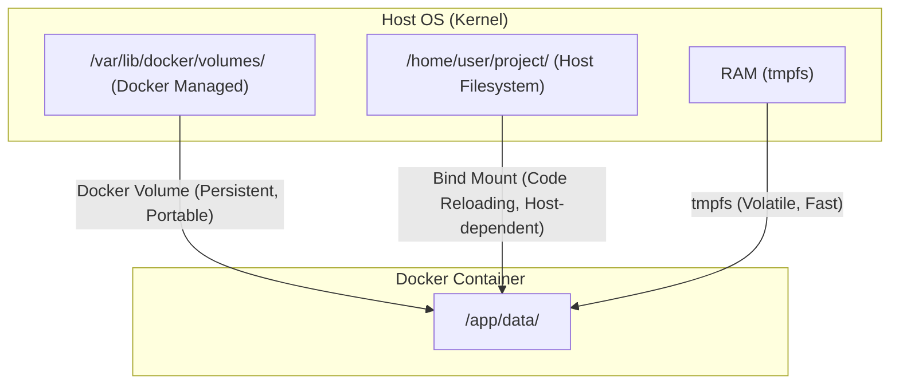
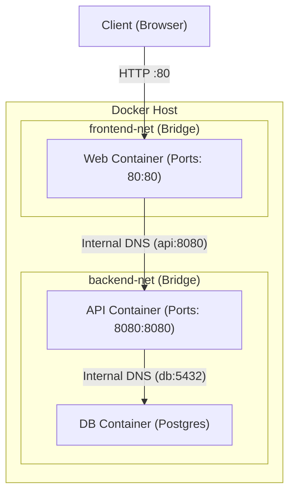

# 📘 Docker — Comprehensive Cheat Sheet

**Author:** AI Technical Writer
**Date:** 2026-08-05
**Sections:** 17 Comprehensive Modules
**Examples:** 200+ Working Code Snippets

---

## Table of Contents
1. [Docker Fundamentals](#1-docker-fundamentals)
2. [Docker Installation & Configuration](#2-docker-installation--config)
3. [Image Management](#3-image-management)
4. [Dockerfile Instructions](#4-dockerfile-instructions)
5. [Dockerfile Best Practices](#5-dockerfile-best-practices)
6. [Container Lifecycle](#6-container-lifecycle)
7. [Container Inspection](#7-container-inspection)
8. [Container Interaction](#8-container-interaction)
9. [Docker Networking](#9-docker-networking)
10. [Docker Storage](#10-docker-storage)
11. [Docker Compose](#11-docker-compose)
12. [Docker Registry](#12-docker-registry)
13. [Docker Security](#13-docker-security)
14. [Docker Administration](#14-docker-administration)
15. [Docker Troubleshooting](#15-docker-troubleshooting)
16. [Docker in Production](#16-docker-in-production)
17. [Quick Reference Tables](#17-quick-reference-tables)

---

## 1. DOCKER FUNDAMENTALS

### What is Docker?
Docker is an open-source platform that enables developers to build, deploy, run, update, and manage containers. Containers are lightweight, standalone, executable packages of software that include everything needed to run an application: code, runtime, system tools, system libraries, and settings. 

### Containerization vs Virtual Machines (VMs)
Containers and VMs are both packaging technologies, but they operate at different levels of abstraction.

| Feature | Virtual Machines | Containers (Docker) |
| :--- | :--- | :--- |
| **Abstraction Level** | Hardware-level virtualization. | OS-level virtualization. |
| **OS Requirement** | Requires a full Guest OS per VM. | Shares the Host OS kernel. |
| **Boot Time** | Minutes (slow). | Milliseconds to seconds (fast). |
| **Resource Usage** | Heavy (CPU, RAM, Disk). | Lightweight. |
| **Isolation** | Strong isolation (Hypervisor). | Process-level isolation (Namespaces/Cgroups). |
| **Portability** | Less portable, tied to hypervisor. | Highly portable across any OS with Docker. |

### Docker Architecture
Docker uses a client-server architecture. The Docker client talks to the Docker daemon, which does the heavy lifting of building, running, and distributing your Docker containers.

- **Docker Daemon (dockerd):** Listens for Docker API requests and manages Docker objects such as images, containers, networks, and volumes.
- **Docker Client (docker):** The primary way that many Docker users interact with Docker. When you use commands such as `docker run`, the client sends these commands to `dockerd`, which carries them out.
- **Docker Desktop:** A GUI application for Mac, Windows, and Linux that includes the Docker daemon, client, Compose, Content Trust, Kubernetes, and Credential Helper.
- **Docker Registries:** Stores Docker images. Docker Hub is a public registry that anyone can use, and Docker is configured to look for images on Docker Hub by default.

### Underlying Technologies
- **Namespaces:** Docker uses namespaces to provide isolated workspaces called containers. When you run a container, Docker creates a set of namespaces for that container (e.g., `pid` for processes, `net` for network, `ipc` for inter-process communication, `mnt` for mount points, `uts` for hostname).
- **Control Groups (cgroups):** Limits, accounts for, and isolates the resource usage (CPU, memory, disk I/O, network) of a collection of processes.
- **Union File Systems (UnionFS):** File systems that operate by creating layers, making them very lightweight and fast. Docker uses UnionFS to provide the building blocks for containers (e.g., Overlay2).
- **OCI Specification:** The Open Container Initiative (OCI) contains specifications for container runtime (`runtime-spec`) and image format (`image-spec`), ensuring standard formats.

---

## 2. DOCKER INSTALLATION & CONFIG

### Installation Examples

**Ubuntu/Debian Installation:**
```bash
# Remove older versions
sudo apt-get remove docker docker-engine docker.io containerd runc

# Update apt package index and install dependencies
sudo apt-get update
sudo apt-get install ca-certificates curl gnupg

# Add Docker's official GPG key
sudo install -m 0755 -d /etc/apt/keyrings
curl -fsSL https://download.docker.com/linux/ubuntu/gpg | sudo gpg --dearmor -o /etc/apt/keyrings/docker.gpg
sudo chmod a+r /etc/apt/keyrings/docker.gpg

# Set up the repository
echo \
  "deb [arch="$(dpkg --print-architecture)" signed-by=/etc/apt/keyrings/docker.gpg] https://download.docker.com/linux/ubuntu \
  "$(. /etc/os-release && echo "$VERSION_CODENAME")" stable" | \
  sudo tee /etc/apt/sources.list.d/docker.list > /dev/null

# Install Docker Engine
sudo apt-get update
sudo apt-get install docker-ce docker-ce-cli containerd.io docker-buildx-plugin docker-compose-plugin
```

### Daemon Configuration (`daemon.json`)
The `daemon.json` file configures the Docker daemon. It is located at `/etc/docker/daemon.json` on Linux and `%programdata%\docker\config\daemon.json` on Windows.

```json
{
  "storage-driver": "overlay2",
  "log-driver": "json-file",
  "log-opts": {
    "max-size": "10m",
    "max-file": "3"
  },
  "dns": ["8.8.8.8", "1.1.1.1"],
  "registry-mirrors": ["https://mirror.gcr.io"],
  "insecure-registries": ["myregistry.local:5000"],
  "live-restore": true,
  "userns-remap": "default",
  "default-address-pools": [
    {"base": "10.10.0.0/16", "size": 24}
  ],
  "bip": "192.168.1.1/24",
  "fixed-cidr": "192.168.1.0/25",
  "tls": true,
  "tlscacert": "/etc/docker/ca.pem",
  "tlscert": "/etc/docker/server.pem",
  "tlskey": "/etc/docker/server-key.pem",
  "metrics-addr": "0.0.0.0:9323",
  "experimental": true
}
```

💡 **Best Practice**: Always use `live-restore: true` in production so containers stay running even if the daemon crashes or restarts.

---

## 3. IMAGE MANAGEMENT

### Building Images (`docker build`)
Builds an image from a Dockerfile.

```bash
# Basic build with tag
docker build --tag myapp:1.0 .

# Specify a different Dockerfile
docker build -f Dockerfile.dev -t myapp:dev .

# Build specific target in multi-stage
docker build --target builder -t myapp:build .

# Pass build arguments
docker build --build-arg VERSION=1.0 -t myapp:1.0 .

# Force no cache for a fresh build
docker build --no-cache -t myapp:latest .

# Always pull the latest base image
docker build --pull -t myapp:latest .

# Build for specific platform (e.g., ARM64 on AMD64 host)
docker build --platform linux/arm64 -t myapp:arm64 .

# Pass secret to build (requires BuildKit)
docker build --secret id=mysecret,src=secret.txt -t myapp .

# Forward SSH agent for cloning private repos
docker build --ssh default -t myapp .

# Use inline cache from a registry
docker build --cache-from myrepo/myapp:cache -t myapp .
```

### Pulling, Pushing, and Tagging
```bash
# Pull an image
docker pull nginx:alpine

# Pull with platform specification
docker pull --platform linux/arm64 nginx:alpine

# Tag an image
docker tag nginx:alpine myrepo/nginx:custom

# Push an image
docker push myrepo/nginx:custom
```

### Managing Local Images
```bash
# List all images
docker images
docker image ls

# List all images (including intermediate layers)
docker image ls -a

# List only Image IDs (useful for piping)
docker image ls -q

# Format output
docker image ls --format "table {{.Repository}}\t{{.Tag}}\t{{.Size}}"

# Filter images (e.g., dangling)
docker image ls --filter "dangling=true"

# Show image digests
docker image ls --digests

# Remove an image
docker rmi myapp:1.0

# Force remove (even if containers are using it)
docker rmi -f myapp:1.0

# Prune unused images
docker image prune -a
```

### Inspect and History
```bash
# Inspect image metadata
docker image inspect nginx

# Extract specific fields using Go templates (e.g., entrypoint)
docker image inspect --format='{{json .Config.Entrypoint}}' nginx

# View image history
docker image history nginx

# View history without truncating commands
docker image history --no-trunc nginx
```

### Exporting and Importing (Air-gapped Environments)
```bash
# Save an image to a tar archive
docker save -o myapp.tar myapp:1.0

# Load an image from a tar archive
docker load -i myapp.tar

# Export a container's filesystem to a tar archive
docker export -o container_fs.tar my_container

# Import a filesystem archive to create an image
docker import container_fs.tar mynewimage:1.0
```

### Multi-Arch Manifests and Buildx
```bash
# Create a builder instance
docker buildx create --name mybuilder --use

# Build and push for multiple architectures
docker buildx build --platform linux/amd64,linux/arm64 -t myrepo/myapp:latest --push .

# Create a manifest manually
docker manifest create myrepo/myapp:latest myrepo/myapp:amd64 myrepo/myapp:arm64

# Push manifest
docker manifest push myrepo/myapp:latest
```

---

## 4. DOCKERFILE INSTRUCTIONS

### FROM
Sets the base image for subsequent instructions.

```dockerfile
# Basic
FROM ubuntu:22.04

# With platform
FROM --platform=linux/amd64 node:18-alpine

# Multi-stage naming
FROM golang:1.20 AS builder

# Scratch (empty image for static binaries)
FROM scratch
```

### RUN
Executes any commands in a new layer on top of the current image and commits the results.

```dockerfile
# Shell form (runs in /bin/sh -c)
RUN apt-get update && apt-get install -y curl

# Exec form (JSON array, does not invoke a command shell)
RUN ["/bin/bash", "-c", "echo hello"]

# Best practice for apt-get (chaining and cleaning up)
RUN apt-get update && apt-get install -y \
    curl \
    git \
 && rm -rf /var/lib/apt/lists/*

# Pip install best practice
RUN pip install --no-cache-dir -r requirements.txt
```

### CMD vs ENTRYPOINT
- `ENTRYPOINT`: Configures a container that will run as an executable.
- `CMD`: Provides default arguments for an executing container (if `ENTRYPOINT` is used) or provides a default command.

```dockerfile
# Example 1: CMD only
CMD ["python", "app.py"]
# docker run myapp -> python app.py
# docker run myapp bash -> bash

# Example 2: ENTRYPOINT only
ENTRYPOINT ["python", "app.py"]
# docker run myapp -> python app.py
# docker run myapp --help -> python app.py --help (appends args)

# Example 3: ENTRYPOINT + CMD (Best Practice)
ENTRYPOINT ["python", "app.py"]
CMD ["--port", "8080"]
# docker run myapp -> python app.py --port 8080
# docker run myapp --port 9000 -> python app.py --port 9000
```

### COPY vs ADD
Both copy files, but `ADD` has extra features (local tar extraction and remote URL fetching). `COPY` is preferred unless `ADD` features are specifically needed.

```dockerfile
# COPY (Preferred)
COPY requirements.txt .
COPY --chown=node:node src/ /app/src/

# ADD (Extracts tarball automatically)
ADD rootfs.tar.gz /

# ADD (Downloads from URL - NOT recommended, use curl/wget in RUN instead)
ADD https://example.com/bigfile.zip /tmp/
```

### WORKDIR, ENV, ARG
```dockerfile
# WORKDIR sets the working directory (creates it if missing)
WORKDIR /usr/src/app

# ENV sets environment variables (persists in runtime)
ENV NODE_ENV=production
ENV PORT=8080

# ARG sets variables that only live during the build
ARG BUILD_VERSION=1.0
RUN echo "Building version $BUILD_VERSION"
```

### EXPOSE, VOLUME, USER
```dockerfile
# EXPOSE documents which ports are intended to be published
EXPOSE 80 443

# VOLUME creates a mount point (bypasses union FS)
VOLUME ["/var/log/myapp", "/data"]

# USER sets the UID/GID (Best Practice: run as non-root)
RUN groupadd -r appgroup && useradd -r -g appgroup appuser
USER appuser:appgroup
```

### HEALTHCHECK
Tells Docker how to test the container to check that it is still working.

```dockerfile
HEALTHCHECK --interval=30s --timeout=10s --start-period=5s --retries=3 \
  CMD curl -f http://localhost/ || exit 1
```

### .dockerignore
Prevents large or sensitive files from being sent to the Docker daemon.

```text
# .dockerignore
.git
node_modules
*.log
.env
secret.key
```

---

## 5. DOCKERFILE BEST PRACTICES

### 1. Multi-Stage Builds
Reduces final image size by leaving build dependencies behind.



**Go Example:**
```dockerfile
# Stage 1: Build
FROM golang:1.20-alpine AS builder
WORKDIR /app
COPY go.mod go.sum ./
RUN go mod download
COPY . .
RUN CGO_ENABLED=0 GOOS=linux go build -o myapp .

# Stage 2: Run
FROM scratch
COPY --from=builder /app/myapp /myapp
ENTRYPOINT ["/myapp"]
```

### 2. Layer Caching Optimization
- Order instructions from least frequently changed (OS, dependencies) to most frequently changed (source code).
- Combine `RUN` commands with `&&` to reduce layers.

```dockerfile
# Bad: Inefficient caching
COPY . /app
RUN pip install -r /app/requirements.txt # Invalidates on ANY code change

# Good: Efficient caching
COPY requirements.txt /app/
RUN pip install -r /app/requirements.txt # Caches until requirements.txt changes
COPY . /app
```

### 3. Image Size Reduction
| Base Image | Typical Size | Use Case |
| :--- | :--- | :--- |
| `ubuntu` | ~70MB | General purpose, large standard library |
| `alpine` | ~5MB | Minimal, uses musl libc (can cause edge cases) |
| `distroless` | ~20MB | Google's minimal images (no shell, very secure) |
| `scratch` | 0MB | Empty, for statically linked binaries (Go, Rust) |

### 4. Security Hardening
- **Never run as root:** Always create a user and switch with `USER`.
- **Don't leak secrets:** Use `--secret` mounts in BuildKit, never `ENV` or `ARG` for passwords.
- **Use trusted bases:** Pull from official, verified registries.

---

## 6. CONTAINER LIFECYCLE

### `docker run` Deep Dive

**Basic Options:**
```bash
# Run detached (-d), interactive/tty (-it), remove on exit (--rm)
docker run -d --name my-web --rm nginx
```

**Port Mapping (-p / -P):**
```bash
# Map host 8080 to container 80
docker run -p 8080:80 nginx

# Map specific host IP
docker run -p 127.0.0.1:8080:80 nginx

# Map UDP port
docker run -p 53:53/udp bind9

# Map all exposed ports to random high ports (-P)
docker run -P nginx
```

**Volumes and Mounts:**
```bash
# Bind mount (-v)
docker run -v /host/path:/container/path nginx

# Bind mount read-only
docker run -v /host/path:/container/path:ro nginx

# Preferred --mount syntax
docker run --mount type=bind,source=/host/path,target=/container/path,readonly nginx

# Tmpfs (in-memory, fast, volatile)
docker run --tmpfs /app/cache:rw,noexec,nosuid nginx
```

**Environment Variables:**
```bash
# Pass explicitly
docker run -e MYSQL_ROOT_PASSWORD=secret mysql

# Pass from file
docker run --env-file ./production.env mysql
```

**Resource Limits:**
```bash
# Limit Memory (512MB) and CPU (1.5 cores)
docker run --memory="512m" --cpus="1.5" nginx

# GPU Access
docker run --gpus all my-ai-app

# Ulimits (e.g., increase max open files)
docker run --ulimit nofile=65536:65536 nginx
```

**Security and Privileges:**
```bash
# Drop all capabilities, add only what's needed
docker run --cap-drop=ALL --cap-add=NET_BIND_SERVICE nginx

# Read-only filesystem
docker run --read-only --tmpfs /tmp nginx

# No new privileges (prevents privilege escalation)
docker run --security-opt="no-new-privileges:true" nginx
```

**Restart Policies:**
| Policy | Behavior |
| :--- | :--- |
| `no` | Do not automatically restart (Default) |
| `always` | Always restart, even on daemon startup |
| `unless-stopped` | Restart always, unless manually stopped |
| `on-failure[:max-retries]`| Restart only if exit code is non-zero |

```bash
docker run --restart unless-stopped nginx
docker run --restart on-failure:5 myapp
```

### Lifecycle Management Commands
```bash
docker start my-container
docker stop my-container
docker restart my-container
docker kill my-container # Sends SIGKILL
docker pause my-container # Freezes process using cgroups
docker unpause my-container
docker rm my-container # Remove (use -f to force)
```

---

## 7. CONTAINER INSPECTION

```bash
# List running containers
docker ps

# List all containers (including stopped)
docker ps -a

# Format output
docker ps --format "table {{.ID}}\t{{.Names}}\t{{.Status}}\t{{.Ports}}"

# Filtering
docker ps --filter "status=exited" --filter "ancestor=nginx"

# View Logs
docker logs my-container
docker logs -f my-container # Follow logs
docker logs --tail 100 my-container
docker logs --since 30m my-container

# Inspect with Go Templates
docker inspect --format='{{range .NetworkSettings.Networks}}{{.IPAddress}}{{end}}' my-container
docker inspect --format='{{.State.Health.Status}}' my-container

# View Resource Usage (Stats)
docker stats # Live stream
docker stats --no-stream # Single snapshot

# See processes inside container
docker top my-container

# See file system changes
docker diff my-container
```

---

## 8. CONTAINER INTERACTION

### Executing Commands
```bash
# Open interactive shell
docker exec -it my-container bash
docker exec -it my-container sh

# Run single command
docker exec my-container ls -la /app

# Run command as specific user
docker exec -u root my-container chown -R www-data:www-data /var/www
```

### Copying Files (docker cp)
```bash
# Host to Container
docker cp ./local-config.json my-container:/app/config.json

# Container to Host
docker cp my-container:/var/log/nginx/access.log ./local-access.log
```

---

## 9. DOCKER NETWORKING

### Network Drivers
| Driver | Description |
| :--- | :--- |
| `bridge` | Default. Creates a software bridge. Good for standalone containers. |
| `host` | Removes network isolation. Container uses host's IP/ports directly. |
| `overlay` | Connects multiple Docker daemons (Swarm). |
| `macvlan` | Assigns a MAC address to a container, making it look like a physical device. |
| `none` | Disables all networking. |

### Network Commands
```bash
# Create user-defined bridge (Provides automatic DNS resolution between containers!)
docker network create my-net

# Create with specific subnets
docker network create \
  --driver bridge \
  --subnet 10.1.0.0/16 \
  --gateway 10.1.0.1 \
  custom-net

# Connect container to network
docker network connect my-net my-container

# Disconnect
docker network disconnect my-net my-container

# Inspect network (Shows connected containers)
docker network inspect my-net
```

💡 **Pro Tip**: Containers on the *default* bridge (`docker0`) cannot resolve each other by container name. Always use a *user-defined bridge* for inter-container DNS.

---

## 10. DOCKER STORAGE

### Storage Options
1. **Volumes:** Managed by Docker, stored in `/var/lib/docker/volumes/`. Best for persisting data.
2. **Bind Mounts:** Maps a specific path on the host to the container. Good for development (code reloading).
3. **tmpfs Mounts:** Stored in host memory. Volatile.



### Managing Volumes
```bash
# Create volume
docker volume create my-vol

# List volumes
docker volume ls

# Inspect
docker volume inspect my-vol

# Run with volume
docker run -v my-vol:/data myapp
docker run --mount source=my-vol,target=/data myapp
```

---

## 11. DOCKER COMPOSE

Docker Compose is a tool for defining and running multi-container Docker applications using a `docker-compose.yml` file.



### Comprehensive Example
```yaml
version: '3.8'

services:
  web:
    build: 
      context: ./frontend
      dockerfile: Dockerfile.prod
    ports:
      - "80:80"
    depends_on:
      api:
        condition: service_healthy
    networks:
      - frontend-net

  api:
    image: my-node-api:latest
    environment:
      - NODE_ENV=production
      - DB_HOST=db
    env_file:
      - .env
    ports:
      - "8080:8080"
    networks:
      - frontend-net
      - backend-net
    healthcheck:
      test: ["CMD", "curl", "-f", "http://localhost:8080/health"]
      interval: 30s
      timeout: 10s
      retries: 3
    restart: unless-stopped

  db:
    image: postgres:15
    environment:
      POSTGRES_USER: admin
      POSTGRES_PASSWORD_FILE: /run/secrets/db_password
      POSTGRES_DB: appdb
    volumes:
      - db-data:/var/lib/postgresql/data
    networks:
      - backend-net
    secrets:
      - db_password

volumes:
  db-data:

networks:
  frontend-net:
  backend-net:

secrets:
  db_password:
    file: ./secrets/db_password.txt
```

### Compose CLI Commands
```bash
# Start all services
docker compose up -d

# Stop and remove containers, networks
docker compose down

# Rebuild images
docker compose build

# View logs
docker compose logs -f api

# Execute command
docker compose exec web sh
```

---

## 12. DOCKER REGISTRY

- **Login/Logout**: `docker login`, `docker logout`
- **Private Registries**: Tag your image with the registry URL: `docker tag myapp myregistry.com:5000/myapp`.
- **Docker Content Trust (DCT)**: Enables image signing. `export DOCKER_CONTENT_TRUST=1`.

---

## 13. DOCKER SECURITY

### Best Practices
1. **Use Rootless Docker**: Runs the Docker daemon as a non-root user.
2. **Scan Images**: Use `docker scout cves myimage` or Trivy to scan for vulnerabilities.
3. **Limit Capabilities**: `--cap-drop=ALL` is your friend.
4. **Use Read-Only FS**: `--read-only` prevents malware from modifying the container file system.

---

## 14. DOCKER ADMINISTRATION

```bash
# System-wide disk usage
docker system df

# Prune EVERYTHING unused (images, containers, volumes, networks)
docker system prune -a --volumes

# View real-time events from the daemon
docker events

# Daemon info
docker info
```

---

## 15. DOCKER TROUBLESHOOTING

- **Container Exits Immediately**: The container's main process (`PID 1`) finished. Ensure your entrypoint is a long-running foreground process (e.g., `nginx -g 'daemon off;'`).
- **Cannot connect to DB**: Ensure both containers are on the same user-defined network and you are using the container name as the hostname.
- **Permission Denied in Volume**: UID/GID in the container must match the UID/GID on the host bind mount, or you must handle `chown` in an entrypoint script.
- **Debugging Toolkit Container**: Run a netshoot container attached to the broken container's network:
  `docker run -it --network container:broken-app nicolaka/netshoot`

---

## 16. DOCKER IN PRODUCTION

- **CI/CD**: Build images once, push to a registry, and promote that *exact* immutable image across Dev -> Staging -> Prod.
- **Healthchecks**: Mandatory. Orchestrators (like Swarm or Kubernetes) rely on them to restart unhealthy instances.
- **Graceful Shutdown**: Ensure your app handles `SIGTERM` to finish requests before exiting, rather than being killed violently with `SIGKILL`.

---

## 17. QUICK REFERENCE TABLES

### Common Commands
| Goal | Command |
| :--- | :--- |
| Build Image | `docker build -t name:tag .` |
| Run Container | `docker run -d -p 80:80 name:tag` |
| List Running | `docker ps` |
| View Logs | `docker logs -f <id>` |
| Execute Shell | `docker exec -it <id> sh` |
| Clean up | `docker system prune` |

*(End of Comprehensive Cheat Sheet)*
