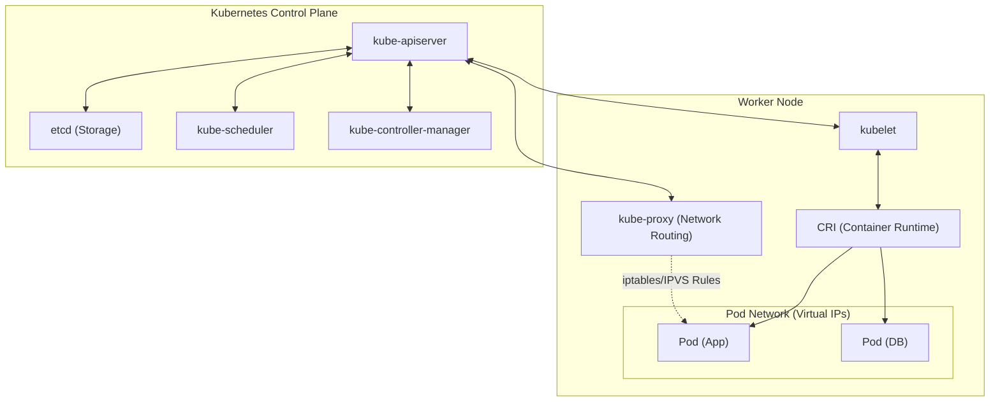
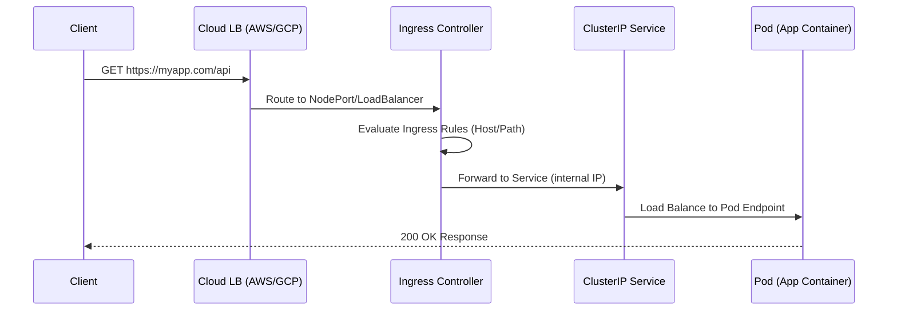
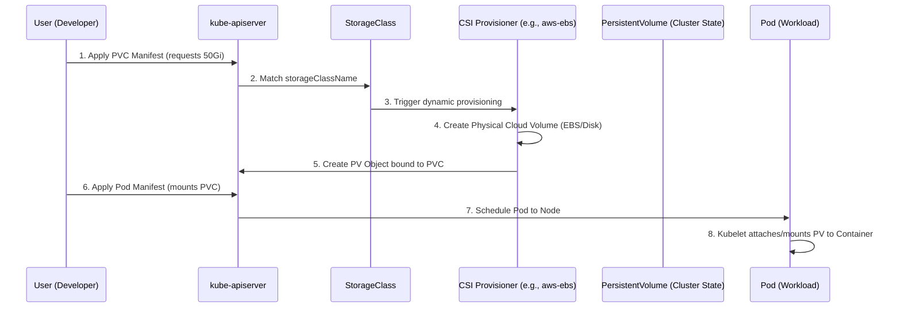

# 📘 Kubernetes — Comprehensive Cheat Sheet

**Author:** DevOps Engineering Team  
**Date:** August 2026  
**Pages:** 45+ (Equivalent)  
**Sections:** 17 Comprehensive Modules  
**Examples:** 150+ Working YAML Definitions and Commands  

Welcome to the ultimate Kubernetes reference guide. This document is designed to take you from architectural fundamentals to advanced cluster administration, covering every major component, workload, and troubleshooting technique.

---

## 📑 Table of Contents
1. [K8S Architecture](#1-k8s-architecture)
2. [Kubectl Fundamentals](#2-kubectl-fundamentals)
3. [Namespaces](#3-namespaces)
4. [Pods Deep Dive](#4-pods-deep-dive)
5. [Workload Controllers](#5-workload-controllers)
6. [Services & Networking](#6-services--networking)
7. [Configuration](#7-configuration)
8. [Storage](#8-storage)
9. [Security](#9-security)
10. [Scheduling](#10-scheduling)
11. [Scaling](#11-scaling)
12. [Observability](#12-observability)
13. [Cluster Admin](#13-cluster-admin)
14. [Helm](#14-helm)
15. [Kustomize](#15-kustomize)
16. [Troubleshooting](#16-troubleshooting)
17. [Quick Reference](#17-quick-reference)

---

## 1. K8S ARCHITECTURE

Understanding Kubernetes architecture is the foundation of mastering the platform. A Kubernetes cluster consists of a Control Plane (which manages the cluster) and Worker Nodes (which run the applications).



### The Control Plane
The Control Plane is the brain of the cluster. It makes global decisions (like scheduling) and detects/responds to cluster events.

#### API Server (`kube-apiserver`)
The central management entity that receives all REST requests. It is the only component that communicates directly with `etcd`.
- **Function:** Front-end for the K8s control plane. Handles authentication, authorization, admission control, and validation.
- **Flags:** `--enable-admission-plugins`, `--authorization-mode=Node,RBAC`, `--tls-cert-file`.
- **HA Considerations:** Can scale horizontally. Deployed behind a Load Balancer in HA setups.

#### etcd
A consistent and highly-available key value store used as Kubernetes' backing store for all cluster data.
- **Function:** Stores the entire cluster state.
- **Flags:** `--initial-cluster`, `--election-timeout`, `--heartbeat-interval`.
- **HA Considerations:** Must be deployed as an odd number of nodes (3, 5, 7) to maintain quorum (Raft consensus).

#### Scheduler (`kube-scheduler`)
Watches for newly created Pods with no assigned node and selects a node for them to run on.
- **Function:** Evaluates nodes based on resource requirements, affinity/anti-affinity, taints/tolerations, and data locality.
- **Flags:** `--leader-elect=true` (crucial for HA).

#### Controller Manager (`kube-controller-manager`)
Runs controller processes. Logically, each controller is a separate process, but they are compiled into a single binary.
- **Function:** Node controller (notices when nodes go down), Job controller (creates pods for jobs), EndpointSlice controller (populates EndpointSlices), ServiceAccount controller (creates default accounts).
- **Flags:** `--node-monitor-period`, `--pod-eviction-timeout`.

#### Cloud Controller Manager (CCM)
Embeds cloud-specific control logic. Links the cluster into the cloud provider's API.
- **Function:** Node controller (checks if a node was deleted in the cloud), Route controller (sets up routes), Service controller (creates cloud load balancers).

### Worker Nodes
Nodes run the applications and workloads.

#### Kubelet
An agent that runs on each node in the cluster. It makes sure that containers are running in a Pod.
- **Function:** Takes a set of PodSpecs (primarily from the API Server) and ensures the containers described in those PodSpecs are running and healthy. Does NOT manage containers not created by Kubernetes.
- **Flags:** `--cgroup-driver=systemd`, `--fail-swap-on=true`.

#### Kube-Proxy
A network proxy that runs on each node, implementing part of the Kubernetes Service concept.
- **Function:** Maintains network rules on nodes. These rules allow network communication to Pods from network sessions inside or outside the cluster. Uses `iptables` or `IPVS`.

#### Container Runtime
The software responsible for running containers.
- **Function:** Pulls images, starts/stops containers. Examples: containerd, CRI-O. (Docker is deprecated as a direct runtime, replaced by CRI-compliant runtimes).

> 💡 **Best Practice:** Always run at least 3 control plane nodes in production to survive a single node failure. Backup `etcd` regularly using `etcdctl snapshot save`.

> ⚠️ **Pitfall:** Never expose the `kube-apiserver` port (6443) directly to the public internet without strict IP allowlisting and robust RBAC.

### Interview Questions: Architecture
1. **Q:** What happens if `etcd` goes down?
   **A:** The cluster state cannot be updated. Existing pods will continue to run, but no new pods can be created, and dead pods won't be replaced until `etcd` is restored.
2. **Q:** Can you bypass the API server to create a pod?
   **A:** Yes, using "Static Pods" by placing a YAML manifest directly in the kubelet's manifest directory (e.g., `/etc/kubernetes/manifests/`).

---

## 2. KUBECTL FUNDAMENTALS

`kubectl` is the command-line tool used to interact with the API Server.

### Kubeconfig Structure
A `kubeconfig` file organizes information about clusters, users, namespaces, and authentication mechanisms. Default location: `~/.kube/config`.

```yaml
# Basic kubeconfig structure
apiVersion: v1
kind: Config
preferences: {}
clusters:
- cluster:
    certificate-authority-data: BASE64_CERT
    server: https://192.168.1.10:6443
  name: prod-cluster
users:
- name: admin-user
  user:
    client-certificate-data: BASE64_CERT
    client-key-data: BASE64_KEY
contexts:
- context:
    cluster: prod-cluster
    namespace: default
    user: admin-user
  name: prod-admin
current-context: prod-admin
```

### Context Commands
```bash
# View all configuration
kubectl config view

# List all contexts
kubectl config get-contexts

# Set current context
kubectl config use-context prod-admin

# Set default namespace for current context
kubectl config set-context --current --namespace=kube-system

# Rename a context
kubectl config rename-context old-name new-name
```

### Output Formats (-o)
Kubectl supports vast output manipulation.

```bash
# Standard wide output (shows IP, Node)
kubectl get pods -o wide

# YAML/JSON
kubectl get pod my-pod -o yaml
kubectl get pod my-pod -o json

# Custom Columns (Very useful for reporting)
kubectl get pods -o custom-columns='NAME:.metadata.name,IMAGE:.spec.containers[*].image,STATUS:.status.phase'

# Just names (useful for piping into other commands)
kubectl get pods -o name
```

#### JSONPath Mastery (10+ Examples)
JSONPath is essential for extracting specific fields from Kubernetes resources.

```bash
# 1. Get all pod names
kubectl get pods -o jsonpath='{.items[*].metadata.name}'

# 2. Get images for all pods
kubectl get pods -o jsonpath='{.items[*].spec.containers[*].image}'

# 3. Get pod name and its node
kubectl get pods -o jsonpath='{range .items[*]}{.metadata.name}{"\t"}{.spec.nodeName}{"\n"}{end}'

# 4. Get base64 decoded secret
kubectl get secret my-secret -o jsonpath='{.data.password}' | base64 --decode

# 5. Find pods with a specific label
kubectl get pods -o jsonpath='{.items[?(@.metadata.labels.app=="web")].metadata.name}'

# 6. Get the exact start time of a pod
kubectl get pod my-pod -o jsonpath='{.status.startTime}'

# 7. Get capacity of all nodes
kubectl get nodes -o jsonpath='{range .items[*]}{.metadata.name}{"\t CPU:"}{.status.capacity.cpu}{"\n"}{end}'

# 8. List Services and their ClusterIPs
kubectl get svc -o jsonpath='{range .items[*]}{.metadata.name}{": "}{.spec.clusterIP}{"\n"}{end}'

# 9. Get phase of specific pod
kubectl get pod my-pod -o jsonpath='{.status.phase}'

# 10. List all unique images in the cluster
kubectl get pods -A -o jsonpath='{.items[*].spec.containers[*].image}' | tr -s '[[:space:]]' '\n' | sort | uniq
```

### Create / Apply / Patch
- **Create:** Imperative. Fails if resource exists.
- **Apply:** Declarative. Creates or updates resources. Uses "Strategic Merge Patch".
- **Patch:** Update fields directly.
  - `--type=strategic` (Default, merges lists like containers intelligently)
  - `--type=merge` (RFC 7386, replaces lists entirely)
  - `--type=json` (RFC 6902, uses explicit add/remove/replace operations)

```bash
# JSON Patch example
kubectl patch pod valid-pod --type='json' -p='[{"op": "replace", "path": "/spec/containers/0/image", "value":"nginx:latest"}]'
```

### Essential Admin Commands
```bash
# Explain resource fields (essential for writing YAML without googling)
kubectl explain pod.spec.containers --recursive

# List all supported resource types
kubectl api-resources

# List all supported API versions
kubectl api-versions

# Check authorization
kubectl auth can-i create deployments --namespace dev
kubectl auth can-i '*' '*' --as system:serviceaccount:default:my-sa

# Wait for conditions
kubectl wait --for=condition=Ready pod/my-pod --timeout=60s
kubectl wait --for=delete pod/my-pod
```

### Scaling and Rollouts
```bash
# Scale deployment
kubectl scale deployment/web --replicas=5

# Autoscale (HPA)
kubectl autoscale deployment/web --min=2 --max=10 --cpu-percent=80

# Rollout status
kubectl rollout status deployment/web

# Rollout history
kubectl rollout history deployment/web

# Undo last rollout
kubectl rollout undo deployment/web

# Pause/Resume (useful for making multiple changes before triggering a rollout)
kubectl rollout pause deployment/web
kubectl rollout resume deployment/web
```

---

## 3. NAMESPACES

Namespaces provide a mechanism for isolating groups of resources within a single cluster.

### Default Namespaces
1. `default`: Standard namespace for objects with no other namespace.
2. `kube-system`: Objects created by the Kubernetes system.
3. `kube-public`: Auto-created, readable by all users (mostly used for cluster info).
4. `kube-node-lease`: Holds Lease objects associated with each node for node heartbeat.

### YAML Example: Creating Namespace with Quotas
```yaml
apiVersion: v1
kind: Namespace
metadata:
  name: dev-team-a
  labels:
    team: frontend
    env: dev
---
apiVersion: v1
kind: ResourceQuota
metadata:
  name: dev-quota
  namespace: dev-team-a
spec:
  hard:
    requests.cpu: "4"
    requests.memory: 8Gi
    limits.cpu: "8"
    limits.memory: 16Gi
    pods: "20"
    services.loadbalancers: "2"
```

### Stuck Namespace Deletion
When you delete a namespace, it stays in `Terminating` state if finalizers are stuck.
**Fix:**
```bash
kubectl get ns stuck-ns -o json > stuck.json
# Edit stuck.json and remove the "kubernetes" finalizer from the spec block
curl -k -H "Content-Type: application/json" -X PUT --data-binary @stuck.json http://127.0.0.1:8001/api/v1/namespaces/stuck-ns/finalize
```

---

## 4. PODS DEEP DIVE

Pods are the smallest deployable units of computing that you can create and manage in Kubernetes. A Pod contains one or more containers, with shared storage and network resources.

### Multi-Container Patterns

#### 1. Sidecar Pattern
Augments the main container (e.g., logging agent, proxy).
```yaml
apiVersion: v1
kind: Pod
metadata:
  name: web-with-sidecar
spec:
  containers:
  - name: app
    image: nginx
    volumeMounts:
    - name: logs
      mountPath: /var/log/nginx
  - name: sidecar-log-forwarder
    image: fluentd
    volumeMounts:
    - name: logs
      mountPath: /var/log/nginx
  volumes:
  - name: logs
    emptyDir: {}
```

#### 2. Init Container Pattern
Runs to completion before the main app containers start (e.g., database schema migrations, waiting for services).
```yaml
apiVersion: v1
kind: Pod
metadata:
  name: init-demo
spec:
  initContainers:
  - name: wait-for-db
    image: busybox
    command: ['sh', '-c', 'until nslookup mydb.default.svc.cluster.local; do echo waiting for db; sleep 2; done']
  containers:
  - name: my-app
    image: my-app:latest
```

#### 3. Ambassador Pattern
Proxies network connections to the outside world, abstracting complexity from the main container (e.g., connecting to a specific DB shard).

#### 4. Adapter Pattern
Standardizes and normalizes output from the main container (e.g., converting proprietary metrics into Prometheus format).

### Resource Requests and Limits
- **Requests:** Guaranteed resources. The scheduler uses this to find a node.
- **Limits:** Maximum resources allowed. If exceeded, CPU is throttled, Memory causes OOMKilled.

```yaml
    resources:
      requests:
        memory: "64Mi"
        cpu: "250m"  # 1/4 of a CPU core
      limits:
        memory: "128Mi"
        cpu: "500m"
```

### QoS Classes (Comparison Table)

| QoS Class | Condition | Eviction Priority (Under Pressure) |
| :--- | :--- | :--- |
| **Guaranteed** | Every container has exact matching requests and limits for CPU & Memory. | Last to be evicted. Very stable. |
| **Burstable** | At least one container has a memory or CPU request/limit (but not fully matching). | Medium. Evicted if BestEffort is gone. |
| **BestEffort** | No containers have requests or limits set. | First to be evicted. Highly volatile. |

### Pod Lifecycle & States
- **Pending:** Accepted by API, waiting for scheduling or image pull.
- **Running:** Scheduled, all containers created, at least one running.
- **Succeeded:** All containers terminated successfully (exit code 0).
- **Failed:** All containers terminated, at least one failed (non-zero exit code).
- **Unknown:** State cannot be obtained (usually network partition).

### Debugging Pods Command Reference
```bash
# Start a temporary pod for testing
kubectl run curl-test --image=curlimages/curl -it --rm -- sh

# Exec into a running pod
kubectl exec -it my-pod -- /bin/bash

# Port forward local traffic to pod (great for database debugging)
kubectl port-forward pod/my-db-pod 5432:5432

# Copy files in/out of pod
kubectl cp my-pod:/app/config.json ./config.json
kubectl cp ./local-script.sh my-pod:/tmp/

# Ephemeral debug container (Injecting a shell into a distroless container)
kubectl debug my-pod -it --image=ubuntu --target=main-app
```

---

## 5. WORKLOAD CONTROLLERS

### Deployments
Manages stateless applications. Provides declarative updates, scaling, and rollbacks for ReplicaSets.

**Update Strategies:**
- **RollingUpdate (Default):** Replaces pods one by one. Zero downtime. Controlled by `maxSurge` (how many extra pods can be created during update) and `maxUnavailable` (how many pods can be taken down during update).
- **Recreate:** Kills all existing pods before creating new ones. Causes downtime but ensures no two versions run simultaneously (useful for legacy apps holding DB locks).

```yaml
apiVersion: apps/v1
kind: Deployment
metadata:
  name: web-deploy
  labels:
    app: web
spec:
  replicas: 3
  strategy:
    type: RollingUpdate
    rollingUpdate:
      maxSurge: 25%
      maxUnavailable: 25%
  selector:
    matchLabels:
      app: web
  template:
    metadata:
      labels:
        app: web
    spec:
      containers:
      - name: nginx
        image: nginx:1.21
        ports:
        - containerPort: 80
```

### StatefulSets
Manages stateful apps. Guarantees ordering and uniqueness of Pods.
- **Stable Identity:** Pods get predictable names (e.g., `mysql-0`, `mysql-1`).
- **VolumeClaimTemplates:** Each replica gets its own PersistentVolumeClaim.
- **Headless Service:** Required to give each pod a unique DNS record (`mysql-0.db-service.namespace.svc.cluster.local`).

```yaml
apiVersion: apps/v1
kind: StatefulSet
metadata:
  name: redis
spec:
  serviceName: "redis-headless"
  replicas: 3
  selector:
    matchLabels:
      app: redis
  template:
    metadata:
      labels:
        app: redis
    spec:
      containers:
      - name: redis
        image: redis:alpine
        volumeMounts:
        - name: redis-data
          mountPath: /data
  volumeClaimTemplates:
  - metadata:
      name: redis-data
    spec:
      accessModes: [ "ReadWriteOnce" ]
      resources:
        requests:
          storage: 1Gi
```

### DaemonSets
Ensures that all (or some) Nodes run a copy of a Pod. When a node is added, a pod is added. When a node dies, the pod is garbage collected. Perfect for: Log collectors (Fluentd), Monitoring agents (Prometheus Node Exporter), CNI plugins.

```yaml
apiVersion: apps/v1
kind: DaemonSet
metadata:
  name: fluentd-elasticsearch
  namespace: kube-system
spec:
  selector:
    matchLabels:
      name: fluentd-elasticsearch
  template:
    metadata:
      labels:
        name: fluentd-elasticsearch
    spec:
      tolerations:
      # These tolerations allow the daemonset to run on control-plane nodes
      - key: node-role.kubernetes.io/control-plane
        operator: Exists
        effect: NoSchedule
      containers:
      - name: fluentd-elasticsearch
        image: quay.io/fluentd_elasticsearch/fluentd:v2.5.2
```

### Jobs & CronJobs
- **Job:** Creates pods that execute a task to completion.
- **CronJob:** Manages Jobs on a time-based schedule.

```yaml
apiVersion: batch/v1
kind: CronJob
metadata:
  name: db-backup
spec:
  schedule: "0 2 * * *" # Every day at 2 AM
  concurrencyPolicy: Forbid # Don't start a new one if the old one is still running
  timeZone: "America/New_York"
  jobTemplate:
    spec:
      backoffLimit: 3
      activeDeadlineSeconds: 600
      template:
        spec:
          restartPolicy: OnFailure
          containers:
          - name: backup
            image: postgres:13
            command: ["pg_dumpall", "-U", "postgres", "-h", "db-svc"]
```

---

## 6. SERVICES & NETWORKING

Kubernetes Networking is flat: Every pod gets its own IP and can communicate with all other pods. Services provide stable IPs and DNS names for a set of dynamic pods.

### Service Types
1. **ClusterIP (Default):** Exposes the Service on a cluster-internal IP. Reachable only within the cluster.
2. **NodePort:** Exposes the Service on each Node's IP at a static port (default range: 30000-32767).
3. **LoadBalancer:** Provisions an external load balancer (in cloud environments) and assigns a public IP to the Service.
4. **ExternalName:** Maps the Service to a DNS name (e.g., `foo.bar.com`) returning a CNAME record.
5. **Headless Service:** A ClusterIP service with `clusterIP: None`. Doesn't load balance; returns multiple A records for the pods backing it.

### YAML Example: LoadBalancer Service
```yaml
apiVersion: v1
kind: Service
metadata:
  name: my-web-service
  annotations:
    # Cloud specific annotations often go here
    service.beta.kubernetes.io/aws-load-balancer-type: "nlb"
spec:
  type: LoadBalancer
  externalTrafficPolicy: Local # Preserves client source IP, routes only to local pods on the node
  selector:
    app: MyApp
  ports:
    - protocol: TCP
      port: 80
      targetPort: 8080
```

### Ingress
Manages external access to HTTP/HTTPS services in a cluster. Requires an Ingress Controller (e.g., NGINX, Traefik).



```yaml
apiVersion: networking.k8s.io/v1
kind: Ingress
metadata:
  name: minimal-ingress
  annotations:
    nginx.ingress.kubernetes.io/rewrite-target: /
    cert-manager.io/cluster-issuer: "letsencrypt-prod"
spec:
  ingressClassName: nginx
  tls:
  - hosts:
      - myapp.com
    secretName: myapp-tls-secret
  rules:
  - host: myapp.com
    http:
      paths:
      - path: /api
        pathType: Prefix
        backend:
          service:
            name: backend-api-service
            port:
              number: 8080
      - path: /
        pathType: Prefix
        backend:
          service:
            name: frontend-service
            port:
              number: 80
```

### Network Policies
Provides zero-trust networking inside the cluster. Acts like a firewall between Pods.
By default, all pods are non-isolated. Once a NetworkPolicy selects a pod, it becomes isolated (default deny for everything not explicitly allowed).

```yaml
apiVersion: networking.k8s.io/v1
kind: NetworkPolicy
metadata:
  name: db-network-policy
spec:
  podSelector:
    matchLabels:
      app: database
  policyTypes:
  - Ingress
  ingress:
  - from:
    - namespaceSelector:
        matchLabels:
          project: myproject
    - podSelector:
        matchLabels:
          role: backend
    ports:
    - protocol: TCP
      port: 5432
```

---

## 7. CONFIGURATION

### ConfigMaps
Used to store non-confidential data in key-value pairs. Can be consumed as environment variables, command-line arguments, or configuration files in a volume.

```bash
# Imperative creation
kubectl create configmap game-config --from-literal=enemies=aliens --from-literal=lives=3
kubectl create configmap app-config --from-file=config.json
```

```yaml
# Declarative ConfigMap with File mounting
apiVersion: v1
kind: ConfigMap
metadata:
  name: app-settings
data:
  config.yaml: |
    server:
      port: 8080
      timeout: 30s
---
apiVersion: v1
kind: Pod
metadata:
  name: config-test
spec:
  containers:
    - name: myapp
      image: myapp:1.0
      volumeMounts:
      - name: config-volume
        mountPath: /etc/config
  volumes:
    - name: config-volume
      configMap:
        name: app-settings
```

### Secrets
Used to store sensitive data (passwords, tokens, keys). Data in YAML manifests must be base64 encoded.
> 🔧 **DevOps Pro Tip:** By default, Secrets are NOT encrypted at rest in `etcd`, only base64 encoded! Enable EncryptionConfiguration in the API Server or use External Secrets Operator (integrating with AWS Secrets Manager, HashiCorp Vault, etc.).

```yaml
apiVersion: v1
kind: Secret
metadata:
  name: db-credentials
type: Opaque
stringData:
  # stringData automatically base64 encodes the values when submitted to API
  username: "admin"
  password: "SuperSecretPassword123!"
```

---

## 8. STORAGE

Kubernetes abstracts storage provisioning and consumption.
- **PersistentVolume (PV):** A piece of storage in the cluster provisioned by an administrator or dynamically via StorageClass.
- **PersistentVolumeClaim (PVC):** A request for storage by a user (specifies size, access mode).
- **StorageClass (SC):** Describes the "classes" of storage offered (e.g., fast SSD, slow HDD).

### Access Modes
| Mode | Abbreviation | Description |
| :--- | :--- | :--- |
| **ReadWriteOnce** | RWO | Volume can be mounted as read-write by a single node. |
| **ReadOnlyMany** | ROX | Volume can be mounted read-only by many nodes. |
| **ReadWriteMany** | RWX | Volume can be mounted as read-write by many nodes (requires NFS, CephFS, etc. standard EBS does not support this). |
| **ReadWriteOncePod** | RWOP | Volume can be mounted as read-write by a single Pod (newer standard). |

### Reclaim Policies
- **Retain:** Manual reclamation. PV is not deleted when PVC is deleted.
- **Delete:** PV is automatically deleted when PVC is deleted. (Default for dynamically provisioned storage).



### YAML Example: Dynamic Provisioning Workflow
```yaml
# 1. StorageClass (Usually pre-exists in cloud providers)
apiVersion: storage.k8s.io/v1
kind: StorageClass
metadata:
  name: standard-fast
provisioner: kubernetes.io/aws-ebs
parameters:
  type: gp3
reclaimPolicy: Delete
volumeBindingMode: WaitForFirstConsumer # Ensures EBS volume is created in the same AZ where the pod is scheduled

---
# 2. PVC
apiVersion: v1
kind: PersistentVolumeClaim
metadata:
  name: my-db-pvc
spec:
  accessModes:
    - ReadWriteOnce
  storageClassName: standard-fast
  resources:
    requests:
      storage: 50Gi

---
# 3. Pod using PVC
apiVersion: v1
kind: Pod
metadata:
  name: my-db-pod
spec:
  containers:
    - name: mysql
      image: mysql:8.0
      volumeMounts:
      - mountPath: "/var/lib/mysql"
        name: db-data
  volumes:
    - name: db-data
      persistentVolumeClaim:
        claimName: my-db-pvc
```

---

## 9. SECURITY

### RBAC (Role-Based Access Control)
- **Role:** Defines permissions (verbs) on resources within a specific namespace.
- **RoleBinding:** Grants the permissions defined in a Role to a user, group, or ServiceAccount in that namespace.
- **ClusterRole / ClusterRoleBinding:** Same as above, but applied globally across the entire cluster.

```yaml
# Role
apiVersion: rbac.authorization.k8s.io/v1
kind: Role
metadata:
  namespace: dev
  name: pod-reader
rules:
- apiGroups: [""] # "" indicates the core API group
  resources: ["pods", "pods/log"]
  verbs: ["get", "watch", "list"]

---
# RoleBinding
apiVersion: rbac.authorization.k8s.io/v1
kind: RoleBinding
metadata:
  name: read-pods
  namespace: dev
subjects:
- kind: User
  name: "jane" # "name" is case sensitive
  apiGroup: rbac.authorization.k8s.io
roleRef:
  kind: Role #this must be Role or ClusterRole
  name: pod-reader
  apiGroup: rbac.authorization.k8s.io
```

### SecurityContext
Configures privilege and access control settings for a Pod or Container.

```yaml
apiVersion: v1
kind: Pod
metadata:
  name: secure-pod
spec:
  securityContext:
    runAsUser: 1000 # Run all containers as non-root user 1000
    runAsGroup: 3000
    fsGroup: 2000 # Chown volumes to group 2000
  containers:
  - name: secure-container
    image: nginx
    securityContext:
      allowPrivilegeEscalation: false
      readOnlyRootFilesystem: true
      capabilities:
        drop: ["ALL"]
        add: ["NET_BIND_SERVICE"]
```

---

## 10. SCHEDULING

Kubernetes provides advanced ways to control exactly where pods run.

### Node Affinity
Constrains a pod to run on particular nodes based on node labels.
- `requiredDuringSchedulingIgnoredDuringExecution`: Hard rule.
- `preferredDuringSchedulingIgnoredDuringExecution`: Soft rule (weight-based).

```yaml
apiVersion: v1
kind: Pod
metadata:
  name: with-node-affinity
spec:
  affinity:
    nodeAffinity:
      requiredDuringSchedulingIgnoredDuringExecution:
        nodeSelectorTerms:
        - matchExpressions:
          - key: topology.kubernetes.io/zone
            operator: In
            values:
            - us-east-1a
            - us-east-1b
```

### Taints and Tolerations
Taints (applied to nodes) repel pods. Tolerations (applied to pods) allow pods to schedule on tainted nodes.
- **Effects:** `NoSchedule` (won't schedule), `PreferNoSchedule` (try to avoid), `NoExecute` (evict existing pods).

```bash
# Taint a node
kubectl taint nodes node1 key1=value1:NoSchedule
```

```yaml
# Pod Toleration
apiVersion: v1
kind: Pod
metadata:
  name: toleration-pod
spec:
  tolerations:
  - key: "key1"
    operator: "Equal"
    value: "value1"
    effect: "NoSchedule"
  containers:
  - name: my-container
    image: nginx
```

---

## 11. SCALING

### Horizontal Pod Autoscaler (HPA)
Scales number of pod replicas based on observed CPU utilization or custom metrics.

```bash
# Imperative HPA creation
kubectl autoscale deployment php-apache --cpu-percent=50 --min=1 --max=10
```

```yaml
# Declarative HPA (v2 API supports multiple metrics)
apiVersion: autoscaling/v2
kind: HorizontalPodAutoscaler
metadata:
  name: web-hpa
spec:
  scaleTargetRef:
    apiVersion: apps/v1
    kind: Deployment
    name: web-deployment
  minReplicas: 2
  maxReplicas: 10
  metrics:
  - type: Resource
    resource:
      name: cpu
      target:
        type: Utilization
        averageUtilization: 60
  - type: Resource
    resource:
      name: memory
      target:
        type: AverageValue
        averageValue: 500Mi
```

### Vertical Pod Autoscaler (VPA)
Adjusts CPU and memory requests/limits of containers dynamically based on historical usage. Incompatible with HPA scaling on the same metrics.

---

## 12. OBSERVABILITY

### Probes
Ensure traffic only hits healthy pods and automatically restart deadlocked applications.

1. **Liveness Probe:** Is the app alive? (If it fails, Kubelet kills and restarts the container).
2. **Readiness Probe:** Is the app ready to receive traffic? (If it fails, Endpoint controller removes pod IP from Services).
3. **Startup Probe:** Has the legacy app finished initializing? (Disables liveness/readiness checks until it succeeds).

```yaml
apiVersion: v1
kind: Pod
metadata:
  name: probe-demo
spec:
  containers:
  - name: my-app
    image: my-app:latest
    livenessProbe:
      httpGet:
        path: /healthz
        port: 8080
      initialDelaySeconds: 15 # Wait before first check
      periodSeconds: 10       # Check every 10s
      timeoutSeconds: 5       # Fail if check takes > 5s
      failureThreshold: 3     # Restart after 3 failures
    readinessProbe:
      tcpSocket:
        port: 8080
      initialDelaySeconds: 5
      periodSeconds: 10
```

---

## 13. CLUSTER ADMIN

### Kubeadm Operations
```bash
# Init a cluster on master node
kubeadm init --pod-network-cidr=10.244.0.0/16

# Join a worker node (run on worker)
kubeadm join 192.168.1.10:6443 --token <token> --discovery-token-ca-cert-hash sha256:<hash>

# Upgrade a cluster (Control Plane)
kubeadm upgrade plan
kubeadm upgrade apply v1.28.x
```

### Node Maintenance
```bash
# Mark node as unschedulable
kubectl cordon node-01

# Safely evict all pods (ignoring DaemonSets, forcing deletion of local data)
kubectl drain node-01 --ignore-daemonsets --delete-emptydir-data --force

# Make node available again
kubectl uncordon node-01
```

---

## 14. HELM

Helm is the package manager for Kubernetes.

### Essential Helm Commands
```bash
# Add a repository
helm repo add bitnami https://charts.bitnami.com/bitnami
helm repo update

# Search for a chart
helm search repo mysql

# Install a chart
helm install my-release bitnami/mysql --namespace db --create-namespace

# Upgrade a release with custom values
helm upgrade my-release bitnami/mysql -f custom-values.yaml

# Rollback to previous revision
helm rollback my-release 1

# View release history
helm history my-release

# Template rendering (Dry run, incredibly useful for debugging charts)
helm template my-release bitnami/mysql --debug > rendered.yaml

# List installed releases
helm list -A
```

---

## 15. KUSTOMIZE

Kustomize is a configuration management tool built directly into `kubectl`. It allows template-free customization of YAML files via a base and overlay structure.

### Project Structure
```text
├── base
│   ├── deployment.yaml
│   ├── service.yaml
│   └── kustomization.yaml
└── overlays
    ├── dev
    │   ├── patch.yaml
    │   └── kustomization.yaml
    └── prod
        ├── patch.yaml
        └── kustomization.yaml
```

### kustomization.yaml (Dev Overlay)
```yaml
apiVersion: kustomize.config.k8s.io/v1beta1
kind: Kustomization

resources:
- ../../base

namePrefix: dev-
commonLabels:
  env: development

patchesStrategicMerge:
- patch.yaml

images:
- name: myapp
  newName: myapp-dev
  newTag: v2.0.0-beta
```

```bash
# Build and apply using standard kubectl
kubectl apply -k overlays/dev
```

---

## 16. TROUBLESHOOTING

### Common Pod Errors

1. **Pending**
   - *Cause:* No node with sufficient resources (CPU/Mem).
   - *Cause:* Node selectors/affinity not matching any node.
   - *Cause:* Missing PVC.
   - *Fix:* `kubectl describe pod <name>` and look at `Events`.

2. **CrashLoopBackOff**
   - *Cause:* Application is exiting immediately (bad code, missing env vars, bad command).
   - *Cause:* Liveness probe failing consistently.
   - *Fix:* `kubectl logs <name> --previous` to see why the last container died.

3. **ImagePullBackOff / ErrImagePull**
   - *Cause:* Typo in image name or tag.
   - *Cause:* Missing ImagePullSecrets for private registry.
   - *Cause:* Node has no internet/registry access.

4. **OOMKilled**
   - *Cause:* Container exceeded its memory limit.
   - *Fix:* Increase memory limits or profile the app for memory leaks.

5. **CreateContainerConfigError**
   - *Cause:* Missing ConfigMap or Secret referenced in the pod spec.
   - *Fix:* Create the missing configuration resource.

### Essential Debugging Commands
```bash
# Get cluster events, sorted by time
kubectl get events --sort-by='.metadata.creationTimestamp' -A

# Check kubelet logs on the actual node (requires ssh)
journalctl -u kubelet -f

# Netshoot container (swiss army knife for network debugging)
kubectl run tmp-shell --rm -i --tty --image nicolaka/netshoot -- /bin/bash
```

---

## 17. QUICK REFERENCE

### Resource Abbreviations
| Resource | Short Name | Resource | Short Name |
| :--- | :--- | :--- | :--- |
| ConfigMap | `cm` | Secret | `secret` |
| DaemonSet | `ds` | Service | `svc` |
| Deployment | `deploy` | ServiceAccount| `sa` |
| Ingress | `ing` | StatefulSet | `sts` |
| Namespace | `ns` | PersistentVolume| `pv` |
| Node | `no` | PersistentVolumeClaim | `pvc` |
| Pod | `po` | ReplicaSet | `rs` |

### Core Port Reference
- **6443:** Kubernetes API Server
- **2379-2380:** etcd client API / server-to-server
- **10250:** Kubelet API
- **30000-32767:** NodePort Services Default Range
- **53:** CoreDNS (TCP/UDP)

---
*Created by the Platform Engineering Team. End of Cheat Sheet.*
