# 📘 Data Structures & Algorithms (DSA) in Python — Comprehensive Textbook

> **Author**: AI-Generated for DevOps & Cloud Engineers (Percipio / Codecademy Syllabus Edition)
> **Last Updated**: 2026-08-10
> **Sections**: 6 Sets | **Depth**: Exhaustive Textbook-Level | **Visuals**: Mermaid Diagrams Throughout

## Table of Contents
1. [Set 1: Linked Lists, Queues, Stacks, and Hashmaps](#set-1-linked-lists-queues-stacks-and-hashmaps)
2. [Set 2: Recursion and Time and Space Complexity in Python](#set-2-recursion-and-time-and-space-complexity-in-python)
3. [Set 3: Basic Sorting Algorithms in Python](#set-3-basic-sorting-algorithms-in-python)
4. [Set 4: Trees and Tree Traversal in Python](#set-4-trees-and-tree-traversal-in-python)
5. [Set 5: Graphs and Graph Traversal in Python](#set-5-graphs-and-graph-traversal-in-python)
6. [Set 6: Advanced Algorithms and Data Structures in Python](#set-6-advanced-algorithms-and-data-structures-in-python)

---

## 🟢 Set 1: Linked Lists, Queues, Stacks, and Hashmaps

### 1.1 Nodes

#### Nodes Introduction
Nodes are the fundamental building blocks of many computer science data structures. They form the basis for linked lists, stacks, queues, trees, and more.
An individual node contains data and links to other nodes. Each data structure adds additional constraints or behavior to these features to create the desired structure.
Consider a node that contains a piece of data (the number 5) and a link to another node.

#### Nodes Detail
The data contained within a node can be a variety of types, depending on the language you are using. It could be an integer, a string, a decimal, an array, or nothing (null).
The link or links within the node are sometimes referred to as **pointers**. This is because they "point" to another node.
Typically, data structures implement nodes with one or more links. If these links are null, it denotes that you have reached the end of the particular node or link path you were previously following.

#### Nodes Mechanics
Often, due to the data structure, nodes may only be linked to from a single other node. This makes it very important to consider how you implement modifying or removing nodes from a data structure.
If you inadvertently remove the single link to a node, that node's data and any linked nodes could be "lost" to your application. When this happens to a node, it is called an **orphaned node**.
If you would like to remove a node from the middle of a chain without orphaning the rest of the chain, you must change the link in the preceding node to point to the subsequent node, bridging the gap.

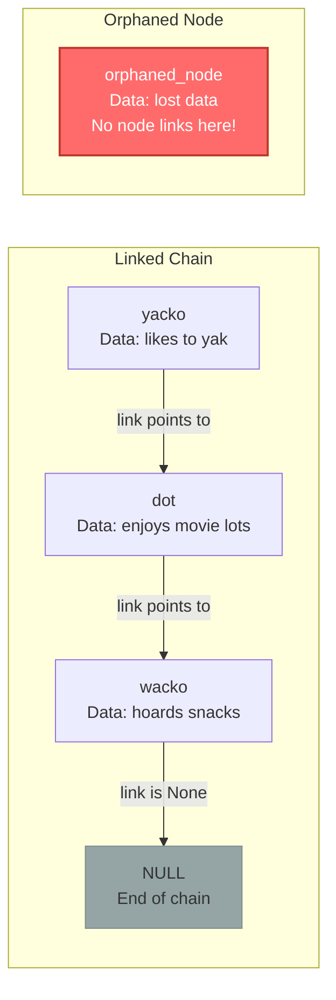

#### Nodes Python Implementation
We will use a basic node that contains data and one link to another node. The node's data will be specified when creating the node and immutable (can't be updated). The link will be optional at creation and can be updated.
To prevent accidental data corruption, we encapsulate our variables using Getter and Setter methods.
*   `get_value()`: Returns the data.
*   `get_link_node()`: Returns the pointer.
*   `set_link_node()`: Updates the pointer.

```python
class Node:
    def __init__(self, value, link_node=None):
        self.value = value
        self.link_node = link_node
        
    def set_link_node(self, link_node):
        self.link_node = link_node
        
    def get_link_node(self):
        return self.link_node
        
    def get_value(self):
        return self.value

# Execution Example
yacko = Node("likes to yak")
wacko = Node("has a penchant for hoarding snacks")
dot = Node("enjoys spending time in movie lots")

yacko.set_link_node(dot)
dot.set_link_node(wacko)

current = yacko
while current:
    print(current.get_value())
    current = current.get_link_node()
```

#### Nodes Review
Let's review what we've covered about nodes:
*   Contain data, which can be a variety of data types.
*   Contain links to other nodes. If a node has no links, or they are all null, you have reached the end of the path.
*   Can be orphaned if there are no existing links to them.

---

### 1.2 Linked Lists (Singly Linked)

#### Linked Lists Introduction
A linked list is a sequential chain of nodes. Unlike an array where memory is allocated in one contiguous block, a linked list's nodes can be scattered across memory, connected only by pointers.
This means you cannot instantly access the 5th element in a linked list; you must traverse from the head node, following the links one by one.

#### Linked Lists Detail
Insertion and deletion at the head is extremely fast ($O(1)$), but searching is slow ($O(n)$). When swapping elements or removing from the middle, you must carefully track previous pointers to ensure the chain doesn't break, resulting in memory leaks or orphaned nodes.

#### Linked Lists Mechanics
*   **Adding to Head**: We create a new node, set its link to the current head, and then declare the new node as the new head. This operates in $O(1)$ time.
*   **Removing a Node**: We must traverse the list until we find the target node. We must keep track of the *previous* node. When we find the target, we change the previous node's link to point to the target's *next* node, effectively bypassing (and orphaning/deleting) the target node.
*   **Swapping Elements (Two-Pointer Technique)**: Swapping data inside a Linked List can be done by swapping values, but structurally swapping *pointers* is essential for performance on large objects. You must carefully track the `node1_prev` and `node2_prev` pointers to ensure the chain doesn't break during the swap.

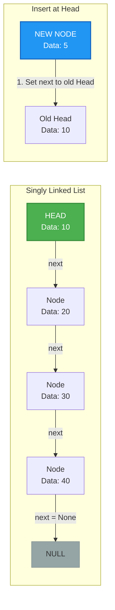

#### Linked Lists Python Implementation
```python
class LinkedList:
    def __init__(self, value=None):
        self.head_node = Node(value)
        
    def get_head_node(self):
        return self.head_node
        
    def insert_beginning(self, new_value):
        new_node = Node(new_value)
        new_node.set_link_node(self.head_node)
        self.head_node = new_node
        
    def stringify_list(self):
        string_list = ""
        current_node = self.get_head_node()
        while current_node:
            if current_node.get_value() != None:
                string_list += str(current_node.get_value()) + "\n"
            current_node = current_node.get_link_node()
        return string_list
        
    def remove_node(self, value_to_remove):
        current_node = self.get_head_node()
        if current_node.get_value() == value_to_remove:
            self.head_node = current_node.get_link_node()
        else:
            while current_node:
                next_node = current_node.get_link_node()
                if next_node.get_value() == value_to_remove:
                    current_node.set_link_node(next_node.get_link_node())
                    current_node = None
                else:
                    current_node = next_node
```

#### Linked Lists Review
*   Comprised of a series of nodes.
*   The first node is called the **head**.
*   Traversal always begins at the head.
*   Insertion and deletion at the head is extremely fast ($O(1)$), but searching is slow ($O(n)$).

---

### 1.3 Doubly Linked Lists

#### Doubly Linked Lists Introduction
A Doubly Linked List (DLL) is a sequential chain of nodes where each node contains **two** pointers: one pointing to the next node, and one pointing to the previous node.
This allows us to traverse the list backwards!

#### Doubly Linked Lists Detail
Nodes have `next` and `prev` pointers. The list tracks both `head` and `tail`. Bi-directional traversal is possible, allowing operations like removing from the tail to operate in $O(1)$ time, unlike Singly Linked Lists. Memory usage is slightly higher due to the extra `prev` pointer.

#### Doubly Linked Lists Mechanics
*   **Adding to Head**: Create a new node. If a head exists, set the new node's `next` to the current head, and the current head's `prev` to the new node. Update the head property.
*   **Adding to Tail**: Because we track the tail property, adding to the tail is exactly like adding to the head, just in reverse. This is $O(1)$ time!
*   **Removing the Head**: We grab the current head's `next` node and set it as the new head. We then set the new head's `prev` pointer to `None`, severing the old head.
*   **Removing the Tail**: We grab the current tail's `prev` node and set it as the new tail. We then set the new tail's `next` pointer to `None`.
*   **Removing from the Middle**: When removing a node from the middle, we must bridge the gap in both directions. We take the target's `prev_node` and set its `next` pointer to the target's `next_node`. We take the target's `next_node` and set its `prev` pointer to the target's `prev_node`.

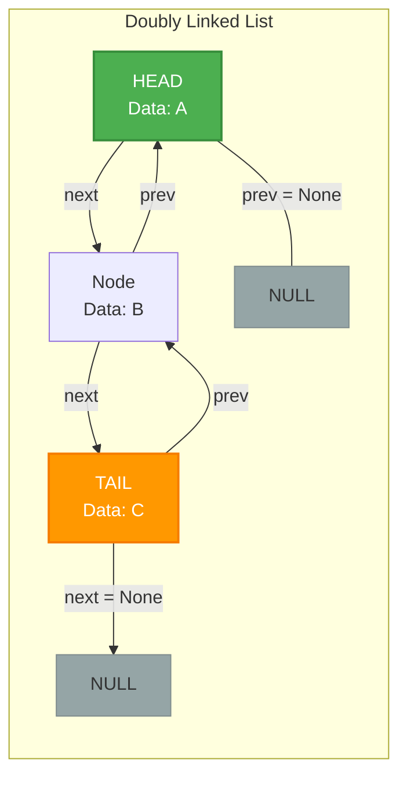

#### Doubly Linked Lists Python Implementation
```python
class Node:
    def __init__(self, value, next_node=None, prev_node=None):
        self.value = value
        self.next_node = next_node
        self.prev_node = prev_node

class DoublyLinkedList:
    def __init__(self):
        self.head_node = None
        self.tail_node = None
        
    def add_to_head(self, new_value):
        new_head = Node(new_value)
        current_head = self.head_node
        if current_head != None:
            current_head.prev_node = new_head
            new_head.next_node = current_head
        self.head_node = new_head
        if self.tail_node == None:
            self.tail_node = new_head
            
    def remove_head(self):
        removed_head = self.head_node
        if removed_head == None: return None
        self.head_node = removed_head.next_node
        if self.head_node != None:
            self.head_node.prev_node = None
        if removed_head == self.tail_node:
            self.remove_tail()
        return removed_head.value
        
    def remove_by_value(self, value_to_remove):
        node_to_remove = None
        current_node = self.head_node
        while current_node != None:
            if current_node.value == value_to_remove:
                node_to_remove = current_node
                break
            current_node = current_node.next_node
            
        if node_to_remove == None: return None
            
        if node_to_remove == self.head_node:
            self.remove_head()
        elif node_to_remove == self.tail_node:
            self.remove_tail()
        else:
            next_node = node_to_remove.next_node
            prev_node = node_to_remove.prev_node
            next_node.prev_node = prev_node
            prev_node.next_node = next_node
        return node_to_remove
```

#### Doubly Linked Lists Review
*   Nodes have `next` and `prev` pointers.
*   The list tracks both `head` and `tail`.
*   Bi-directional traversal is possible.

---

### 1.4 Queues

#### Queues Introduction
A Queue is a linear collection of nodes that follows the **First In, First Out (FIFO)** protocol. Think of it like a line at a grocery store. The first person in line is the first person served.

#### Queues Detail
Queues can be implemented using Linked Lists (to avoid the $O(n)$ shifting cost of standard arrays) and can optionally be bounded (having a maximum size constraint to prevent memory overflow).

#### Queues Mechanics
*   **Enqueue**: Adding a node to the back of the queue (the tail).
*   **Dequeue**: Removing a node from the front of the queue (the head).
*   **Peek**: Viewing the value of the head without removing it.

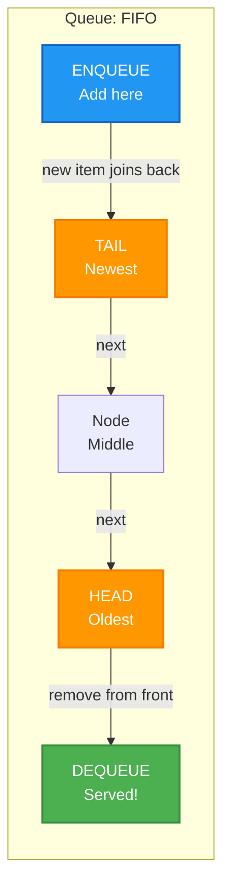

#### Queues Python Implementation
```python
class Queue:
    def __init__(self, max_size=None):
        self.head = None
        self.tail = None
        self.max_size = max_size
        self.size = 0
        
    def enqueue(self, value):
        if self.has_space():
            item_to_add = Node(value)
            print(f"Adding {item_to_add.value} to the queue!")
            if self.is_empty():
                self.head = item_to_add
                self.tail = item_to_add
            else:
                self.tail.set_link_node(item_to_add)
                self.tail = item_to_add
            self.size += 1
        else:
            print("Sorry, no more room!")
            
    def dequeue(self):
        if not self.is_empty():
            item_to_remove = self.head
            print(f"Removing {item_to_remove.value} from the queue!")
            if self.size == 1:
                self.head = None
                self.tail = None
            else:
                self.head = self.head.get_link_node()
            self.size -= 1
            return item_to_remove.value
        else:
            print("This queue is totally empty!")
            
    def peek(self):
        if not self.is_empty(): return self.head.value
        return None
        
    def get_size(self): return self.size
    def is_empty(self): return self.size == 0
    def has_space(self): return self.max_size == None or self.max_size > self.size
```

#### Queues Review
*   FIFO protocol.
*   `enqueue` adds to the tail.
*   `dequeue` removes from the head.
*   Often restricted by a maximum size.

---

### 1.5 Stacks

#### Stacks Introduction
A Stack is a linear collection of nodes that follows the **Last In, First Out (LIFO)** protocol. Think of a stack of plates; you can only add a plate to the top, and you can only remove a plate from the top.

#### Stacks Detail
Stacks are heavily used in call stack execution (recursion) and undo/redo functionality in software. Can also be bounded by a maximum limit to prevent Stack Overflow. Memory is strictly handled through the top node.

#### Stacks Mechanics
*   **Push**: Adding a node to the top of the stack.
*   **Pop**: Removing a node from the top of the stack.
*   **Peek**: Viewing the value of the top node without removing it.

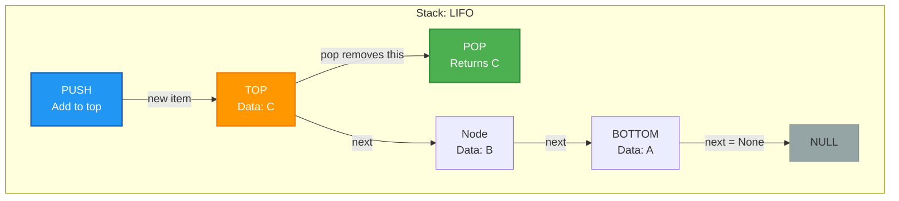

#### Stacks Python Implementation
```python
class Stack:
    def __init__(self, limit=1000):
        self.top_item = None
        self.size = 0
        self.limit = limit
  
    def push(self, value):
        if self.has_space():
            item = Node(value)
            item.set_link_node(self.top_item)
            self.top_item = item
            self.size += 1
        else:
            print("All out of space!")

    def pop(self):
        if not self.is_empty():
            item_to_remove = self.top_item
            self.top_item = item_to_remove.get_link_node()
            self.size -= 1
            return item_to_remove.value
        print("This stack is totally empty.")

    def peek(self):
        if not self.is_empty(): return self.top_item.value
        
    def has_space(self): return self.limit > self.size
    def is_empty(self): return self.size == 0
```

#### Stacks Review
*   LIFO protocol.
*   `push` adds to the top.
*   `pop` removes from the top.
*   Can also be bounded by a maximum limit to prevent Stack Overflow.

---

### 1.6 Hash Maps

#### Hash Maps Introduction
Hash Maps (or Hash Tables) are data structures that provide extraordinarily fast ($O(1)$) lookup times. They use a **key-value** pairing system. By passing a key through a mathematical formula (Hash Function), we can instantly determine the exact memory location (array index) where the value is stored.

#### Hash Maps Detail
Because arrays have a fixed size, we must **compress** this large hash number into a valid index. We do this using the modulo operator: `index = hash_value % array_size`. 
Because of collisions, we can't just store the `value` at the array index. If we have a collision, how do we know which value belongs to which key when retrieving? We must store both the `[key, value]` pair as a list or tuple at the index.

#### Hash Maps Mechanics
*   **Hash Functions and Compression**: A **Hash Function** takes a string (or other data) and converts it into a deterministic integer. For example, summing the ASCII values of the characters.
*   **Separate Chaining**: If an index is already occupied, we don't overwrite it. Instead, the array index holds a Linked List. We simply append the new key-value pair to the end of that Linked List.
*   **Open Addressing (Linear Probing)**: If an index is full, we increment the index by 1 (probing forward) until we find an empty slot.

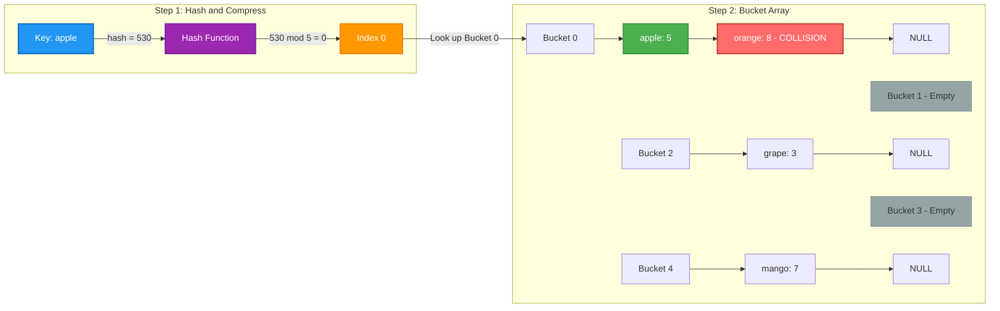

#### Hash Maps Python Implementation
```python
class HashMap:
    def __init__(self, size):
        self.array_size = size
        # Array of empty LinkedLists for Separate Chaining
        self.array = [LinkedList() for item in range(self.array_size)]
        
    def hash(self, key):
        return sum(key.encode())
        
    def compress(self, hash_code):
        return hash_code % self.array_size
        
    def assign(self, key, value):
        array_index = self.compress(self.hash(key))
        payload = Node([key, value])
        list_at_array = self.array[array_index]
        
        for item in list_at_array:
            if item[0] == key:
                item[1] = value # Update existing
                return
        list_at_array.insert_beginning(payload)
        
    def retrieve(self, key):
        array_index = self.compress(self.hash(key))
        list_at_index = self.array[array_index]
        current_node = list_at_index.get_head_node()
        while current_node:
            if current_node.value[0] == key:
                return current_node.value[1]
            current_node = current_node.get_link_node()
        return None
```

#### Hash Maps Review
*   Phenomenal $O(1)$ lookups.
*   Relies on deterministic Hash Functions.
*   Must utilize compression to fit fixed-size arrays.
*   Must implement collision handling (Separate Chaining or Open Addressing).

---

## 🟢 Set 2: Recursion and Time and Space Complexity in Python

### 2.1 Asymptotic Notation (Big Θ, Ω, and O)

#### Asymptotic Notation Introduction
When designing algorithms, we need a standardized way to evaluate their efficiency, irrespective of the underlying hardware, operating system, or programming language. This is where asymptotic notation comes into play. Asymptotic notation provides a mathematical framework for describing how the runtime or space requirements of an algorithm grow as the input size ($n$) approaches infinity. Imagine comparing two cars: instead of measuring their exact top speed on a specific track on a given day, you evaluate their engine specifications to understand their theoretical maximum performance. Similarly, asymptotic notation abstracts away constant factors and lower-order terms to focus on the fundamental growth rate. 

#### Asymptotic Notation Detail
In algorithm analysis, we primarily use three types of asymptotic notation to describe the bounds of a function's growth:
1.  **Big Omega ($\Omega$)**: Represents the **lower bound** of an algorithm's running time. It describes the best-case scenario or the minimum amount of time an algorithm will take. If an algorithm is $\Omega(f(n))$, it will take at least $f(n)$ time for large inputs.
2.  **Big O ($O$)**: Represents the **upper bound**. It is the most commonly used notation because it describes the worst-case scenario. It guarantees that the algorithm will execute in at most $O(f(n))$ time, providing a reliable ceiling on performance.
3.  **Big Theta ($\Theta$)**: Represents the **tight bound**. An algorithm is $\Theta(f(n))$ if it is both $O(f(n))$ and $\Omega(f(n))$. This means the algorithm's running time grows exactly at the rate of $f(n)$ in both the best and worst cases.

When evaluating an algorithm, we look at the highest-order term and ignore coefficients. For instance, an algorithm taking $3n^2 + 5n + 10$ operations is considered $O(n^2)$ because as $n$ grows exponentially large, the $n^2$ term dominates the growth.

**Common Runtimes Comparison Matrix:**

| Data Structure | Lookup | Insert | Delete |
| :--- | :--- | :--- | :--- |
| **Arrays** | $O(n)$ | $O(n)$ | $O(n)$ |
| **Linked Lists** | $O(n)$ | $O(1)$ | $O(1)$ |
| **Hash Maps** | $O(1)$ | $O(1)$ | $O(1)$ |
| **Stacks/Queues** | $O(n)$ | $O(1)$ | $O(1)$ |

*(Note: Linked List insert/delete is $O(1)$ if the node reference is known. Stack/Queue lookup generally requires popping elements, hence $O(n)$).*

#### Asymptotic Notation Mechanics
To determine the time complexity of an algorithm, we analyze the basic operations performed relative to the input size $n$.
1.  **Identify the Input:** What is $n$? It could be the length of an array, the number of nodes in a tree, or an integer value.
2.  **Count Operations:** Trace the loops and recursive calls. A single loop running from 0 to $n$ performs $n$ operations ($O(n)$). Nested loops typically multiply the complexity. For example, a loop inside a loop, both running $n$ times, results in $n \times n = n^2$ operations ($O(n^2)$).
3.  **Drop Constants and Lower Order Terms:** Simplify the expression. $O(2n)$ becomes $O(n)$, and $O(n^2 + n)$ becomes $O(n^2)$.

#### Mermaid Diagram
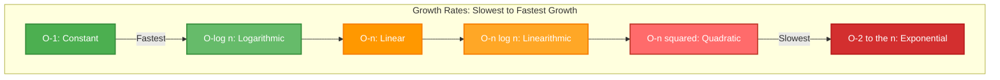

#### Asymptotic Notation Python Implementation
```python
def example_complexities(n: int) -> None:
    """
    Examples of different time complexities.
    """
    # O(1) - Constant Time
    # Execution time is independent of n
    print("O(1) Operation") 
    
    # O(n) - Linear Time
    # Loop runs n times
    for i in range(n):
        pass
        
    # O(n^2) - Quadratic Time
    # Nested loops, each running n times
    for i in range(n):
        for j in range(n):
            pass
```

#### Asymptotic Notation Review
*   **Purpose:** Standardized way to measure algorithm efficiency independent of hardware.
*   **Big O ($O$):** Worst-case scenario (upper bound). Most critical for system stability.
*   **Big Omega ($\Omega$):** Best-case scenario (lower bound).
*   **Big Theta ($\Theta$):** Exact growth rate (tight bound).
*   **Simplification:** Always drop constants and ignore lower-order terms.

---

### 2.2 Linear Search

#### Linear Search Introduction
Linear search is the most straightforward and intuitive searching algorithm. Imagine looking for a specific book on a messy shelf where books are arranged in no particular order. Your only option is to start from one end and examine each book one by one until you find the one you want or reach the end of the shelf. This is exactly how a linear search operates on a data structure like an array or a list. It sequentially checks each element of the collection for the target value until a match is found or the entire collection has been searched.

#### Linear Search Detail
Because linear search does not require the data to be sorted (unlike Binary Search), it is versatile and applicable to any linear data structure. However, this lack of structure means it must potentially examine every single element.
*   **Best Case:** $\Omega(1)$ - The target element is found at the very first position.
*   **Worst Case:** $O(n)$ - The target element is at the very end of the list, or it is not in the list at all, requiring a check of all $n$ elements.
*   **Average Case:** $\Theta(n)$ - On average, the target element will be found somewhere in the middle, requiring roughly $n/2$ checks. Since we drop constants, it remains $O(n)$.
*   **Space Complexity:** $O(1)$ - It only requires a few variables for iteration and tracking the target, using constant extra memory.

#### Linear Search Mechanics
The operation of a linear search is a simple loop:
1.  **Initialize:** Start at index 0 of the array.
2.  **Compare:** Check if the element at the current index matches the target value.
3.  **Match Found:** If it matches, return the current index.
4.  **No Match:** If it doesn't match, increment the index by 1 and repeat step 2.
5.  **End of Collection:** If the loop finishes without finding a match (index reaches the length of the array), return a failure indicator (like `-1` or `None`).

#### Mermaid Diagram
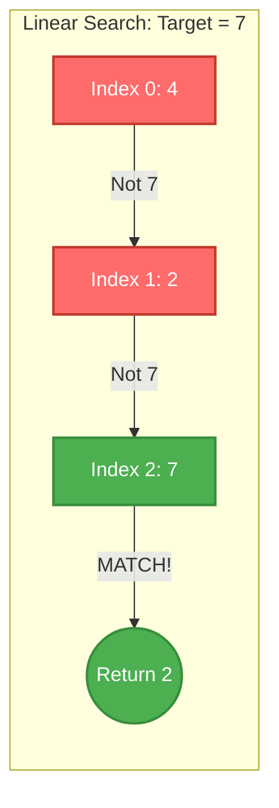

#### Linear Search Python Implementation
```python
def linear_search(arr: list, target: int) -> int:
    """
    Performs a linear search to find a target value in an array.
    
    Args:
        arr: The list to search through.
        target: The value to search for.
        
    Returns:
        The index of the target if found, otherwise -1.
    """
    # Iterate through each index and element in the array
    for i in range(len(arr)):
        # Check if the current element matches the target
        if arr[i] == target:
            return i  # Return the index upon finding a match
            
    return -1  # Target not found in the array

# Example usage:
# numbers = [10, 50, 30, 70, 80, 20, 90, 40]
# target_val = 30
# print(linear_search(numbers, target_val))  # Output: 2
```

#### Linear Search Review
*   **Mechanism:** Sequentially checks each element from start to finish.
*   **Prerequisites:** None. Works on unsorted and sorted data alike.
*   **Time Complexity:** $O(n)$ worst-case, making it inefficient for large datasets.
*   **Space Complexity:** $O(1)$ auxiliary space.

---

### 2.3 Naive Pattern Search

#### Naive Pattern Search Introduction
Pattern searching is the process of finding occurrences of a specific sequence of characters (the "pattern") within a larger sequence of characters (the "text"). The naive approach to pattern searching is analogous to scanning a document with a magnifying glass exactly the size of your pattern. You place the magnifying glass at the beginning of the document, check if the letters match, and if not, you slide the magnifying glass over by exactly one character and check again. You repeat this sliding process until you reach the end of the document.

#### Naive Pattern Search Detail
The naive algorithm checks for the pattern at every possible starting position in the text. 
*   **Variables:** Let $n$ be the length of the text and $m$ be the length of the pattern.
*   **Worst-case Time Complexity:** $O(n \times m)$. This occurs when all characters of the pattern match the text characters until the very last character of the pattern, forcing a near-complete check at every position (e.g., Text = "AAAAAB", Pattern = "AAB").
*   **Best-case Time Complexity:** $O(n)$. This happens when the first character of the pattern never matches the text, so the inner loop is immediately broken at each step.
*   **Space Complexity:** $O(1)$. No extra space is required; we only use variables to track indices.

#### Naive Pattern Search Mechanics
1.  **Outer Loop:** Iterate through the text with an index $i$ from $0$ to $n - m$. We stop at $n - m$ because a pattern of length $m$ cannot fit in the remaining text if fewer than $m$ characters are left.
2.  **Inner Loop:** For each position $i$, start an inner loop with index $j$ from $0$ to $m-1$ to compare characters of the pattern with the text starting at $i+j$.
3.  **Comparison:** If `text[i+j] != pattern[j]`, the match fails at this starting position; break the inner loop and move to the next $i$.
4.  **Match Found:** If the inner loop completes without breaking (i.e., $j$ reaches $m$), a full match is found starting at index $i$. Record or print the index.

#### Mermaid Diagram
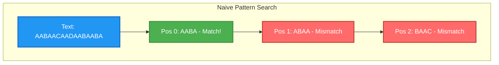

#### Naive Pattern Search Python Implementation
```python
def naive_pattern_search(text: str, pattern: str) -> list[int]:
    """
    Finds all starting indices of a pattern within a text.
    
    Args:
        text: The string to search within.
        pattern: The substring to search for.
        
    Returns:
        A list of starting indices where the pattern occurs.
    """
    n = len(text)
    m = len(pattern)
    occurrences = []

    # Loop through the text, stopping where the pattern can no longer fit
    for i in range(n - m + 1):
        match_found = True
        
        # Check for pattern match starting at index i
        for j in range(m):
            if text[i + j] != pattern[j]:
                match_found = False
                break  # Mismatch found, stop checking this window
                
        if match_found:
            occurrences.append(i)
            
    return occurrences

# Example usage:
# txt = "AABAACAADAABAABA"
# pat = "AABA"
# print(naive_pattern_search(txt, pat)) # Output: [0, 9, 12]
```

#### Naive Pattern Search Review
*   **Concept:** Sliding a window of the pattern's length across the text one character at a time.
*   **Time Complexity:** Worst-case $O(n \times m)$ due to nested looping.
*   **Space Complexity:** $O(1)$ requiring no additional memory scaling with input.
*   **Use Case:** Good for small texts/patterns, but inefficient for large-scale string matching (where algorithms like KMP or Rabin-Karp are preferred).

---

### 2.4 Recursion

#### Recursion Introduction
Recursion in computer science is a method of solving a problem where the solution depends on solutions to smaller instances of the same problem. Practically, this means a function calls itself during its execution. Think of Russian nesting dolls (Matryoshka dolls): to find the smallest solid doll, you open a doll, revealing a slightly smaller doll inside, and you repeat this exact same "opening" process until you reach the indivisible center. Recursion breaks down complex problems into identical, simpler sub-problems until they are simple enough to be solved directly.

#### Recursion Detail
A properly written recursive function must have two critical components to prevent infinite loops:
1.  **Base Case:** The condition under which the recursion stops. This is the simplest, smallest instance of the problem that can be solved directly without further recursive calls (e.g., the smallest nesting doll).
2.  **Recursive Case:** The part of the function where it calls itself with a modified, usually smaller, input, moving closer to the base case.

**Memory Implications:** Every time a function is called, the operating system creates an **Execution Frame** (or stack frame) and pushes it onto the **Call Stack**. This frame contains the function's local variables, arguments, and the return address. In recursion, multiple frames of the same function can exist on the stack simultaneously. If the recursion goes too deep without hitting a base case, the stack memory is exhausted, resulting in a **Stack Overflow** (in Python, this raises a `RecursionError`).

**Recursion vs Iteration:**
*   **Recursion:** Often leads to cleaner, more readable code for problems with recursive structures (like trees or graphs). However, it uses more memory due to the call stack and incurs overhead from function calls.
*   **Iteration (Loops):** Typically more memory-efficient ($O(1)$ space for loops compared to $O(n)$ space for deep recursion) and sometimes faster, but can be much harder to write for complex problems like tree traversal.

#### Recursion Mechanics
Let's trace `factorial(3)`: $3! = 3 \times 2 \times 1$.
1.  Call `factorial(3)`: Is $3 == 1$? No. Return `3 * factorial(2)`. (Frame 1 pushed onto stack, waiting).
2.  Call `factorial(2)`: Is $2 == 1$? No. Return `2 * factorial(1)`. (Frame 2 pushed, waiting).
3.  Call `factorial(1)`: Is $1 == 1$? Yes! **Base case reached.** Return `1`. (Frame 3 pops off stack).
4.  Back to Frame 2: `factorial(1)` returned `1`. Compute `2 * 1 = 2`. Return `2`. (Frame 2 pops).
5.  Back to Frame 1: `factorial(2)` returned `2`. Compute `3 * 2 = 6`. Return `6`. (Frame 1 pops). Final answer: 6.

#### Mermaid Diagram
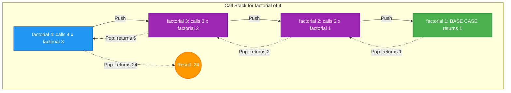

#### Recursion Python Implementation
```python
# 1. Simple Recursion: Factorial
def factorial(n: int) -> int:
    """Calculates n! recursively."""
    # Base Case
    if n <= 1:
        return 1
    # Recursive Case
    return n * factorial(n - 1)


# 2. Complex Recursion: Flattening a nested list
def flatten(nested_list: list) -> list:
    """Recursively flattens a list of lists into a 1D list."""
    flat_list = []
    for item in nested_list:
        if isinstance(item, list):
            # Recursive case: item is a list, extend with flattened version
            flat_list.extend(flatten(item))
        else:
            # Base case loosely defined: item is not a list, just append
            flat_list.append(item)
    return flat_list


# 3. Optimized Recursion: Fibonacci with Memoization
# Naive recursive fibonacci is O(2^n). Memoization brings it to O(n).
def fibonacci_memo(n: int, memo: dict = None) -> int:
    """Calculates the nth Fibonacci number recursively with memoization."""
    if memo is None:
        memo = {}
        
    # Check if we already calculated this value
    if n in memo:
        return memo[n]
        
    # Base cases
    if n == 0:
        return 0
    if n == 1:
        return 1
        
    # Recursive case with storing the result
    memo[n] = fibonacci_memo(n - 1, memo) + fibonacci_memo(n - 2, memo)
    return memo[n]
```

#### Recursion Review
*   **Definition:** A function calling itself to solve smaller sub-problems.
*   **Crucial Elements:** Must have a Base Case (to stop) and a Recursive Case (to progress towards the base case).
*   **Call Stack:** Uses memory for every function call. Deep recursion leads to Stack Overflow (RecursionError in Python).
*   **Memoization:** A technique to cache results of expensive recursive calls, drastically improving time complexity (e.g., optimizing Fibonacci from $O(2^n)$ to $O(n)$).

---

## 🟢 Set 3: Basic Sorting Algorithms in Python

### 3.1 Bubble Sort

#### Bubble Sort Introduction
Sorting data is a foundational problem in computer science, and Bubble Sort is often the very first algorithm students encounter. Conceptually, Bubble Sort is akin to observing bubbles rise in a glass of carbonated water; the largest bubbles rise to the top fastest. In the context of an array, Bubble Sort iteratively sweeps through the data, comparing adjacent elements and swapping them if they are in the wrong order. With each complete pass, the largest remaining unsorted element "bubbles" up to its correct final position at the end of the array. While it is rarely used in production environments due to its inefficiency on large datasets, it provides critical insight into the concepts of iteration, comparison, and state mutation.

#### Bubble Sort Detail
Bubble Sort operates strictly in-place, meaning it requires minimal additional memory—giving it a space complexity of $O(1)$. However, its time complexity leaves much to be desired. In the worst-case scenario (a reverse-sorted array) and the average-case scenario, the algorithm requires $O(n^2)$ time, where $n$ is the number of elements. This quadratic scaling makes it prohibitive for large inputs. However, an important edge case arises when the input array is already sorted. By introducing a simple optimization flag that monitors whether any swaps occurred during a pass, the algorithm can terminate early. This drops the best-case time complexity to $O(n)$, making optimized Bubble Sort surprisingly efficient for verifying already sorted arrays. 

#### Bubble Sort Mechanics
The mechanics of Bubble Sort involve a nested loop structure. The outer loop dictates the number of passes required, which is at most $n - 1$. The inner loop traverses the unsorted portion of the array, comparing the element at index $i$ with the element at index $i+1$. 
1. Start at the first element.
2. Compare the current element to the next element.
3. If the current element is greater, swap them.
4. Move to the next adjacent pair and repeat until the end of the unsorted portion is reached.
5. Once a full pass completes without any swaps, the algorithm halts, knowing the list is fully sorted.

#### Mermaid Diagram
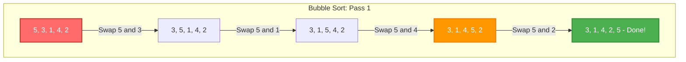

#### Bubble Sort Python Implementation
```python
def bubble_sort(arr):
    """
    Sorts an array in-place using the optimized Bubble Sort algorithm.
    Time Complexity: O(n^2) worst/average, O(n) best
    Space Complexity: O(1)
    """
    n = len(arr)
    for i in range(n):
        # Flag to detect any swap in this pass
        swapped = False
        
        # The last i elements are already in place
        for j in range(0, n - i - 1):
            if arr[j] > arr[j + 1]:
                # Swap elements
                arr[j], arr[j + 1] = arr[j + 1], arr[j]
                swapped = True
                
        # If no two elements were swapped by inner loop, then break
        if not swapped:
            break
            
    return arr
```

#### Bubble Sort Review
*   **Intuitive Approach**: Adjacent elements are compared and swapped; the largest elements settle at the end quickly.
*   **Time Complexity**: $O(n^2)$ for worst and average cases; $O(n)$ best case with the early termination optimization.
*   **Space Complexity**: $O(1)$ auxiliary space, as it sorts in-place.
*   **Optimization**: Utilizing a `swapped` boolean flag allows the algorithm to halt early if the array becomes sorted before all passes complete.

---

### 3.2 Merge Sort

#### Merge Sort Introduction
Merge Sort is a quintessential example of the Divide and Conquer algorithm design paradigm. Imagine you are tasked with alphabetizing a massive stack of hundreds of exams. Instead of sorting the entire stack at once, you might split it in half, give one half to a friend, and have both of you sort your respective halves. To simplify further, you and your friend could keep splitting the stacks until each stack only has one exam. Once you have sorted single exams (which are inherently sorted), you systematically merge the smaller sorted stacks back together until a single, fully sorted master stack is formed. Merge Sort applies exactly this recursive strategy to arrays, splitting them down to base cases and then elegantly fusing them back into order.

#### Merge Sort Detail
Unlike Bubble Sort, Merge Sort guarantees a time complexity of $O(n \log n)$ across the board—best, worst, and average cases. This consistency makes it a highly reliable choice for large datasets. The $\log n$ factor comes from the number of times the array can be halved, while the $n$ factor represents the linear time it takes to merge all elements at each level of the recursive tree. The primary constraint of standard Merge Sort is its space complexity. Because it creates temporary arrays during the splitting and merging phases, it requires $O(n)$ auxiliary memory. While this isn't a problem for most modern systems, it can be a limitation in strictly memory-constrained environments where in-place algorithms might be preferred.

#### Merge Sort Mechanics
Merge Sort operates in two distinct phases:
1.  **Splitting Phase**: The algorithm recursively divides the input array in half until it reaches subarrays of length 1 or 0, which are considered sorted by definition.
2.  **Merging Phase**: The algorithm employs a two-pointer approach to combine two sorted subarrays into a single sorted array. 
    *   Initialize a pointer for the start of both subarrays.
    *   Compare the elements at the pointers. Add the smaller element to a new results array and advance its corresponding pointer.
    *   Repeat until one subarray is exhausted, then append the remaining elements from the other subarray.

#### Mermaid Diagram
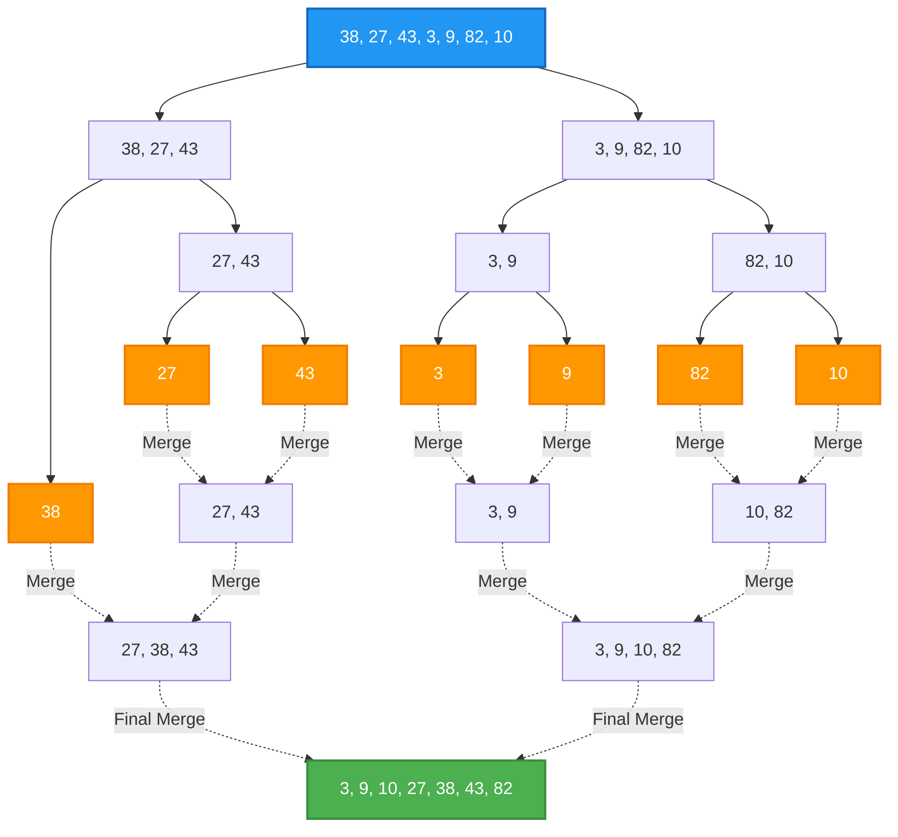

#### Merge Sort Python Implementation
```python
def merge_sort(arr):
    """
    Sorts an array using the recursive Merge Sort algorithm.
    Time Complexity: O(n log n)
    Space Complexity: O(n)
    """
    if len(arr) <= 1:
        return arr

    # Splitting phase
    mid = len(arr) // 2
    left_half = merge_sort(arr[:mid])
    right_half = merge_sort(arr[mid:])

    # Merging phase
    return merge(left_half, right_half)

def merge(left, right):
    """
    Helper function to merge two sorted arrays into one sorted array.
    """
    result = []
    i = j = 0

    # Two-pointer approach to merge
    while i < len(left) and j < len(right):
        if left[i] < right[j]:
            result.append(left[i])
            i += 1
        else:
            result.append(right[j])
            j += 1

    # Append any remaining elements
    result.extend(left[i:])
    result.extend(right[j:])
    
    return result
```

#### Merge Sort Review
*   **Paradigm**: An elegant application of Divide and Conquer.
*   **Time Complexity**: Strictly $O(n \log n)$ in all cases, making it highly predictable.
*   **Space Complexity**: Requires $O(n)$ extra space to store the merged sub-arrays.
*   **Mechanics**: Recursively halves the list, then merges the sorted halves using a linear two-pointer scan.

---

### 3.3 Quicksort

#### Quicksort Introduction
Quicksort is arguably the most famous and widely used sorting algorithm in the wild, known for its blistering real-world speed. Like Merge Sort, it relies on the Divide and Conquer strategy, but it approaches the problem from the opposite direction. Instead of doing the heavy lifting during the merge step, Quicksort does the hard work upfront during the division step. Think of organizing a line of people by height: you might pick one person at random (the "pivot") and tell everyone shorter to stand to their left, and everyone taller to stand to their right. The pivot is now in their exact final sorted position! You then repeat this process recursively for the group on the left and the group on the right.

#### Quicksort Detail
Quicksort is an in-place algorithm, affording it an $O(\log n)$ space complexity (due entirely to the call stack), making it more memory-efficient than Merge Sort. On average, its time complexity is $O(n \log n)$. However, Quicksort has a notorious worst-case scenario of $O(n^2)$. This occurs when the chosen pivot is consistently the maximum or minimum element in the current subarray, resulting in highly unbalanced partitions. To mitigate this, pivot selection strategies are crucial. While picking the first or last element is simple, picking a random element or using the "median-of-three" method significantly reduces the statistical likelihood of encountering worst-case performance on already sorted or nearly sorted data.

#### Quicksort Mechanics
Quicksort relies heavily on a partitioning helper function. 
1.  **Pivot Selection**: Choose an element to serve as the pivot (e.g., using `random.choice`).
2.  **Partitioning**: Reorder the array so that all elements less than the pivot come before it, and all elements greater come after. There are two standard schemes:
    *   *Lomuto Partitioning*: Typically picks the last element as the pivot and maintains an index of the smaller element, swapping as it scans linearly.
    *   *Hoare Partitioning*: Uses two pointers starting at opposite ends of the array, walking towards each other and swapping inverted pairs until they cross. (Usually requires fewer swaps than Lomuto).
3.  **Recursion**: Apply Quicksort to the sub-array of elements smaller than the pivot and the sub-array of elements greater than the pivot.

#### Mermaid Diagram
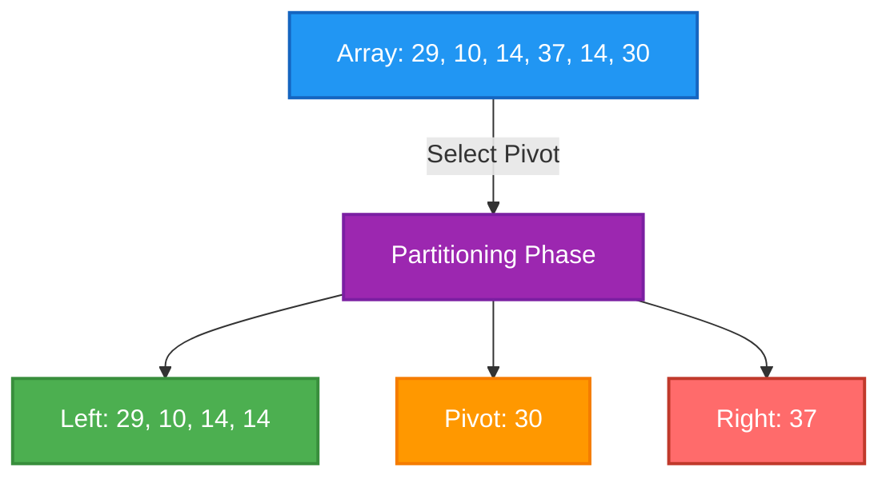

#### Quicksort Python Implementation
```python
import random

def quicksort(arr):
    """
    Wrapper function for quicksort.
    Time Complexity: O(n log n) average, O(n^2) worst
    Space Complexity: O(log n)
    """
    _quicksort_recursive(arr, 0, len(arr) - 1)
    return arr

def _quicksort_recursive(arr, low, high):
    if low < high:
        # Partition the array and get the pivot index
        pivot_idx = partition(arr, low, high)
        
        # Recursively sort the sub-arrays
        _quicksort_recursive(arr, low, pivot_idx - 1)
        _quicksort_recursive(arr, pivot_idx + 1, high)

def partition(arr, low, high):
    """
    Lomuto partition scheme with random pivot selection.
    """
    # Select random pivot and swap it to the end to use Lomuto
    rand_pivot_idx = random.randint(low, high)
    arr[rand_pivot_idx], arr[high] = arr[high], arr[rand_pivot_idx]
    
    pivot_value = arr[high]
    i = low - 1  # Index of smaller element
    
    for j in range(low, high):
        if arr[j] <= pivot_value:
            i += 1
            arr[i], arr[j] = arr[j], arr[i]
            
    # Swap the pivot into its correct central position
    arr[i + 1], arr[high] = arr[high], arr[i + 1]
    return i + 1
```

#### Quicksort Review
*   **Strategy**: Divide and Conquer by partitioning around a pivot.
*   **Performance**: Stellar average-case $O(n \log n)$ but suffers from $O(n^2)$ worst-case if pivots are poorly chosen.
*   **Pivot Selection**: Crucial to avoid worst-case. Randomization or Median-of-three are standard protections.
*   **Space Complexity**: $O(\log n)$ auxiliary space for the recursive call stack, operating mostly in-place.

---

### 3.4 Radix Sort

#### Radix Sort Introduction
While Bubble Sort, Merge Sort, and Quicksort all rely on comparing elements against each other (Comparison Sorts), Radix Sort breaks the mold entirely. It is a non-comparison algorithm specifically designed for sorting integers (or strings representing integers). Imagine sorting a massive pile of library cards. Instead of comparing the full identification numbers against each other, you might first sort them into 10 buckets based solely on the last digit. Then, you collect the cards and sort them into 10 buckets based on the second-to-last digit, and so on. Radix Sort exploits the positional structure of numbers to achieve sorting without a single direct numerical comparison between elements.

#### Radix Sort Detail
Because Radix Sort doesn't compare elements, it bypasses the theoretical $O(n \log n)$ lower bound limit that restricts all comparison-based sorting algorithms. Its time complexity is $O(w \cdot n)$, where $n$ is the number of elements and $w$ is the word size or the maximum number of digits in the largest integer. For datasets containing massive numbers of elements but with a relatively small maximum digit length, Radix Sort can mathematically outpace Quicksort. However, it requires $O(n + k)$ space to maintain the buckets (where $k$ is the radix or base, typically 10). It is strictly limited to data types where a concept of positional "digits" exists, making it less versatile than comparison sorts.

#### Radix Sort Mechanics
Radix Sort typically operates from the Least Significant Digit (LSD) to the Most Significant Digit (MSD).
1.  Find the maximum number in the array to determine the number of digits ($w$).
2.  Set a place value variable (starting at the 1s place: 1).
3.  While the max number divided by the place value is greater than 0:
    *   Create 10 buckets (for base 10 digits 0-9).
    *   Iterate through the array, extracting the digit at the current place value for each number.
    *   Place the number into the corresponding bucket.
    *   Flatten the buckets back into the main array in order.
    *   Multiply the place value by 10 to move to the next digit.
*Note: The bucketing process MUST be stable (maintain the relative order of equal keys).*

#### Mermaid Diagram
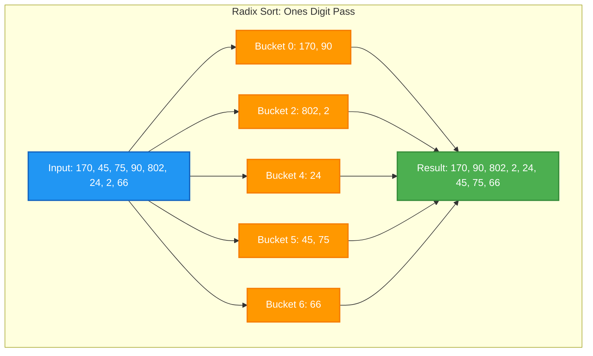

#### Radix Sort Python Implementation
```python
def radix_sort(arr):
    """
    Sorts an array of integers using LSD Radix Sort.
    Time Complexity: O(w * n) where w is max digit length
    Space Complexity: O(n + k) where k is the base (10)
    """
    if not arr:
        return arr

    # Find the maximum number to know number of digits
    max_val = max(arr)
    
    # Place value (1, 10, 100...)
    place_val = 1
    
    while max_val // place_val > 0:
        # Create 10 empty buckets for digits 0-9
        buckets = [[] for _ in range(10)]
        
        # Distribute numbers into buckets based on current digit
        for num in arr:
            # Extract the digit at the current place value
            digit = (num // place_val) % 10
            buckets[digit].append(num)
            
        # Reconstruct the array from the buckets (maintaining stability)
        arr_idx = 0
        for bucket in buckets:
            for num in bucket:
                arr[arr_idx] = num
                arr_idx += 1
                
        # Move to the next significant digit
        place_val *= 10
        
    return arr
```

#### Radix Sort Review
*   **Category**: Non-comparison, integer-based sorting algorithm.
*   **Time Complexity**: $O(w \cdot n)$, bypassing the $O(n \log n)$ limitation of comparison sorts.
*   **Mechanics**: Distributes elements into buckets digit-by-digit, usually from LSD to MSD.
*   **Constraints**: Requires extra space for buckets and is generally limited to integers or fixed-length strings.

---

### 3.5 🚀 Project Implementation: A Sorted Tale

#### A Sorted Tale Introduction
In real-world software engineering, you rarely sort simple arrays of integers. More often, you sort complex objects based on various attributes. Imagine you are building the backend for a local bookshop, "A Sorted Tale." You need to be able to sort your inventory of Book objects by title (alphabetically), by author name, or by price. Hardcoding different sorting algorithms for every single attribute violates the DRY (Don't Repeat Yourself) principle. Instead, we can utilize a pattern known as Dependency Injection. By passing a custom "comparator" function into our sorting algorithm, we can dictate the sorting logic dynamically without changing the algorithm's core mechanics.

#### A Sorted Tale Detail
A comparator function takes two arguments (e.g., Book A and Book B) and returns a boolean or an integer indicating their relative order. By designing our sorting algorithms to accept this callback function, they become fully decoupled from the data types they are sorting. This means the exact same Quicksort function can sort integers, strings, or custom Book objects, provided it is given the correct comparator. In Python, passing functions as arguments is straightforward because functions are first-class citizens. 

#### A Sorted Tale Mechanics
We will define a `Book` class and implement a flexible framework.
1.  Define the `Book` object with attributes: `title`, `author`, `price`.
2.  Define comparator functions:
    *   `by_title_asc(book1, book2)`: Returns `True` if `book1.title > book2.title`
    *   `by_price_desc(book1, book2)`: Returns `True` if `book1.price < book2.price`
3.  Modify our previous `bubble_sort` to accept a `comparator` argument and replace the hardcoded `>` operator with a call to the comparator.

#### Mermaid Diagram
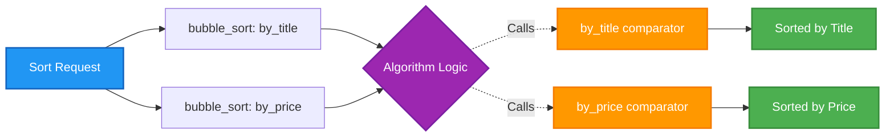

#### A Sorted Tale Python Implementation
```python
class Book:
    def __init__(self, title, author, price):
        self.title = title
        self.author = author
        self.price = price

    def __repr__(self):
        return f"'{self.title}' (${self.price})"

# --- Comparator Functions ---
def compare_title_asc(book_a, book_b):
    # Returns True if book_a should come AFTER book_b
    return book_a.title > book_b.title

def compare_price_desc(book_a, book_b):
    # Returns True if book_a should come AFTER book_b (for descending, smaller comes after)
    return book_a.price < book_b.price

# --- Flexible Sorting Algorithm ---
def bubble_sort_custom(arr, comparator):
    """
    Bubble sort accepting a custom comparator function.
    """
    n = len(arr)
    for i in range(n):
        swapped = False
        for j in range(0, n - i - 1):
            # Call the injected comparator function instead of standard '>'
            if comparator(arr[j], arr[j + 1]):
                arr[j], arr[j + 1] = arr[j + 1], arr[j]
                swapped = True
        if not swapped:
            break
    return arr

# --- Execution ---
inventory = [
    Book("The Great Gatsby", "F. Scott Fitzgerald", 10.99),
    Book("1984", "George Orwell", 8.99),
    Book("To Kill a Mockingbird", "Harper Lee", 12.50),
    Book("Moby Dick", "Herman Melville", 9.99)
]

print("Original Inventory:")
print(inventory)

print("\nSorted by Title (A-Z):")
bubble_sort_custom(inventory, compare_title_asc)
print(inventory)

print("\nSorted by Price (High-Low):")
bubble_sort_custom(inventory, compare_price_desc)
print(inventory)
```

#### A Sorted Tale Review
*   **Flexibility**: Hardcoding sorting logic limits reusability. 
*   **Comparators**: Using callback functions allows us to abstract the comparison step away from the sorting mechanics.
*   **First-Class Functions**: Python's treatment of functions allows them to be passed as arguments cleanly.
*   **Real-World Application**: This pattern mimics how Python's built-in `sorted(..., key=...)` operates under the hood, enabling robust and dynamic sorting of complex objects.

---

## 🔵 Set 4: Trees and Tree Traversal in Python

### 4.1 Trees (Conceptual & Python)

#### Trees Introduction
Imagine the organizational structure of a massive corporation. At the very top, you have the CEO. Below the CEO are various Vice Presidents, and below them are Directors, Managers, and finally, individual contributors. This hierarchical, branching structure is a perfect real-world analogy for a **Tree** in Computer Science. Unlike arrays or linked lists which represent data in a straight, linear sequence, trees organize data hierarchically. They are exceptionally well-suited for modeling relationships where there is a clear "parent-child" dynamic—such as file systems on a computer, the Document Object Model (DOM) of a webpage, or even the ancestral lineage of a family.

In graph theory terms, a tree is a directed, acyclic graph with a single designated starting node called the **root**. Every other node in the tree is connected by exactly one path from the root. This means there are no loops or cycles; you cannot traverse down a tree and somehow end up back where you started. The beauty of trees lies in their recursive nature: every child of a node is itself the root of a smaller sub-tree. This property makes trees incredibly powerful for recursive algorithms and divide-and-conquer strategies.

#### Trees Detail
To effectively work with trees, we must standardize our vocabulary:
- **Root**: The topmost node of the tree. It is the only node with no parent.
- **Node**: A fundamental part of a tree, containing data and links to its children.
- **Edge**: The connection between one node and another.
- **Parent**: A node that has branches leading to other nodes.
- **Child**: A node that has a parent node.
- **Leaf**: A node with no children (the bottom-most nodes).
- **Depth (of a node)**: The number of edges from the root to the node. The root has a depth of 0.
- **Height (of a tree)**: The maximum depth of any node in the tree.

Trees come in various "varietals" based on constraints placed upon them. A **general tree** (or N-ary tree) allows a node to have any number of children. A **Binary Tree** restricts nodes to a maximum of two children (typically named left and right). A **Ternary Tree** allows up to three. Understanding the constraints of your specific tree type is crucial for optimizing operations and predicting memory usage. Edge cases include an empty tree (a root of `None`) or a degenerate tree where every node has only one child, effectively turning it into a linked list with $O(n)$ access times instead of the logarithmic times we usually desire from branching structures.

#### Trees Mechanics
Physically, a tree is constructed in memory by dynamically allocating objects (nodes) that contain pointers (references in Python) to other objects. 
1. **Creation**: We instantiate a root node.
2. **Adding a Child**: To add a child to a parent node, we instantiate a new node and append its reference to the parent's internal collection of children (often a list or array).
3. **Removing a Child**: We search the parent's collection of children for the target node and remove its reference. Without a reference, the garbage collector will eventually reclaim the memory if no other variables point to it.
4. **Traversal**: To traverse a general tree, we start at the root and recursively or iteratively visit each child in a node's list of children. 

Consider the "Wilderness Escape" project, a classic Choose Your Own Adventure game. The story starts at the root node. The user's choices lead them down specific branches to child nodes, representing new story segments. A leaf node represents an ending to the story.

#### Mermaid Diagram
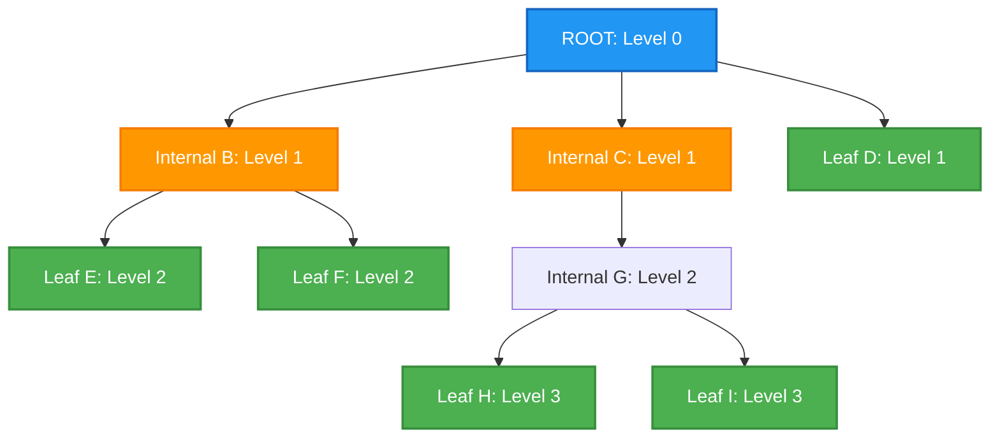

#### Trees Python Implementation
```python
class TreeNode:
    def __init__(self, value):
        self.value = value
        self.children = [] # List to hold references to child nodes

    def add_child(self, child_node):
        """Adds a child node to the current node."""
        print(f"Adding {child_node.value} as a child of {self.value}")
        self.children.append(child_node)

    def remove_child(self, child_node):
        """Removes a child node from the current node."""
        print(f"Removing {child_node.value} from {self.value}")
        self.children = [child for child in self.children if child is not child_node]

    def traverse(self):
        """Recursively traverses and prints the tree."""
        print(self.value)
        for child in self.children:
            child.traverse()

# Wilderness Escape Example Setup
story_root = TreeNode("""
You are in a forest clearing. There is a path to the left.
A bear emerges from the right.
""")
choice_a = TreeNode("You run left down the path.")
choice_b = TreeNode("You stand your ground against the bear.")
ending_a = TreeNode("You escaped the forest! YOU WIN.")
ending_b = TreeNode("The bear eats you. GAME OVER.")

story_root.add_child(choice_a)
story_root.add_child(choice_b)
choice_a.add_child(ending_a)
choice_b.add_child(ending_b)

# Traversing the whole story tree
print("\n--- Full Story Tree ---")
story_root.traverse()
```

#### Trees Review
- Trees are hierarchical data structures starting from a root node.
- They are composed of parents, children, and leaf nodes.
- They are excellent for representing nested or branching data like file systems or decision trees.
- General trees allow any number of children, while specialized trees (like Binary trees) restrict this number.

---

### 4.2 Tree Traversals: BFS vs DFS

#### Tree Traversals Introduction
Imagine you are searching for a lost set of keys in a massive, multi-story mansion. You have two primary strategies. The first strategy is to search every single room on the first floor completely before moving up to the second floor, and so on. This methodical, level-by-level approach is akin to **Breadth-First Search (BFS)**. The second strategy is to pick a hallway, walk all the way down it, enter the last room, check the closet, check the shoe box inside the closet, and only once you've hit a dead end, backtrack to check the next room. This deep-plunging approach is **Depth-First Search (DFS)**.

In computer science, traversing a tree means visiting every node exactly once to perform an operation (like searching for a value or printing data). Because trees are non-linear, we cannot simply loop from index 0 to $n$ like an array. We must dictate an order. BFS and DFS are the two foundational traversal algorithms. They dictate the order in which nodes are visited and fundamentally change how a problem is solved. BFS is excellent for finding the shortest path between two nodes in unweighted graphs or analyzing data grouped by depth. DFS is superior for searching exhaustively, topological sorting, and exploring all possible paths in puzzles or games.

#### Tree Traversals Detail
**BFS (Breadth-First Search)** explores nodes level by level. It visits the root, then all children of the root, then all grandchildren, and so forth. To achieve this, BFS relies heavily on a **Queue** data structure (First-In-First-Out, FIFO). The queue keeps track of nodes that have been discovered but whose children have not yet been explored. 
- Space Complexity: $O(w)$ where $w$ is the maximum width of the tree. In the worst case (a perfectly balanced tree), this can be $O(n/2)$, which is $O(n)$.

**DFS (Depth-First Search)** plunges as deeply as possible along each branch before backtracking. It relies on a **Stack** data structure (Last-In-First-Out, LIFO). Because of the call stack, DFS is most elegantly implemented using recursion.
- Space Complexity: $O(h)$ where $h$ is the height of the tree. In the worst case (a skewed tree), this is $O(n)$, but in a balanced tree, it is $O(\log n)$.

For Binary Trees, DFS is further subdivided into three distinct orderings based on when the parent node is processed relative to its children:
1. **Pre-order**: Visit Parent, Traverse Left, Traverse Right. (Useful for copying a tree).
2. **In-order**: Traverse Left, Visit Parent, Traverse Right. (Useful for getting sorted data out of a Binary Search Tree).
3. **Post-order**: Traverse Left, Traverse Right, Visit Parent. (Useful for deleting a tree, as you must delete children before the parent).

#### Tree Traversals Mechanics
**BFS Mechanics**:
1. Enqueue the root node.
2. While the queue is not empty:
   a. Dequeue a node and visit it (e.g., print its value).
   b. Enqueue all of the dequeued node's children.

**DFS Mechanics (Recursive Pre-order)**:
1. If the current node is null, return.
2. Visit the current node.
3. Recursively call DFS on the left child.
4. Recursively call DFS on the right child.
*(Moving step 2 between or after the recursive calls changes it to In-order or Post-order respectively).*

#### Mermaid Diagram
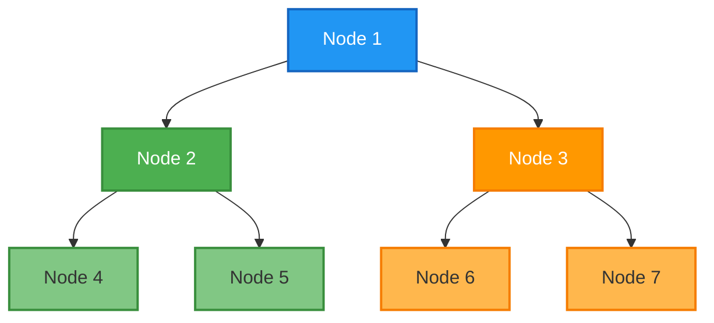
*Note: The labels show the visit order for BFS versus a Pre-order DFS.*

#### Tree Traversals Python Implementation
```python
from collections import deque

class BinaryTreeNode:
    def __init__(self, value):
        self.value = value
        self.left = None
        self.right = None

def bfs_traversal(root):
    """Breadth-First Search using a Queue."""
    if not root:
        return
    
    queue = deque([root])
    result = []
    
    while queue:
        current_node = queue.popleft() # Dequeue
        result.append(current_node.value)
        
        # Enqueue children
        if current_node.left:
            queue.append(current_node.left)
        if current_node.right:
            queue.append(current_node.right)
            
    print("BFS Order:", result)

def dfs_pre_order(node, result=None):
    """Depth-First Search (Pre-order: Node, Left, Right)."""
    if result is None:
        result = []
    if node:
        result.append(node.value)      # Visit Node
        dfs_pre_order(node.left, result)  # Traverse Left
        dfs_pre_order(node.right, result) # Traverse Right
    return result

# Setup the tree from the diagram
root = BinaryTreeNode(1)
root.left = BinaryTreeNode(2)
root.right = BinaryTreeNode(3)
root.left.left = BinaryTreeNode(4)
root.left.right = BinaryTreeNode(5)
root.right.left = BinaryTreeNode(6)
root.right.right = BinaryTreeNode(7)

bfs_traversal(root)
print("DFS Pre-order:", dfs_pre_order(root))
```

#### Tree Traversals Review
- BFS searches level-by-level horizontally and requires a Queue.
- DFS searches deeply down branches vertically and uses a Stack (or recursion).
- DFS on binary trees has three variants: Pre-order, In-order, and Post-order.
- BFS is generally better for shortest path on unweighted graphs; DFS is better for exhaustive pathfinding.

---

### 4.3 Binary Search

#### Binary Search Introduction
Imagine you are looking for the word "Nebulous" in a physical dictionary. You wouldn't start at page 1 and read every word until you find it. Instead, you'd flip the book open to roughly the middle. If you land on "Monkey", you know "Nebulous" comes later in the alphabet, so you completely ignore the first half of the book. You split the remaining half in the middle, perhaps landing on "Robot". Now you know "Nebulous" is between "Monkey" and "Robot". You continue this process of halving the search space until you find the exact page.

This intuitive human process is the exact mechanism of **Binary Search**. It is a profoundly efficient algorithm for finding an item's position within a **sorted** collection. While a standard linear search must check every element one by one ($O(n)$ time complexity), binary search eliminates half of the remaining possibilities in every single step. This dramatically reduces the time complexity to $O(\log n)$. For a collection of one million items, a linear search might take a million steps, but binary search takes at most 20 steps.

#### Binary Search Detail
The absolute most critical constraint of Binary Search is that **the dataset must be sorted beforehand**. If the array is unsorted, binary search is useless. 

Binary search operates by maintaining two pointers (or indices): `left` and `right`, representing the bounds of the active search space. We calculate the `mid` index. If the target value equals the value at `mid`, we are done. If the target is less than the value at `mid`, we know the target must be in the left half, so we move our `right` pointer to `mid - 1`. If the target is greater, we move our `left` pointer to `mid + 1`.

Edge cases to handle:
- **Empty Array**: The algorithm should gracefully return indicating failure.
- **Target Not Present**: The `left` pointer will eventually cross the `right` pointer, at which point the loop terminates, and we return a "not found" indicator (like `-1` or `None`).
- **Integer Overflow**: In languages with fixed-size integers, calculating `mid = (left + right) / 2` can cause an overflow if `left` and `right` are huge. The safe formula is `mid = left + (right - left) / 2`. Python handles arbitrarily large integers, so this is less of a concern, but it is a vital CS detail.

#### Binary Search Mechanics
1. Initialize `left` to 0 and `right` to the last index (`len(array) - 1`).
2. Loop while `left <= right`:
   a. Calculate `mid = (left + right) // 2`.
   b. Check if `array[mid] == target`. If yes, return `mid`.
   c. If `array[mid] < target`, the target is to the right. Update `left = mid + 1`.
   d. If `array[mid] > target`, the target is to the left. Update `right = mid - 1`.
3. If the loop finishes without returning, the target is not in the array. Return -1.

#### Mermaid Diagram
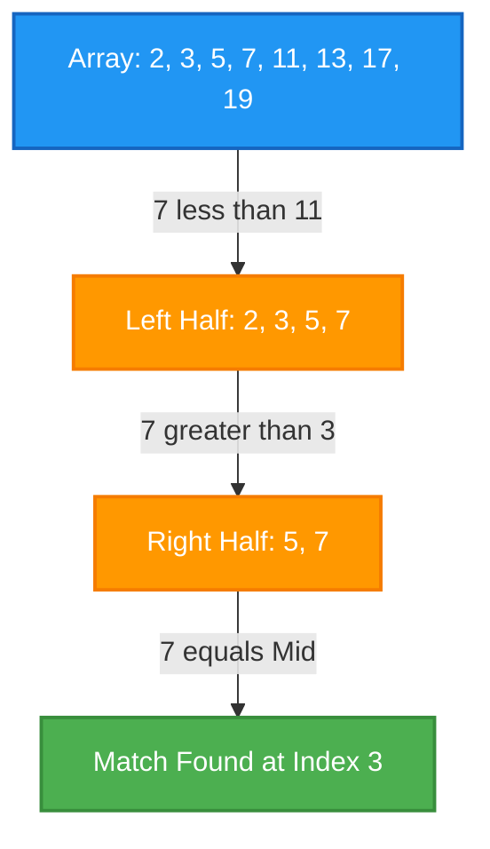
*Note: A visual representation of how the search space halves. If we look for 7, we first check mid 7 (if length is 8, mid index is 3, value 7. Found instantly). If we look for 5, mid is 7, we go left.*

#### Binary Search Python Implementation
```python
def binary_search_iterative(arr, target):
    """Iterative implementation of Binary Search. O(log n) Time, O(1) Space."""
    left = 0
    right = len(arr) - 1

    while left <= right:
        mid = (left + right) // 2 # Integer division
        
        if arr[mid] == target:
            return mid # Target found, return index
        elif arr[mid] < target:
            left = mid + 1 # Discard left half
        else:
            right = mid - 1 # Discard right half
            
    return -1 # Target not found

def binary_search_recursive(arr, target, left, right):
    """Recursive implementation. O(log n) Time, O(log n) Space due to call stack."""
    if left > right:
        return -1 # Base case: not found
        
    mid = (left + right) // 2
    
    if arr[mid] == target:
        return mid
    elif arr[mid] < target:
        # Search right half
        return binary_search_recursive(arr, target, mid + 1, right)
    else:
        # Search left half
        return binary_search_recursive(arr, target, left, mid - 1)

# Example Usage
primes = [2, 3, 5, 7, 11, 13, 17, 19, 23, 29]
print("Iterative Search for 17, Index:", binary_search_iterative(primes, 17))
print("Recursive Search for 5, Index:", binary_search_recursive(primes, 5, 0, len(primes)-1))
print("Search for 100 (not present):", binary_search_iterative(primes, 100))
```

#### Binary Search Review
- Requires a strictly sorted sequence.
- Operates by halving the search space on each iteration.
- Time complexity is $O(\log n)$, making it vastly superior to linear search for large datasets.
- Can be implemented iteratively (more space-efficient) or recursively.

---

### 4.4 Binary Search Trees (BST)

#### Binary Search Trees Introduction
We know that arrays offer fast $O(1)$ lookups if we know the index, but inserting a new item into a sorted array requires shifting elements, taking $O(n)$ time. Conversely, Linked Lists allow fast $O(1)$ insertions if we have the pointer, but searching for an item takes $O(n)$ time because we must traverse linearly. What if we want both fast searching AND fast insertion? 

Enter the **Binary Search Tree (BST)**. A BST combines the flexibility of a linked structure with the efficiency of binary search. It is a binary tree that strictly enforces a specific ordering property: for any given node, all values in its left subtree must be strictly less than the node's value, and all values in its right subtree must be strictly greater than the node's value. This simple rule structurally organizes the data such that navigating the tree naturally mimics the binary search algorithm.

#### Binary Search Trees Detail
The power of a BST hinges entirely on its height. When a BST is **balanced** (meaning the left and right subtrees of every node differ in height by no more than 1), operations like search, insertion, and deletion all take $O(\log n)$ time. 

However, if we insert data that is already sorted (e.g., 1, 2, 3, 4, 5) into a standard BST, every new node will become the right child of the previous node. The tree becomes horribly **unbalanced**, essentially degrading into a linked list. In this worst-case scenario, the height of the tree is $n$, and all operations degrade to $O(n)$ time complexity. (Advanced data structures like AVL Trees or Red-Black Trees automatically rebalance themselves to prevent this, but standard BSTs do not).

A magical property of BSTs is related to traversals. If you perform an **In-order DFS traversal** (Left, Node, Right) on a valid BST, the output will yield the nodes in perfectly sorted ascending order.

#### Binary Search Trees Mechanics
**Insertion**: 
1. Start at the root. 
2. Compare the new value with the current node. 
3. If less, go left; if greater, go right. 
4. Repeat until you find an empty spot (`None`), then create the new node there.

**Retrieval (Search)**:
1. Start at the root.
2. If the target equals the node's value, return true.
3. If the target is less, recursively search the left child.
4. If the target is greater, recursively search the right child.
5. If you hit `None`, the value isn't in the tree.

#### Mermaid Diagram
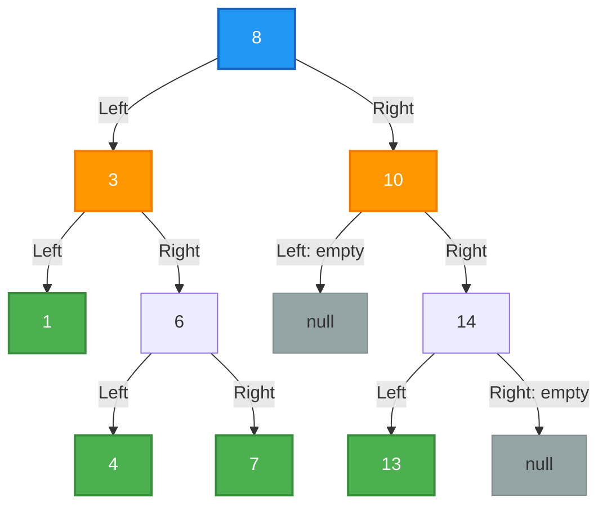
*A balanced BST demonstrating the left < parent < right property.*

#### Binary Search Trees Python Implementation
```python
class BSTNode:
    def __init__(self, value):
        self.value = value
        self.left = None
        self.right = None

class BinarySearchTree:
    def __init__(self):
        self.root = None

    def insert(self, value):
        if not self.root:
            self.root = BSTNode(value)
        else:
            self._insert_recursive(self.root, value)

    def _insert_recursive(self, current_node, value):
        if value < current_node.value:
            # Go left
            if current_node.left is None:
                current_node.left = BSTNode(value)
            else:
                self._insert_recursive(current_node.left, value)
        elif value > current_node.value:
            # Go right
            if current_node.right is None:
                current_node.right = BSTNode(value)
            else:
                self._insert_recursive(current_node.right, value)
        else:
            # Value already exists, typically we ignore or handle counts
            pass 

    def search(self, value):
        return self._search_recursive(self.root, value)

    def _search_recursive(self, current_node, value):
        if current_node is None:
            return False
        if current_node.value == value:
            return True
        elif value < current_node.value:
            return self._search_recursive(current_node.left, value)
        else:
            return self._search_recursive(current_node.right, value)

    def inorder_traversal(self, node, result=None):
        if result is None:
            result = []
        if node:
            self.inorder_traversal(node.left, result)
            result.append(node.value)
            self.inorder_traversal(node.right, result)
        return result

# Usage
bst = BinarySearchTree()
for val in [8, 3, 10, 1, 6, 14, 4, 7, 13]:
    bst.insert(val)

print("Search for 6:", bst.search(6))
print("Search for 99:", bst.search(99))
print("In-order Traversal (Sorted!):", bst.inorder_traversal(bst.root))
```

#### Binary Search Trees Review
- BSTs enforce the rule: Left Child < Parent < Right Child.
- They offer $O(\log n)$ time for search, insertion, and deletion IF the tree is balanced.
- In-order traversal of a BST produces sorted output.
- Unbalanced BSTs can degrade to $O(n)$ linked lists.

---

### 4.5 Heaps & Heapsort

#### Heaps & Heapsort Introduction
Imagine an emergency room triage system. Patients arrive in a chaotic, unsorted order with varying degrees of injury severity. The doctor doesn't need a perfectly sorted list of everyone in the waiting room; they only ever need to know one thing immediately: *Who is the single most critical patient right now?* 

A **Heap** is a specialized tree-based data structure designed specifically for this "Priority Queue" scenario. It doesn't keep all data perfectly sorted like a BST. Instead, it maintains a looser, partial ordering that guarantees one critical property: the highest priority element is ALWAYS at the root of the tree, accessible in $O(1)$ time. When you remove that root element, the heap rapidly reorganizes itself to bring the next highest priority element to the top in just $O(\log n)$ time.

#### Heaps & Heapsort Detail
Heaps come in two main flavors:
1. **Min-Heap**: The parent is always *less than or equal to* its children. The absolute minimum value is at the root.
2. **Max-Heap**: The parent is always *greater than or equal to* its children. The absolute maximum value is at the root.

Structurally, a heap must be a **Complete Binary Tree**. This means every level of the tree is fully filled, except possibly the bottom level, which is filled from left to right without any gaps. Because there are no gaps, we don't actually need to use Node objects with pointers to represent a heap. We can map the entire tree perfectly into a flat **Array**.

In a 0-indexed array, for any node at index $i$:
- Its **Left Child** is at index $2i + 1$
- Its **Right Child** is at index $2i + 2$
- Its **Parent** is at index $(i - 1) // 2$

This array representation is highly memory-efficient (no pointer overhead) and fast due to CPU cache locality.

#### Heaps & Heapsort Mechanics
**Insertion (Heapify Up)**:
1. Add the new element to the very end of the array (bottom left of the tree).
2. Compare the new element with its parent.
3. If it violates the heap property (e.g., in a Min-Heap, if the child is smaller than the parent), swap them.
4. Continue swapping up the tree ("bubbling up") until the property is restored.

**Extraction (Heapify Down)**:
1. Remove the root element (the min or max).
2. Take the very last element in the array and move it to the root position.
3. Compare the new root with its children. Swap it with the smaller child (for Min-Heap) or larger child (for Max-Heap).
4. Continue swapping down ("bubbling down") until the property is restored.

**Heapsort Algorithm**:
1. Build a Max-Heap from an unsorted array (takes $O(n)$ time).
2. Swap the root (maximum value) with the last element.
3. Reduce the "heap size" boundary by 1 (ignoring the sorted element at the end).
4. Heapify Down the new root to restore the Max-Heap.
5. Repeat until the heap is empty. The array is now sorted in $O(n \log n)$ time.

#### Mermaid Diagram
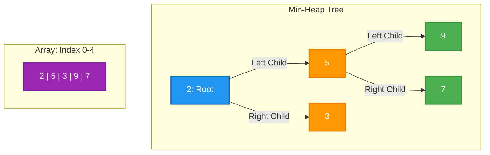
*Notice: Left child of 2 (index 0) is 5 (index 1). Right child is 3 (index 2).*

#### Heaps & Heapsort Python Implementation
Python provides a built-in Min-Heap via the `heapq` module. However, understanding the manual array manipulation is vital.

```python
import heapq

# 1. Using Python's built-in Min-Heap (heapq)
data = [9, 5, 2, 7, 3]
heapq.heapify(data) # Transforms list into a heap in-place in O(n) time
print("Min-Heap array:", data) 
print("Extract Min:", heapq.heappop(data)) # Pops 2
heapq.heappush(data, 1) # Pushes 1, bubbles it up
print("After pushing 1:", data)

# 2. Manual Heapsort Implementation (using Max-Heap)
def heapify_down(arr, n, i):
    """Maintains the max-heap property for a subtree rooted at index i."""
    largest = i
    left = 2 * i + 1
    right = 2 * i + 2

    # Check if left child exists and is greater than root
    if left < n and arr[left] > arr[largest]:
        largest = left

    # Check if right child exists and is greater than current largest
    if right < n and arr[right] > arr[largest]:
        largest = right

    # If the largest is not the root, swap and continue heapifying down
    if largest != i:
        arr[i], arr[largest] = arr[largest], arr[i]
        heapify_down(arr, n, largest)

def heapsort(arr):
    n = len(arr)

    # Step 1: Build a Max-Heap
    # Start from the last non-leaf node and heapify down
    for i in range(n // 2 - 1, -1, -1):
        heapify_down(arr, n, i)

    # Step 2: Extract elements one by one
    for i in range(n - 1, 0, -1):
        # Move current root (max) to the end of the array
        arr[i], arr[0] = arr[0], arr[i]
        # Call heapify_down on the reduced heap to restore max-heap property
        heapify_down(arr, i, 0)

unsorted_arr = [12, 11, 13, 5, 6, 7]
heapsort(unsorted_arr)
print("Heapsorted array:", unsorted_arr)
```

#### Heaps & Heapsort Review
- Heaps are Complete Binary Trees optimized for finding the min/max element in $O(1)$ time.
- Because they are complete, they are beautifully represented as flat arrays using index math.
- Heapify Up handles insertions; Heapify Down handles extractions (both $O(\log n)$).
- Heapsort is an elegant, in-place sorting algorithm with guaranteed $O(n \log n)$ time complexity.

---

## 🔵 Set 5: Graphs and Graph Traversal in Python

### 5.1 Graphs (Conceptual & Python)

#### Graphs Introduction
Graphs are one of the most versatile and ubiquitous data structures in computer science, used to model relationships between objects. Unlike trees, which have a strict hierarchical structure (a root node with children), graphs are free-form collections of nodes (often called *vertices*) and the connections between them (called *edges*). Imagine a social network: you are a vertex, and your friends are other vertices. The friendships linking you together are the edges. Alternatively, think of a physical map where cities are vertices and the highways connecting them are edges. 

The power of graphs lies in their ability to represent almost any complex system: the internet (web pages and hyperlinks), computer networks (routers and cables), or even the human brain (neurons and synapses). Graphs allow us to ask and answer sophisticated questions, such as finding the shortest path between two points or identifying clusters of highly interconnected nodes.

#### Graphs Detail
Graphs come in several flavors depending on the nature of their edges. **Directed graphs** have edges with a specific direction, like one-way streets, whereas **Undirected graphs** have bi-directional edges, like standard two-way roads. Edges can also be **weighted**, carrying a value or cost (such as the distance in miles between cities or the latency in milliseconds between servers), or **unweighted**. 

Furthermore, a graph can be **connected**, meaning there is a path between every pair of vertices, or **disconnected**, existing as separate, isolated clusters. Representing graphs in memory typically involves one of two structures: an **Adjacency Matrix** (a 2D array where `matrix[i][j]` holds the edge weight between vertex `i` and `j`) or an **Adjacency List** (where each vertex maintains a list of its neighboring vertices). Adjacency lists are highly efficient for sparse graphs (few edges) because they save memory, while adjacency matrices are better for dense graphs where edge lookups need to be instantaneous.

#### Graphs Mechanics
When working with an Adjacency List representation, which is the most common approach in Python, adding a vertex means simply adding a new key to a dictionary or a new instance of a Vertex class. Adding an edge involves appending the destination vertex to the source vertex's list of neighbors. In a directed graph, an edge from A to B only updates A's list. In an undirected graph, an edge between A and B requires updating both A's list to include B and B's list to include A.

When traversing or manipulating the graph, we often start at a given vertex and follow its edges to neighbors, iterating through the underlying lists. Managing memory is generally straightforward, but it is important to handle isolated vertices (vertices with no edges) gracefully and to avoid creating duplicate edges between the same pair of vertices unless specifically required by a "multigraph" implementation.

#### Mermaid Diagram
```mermaid
graph LR
    Seattle(("Seattle")) -- 680 --> SF(("San Francisco"))
    Seattle -- 2400 --> NY(("New York"))
    SF -- 380 --> LA(("Los Angeles"))
    LA -- 2700 --> NY
    NY -- 210 --> Boston(("Boston"))
    SF -- 2100 --> Chicago(("Chicago"))
    Chicago -- 800 --> NY

    style Seattle fill:#2196F3,stroke:#1565C0,stroke-width:2px,color:#fff
    style SF fill:#FF9800,stroke:#F57C00,stroke-width:2px,color:#fff
    style NY fill:#ff6b6b,stroke:#c0392b,stroke-width:2px,color:#fff
    style LA fill:#4CAF50,stroke:#388E3C,stroke-width:2px,color:#fff
    style Boston fill:#9C27B0,stroke:#7B1FA2,stroke-width:2px,color:#fff
    style Chicago fill:#26A69A,stroke:#00897B,stroke-width:2px,color:#fff
```

#### Graphs Python Implementation
```python
class Vertex:
    def __init__(self, value):
        self.value = value
        # Dictionary to store connected vertices and edge weights
        self.edges = {}

    def add_edge(self, vertex, weight=0):
        self.edges[vertex] = weight
        
    def get_edges(self):
        return list(self.edges.keys())
        
    def __str__(self):
        return str(self.value)

class Graph:
    def __init__(self, directed=False):
        self.graph_dict = {}
        self.directed = directed

    def add_vertex(self, vertex):
        self.graph_dict[vertex.value] = vertex

    def add_edge(self, from_vertex_val, to_vertex_val, weight=0):
        if from_vertex_val not in self.graph_dict:
            self.add_vertex(Vertex(from_vertex_val))
        if to_vertex_val not in self.graph_dict:
            self.add_vertex(Vertex(to_vertex_val))
            
        self.graph_dict[from_vertex_val].add_edge(self.graph_dict[to_vertex_val], weight)
        
        # If undirected, add the reverse edge
        if not self.directed:
            self.graph_dict[to_vertex_val].add_edge(self.graph_dict[from_vertex_val], weight)

    def print_graph(self):
        for vertex_val, vertex in self.graph_dict.items():
            edges = [f"{v.value} (w:{w})" for v, w in vertex.edges.items()]
            print(f"{vertex_val} -> {', '.join(edges)}")

# Example Usage
# my_graph = Graph(directed=True)
# my_graph.add_edge("Seattle", "SF", 680)
# my_graph.add_edge("Seattle", "NY", 2400)
# my_graph.print_graph()
```

#### Graphs Review
- **Vertices and Edges**: The foundational building blocks of graphs representing entities and their relationships.
- **Direction and Weight**: Edges can be directed (one-way) or undirected (two-way), and weighted (having a cost) or unweighted.
- **Representation**: Adjacency lists are generally preferred in Python for memory efficiency, using dictionaries to map vertices to their neighbors.
- **Complexity**: In an adjacency list, adding an edge is O(1) time complexity, and memory complexity is O(V + E) where V is the number of vertices and E is the number of edges.

---

### 5.2 Graph Search: BFS & DFS

#### Graph Search Introduction
Once a graph is constructed, the most fundamental operations involve searching through it. Imagine you are in a massive maze (a graph of intersecting paths) and you need to find an exit. Breadth-First Search (BFS) and Depth-First Search (DFS) are the two primary strategies for exploring this territory. 

BFS is like exploring the maze by sending out a wave of water: it expands outward in all directions equally, exploring all immediate neighbors first before moving deeper. This makes BFS incredibly useful for finding the shortest path in unweighted graphs. DFS, on the other hand, is like walking through the maze by always picking a path and following it until you hit a dead end, then backtracking to the last junction. DFS dives deep quickly, making it excellent for exhaustively searching possibilities or checking if a path exists at all.

#### Graph Search Detail
A critical difference between tree traversal and graph traversal is that graphs can contain **cycles**—paths that loop back to a previously visited vertex. If we are not careful, a search algorithm can get trapped in an infinite loop. To prevent this, both BFS and DFS must maintain a set of "visited" vertices. 

BFS is implemented using a Queue (FIFO - First In, First Out). It dequeues a vertex, processes it, and enqueues all unvisited neighbors. DFS is classically implemented using recursion, which implicitly uses the Call Stack (LIFO - Last In, First Out), though it can also be implemented iteratively with an explicit stack. The time complexity for both algorithms is $O(V + E)$, as we must visit every vertex and every edge in the worst-case scenario.

#### Graph Search Mechanics
For BFS:
1. Initialize a queue with the starting vertex and add it to the `visited` set.
2. While the queue is not empty, dequeue the current vertex.
3. For each neighbor of the current vertex, if it is not in `visited`, add it to `visited` and enqueue it.

For DFS (Recursive):
1. Take the current vertex and the `visited` set.
2. Mark the current vertex as visited.
3. Iterate over the neighbors of the current vertex. For any neighbor not in `visited`, recursively call the DFS function on that neighbor.

#### Mermaid Diagram
```mermaid
graph TD
    A(("Start: Step 1")) --> B(("Step 2"))
    A --> C(("Step 3"))
    B --> D(("Step 4"))
    B --> E(("Step 5"))
    C --> F(("Step 6"))
    
    style A fill:#4CAF50,stroke:#388E3C,stroke-width:2px;
    style B fill:#81C784,stroke:#388E3C,stroke-width:2px;
    style C fill:#81C784,stroke:#388E3C,stroke-width:2px;
    style D fill:#C8E6C9,stroke:#388E3C,stroke-width:2px;
    style E fill:#C8E6C9,stroke:#388E3C,stroke-width:2px;
    style F fill:#C8E6C9,stroke:#388E3C,stroke-width:2px;
```

#### Graph Search Python Implementation
```python
from collections import deque

def bfs(graph, start_vertex):
    visited = set()
    queue = deque([start_vertex])
    visited.add(start_vertex.value)
    
    traversal_order = []
    
    while queue:
        current_vertex = queue.popleft()
        traversal_order.append(current_vertex.value)
        
        for neighbor in current_vertex.get_edges():
            if neighbor.value not in visited:
                visited.add(neighbor.value)
                queue.append(neighbor)
                
    return traversal_order

def dfs_recursive(current_vertex, visited=None, traversal_order=None):
    if visited is None:
        visited = set()
    if traversal_order is None:
        traversal_order = []
        
    visited.add(current_vertex.value)
    traversal_order.append(current_vertex.value)
    
    for neighbor in current_vertex.get_edges():
        if neighbor.value not in visited:
            dfs_recursive(neighbor, visited, traversal_order)
            
    return traversal_order

# SkyRoute Commuter Project Context: 
# Using BFS allows us to find the route with the fewest number of station transfers
# between two points in a subway network.
```

#### Graph Search Review
- **BFS (Breadth-First Search)**: Uses a Queue. Explores level by level. Ideal for finding the shortest path (fewest edges).
- **DFS (Depth-First Search)**: Uses a Stack (or Recursion). Explores as deep as possible before backtracking.
- **Visited Tracking**: Crucial for graph traversal to prevent infinite loops caused by cyclic edges.
- **Time Complexity**: $O(V + E)$ for both searches, as every vertex and edge might be explored.

---

### 5.3 Dijkstra's Algorithm

#### Dijkstra's Algorithm Introduction
While BFS guarantees the shortest path in an *unweighted* graph (fewest number of edges), it fails completely when edges have varying costs. Imagine navigating between cities: a route might have more connecting flights (more edges) but take significantly less total time (lower weight) than a single, ultra-long direct flight. To solve the single-source shortest path problem on weighted graphs, we turn to Dijkstra's Algorithm.

Named after computer scientist Edsger W. Dijkstra, this algorithm acts like a cautious, calculating explorer. Instead of blindly spreading out, it meticulously keeps track of the cheapest known path to every destination. At each step, it confidently takes the absolute shortest known route and updates its maps from there. 

#### Dijkstra's Algorithm Detail
Dijkstra's Algorithm relies heavily on a Priority Queue (specifically, a Min-Heap data structure). The algorithm maintains a table mapping each vertex to its shortest known distance from the starting node, initialized to infinity for all nodes except the start (which is 0). 

It continuously pops the vertex with the smallest distance from the Priority Queue. This process is called "relaxation." When we process a node, we examine all its neighbors. If the distance to reach a neighbor through the current node is strictly less than the previously recorded distance for that neighbor, we update the table and push the neighbor back into the priority queue with its new, better distance. A limitation of Dijkstra's is that it cannot handle negative edge weights, as it assumes that adding an edge to a path can only increase its total cost.

#### Dijkstra's Algorithm Mechanics
1. Create a `distances` dictionary, setting the start vertex to 0 and all others to infinity.
2. Initialize a Min-Heap priority queue and push `(0, start_vertex)`.
3. While the priority queue is not empty:
   a. Pop the vertex with the current shortest distance.
   b. If the popped distance is greater than the recorded distance in `distances`, skip it (stale entry).
   c. Iterate through neighbors. Calculate `new_distance = current_distance + edge_weight`.
   d. If `new_distance < distances[neighbor]`, update `distances[neighbor]` and push `(new_distance, neighbor)` to the queue.

#### Mermaid Diagram
```mermaid
graph LR
    A(("A: Dist 0")) -- 4 --> B(("B: Dist 4"))
    A -- 1 --> C(("C: Dist 1"))
    C -- 2 --> B2(("B: Dist 3 updated"))
    B2 -- 5 --> D(("D: Dist 8"))
    C -- 8 --> D2(("D: Dist 9 vs 8"))
    
    style A fill:#4CAF50
    style C fill:#81C784
    style B fill:#C8E6C9
    style D fill:#C8E6C9
```

#### Dijkstra's Algorithm Python Implementation
```python
import heapq

def dijkstra(graph, start_vertex_val):
    # Initialize distances to infinity
    distances = {vertex: float('inf') for vertex in graph.graph_dict}
    distances[start_vertex_val] = 0
    
    # Priority Queue to store (distance, vertex_name)
    # Using a list and heapq module
    pq = [(0, start_vertex_val)]
    
    while pq:
        current_distance, current_vertex_val = heapq.heappop(pq)
        
        # If we found a shorter path earlier, ignore this stale tuple
        if current_distance > distances[current_vertex_val]:
            continue
            
        current_vertex = graph.graph_dict[current_vertex_val]
        
        for neighbor, weight in current_vertex.edges.items():
            distance_to_neighbor = current_distance + weight
            
            # Edge Relaxation
            if distance_to_neighbor < distances[neighbor.value]:
                distances[neighbor.value] = distance_to_neighbor
                heapq.heappush(pq, (distance_to_neighbor, neighbor.value))
                
    return distances
```

#### Dijkstra's Algorithm Review
- **Purpose**: Finds the shortest path from a single source to all other vertices in a weighted graph.
- **Priority Queue**: Uses a Min-Heap to continually pull the vertex with the smallest known distance.
- **Relaxation**: The process of updating distances if a newly found path is cheaper.
- **Complexity**: Time complexity is $O((V + E) \log V)$ when implemented using an adjacency list and binary heap.

---

### 5.4 A* Algorithm

#### A* Algorithm Introduction
Dijkstra's Algorithm is phenomenal, but it is "blind." It searches equally in all directions based purely on cost. If you are navigating from New York to Los Angeles, Dijkstra's will happily explore paths heading north to Canada or east into the ocean before eventually pushing westward. Enter the A* (A-star) algorithm.

A* is a "smart" search algorithm. It introduces a **heuristic**—an educated guess about how far a node is from the final destination. By combining the actual cost taken so far (like Dijkstra's) with the estimated cost to finish, A* acts like a compass, pulling the search directly toward the goal. It is the underlying engine for modern GPS routing and video game pathfinding.

#### A* Algorithm Detail
The core mechanic of A* revolves around a simple mathematical formula evaluated at every node `n`: 
$$f(n) = g(n) + h(n)$$
- **$g(n)$**: The exact cost of the path from the starting point to node `n` (this is the same as Dijkstra's).
- **$h(n)$**: The heuristic estimated cost from node `n` to the goal.
- **$f(n)$**: The total estimated cost of the path through node `n`.

A* uses a priority queue ordered by the lowest $f(n)$ value. For grid-based maps, common heuristics include the **Manhattan Distance** (if diagonal movement is forbidden, calculating $|x_1-x_2| + |y_1-y_2|$) or the **Euclidean Distance** (straight-line distance, calculating $\sqrt{(x_1-x_2)^2 + (y_1-y_2)^2}$). A crucial requirement for A* to guarantee the optimal shortest path is that the heuristic must be **admissible**, meaning it must *never overestimate* the actual cost to reach the goal.

#### A* Algorithm Mechanics
1. Initialize open lists (priority queue) and track $g$, $h$, and $f$ scores.
2. Push the start node to the priority queue with $f = 0$.
3. Loop while the queue is not empty, popping the node with the lowest $f$ score.
4. If the popped node is the goal, reconstruct and return the path.
5. Otherwise, calculate $g(n)$ for all neighbors. If a cheaper path to a neighbor is found, update its $g$ score, calculate its new $h$ score toward the goal, update its $f$ score, and push it to the queue.

#### Mermaid Diagram
```mermaid
graph TD
    Start(("Start: g=0, h=5, f=5")) --> NodeA(("A: g=2, h=4, f=6"))
    Start --> NodeB(("B: g=3, h=2, f=5"))
    NodeB --> Goal(("Goal: g=5, h=0, f=5"))
    
    style Start fill:#2196F3,color:#fff
    style B fill:#81D4FA
    style Goal fill:#4CAF50,color:#fff
```

#### A* Algorithm Python Implementation
```python
import heapq

# Assuming a grid context for simplicity, nodes are (x, y) coordinates
def heuristic(node, goal):
    # Manhattan distance
    return abs(node[0] - goal[0]) + abs(node[1] - goal[1])

def a_star_search(graph, start, goal):
    # open_set stores (f_score, node)
    open_set = [(0, start)]
    
    # Store where nodes came from to reconstruct path
    came_from = {}
    
    # g_score: actual cost from start to node
    g_score = {node: float('inf') for node in graph}
    g_score[start] = 0
    
    # f_score: g_score + heuristic
    f_score = {node: float('inf') for node in graph}
    f_score[start] = heuristic(start, goal)
    
    while open_set:
        current_f, current = heapq.heappop(open_set)
        
        if current == goal:
            # Reconstruct path
            path = []
            while current in came_from:
                path.append(current)
                current = came_from[current]
            path.append(start)
            return path[::-1] # Reverse to get start -> goal
            
        for neighbor, weight in graph[current].items():
            tentative_g = g_score[current] + weight
            
            if tentative_g < g_score[neighbor]:
                came_from[neighbor] = current
                g_score[neighbor] = tentative_g
                f_score[neighbor] = tentative_g + heuristic(neighbor, goal)
                # In a robust implementation, check if neighbor is already in open_set
                heapq.heappush(open_set, (f_score[neighbor], neighbor))
                
    return None # No path found
```

#### A* Algorithm Review
- **Heuristic Search**: Uses an educated guess ($h(n)$) to guide the search toward the goal efficiently.
- **f = g + h**: Balances the known cost ($g$) with the estimated remaining cost ($h$).
- **Admissibility**: The heuristic must never overestimate the true cost to guarantee an optimal path.
- **Performance**: Generally visits far fewer nodes than Dijkstra's when navigating toward a specific target.

---

### 5.5 🚀 Project: Traveling Salesperson (Greedy)

#### Traveling Salesperson Introduction
The Traveling Salesperson Problem (TSP) is one of the most famous and notoriously difficult problems in computer science. The prompt is simple: "Given a list of cities and the distances between each pair of cities, what is the shortest possible route that visits each city exactly once and returns to the origin city?" 

While the premise is easy for a human to grasp, computers struggle immensely with it. TSP belongs to a class of problems known as **NP-Hard**. This means that as the number of cities increases, the number of possible routes grows factorially ($O(N!)$). For just 20 cities, there are over 2.4 quintillion possible routes. It is computationally impossible to check every combination. Therefore, we often rely on approximation algorithms, like the Greedy approach, to find a "good enough" solution quickly.

#### Traveling Salesperson Detail
A **Greedy Algorithm** builds a solution piece by piece, always choosing the next piece that offers the most immediate, local benefit without worrying about the global future. For TSP, a greedy approach means: "From my current city, look at all unvisited neighbors. Pick the closest one and go there. Repeat until all cities are visited."

While incredibly fast and easy to implement, the greedy approach does *not* guarantee the optimal (shortest) overall route. By always taking the shortest immediate hop, the algorithm might paint itself into a corner, forcing it to take a massive, expensive leap at the very end to return home. It trades accuracy for speed.

#### Traveling Salesperson Mechanics
1. Define a starting vertex and mark it as visited.
2. Initialize a `current_vertex` pointer and an empty path list.
3. While there are unvisited vertices:
   a. Look at all outgoing edges from `current_vertex`.
   b. Filter out edges pointing to already visited vertices.
   c. Select the edge with the absolute lowest weight.
   d. Move to that destination vertex, add it to the path, and mark it as visited.
4. Once all vertices are visited, add the edge returning to the start vertex to complete the cycle.

#### Mermaid Diagram
```mermaid
graph TD
    A(("A")) -- 2 --> B(("B"))
    A -- 7 --> C(("C"))
    A -- 4 --> D(("D"))
    B -- 3 --> C
    B -- 8 --> D
    C -- 1 --> D
    
    %% Optimal: A -> B -> C -> D -> A (Cost: 2+3+1+4 = 10)
    %% Greedy from A: A -> B (2) -> C (3) -> D (1) -> A (4) = 10 (Matches optimal here)
    %% If A-D was 1, Greedy: A->D(1)->C(1)->B(3)->A(2) = 7
    style A fill:#FF9800,stroke:#F57C00,stroke-width:2px;
```

#### Traveling Salesperson Python Implementation
```python
def greedy_tsp(graph, start_val):
    visited = set()
    path = []
    total_cost = 0
    
    current_val = start_val
    visited.add(current_val)
    path.append(current_val)
    
    # Number of vertices
    n = len(graph.graph_dict)
    
    while len(visited) < n:
        current_vertex = graph.graph_dict[current_val]
        
        # Find closest unvisited neighbor
        min_weight = float('inf')
        closest_neighbor = None
        
        for neighbor, weight in current_vertex.edges.items():
            if neighbor.value not in visited and weight < min_weight:
                min_weight = weight
                closest_neighbor = neighbor.value
                
        if closest_neighbor is None:
            # Graph is disconnected, cannot complete tour
            return None, float('inf')
            
        # Move to closest neighbor
        visited.add(closest_neighbor)
        path.append(closest_neighbor)
        total_cost += min_weight
        current_val = closest_neighbor
        
    # Add return trip to start
    return_edge_weight = graph.graph_dict[current_val].edges.get(graph.graph_dict[start_val], float('inf'))
    if return_edge_weight == float('inf'):
         return None, float('inf') # No path back
         
    path.append(start_val)
    total_cost += return_edge_weight
    
    return path, total_cost
```

#### Traveling Salesperson Review
- **NP-Hard**: TSP is incredibly complex; finding the absolute perfect path scales factorially ($O(N!)$).
- **Greedy Strategy**: Makes the locally optimal choice at every step (pick the closest next city).
- **Trade-off**: Greedy solutions run incredibly fast but rarely find the mathematical absolute best route, suffering from short-sightedness.
- **Heuristics**: Necessary to solve complex routing problems in a practical amount of time.

---

## 🔵 Set 6: Advanced Algorithms and Data Structures in Python

### 6.1 Dynamic Programming

#### Dynamic Programming Introduction
Dynamic Programming (DP) is a powerful algorithmic paradigm used to solve complex problems by breaking them down into simpler, overlapping subproblems. Imagine you are asked to calculate $5 + 5 + 5 + 5$. You compute $20$. If someone immediately asks you to compute $5 + 5 + 5 + 5 + 5$, you don't start from scratch; you simply take your previous answer of $20$ and add $5$. This is the essence of DP: remembering past results to avoid redundant calculations.

At its core, DP requires two properties to be applicable: Overlapping Subproblems and Optimal Substructure. Overlapping subproblems mean that the problem can be broken down into subproblems which are reused several times. Optimal substructure means that the optimal solution to a problem can be constructed efficiently from optimal solutions of its subproblems.

There are two primary approaches to implementing DP: Memoization (Top-Down) and Tabulation (Bottom-Up). Memoization involves writing a recursive function and caching its return values to prevent re-evaluating the same inputs. Tabulation involves iteratively filling up a table (like an array or matrix) from the smallest subproblems to the target problem, completely avoiding recursion overhead.

#### Dynamic Programming Detail
When dealing with DP, memory implications are a primary concern. The space complexity often scales with the number of unique subproblems, which can be $O(N)$ or $O(N \times M)$ depending on the state variables. In Python, memoization can be easily achieved using dictionaries or the `@lru_cache` decorator. However, for deep recursive trees, Python's recursion limit (default 1000) might be exceeded, making tabulation a safer choice for production environments.

Edge cases in DP usually involve base cases, such as an empty knapsack, a sequence of length zero, or negative capacities. Proper initialization of the DP table or base return values in memoization is critical to prevent index out of bounds errors or infinite recursion. Furthermore, memory can sometimes be optimized in tabulation by keeping only the previous row or two, reducing space complexity from $O(N^2)$ to $O(N)$.

#### Dynamic Programming Mechanics
Let's consider the classic 0/1 Knapsack problem. You have a knapsack of capacity $W$ and a set of items, each with a weight and a value. You want to maximize the value without exceeding the capacity.
1. Create a 2D array `dp` of size `(n + 1) x (W + 1)`, initialized to 0. `n` is the number of items.
2. Iterate through each item from $1$ to $n$.
3. For each item, iterate through capacities from $1$ to $W$.
4. If the item's weight is less than or equal to the current capacity, you have a choice: include it or exclude it.
5. `dp[i][w] = max(dp[i-1][w], dp[i-1][w - weight] + value)`.
6. If the item is too heavy, you must exclude it: `dp[i][w] = dp[i-1][w]`.
7. The bottom-right cell `dp[n][W]` will hold the maximum value.

#### Mermaid Diagram
```mermaid
graph TD
    A["fib 5"] --> B["fib 4"]
    A --> C["fib 3 - CACHED"]
    B --> D["fib 3"]
    B --> E["fib 2 - CACHED"]
    D --> F["fib 2"]
    D --> G["fib 1"]
    F --> H["fib 1"]
    F --> I["fib 0"]

    style A fill:#2196F3,stroke:#1565C0,stroke-width:2px,color:#fff
    style B fill:#FF9800,stroke:#F57C00,stroke-width:2px,color:#fff
    style D fill:#FF9800,stroke:#F57C00,stroke-width:2px,color:#fff
    style C fill:#26A69A,stroke:#00897B,stroke-width:3px,color:#fff
    style E fill:#26A69A,stroke:#00897B,stroke-width:3px,color:#fff
    style G fill:#4CAF50,stroke:#388E3C,stroke-width:2px,color:#fff
    style H fill:#4CAF50,stroke:#388E3C,stroke-width:2px,color:#fff
    style I fill:#4CAF50,stroke:#388E3C,stroke-width:2px,color:#fff
```

#### Dynamic Programming Python Implementation
```python
def knapsack(weights, values, capacity):
    """
    Solves the 0/1 Knapsack problem using tabulation (Bottom-Up DP).
    
    Time Complexity: O(n * W)
    Space Complexity: O(n * W)
    """
    n = len(weights)
    # Initialize DP table with zeros
    dp = [[0 for _ in range(capacity + 1)] for _ in range(n + 1)]
    
    # Build the table in bottom-up manner
    for i in range(1, n + 1):
        for w in range(1, capacity + 1):
            if weights[i-1] <= w:
                # Max of including the item vs excluding it
                include_item = values[i-1] + dp[i-1][w - weights[i-1]]
                exclude_item = dp[i-1][w]
                dp[i][w] = max(include_item, exclude_item)
            else:
                # Item is too heavy, must exclude
                dp[i][w] = dp[i-1][w]
                
    return dp[n][capacity]

# Example usage
w = [10, 20, 30]
v = [60, 100, 120]
W = 50
print(f"Max Knapsack Value: {knapsack(w, v, W)}") # Output: 220
```

#### Dynamic Programming Review
- **Overlapping Subproblems:** Reusing solutions to subproblems to save computation time.
- **Optimal Substructure:** Optimal solutions of a problem are composed of optimal solutions of its subproblems.
- **Top-Down (Memoization):** Recursive approach, caching results. Prone to recursion depth limits.
- **Bottom-Up (Tabulation):** Iterative approach, filling a state matrix. Often avoids recursion overhead.
- **Knapsack:** A classic DP problem relying on 2D state tabulation.

---

### 6.2 Deque (Double-Ended Queues)

#### Deque Introduction
A Deque (pronounced "deck") or Double-Ended Queue is a linear collection that supports element insertion and removal at both ends. Think of it like a line of people waiting for a roller coaster, but this line has special rules: VIPs can jump to the front of the line, people can join at the back normally, and people can leave from the front (boarding the ride) or leave from the back (giving up and going home).

Standard queues only allow operations at opposite ends (FIFO - First-In-First-Out), and stacks only allow operations at one end (LIFO - Last-In-First-Out). A deque combines the capabilities of both, making it incredibly versatile. It is the underlying data structure for many other complex abstractions and algorithms, particularly sliding window problems or scheduling tasks.

In Python, the `collections` module provides an optimized `deque` implementation. Unlike a standard Python list, which incurs an $O(N)$ penalty for inserting or popping from the beginning (index 0) due to memory shifting, a `collections.deque` achieves $O(1)$ time complexity for appends and pops from both ends.

#### Deque Detail
Python's `collections.deque` is implemented internally as a doubly-linked list of blocks. This block-based approach provides fast $O(1)$ appends and pops from either end. However, it comes with a trade-off: accessing an element in the middle of a deque by index `deque[i]` is an $O(N)$ operation, whereas a Python list (which is an array) does this in $O(1)$. 

Memory implications are also slightly different. A deque has slightly more overhead per element compared to a list because it needs to maintain pointers for the doubly-linked structure. You can also specify a `maxlen` when creating a deque in Python. If a `maxlen` is set, the deque becomes a circular buffer; when it's full and you add a new item to one end, the item on the opposite end is automatically discarded. This is exceptional for tracking the "last N items" seen in a stream.

#### Deque Mechanics
To process a palindrome checking algorithm using a Deque:
1. Take a string and insert each character into the deque.
2. The front of the deque represents the start of the string, and the rear represents the end.
3. In a loop, `popleft()` to get the front character, and `pop()` to get the rear character.
4. Compare the two characters. If they are different, the string is not a palindrome.
5. If you successfully empty the deque (or leave 1 element for odd-length strings) without a mismatch, it is a palindrome.

#### Mermaid Diagram
```mermaid
graph LR
    subgraph "Double-Ended Queue"
        A["LEFT End"] --- B["Middle Items"] --- C["RIGHT End"]
    end
    D["appendleft: Add to Left"] --> A
    A --> E["popleft: Remove from Left"]
    F["append: Add to Right"] --> C
    C --> G["pop: Remove from Right"]

    style D fill:#2196F3,stroke:#1565C0,stroke-width:2px,color:#fff
    style F fill:#2196F3,stroke:#1565C0,stroke-width:2px,color:#fff
    style E fill:#4CAF50,stroke:#388E3C,stroke-width:2px,color:#fff
    style G fill:#4CAF50,stroke:#388E3C,stroke-width:2px,color:#fff
    style A fill:#FF9800,stroke:#F57C00,stroke-width:2px,color:#fff
    style C fill:#FF9800,stroke:#F57C00,stroke-width:2px,color:#fff
```

#### Deque Python Implementation
```python
from collections import deque

def is_palindrome(word):
    """
    Checks if a given string is a palindrome using a Deque.
    
    Time Complexity: O(N)
    Space Complexity: O(N)
    """
    # Initialize deque with characters
    d = deque(word.lower().replace(" ", ""))
    
    while len(d) > 1:
        # Remove and compare from both ends
        left_char = d.popleft()
        right_char = d.pop()
        
        if left_char != right_char:
            return False
            
    return True

# Example usage
print(is_palindrome("Racecar")) # Output: True
print(is_palindrome("Hello"))   # Output: False
```

#### Deque Review
- **O(1) Ends:** Insertions and deletions at both ends are $O(1)$.
- **O(N) Access:** Middle element access is slow compared to lists.
- **Python Module:** Use `collections.deque`, not standard lists, for queues.
- **Versatility:** Can act as a stack, a queue, or a sliding window buffer.
- **Circular Buffer:** Supports `maxlen` to automatically discard old elements.

---

### 6.3 String Matching Algorithms

#### Rabin-Karp Algorithm

#### Rabin-Karp Introduction
The Rabin-Karp algorithm is a string-matching algorithm that uses hashing to find any one of a set of pattern strings in a text. Imagine you are looking for a specific license plate on a highway. Instead of reading every letter of every plate, what if each plate emitted a unique frequency (a hash)? You tune your radio to the target frequency, and you instantly know when the matching car passes by. 

Rabin-Karp computes a hash value for the pattern, and then looks for a match by computing hash values for all substrings of the text of the same length. The magic of Rabin-Karp is the "rolling hash". Instead of recomputing the hash from scratch for every window shift, it subtracts the contribution of the character leaving the window and adds the contribution of the new character entering the window. This allows the hash update to happen in $O(1)$ time.

#### Rabin-Karp Detail
The algorithm uses a polynomial rolling hash function. Given a base $b$ and a prime modulus $q$ to prevent integer overflow, the hash is computed. If the hash of the window matches the hash of the pattern, a "hash collision" might have occurred. Thus, a direct character-by-character comparison is required to verify the match. 

The worst-case time complexity is $O(n \times m)$ where $n$ is text length and $m$ is pattern length (if every hash collides), but the average time complexity is $O(n + m)$. Choosing a good prime number $q$ and base $b$ minimizes collisions. 

#### Rabin-Karp Mechanics
1. Compute the hash of the pattern of length $m$.
2. Compute the hash of the first $m$ characters of the text.
3. Slide the window one character at a time.
4. Remove the leading character's hash value, multiply by base, and add the new trailing character's value modulo $q$.
5. If window hash == pattern hash, do a full string check to avoid collisions.

#### Mermaid Diagram
```mermaid
graph TD
    A["Text: A B C D E"] --> C["Window 1: A B - Hash: 12"]
    C -->|"Rolling update"| D["Window 2: B C - Hash: 34"]
    D -->|"Rolling update"| E["Window 3: C D - Hash: 56"]
    B["Pattern: C D - Hash: 56"] -.->|"Hash Match! Verify chars"| E

    style A fill:#2196F3,stroke:#1565C0,stroke-width:2px,color:#fff
    style B fill:#9C27B0,stroke:#7B1FA2,stroke-width:2px,color:#fff
    style C fill:#ff6b6b,stroke:#c0392b,stroke-width:2px,color:#fff
    style D fill:#ff6b6b,stroke:#c0392b,stroke-width:2px,color:#fff
    style E fill:#4CAF50,stroke:#388E3C,stroke-width:2px,color:#fff
```

#### Rabin-Karp Python Implementation
```python
def rabin_karp(pattern, text):
    """
    Finds all occurrences of pattern in text using Rabin-Karp.
    """
    d = 256  # Number of characters in the input alphabet
    q = 101  # A prime number for modulo
    M = len(pattern)
    N = len(text)
    p = 0    # hash value for pattern
    t = 0    # hash value for text
    h = 1
    results = []

    if M > N: return results

    # The value of h would be "pow(d, M-1)%q"
    for i in range(M - 1):
        h = (h * d) % q

    # Calculate initial hash values
    for i in range(M):
        p = (d * p + ord(pattern[i])) % q
        t = (d * t + ord(text[i])) % q

    # Slide over text
    for i in range(N - M + 1):
        if p == t:
            # Hash match, verify characters
            match = True
            for j in range(M):
                if text[i + j] != pattern[j]:
                    match = False
                    break
            if match:
                results.append(i)

        # Calculate hash for next window
        if i < N - M:
            t = (d * (t - ord(text[i]) * h) + ord(text[i + M])) % q
            if t < 0:
                t = t + q
                
    return results
```

#### Rabin-Karp Review
- **Rolling Hash:** $O(1)$ update to the hash when the window slides.
- **Polynomial Hashing:** Uses base and prime modulo.
- **Collisions:** Requires exact string comparison when hashes match.
- **Time Complexity:** $O(n+m)$ average, $O(n \times m)$ worst case.

---

#### Knuth-Morris-Pratt (KMP) Algorithm

#### KMP Introduction
The Knuth-Morris-Pratt (KMP) algorithm is a linear time string matching algorithm. Imagine searching for the word "onionions" in a text. If you match "onionio" and then the next character is wrong, a naive algorithm would jump all the way back to the second letter 'n' and start over. But you already *know* the previous characters! KMP uses this knowledge to skip redundant checks.

KMP achieves this by pre-computing a "Prefix Function" (or LPS array: Longest Proper Prefix which is also Suffix). This table tells the algorithm exactly how far to backtrack the pattern pointer when a mismatch occurs, without ever backtracking the text pointer.

#### KMP Detail
The LPS array is of the same length as the pattern. `LPS[i]` stores the length of the longest proper prefix of `pattern[0..i]` that is also a suffix of `pattern[0..i]`. The time complexity of building the LPS array is $O(m)$ and searching is $O(n)$, making total complexity $O(n + m)$. This is fundamentally superior to the naive $O(n \times m)$ approach, especially for patterns with many repetitive sub-patterns.

#### KMP Mechanics
1. Preprocess the pattern to create the LPS array.
2. Initialize pointers `i = 0` (for text) and `j = 0` (for pattern).
3. If `text[i] == pattern[j]`, increment both.
4. If `j == m` (pattern length), a match is found. Reset `j = LPS[j-1]`.
5. If mismatch after `j > 0` matches, shift pattern pointer to `j = LPS[j-1]` (skip known prefixes).
6. If mismatch and `j == 0`, just increment text pointer `i`.

#### Mermaid Diagram
```mermaid
graph TD
    A["Text: A B A B D"] --> C["Mismatch at D vs C"]
    B["Pattern: A B A B C"] --> C
    C --> D["Consult Prefix Table: LPS = 2"]
    D --> E["Skip ahead: Compare D with pattern position 2"]

    style A fill:#2196F3,stroke:#1565C0,stroke-width:2px,color:#fff
    style B fill:#9C27B0,stroke:#7B1FA2,stroke-width:2px,color:#fff
    style C fill:#ff6b6b,stroke:#c0392b,stroke-width:2px,color:#fff
    style D fill:#FF9800,stroke:#F57C00,stroke-width:2px,color:#fff
    style E fill:#4CAF50,stroke:#388E3C,stroke-width:2px,color:#fff
```

#### KMP Python Implementation
```python
def compute_lps(pattern):
    m = len(pattern)
    lps = [0] * m
    length = 0
    i = 1
    
    while i < m:
        if pattern[i] == pattern[length]:
            length += 1
            lps[i] = length
            i += 1
        else:
            if length != 0:
                length = lps[length - 1]
            else:
                lps[i] = 0
                i += 1
    return lps

def kmp_search(pattern, text):
    """O(N + M) string matching."""
    n, m = len(text), len(pattern)
    lps = compute_lps(pattern)
    res = []
    i = j = 0
    
    while i < n:
        if pattern[j] == text[i]:
            i += 1
            j += 1
            
        if j == m:
            res.append(i - j)
            j = lps[j - 1]
        elif i < n and pattern[j] != text[i]:
            if j != 0:
                j = lps[j - 1]
            else:
                i += 1
    return res
```

#### KMP Review
- **Prefix Table (LPS):** Maps longest prefix-suffix lengths.
- **No Text Backtracking:** The text pointer `i` never moves backward.
- **Complexity:** $O(N + M)$ time.
- **Use Case:** Best when the pattern has many repetitive sequences.

---

#### Tries (Prefix Trees)

#### Tries Introduction
A Trie (pronounced "try", from retrieval) is a tree-like data structure used to store a dynamic set of strings. Imagine an autocorrect system. Storing an entire dictionary in an array and searching it takes too long. A Trie stores words letter by letter. The root is empty, and each branch represents a character. To spell "CAT", you go root -> 'C' -> 'A' -> 'T'.

This means multiple words sharing a prefix (like "CAR" and "CAT") share the same path in the tree up to the point of divergence. This makes prefix-based searching, autocomplete, and spell checking incredibly fast—dependent only on the length of the word being searched, not the number of words in the dictionary.

#### Tries Detail
Each node in a Trie typically contains a dictionary (or array of 26 letters) mapping to child nodes, and a boolean flag `is_end_of_word`. Memory consumption is the biggest constraint. Because every node potentially holds references to 26 children (for English alphabet), a poorly optimized Trie can consume immense memory compared to a hash set. However, space optimization techniques like Compressed Tries (Radix Trees) exist to collapse nodes with single children.

Time complexity for insertion and search is $O(L)$, where $L$ is the length of the word.

#### Tries Mechanics
1. **Insertion:** Start at root. For each character in the string, check if it exists in the current node's children. If not, create a new node. Move to the child node. At the last character, mark `is_end_of_word = True`.
2. **Search:** Follow the characters down the tree. If a node is missing, the word isn't there. If you reach the end of the word, check if `is_end_of_word` is True.
3. **Prefix Match:** Same as search, but simply return True if you can traverse all characters of the prefix, ignoring the end-of-word flag.

#### Mermaid Diagram
```mermaid
graph TD
    Root(("Root")) --> A(("a"))
    Root --> B(("b"))
    A --> P1(("p"))
    P1 --> P2(("p"))
    P1 --> E1(("e: END of ape"))
    P2 --> L(("l"))
    L --> E2(("e: END of apple"))
    B --> A2(("a"))
    A2 --> T(("t: END of bat"))
    A2 --> R(("r: END of bar"))

    style Root fill:#2196F3,stroke:#1565C0,stroke-width:2px,color:#fff
    style E1 fill:#4CAF50,stroke:#388E3C,stroke-width:2px,color:#fff
    style E2 fill:#4CAF50,stroke:#388E3C,stroke-width:2px,color:#fff
    style T fill:#4CAF50,stroke:#388E3C,stroke-width:2px,color:#fff
    style R fill:#4CAF50,stroke:#388E3C,stroke-width:2px,color:#fff
    style A fill:#FF9800,stroke:#F57C00,stroke-width:2px,color:#fff
    style B fill:#FF9800,stroke:#F57C00,stroke-width:2px,color:#fff
```

#### Tries Python Implementation
```python
class TrieNode:
    def __init__(self):
        self.children = {}
        self.is_end_of_word = False

class Trie:
    def __init__(self):
        self.root = TrieNode()

    def insert(self, word):
        """Inserts a word into the trie. O(L)"""
        node = self.root
        for char in word:
            if char not in node.children:
                node.children[char] = TrieNode()
            node = node.children[char]
        node.is_end_of_word = True

    def search(self, word):
        """Returns True if the word is in the trie."""
        node = self.root
        for char in word:
            if char not in node.children:
                return False
            node = node.children[char]
        return node.is_end_of_word

    def starts_with(self, prefix):
        """Returns True if there is any word that starts with prefix."""
        node = self.root
        for char in prefix:
            if char not in node.children:
                return False
            node = node.children[char]
        return True
```

#### Tries Review
- **Prefix Storage:** Shared prefixes share paths, saving logic if not memory.
- **O(L) Operations:** Operations scale with word length, not dictionary size.
- **Memory Heavy:** High pointer overhead per node.
- **Autocomplete:** Ideal structure for typing predictions.

---

### 6.4 Advanced Trees

#### Binary Indexed Trees (Fenwick Trees)

#### Fenwick Trees Introduction
A Binary Indexed Tree (BIT), or Fenwick Tree, is a data structure that provides efficient methods for calculation and manipulation of prefix sums of a table of values. Imagine a financial ledger where millions of daily transactions are recorded. You frequently need to know the total revenue from day 1 to day $X$ (prefix sum), and you frequently update specific daily entries. 

An array gives $O(1)$ updates but $O(N)$ prefix sums. A precomputed prefix-sum array gives $O(1)$ sums but $O(N)$ updates. A Fenwick Tree elegantly solves this by achieving $O(\log N)$ for BOTH operations using binary bit manipulation logic.

#### Fenwick Trees Detail
The core insight is that every integer can be represented as a sum of powers of 2 (binary representation). A Fenwick tree uses an array of size $N+1$, usually 1-indexed. Each node stores the sum of a specific range of elements. The range of responsibility for index $i$ is determined by its least significant set bit (LSB), calculated mathematically as `i & (-i)` using two's complement arithmetic.

Space complexity is strictly $O(N)$ as it only requires an array of the same size as the data.

#### Fenwick Trees Mechanics
- **Extract LSB:** `i & (-i)` gives the lowest set bit. (e.g., 6 is `0110`, LSB is `0010` which is 2).
- **Add (Point Update):** To add a value to index `i`, update tree[i], then move up the tree to `i += i & (-i)` and update all responsible nodes up to $N$.
- **Sum (Prefix Query):** To get the sum from 1 to `i`, add tree[i] to total, then move down the tree to `i -= i & (-i)` summing nodes until `i > 0`.

#### Mermaid Diagram
```mermaid
graph BT
    A["Index 1: sum 1 to 1"] --> B["Index 2: sum 1 to 2"]
    C["Index 3: sum 3 to 3"] --> D["Index 4: sum 1 to 4"]
    B --> D
    E["Index 5: sum 5 to 5"] --> F["Index 6: sum 5 to 6"]
    G["Index 7: sum 7 to 7"] --> H["Index 8: sum 1 to 8"]
    F --> H
    D --> H

    style H fill:#2196F3,stroke:#1565C0,stroke-width:2px,color:#fff
    style D fill:#FF9800,stroke:#F57C00,stroke-width:2px,color:#fff
    style B fill:#FF9800,stroke:#F57C00,stroke-width:2px,color:#fff
    style F fill:#FF9800,stroke:#F57C00,stroke-width:2px,color:#fff
    style A fill:#4CAF50,stroke:#388E3C,stroke-width:2px,color:#fff
    style C fill:#4CAF50,stroke:#388E3C,stroke-width:2px,color:#fff
    style E fill:#4CAF50,stroke:#388E3C,stroke-width:2px,color:#fff
    style G fill:#4CAF50,stroke:#388E3C,stroke-width:2px,color:#fff
```

#### Fenwick Trees Python Implementation
```python
class FenwickTree:
    def __init__(self, size):
        # 1-indexed array
        self.tree = [0] * (size + 1)
        self.size = size

    def add(self, i, delta):
        """Adds delta to element at index i (1-based). O(log N)"""
        while i <= self.size:
            self.tree[i] += delta
            i += i & (-i)  # Add LSB

    def query(self, i):
        """Returns prefix sum from 1 to i. O(log N)"""
        s = 0
        while i > 0:
            s += self.tree[i]
            i -= i & (-i)  # Subtract LSB
        return s

# Example
bit = FenwickTree(10)
bit.add(3, 5) # array[3] += 5
bit.add(5, 2) # array[5] += 2
print(bit.query(5)) # Output: 7 (sum of array[1..5])
```

#### Fenwick Trees Review
- **Logarithmic Balance:** $O(\log N)$ updates and queries.
- **Bitwise Magic:** Relies heavily on `i & -i` for traversal.
- **Compact:** Only requires a simple 1D array of size $N+1$.
- **Use Case:** Frequent point updates and range sum queries.

---

#### B-Trees

#### B-Trees Introduction
A B-Tree is a self-balancing tree data structure that maintains sorted data and allows searches, sequential access, insertions, and deletions in logarithmic time. Unlike standard binary search trees where nodes have at most two children, a B-Tree node can have a large number of children. 

Think of a library where books aren't just split into "Left Wing" and "Right Wing" iteratively. Instead, a single bookshelf (node) holds 100 books. You scan the shelf, and between each book is a door (pointer) to the next room of narrower classifications. B-Trees are optimized for systems that read and write large blocks of data, like databases and file systems (NTFS, Ext4, SQLite).

#### B-Trees Detail
A B-Tree of order $m$ means every node has at most $m$ children, and at most $m-1$ keys. To maintain balance, nodes must be at least half-full. Because reading from a spinning hard drive or SSD block is highly penalized by seek times, bringing in one massive node with many keys into RAM is far cheaper than jumping around memory to fetch hundreds of tiny Binary Tree nodes. The height of a B-Tree is drastically lower than a BST.

#### B-Trees Mechanics
1. **Search:** Similar to a BST but within a node, you perform a linear or binary search among the keys to find the correct child pointer.
2. **Insertion:** Always occurs at a leaf. If the leaf is full (contains $m-1$ keys), it splits into two nodes. The median key is pushed *up* to the parent node. If the parent is full, it splits, propagating upwards. This splitting is what keeps the tree perfectly balanced.

#### Mermaid Diagram
```mermaid
graph TD
    Root["Root: Keys 10, 20"] -->|"Less than 10"| Left["Node: Keys 2, 5"]
    Root -->|"Between 10-20"| Mid["Node: Keys 12, 15"]
    Root -->|"Greater than 20"| Right["Node: Keys 25, 30"]

    style Root fill:#2196F3,stroke:#1565C0,stroke-width:2px,color:#fff
    style Left fill:#4CAF50,stroke:#388E3C,stroke-width:2px,color:#fff
    style Mid fill:#FF9800,stroke:#F57C00,stroke-width:2px,color:#fff
    style Right fill:#ff6b6b,stroke:#c0392b,stroke-width:2px,color:#fff
```

#### B-Trees Review
- **Multi-way:** Nodes hold many keys and children.
- **Disk-Optimized:** Minimizes expensive I/O operations by maximizing block reads.
- **Bottom-Up Balancing:** Splitting nodes pushes keys up, balancing perfectly.
- **Databases:** The core structure behind SQL indices.

---

#### Splay Trees

#### Splay Trees Introduction
A Splay Tree is a self-adjusting binary search tree with the additional property that recently accessed elements are quick to access again. Imagine a messy desk. Every time you need a specific document, you rummage through the pile, find it, use it, and then instead of putting it back where it was, you drop it right on top of the pile. 

Splay Trees apply a similar heuristic: whenever a node is accessed (read or modified), a series of tree rotations called "splaying" moves that exact node to become the new root of the tree. This achieves the "Working Set Theorem" in caching—frequently accessed data is incredibly fast to retrieve.

#### Splay Trees Detail
Splay trees do not strictly maintain height balance like AVL or Red-Black trees. A splay tree can, temporarily, degenerate into a linked list in the worst case, making a single operation $O(N)$. However, because of the splay rotations, the *amortized* time complexity for any operation is $O(\log N)$. They require zero extra memory overhead (like color bits in Red-Black trees or heights in AVL trees).

#### Splay Trees Mechanics
Splaying uses three types of rotations based on the node $x$, its parent $p$, and grandparent $g$:
1. **Zig:** $p$ is the root. A simple single rotation.
2. **Zig-Zig:** $x$ and $p$ are both left or both right children. Rotate $g$, then rotate $p$.
3. **Zig-Zag:** $x$ is a right child and $p$ is a left child (or vice versa). Rotate $p$, then rotate $x$.

#### Mermaid Diagram
```mermaid
graph TD
    subgraph "Before Splay"
        A["Grandparent"] --> B["Parent"]
        B --> C["Target Node"]
    end
    subgraph "After Zig-Zig Splay"
        C2["Target Node: Now Root!"] --> B2["Parent"]
        B2 --> A2["Grandparent"]
    end

    style C fill:#ff6b6b,stroke:#c0392b,stroke-width:2px,color:#fff
    style C2 fill:#4CAF50,stroke:#388E3C,stroke-width:2px,color:#fff
    style A fill:#2196F3,stroke:#1565C0,stroke-width:2px,color:#fff
    style A2 fill:#95a5a6,stroke:#7f8c8d
```

#### Splay Trees Review
- **Self-Adjusting:** Moves recently accessed nodes to the root.
- **Amortized Bound:** $O(\log N)$ amortized complexity.
- **Caching:** Phenomenal for systems with localized access patterns.
- **Rotations:** Uses Zig, Zig-Zig, and Zig-Zag to splay to root.

---

### 6.5 Hamiltonian Algorithm (Backtracking)

#### Hamiltonian Algorithm Introduction
A Hamiltonian Path is a path in an undirected or directed graph that visits every vertex exactly once. If the path starts and ends at the same vertex, it is a Hamiltonian Cycle. Imagine you are a delivery driver with a list of cities. You must visit every single city exactly once to drop off packages. 

Solving this is a classic NP-complete problem. There is no known fast (polynomial time) algorithm to find a Hamiltonian path for all graphs. Therefore, we rely on **Backtracking**, an exhaustive search algorithmic technique. Backtracking is like exploring a maze: you choose a path, follow it until you hit a dead end, and then "backtrack" to the last intersection to try a different route.

#### Hamiltonian Algorithm Detail
The state space tree for a Hamiltonian path is massive ($O(V!)$ in the absolute worst-case complete graph). To implement backtracking efficiently, we use a recursive function and an array to keep track of the current path and visited vertices. 
Constraint satisfaction is key: before adding a vertex to our path, we ensure it's adjacent to the previous vertex and hasn't been visited yet. If a path fails to reach length $V$, we remove the last vertex (backtrack) and try the next adjacent vertex.

#### Hamiltonian Algorithm Mechanics
1. Start at a designated source vertex, mark it as visited, add to path.
2. Recursively attempt to add an adjacent unvisited vertex.
3. Check validity: Is there an edge? Is it unvisited?
4. If valid, mark visited, add to path, and recurse to the next depth.
5. Base Case: If the path length equals the number of vertices, a path is found.
6. Backtrack Step: If the recursive call returns false (a dead end), unmark the vertex and remove it from the path, then let the loop try the next adjacent node.

#### Mermaid Diagram
```mermaid
graph TD
    A(("Node 1: Start")) -->|"Try"| B(("Node 2"))
    B -->|"Try"| C(("Node 3: Dead End"))
    C -.->|"Backtrack!"| B
    B -->|"Try next"| D(("Node 4: Valid"))
    D -->|"Continue"| E(("Node 5: Complete!"))

    style A fill:#2196F3,stroke:#1565C0,stroke-width:2px,color:#fff
    style C fill:#ff6b6b,stroke:#c0392b,stroke-width:2px,color:#fff
    style D fill:#4CAF50,stroke:#388E3C,stroke-width:2px,color:#fff
    style E fill:#4CAF50,stroke:#388E3C,stroke-width:2px,color:#fff
    style B fill:#FF9800,stroke:#F57C00,stroke-width:2px,color:#fff
```

#### Hamiltonian Algorithm Python Implementation
```python
def is_valid(v, pos, path, graph):
    """Check if vertex v can be added at index pos."""
    # Check if there is an edge from previous vertex to v
    if graph[path[pos-1]][v] == 0:
        return False
    # Check if v is already in the path
    if v in path:
        return False
    return True

def ham_cycle_util(graph, path, pos, V):
    # Base case: if all vertices are included
    if pos == V:
        # Check if there is an edge from last to first (for Cycle)
        if graph[path[pos-1]][path[0]] == 1:
            return True
        else:
            return False

    # Try different vertices as next candidate
    for v in range(1, V):
        if is_valid(v, pos, path, graph):
            path[pos] = v
            if ham_cycle_util(graph, path, pos + 1, V):
                return True
            # Backtrack
            path[pos] = -1
            
    return False

def find_hamiltonian_cycle(graph):
    V = len(graph)
    path = [-1] * V
    path[0] = 0 # Start at vertex 0

    if not ham_cycle_util(graph, path, 1, V):
        print("No Hamiltonian Cycle exists.")
        return False
        
    print("Hamiltonian Cycle exists:", path + [path[0]])
    return True

# Example Adjacency Matrix
# 0-1-2
# |/  |
# 3---4
adj_matrix = [
    [0, 1, 0, 1, 0],
    [1, 0, 1, 1, 0],
    [0, 1, 0, 0, 1],
    [1, 1, 0, 0, 1],
    [0, 0, 1, 1, 0]
]
find_hamiltonian_cycle(adj_matrix)
```

#### Hamiltonian Algorithm Review
- **NP-Complete:** No polynomial time solution exists for arbitrary graphs.
- **Backtracking Paradigm:** Trial and error search with recursive rollbacks.
- **State Management:** Tracking the `path` and marking/unmarking nodes is critical.
- **Cycle vs Path:** A cycle simply requires checking one final edge from the last node back to the start.
