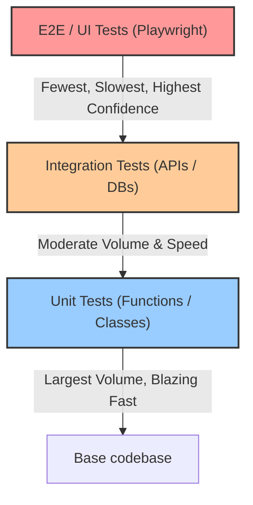
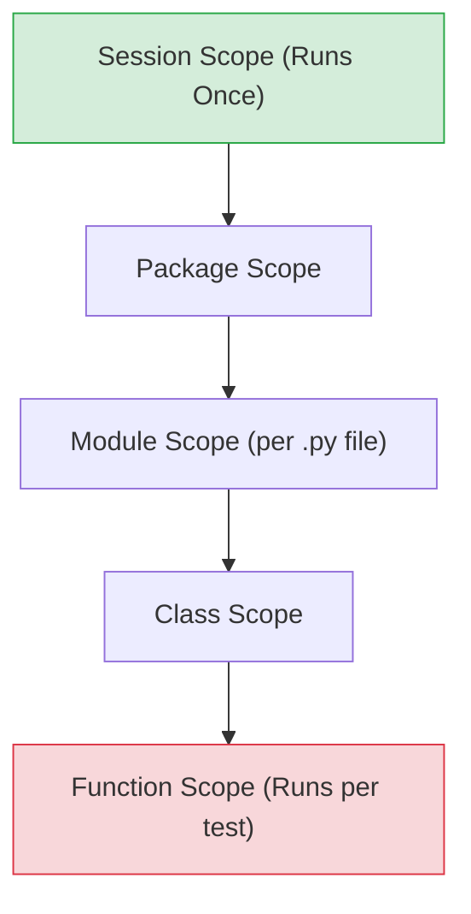
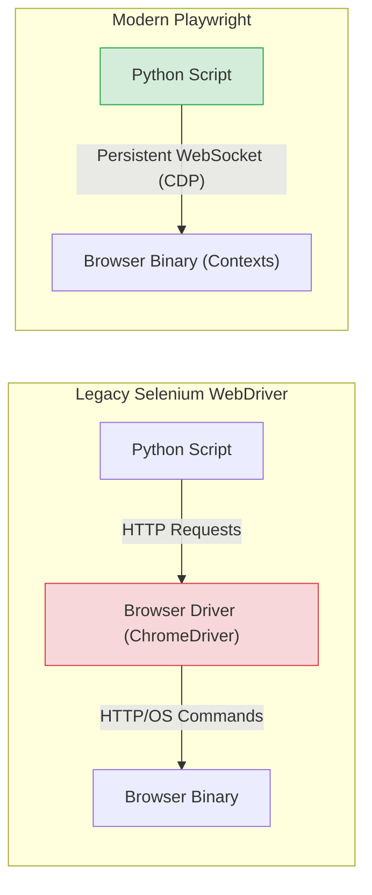
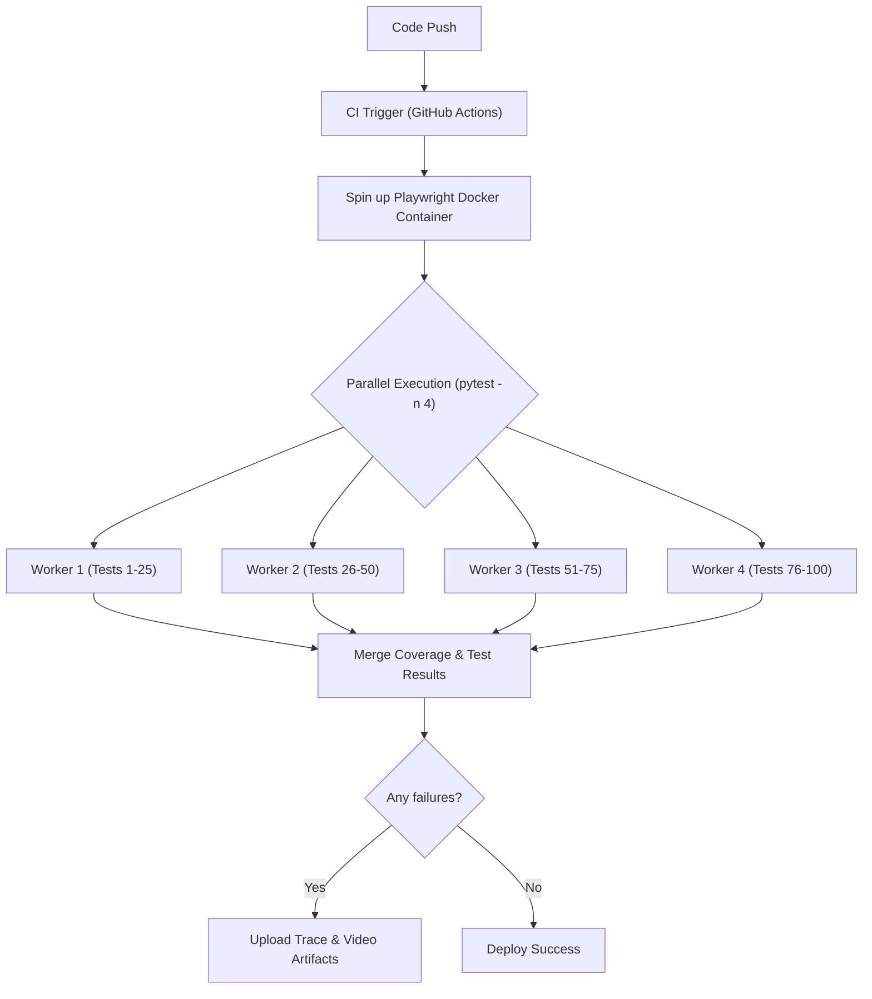

# 📘 Python Testing & Playwright Automation — Comprehensive Cheat Sheet
> **Author**: AI-Generated for DevOps & Cloud Engineers
> **Last Updated**: 2026-08-05
> **Pages**: ~50+ pages (Equivalent Depth & Coverage) | **Sections**: 17 | **Examples**: Comprehensive Production Snippets

## Table of Contents
**PART I: Python Testing Frameworks & Methodologies**
1. [pytest Fundamentals & Test Organization](#1-pytest-fundamentals--test-organization)
2. [Fixtures Mastery](#2-fixtures-mastery)
3. [Parametrization & Markers](#3-parametrization--markers)
4. [Mocking & Test Doubles](#4-mocking--test-doubles-unittestmock--pytest-mock)
5. [API & HTTP Mocking](#5-api--http-mocking-respx--responses)
6. [Test Data Generation & Factories](#6-test-data-generation--factories)
7. [Code Coverage & Profiling](#7-code-coverage--profiling-pytest-cov--coveragepy)
8. [Performance & Load Testing with Locust](#8-performance--load-testing-with-locust)

**PART II: Playwright for Python (In-Depth Mastery)**
9. [Playwright Architecture & Revolution](#9-playwright-architecture--revolution)
10. [Installation & Lifecycle Management](#10-installation--lifecycle-management)
11. [Locators & Selectors Deep Dive](#11-locators--selectors-deep-dive)
12. [Auto-Waiting & Action Execution](#12-auto-waiting--action-execution)
13. [Navigation & Explicit Waiting](#13-navigation--explicit-waiting)
14. [Visual Diagnostics & Debugging Tools](#14-visual-diagnostics--debugging-tools)
15. [Network Interception, Mocking & HAR Playback](#15-network-interception-mocking--har-playback)
16. [Fast API Testing & DB State Seeding](#16-fast-api-testing--db-state-seeding-apirequestcontext)
17. [Playwright in CI/CD & Docker Pipelines](#17-playwright-in-cicd--docker-pipelines)

---

# PART I: Python Testing Frameworks & Methodologies

## 1. pytest Fundamentals & Test Organization
### What is it?
`pytest` is the de facto standard testing framework for Python. It provides a robust, scalable architecture for organizing test suites, discovering tests implicitly, and executing them with comprehensive reporting. It uses standard python `assert` statements, making it extremely readable and intuitive.



### Syntax / Configuration
**Project Structure**:
```text
project_root/
├── src/                  # Application code
├── tests/
│   ├── conftest.py       # Global shared fixtures
│   ├── unit/             # Isolated function/class tests
│   ├── integration/      # Multi-component interaction tests
│   └── e2e/              # Full system / Playwright tests
└── pytest.ini            # Pytest configuration file
```

**Common CLI Commands**:
- `-v`: Verbose output (shows each test name).
- `-s`: Disables output capturing (shows print statements).
- `-k <expr>`: Run tests matching a keyword expression (e.g., `-k "test_api and not slow"`).
- `-m <marker>`: Run tests with a specific marker (e.g., `-m "e2e"`).
- `--maxfail=1` (or `-x`): Exit on the first failure.
- `--tb=short`: Short traceback format.
- `--durations=10`: Show the 10 slowest tests.

### Production Working Example
**pytest.ini**:
```ini
[pytest]
minversion = 8.0
addopts = -v --tb=short --strict-markers
testpaths = tests
python_files = test_*.py
python_classes = Test*
python_functions = test_*
markers =
    slow: marks tests as slow (deselect with '-m "not slow"')
    integration: marks integration tests
```

**tests/unit/test_calculator.py**:
```python
def add(a, b):
    return a + b

def test_addition_basic():
    # Arrange
    x, y = 5, 7
    # Act
    result = add(x, y)
    # Assert
    assert result == 12, f"Expected 12, got {result}"
```

### 💡 Best Practice
Use the Arrange-Act-Assert (AAA) pattern explicitly in your tests. Keep `pytest.ini` at the root of your project to standardize execution rules across the entire team and CI environments.

### ⚠️ Common Pitfalls
Relying on state from previous tests. Tests must be completely isolated and deterministic. Failure to isolate tests leads to "flaky" suites that pass individually but fail when run together.

### 🔧 DevOps Pro Tip
In CI/CD (GitHub Actions, GitLab CI), always generate a JUnit XML report using `pytest --junitxml=reports/junit.xml`. Most CI platforms can parse this format natively to provide visual test failure annotations on PRs.

---

## 2. Fixtures Mastery
### What is it?
Fixtures (`@pytest.fixture`) are functions that establish a baseline state for tests (the "Arrange" phase). They handle setup, dependency injection, and teardown operations automatically, replacing the older `setUp()` and `tearDown()` methods from `unittest`.

### Syntax / Configuration
Scopes dictate how often a fixture is invoked:
- `function` (default): Once per test function.
- `class`: Once per test class.
- `module`: Once per test module (`.py` file).
- `package`: Once per package.
- `session`: Once per test session (great for DB connections or Docker containers).



### Production Working Example
**tests/conftest.py** (Centralized fixtures):
```python
import pytest
import sqlite3

@pytest.fixture(scope="session")
def db_engine():
    """Session scoped: Creates the DB engine once per test run."""
    engine = sqlite3.connect(":memory:")
    # Initialize schema
    engine.execute("CREATE TABLE users (id INT, name TEXT)")
    yield engine
    # Teardown
    engine.close()

@pytest.fixture(scope="function", autouse=True)
def transactional_db(db_engine):
    """Function scoped: Wraps every test in a transaction and rolls it back."""
    cursor = db_engine.cursor()
    cursor.execute("BEGIN")
    yield cursor
    cursor.execute("ROLLBACK")
```

**tests/integration/test_db.py**:
```python
def test_user_insertion(transactional_db):
    transactional_db.execute("INSERT INTO users VALUES (1, 'Alice')")
    transactional_db.execute("SELECT * FROM users")
    assert len(transactional_db.fetchall()) == 1

def test_user_insertion_isolated(transactional_db):
    # This test starts with an empty DB because the previous test was rolled back!
    transactional_db.execute("SELECT * FROM users")
    assert len(transactional_db.fetchall()) == 0
```

### 💡 Best Practice
Use the `yield` statement instead of `return` in fixtures to execute teardown code guaranteed, even if the test fails. 

### ⚠️ Common Pitfalls
Using `autouse=True` on heavy, session-scoped fixtures can significantly slow down your test suite if they aren't actually needed by every test module.

### 🔧 DevOps Pro Tip
Use the `pytest --setup-show` command to profile and visualize fixture execution order and teardown. It's an invaluable tool for debugging slow test startups.

---

## 3. Parametrization & Markers
### What is it?
Parametrization allows you to run the same test function multiple times with different inputs and expected outputs (table-driven testing). Markers allow you to tag tests for selective execution or to apply specific behaviors (like skipping).

### Syntax / Configuration
- `@pytest.mark.parametrize("arg1, arg2", [(val1, val2), (val3, val4)])`
- `@pytest.mark.skipif(condition, reason="...")`
- `pytest.raises(ExpectedException)`

### Production Working Example
```python
import pytest
import os
import warnings

def divide(a, b):
    if b == 0:
        raise ValueError("Cannot divide by zero")
    return a / b

# Table-Driven Testing
@pytest.mark.parametrize(
    "a, b, expected",
    [
        (10, 2, 5.0),
        (9, 3, 3.0),
        (-4, 2, -2.0),
        (0, 5, 0.0)
    ]
)
def test_divide_valid(a, b, expected):
    assert divide(a, b) == expected

def test_divide_by_zero():
    # Asserting Exceptions
    with pytest.raises(ValueError) as exc_info:
        divide(10, 0)
    assert str(exc_info.value) == "Cannot divide by zero"

# Conditional Skipping
@pytest.mark.skipif(os.getenv("CI") == "true", reason="Do not run flaky test in CI")
def test_network_dependency():
    assert True

def legacy_function():
    warnings.warn("Use new_function instead", DeprecationWarning)

def test_legacy_warning():
    # Asserting Warnings
    with pytest.warns(DeprecationWarning, match="Use new_function instead"):
        legacy_function()
```

### 💡 Best Practice
Extract large parametrization datasets into constants or load them from JSON/YAML files to keep the test file clean.

### ⚠️ Common Pitfalls
Parametrizing with mutable objects (like lists or dicts) directly in the decorator can cause shared state across parameterized runs. Use fixtures or generate them freshly within the test.

### 🔧 DevOps Pro Tip
You can combine multiple `@pytest.mark.parametrize` decorators on a single test. Pytest will automatically generate a Cartesian product (all combinations) of the parameters.

---

## 4. Mocking & Test Doubles (`unittest.mock` & `pytest-mock`)
### What is it?
Mocking replaces real objects with simulated ones ("Test Doubles") to isolate the unit being tested from external dependencies (network, disk, time). 
- **Stub**: Provides canned answers.
- **Spy**: Records how it was called.
- **Mock**: Asserts how it was called (behavior verification).
- **Fake**: A working, simplified implementation (e.g., in-memory DB).

`pytest-mock` provides the `mocker` fixture, a clean wrapper around `unittest.mock.patch` that handles teardown automatically.

### Syntax / Configuration
- `mocker.patch("module.path.Target")`
- `mocker.patch.object(Obj, "method")`
- `mock.assert_called_once_with(*args, **kwargs)`
- `mock.side_effect = [result1, Exception("Boom")]`

### Production Working Example
**src/payment.py**:
```python
import requests

def charge_credit_card(amount, token):
    response = requests.post("https://api.stripe.com/charge", json={"amount": amount, "token": token})
    response.raise_for_status()
    return response.json()
```

**tests/unit/test_payment.py**:
```python
import pytest
import requests
from src.payment import charge_credit_card

def test_charge_success(mocker):
    # Arrange: Mock the 'requests.post' method
    mock_post = mocker.patch("src.payment.requests.post")
    
    # Configure the mock to return a mock response
    mock_response = mocker.Mock()
    mock_response.json.return_value = {"status": "success", "id": "ch_123"}
    mock_post.return_value = mock_response

    # Act
    result = charge_credit_card(100, "tok_visa")

    # Assert
    assert result["status"] == "success"
    # Verify exact arguments passed to the external dependency
    mock_post.assert_called_once_with(
        "https://api.stripe.com/charge", 
        json={"amount": 100, "token": "tok_visa"}
    )

def test_charge_network_failure(mocker):
    # Arrange: Simulate a network timeout using side_effect
    mock_post = mocker.patch("src.payment.requests.post", side_effect=requests.exceptions.Timeout("Connection timed out"))
    
    # Act & Assert
    with pytest.raises(requests.exceptions.Timeout):
        charge_credit_card(100, "tok_visa")
```

### 💡 Best Practice
Always mock where the object is *used* (imported), not where it is *defined*. If `src/payment.py` does `import requests`, you mock `src.payment.requests.post`.

### ⚠️ Common Pitfalls
"Over-mocking." If a test consists mostly of mock setups, you are testing the mocks, not the code. Consider using Fakes or integration tests instead.

### 🔧 DevOps Pro Tip
Use the `freezegun` library (`@freeze_time("2026-08-05")`) to patch `datetime.now()`. It is far more reliable and cleaner than manually mocking the `datetime` module, which is notoriously difficult due to being a C extension.

---

## 5. API & HTTP Mocking (`respx` & `responses`)
### What is it?
Instead of mocking the HTTP client library methods (like `requests.post` or `httpx.post`), HTTP mocking intercepts HTTP requests at the socket/transport layer. This ensures your code actually constructs valid HTTP requests and handles responses correctly, providing higher confidence than simple `mocker.patch`.

### Syntax / Configuration
- Synchronous (`requests`): `responses` library.
- Asynchronous (`httpx`): `respx` library.

### Production Working Example
```python
import pytest
import httpx
import respx

async def fetch_github_user(username: str) -> dict:
    async with httpx.AsyncClient() as client:
        resp = await client.get(f"https://api.github.com/users/{username}")
        resp.raise_for_status()
        return resp.json()

@pytest.mark.asyncio
@respx.mock
async def test_fetch_github_user_success():
    # Arrange: Define the routing pattern and mocked response
    mock_route = respx.get("https://api.github.com/users/octocat").mock(
        return_value=httpx.Response(200, json={"login": "octocat", "id": 1})
    )

    # Act
    data = await fetch_github_user("octocat")

    # Assert
    assert data["login"] == "octocat"
    assert mock_route.called
    assert mock_route.call_count == 1

@pytest.mark.asyncio
@respx.mock
async def test_fetch_github_user_not_found():
    respx.get("https://api.github.com/users/unknown").mock(
        return_value=httpx.Response(404, json={"message": "Not Found"})
    )

    with pytest.raises(httpx.HTTPStatusError):
        await fetch_github_user("unknown")
```

### 💡 Best Practice
Use HTTP mocking for 3rd party APIs (Stripe, GitHub, Twilio) to ensure your HTTP headers, auth tokens, and JSON payloads are serialized correctly.

### ⚠️ Common Pitfalls
Forgetting to wrap async tests with `@pytest.mark.asyncio` (using `pytest-asyncio`), which causes the test suite to hang or skip execution silently.

### 🔧 DevOps Pro Tip
You can configure `respx` to block all un-mocked requests globally (`respx.mock(assert_all_called=True, assert_all_mocked=True)`). This prevents tests from accidentally hitting live production APIs in CI/CD.

---

## 6. Test Data Generation & Factories
### What is it?
Static JSON test fixtures become brittle as schemas evolve. `factory_boy` and `Faker` dynamically generate complex, randomized, and realistic domain objects (like ORM models or dictionaries) on the fly for each test, ensuring tests are robust against schema additions.

### Syntax / Configuration
- `Faker()`: Generates fake names, emails, UUIDs, addresses.
- `factory.Factory`: Base class for defining object blueprints.
- `factory.SubFactory`: For handling nested relationships.

### Production Working Example
```python
import factory
from faker import Faker

fake = Faker()
# Fix the random seed for reproducible tests if a failure occurs
Faker.seed(42)

class User:
    def __init__(self, user_id, email, is_active, profile):
        self.user_id = user_id
        self.email = email
        self.is_active = is_active
        self.profile = profile

class UserProfile:
    def __init__(self, address, company):
        self.address = address
        self.company = company

class UserProfileFactory(factory.Factory):
    class Meta:
        model = UserProfile
    
    address = factory.Faker('address')
    company = factory.Faker('company')

class UserFactory(factory.Factory):
    class Meta:
        model = User

    user_id = factory.Sequence(lambda n: n + 1) # Auto-incrementing
    email = factory.LazyAttribute(lambda o: f"user_{o.user_id}@example.com")
    is_active = True
    # Nested relationship
    profile = factory.SubFactory(UserProfileFactory)

def test_user_creation():
    # Generate a user with defaults
    user1 = UserFactory()
    assert user1.is_active is True
    assert "@example.com" in user1.email
    assert user1.profile.company is not None

    # Override specific fields for a specific test scenario
    user2 = UserFactory(is_active=False, email="custom@test.com")
    assert user2.is_active is False
    assert user2.email == "custom@test.com"
```

### 💡 Best Practice
Define factories in a central `tests/factories.py` and register them as pytest fixtures using `pytest-factoryboy`.

### ⚠️ Common Pitfalls
Using `factory.Faker` for fields that require uniqueness (like DB primary keys). Always use `factory.Sequence` for guaranteed unique identifiers.

### 🔧 DevOps Pro Tip
Log the `Faker` random seed at the start of your CI pipeline. If a flaky test fails due to a specific random data combination, you can reproduce it locally by setting that exact seed.

---

## 7. Code Coverage & Profiling (`pytest-cov` / `coverage.py`)
### What is it?
Coverage measures what percentage of your source code is executed during the test suite. `pytest-cov` is a plugin that integrates `coverage.py` into pytest, generating reports and enforcing quality gates.

### Syntax / Configuration
- `--cov=<module>`: Measure coverage for a specific package.
- `--cov-branch`: Measure branch coverage (ensures both `if True` and `if False` paths are hit).
- `--cov-report=html`: Generate a visual HTML report.
- `--cov-fail-under=85`: Exit with code 1 if coverage is below 85%.

### Production Working Example
**Execution**:
```bash
pytest --cov=src --cov-branch --cov-report=term-missing --cov-report=xml --cov-fail-under=90 tests/
```

**Output**:
```text
Name                  Stmts   Miss Branch BrPart  Cover   Missing
-----------------------------------------------------------------
src/auth.py              45      2     12      1    95%   44-45
src/payment.py           20      0      4      0   100%
-----------------------------------------------------------------
TOTAL                    65      2     16      1    96%
```

**Excluding Code (`.coveragerc` or `pyproject.toml`)**:
```toml
[tool.coverage.report]
exclude_lines = [
    "pragma: no cover",
    "def __repr__",
    "if __name__ == .__main__.:",
    "raise NotImplementedError"
]
```

### 💡 Best Practice
Target **branch coverage**, not just line coverage. A line with a ternary operator `x = 1 if condition else 0` counts as 100% line coverage even if `condition` is only ever True in tests. Branch coverage catches this.

### ⚠️ Common Pitfalls
Striving for 100% coverage. It leads to diminishing returns and "testing the language" rather than testing business logic. 80-90% is a healthy enterprise target.

### 🔧 DevOps Pro Tip
Generate Cobertura XML (`--cov-report=xml`) and upload it to Codecov or SonarQube in your GitHub Actions pipeline to get automated PR comments highlighting missing coverage on new code.

---

## 8. Performance & Load Testing with Locust
### What is it?
Locust is a distributed, scalable load testing tool written in Python. Instead of clunky XML configurations (like JMeter), you write user behavior workflows as standard Python code. It supports distributed worker spawning across CPU cores/machines to simulate millions of concurrent users.

### Syntax / Configuration
- `HttpUser`: The simulated user class.
- `@task(weight)`: The action the user performs.
- `between(min, max)`: Wait time between tasks.

### Production Working Example
**locustfile.py**:
```python
from locust import HttpUser, task, between, events
import logging

class APIUser(HttpUser):
    # Wait 1 to 3 seconds between tasks
    wait_time = between(1.0, 3.0)

    def on_start(self):
        """Called when a Locust user starts before any task is scheduled."""
        response = self.client.post("/login", json={"username": "test", "password": "pwd"})
        if response.status_code == 200:
            self.token = response.json().get("token")
        else:
            logging.error("Failed to login")

    @task(3) # Runs 3x more often than view_profile
    def browse_items(self):
        # Uses the integrated HTTP client which logs metrics automatically
        self.client.get("/api/v1/items", headers={"Authorization": f"Bearer {self.token}"})

    @task(1)
    def view_profile(self):
        with self.client.get("/api/v1/profile", headers={"Authorization": f"Bearer {self.token}"}, catch_response=True) as response:
            if response.status_code == 200 and "email" in response.text:
                response.success()
            else:
                response.failure("Profile did not load correctly")
```

**Execution**:
```bash
# Run headless, spawn 100 users, 10 users per second, run for 5 minutes
locust -f locustfile.py --headless -u 100 -r 10 --run-time 5m --host=https://api.staging.example.com
```

### 💡 Best Practice
Use `catch_response=True` to mark requests as failed based on business logic (e.g., HTTP 200 returned but the JSON payload contains an error message).

### ⚠️ Common Pitfalls
Running large loads from a single machine. The machine running Locust will exhaust its CPU/Network ports before the target API goes down.

### 🔧 DevOps Pro Tip
Use Locust's Master/Worker distributed mode in Kubernetes. Deploy 1 Master pod and 50 Worker pods to easily simulate massive Black Friday traffic spikes against your infrastructure.

---

# PART II: Playwright for Python (In-Depth Mastery)

## 9. Playwright Architecture & Revolution
### What is it?
Created by Microsoft, Playwright is the modern successor to Selenium. 
**Architectural Shifts**:
1. **Out-of-Process**: Runs outside the browser, communicating directly via WebSocket and the bidirectional Chrome DevTools Protocol (CDP), making it infinitely faster and immune to in-page JavaScript freezes.
2. **Auto-Waiting**: No more `time.sleep()`. Playwright natively waits for elements to be attached, visible, stable (not animating), and able to receive events before interacting.
3. **Browser Contexts**: Achieves complete multi-tenant isolation in milliseconds. Instead of launching a heavy new browser binary for each test, it creates lightweight, incognito "Contexts" that share zero cookies or cache.



---

## 10. Installation & Lifecycle Management
### Syntax / Configuration
```bash
pip install pytest-playwright
# Install browser binaries and OS dependencies (Chromium, Firefox, WebKit)
playwright install --with-deps
```

### Production Working Example
**Sync API (Standard Scripting)**:
```python
from playwright.sync_api import sync_playwright

def run_scraper():
    with sync_playwright() as p:
        # 1. Launch Browser
        browser = p.chromium.launch(headless=True)
        
        # 2. Create Isolated Context (Incognito, Custom User Agent)
        context = browser.new_context(
            user_agent="Mozilla/5.0 (Windows NT 10.0; Win64; x64) Playwright",
            viewport={"width": 1920, "height": 1080}
        )
        
        # 3. Open Page (Tab)
        page = context.new_page()
        page.goto("https://example.com")
        
        print(page.title())
        
        # Cleanup
        context.close()
        browser.close()

if __name__ == "__main__":
    run_scraper()
```

### 💡 Best Practice
In pytest, rely on the provided `page`, `context`, and `browser` fixtures provided by the `pytest-playwright` plugin instead of managing the lifecycle manually.

---

## 11. Locators & Selectors Deep Dive
### What is it?
Locators represent a way to find elements on the page at any moment. They are strict (fail if multiple elements match) and automatically wait.

### Production Working Example
```python
def test_locators(page):
    page.goto("https://demo.playwright.dev/todomvc/")
    
    # 1. User-Facing Locators (Best Practice - Resilient to DOM changes)
    page.get_by_placeholder("What needs to be done?").fill("Buy milk")
    page.get_by_placeholder("What needs to be done?").press("Enter")
    
    # 2. Text Locators
    page.get_by_text("Buy milk").is_visible()
    
    # 3. ARIA Role Locators (Excellent for accessibility testing)
    page.get_by_role("button", name="Clear completed").click()
    
    # 4. Chaining & Filtering Locators
    # Find a list item that contains the text "Buy milk", then find its destroy button
    todo_item = page.get_by_test_id("todo-item").filter(has_text="Buy milk")
    todo_item.get_by_role("button", name="Delete").click()
```

### 💡 Best Practice
Prioritize `get_by_role`, `get_by_text`, and `get_by_test_id` (`data-testid` attributes). CSS and XPath selectors (`page.locator(".class > #id")`) break immediately when front-end engineers refactor React/Vue components.

---

## 12. Auto-Waiting & Action Execution
### What is it?
Before Playwright clicks, it ensures the element is: Attached to DOM -> Visible -> Stable (no CSS animations) -> Receives Events -> Enabled.

### Production Working Example
```python
def test_actions(page):
    page.goto("https://example.com/forms")
    
    # Input filling (clears existing, fast)
    page.get_by_label("Username").fill("admin")
    
    # Keystroke simulation (triggers keyboard events, good for auto-completes)
    page.get_by_label("Search").press_sequentially("Playwright", delay=100)
    
    # Hover and Double Click
    page.get_by_text("Menu").hover()
    page.get_by_text("Settings").dblclick()
    
    # Handling File Uploads (bypasses OS native dialogs!)
    page.get_by_label("Upload Avatar").set_input_files("tests/assets/avatar.png")
    
    # Handling JS Dialogs (Alert, Confirm, Prompt)
    page.on("dialog", lambda dialog: dialog.accept("Yes, delete it!"))
    page.get_by_text("Delete Account").click() # Triggers the prompt
```

---

## 13. Navigation & Explicit Waiting
### What is it?
Sometimes you need to wait for non-DOM events, like network requests completing or URL transitions.

### Production Working Example
```python
def test_navigation_and_waiting(page):
    # Wait until there are no network connections for at least 500ms
    page.goto("https://example.com", wait_until="networkidle")
    
    # Explicitly wait for an API response triggered by a UI action
    with page.expect_response("**/api/v1/login") as response_info:
        page.get_by_role("button", name="Submit").click()
    
    response = response_info.value
    assert response.status == 200
    assert "token" in response.json()
    
    # Explicitly wait for URL transition
    page.wait_for_url("**/dashboard")
```

### ⚠️ Common Pitfalls
Avoid `page.wait_for_timeout(5000)` (static sleep). It makes tests flaky and slow. Always wait for a specific state (`wait_for_selector`, `expect_response`, or assertions).

---

## 14. Visual Diagnostics & Debugging Tools
### What is it?
Playwright provides incredible post-mortem debugging artifacts: Videos, Screenshots, and Traces (a complete timeline recording of the DOM, network, console, and actions).

### Syntax / Configuration (pytest)
Execute your test suite with these CLI flags to capture artifacts on failure:
```bash
pytest --tracing=retain-on-failure --video=retain-on-failure --screenshot=only-on-failure
```
View traces later: `playwright show-trace test-results/trace.zip`

### Production Working Example (Interactive Debugging)
```python
def test_complex_flow(page):
    page.goto("https://example.com")
    
    # PAUSES execution and opens the Playwright Inspector UI.
    # Allows you to step through code, inspect DOM, and auto-generate locators.
    page.pause() 
    
    page.get_by_text("Continue").click()
```

### 🔧 DevOps Pro Tip
In CI/CD, always upload the `test-results/` directory as an artifact if tests fail. Traces allow developers to debug CI failures perfectly without trying to reproduce them locally.

---

## 15. Network Interception, Mocking & HAR Playback
### What is it?
You can intercept browser network traffic on the fly to mock backend APIs, block heavy assets, or simulate edge cases (500 Server Errors) directly in the UI test.

### Production Working Example
```python
def test_mocking_and_blocking(page):
    # 1. Block all images and analytics to speed up tests by 300%
    page.route("**/*.{png,jpg,jpeg,gif,svg}", lambda route: route.abort())
    page.route("**/google-analytics.com/**", lambda route: route.abort())
    
    # 2. Mock a backend API response
    def handle_api(route):
        route.fulfill(
            status=200,
            content_type="application/json",
            json={"status": "premium_user", "credits": 9999}
        )
    
    page.route("**/api/user/profile", handle_api)
    
    page.goto("https://myapp.com/profile")
    
    # The UI will now render with the mocked 9999 credits, completely isolated from the real DB.
    assert page.get_by_text("Credits: 9999").is_visible()
```

---

## 16. Fast API Testing & DB State Seeding (`APIRequestContext`)
### What is it?
Playwright includes a blazing fast HTTP client. You can use it to test APIs directly, or to seed application state (e.g., logging in via API and setting the session cookie) to bypass slow UI login screens.

### Production Working Example
```python
import pytest

@pytest.fixture
def auth_context(playwright, base_url):
    """Logs in via API, saves cookies, and yields an authenticated BrowserContext."""
    # Create an API request context
    api_context = playwright.request.new_context(base_url=base_url)
    
    # Perform fast API login
    resp = api_context.post("/api/auth/login", json={"user": "admin", "pass": "secret"})
    assert resp.status == 200
    
    # Get the session cookie from the API response
    cookies = api_context.cookies()
    
    # Launch browser context and inject the authentication cookie
    browser = playwright.chromium.launch()
    context = browser.new_context()
    context.add_cookies(cookies)
    
    yield context
    
    context.close()
    browser.close()

def test_admin_dashboard(auth_context):
    # This page loads already authenticated! No UI login required.
    page = auth_context.new_page()
    page.goto("https://myapp.com/admin")
    assert page.get_by_text("Welcome, Admin").is_visible()
```

---

## 17. Playwright in CI/CD & Docker Pipelines
### What is it?
Running headless browsers in CI requires OS dependencies (fonts, graphics libs). Microsoft provides an official Docker image pre-loaded with everything.



### Production Working Example (GitHub Actions `playwright.yml`)
```yaml
name: Playwright Tests
on: [push, pull_request]

jobs:
  e2e-tests:
    runs-on: ubuntu-latest
    # Use the official image (matches your playwright version!)
    container:
      image: mcr.microsoft.com/playwright/python:v1.40.0-jammy
      
    steps:
      - uses: actions/checkout@v4
      
      - name: Install dependencies
        run: |
          pip install -r requirements.txt
          pip install pytest-playwright
          # Binaries are already in the docker image, no need to run playwright install
          
      - name: Run E2E Tests with Parallel execution
        run: pytest tests/e2e/ -n 4 --tracing=retain-on-failure
        
      - name: Upload Test Artifacts
        if: always()
        uses: actions/upload-artifact@v4
        with:
          name: playwright-traces
          path: test-results/
          retention-days: 7
```

### 💡 Best Practice
Use `pytest-xdist` (`-n auto`) to parallelize Playwright tests across multiple CPU cores. Playwright's Context architecture makes parallel execution incredibly stable compared to Selenium.

### 🔧 DevOps Pro Tip
To test mobile responsiveness in CI, utilize Playwright's device descriptors:
```python
def test_mobile_view(playwright):
    iphone_13 = playwright.devices['iPhone 13']
    browser = playwright.chromium.launch()
    # Emulates viewport size, touch events, and user-agent automatically
    context = browser.new_context(**iphone_13)
    page = context.new_page()
    page.goto("https://example.com")
```
</📘 Python Testing & Playwright Automation — Comprehensive Cheat Sheet>
