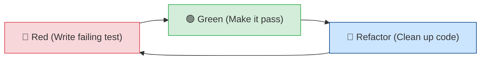
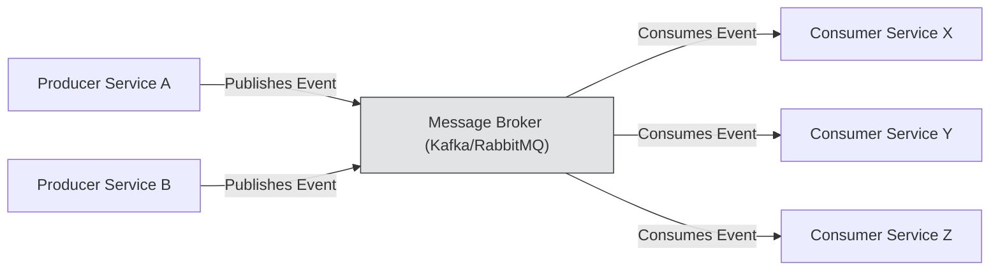
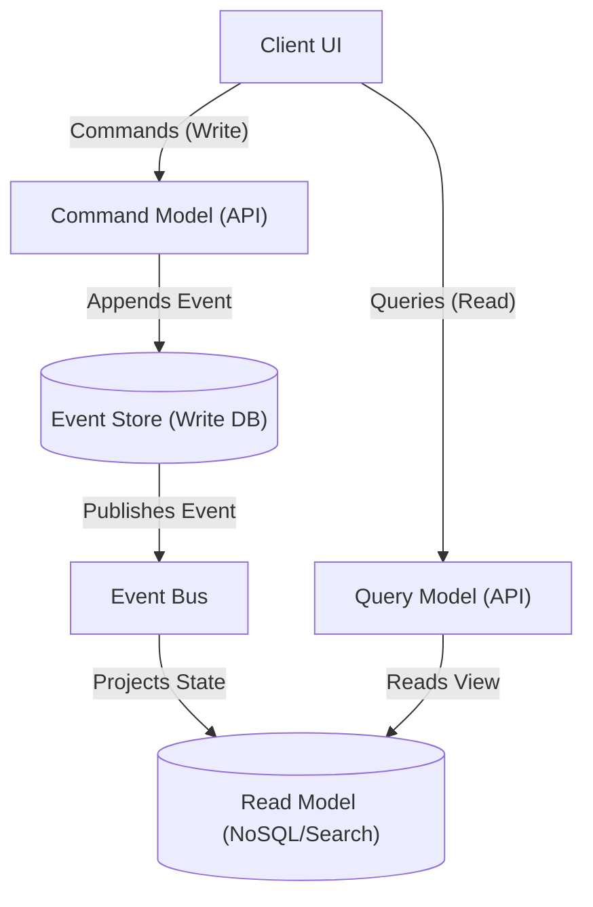
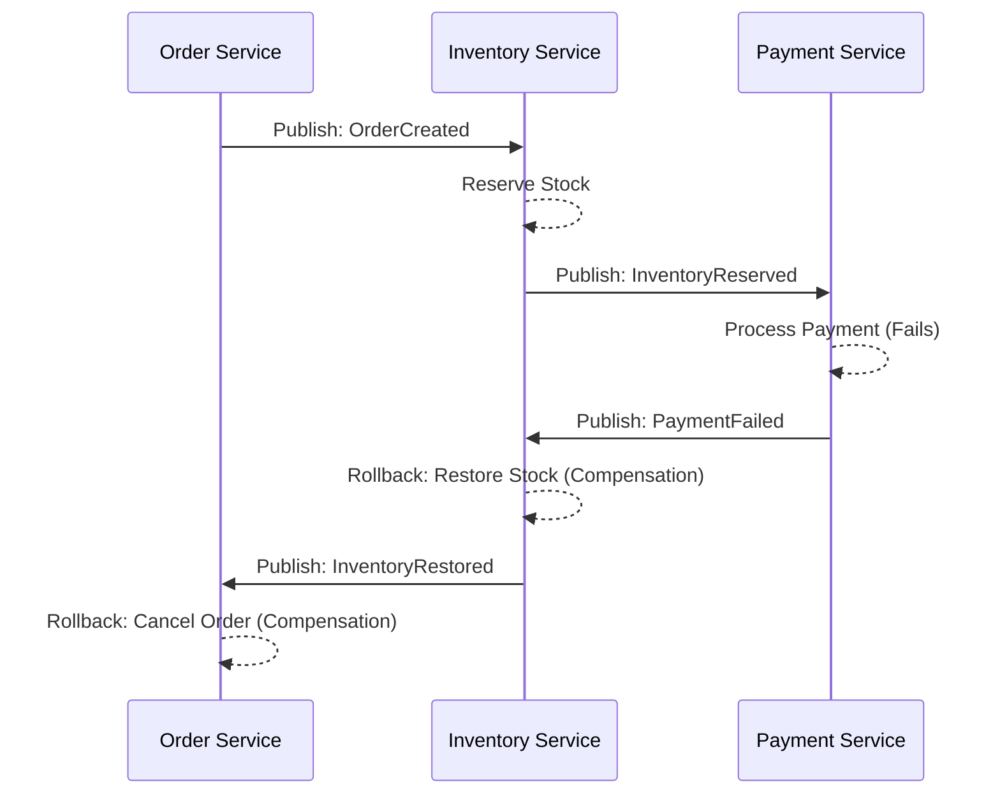
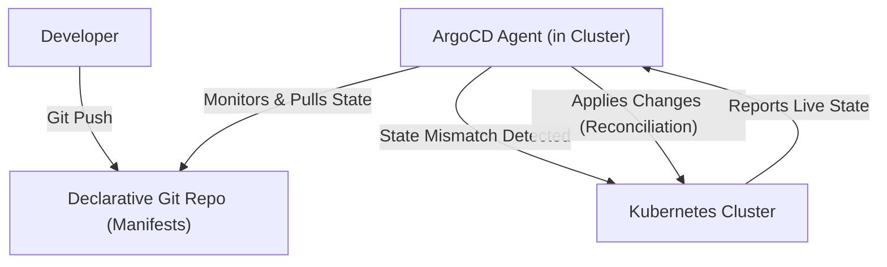

# 📘 Software Development Methodologies & Architectural Paradigms — Comprehensive Cheat Sheet

## 📑 Table of Contents
1. [Test-Driven Development (TDD)](#1-test-driven-development-tdd)
2. [Behavior-Driven Development (BDD) & Specification by Example](#2-behavior-driven-development-bdd--specification-by-example)
3. [Event-Driven Architecture (EDA)](#3-event-driven-architecture-eda)
4. [Domain-Driven Design (DDD)](#4-domain-driven-design-ddd)
5. [Command Query Responsibility Segregation (CQRS) & Event Sourcing](#5-command-query-responsibility-segregation-cqrs--event-sourcing)
6. [Microservices vs. Modular Monolith vs. Serverless Architecture](#6-microservices-vs-modular-monolith-vs-serverless-architecture)
7. [GitOps, Infrastructure as Code (IaC) & Continuous Delivery (CD) Methodology](#7-gitops-infrastructure-as-code-iac--continuous-delivery-cd-methodology)
8. [12-Factor App Methodology for Cloud-Native Engineering](#8-12-factor-app-methodology-for-cloud-native-engineering)
9. [Agile, Scrum, Kanban & Shape Up (Delivery Methodologies)](#9-agile-scrum-kanban--shape-up-delivery-methodologies)

---

## 1. Test-Driven Development (TDD)

### 🌐 Intuitive Real-World Analogy & Simple Explanation
Building a suspension bridge with load test sensor rigs before pouring concrete; the alarm buzzes (Red) until the concrete sets to firmness (Green), allowing aesthetic refinement without collapse (Refactor).

### What is it?
Test-Driven Development (TDD) is a disciplined software engineering practice where you write tests *before* writing the corresponding production code. It mandates a strict **Red-Green-Refactor** micro-iteration cycle. TDD flips traditional development on its head: instead of writing code and then trying to prove it works, you define exactly what it means for the code to work (the test), watch it fail (proving the test is valid and testing the right thing), implement the minimal logic to make it pass, and finally refactor for design and cleanliness with a safety net.

### Development Workflow
The strict Red-Green-Refactor cycle operates as follows:
1. **Red**: Write a test for the next bit of functionality you want to add. Run the test suite and watch the new test fail (compilation error or assertion failure). This proves the test is capable of failing.
2. **Green**: Write the bare minimum amount of production code required to make the test pass. Do not write generalized architectures yet. Focus only on passing the test.
3. **Refactor**: Clean up the code. Remove duplication, extract methods, apply design patterns, and ensure the code is readable. The tests guarantee you haven't broken the functionality.



### Production Working Example (Code/Config)
**Step-by-step TDD sequence building an exponential backoff circuit breaker class using `pytest`:**

```python
import time
import pytest
from typing import Callable, Any

# ==============================================================================
# TDD Phase 1: RED -> GREEN -> REFACTOR
# Test 1: The circuit breaker starts CLOSED and allows calls through.
# ==============================================================================

class CircuitBreakerOpenException(Exception):
    pass

class CircuitBreaker:
    def __init__(self, failure_threshold: int = 3, recovery_timeout: int = 5):
        self.failure_threshold = failure_threshold
        self.recovery_timeout = recovery_timeout
        self.failure_count = 0
        self.last_failure_time = 0.0
        self.state = "CLOSED"

    def call(self, func: Callable, *args, **kwargs) -> Any:
        if self.state == "OPEN":
            if time.time() - self.last_failure_time >= self.recovery_timeout:
                self.state = "HALF_OPEN"
            else:
                raise CircuitBreakerOpenException("Circuit is currently OPEN")
        
        try:
            result = func(*args, **kwargs)
            if self.state == "HALF_OPEN":
                self.state = "CLOSED"
                self.failure_count = 0
            return result
        except Exception as e:
            if not isinstance(e, CircuitBreakerOpenException):
                self.failure_count += 1
                self.last_failure_time = time.time()
                if self.failure_count >= self.failure_threshold:
                    self.state = "OPEN"
            raise e

# --- Pytest Suite ---

def test_circuit_breaker_starts_closed_and_returns_value():
    cb = CircuitBreaker()
    result = cb.call(lambda: "success")
    assert result == "success"
    assert cb.state == "CLOSED"

def test_circuit_breaker_opens_after_threshold_failures():
    cb = CircuitBreaker(failure_threshold=2)
    
    # First failure
    with pytest.raises(ValueError):
        cb.call(lambda: int("bad"))
    assert cb.state == "CLOSED"
    
    # Second failure triggers OPEN
    with pytest.raises(ValueError):
        cb.call(lambda: int("bad"))
    assert cb.state == "OPEN"
    
    # Third call fails fast without executing the lambda
    with pytest.raises(CircuitBreakerOpenException):
        cb.call(lambda: "should not execute")

def test_circuit_breaker_transitions_to_half_open_and_recovers(monkeypatch):
    cb = CircuitBreaker(failure_threshold=1, recovery_timeout=1)
    
    with pytest.raises(ValueError):
        cb.call(lambda: int("bad"))
    
    assert cb.state == "OPEN"
    
    # Simulate time passing via monkeypatch
    current_time = time.time()
    monkeypatch.setattr(time, "time", lambda: current_time + 2)
    
    # Now it should be HALF_OPEN, execute, succeed, and become CLOSED
    result = cb.call(lambda: "success")
    assert result == "success"
    assert cb.state == "CLOSED"
    assert cb.failure_count == 0
```

### 💡 Best Practice
- Test behaviors, not implementation details. If you change a private method, tests shouldn't break.
- Keep tests fast. If the test suite takes more than 10 seconds, engineers will stop running it. Mock out databases and network calls or use lightweight in-memory instances (e.g., SQLite for DB).

### ⚠️ Common Pitfalls
- **Mocking too much**: Creating tests that only assert that mocks were called with specific arguments. This results in brittle tests that break on any refactoring.
- **Skipping the Refactor step**: Accumulating technical debt because developers only focus on turning tests green and rush to the next feature.

### 🔧 DevOps Pro Tip
Automate TDD in CI/CD by enforcing 100% (or realistic 85%+) code coverage on new code using tools like `pytest-cov` and failing the build if coverage drops. Integrate pre-commit hooks that run the fast unit tests locally before push.

---

## 2. Behavior-Driven Development (BDD) & Specification by Example

### 🌐 Intuitive Real-World Analogy & Simple Explanation
Ordering at a multi-lingual restaurant where customers, waitstaff, and chefs share a standardized, numbered pictorial menu (Gherkin specifications) so there is zero ambiguity about what dish is being delivered.

### What is it?
BDD is an extension of TDD that uses human-readable descriptions of software requirements as the basis for automated tests. It bridges the gap between technical and non-technical stakeholders (Product Managers, QA, Engineers) by defining "ubiquitous domain language." BDD utilizes Gherkin syntax (Given, When, Then) to express executable specifications.

### Syntax / Configuration
**Gherkin Syntax Rules:**
- `Feature`: High-level description of a software feature.
- `Scenario`: A specific business rule or situation.
- `Given`: Initial context or setup.
- `When`: The action or event.
- `Then`: The expected outcome or assertion.
- `And` / `But`: Connectors to chain multiple steps.

### Production Working Example (Code/Config)
**Directory Structure:**
```text
tests/
├── bdd/
│   ├── features/
│   │   └── cloud_auth.feature
│   └── step_defs/
│       └── test_cloud_auth_steps.py
```

**`features/cloud_auth.feature`**:
```gherkin
Feature: Cloud API Authentication Token Workflow
  As a cloud API consumer
  I want to authenticate via an API key and receive a JWT token
  So that I can securely access protected cloud resources

  Scenario: Successful authentication with valid API key
    Given a registered user with a valid API key "VALID_KEY_123"
    When the user requests an auth token using the API key "VALID_KEY_123"
    Then a valid JWT token is returned
    And the token expiration is set to 3600 seconds from now

  Scenario: Failed authentication with invalid API key
    Given a registered user with a valid API key "VALID_KEY_123"
    When the user requests an auth token using the API key "INVALID_KEY_999"
    Then an HTTP 401 Unauthorized response is returned
    And the response contains error code "AUTH_INVALID_KEY"
```

**`step_defs/test_cloud_auth_steps.py` (Using `pytest-bdd`)**:
```python
from pytest_bdd import scenarios, given, when, then, parsers
import pytest
import jwt
import time

# Load scenarios
scenarios('../features/cloud_auth.feature')

# Mock Auth Service
class AuthService:
    def __init__(self):
        self.valid_keys = set()
    
    def register_key(self, key):
        self.valid_keys.add(key)
        
    def authenticate(self, key):
        if key in self.valid_keys:
            token = jwt.encode({"exp": time.time() + 3600}, "secret", algorithm="HS256")
            return {"status": 200, "token": token}
        return {"status": 401, "error_code": "AUTH_INVALID_KEY"}

@pytest.fixture
def auth_service():
    return AuthService()

@pytest.fixture
def context():
    return {}

@given(parsers.parse('a registered user with a valid API key "{api_key}"'))
def register_user(auth_service, api_key):
    auth_service.register_key(api_key)

@when(parsers.parse('the user requests an auth token using the API key "{api_key}"'))
def request_token(auth_service, context, api_key):
    context['response'] = auth_service.authenticate(api_key)

@then("a valid JWT token is returned")
def verify_token(context):
    assert context['response']['status'] == 200
    assert 'token' in context['response']
    # Verify token signature
    decoded = jwt.decode(context['response']['token'], "secret", algorithms=["HS256"])
    assert decoded is not None
    context['decoded_token'] = decoded

@then(parsers.parse('the token expiration is set to {seconds:d} seconds from now'))
def verify_expiration(context, seconds):
    exp = context['decoded_token']['exp']
    assert abs(exp - (time.time() + seconds)) < 5 # 5 sec tolerance

@then("an HTTP 401 Unauthorized response is returned")
def verify_401(context):
    assert context['response']['status'] == 401

@then(parsers.parse('the response contains error code "{error_code}"'))
def verify_error_code(context, error_code):
    assert context['response']['error_code'] == error_code
```

### 💡 Best Practice
Keep steps declarative, not imperative. Instead of `When I click the "Submit" button and I wait 2 seconds`, use `When the user submits the registration form`.

### ⚠️ Common Pitfalls
Creating massive, interconnected scenarios that depend on the state left by previous scenarios. Scenarios must be isolated and capable of running in any order or in parallel.

### 🔧 DevOps Pro Tip
Use tools like Allure or Cucumber Reports in your CI pipeline to generate beautiful, living documentation HTML reports directly from passing BDD test runs. PMs can review these as the canonical source of truth.

---

## 3. Event-Driven Architecture (EDA)

### 🌐 Intuitive Real-World Analogy & Simple Explanation
A mayor issuing an emergency radio broadcast alert (Publish Event) rather than making 100,000 individual synchronous phone calls to citizens; listeners tune in asynchronously and act independently.

### What is it?
EDA is a software architecture paradigm promoting the production, detection, consumption of, and reaction to events. It enables highly decoupled systems where producers broadcast events without knowing who consumes them (asynchronous communication).
- **Event Notification**: "State changed" (e.g., `UserCreated(id=1)`). Consumers must fetch additional details if needed.
- **Event-Carried State Transfer**: The event contains all data needed by the consumer to update its own local cache/DB (e.g., `UserCreated(id=1, name="Alice", email="a@a.com")`).
- **Event Sourcing**: Storing events as the primary source of truth (see section 5).

### Development Workflow
1. Define strict, versioned schemas for your events (e.g., CloudEvents standard, Avro, Protobuf).
2. Choose a broker: Event Queues (RabbitMQ/SQS) for point-to-point guaranteed processing, or Pub/Sub logs (Kafka/Redis Streams/SNS) for fan-out broadcasting.
3. Design consumers to be **Idempotent** (processing the same event twice has no unintended side effects) because at-least-once delivery is the standard.
4. Implement Dead-Letter Queues (DLQ) to catch poison-pill events that crash consumers continuously.



### Production Working Example (Code/Config)
**Python Async Event Publisher & Worker Consumer using Redis Pub/Sub:**

```python
import asyncio
import json
import uuid
import logging
from datetime import datetime
import redis.asyncio as redis

logging.basicConfig(level=logging.INFO)
logger = logging.getLogger("eda")

# 1. CloudEvents Standard Schema Structure
def build_cloudevent(topic: str, data: dict) -> dict:
    return {
        "specversion": "1.0",
        "id": str(uuid.uuid4()),
        "source": "/service/orders",
        "type": topic,
        "datacontenttype": "application/json",
        "time": datetime.utcnow().isoformat() + "Z",
        "data": data
    }

class EventPublisher:
    def __init__(self, redis_client: redis.Redis):
        self.redis = redis_client

    async def publish(self, topic: str, data: dict):
        event = build_cloudevent(topic, data)
        await self.redis.publish(topic, json.dumps(event))
        logger.info(f"Published event {event['id']} to {topic}")

class EventConsumer:
    def __init__(self, redis_client: redis.Redis):
        self.redis = redis_client
        self.pubsub = self.redis.pubsub()
        # In memory idempotency store (use real Redis SET in prod)
        self.processed_events = set()

    async def process_event(self, event_type: str, event: dict):
        event_id = event.get("id")
        if event_id in self.processed_events:
            logger.warning(f"Idempotency hit! Skipping duplicate event {event_id}")
            return
            
        logger.info(f"Processing event: {event_type} | Data: {event.get('data')}")
        
        # Simulate business logic
        await asyncio.sleep(0.1)
        if event["data"].get("simulate_error"):
            raise ValueError("Simulated Poison Pill")
            
        self.processed_events.add(event_id)
        logger.info(f"Successfully processed {event_id}")

    async def run(self, topics: list):
        await self.pubsub.subscribe(*topics)
        logger.info(f"Subscribed to topics: {topics}")
        
        async for message in self.pubsub.listen():
            if message["type"] == "message":
                try:
                    payload = message["data"].decode('utf-8')
                    event = json.loads(payload)
                    await self.process_event(message["channel"].decode('utf-8'), event)
                except json.JSONDecodeError:
                    logger.error("Failed to parse event JSON (DLQ routing needed)")
                except Exception as e:
                    logger.error(f"Error processing event: {e} (DLQ routing needed)")

# Run Example
async def main():
    r = redis.Redis(host='localhost', port=6379, db=0)
    publisher = EventPublisher(r)
    consumer = EventConsumer(r)
    
    # Start consumer in background task
    consumer_task = asyncio.create_task(consumer.run(["Order.Created", "Order.Cancelled"]))
    
    await asyncio.sleep(0.5) # Wait for sub
    
    # Publish events
    await publisher.publish("Order.Created", {"order_id": "ORD-123", "amount": 99.99})
    await publisher.publish("Order.Created", {"order_id": "ORD-123", "amount": 99.99}) # Duplicate
    await publisher.publish("Order.Cancelled", {"order_id": "ORD-999", "simulate_error": True})
    
    await asyncio.sleep(1)
    consumer_task.cancel()

# if __name__ == "__main__": asyncio.run(main())
```

### 💡 Best Practice
Always enforce **Idempotency keys** on the consumer side. Network partitions can and will cause message brokers to deliver the same event multiple times.

### ⚠️ Common Pitfalls
- **Distributed Monolith**: Creating tight coupling by expecting immediate synchronous responses from asynchronous event streams.
- **Event Schema Evolution**: Changing event schemas without backward compatibility, breaking downstream consumers. Use a schema registry.

### 🔧 DevOps Pro Tip
Utilize OpenTelemetry to inject trace contexts into your CloudEvents headers. This enables you to visualize asynchronous event flows across dozens of microservices in APM tools like Datadog or Jaeger.

---

## 4. Domain-Driven Design (DDD)

### 🌐 Intuitive Real-World Analogy & Simple Explanation
A hospital system where the definition of "Patient" differs drastically across the ER (vitals/blood type), Accounting (insurance policy/invoice), and Pharmacy (drug interactions). Attempting a single monolithic definition causes chaos; DDD isolates each department's language (Bounded Contexts) via translation desks (Anti-Corruption Layers).

### What is it?
DDD is an approach to software development for complex needs by connecting the implementation to an evolving model. 
- **Strategic Design**: Bounded Contexts (defining clear boundaries where a specific model is valid), Ubiquitous Language (a shared language between domain experts and developers), Anti-Corruption Layers.
- **Tactical Design**:
  - **Entities**: Objects with distinct identity (e.g., `User`, `Order`).
  - **Value Objects**: Immutable objects defined only by their attributes, with no identity (e.g., `Money`, `Address`).
  - **Aggregates**: Clusters of domain objects treated as a single unit, encapsulating invariants. Accessed only via the **Aggregate Root**.
  - **Repositories**: Interfaces for persisting and retrieving Aggregates.
  - **Domain Events**: Something that happened in the domain that domain experts care about.

### Production Working Example (Code/Config)
**Python Domain Model - eCommerce Order Aggregate Root:**

```python
from dataclasses import dataclass, field
from typing import List, Optional
import uuid
from datetime import datetime

# ==========================================
# Tactical DDD: Value Objects (Immutable)
# ==========================================
@dataclass(frozen=True)
class Money:
    amount: float
    currency: str
    
    def __add__(self, other: 'Money') -> 'Money':
        if self.currency != other.currency:
            raise ValueError("Currency mismatch")
        return Money(self.amount + other.amount, self.currency)

@dataclass(frozen=True)
class ShippingAddress:
    street: str
    city: str
    zip_code: str
    country: str

# ==========================================
# Tactical DDD: Domain Events
# ==========================================
@dataclass(frozen=True)
class DomainEvent:
    event_id: str = field(default_factory=lambda: str(uuid.uuid4()))
    timestamp: datetime = field(default_factory=datetime.utcnow)

@dataclass(frozen=True)
class OrderPlacedEvent(DomainEvent):
    order_id: str
    total_amount: float

# ==========================================
# Tactical DDD: Entities & Aggregate Roots
# ==========================================
class OrderLine:
    def __init__(self, product_id: str, quantity: int, unit_price: Money):
        self.product_id = product_id
        self.quantity = quantity
        self.unit_price = unit_price
        
    def total_price(self) -> Money:
        return Money(self.unit_price.amount * self.quantity, self.unit_price.currency)

class Order:
    """Aggregate Root"""
    def __init__(self, order_id: str, address: ShippingAddress):
        self._id = order_id # Identity
        self._address = address
        self._lines: List[OrderLine] = []
        self._status = "DRAFT"
        self._domain_events: List[DomainEvent] = []

    def add_item(self, product_id: str, quantity: int, unit_price: Money):
        if self._status != "DRAFT":
            raise ValueError("Cannot modify non-draft order")
        self._lines.append(OrderLine(product_id, quantity, unit_price))

    def calculate_total(self) -> Money:
        total = Money(0.0, "USD")
        for line in self._lines:
            total += line.total_price()
        return total

    def place_order(self):
        """Domain logic enforcing invariants"""
        if not self._lines:
            raise ValueError("Cannot place an empty order")
        
        self._status = "PLACED"
        
        # Emit Domain Event (pure logic, no DB calls here)
        self._domain_events.append(
            OrderPlacedEvent(
                order_id=self._id,
                total_amount=self.calculate_total().amount
            )
        )
        
    def get_events(self) -> List[DomainEvent]:
        return self._domain_events
        
    def clear_events(self):
        self._domain_events.clear()

# ==========================================
# Application Layer (Service)
# ==========================================
def handle_place_order(order_id: str):
    # In a real app, load from Repository
    address = ShippingAddress("123 Main St", "Tech City", "10001", "USA")
    order = Order(order_id, address)
    
    order.add_item("PROD-1", 2, Money(50.0, "USD"))
    
    # Enforce domain invariants
    order.place_order()
    
    # Save back via Repository (omitted) and dispatch events to broker
    events = order.get_events()
    for e in events:
        print(f"Dispatching Event: {type(e).__name__} -> {e}")
    order.clear_events()

# handle_place_order("ORD-555")
```

### 💡 Best Practice
Keep your domain model pure. Do not pollute Aggregate classes with database ORM annotations (like SQLAlchemy `Column` definitions) or API JSON serialization logic. Use a repository layer and mappers.

### ⚠️ Common Pitfalls
Anemic Domain Models: Using entities merely as property bags with getters/setters, while placing all business logic in procedural "Service" classes. Domain logic should live inside the Entities/Aggregates.

### 🔧 DevOps Pro Tip
Enforce DDD boundaries in CI using tools like `pytest-archon` or `import-linter` to statically analyze imports. For example, ensure the `domain` module never imports from `infrastructure` or `api`.

---

## 5. Command Query Responsibility Segregation (CQRS) & Event Sourcing

### 🌐 Intuitive Real-World Analogy & Simple Explanation
A bank passbook vs. an ATM screen. The teller appends immutable transaction timestamps (`+100 Deposit`, Event Sourcing) instead of erasing your balance. Because summing 10,000 transactions on demand is slow, an automated calculator projects the running total onto an instant read-only display at the ATM (CQRS Read Model).

### What is it?
- **CQRS**: Segregates the data structures for reading data (Query) from the data structures for updating data (Command). This allows asymmetric scaling and optimization. Write databases can be highly normalized relational DBs, while read databases can be flat NoSQL document stores or search indexes (Elasticsearch).
- **Event Sourcing**: Instead of storing current state, you store a sequence of state-changing events. The current state is derived by replaying the events. Think of a bank account: you don't store "Balance: $100", you store "Deposited $50, Deposited $100, Withdrew $50".



### Production Working Example (Code/Config)
**Python implementation of an Account ledger with Event Sourcing & CQRS projection:**

```python
from dataclasses import dataclass
from typing import List
from datetime import datetime

# ==================================================
# Event Store & Events
# ==================================================
@dataclass
class Event:
    pass

@dataclass
class AccountCreated(Event):
    account_id: str
    owner: str

@dataclass
class FundsDeposited(Event):
    account_id: str
    amount: float

@dataclass
class FundsWithdrawn(Event):
    account_id: str
    amount: float

class EventStore:
    def __init__(self):
        # In-memory append-only log
        self._events: List[Event] = []
        # Event handlers for building projections
        self._subscribers = []

    def append(self, event: Event):
        self._events.append(event)
        for sub in self._subscribers:
            sub(event)

    def get_events_for_stream(self, account_id: str) -> List[Event]:
        return [e for e in self._events if getattr(e, 'account_id', None) == account_id]
        
    def subscribe(self, handler):
        self._subscribers.append(handler)

# ==================================================
# Command Side (Write Model)
# ==================================================
class AccountCommandModel:
    """Rebuilds state from events to validate business rules"""
    def __init__(self, account_id: str, events: List[Event]):
        self.id = account_id
        self.balance = 0.0
        self.is_active = False
        
        # Rehydrate state
        for e in events:
            self.apply(e)

    def apply(self, event: Event):
        if isinstance(event, AccountCreated):
            self.is_active = True
        elif isinstance(event, FundsDeposited):
            self.balance += event.amount
        elif isinstance(event, FundsWithdrawn):
            self.balance -= event.amount

    # Business behaviors
    def deposit(self, amount: float) -> FundsDeposited:
        if not self.is_active: raise ValueError("Account inactive")
        if amount <= 0: raise ValueError("Amount must be positive")
        return FundsDeposited(self.id, amount)

    def withdraw(self, amount: float) -> FundsWithdrawn:
        if not self.is_active: raise ValueError("Account inactive")
        if self.balance < amount: raise ValueError("Insufficient funds")
        return FundsWithdrawn(self.id, amount)

# ==================================================
# Query Side (Read Model / Projection)
# ==================================================
class AccountReadDB:
    def __init__(self):
        # Fast read-optimized flat storage (e.g., Redis, MongoDB)
        self.balances = {}

    def project(self, event: Event):
        """Asynchronously processes events to build the read model"""
        if isinstance(event, AccountCreated):
            self.balances[event.account_id] = {"owner": event.owner, "balance": 0.0}
        elif isinstance(event, FundsDeposited):
            self.balances[event.account_id]["balance"] += event.amount
        elif isinstance(event, FundsWithdrawn):
            self.balances[event.account_id]["balance"] -= event.amount

    def get_balance_summary(self, account_id: str) -> dict:
        """O(1) fast read query"""
        return self.balances.get(account_id)

# ==================================================
# Orchestration
# ==================================================
store = EventStore()
read_db = AccountReadDB()
store.subscribe(read_db.project) # Hook projection to Event Store

# 1. Command: Create Account
store.append(AccountCreated("ACC-1", "Alice"))

# 2. Command: Deposit 100
# First hydrate command model to check rules
model = AccountCommandModel("ACC-1", store.get_events_for_stream("ACC-1"))
event = model.deposit(100.0)
store.append(event) # Append and trigger projection

# 3. Query: Fast Read
print("Fast Read View:", read_db.get_balance_summary("ACC-1"))
```

### 💡 Best Practice
Implement **Snapshots**. Replaying thousands of events to hydrate an aggregate is slow. Save a snapshot of the aggregate state every N events, and then hydrate by loading the snapshot + any events that occurred after it.

### ⚠️ Common Pitfalls
Eventual Consistency panic. Because the Write model updates the Event Store and then the Projection builds the Read model asynchronously, querying immediately after a write might return stale data. UIs must be designed to accommodate this (optimistic UI updates).

### 🔧 DevOps Pro Tip
Store your Event Store data in specialized immutable append-only databases like EventStoreDB or DynamoDB with streams enabled. Do not use standard relational tables with UPDATE/DELETE privileges.

---

## 6. Microservices vs. Modular Monolith vs. Serverless Architecture

### 🌐 Intuitive Real-World Analogy & Simple Explanation
A Food Court (isolated food kiosks; if one oven breaks, others serve food, but customers walk between stands) vs. A Traditional Family Restaurant with clean internal kitchen stations under one roof vs. On-Demand Festival Food Trucks that spawn when lines form and disappear when crowds vanish (zero cost at rest).

### Architectural Comparison
| Paradigm | Pros | Cons | Best For |
|---|---|---|---|
| **Modular Monolith** | Single deployment unit, easy local debugging, simple in-memory method calls, no network latency between domains. | Teams step on each other's toes during deployments, rigid scaling (scale everything or nothing). | Startups, teams < 20 engineers, rapid MVP iteration. |
| **Microservices** | Independent deployment, independent scaling, polyglot tech stacks, fault isolation. | Distributed system complexity, network latency, data consistency (Sagas required), complex CI/CD. | Enterprise organizations, highly scalable cloud platforms. |
| **Serverless (FaaS)** | Zero infrastructure management, true auto-scaling (scale to zero), pay-per-execution. | Cold starts, vendor lock-in, hard to manage state, difficult local testing. | Event-driven glue code, bursty unpredictable workloads, cron jobs. |

### Development Workflow: Distributed Transactions (Sagas)
Microservices require the **Database-per-service** rule. Therefore, you cannot use ACID transactions across services. You must use the **Saga Pattern**:
- **Choreography**: Services publish events, other services react. Decentralized.
- **Orchestration**: A central Saga Orchestrator service commands other services.



### Production Working Example (Code/Config)
**Python Saga Choreography - Rollback Pattern:**
```python
import logging

logging.basicConfig(level=logging.INFO)

# Simulating Message Broker
class MessageBus:
    def __init__(self):
        self.subscribers = {}
        
    def subscribe(self, topic, handler):
        if topic not in self.subscribers:
            self.subscribers[topic] = []
        self.subscribers[topic].append(handler)
        
    def publish(self, topic, event):
        logging.info(f"[BUS] {topic} -> {event}")
        for handler in self.subscribers.get(topic, []):
            handler(event)

bus = MessageBus()

# Microservice 1: Inventory
class InventoryService:
    def __init__(self):
        self.stock = {"LAPTOP": 5}
        
    def handle_order_created(self, event):
        item = event["item"]
        if self.stock.get(item, 0) > 0:
            self.stock[item] -= 1
            logging.info(f"[Inventory] Reserved {item}. Stock left: {self.stock[item]}")
            bus.publish("InventoryReserved", event)
        else:
            logging.warning(f"[Inventory] Out of stock for {item}")
            bus.publish("InventoryFailed", event)
            
    def handle_compensation(self, event):
        item = event["item"]
        self.stock[item] += 1
        logging.info(f"[Inventory] COMPENSATING: Restored {item}. Stock: {self.stock[item]}")

# Microservice 2: Payment
class PaymentService:
    def handle_inventory_reserved(self, event):
        logging.info(f"[Payment] Processing payment for Order {event['order_id']}")
        # Simulate a payment failure
        if event.get("force_fail_payment"):
            logging.error("[Payment] Payment Failed! Emitting compensation event.")
            bus.publish("PaymentFailed", event)
        else:
            logging.info("[Payment] Payment Success.")
            bus.publish("PaymentSucceeded", event)

# Microservice 3: Order
class OrderService:
    def handle_payment_succeeded(self, event):
        logging.info(f"[Order] Order {event['order_id']} is CONFIRMED.")
        
    def handle_payment_failed(self, event):
        logging.error(f"[Order] Order {event['order_id']} is CANCELLED due to payment failure.")

# Wiring up the Choreography
inventory = InventoryService()
payment = PaymentService()
order = OrderService()

bus.subscribe("OrderCreated", inventory.handle_order_created)
bus.subscribe("InventoryReserved", payment.handle_inventory_reserved)

# COMPENSATING TRANSACTION ROUTING
bus.subscribe("PaymentFailed", inventory.handle_compensation)
bus.subscribe("PaymentFailed", order.handle_payment_failed)
bus.subscribe("PaymentSucceeded", order.handle_payment_succeeded)

print("--- Scenario 1: Happy Path ---")
bus.publish("OrderCreated", {"order_id": "1", "item": "LAPTOP", "force_fail_payment": False})

print("\n--- Scenario 2: Payment Failure triggering Saga Rollback ---")
bus.publish("OrderCreated", {"order_id": "2", "item": "LAPTOP", "force_fail_payment": True})
```

### 💡 Best Practice
Start with a Modular Monolith. Define strict internal APIs. When one module needs to scale independently or is handed to a separate team, extract it into a microservice. Do not start with Microservices on day one.

### ⚠️ Common Pitfalls
Ignoring network fallacies. Microservice calls will fail. You must implement Retries, Circuit Breakers, and Timeouts on every single synchronous inter-service HTTP/gRPC call.

### 🔧 DevOps Pro Tip
Use a **Service Mesh** (Istio/Linkerd). It extracts networking logic (mutual TLS, retries, circuit breaking, distributed tracing, canary deployments) out of your application code and into an infrastructure sidecar proxy layer.

---

## 7. GitOps, Infrastructure as Code (IaC) & Continuous Delivery (CD) Methodology

### 🌐 Intuitive Real-World Analogy & Simple Explanation
Hotel Housekeeping automated reconciliation vs. manual calls. GitOps hangs a master room checklist on the wall (Declarative Git Repo). A dedicated housekeeper (ArgoCD agent) continuously monitors the room; if a guest moves a chair or pillow, the housekeeper immediately restores it to match the wall checklist (Reconciliation Loop).

### What is it?
- **IaC**: Managing and provisioning computing infrastructure through machine-readable definition files (Terraform, CloudFormation), rather than physical hardware configuration or interactive configuration tools.
- **GitOps**: An evolution of IaC where Git is the single source of truth for both infrastructure and application environments. Delivery pipelines are **pull-based**: an agent running in the cluster (e.g., ArgoCD, Flux) monitors a Git repository and continuously reconciles the live state of the cluster to match the desired state defined in Git.

### Development Workflow
1. Developer pushes code to `app-repo`.
2. CI pipeline builds a Docker image, tags it with a SHA, and pushes to a Container Registry.
3. CI pipeline updates the image tag in the Kubernetes manifests inside the `manifest-repo` (GitOps repo).
4. ArgoCD running in Kubernetes detects the change in the `manifest-repo` and automatically pulls and applies the changes.



### Production Working Example (Code/Config)
**Declarative GitOps configuration using ArgoCD Application CRD:**

```yaml
# argocd-app.yaml
apiVersion: argoproj.io/v1alpha1
kind: Application
metadata:
  name: payment-service-prod
  namespace: argocd
spec:
  project: default
  source:
    repoURL: 'https://github.com/my-org/manifest-repo.git'
    targetRevision: HEAD
    path: k8s/payment-service/overlays/prod
  destination:
    server: 'https://kubernetes.default.svc'
    namespace: payments
  syncPolicy:
    automated:
      prune: true      # Automatically delete resources no longer in Git
      selfHeal: true   # Automatically revert manual kubectl changes back to Git state
    syncOptions:
      - CreateNamespace=true
```

### 💡 Best Practice
Separate your Application Code repository from your GitOps Manifest repository. This prevents CI/CD loop feedback issues and allows strict RBAC over who can approve infrastructure changes versus application code changes.

### ⚠️ Common Pitfalls
"ClickOps": Making manual changes via the AWS Console or running manual `kubectl apply` commands. In a GitOps environment, the GitOps agent will instantly overwrite your manual changes (Self-Heal). If it isn't in Git, it doesn't exist.

### 🔧 DevOps Pro Tip
Implement Progressive Delivery (Canary/Blue-Green) combined with GitOps using Argo Rollouts. This allows the system to route 5% of traffic to the new version, automatically check Prometheus metrics for HTTP 500s, and rollback automatically if the error rate spikes, all without human intervention.

---

## 8. 12-Factor App Methodology for Cloud-Native Engineering

### 🌐 Intuitive Real-World Analogy & Simple Explanation
Standardized Intermodal Shipping Containers that lock identically onto container ships, freight trains, and trucks without hull modifications, plugging into standard external power hooks (Backing Services / Port Binding).

### What is it?
A methodology devised by Heroku for building software-as-a-service apps that are perfectly suited for deployment on modern cloud platforms.
1. **Codebase**: One codebase tracked in revision control, many deploys.
2. **Dependencies**: Explicitly declare and isolate dependencies (e.g., `requirements.txt`, Docker).
3. **Config**: Store config in the environment, not in the code.
4. **Backing services**: Treat DBs, caches, brokers as attached resources.
5. **Build, release, run**: Strictly separate build and run stages.
6. **Processes**: Execute the app as one or more stateless processes. State belongs in a backing service.
7. **Port binding**: Export services via port binding.
8. **Concurrency**: Scale out via the process model (horizontal scaling).
9. **Disposability**: Maximize robustness with fast startup and graceful shutdown.
10. **Dev/prod parity**: Keep dev, staging, and prod as similar as possible.
11. **Logs**: Treat logs as event streams (write to stdout, let infrastructure handle routing).
12. **Admin processes**: Run admin/management tasks as one-off processes in the same environment.

### Production Working Example (Code/Config)
**Python FastAPI + Docker embodiment of 12-Factor principles:**

```python
# app.py
import os
import signal
import sys
import time
import logging
from fastapi import FastAPI
from pydantic_settings import BaseSettings

# Factor 11: Logs as event streams (stdout)
logging.basicConfig(
    level=logging.INFO,
    format='{"time": "%(asctime)s", "level": "%(levelname)s", "message": "%(message)s"}',
    stream=sys.stdout
)
logger = logging.getLogger(__name__)

# Factor 3: Config in Environment
class Settings(BaseSettings):
    database_url: str
    redis_url: str = "redis://localhost:6379"
    api_key: str

    class Config:
        env_file = ".env"

settings = Settings()
app = FastAPI()

# Factor 9: Disposability (Graceful Shutdown)
is_shutting_down = False

def handle_sigterm(*args):
    global is_shutting_down
    logger.info("Received SIGTERM. Initiating graceful shutdown...")
    is_shutting_down = True
    # Stop accepting new queue jobs, flush metrics, close DB pools here
    time.sleep(2) # simulate cleanup
    logger.info("Cleanup complete. Exiting.")
    sys.exit(0)

signal.signal(signal.SIGTERM, handle_sigterm)

@app.get("/health")
def health_check():
    # Factor 6: Stateless Processes
    if is_shutting_down:
        return {"status": "shutting_down"}, 503
    return {"status": "ok", "db_connected": "True"}

# Run with: uvicorn app:app --host 0.0.0.0 --port 8000 (Factor 7: Port Binding)
```

**Dockerfile (Factor 2 & 5: Dependencies & Build/Release/Run):**
```dockerfile
FROM python:3.11-slim
WORKDIR /app
COPY requirements.txt .
RUN pip install --no-cache-dir -r requirements.txt
COPY app.py .
# Standardize entrypoint for disposability
CMD ["uvicorn", "app:app", "--host", "0.0.0.0", "--port", "8000"]
```

### 💡 Best Practice
Never bake secrets (API keys, DB passwords) into Docker images. Pass them entirely via environment variables at runtime, ideally pulled from a secrets manager (AWS Secrets Manager, HashiCorp Vault) and injected into the container by the orchestrator.

### ⚠️ Common Pitfalls
Writing application logs to a file inside the container. If the container crashes, the local disk is wiped (Factor 6/9 violation). Always log to `stdout`/`stderr` and let Docker/Kubernetes forward them to Datadog/ELK.

### 🔧 DevOps Pro Tip
Utilize Kubernetes `preStop` hooks in conjunction with graceful SIGTERM handling to ensure your load balancer stops routing traffic to the pod *before* the application process actually shuts down.

---

## 9. Agile, Scrum, Kanban & Shape Up (Delivery Methodologies)

### 🌐 Intuitive Real-World Analogy & Simple Explanation
A rigid scheduled train express (Scrum sprints) vs. an assembly line toll highway with barrier gate capacity limits (Kanban WIP limits) vs. an autonomous 6-week exploration squad handed a mission to construct a river crossing without daily interruptions (Basecamp Shape Up).

### What is it?
- **Scrum**: Time-boxed iterations (Sprints, usually 2 weeks). Features specific roles (Scrum Master, Product Owner), artifacts (Backlog, Sprint Goal), and ceremonies (Daily Standup, Planning, Review, Retrospective). Focuses on predictable velocity.
- **Kanban**: Continuous flow system based on manufacturing principles. No strict timeboxes. Focuses on **Work In Progress (WIP) limits** and minimizing cycle time (time from starting a task to delivering it).
- **Shape Up**: Developed by Basecamp. Replaces 2-week sprints with 6-week delivery cycles followed by a 2-week cooldown. Eliminates the backlog in favor of "betting tables." Teams are given a "shaped pitch" (problem + rough boundaries) and full autonomy to figure out the implementation.

### Practical Operational Comparisons
| Feature | Scrum | Kanban | Shape Up |
|---|---|---|---|
| **Cadence** | 2-week Sprints | Continuous Flow | 6-week cycles + 2-week cooldown |
| **Estimation** | Story Points (Fibonacci) | Minimal estimation (Focus on flow) | Appetite (How much time are we willing to spend?) |
| **Commitment** | Sprint Goal | Completing current WIP | Delivering the full pitch within 6 weeks |
| **The Backlog** | Groomed constantly | Managed constantly | Destroyed. If it's important, it will come back. |

### 💡 Best Practice
When transitioning a team from purely reactive work (e.g., SRE/DevOps handling tickets and outages) to proactive project work, **Kanban** is vastly superior to Scrum. Sprints break down when unplanned production outages occur mid-sprint.

### ⚠️ Common Pitfalls
- **"Scrum-fall"**: Doing Waterfall development inside a 2-week Sprint window. (Week 1: purely design/backend. Week 2: purely frontend. Day 14: Integration panic).
- **Horizontal Slicing**: Delivering a database schema in Sprint 1, an API in Sprint 2, and a UI in Sprint 3. The business gets zero value until Sprint 3. Always slice **Vertically**: deliver a tiny, fully functional end-to-end sliver in Sprint 1.

### 🔧 DevOps Pro Tip
Use Little's Law to optimize delivery speed: `Lead Time = Work in Progress / Throughput`. If you want to deliver features faster (lower Lead Time), you cannot increase Throughput without hiring. The mathematically proven way to go faster is to radically reduce Work In Progress. Stop starting, start finishing.

</📘 Software Development Methodologies & Architectural Paradigms — Comprehensive Cheat Sheet>
