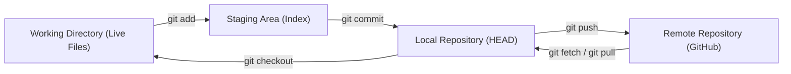
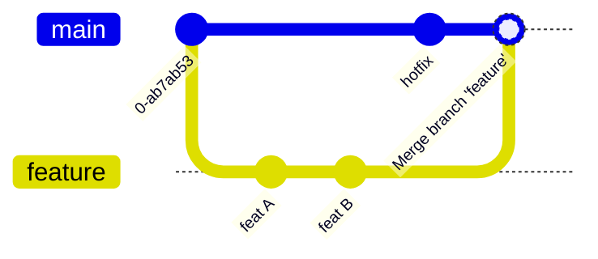
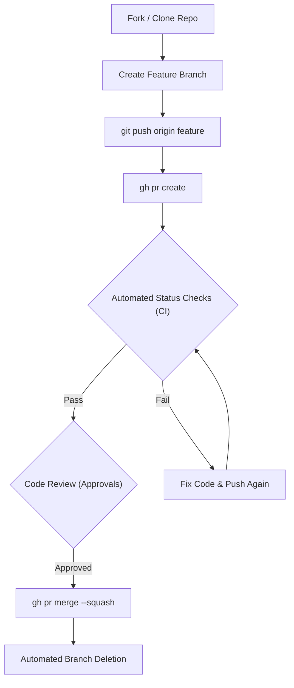
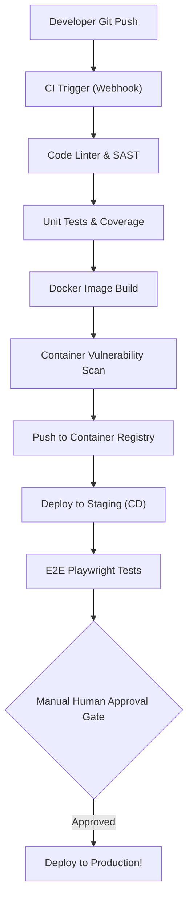
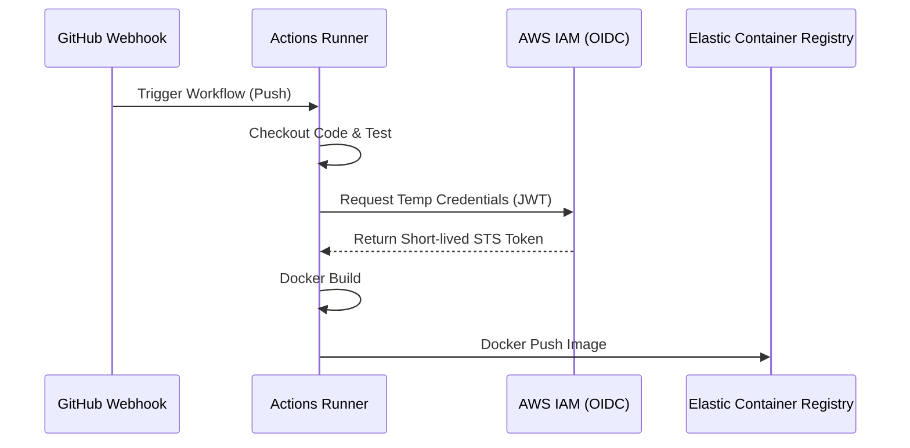
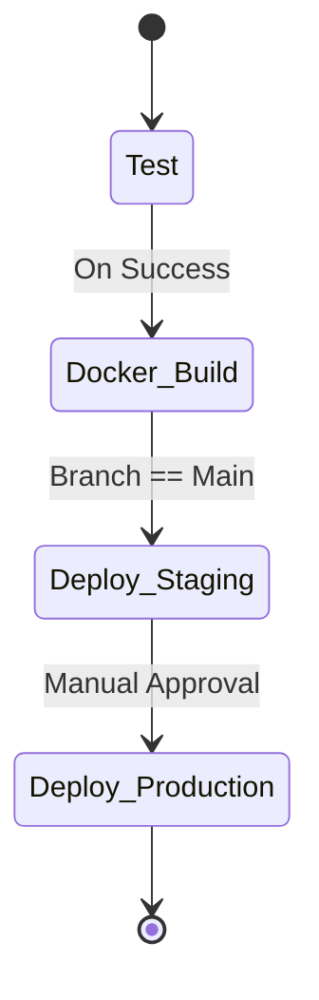
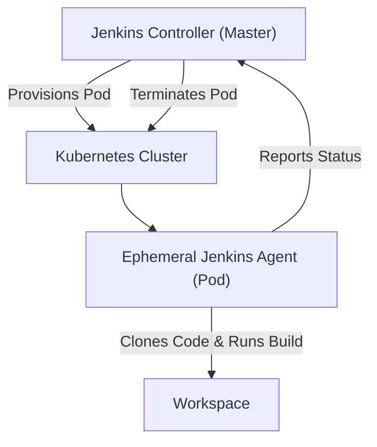

# 📘 Git & CI/CD Automation — Comprehensive Cheat Sheet

## 📑 Table of Contents

### Part I: Git Core Architecture & GitHub Mastery
1. [Git Distributed Version Control & Core Architecture](#1-git-distributed-version-control--core-architecture)
2. [Advanced Git Branching, Rebasing vs. Merging & Cherry-Picking](#2-advanced-git-branching-rebasing-vs-merging--cherry-picking)
3. [Emergency Recovery, Undo Mechanics & Git Hooks](#3-emergency-recovery-undo-mechanics--git-hooks)
4. [GitHub Enterprise Engineering & GitHub CLI (gh)](#4-github-enterprise-engineering--github-cli-gh)

### Part II: CI/CD Pipeline Automation (GitHub Actions, GitLab CI/CD, & Jenkins)
5. [CI/CD Core Concepts & Architectural Comparison Matrix](#5-cicd-core-concepts--architectural-comparison-matrix)
6. [GitHub Actions Mastery (Workflows, Jobs, Matrix Builds & Reusable Pipelines)](#6-github-actions-mastery-workflows-jobs-matrix-builds--reusable-pipelines)
7. [GitLab CI/CD Mastery (Stages, Artifacts, Caching, Rules & Auto-DevOps)](#7-gitlab-cicd-mastery-stages-artifacts-caching-rules--auto-devops)
8. [Jenkins Mastery (Declarative Pipeline vs Scripted DSL, Master-Agent & Shared Libraries)](#8-jenkins-mastery-declarative-pipeline-vs-scripted-dsl-master-agent--shared-libraries)
9. [CI/CD Security, Secret Management & GitOps Best Practices](#9-cicd-security-secret-management--gitops-best-practices)
10. [Quick Reference & Cheat Sheet Summary Tables](#10-quick-reference--cheat-sheet-summary-tables)

---

### Part I: Git Core Architecture & GitHub Mastery

## 1. Git Distributed Version Control & Core Architecture

**🌐 Intuitive Real-World Analogy:**
The Photography Studio.
- **Working Directory**: Posing models on set (your live, editable files).
- **Staging Index (`git add`)**: Arranging selected photos in the review album stage. You don't have to keep every shot.
- **Local Repository (`git commit`)**: Binding the hardcover catalog into the secure museum vault (a permanent immutable snapshot).
- **Remote Upstream (`git push`)**: Shipping copies to global branch galleries for the rest of the world to see!

**What is it?**
Git is a distributed version control system (DVCS). Unlike centralized systems (SVN), every Git clone is a full-fledged repository with complete history and full version-tracking capabilities. Git fundamentally models data as a stream of immutable snapshots (Directed Acyclic Graph of commits) rather than file differences.

**How it Works & Diagram:**



**📦 Essential CLI Commands Table:**

| Command | Signature & Flags | Description / Purpose |
|---------|-------------------|-----------------------|
| **Init** | `git init` | Initializes a new local Git repository in the current directory. |
| **Clone** | `git clone -b <branch> <url>` | Clones a repository and immediately checks out a specific branch. |
| **Add** | `git add -p` | Interactively stages hunks (partial file changes). Crucial for atomic commits. |
| **Commit** | `git commit -v -m "..."` | Commits staged changes. `-v` shows the diff in the editor to review what's being committed. |
| **Log** | `git log --graph --oneline --all` | Displays a visual ASCII graph of the entire repository's branch history. |
| **Status** | `git status -s` | Short-format status of working tree and index. |
| **Diff** | `git diff --staged` | Shows exactly what changes are staged for the next commit. |

**Production Workflow Example:**
```bash
#!/bin/bash
# Comprehensive Initialization & Upstream Setup

# 1. Initialize repository and define structure
mkdir production-microservice && cd production-microservice
git init
git branch -M main

# 2. Configure project-specific identity and signing
git config user.name "DevOps Architect"
git config user.email "architect@company.com"
git config commit.gpgsign true
git config user.signingkey "ABC12345DEF67890"

# 3. Create a production-grade .gitignore
cat <<EOF > .gitignore
# Environments and Secrets
.env
*.pem
.DS_Store
__pycache__/
node_modules/
EOF

# 4. Interactive staging (assuming we edited files)
# Using 'git add -p' allows you to say [y]es or [n]o to specific code blocks.
git add .gitignore
git commit -m "chore: Initialize repository with strict gitignore"

# 5. Link to upstream and push
git remote add origin git@github.com:company/production-microservice.git
git push -u origin main
```

**💡 Best Practice:** Write atomic commits! A single commit should represent a single logical change. If you fix a typo and implement a feature, those are two commits. Prefix commits with Conventional Commits (e.g., `feat:`, `fix:`, `chore:`).
**⚠️ Common Pitfalls:** Never commit `.env` files or AWS credentials. Once committed, they are in the history forever unless you rewrite history.
**🔧 DevOps Pro Tip:** Alias `git log --graph --oneline --all` to `git lg` in your `~/.gitconfig` to save keystrokes!

---

## 2. Advanced Git Branching, Rebasing vs. Merging & Cherry-Picking

**🌐 Intuitive Real-World Analogy:**
Railway Track Switches and Timeline Fusion.
- **Merge (`git merge`)**: Builds an overpass connecting two train tracks. It preserves exact chronological history and branching forks. Great for major features, but can clutter the timeline with merge commits.
- **Rebase (`git rebase`)**: Magically lifts your private train cars up and glues them straight behind the main express engine. Creates a single, clean, linear timeline without merge clutter!

**What is it?**
Git branches are just lightweight movable pointers to commits. Merging incorporates changes from one branch to another using a 3-way merge algorithm. Rebasing rewrites history by reapplying commits from your branch onto a new base commit. Cherry-picking applies the changes from an arbitrary commit onto your current branch.

**How it Works & Diagram:**



**📦 Essential CLI Commands Table:**

| Command | Signature & Flags | Description / Purpose |
|---------|-------------------|-----------------------|
| **Branch** | `git branch -m <old> <new>` | Renames a branch locally. |
| **Checkout** | `git checkout -b <branch>` | Creates a new branch and switches to it (legacy). |
| **Switch** | `git switch -c <branch>` | Creates a new branch and switches to it (modern). |
| **Merge** | `git merge --no-ff <branch>` | Forces a merge commit even if a fast-forward is possible. Preserves feature context. |
| **Rebase** | `git rebase -i HEAD~4` | Interactively rebases the last 4 commits. Allows squashing, rewording, or dropping commits. |
| **Cherry-Pick**| `git cherry-pick <sha>` | Copies a specific commit's changes and applies them to the current branch. |
| **Stash** | `git stash push -u -m "wip"` | Temporarily shelves changes (including untracked files). Retrieve with `git stash pop`. |

**Production Workflow Example:**
```bash
#!/bin/bash
# Resolving Merge Conflicts and Interactive Squashing

# 1. Update main and create feature branch
git switch main
git pull origin main
git switch -c feat/user-auth

# 2. Make some noisy commits while working
echo "code" > auth.py && git add auth.py && git commit -m "wip: auth"
echo "more code" >> auth.py && git commit -am "fix typo"
echo "final code" >> auth.py && git commit -am "finish auth"

# 3. Interactive Rebase to squash 3 commits into 1 clean commit before merging
# Opens editor: change 'pick' to 'squash' or 's' for the last two commits.
GIT_SEQUENCE_EDITOR="sed -i -e '2,3s/^pick/squash/'" git rebase -i HEAD~3

# Now rewrite the commit message to "feat: implement user authentication"
# (Simulated by resetting and committing for the script example)
git reset --soft HEAD~1
git commit -m "feat: implement user authentication"

# 4. Cherry-pick an emergency hotfix from another branch
git fetch origin
git cherry-pick 8f2c3b1a

# 5. Merge into main preserving feature topology
git switch main
git merge --no-ff feat/user-auth -m "Merge: User Auth Feature"
```

**💡 Best Practice:** Rebase your private feature branches against `main` frequently to resolve conflicts early. Never rebase a public branch that others rely on!
**⚠️ Common Pitfalls:** Force-pushing (`git push -f`) a rebased branch when teammates have already pulled the old history will cause massive reconciliation headaches. Use `git push --force-with-lease` instead!
**🔧 DevOps Pro Tip:** Configure `git config --global pull.rebase true` to make `git pull` rebase by default instead of creating noisy merge commits.

---

## 3. Emergency Recovery, Undo Mechanics & Git Hooks

**🌐 Intuitive Real-World Analogy:**
Time Travel Emergency Levers.
- `git revert`: Publishes an official public correction notice that balances out an errant transaction without ripping pages out of the bank ledger (safe for shared remote branches!).
- `git reset --hard`: Feeds the bank ledger through an industrial shredder back to an earlier timestamp (catastrophic on remote branches!).

**What is it?**
Git tracks almost everything you do. Even when you "delete" a commit via reset, the object remains in the database until garbage collection. Git Hooks are shell scripts invoked by Git before or after events like commit, push, and receive.

**How it Works & Diagram:**

| Command | Modifies History? | Modifies Staging? | Modifies Working Dir? | Safety for Remotes |
|---------|-------------------|-------------------|-----------------------|--------------------|
| `git reset --soft` | Yes (moves HEAD) | No | No | ❌ DANGEROUS |
| `git reset --mixed`| Yes (moves HEAD) | Yes | No | ❌ DANGEROUS |
| `git reset --hard` | Yes (moves HEAD) | Yes | Yes | ❌ DANGEROUS |
| `git revert` | No (adds new commit)| Yes | Yes | ✅ SAFE |

**📦 Essential CLI Commands Table:**

| Command | Signature & Flags | Description / Purpose |
|---------|-------------------|-----------------------|
| **Revert** | `git revert <sha>` | Safely un-does a commit by creating an inverse commit. |
| **Reset** | `git reset --hard HEAD~1` | Destructively throws away the last commit and all uncommitted changes. |
| **Reflog** | `git reflog` | Chronological log of where your HEAD pointer has been. Ultimate safety net! |
| **Clean** | `git clean -fd` | Removes untracked files and directories from the working tree. |
| **Bisect** | `git bisect start` | Initiates binary search to find the exact commit that introduced a bug. |

**Production Workflow Example:**
```bash
#!/bin/bash
# 1. Recovering a deleted branch using reflog
# Accidentally deleted feature branch!
git branch -D important-feature

# Find the SHA where the branch was last checked out or committed to
git reflog | head -n 10
# Example output: "abc123f HEAD@{2}: commit: feat: crucial logic"

# Resurrect it!
git branch recovered-feature abc123f

# 2. Writing a pre-commit hook to prevent AWS secret leaks
cat << 'EOF' > .git/hooks/pre-commit
#!/bin/bash
# Pre-commit hook to block AWS keys
FORBIDDEN="AKIA[0-9A-Z]{16}"
if git diff --cached | grep -qE "$FORBIDDEN"; then
    echo "❌ ERROR: AWS Access Key detected in staged files!"
    echo "Please remove secrets before committing."
    exit 1
fi
exit 0
EOF
chmod +x .git/hooks/pre-commit
```

**💡 Best Practice:** Always use `git revert` to fix mistakes on the `main` branch. Use `git reset` only for your local, unpublished feature branches.
**⚠️ Common Pitfalls:** Assuming a hard reset permanently deletes data. As long as you haven't run `git gc`, the `reflog` can save you.
**🔧 DevOps Pro Tip:** Use `git bisect run <script>` to fully automate hunting down regressions. If the script exits 0, the commit is good; if 1, it's bad. Git will automatically find the culprit commit in log(N) steps!

---

## 4. GitHub Enterprise Engineering & GitHub CLI (`gh`)

**🌐 Intuitive Real-World Analogy:**
Architectural Peer Review & Voting Chamber.
Nobody modifies master blueprints directly (Protected Branches). Engineers submit blueprint modification proposals via Pull Requests (PRs), requiring automated robotic linter verification and two architect sign-offs before merging!

**What is it?**
GitHub provides a collaborative layer over Git. It introduces Protected Branches (preventing force pushes/deletions), Pull Requests for code review, and Issue tracking. The GitHub CLI (`gh`) brings this entire ecosystem into the terminal.

**How it Works & Diagram:**



**📦 Essential CLI & API Signatures Table:**

| Command | Signature & Flags | Description / Purpose |
|---------|-------------------|-----------------------|
| **Auth** | `gh auth login` | Authenticate the CLI with GitHub using web or token. |
| **PR Create** | `gh pr create --title "..." --body "..."` | Creates a pull request from current branch. |
| **PR Review** | `gh pr review --approve` | Approves the current pull request. |
| **PR Merge** | `gh pr merge --squash --delete-branch` | Squashes commits and merges the PR, cleaning up. |
| **Run View** | `gh run view --web` | Opens the current CI/CD action run in the browser. |
| **Secret** | `gh secret set MY_SECRET -b "value"` | Creates/updates a GitHub Actions repository secret. |

**Production Workflow Example:**
```bash
#!/bin/bash
# End-to-End Bug Fix via GitHub CLI

# 1. View issues and checkout a branch for the issue
gh issue list --label "bug"
# Check out a branch specifically for Issue #42
gh issue develop 42 --name "fix/memory-leak" --checkout

# 2. Fix bug and commit
sed -i 's/leak/fixed/g' app.py
git commit -am "fix: resolve memory leak in connection pool"
git push -u origin fix/memory-leak

# 3. Create the Pull Request entirely from CLI
gh pr create --title "Fix memory leak in conn pool" \
             --body "Closes #42. Ensures connections are closed." \
             --assignee "@me" \
             --label "bug,production"

# 4. Monitor CI checks
echo "Waiting for CI..."
gh pr checks --watch

# 5. Merge once approved and checks pass
gh pr merge --squash --delete-branch
```

**💡 Best Practice:** Enable branch protection rules on `main`: require linear history, require passing status checks, and require at least 1 approval.
**⚠️ Common Pitfalls:** Merging PRs with 100+ file changes. Keep PRs small and scoped to a single concern to ensure quality code reviews.
**🔧 DevOps Pro Tip:** Use `gh repo edit --enable-auto-merge` and `gh pr merge --auto` to automatically merge a PR the exact second that CI passes and approvals are met!

---

### Part II: CI/CD Pipeline Automation (GitHub Actions, GitLab CI/CD, & Jenkins)

## 5. CI/CD Core Concepts & Architectural Comparison Matrix

**🌐 Intuitive Real-World Analogy:**
Automated Auto Assembly Factory vs Handcrafted Craftsmanship.
- **Continuous Integration (CI)**: The robotic quality inspection line that instantly x-rays and stress-tests every single screw added to an engine (automated linting/tests on PR).
- **Continuous Delivery (CD)**: Packs the tested car onto an automated loading dock waiting for human deployment authorization.
- **Continuous Deployment**: Automatically presses the button to ship the vehicle directly to the consumer's driveway!

**What is it?**
CI/CD automates the software lifecycle. It removes manual human error from building, testing, securing, and deploying applications.

**How it Works & Diagram:**



**An Exhaustive Comparison Table:**

| Feature | GitHub Actions | GitLab CI/CD | Jenkins |
|---------|----------------|--------------|---------|
| **Architecture** | SaaS Serverless Runners / Self-Hosted | Git-native Runners / Kubernetes | JVM Master-Agent (Controller/Node) |
| **Pipeline Definition**| YAML in `.github/workflows/` | YAML in `.gitlab-ci.yml` | Groovy DSL in `Jenkinsfile` |
| **Ecosystem** | Marketplace Actions (Plug & Play) | Built-in Auto-DevOps, tight GitLab integration | Massive Plugin Ecosystem (Legacy & Modern) |
| **Execution Flow** | Event-driven Workflows -> Jobs -> Steps | Directed Acyclic Graph (DAG) / Stages | Scripted or Declarative Stages |
| **State & Caching** | `actions/cache` | Native `cache:` keyword | External plugins or node-local cache |
| **Best For** | Open Source, GitHub-centric organizations | End-to-end integrated Enterprise DevOps | Complex, legacy, or highly customized pipelines |

---

## 6. GitHub Actions Mastery (Workflows, Jobs, Matrix Builds & Reusable Pipelines)

**🌐 Intuitive Real-World Analogy:**
Robotic Cloud Workers attached directly to your GitHub repository rooms. When alarms ring (`push`, `schedule`), ephemeral robotic agents wake up, execute tasks, and immediately terminate, leaving a clean room behind!

**How it Works & Diagram:**



**📦 Essential Actions Syntax & Variables Table:**

| Keyword / Variable | Description / Purpose |
|--------------------|-----------------------|
| `on: [push, pull_request]` | Defines the event triggers for the workflow. |
| `concurrency:` | Cancels in-progress runs for the same branch to save runner minutes. |
| `matrix:` | Runs a job multiple times with different variable combinations (e.g., Node versions). |
| `needs:` | Defines job dependencies (Job B waits for Job A to complete). |
| `github.workspace` | The default working directory for the runner. |
| `secrets.GITHUB_TOKEN` | Automatically generated token for API interactions during the run. |

**Production Working Example:**
`.github/workflows/production_ci_cd.yml`
```yaml
name: Production CI/CD Pipeline

on:
  push:
    branches: [ "main" ]
  pull_request:
    branches: [ "main" ]
  schedule:
    - cron: '0 2 * * *' # Nightly build

# Cancel redundant in-progress runs to save money
concurrency:
  group: ${{ github.workflow }}-${{ github.ref }}
  cancel-in-progress: true

permissions:
  id-token: write # Required for OIDC AWS federation
  contents: read
  packages: write # Required for GHCR

jobs:
  test:
    name: Unit Tests & Linting
    runs-on: ubuntu-latest
    strategy:
      matrix:
        python-version: ["3.11", "3.12"]
    
    steps:
      - name: Checkout Code
        uses: actions/checkout@v4
        
      - name: Set up Python ${{ matrix.python-version }}
        uses: actions/setup-python@v5
        with:
          python-version: ${{ matrix.python-version }}
          cache: 'pip'
          
      - name: Install dependencies
        run: |
          python -m pip install --upgrade pip
          pip install -r requirements.txt pytest flake8
          
      - name: Lint code
        run: flake8 .
        
      - name: Run tests
        run: pytest tests/

  build-push:
    name: Build & Push Container
    needs: test
    runs-on: ubuntu-latest
    if: github.ref == 'refs/heads/main'
    
    steps:
      - uses: actions/checkout@v4
      
      # OIDC AWS Federation - NO STATIC CREDENTIALS!
      - name: Configure AWS Credentials
        uses: aws-actions/configure-aws-credentials@v4
        with:
          role-to-assume: arn:aws:iam::123456789012:role/GitHubActionsRole
          aws-region: us-east-1
          
      - name: Log in to GitHub Container Registry
        uses: docker/login-action@v3
        with:
          registry: ghcr.io
          username: ${{ github.actor }}
          password: ${{ secrets.GITHUB_TOKEN }}
          
      - name: Build and push Docker image
        uses: docker/build-push-action@v5
        with:
          context: .
          push: true
          tags: ghcr.io/${{ github.repository }}/app:${{ github.sha }}
          cache-from: type=gha
          cache-to: type=gha,mode=max
```

**💡 Best Practice:** Pin third-party actions to their specific Git commit SHA instead of `@v2` tags to prevent supply chain attacks if the maintainer's repository is compromised.
**⚠️ Common Pitfalls:** Storing long-lived cloud credentials in GitHub Secrets. Always use OpenID Connect (OIDC) to federate identity securely!
**🔧 DevOps Pro Tip:** Use `cache-from` and `cache-to` with `type=gha` in Docker build actions. It leverages the GitHub Actions native cache to dramatically speed up Docker image builds!

---

## 7. GitLab CI/CD Mastery (Stages, Artifacts, Caching, Rules & Auto-DevOps)

**🌐 Intuitive Real-World Analogy:**
An Interconnected Railway Cargo Transit Network.
Gated security checkpoints evaluate branch rules before letting the train advance. Baggage forwarding ensures job artifacts (compiled binaries) and caches (npm modules) are reliably transferred between independent pipeline stages!

**How it Works & Diagram:**



**📦 Essential GitLab CI Keywords Table:**

| Keyword | Description / Purpose |
|---------|-----------------------|
| `stages:` | Defines the strict sequential order of job execution. |
| `image:` | The Docker image used to spin up the runner environment. |
| `services:` | Additional containers to run alongside the job (e.g., database, docker-in-docker). |
| `cache:` | Persists dependencies between pipeline runs to speed up execution. |
| `artifacts:` | Files/directories created by a job, passed to subsequent stages. |
| `rules:` | Complex conditional logic (if/when) to determine if a job should run. |

**Production Working Example:**
`.gitlab-ci.yml`
```yaml
stages:
  - test
  - docker_build
  - deploy_staging
  - deploy_prod

# Global default image and cache
default:
  image: python:3.11-slim
  cache:
    key: $CI_COMMIT_REF_SLUG
    paths:
      - .cache/pip

variables:
  PIP_CACHE_DIR: "$CI_PROJECT_DIR/.cache/pip"
  DOCKER_IMAGE: $CI_REGISTRY_IMAGE:$CI_COMMIT_SHA

unit_tests:
  stage: test
  script:
    - pip install -r requirements.txt pytest
    - pytest --junitxml=report.xml
  artifacts:
    when: always
    reports:
      junit: report.xml

build_image:
  stage: docker_build
  image: docker:24.0.5
  services:
    - docker:24.0.5-dind
  variables:
    DOCKER_TLS_CERTDIR: "/certs"
  before_script:
    - docker login -u $CI_REGISTRY_USER -p $CI_REGISTRY_PASSWORD $CI_REGISTRY
  script:
    - docker build -t $DOCKER_IMAGE .
    - docker push $DOCKER_IMAGE
  rules:
    - if: $CI_COMMIT_BRANCH == "main"

deploy_to_staging:
  stage: deploy_staging
  image: alpine/k8s:1.28
  script:
    - kubectl config use-context my-group/my-agent:staging-agent
    - kubectl set image deployment/api app=$DOCKER_IMAGE -n staging
  environment:
    name: staging
    url: https://staging.example.com
  rules:
    - if: $CI_COMMIT_BRANCH == "main"

deploy_to_prod:
  stage: deploy_prod
  image: alpine/k8s:1.28
  script:
    - kubectl config use-context my-group/my-agent:prod-agent
    - kubectl set image deployment/api app=$DOCKER_IMAGE -n production
  environment:
    name: production
    url: https://api.example.com
  rules:
    - if: $CI_COMMIT_BRANCH == "main"
      when: manual # Requires explicit human click!
```

**💡 Best Practice:** Utilize `$CI_COMMIT_SHA` to uniquely tag every Docker image. Use `$CI_REGISTRY` to securely utilize GitLab's built-in container registry without managing credentials.
**⚠️ Common Pitfalls:** Confusing `cache` with `artifacts`. Use `cache` for internet-downloaded dependencies (node_modules, pip cache) and `artifacts` for internally compiled code passed to later stages (binaries, test reports).
**🔧 DevOps Pro Tip:** Integrate GitLab's `artifacts:reports:junit` to get native UI test result visualizers and failure tracking directly in the Merge Request view.

---

## 8. Jenkins Mastery (Declarative Pipeline vs Scripted DSL, Master-Agent & Shared Libraries)

**🌐 Intuitive Real-World Analogy:**
An Experienced General Contractor.
The Jenkins Controller (Master) sits at headquarters managing blueprints and scheduling. It hires ephemeral subcontractor worker crews (Kubernetes Ephemeral Pod Agents) to execute the heavy physical digging and lifting on demand!

**How it Works & Diagram:**



**📦 Essential Jenkinsfile Directives Table:**

| Directive | Description / Purpose |
|-----------|-----------------------|
| `pipeline { }` | The root element of a Declarative Pipeline. |
| `agent { kubernetes { ... } }` | Defines where the pipeline runs (allocates ephemeral containers). |
| `options { ... }` | Configures pipeline-level settings (timeouts, log rotation). |
| `parallel { }` | Executes nested stages simultaneously (e.g., concurrent testing). |
| `input` | Pauses pipeline execution and waits for human approval. |
| `post { always { cleanWs() } }` | Executes steps based on the pipeline's final status. |

**Production Working Example:**
`Jenkinsfile` (Declarative, Kubernetes Agent)
```groovy
pipeline {
    agent {
        kubernetes {
            yaml '''
            apiVersion: v1
            kind: Pod
            spec:
              containers:
              - name: maven
                image: maven:3.8.6-eclipse-temurin-17
                command: ['cat']
                tty: true
              - name: docker
                image: docker:20.10.16-dind
                securityContext:
                  privileged: true
            '''
        }
    }
    
    options {
        buildDiscarder(logRotator(numToKeepStr: '20'))
        timeout(time: 30, unit: 'MINUTES')
        timestamps()
        disableConcurrentBuilds()
    }
    
    environment {
        DOCKER_CREDS = credentials('docker-hub-credentials')
        APP_VERSION = "1.0.${BUILD_NUMBER}"
    }
    
    stages {
        stage('Parallel Code Checks') {
            parallel {
                stage('Unit Tests') {
                    steps {
                        container('maven') {
                            sh 'mvn clean test'
                        }
                    }
                }
                stage('SonarQube Static Analysis') {
                    steps {
                        container('maven') {
                            withSonarQubeEnv('SonarQube Server') {
                                sh 'mvn sonar:sonar'
                            }
                        }
                    }
                }
            }
        }
        
        stage('Quality Gate') {
            steps {
                timeout(time: 1, unit: 'HOURS') {
                    // Pauses pipeline until SonarQube webhook responds
                    waitForQualityGate abortPipeline: true
                }
            }
        }
        
        stage('Build & Push Container') {
            steps {
                container('docker') {
                    sh 'docker build -t myorg/app:${APP_VERSION} .'
                    sh 'echo $DOCKER_CREDS_PSW | docker login -u $DOCKER_CREDS_USR --password-stdin'
                    sh 'docker push myorg/app:${APP_VERSION}'
                }
            }
        }
        
        stage('Approval Gate') {
            steps {
                input message: 'Approve production deployment?', submitter: 'admin-group'
            }
        }
        
        stage('Deploy') {
            steps {
                echo "Deploying to production..."
                // Deployment logic here
            }
        }
    }
    
    post {
        always {
            cleanWs() // Important: clear workspace to prevent disk bloat
        }
        failure {
            slackSend channel: '#alerts', message: "🚨 Build failed: ${env.JOB_NAME} [${env.BUILD_NUMBER}]"
        }
    }
}
```

**💡 Best Practice:** Always use Declarative Pipelines (`pipeline { }`) over Scripted Pipelines (`node { }`) for strict structure and validation. Abstract complex logic into Jenkins Shared Libraries!
**⚠️ Common Pitfalls:** Running builds directly on the Master node (built-in node). This causes severe performance degradation and security risks. Always use Agents.
**🔧 DevOps Pro Tip:** Utilize the `buildDiscarder(logRotator(...))` option in every pipeline to prevent Jenkins disks from filling up with ancient build logs and artifacts.

---

## 9. CI/CD Security, Secret Management & GitOps Best Practices

**🌐 Intuitive Real-World Analogy:**
Armored Transport Security.
Never print combination lock numbers directly on outer shipping cartons (hardcoded cloud credentials). Instead, issue short-lived biometric escort IDs (OIDC / Vault federation) and apply holographic tamper-proof digital seals to every shipment (Cosign container signing).

**What is it?**
Modern CI/CD pipelines are prime targets for supply chain attacks. Hardening pipelines involves OIDC identity federation, producing a Software Bill of Materials (SBOM) for compliance, and cryptographically signing software artifacts. GitOps (e.g., ArgoCD) pulls configuration from Git rather than CI pushing configurations to clusters.

**Production Code Suite:**
*Practical terminal implementation of supply chain security inside a CI pipeline:*

```bash
#!/bin/bash
# Securing the CI/CD Pipeline Artifacts

IMAGE="ghcr.io/myorg/myapp:abc1234"

# 1. Generate a Software Bill of Materials (SBOM) using Syft
# This documents every open-source library used inside the container
curl -sSfL https://raw.githubusercontent.com/anchore/syft/main/install.sh | sh -s -- -b /usr/local/bin
syft $IMAGE -o cyclonedx-json > sbom.json

# 2. Cryptographically Sign the Container using Sigstore Cosign (Keyless via OIDC)
# Proves the container was built by the authorized CI system
cosign sign --yes $IMAGE

# 3. Attest the SBOM to the image registry
cosign attest --yes --predicate sbom.json --type cyclonedx $IMAGE
```

**💡 Best Practice:** Adopt GitOps. Your CI pipeline should build the image and update a manifest in a Git repository. A tool inside the cluster (ArgoCD/Flux) constantly pulls and syncs that manifest. This prevents your CI server from needing production cluster credentials!
**⚠️ Common Pitfalls:** Leaking secrets in build logs. Always use secret management tools (HashiCorp Vault, AWS Secrets Manager) or native CI secret masking features.

---

## 10. Quick Reference & Cheat Sheet Summary Tables

**Table 1: Git Core vs Advanced CLI Reference**

| Category | Command | Use Case |
|----------|---------|----------|
| Syncing | `git pull --rebase` | Fetch and rebase local commits on top of remote. |
| Auditing | `git log -S "password"` | Search the entire commit history for specific text. |
| Modifying | `git commit --amend -m "..."`| Add forgotten files or rewrite the very last commit message. |
| Archiving| `git archive -o latest.zip HEAD`| Export the repository into a zip file without `.git` history. |

**Table 2: CI/CD Syntax & Environment Variable Equivalent Dictionary**

| Concept | GitHub Actions | GitLab CI/CD | Jenkins |
|---------|----------------|--------------|---------|
| Workspace Path | `github.workspace` | `$CI_PROJECT_DIR` | `env.WORKSPACE` |
| Branch Name | `github.ref_name` | `$CI_COMMIT_BRANCH` | `env.BRANCH_NAME` |
| Commit Hash | `github.sha` | `$CI_COMMIT_SHA` | `env.GIT_COMMIT` |
| Build ID | `github.run_id` | `$CI_PIPELINE_ID` | `env.BUILD_NUMBER` |
| Job Config File| `.github/workflows/*.yml` | `.gitlab-ci.yml` | `Jenkinsfile` |

**Table 3: Common CI/CD Troubleshooting & Diagnostic Resolutions**

| Symptom / Issue | Probable Cause | Resolution |
|-----------------|----------------|------------|
| Detached HEAD state in CI | CI tools check out specific commit SHAs, not branch names. | Create a local branch if you must commit back: `git checkout -b temp`. |
| Jenkins workspace locked | Previous build crashed or didn't release file locks. | Manually wipe workspace, or ensure `cleanWs()` runs in `post { always }`. |
| OIDC Trust Failure (403) | Misconfigured Audience (aud) or Issuer URL in IAM Role. | Verify the GitHub Actions ID provider thumbprint and conditions in AWS IAM. |
| SSH Runner Permission Denied | Private key format incorrect or incorrect file permissions. | Ensure key ends with a newline, use `chmod 600 key.pem`, and verify SSH agent. |

> **Final Note**: The true mastery of DevOps lies not in memorizing every flag, but in understanding the architectural flow of code from a local laptop to global production infrastructure. Standardize your pipelines, automate your security, and keep your Git history clean!
</📘 Git & CI/CD Automation — Comprehensive Cheat Sheet>
