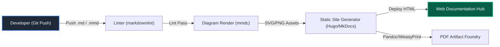
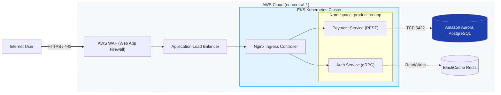
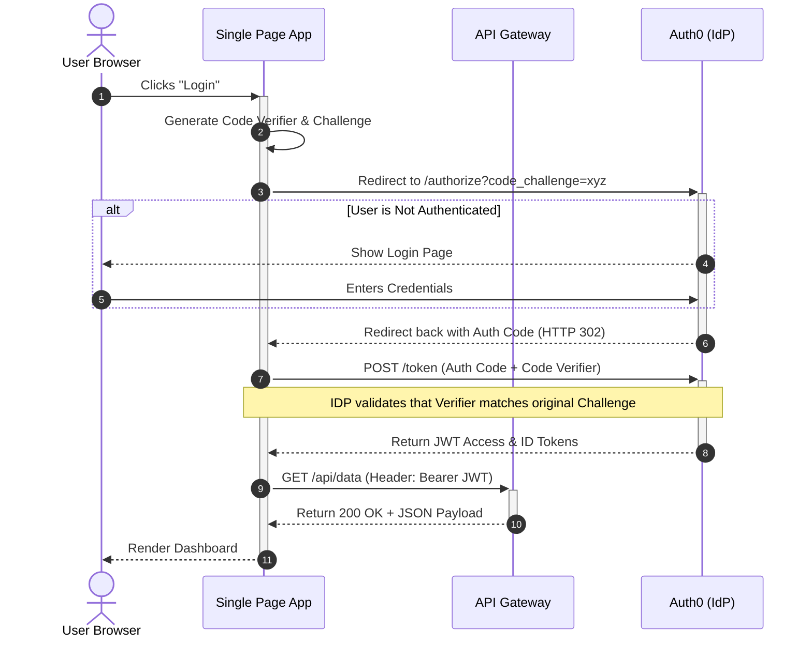
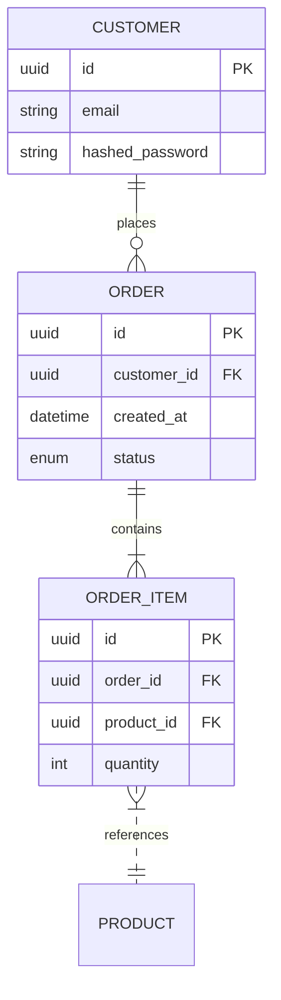
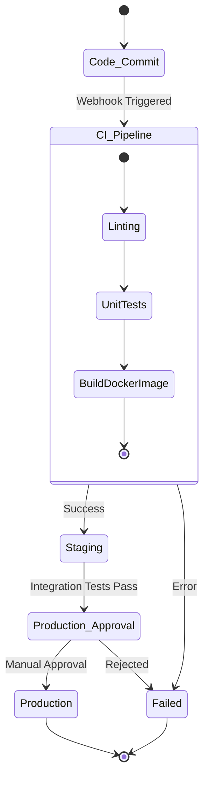
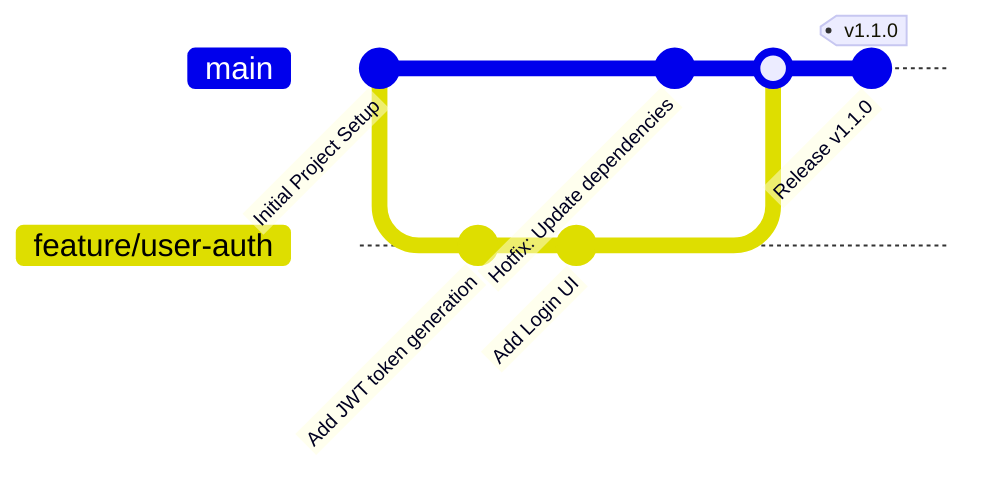
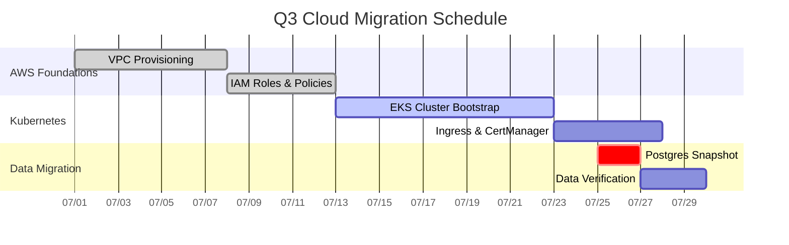
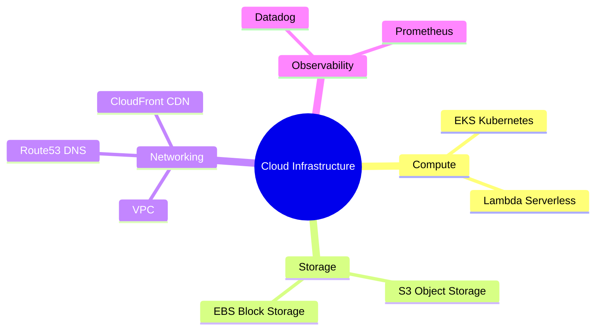

# 📘 Technical Documentation, Markdown & Mermaid — Comprehensive Cheat Sheet
> **Author**: AI-Generated for DevOps & Cloud Engineers
> **Last Updated**: 2026-08-05
> **Pages**: ~50+ pages (Equivalent Depth & Coverage) | **Sections**: 8 | **Examples**: Comprehensive Production Snippets

## 📑 Table of Contents
1. [The Engineering Documentation-As-Code Philosophy](#1-the-engineering-documentation-as-code-philosophy)
2. [Markdown & GitHub Flavored Markdown (GFM) Mastery](#2-markdown--github-flavored-markdown-gfm-mastery)
3. [Obsidian & VS Code Engineering Workflows (PDF Exporting & Auto-Scale Styling)](#3-obsidian--vs-code-engineering-workflows-pdf-exporting--auto-scale-styling)
4. [Mermaid Diagramming Masterclass I — Flowcharts & Architecture Graphs](#4-mermaid-diagramming-masterclass-i--flowcharts--architecture-graphs)
5. [Mermaid Diagramming Masterclass II — Sequence Diagrams (REST APIs & Auth Sagas)](#5-mermaid-diagramming-masterclass-ii--sequence-diagrams-rest-apis--auth-sagas)
6. [Mermaid Diagramming Masterclass III — Class, State, & ER Database Diagrams](#6-mermaid-diagramming-masterclass-iii--class-state--er-database-diagrams)
7. [Mermaid Diagramming Masterclass IV — Git Graphs, Gantt Charts & Mindmaps](#7-mermaid-diagramming-masterclass-iv--git-graphs-gantt-charts--mindmaps)
8. [Documentation CLI Tooling, Automated Linter & Rendering Reference](#8-documentation-cli-tooling-automated-linter--rendering-reference)

---

## 1. The Engineering Documentation-As-Code Philosophy

**🌐 Intuitive Real-World Analogy**
The Architect's Construction Blueprint vs. The Marketing Brochure. Engineering documentation is an undeniable technical truth source—it must be version-controlled in Git alongside source code, written in universal plain-text languages (Markdown/Mermaid), reviewed via pull requests, and transformed dynamically into interactive portals or printed paper manuals!

**What is it? (What & Why)**
Documentation-as-Code (Docs-as-Code) is the philosophy that writing documentation should leverage the exact same tools and pipelines as writing software. Word documents and PDFs are binary blobs that cannot be properly diffed, merged, or verified. By writing in Markdown and Mermaid, engineers can manage documentation state natively in Git, apply linting rules, and automatically publish to web portals using Static Site Generators (SSGs) in CI/CD pipelines.

**Workflow & Production Working Example**
Here is how a standard Docs-as-Code Continuous Integration pipeline flows:



**💡 Best Practice**
Keep documentation adjacent to the code it describes. Use `/docs` directories at the root of your repositories. Write READMEs that answer *What*, *Why*, and *How to run it locally*.

**⚠️ Common Pitfalls**
Drift between code and documentation. Avoid manual architecture diagrams drawn in drag-and-drop tools like Visio or Draw.io; they will immediately go out of date and no one will know how to update them.

**🔧 DevOps Pro Tip**
Integrate `markdown-link-check` into your GitHub Actions or GitLab CI. If a PR breaks a documentation link, fail the build to enforce documentation integrity.

---

## 2. Markdown & GitHub Flavored Markdown (GFM) Mastery

**🌐 Intuitive Real-World Analogy**
Universal Typewriter Stenography Shorthand. Using common keyboard punctuation characters (`#`, `*`, `|`, `[`, `>`) to cleanly declare structural headings, font weights, hyperlinks, and grid layouts without needing complex binary word processing files!

**What is it? (What & Why)**
Markdown is a lightweight markup language with plain-text formatting syntax. GitHub Flavored Markdown (GFM) extends standard Markdown to include highly functional engineering features like task lists, tables, strikethrough, auto-linked references, and callout alerts.

**Syntax & How to Write It (Beginner to Advanced)**
*   **Typography**: Headings (`#` to `######`), emphasis (`*bold*`, `_italic_`, `~~strikethrough~~`), blockquotes (`>`), horizontal separators (`---`), code spans (`` `code` ``).
*   **Advanced Tables**: Alignment syntax (`| :--- | :---: | ---: |`), injecting multi-line content inside table cells using `<br>` tags.
*   **GitHub Flavored Callout Alerts**:
    *   `> [!NOTE]` (Blue info)
    *   `> [!TIP]` (Green hint)
    *   `> [!IMPORTANT]` (Purple required reading)
    *   `> [!WARNING]` (Yellow caution)
    *   `> [!CAUTION]` (Red danger)
*   **Collapsible UI Blocks**: Using HTML details for long stack traces.
*   **LaTeX Mathematics**: Inline Math (`$E = mc^2$`) and Block Equation Math (`$$\sum_{i=0}^n T(n) = O(N \log N)$$`).

**Production Working Example**
An Architecture Decision Record (ADR) template showcasing GFM:

```markdown
# ADR 042: Migrate Stateful Sessions to Redis Elasticache

> [!IMPORTANT]
> This decision applies to all Kubernetes microservices operating in the `us-east-1` cluster.

## Context
Current in-memory session state is breaking under high horizontal pod scaling.

| Strategy | Latency | Horizontal Scaling | Cost Profile |
| :--- | :---: | ---: |
| Sticky Sessions | <1ms | Poor | Low |
| **Redis Elasticache** | **~2ms** | **Excellent** | **Medium** |

<details>
<summary>Click to view previous outage stack trace</summary>

```java
Exception in thread "main" java.lang.IllegalStateException: Session ID 49A3B not found.
    at com.auth.SessionManager.validate(SessionManager.java:42)
```
</details>

## Implementation Checklist
- [x] Provision Redis cluster via Terraform
- [ ] Update `auth-service` Helm charts
- [ ] Migrate traffic via Canary deployment
```

**💡 Best Practice**
Limit line length to 80-100 characters using semantic line breaks (one sentence per line). This makes Git diffs incredibly readable.

**⚠️ Common Pitfalls**
Inconsistent heading levels. Do not jump from `##` to `####`. It breaks Table of Contents generation and accessibility screen readers.

**🔧 DevOps Pro Tip**
Use `.markdownlint.json` to strictly enforce spacing around headings, lists, and tables across your entire engineering organization.

---

## 3. Obsidian & VS Code Engineering Workflows (PDF Exporting & Auto-Scale Styling)

**🌐 Intuitive Real-World Analogy**
The Personal Digital Exocortex & Printing Foundry. Using a local filesystem directory of markdown notes as an interconnected second brain, empowered with custom browser rendering engines!

**What is it? (What & Why)**
Obsidian and VS Code treat your local folder of Markdown files as a knowledge base. However, when exporting these to PDF to distribute to enterprise stakeholders, default engines often crop wide Mermaid diagrams or tables because standard A4/Letter paper is portrait-oriented, whereas screens scroll infinitely horizontally.

**Syntax & Code Solutions**
To force unclipped vector scaling on paper, you must override the rendering engine's CSS for the `@media print` query. 

In Obsidian, add this to `.obsidian/snippets/print-fix.css`:

```css
@media print {
    /* Force diagrams to fit within the page width */
    .mermaid, 
    .mermaid svg {
        max-width: 100% !important;
        height: auto !important;
        page-break-inside: avoid !important;
        overflow: visible !important;
    }

    /* Prevent tables from bleeding off the page */
    table {
        width: 100% !important;
        max-width: 100% !important;
        word-break: break-word !important;
        page-break-inside: avoid !important;
    }

    /* Keep code blocks together */
    pre, code {
        page-break-inside: avoid !important;
        white-space: pre-wrap !important;
    }
}
```

**Workflow & Production Working Example**
1.  **VS Code**: Install the *Markdown Preview Enhanced* extension. Use the `Puppeteer (PDF)` export option and inject the above CSS snippet into your customized `style.less` file.
2.  **Obsidian**: Install the *Better Export PDF* community plugin. It natively supports injecting headers/footers and compiling Markdown heading trees into clickable PDF bookmarks.

**💡 Best Practice**
Always use relative links (e.g., `[Setup Guide](./setup.md)`) instead of absolute filesystem links so your documentation remains portable across machines and platforms.

**⚠️ Common Pitfalls**
Forgetting to enable background graphics in your browser/PDF engine print settings. Without it, your syntax highlighting and callout alert background colors will disappear!

**🔧 DevOps Pro Tip**
Automate this. You can run Pandoc locally or in CI with a custom LaTeX template to convert your `.md` files to beautifully typeset enterprise PDFs with zero manual CSS tuning.

---

## 4. Mermaid Diagramming Masterclass I — Flowcharts & Architecture Graphs

**🌐 Intuitive Real-World Analogy**
Plumbing Topography and Highway Traffic Mapping. Visualizing decision branch points and network data packet routing paths from inlet servers to backend storage vaults!

**What is it? (What & Why)**
Mermaid Flowcharts (`graph` / `flowchart`) are directed graphs perfect for system architectures, decision trees, and network layouts. They use nodes and connecting edges, calculating optimal layouts automatically.

**Syntax & How to Write It (Beginner to Advanced)**
*   **Directions**: `graph TD` (Top-Down), `graph LR` (Left-Right).
*   **Nodes**: `[Square]`, `(Round)`, `{Decision}`, `[(Database)]`, `[[Subroutine]]`, `((Circle))`.
*   **Edges**: `-->` (Arrow), `-.->` (Dotted arrow), `==>` (Thick arrow), `-- "Text" -->` (Labeled arrow).
*   **Clustering**: `subgraph Name ... end`.
*   **⚠️ GOLDEN SYNTAX RULE**: Node labels containing parentheses, brackets, or special symbols MUST always be enclosed in double quotation marks!
    *   *Correct*: `id1["API Gateway (Port 443)"]`
    *   *Incorrect (Will Break)*: `id1[API Gateway (Port 443)]`

**Production Working Example**
An AWS Zero-Trust Cloud Kubernetes Architecture:



**💡 Best Practice**
Use `flowchart` instead of `graph` for newer Mermaid rendering engines. `flowchart` supports more advanced routing algorithms and better edge crossings.

**⚠️ Common Pitfalls**
Overcrowding a single diagram. If a graph has more than 15-20 nodes, break it down into a high-level context diagram and multiple low-level component diagrams (C4 Model methodology).

**🔧 DevOps Pro Tip**
Apply universal branding. You can declare `classDef` at the top of your markdown files to standardize node colors to your company's palette across all diagrams.

---

## 5. Mermaid Diagramming Masterclass II — Sequence Diagrams (REST APIs & Auth Sagas)

**🌐 Intuitive Real-World Analogy**
A Theater Script and Chronological Dialogue Timeline. Tracing step-by-step conversational messages back and forth across independent actors over time!

**What is it? (What & Why)**
Sequence diagrams trace the exact procedural execution of a system, mapping out synchronous and asynchronous calls between microservices, APIs, and databases. They are mandatory for explaining authentication flows, distributed transactions, and event-driven architectures.

**Syntax & How to Write It (Beginner to Advanced)**
*   `sequenceDiagram` and `autonumber` (auto-numbers all arrows).
*   **Participants**: `participant A as Alias` (Internal), `actor U as User` (External human).
*   **Messages**: `->>` (Solid synchronous), `-->>` (Dotted return), `-x` (Async / no return).
*   **Activation Boxes**: Represent compute time. `activate A` / `deactivate A` or shorthand `+` and `-` (e.g., `A->>+B: Call`).
*   **Notes**: `Note over A,B: Contextual explanation`.
*   **Logic**: `alt` (if/else), `opt` (optional), `loop` (iteration), `par` (parallel execution).

**Production Working Example**
OAuth2 Proof Key for Code Exchange (PKCE) flow:



**💡 Best Practice**
Always use `autonumber`. When reviewing PRs or discussing architectures in meetings, it is vastly easier to say "Let's look at Step 7" than "Let's look at the third arrow from the Auth0 node."

**⚠️ Common Pitfalls**
Forgetting to deactivate (`deactivate` or `-`) a participant. The activation box will extend infinitely to the bottom of the diagram, making it visually confusing.

**🔧 DevOps Pro Tip**
Combine sequence diagrams with your integration tests! Generate the mermaid script dynamically from real HTTP traffic captured during end-to-end tests to guarantee your documentation perfectly matches reality.

---

## 6. Mermaid Diagramming Masterclass III — Class, State, & ER Database Diagrams

**🌐 Intuitive Real-World Analogy**
Object Taxonomic Blueprints (Class Diagrams), Automated Traffic Light Mechanics (State Diagrams), and Relational Database Schema Blueprints (Entity-Relationship ERDs)!

**What is it? (What & Why)**
These diagrams map the structural data and state machinery of a system, rather than temporal or network flows. 

**Syntax & How to Write It (Beginner to Advanced)**
*   **Class Diagram (`classDiagram`)**: `<|--` (Inheritance), `*--` (Composition). Use `+` (Public), `-` (Private).
*   **State Diagram (`stateDiagram-v2`)**: `[*]` denotes start/end. Transitions use `-->`.
*   **ER Diagram (`erDiagram`)**: Entities and relationships. `||--o{` (One-to-Many), `}|..|{` (Many-to-Many).

**Production Working Examples**

*1. E-Commerce Relational Database ERD*


*2. DevOps Deployment Pipeline State Machine*


**💡 Best Practice**
For ER Diagrams, always explicitly denote Primary Keys (`PK`) and Foreign Keys (`FK`) next to the column names. 

**⚠️ Common Pitfalls**
Overcomplicating State Diagrams. Avoid spaghetti transitions. If an entity has more than 10 states, you likely need composite nested states to group logical phases.

**🔧 DevOps Pro Tip**
Database ORMs (like Prisma, Django, SQLAlchemy) and infrastructure tools (like Terraform) often have community plugins that can auto-generate Mermaid ER diagrams directly from your source code schemas!

---

## 7. Mermaid Diagramming Masterclass IV — Git Graphs, Gantt Charts & Mindmaps

**🌐 Intuitive Real-World Analogy**
Historical Railway Branch Switches (Git Graphs), Construction Scheduling Calendars (Gantt Charts), and Brainstorming Constellation Hubs (Mindmaps)!

**Syntax & Working Production Examples**

*1. Git Graphs (`gitGraph`)*
Perfect for explaining branching strategies (e.g., GitFlow, Trunk-Based Development) and conflict resolution scenarios.


*2. Gantt Charts (`gantt`)*
Used for Sprint Planning and Infrastructure Migration timelines.


*3. Mindmaps (`mindmap`)*
For radiating architectural brainstorming or dependency trees.


**💡 Best Practice**
Use `timeline` (not shown here due to space, but natively supported) for mapping historical organizational events and post-mortem timelines. 

**⚠️ Common Pitfalls**
Hardcoding strict dates in Gantt charts when dependencies shift. Use relative linking (e.g., `after task1`) so adjusting one task automatically reflows the entire schedule.

**🔧 DevOps Pro Tip**
Embed Gantt charts directly in your GitHub Issues or Epic descriptions. It provides stakeholders an instant visual understanding of the critical path without navigating to JIRA or MS Project.

---

## 8. Documentation CLI Tooling, Automated Linter & Rendering Reference

**🌐 Intuitive Real-World Analogy**
The Grammar Police and the Printing Press. Tools that automatically catch sloppy formatting and compile raw text into beautiful, standardized artifacts.

**📦 Essential Linter & Compilation Tools Table**

| Tool | CLI Command / Workflow Example | Purpose in CI/CD |
| :--- | :--- | :--- |
| **`markdownlint-cli`** | `markdownlint -c .markdownlint.json **/*.md` | Enforces stylistic formatting consistency across the repo (heading spaces, line lengths, table alignment). |
| **`mermaid-cli` (`mmdc`)** | `mmdc -i arch.mmd -o arch.pdf -t dark -b transparent -w 2048` | Headless Puppeteer browser compilation converting `.mmd` scripts into ultra-high-resolution PDF/SVG/PNG assets. |
| **`markdown-link-check`** | `markdown-link-check ./docs/*.md` | Validates all internal and external URLs to prevent documentation link rot. Fails CI if a URL returns 404. |
| **`pandoc`** | `pandoc input.md -o output.pdf --template=eisvogel` | The universal document converter. Transforms Markdown into perfectly typeset LaTeX PDFs. |

**Workflow & Production Working Example**
A typical GitHub Actions (`.github/workflows/docs-ci.yml`) snippet to enforce documentation quality:

```yaml
name: Documentation CI
on: [push, pull_request]

jobs:
  lint-and-validate:
    runs-on: ubuntu-latest
    steps:
      - name: Checkout Code
        uses: actions/checkout@v4

      - name: Run Markdown Lint
        uses: DavidAnson/markdownlint-cli2-action@v15
        with:
          globs: "**/*.md"

      - name: Check Broken Links
        uses: gaurav-nelson/github-action-markdown-link-check@v1
        with:
          use-quiet-mode: 'yes'
          
      - name: Render Mermaid Artifacts
        run: |
          npm install -g @mermaid-js/mermaid-cli
          for file in docs/diagrams/*.mmd; do
            mmdc -i "$file" -o "${file%.mmd}.svg" -b transparent
          done
```

**💡 Best Practice**
Run linting and link checking on *every* Pull Request. Do not merge code if the documentation fails validation.

**⚠️ Common Pitfalls**
Running `mmdc` in CI environments without necessary dependencies. Puppeteer requires system-level libraries (like `libx11-xcb1`, `libxcomposite1`, `libxcursor1` on Debian/Ubuntu) to launch Chromium headlessly. Always use the official Docker image `minlag/mermaid-cli` in CI pipelines to avoid dependency hell.

**🔧 DevOps Pro Tip**
Publish your `.svg` Mermaid outputs to a dedicated branch (e.g., `gh-pages`) or an S3 bucket. You can then reference these compiled, high-resolution SVG URLs in your READMEs, ensuring diagrams render instantly in GitHub without relying on native runtime rendering, which can occasionally time out or crop images on slower connections.
