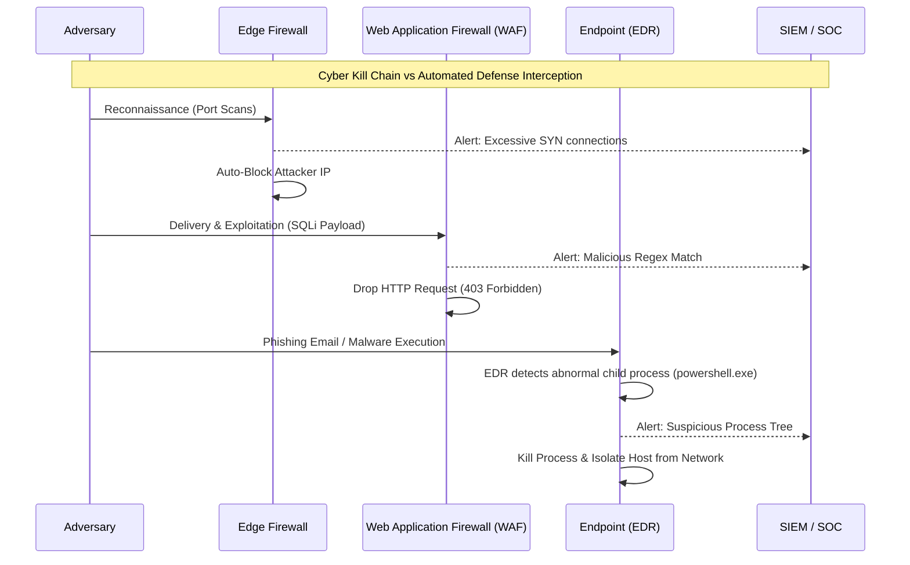
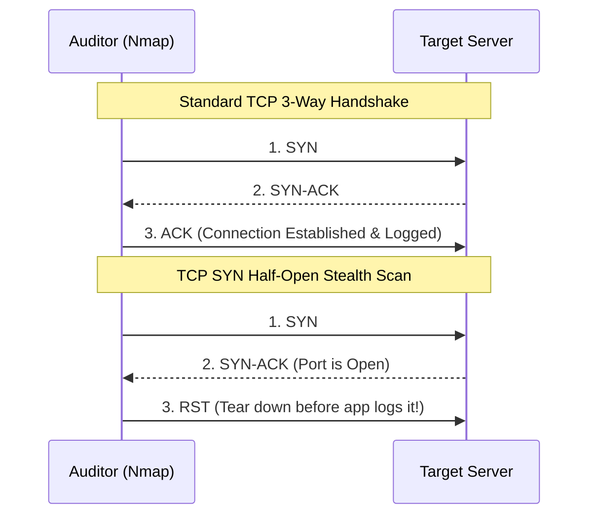
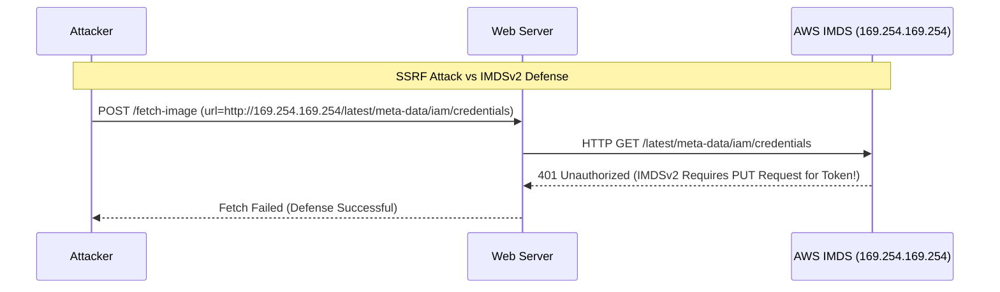
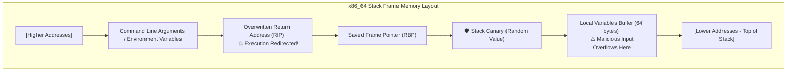
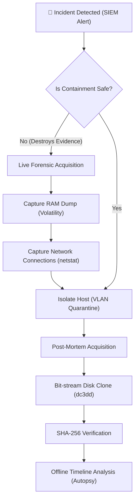

# 📘 Cybersecurity, Ethical Hacking, CTF & Digital Forensics — Comprehensive Architecture Manual

## 📑 Table of Contents
### Part I: In-Depth Conceptual & Architectural Foundations (Theory & Mechanics)
* [1. Enterprise Cybersecurity Architecture & The Threat Landscape](#1-enterprise-cybersecurity-architecture--the-threat-landscape)
* [2. Network Attack Surfaces & Vulnerability Auditing Mechanics](#2-network-attack-surfaces--vulnerability-auditing-mechanics)
* [3. Web Application Vulnerability Architecture (OWASP Top 10)](#3-web-application-vulnerability-architecture-owasp-top-10)
* [4. Capture-The-Flag (CTF) Foundations & Vulnerability Mechanics](#4-capture-the-flag-ctf-foundations--vulnerability-mechanics)
* [5. Digital Forensics & Incident Response (DFIR) Mechanics](#5-digital-forensics--incident-response-dfir-mechanics)

### Part II: Exhaustive Defensive, Diagnostic & Forensic Toolkit Guide
* [6. Network Diagnostic & Security Auditing Toolkit](#6-network-diagnostic--security-auditing-toolkit-nmap-wireshark-tcpdump-netcat-openssl)
* [7. CTF, Cryptography & Inspection Toolkit](#7-ctf-cryptography--inspection-toolkit-ghidra-radare2-gdbpwndbg-cyberchef-binwalk-exiftool)
* [8. Digital Forensics & Incident Response Toolkit](#8-digital-forensics--incident-response-toolkit-volatility3-autopsy-sleuthkit-yara-foremost-dddc3dd)
* [9. Enterprise Defensive Hardening, Cloud Security & SIEM Automation Workflows](#9-enterprise-defensive-hardening-cloud-security--siem-automation-workflows)
* [10. Quick Reference & Exploit Mitigation Cheat Sheet Summary](#10-quick-reference--exploit-mitigation-cheat-sheet-summary)

---

## Part I: In-Depth Conceptual & Architectural Foundations (Theory & Mechanics)

## 1. Enterprise Cybersecurity Architecture & The Threat Landscape

**🌐 Analogy (The Castle Siege & Defense in Depth):**
Think of an enterprise network like a medieval castle. Moats, Outer Curtain Walls, Drawbridges, Portcullises, and Inner Citadel Vaults! Never rely on a single perimeter barrier; implement micro-segmented barriers (Zero Trust NIST SP 800-207), roaming armed guards (EDR/XDR), and vault encryption to protect the crown jewels.

**In-Depth Concepts:**
Modern security architecture revolves around understanding adversary behavior and building resilient systems.
* **The Lockheed Martin Cyber Kill Chain:** A phased model describing the steps an adversary takes:
  1. Reconnaissance: Harvesting emails, OSINT, scanning.
  2. Weaponization: Coupling exploits with backdoors into a deliverable payload.
  3. Delivery: Transmitting the payload (e.g., phishing, watering hole).
  4. Exploitation: Triggering the vulnerability to execute code.
  5. Installation: Establishing persistence (e.g., auto-run registry keys).
  6. Command & Control (C2): Opening a remote communication channel.
  7. Actions on Objectives: Exfiltration, encryption (ransomware), or lateral movement.
* **MITRE ATT&CK Framework:** A globally-accessible knowledge base of adversary tactics and techniques based on real-world observations. Much more granular than the Kill Chain.
* **CIA Triad:** The core pillars of security: **C**onfidentiality (data privacy), **I**ntegrity (data accuracy/tamper-resistance), and **A**vailability (uptime).
* **Least Privilege IAM:** The principle that identities (users, services, VMs) should only have the bare minimum permissions required to perform their function.

**How it Works & Diagram:**


**Best Practice 💡:** Implement Zero Trust Architecture (ZTA). Assume the network is already breached; never trust implicitly based on network location.
**Pitfalls ⚠️:** Over-reliance on perimeter defenses. Once a firewall is bypassed, a flat internal network allows unhindered lateral movement.
**DevOps Pro Tip 🔧:** Automate security responses using SOAR (Security Orchestration, Automation, and Response). Pipe EDR and WAF logs to a central SIEM to trigger automatic AWS Lambda/Azure Function isolations.

---

## 2. Network Attack Surfaces & Vulnerability Auditing Mechanics

**🌐 Analogy (The Skulking Prowler):**
Testing every window handle across a fenced industrial park in the middle of the night without stepping inside until an unlocked fire escape is found! This represents SYN Stealth Scanning, checking if ports are open without completing the full handshake.

**In-Depth Concepts:**
* **TCP/IP Framing & Scanning Mechanics:** A standard TCP connection requires a 3-way handshake (`SYN` -> `SYN-ACK` -> `ACK`). In a Half-Open SYN Stealth Scan, the auditor sends a `SYN`. If the server responds with `SYN-ACK` (indicating the port is open), the auditor sends an abrupt `RST` (Reset) instead of an `ACK`. This prevents the connection from fully establishing, often bypassing application-level logging mechanisms.
* **CVSS v3.1 Base Scoring:** The Common Vulnerability Scoring System provides a standardized way to rate severity (0.0 to 10.0) based on Attack Vector, Attack Complexity, Privileges Required, User Interaction, and impact on the CIA triad.
* **Penetration Testing Methodologies:**
  * **Black Box:** Zero prior knowledge; simulates an external adversary.
  * **Grey Box:** Partial knowledge (e.g., standard user credentials) to test internal segregation.
  * **White Box:** Full source code and architectural access for comprehensive auditing.

**How it Works & Diagram:**


**Best Practice 💡:** Audit your own perimeter regularly using continuous attack surface management tools. Map all exposed IPv4/IPv6 ranges.
**Pitfalls ⚠️:** Forgetting about IPv6! Many legacy firewalls are misconfigured to only block malicious IPv4 traffic, leaving IPv6 wide open.
**DevOps Pro Tip 🔧:** Integrate infrastructure scanning into CI/CD. Use tools like `tfsec` or `checkov` to analyze Terraform templates before deploying vulnerable network security groups.

---

## 3. Web Application Vulnerability Architecture (OWASP Top 10)

**🌐 Analogy (Counterfeit Wire Authorization):**
Tricking a bank cashier into executing unauthorized vault transfers by smuggling secret administrative override instructions inside deposit envelopes. This represents how injection and spoofing flaws manipulate backend parsers.

**In-Depth Concepts:**
* **SQL Injection (SQLi):** Occurs when untrusted user input is directly concatenated into a database query. A payload like `' OR '1'='1` can bypass authentication. *Defense:* Prepared Statements (Parameterized Queries).
* **Cross-Site Scripting (XSS):** Injecting malicious JavaScript into web pages viewed by other users to steal session cookies. *Defense:* Context-aware output encoding and strict Content-Security-Policy (CSP) headers.
* **Cross-Site Request Forgery (CSRF):** Tricking an authenticated user's browser into executing unwanted actions on a trusted site. *Defense:* Anti-CSRF tokens and `SameSite` cookie attributes.
* **Server-Side Request Forgery (SSRF):** Exploiting a web app's ability to fetch remote resources, forcing it to make HTTP requests to internal, non-public endpoints. A classic cloud SSRF involves querying the AWS Instance Metadata Service (IMDS) at `http://169.254.169.254/latest/meta-data/` to steal IAM credentials. *Defense:* Enforce IMDSv2 (requires session tokens) and validate URL inputs against an allowlist.
* **JWT Signature Stripping:** Modifying a JSON Web Token header to `{"alg": "none"}`. If the backend library is vulnerable, it accepts the token without verifying the signature, allowing privilege escalation.

**How it Works & Diagram:**


**Best Practice 💡:** Adopt a "Secure by Default" framework. Use ORMs that parameterize queries automatically, and web frameworks (like React/Angular) that auto-escape DOM variables.
**Pitfalls ⚠️:** Using blocklists (blacklists) for input validation. Attackers constantly find bypasses (e.g., using `S3lEct` if `select` is blocked). Always use allowlists.
**DevOps Pro Tip 🔧:** Deploy a Cloud WAF (AWS WAF, Cloudflare) with OWASP Core Rule Sets in front of all web applications.

---

## 4. Capture-The-Flag (CTF) Foundations & Vulnerability Mechanics

**🌐 Analogy (Special Forces Obstacle Course):**
Controlled military simulations navigating fortified digital traps to solve algorithmic puzzles and recover encoded flags (`FLAG{c1ph3r_r00t_c27f}`)!

**In-Depth Concepts:**
* **CTF Formats:**
  * **Jeopardy:** Independent puzzle categories (Web, Pwn, Crypto, Forensics, Reverse Engineering).
  * **Attack-Defense:** Teams are given servers with vulnerable services; they must patch their own while writing exploits for other teams.
* **Cryptography Basics:**
  * **RSA Exponent Flaws:** If the public exponent `e` is too small (e.g., 3) and no padding is used, the ciphertext can be attacked via cube root.
  * **AES-ECB vs CBC:** ECB encrypts identical plaintext blocks into identical ciphertext blocks (the "ECB Penguin" flaw). CBC uses an Initialization Vector (IV) and chaining to randomize blocks.
* **Memory Corruption (Buffer Overflows):** When a program writes data beyond the allocated boundaries of a fixed-length buffer (e.g., in C/C++ via `strcpy`).
  * If a local variable buffer on the stack is overflowed, it can overwrite the Saved Frame Pointer (RBP) and the Return Address (RIP), redirecting CPU execution to malicious shellcode.
* **OS Defenses:**
  * **ASLR (Address Space Layout Randomization):** Randomizes memory locations of libraries and the stack.
  * **NX/DEP:** Marks the stack as non-executable.
  * **Stack Canaries:** A random value placed before the return address; if it's altered, the program crashes safely.
  * **ROP (Return-Oriented Programming):** Bypassing NX by chaining together existing snippets of executable code ("gadgets") ending in `ret` instructions.

**How it Works & Diagram:**


**Best Practice 💡:** Write new systems in memory-safe languages like Rust or Go. For legacy C/C++, compile with `-fstack-protector-all`, `-D_FORTIFY_SOURCE=2`, and `-Wl,-z,relro,-z,now`.
**Pitfalls ⚠️:** Disabling compiler protections during development for "easier debugging" and forgetting to re-enable them for the production build.
**DevOps Pro Tip 🔧:** Integrate static application security testing (SAST) tools into your pipeline to detect insecure functions like `gets()` or `sprintf()` before merge.

---

## 5. Digital Forensics & Incident Response (DFIR) Mechanics

**🌐 Analogy (Crime Scene Custody Chain):**
Photographing a crime scene before touching doorknobs! If you pull a running server’s plug before dumping volatile RAM, you destroy decryption keys and fileless kernel rootkit traces!

**In-Depth Concepts:**
* **NIST SP 800-86 & Incident Response Lifecycle:** Preparation -> Detection & Analysis -> Containment, Eradication & Recovery -> Post-Incident Activity.
* **Order of Volatility (RFC 3227):** When collecting evidence, start with the most volatile data:
  1. CPU Registers and Cache
  2. Routing Table, ARP Cache, Process Table, Kernel Statistics
  3. Main Memory (RAM)
  4. Temporary File Systems / Swap Space
  5. Data on Hard Disks (Disk Images)
  6. Remote Logging and Monitoring Data
* **Disk Imaging & Chain of Custody:** Never analyze the original drive! Create a bit-for-bit raw clone (`DD`) or EnCase/Expert Witness format (`E01`). Calculate SHA-256 hashes before and after to prove forensic integrity in court.
* **System Artifacts:**
  * **Windows Event Logs (`EVTX`):** ID `4624` (Successful Logon), `4672` (Special Privileges Assigned), `4688` (A new process has been created).
  * **Master File Table (MFT):** The NTFS database tracking all files, including deleted ones.
  * **Registry Hives:** `SAM` (hashes), `SYSTEM`, `SOFTWARE`, `NTUSER.DAT` (user-specific activity, MRU lists).

**How it Works & Diagram:**


**Best Practice 💡:** Centralize logging. If a machine is compromised, local logs (`/var/log/syslog` or Windows Event Logs) will likely be wiped or tampered with.
**Pitfalls ⚠️:** Rebooting a compromised machine "to see if it fixes it." This destroys RAM evidence and alerts the attacker to your investigation.
**DevOps Pro Tip 🔧:** Build automated IR playbooks. When an alert fires, script an automated snapshot of the AWS EBS volume and EC2 memory dump before quarantining the instance.

---

## Part II: Exhaustive Defensive, Diagnostic & Forensic Toolkit Guide

## 6. Network Diagnostic & Security Auditing Toolkit (`nmap`, `wireshark`, `tcpdump`, `netcat`, `openssl`)

**📦 Essential Tooling & Signatures Table:**

| Tool | Purpose | Key Flags / Usage |
| :--- | :--- | :--- |
| `nmap` | Network Mapper / Attack Surface Audit | `-sS` (SYN Stealth), `-sV` (Version detection), `-O` (OS detection), `-p-` (All 65535 ports), `-T4` (Aggressive timing) |
| `tcpdump` | CLI Packet Capture (BPF filtering) | `-i eth0` (Interface), `-nn` (No DNS/Port resolution), `-s0` (Snaplen full packet), `-w out.pcap` (Write to file) |
| `wireshark` | GUI Protocol Analyzer & Forensics | Display Filters: `http.request.method == "POST"`, `tcp.flags.syn == 1 && tcp.flags.ack == 0` |
| `netcat` / `nc` | Network Swiss Army Knife | `nc -vz target 80` (Banner grabbing/port check) |
| `openssl` | TLS/SSL Diagnostic Auditing | `s_client -connect target:443` (Inspect certificates/ciphers) |

**Production Code Suite & Terminal Workflows:**

* **Comprehensive Vulnerability Scan Script:**
```bash
#!/bin/bash
# Description: Automated internal subnet vulnerability mapping
TARGET_SUBNET="192.168.1.0/24"
OUTPUT_DIR="/var/log/audits"

echo "[*] Initiating Stealth SYN Scan on $TARGET_SUBNET"
nmap -sS -sV -O -p- --script vuln,safe -oA $OUTPUT_DIR/subnet_audit $TARGET_SUBNET
```

* **Forensic Packet Capture (Continuous Ring Buffer):**
```bash
# Capture packets continuously on eth0, saving to 50MB files, keeping the last 10 files
tcpdump -i eth0 -nn -s0 -w /var/log/pcap/evidence.pcap -W 10 -C 50
```

* **Auditing TLS Certificates for Expiry and Weak Ciphers:**
```bash
echo | openssl s_client -servername mydomain.com -connect mydomain.com:443 2>/dev/null | openssl x509 -noout -dates
```

---

## 7. CTF, Cryptography & Inspection Toolkit (`ghidra`, `radare2`, `gdb/pwndbg`, `cyberchef`, `binwalk`, `exiftool`)

**📦 Essential Tooling & Signatures Table:**

| Tool | Purpose | Key Flags / Usage |
| :--- | :--- | :--- |
| `ghidra` | NSA Software Reverse Engineering Suite | GUI-based static analysis and decompilation to C-like pseudocode. |
| `radare2` | CLI Reverse Engineering Framework | `r2 binary` -> `aaa` (analyze all) -> `afl` (list functions) -> `pdf @ main` (disassemble main) |
| `gdb` / `pwndbg` | GNU Debugger (Dynamic Analysis) | `break *0x4011fa`, `run`, `info registers`, `x/20x $rsp` (examine stack) |
| `binwalk` | Firmware & File Carving / Extraction | `binwalk -e image.png` (Extract embedded files/ZIPs) |
| `exiftool` | Metadata Header Inspection | `exiftool document.pdf` (View author, creation date, GPS data) |

**Production Code Suite & Terminal Workflows:**

* **Extracting Hidden Partitions from Firmware/Images (Steganography/Forensics):**
```bash
# Discover hidden file signatures within a binary blob or image file
binwalk firmare.bin

# Automatically extract those identified files into a _firmware.bin.extracted directory
binwalk -e --run-as=root firmware.bin
```

* **GDB/Pwndbg - Inspecting CPU State at Crash:**
```bash
# Start debugger
gdb ./vulnerable_binary

# Inside GDB:
pwndbg> checksec           # Check binary protections (NX, Canary, PIE)
pwndbg> break main         # Set breakpoint at main function
pwndbg> run                # Execute
pwndbg> nexti              # Step over next instruction
pwndbg> info registers     # View contents of RAX, RBX, RIP, RSP
pwndbg> x/10gx $rsp        # Examine 10 giant hex words at the stack pointer
```

---

## 8. Digital Forensics & Incident Response Toolkit (`volatility3`, `autopsy`, `sleuthkit`, `yara`, `foremost`, `dd/dc3dd`)

**📦 Essential Tooling & Signatures Table:**

| Tool | Purpose | Key Flags / Usage |
| :--- | :--- | :--- |
| `dc3dd` | DoD-compliant disk imaging | `dc3dd if=/dev/sda of=image.dd hash=sha256` |
| `volatility3` | RAM Memory Forensics | `python3 vol.py -f mem.raw windows.pslist` |
| `sleuthkit` | CLI Filesystem Analysis | `fls -r -m "/" image.dd`, `icat image.dd <inode>` |
| `foremost` | Data Carving (Magic Header based) | `foremost -i image.dd -t pdf,jpg -o /output` |
| `yara` | Malware Pattern Matching | `yara rules.yar target_directory/` |

**Production Code Suite & Terminal Workflows:**

* **Volatility 3 Workflow (Windows RAM Analysis):**
```bash
# 1. Identify running processes
python3 vol.py -f memory.raw windows.pslist

# 2. Check for hidden/injected processes (malware)
python3 vol.py -f memory.raw windows.malfind

# 3. View active network connections at the time of the dump
python3 vol.py -f memory.raw windows.netscan
```

* **YARA Threat Hunting Rule for Malicious PHP Web Shells:**
```yara
rule Detect_PHP_Webshell {
    meta:
        description = "Detects obfuscated/malicious PHP web shells (e.g., eval base64)"
        author = "DevOps Security Team"
        date = "2026-08-05"
        severity = "High"
    strings:
        $php_start = "<?php"
        $eval = "eval(" nocase
        $base64 = "base64_decode(" nocase
        $system = "system(" nocase
        $shell_exec = "shell_exec(" nocase
    condition:
        $php_start at 0 and ( $eval and $base64 ) or ( $system or $shell_exec )
}
```
*Run it with:* `yara Detect_PHP_Webshell.yar /var/www/html/`

---

## 9. Enterprise Defensive Hardening, Cloud Security & SIEM Automation Workflows

**📦 Essential Tooling & Signatures Table:**

| Tool / Service | Purpose | Defense Mechanism |
| :--- | :--- | :--- |
| `auditd` | Linux Kernel Auditing | Tracks system calls, file access, and execution at the kernel level. |
| `fail2ban` | Dynamic IDS/IPS | Parses logs and updates iptables to block brute-force IP addresses. |
| AWS GuardDuty | Cloud Threat Detection | Machine learning analysis of VPC Flow Logs, CloudTrail, and DNS logs. |
| AWS WAF | Web App Firewall | Inspects HTTP(s) traffic against OWASP rulesets before it reaches ALBs. |

**Production Code Suite & Terminal Workflows:**

* **Linux `auditd` Hardening Configuration (`/etc/audit/rules.d/audit.rules`):**
```text
# Clear existing rules
-D
# Set buffer size
-b 8192
# Audit modifications to the shadow file (credentials)
-w /etc/shadow -p wa -k identity
# Audit any execution of the root shell
-w /bin/bash -p x -k root_shell
# Audit privilege escalation attempts (sudo)
-w /etc/sudoers -p wa -k sudo_changes
# Make rules immutable until reboot
-e 2
```

* **Automated AWS Incident Response & Containment Script (Python/Boto3):**
```python
import boto3

def isolate_compromised_instance(instance_id, forensic_sg_id):
    """
    Removes an EC2 instance from its normal Security Groups and attaches
    a Forensic Quarantine SG (No egress, isolated ingress for DFIR tools).
    """
    ec2 = boto3.client('ec2')
    
    print(f"[CRITICAL] Isolating compromised instance: {instance_id}")
    
    # 1. Modify Security Groups
    ec2.modify_instance_attribute(
        InstanceId=instance_id,
        Groups=[forensic_sg_id]
    )
    
    # 2. Trigger Forensic Snapshot of the root volume
    response = ec2.describe_instances(InstanceIds=[instance_id])
    volumes = response['Reservations'][0]['Instances'][0]['BlockDeviceMappings']
    
    for vol in volumes:
        vol_id = vol['Ebs']['VolumeId']
        print(f"[*] Snapping Volume: {vol_id} for Forensics")
        ec2.create_snapshot(
            VolumeId=vol_id,
            Description=f"Forensic Snapshot for Incident on {instance_id}"
        )
    print("[SUCCESS] Instance isolated and evidence preserved.")

# Example Usage: Triggered via AWS Lambda when GuardDuty flags an instance.
# isolate_compromised_instance('i-0abcd1234efgh5678', 'sg-09876isolated54321')
```

---

## 10. Quick Reference & Exploit Mitigation Cheat Sheet Summary

**Table 1: Attack Vector vs. Engineering Defense Matrix**

| Attack Vector | Conceptual Flaw | Robust Engineering Defense |
| :--- | :--- | :--- |
| **Buffer Overflows** | Unchecked memory boundaries (C/C++) | ASLR, Stack Canaries, NX/DEP, Safe Languages (Rust). |
| **SQL Injection** | String concatenation of user inputs | Parameterized Queries / Prepared Statements (ORMs). |
| **Cross-Site Scripting (XSS)**| Unsanitized DOM rendering | Strict Content-Security-Policy (CSP), Context-aware output encoding. |
| **CSRF** | Implicit browser cookie inclusion | Anti-CSRF Synchronizer Tokens, `SameSite=Strict` cookies. |
| **SSRF** | Server fetching user-controlled URLs | Enforce IMDSv2, Network Egress Filtering, Strict Allowlists. |
| **Insecure Deserialization** | Trusting serialized objects | Do not deserialize untrusted data; use raw JSON/schema validation. |

**Table 2: Common Forensic File Magic Header Hex Signatures Dictionary**
During data carving, forensic tools look for these exact hexadecimal bytes at the start of a file (offset 0):

| File Type | Hexadecimal Magic Bytes | ASCII Representation |
| :--- | :--- | :--- |
| **JPEG** | `FF D8 FF E0` | `ÿØÿà` |
| **PNG** | `89 50 4E 47 0D 0A 1A 0A` | `.PNG....` |
| **ZIP / DOCX / XLSX** | `50 4B 03 04` | `PK..` |
| **PDF** | `25 50 44 46` | `%PDF` |
| **ELF (Linux Executable)**| `7F 45 4C 46` | `.ELF` |
| **PE (Windows Executable)**| `4D 5A` | `MZ` (Mark Zbikowski) |

**Table 3: SOC & Incident Response Severity Triage Checklist**

- [ ] **1. Triage & Verify:** Confirm the alert is a true positive. Assess CIA impact severity.
- [ ] **2. Containment (Live):** Isolate the host at the network layer (VLAN/Security Group switch). **DO NOT REBOOT OR POWER OFF.**
- [ ] **3. Volatile Acquisition:** Capture RAM using Volatility/DumpIt immediately.
- [ ] **4. Non-Volatile Acquisition:** Take EBS Snapshots or create E01 disk images.
- [ ] **5. Eradication:** Identify root cause (e.g., unpatched vulnerability, compromised credential). Patch systems, rotate all keys/passwords globally.
- [ ] **6. Recovery:** Restore from known-clean immutable backups. Monitor closely for 48 hours for reinfection.
- [ ] **7. Lessons Learned:** Post-mortem meeting. Update playbooks, SIEM rules, and engineering practices to prevent recurrence.

---
> *This documentation focuses purely on the defensive, architectural, and educational facets of modern systems security. Cultivate resilience through robust engineering.*
