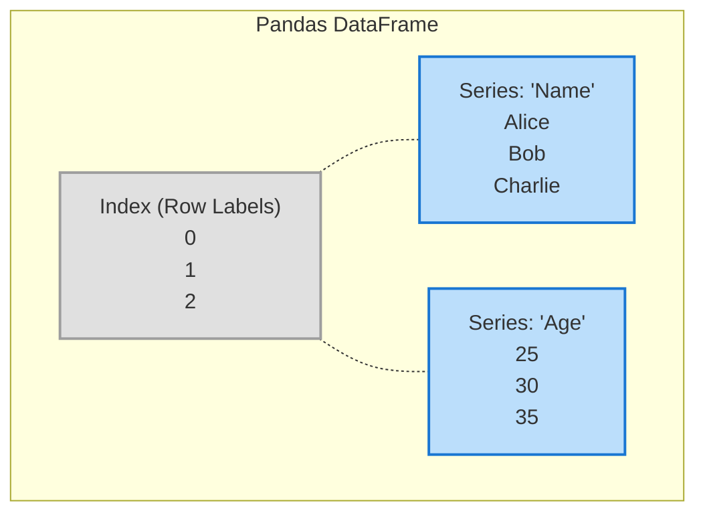
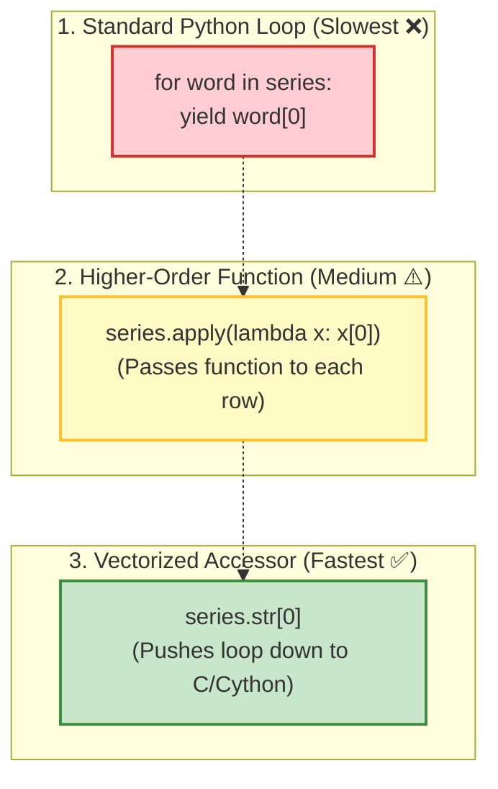

## 2. Pandas: The Data Wrangler

Pandas is built directly on top of NumPy. While NumPy is amazing for raw math grids, it is terrible at handling heterogeneous data (like a mix of names, dates, and prices). Pandas brings SQL/Excel-like tabular data structures into Python.

### 🧠 Mental Model: Anatomy of a DataFrame
Think of a Pandas `DataFrame` as a dictionary of Pandas `Series` (columns), where every single column shares the exact same `Index` (row labels).
- **Index**: The row labels (can be numbers `0, 1, 2` or strings like `'Jan', 'Feb'`).
- **Series**: A single column of data (under the hood, this is just a NumPy array with an Index attached to it!).

#### 📊 Diagram: DataFrame Structure


### Selecting & Filtering: `loc` vs. `iloc`
This is the #1 confusion point for beginners. 
*   **`loc` (Label Location)**: Looks at the *names* of the rows and columns.
*   **`iloc` (Integer Location)**: Looks at the *physical position* of the rows and columns (like a standard Python list, starting at 0).

| Method | What it asks the DataFrame | Example |
| :--- | :--- | :--- |
| **`df.loc['row_name', 'col_name']`** | "Give me the data where the row is labeled 'row_name'." | `df.loc[5, 'Age']` (Gets the 'Age' for the row literally named '5') |
| **`df.iloc[row_index, col_index]`** | "Give me the data in the physical 5th row and 2nd column." | `df.iloc[4, 1]` (Gets the 5th row down, 2nd column across) |

### Most Frequently Used Methods (Deep Dive)

#### 1. `pd.read_csv()` / `pd.read_sql()`
*   **Concept**: Data Ingestion. You rarely build DataFrames from scratch. You import them from files or databases.
*   **Return Type**: A new `DataFrame`.
*   **Example**: `df = pd.read_csv('sales.csv')`

#### 2. `df.apply(function)`
*   **Concept**: Instead of writing a slow `for` loop to modify every row, you write a function and `apply` it to the column. It maps the function across the data instantly.
*   **Return Type**: A new `Series` (if applied to a column) or `DataFrame`.
*   **Mental Model**: Like a stamping machine on an assembly line stamping every package as it rolls by.
    ```python
    # Double every price
    df['Price'] = df['Price'].apply(lambda x: x * 2)
    ```

#### 💡 Deep Dive: Vectorization vs Iteration (The `.str` Accessor)
Beginners often wonder if methods like `.str[0]` or `.apply()` are just hidden Python `for` loops. The answer is **no**, and understanding this difference is key to writing fast Pandas code.

**1. The `.str` Accessor (Vectorization)**
When you type `pd.Series(['cat', 'dog', 'bird']).str[0]`, `.str` creates a special `StringMethods` object. It acts as a bridge, telling Pandas to apply the slicing `[0]` to the entire Series. But it doesn't loop in standard Python! It pushes the operation down into highly optimized C/Cython (or PyArrow) code, processing the entire array simultaneously. This is called **Vectorization**.

**2. Higher-Order Functions (`.apply()`)**
If you use `.apply(lambda x: x[0])`, you are using a higher-order function. It takes your custom function and applies it row-by-row. It is highly flexible (you can write any complex logic inside the lambda) but generally *slower* than vectorized accessors because it still relies on Python-level execution overhead.

**3. Standard Iterators (The Anti-Pattern)**
Writing a manual Python `for` loop (e.g., `[word[0] for word in series]`) is the slowest method and should almost always be avoided when working with Pandas DataFrames.

#### 📊 Diagram: The 3 Levels of Processing Speed


#### 🛠️ Beyond `.str`: The Other Pandas Accessors
Because `.str` only works on text, Pandas provides several other accessors specifically designed to handle dates, categories, and specialized data structures using the exact same vectorized magic.

**1. The `.dt` Accessor (Datetimes)**
If your Series contains dates or times, the `.dt` accessor unlocks a massive library of time-based properties and methods.
```python
# Create a Series of dates
dates = pd.Series(pd.to_datetime(['2023-01-01', '2023-10-31', '2024-02-29']))

# Extract just the month name using .dt
print(dates.dt.month_name())
# 0     January
# 1     October
# 2    February

# Check if the year is a leap year
print(dates.dt.is_leap_year)
# 0    False
# 1    False
# 2     True
```

**2. The `.cat` Accessor (Categoricals)**
When you have data that takes on a limited, fixed number of possible values (like "Small", "Medium", "Large"), converting it to a `category` data type saves massive amounts of memory. The `.cat` accessor manages these categories.
```python
# Create a categorical Series
sizes = pd.Series(['Small', 'Large', 'Medium', 'Small'], dtype='category')

# Reorder the categories logically
sizes = sizes.cat.reorder_categories(['Small', 'Medium', 'Large'], ordered=True)

# Get the integer codes behind the text (saves memory!)
print(sizes.cat.codes)
# 0    0
# 1    2
# 2    1
# 3    0
```

**3. The `.sparse` Accessor (Sparse Data)**
If you have a massive dataset that is mostly filled with zeros or `NaN` (missing) values, converting it to a "sparse" format tells pandas to only store the actual values in memory, ignoring all the zeros/blanks to save RAM. 
```python
sparse_series = pd.Series([0, 0, 0, 5, 0, 0, 10], dtype="Sparse[int]")

# Check how much data is actually non-zero
print(sparse_series.sparse.density)
# 0.2857  (Only ~28% of the data is actually taking up memory)
```

**4. Arrow-backed Accessors (`.list` and `.struct`)**
In newer versions of pandas (2.0+), when you use PyArrow backend data types, you get access to specialized accessors for complex data:
*   **`.list`**: Used when every item in your Series is a Python list (e.g., `[1, 2, 3]`). You can use `.list.len()` to get the length of each list instantly.
*   **`.struct`**: Used when every item is a dictionary or JSON-like structure, allowing you to extract specific keys directly.

> [!TIP]
> **Fun Fact:** Pandas actually allows you to build your own custom accessors! If you have a specific mathematical calculation or business logic you use all the time, you can write a custom class and register it so you can do something like `my_series.finance.calculate_tax()`.

> [!NOTE] FAQ: Accessor Return Types & Scope
> **1. Does an accessor return a new column or modify the existing one?**
> Accessors do **not** modify the original data in place. They perform the vectorized operation and return a *brand new* `pd.Series` (a new column). If you want to keep the changes, you must overwrite the column or save it as a new one:
> `df['new_column'] = df['old_column'].str.lower()`
> 
> **2. Can we apply an accessor to an entire row, or a whole DataFrame?**
> **No.** Accessors (`.str`, `.dt`, etc.) are explicitly designed to work only on a 1-Dimensional `pd.Series` (a single column). This is because accessors require uniform data types (e.g., `.str` needs every item to be a string), whereas a row in a DataFrame typically contains mixed data types (a string name, an integer age, a float salary).

#### 💡 Case Study: The "Series of Lists" Trap (`.str.split`)
A very common beginner mistake happens when trying to split a string column (e.g., splitting `"Austin, TX"` into `"Austin"` and `"TX"`).

**The Setup:**
```python
staff = pd.DataFrame({"City": ["Austin, TX", "Seattle, WA"]})

# Splitting the string creates a Python list inside every row!
staff["City"].str.split(",") 

# Resulting Series (1D Column):
# 0    ['Austin', ' TX']
# 1    ['Seattle', ' WA']
```
This output is a **Series of Lists**. It is still a 1D column, but now every single row holds a Python list instead of a simple string.

**The Mistake:**
Beginners often try to grab the state ("TX") by doing this:
```python
# ❌ ERROR! Python thinks you want Row 1 of the column!
staff["City"].str.split(",")[1] 
```
Because a Series is a 1D vertical column, `[1]` tells Pandas to fetch the *second row of the table* (which is `['Seattle', ' WA']`), not the second item inside the lists!

**The Solutions:**

*   **Option A: The Double Accessor (Keep it 1D)**
    You must use `.str` a *second time* to tell Pandas to look *inside* the lists on every single row.
    ```python
    # Go inside the Series -> Go inside the lists -> Grab index 1 -> Clean the whitespace
    staff["State"] = staff["City"].str.split(",").str[1].str.strip()
    ```

*   **Option B: Explode to 2D (`expand=True`)**
    By adding `expand=True`, you tell Pandas to stop cramming lists into a single column. Instead, it blasts the lists horizontally, converting the 1D Series into a 2D DataFrame with actual numbered columns (0 and 1).
    ```python
    # Turns into a 2D grid. Now [1] correctly selects Column 1!
    staff["State"] = staff["City"].str.split(",", expand=True)[1].str.strip()
    ```

*(Note: Always use `.str.strip()` after splitting by commas to remove the hidden leading space in `" TX"`, otherwise your filters will fail later!)*

#### 3. `df.groupby('column').agg()`
*   **Concept**: The "Split-Apply-Combine" workflow. 
    1. **Split**: Break the giant table into smaller mini-tables based on a category (e.g., group by 'Department').
    2. **Apply**: Calculate a metric for each mini-table (e.g., `mean()` salary).
    3. **Combine**: Glue the results back together into a new summary table.
*   **Return Type**: A new `DataFrame` summarizing the groups.
*   **Diagram**:
    ```mermaid
    flowchart LR
        Raw["Raw Data<br/>(Math, $50)<br/>(Physics, $70)<br/>(Math, $60)"] --> Split
        Split["Split into Buckets"] --> B1["Math Bucket"]
        Split --> B2["Physics Bucket"]
        B1 --> Agg1["Apply Math: Mean()"]
        B2 --> Agg2["Apply Math: Mean()"]
        Agg1 --> Combine["Combine Results<br/>(Math, $55)<br/>(Physics, $70)"]
        Agg2 --> Combine
    ```

#### 4. `df.merge()`
*   **Concept**: This is the exact equivalent of a SQL `JOIN`. It glues two DataFrames together horizontally based on a shared key.
*   **Return Type**: A new joined `DataFrame`.
*   **Example**: 
    ```python
    # SQL: SELECT * FROM users u INNER JOIN orders o ON u.id = o.user_id
    final_df = users.merge(orders, left_on='id', right_on='user_id', how='inner')
    ```

#### 5. `df.fillna()` & `df.dropna()`
*   **Concept**: Real world data is messy. `NaN` (Not a Number) means missing data. Machine Learning models will instantly crash if you feed them `NaN`s. You either have to drop the rows completely (`dropna()`) or fill them with a placeholder/average (`fillna()`).
*   **Return Type**: A new `DataFrame` with the missing values resolved.

---

### A Brief Nod to Polars 🐻‍❄️
Pandas is famous, but it evaluates data "Eagerly" (it does exactly what you tell it to do immediately, step-by-step). 
**Polars** is a newer, wildly popular library written in Rust. It evaluates "Lazily". You give Polars a list of 10 tasks, and instead of doing them one-by-one, its Query Optimizer looks at the whole list, figures out a smarter/faster way to do it, and executes it in parallel across all CPU cores. Use Pandas to learn, but look into Polars when your datasets get massive (5GB+).

## 3. Data Visualization (The Storytellers)

Data visualization is how we translate millions of numbers into a format the human brain can instantly understand. 

### 🧠 Mental Model: The Grammar of Graphics
Just like the English language has nouns, verbs, and adjectives, building a chart has a specific grammar.
1. **Data**: The raw DataFrame.
2. **Aesthetics (Mapping)**: Telling the computer what the axes should be (e.g., X-axis = 'Age', Y-axis = 'Salary', Color = 'Department').
3. **Geometries**: The actual shapes drawn on the screen (e.g., draw dots for a scatter plot, draw bars for a bar chart).

### Choosing Your Tool

#### 1. Matplotlib (The Canvas)
*   **What it is**: The lowest-level visualization library in Python.
*   **Mental Model**: Think of Matplotlib as painting on a blank canvas using imperative commands. You have to tell it exactly where to draw the X-axis, where to put the title, and what color every line should be. It is incredibly customizable but requires a lot of code.

#### 2. Seaborn (The Statistical Artist)
*   **What it is**: A high-level wrapper built directly on top of Matplotlib.
*   **Mental Model**: Think of Seaborn as hiring a professional graphic designer. You just hand them your DataFrame and say, "Draw me a correlation heatmap," and they do it in exactly one line of code, automatically picking beautiful color palettes. It is designed specifically to work seamlessly with Pandas DataFrames.

#### 3. Plotly (The Web Engine)
*   **What it is**: An interactive, browser-based graphing library.
*   **Mental Model**: Instead of returning a static image (like a PNG file from Matplotlib), Plotly returns a living HTML engine. You use this when you need the user to be able to hover their mouse over a data point to see the exact numbers, zoom into a specific cluster, or pan across a timeline.

---
**Next Steps**: Once you master the mathematical engine (NumPy) and the data wrangler (Pandas), you are fully prepared to start building Machine Learning models using Scikit-Learn!
