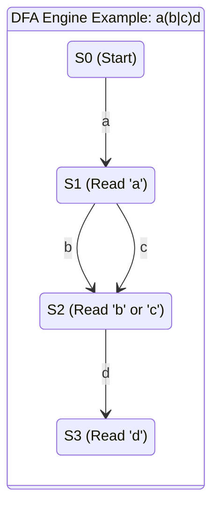
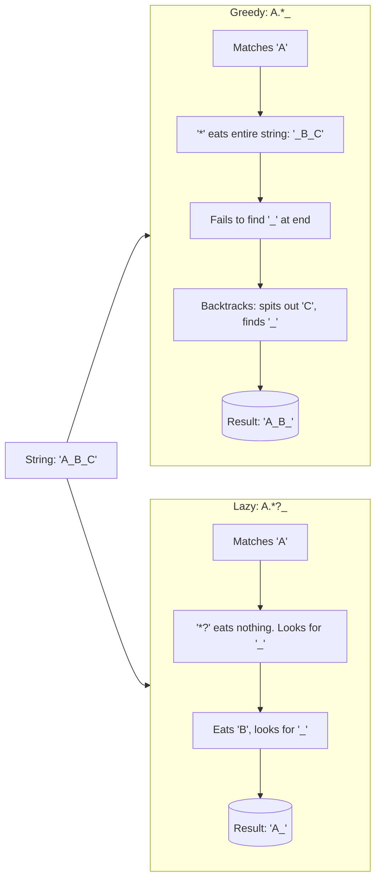

# 18. REGEX MASTERY (Regular Expressions)

Regular Expressions (Regex) are an arcane but universally essential language for pattern matching, text parsing, and string validation. They are utilized heavily in log analysis, data scrubbing, and network routing.

---

## 1. Engine Internals: NFA vs. DFA
Before memorizing syntax, you must understand *how* the software executes the syntax. There are two primary architectural engines for regex: **NFA (Nondeterministic Finite Automaton)** and **DFA (Deterministic Finite Automaton)**.

### NFA (Regex-Directed Engine)
Used by: Python, PCRE, Java, Perl, .NET, Ruby, PHP.
*   **Mechanics**: The engine reads the *regex pattern* character by character. If it has choices (alternation or quantifiers), it picks the first option, remembers the other options, and moves forward. If the match fails later, it "backtracks" to the saved state and tries the next option.
*   **Pros**: Supports advanced features like Capture Groups, Backreferences, and Lookarounds.
*   **Cons**: Susceptible to **Catastrophic Backtracking** (exponential time complexity) because it tries every possible permutation before failing.

### DFA (Text-Directed Engine)
Used by: `awk`, `egrep`, MySQL.
*   **Mechanics**: The engine reads the *input text* character by character exactly once. It keeps track of all possible matching states simultaneously. 
*   **Pros**: Guaranteed linear time complexity $O(n)$. It never backtracks. It is immune to catastrophic backtracking.
*   **Cons**: Lacks advanced features. It cannot support Capture Groups or Backreferences because it does not "remember" the path it took—it only knows the current state.



---

## 2. Historical Context: POSIX BRE vs. ERE vs. PCRE
When writing Bash scripts, you will inevitably fight with `grep`, `sed`, or `awk` failing to recognize your regex. This is due to historical POSIX standards.

### 1. POSIX BRE (Basic Regular Expressions)
Used by default in `grep` and `sed`. 
*   In BRE, characters like `+`, `?`, `|`, `(`, and `)` are treated as **literal characters** by default.
*   To give them regex meaning, you must **escape** them with a backslash `\`.
*   *Example*: To capture a group, you must write `\(abc\)`.

### 2. POSIX ERE (Extended Regular Expressions)
Used in `egrep`, `grep -E`, and `sed -E` or `awk`.
*   In ERE, `+`, `?`, `|`, `(`, and `)` hold their **special regex meaning** by default.
*   To treat them as literal strings, you escape them.
*   *Example*: To capture a group, you just write `(abc)`.

### 3. PCRE (Perl Compatible Regular Expressions)
Used in Python, JavaScript, and `grep -P`.
*   The modern standard. It includes everything in ERE, plus Lookarounds, Non-capturing groups, Lazy quantifiers, and advanced character classes (`\d`, `\s`, `\w`). POSIX standard engines *do not* support `\d` natively (they require `[0-9]` or `[:digit:]`).

---

## 3. Core Syntax & The Building Blocks

### Metacharacters & Wildcards
*   `.` (Dot): Matches exactly one character of *any* kind, EXCEPT a newline (`\n`). 
    *   *(Note: In most languages, you can pass a `DOTALL` flag to make it match newlines as well).*
*   `\` (Escape): Strips special meaning. `\.` matches a literal period.

### Character Classes
Used to define a pool of acceptable characters for a single position.
*   `[abc]`: Matches a single `a`, `b`, or `c`.
*   `[a-z]`: Range. Matches any lowercase letter.
*   `[^abc]`: **Negation**. Matches any character that is NOT `a`, `b`, or `c`.

**PCRE Shorthand Classes:**
*   `\d` : Digit `[0-9]`
*   `\D` : Non-digit `[^0-9]`
*   `\w` : Word character (Alphanumeric + Underscore) `[a-zA-Z0-9_]`
*   `\W` : Non-word character
*   `\s` : Whitespace (space, tab, newline)
*   `\S` : Non-whitespace

### Anchors (Positioning)
Anchors do not consume characters; they match *positions* between characters.
*   `^` : Start of the string (or start of a line in `MULTILINE` mode).
*   `$` : End of the string (or end of a line).
*   `\b`: Word Boundary. Matches the invisible position between a `\w` and a `\W`. 
    *   *Usage*: Searching for `\bcat\b` will match "the cat sat", but will intentionally *fail* to match "the catalog", preventing false positives.

---

## 4. Quantifiers: Greedy vs. Lazy Matching
Quantifiers define how many times the preceding element should repeat.

*   `*` : 0 or more times.
*   `+` : 1 or more times.
*   `?` : 0 or 1 time (Optional).
*   `{n}` : Exactly `n` times.
*   `{n,}` : `n` or more times.
*   `{n,m}` : Between `n` and `m` times.

### The Greed Trap
By default, all quantifiers in Regex are **Greedy**. They will consume as much of the string as physically possible while still allowing the overall regex to match.

**Input String**: `<div>First</div> <div>Second</div>`
**Regex**: `<div>.*</div>`

**Step-by-step NFA Engine Execution (Greedy):**
1. Engine matches `<div>`.
2. Engine hits `.*` and eats the entire rest of the string up to the very last `>`. 
3. Engine looks for `</div>` but is at the end of the string. It fails.
4. Engine **backtracks**, spitting out characters one by one from the right, until it finds the *last* `</div>` in the string.
5. **Result**: It matches the entire string `<div>First</div> <div>Second</div>` as a single block.

### The Lazy Fix
By appending `?` to a quantifier (`*?`, `+?`), you make it **Lazy**. It will consume the *absolute minimum* amount of characters required to make a match.

**Regex**: `<div>.*?</div>`

**Step-by-step NFA Engine Execution (Lazy):**
1. Engine matches `<div>`.
2. Engine hits `.*?` and skips consuming anything. It immediately checks if `</div>` comes next. It sees `F`, so it fails.
3. Engine consumes `F`, checks again. Consumes `i`, checks again.
4. It stops the exact moment it hits the *first* `</div>`.
5. **Result**: It perfectly extracts `<div>First</div>` as Match 1, and `<div>Second</div>` as Match 2.



---

## 5. Groups & Alternation

### Alternation (OR)
The `|` acts as a boolean OR.
*   `cat|dog` matches either "cat" or "dog".

### Capture Groups `(...)`
Parentheses bundle tokens together and, crucially, save the matched substring into a variable in memory (Capture 1, Capture 2, etc.).

**Regex**: `(\d{4})-(\d{2})-(\d{2})`
**Input**: `2023-10-25`
*   Group 1: `2023`
*   Group 2: `10`
*   Group 3: `25`

### Backreferences `\1`
You can reference a capture group later *inside the same regex*.
*   **Regex**: `<([hH][1-6])>.*?</\1>`
*   **Execution**: If group 1 captures `h1`, the regex expects `</h1>` to close it. If group 1 captures `H3`, it strictly expects `</H3>`. It ensures opening and closing HTML tags match perfectly.

### Non-Capturing Groups `(?:...)`
Memory is expensive. If you only need parentheses to apply a quantifier or alternation, but you don't need to extract the data, use `(?:...)` to tell the engine not to save it to a variable.
*   `(?:\d{3}-)?\d{4}` (Matches an optional prefix without saving it).

---

## 6. Advanced Lookarounds (Zero-Width Assertions)
Lookarounds do not consume characters. Like `^` or `$`, they assert that a specific condition is met at the current position.

*   `(?=...)` **Positive Lookahead**: "Must be followed by..."
*   `(?!...)` **Negative Lookahead**: "Must NOT be followed by..."
*   `(?<=...)` **Positive Lookbehind**: "Must be preceded by..."
*   `(?<!...)` **Negative Lookbehind**: "Must NOT be preceded by..."

**Practical Example**: Password Validation
Assert the password is at least 8 chars, contains a number, and contains an uppercase letter.
**Regex**: `^(?=.*\d)(?=.*[A-Z]).{8,}$`
**Execution**: 
1. `^`: Start at index 0.
2. `(?=.*\d)`: Scan ahead. Is there a digit? Yes. Return to index 0.
3. `(?=.*[A-Z])`: Scan ahead. Is there a capital? Yes. Return to index 0.
4. `.{8,}$`: Since all assertions passed, now actually consume the string to ensure it's 8+ characters long.

---

## 7. Performance Pitfall: Catastrophic Backtracking
A poorly written regex against a specific string can cause an NFA engine to enter an exponentially exploding calculation, freezing the server (often resulting in a Denial of Service attack via regex, or ReDoS).

**The Nightmare Regex**: `^(a+)+$`
**The Malicious Input**: `aaaaaaaaaaaaaaaaaaaaaaaaaaaaaX`

**Why it freezes:**
1. The engine eagerly assigns all `a`s to the inner `a+`.
2. It hits the `X` at the end and fails to match the `$` anchor.
3. It backtracks. It asks: "What if the outer `+` ran twice? I'll assign 28 `a`s to the first group, and 1 `a` to the second group." It fails on `X`.
4. It backtracks. "What if I assign 27 `a`s, then 1, then 1?"
5. Because of the nested quantifiers `(a+)+`, the number of possible backtracking permutations is $2^n$. For 30 characters, it calculates over 1 billion paths before failing. CPU hits 100%.

**The Fix (Possessive Quantifiers or Atomic Groups):**
*   **Atomic Group `(?>...)`**: Tells the engine: "Once you match this group, throw away all backtrack saves. Never look back."
    *   `^(?>(a+))+$` instantly fails on the `X` without retrying permutations.

---

## 8. Practical Real-World Parsing Examples

### Scenario 1: IPv4 Address Validation
**Regex**: `^(?:(?:25[0-5]|2[0-4]\d|1\d\d|[1-9]?\d)\.){3}(?:25[0-5]|2[0-4]\d|1\d\d|[1-9]?\d)$`

**Engine Step-by-Step:**
1. `^`: Asserts start of line.
2. `(?: ... ){3}`: A non-capturing group that must repeat exactly 3 times (the first 3 octets).
3. `25[0-5] | 2[0-4]\d | 1\d\d | [1-9]?\d`: The branching logic validates the octet is strictly between `0` and `255`. 
    * If `25`, next char must be `0-5`.
    * If `2`, next char `0-4`, next char any digit.
    * If `1`, next two chars any digit.
    * Else, an optional `1-9` followed by a single digit (handles `0-9` and `10-99`).
4. `\.`: Expects a literal dot. (End of the repeating group).
5. The final block validates the 4th octet (no trailing dot).
6. `$`: Asserts end of line, preventing `192.168.1.1.99` from passing.

### Scenario 2: NGINX / Apache Access Log Parsing
**Log Line**: 
`127.0.0.1 - - [10/Oct/2023:13:55:36 -0700] "GET /api/data HTTP/1.1" 200 2326`

**Python Script using Regex to extract structured data:**
```python
import re
import json

log_line = '127.0.0.1 - - [10/Oct/2023:13:55:36 -0700] "GET /api/data HTTP/1.1" 200 2326'

# The highly structured PCRE Regex
log_pattern = re.compile(
    r'^(?P<ip>\S+)'                   # Capture Group 'ip': 1+ non-whitespace chars at start
    r'\s+\S+\s+\S+\s+'                # Skip identity/user fields (spaces and non-spaces)
    r'\[(?P<timestamp>[^\]]+)\]'      # Capture Group 'timestamp': inside literal brackets
    r'\s+"(?P<method>[A-Z]+)\s+'      # Capture Group 'method': upper case letters after quote
    r'(?P<path>\S+)\s+[^"]+"\s+'      # Capture Group 'path': up to HTTP protocol
    r'(?P<status>\d{3})\s+'           # Capture Group 'status': exactly 3 digits
    r'(?P<bytes>\d+)'                 # Capture Group 'bytes': 1+ digits
)

match = log_pattern.match(log_line)

if match:
    # Named capture groups allow conversion directly to a dictionary
    parsed_data = match.groupdict()
    print(json.dumps(parsed_data, indent=4))
else:
    print("Log format invalid.")

# Output:
# {
#     "ip": "127.0.0.1",
#     "timestamp": "10/Oct/2023:13:55:36 -0700",
#     "method": "GET",
#     "path": "/api/data",
#     "status": "200",
#     "bytes": "2326"
# }
```
