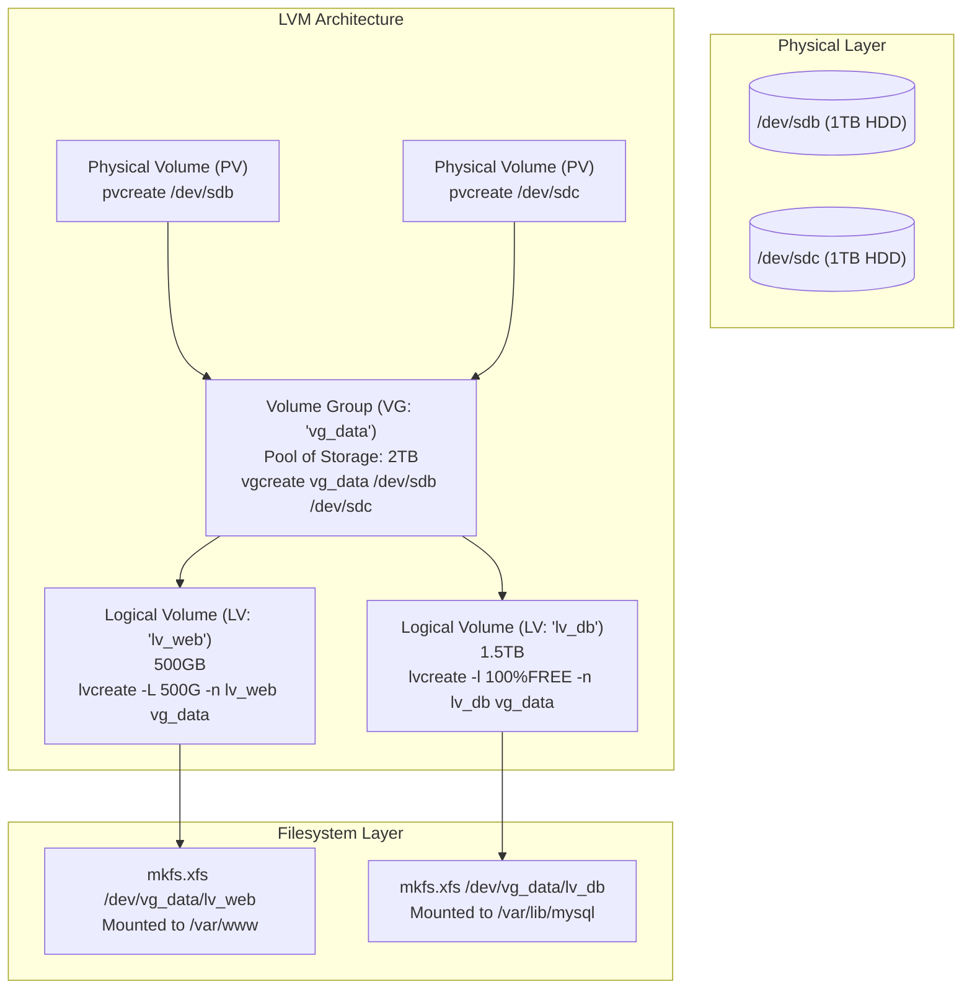

# Chapter 19: Linux Automation & System Hardening (Textbook Edition)

This document provides a comprehensive, engineering-level deep dive into Linux system administration, security hardening, and advanced automation. It heavily contrasts the architectures of the two dominant enterprise ecosystems: **Red Hat Enterprise Linux (RHEL)** and **Ubuntu/Debian**.

---

## 1. The Core OS, Filesystem & Disk Management

### 1.1 The Filesystem Hierarchy Standard (FHS) and Virtual Filesystems
A Linux system is fundamentally a unified directory tree. Beyond static directories (`/etc`, `/var`, `/usr`), a senior engineer must master the **virtual filesystems** that interface directly with the kernel.

*   **`/proc` (Process Information Pseudo-Filesystem)**: This does not exist on the hard drive; it is an illusion maintained in RAM by the kernel. Every running process has a directory here named after its Process ID (PID).
    *   *Programmatic Use*: Reading `/proc/cpuinfo` or `/proc/meminfo` allows scripts to dynamically assess hardware. Writing to `/proc/sys/net/ipv4/ip_forward` (or using `sysctl`) changes kernel routing behavior in real-time.
*   **`/sys` (Sysfs)**: Exports information about devices and drivers from the kernel device model to user space. It is strictly used for hardware and power state management (e.g., dynamically disabling a PCI device).

### 1.2 Disk Management & Persistent Storage
Modern Linux storage requires robust partitioning and mounting strategies. 

**Partitioning & Formatting:**
1.  **`parted` / `fdisk`**: Tools to write partition tables (MBR or GPT) to raw block devices (`/dev/sdb`). GPT is mandatory for disks larger than 2TB.
2.  **`mkfs`**: The front-end for formatting. E.g., `mkfs.ext4 /dev/sdb1` (Ubuntu default, journaling) or `mkfs.xfs /dev/sdb1` (RHEL default, high parallel I/O, cannot shrink).

**Persistent Mounting (`/etc/fstab`):**
Never mount using device names (like `/dev/sdb1`), as device initialization order can change upon reboot, breaking the system. Always use the Universally Unique Identifier (UUID).
1.  Run `blkid` to extract the UUID of the formatted partition.
2.  Append to `/etc/fstab`:
    `UUID=1234abcd-12ab-34cd-56ef-1234567890ab  /data  xfs  defaults,noatime  0  2`
    *(Note: `noatime` disables tracking file read times, drastically reducing disk I/O).*

### 1.3 Logical Volume Management (LVM) Architecture
LVM decouples the physical disk from the filesystem, allowing you to seamlessly span partitions across multiple drives, resize them live, and take snapshots.



---

## 2. Process & Resource Management

### 2.1 Deep Dive into `systemd`
Systemd is the initialization system (PID 1) that bootstraps user space and strictly manages services.

**Creating Robust Service Files (`/etc/systemd/system/myapp.service`):**
```ini
[Unit]
Description=High Performance Go API
After=network.target postgresql.service # Dependencies

[Service]
Type=simple
User=apiuser
Group=apigroup
WorkingDirectory=/opt/myapp
ExecStart=/opt/myapp/api_binary --config /etc/myapp/config.yaml
Restart=on-failure
RestartSec=5s

# Hardening / Resource Restrictions
LimitNOFILE=65535         # Ulimit override for open file descriptors
PrivateTmp=true           # Gives the service a segregated /tmp space
ProtectSystem=full        # Mounts /usr, /boot, and /etc read-only for this process

[Install]
WantedBy=multi-user.target # Ensures it starts on boot in headless mode
```

### 2.2 Process States and Resource Control
Processes exist in distinct states: Running (`R`), Sleeping (`S` - waiting for I/O), Stopped (`T`), or Zombie (`Z` - terminated, but parent hasn't reaped it).

*   **`nice` & `renice`**: Manipulates CPU scheduling priority. Range is -20 (highest priority, requires root) to 19 (lowest priority, "nicest" to other processes). Default is 0.
*   **`ulimit`**: Legacy restriction (e.g., `ulimit -n` for max open files). Systemd now largely handles this via `LimitNOFILE` directives.
*   **`cgroups` (Control Groups)**: The modern kernel feature that limits, accounts for, and isolates resource usage (CPU, memory, disk I/O, network) for a collection of processes. Systemd uses cgroups to ensure a runaway web server cannot consume 100% of the CPU, starving the SSH daemon and preventing admin access.

---

## 3. User, Group & Privilege Hardening

### 3.1 Advanced File Permissions
Beyond standard `rwx` (read, write, execute) permissions, Linux features three advanced bits:
1.  **SUID (Set-User-ID) `chmod 4755`**: When a file is executed, it runs with the privileges of the file *owner*, not the user running it. (Crucial for `/usr/bin/passwd` so users can edit `/etc/shadow`).
2.  **SGID (Set-Group-ID) `chmod 2755`**: When applied to a directory, any new files created inside inherit the group of the directory, rather than the primary group of the creating user. Excellent for shared team folders.
3.  **Sticky Bit `chmod 1777`**: Applied to world-writable directories (like `/tmp`). It prevents users from deleting or renaming files owned by other users.

**Access Control Lists (ACLs):**
When standard User/Group/Other permissions are too restrictive, ACLs allow surgical grants.
*   `setfacl -m u:alice:rw /data/report.txt` (Grants *only* user Alice read/write access, ignoring the group).
*   `getfacl /data/report.txt` (Views the exact permissions).

### 3.2 Secure Identity Management (Sudo & PAM)
*   **`/etc/sudoers.d/`**: Never edit `/etc/sudoers` directly. Always drop isolated files into `sudoers.d/` using `visudo`. 
    *   *Example*: `dbadmin ALL=(root) NOPASSWD: /bin/systemctl restart postgresql` allows the `dbadmin` group to restart the DB without a password, but nothing else.
*   **PAM (Pluggable Authentication Modules)**: The central architectural framework for authentication. Located in `/etc/pam.d/`. PAM allows you to dynamically stack authentication rules (e.g., enforcing password complexity via `pam_cracklib`, requiring YubiKey hardware tokens, or locking out accounts after 3 failed SSH attempts via `pam_tally2` / `pam_faillock`).

### 3.3 SSH Hardening
The `/etc/ssh/sshd_config` file must be aggressively locked down on public-facing servers:
```sshdconfig
PermitRootLogin no               # Never allow direct root access
PasswordAuthentication no        # Enforce SSH Key authentication exclusively
X11Forwarding no                 # Disable graphical forwarding to prevent exploits
AllowUsers alice bob deploy      # Whitelist exact users permitted to connect
Port 2222                        # Obfuscate the port to reduce automated bot log spam
```

---

## 4. Security Architectures: SELinux vs. AppArmor

Mandatory Access Control (MAC) systems override standard Linux permissions. Even if a file is `chmod 777` (world readable/writable), MAC can deny a process access to it.

### 4.1 SELinux (Security-Enhanced Linux - RHEL Default)
Developed by the NSA. SELinux assigns **Contexts** (labels) to every file, process, and port. A process (e.g., `httpd_t`) can only interact with files labeled correctly (e.g., `httpd_sys_content_t`).

*   **Viewing Contexts**: Use the `-Z` flag (`ls -lZ`, `ps -eZ`).
*   **Troubleshooting (`audit2allow`)**: When SELinux blocks something, it logs it to `/var/log/audit/audit.log`. You can parse this log using `grep denied /var/log/audit/audit.log | audit2allow -m my_custom_policy` to automatically generate a permanent rule allowing the behavior.
*   **Booleans**: Safe toggles to allow common behavior without writing custom policies.
    *   `setsebool -P httpd_can_network_connect 1` (Allows Nginx/Apache to act as a reverse proxy and connect to backend APIs. The `-P` makes it survive reboots).
*   **File Contexts (`semanage fcontext` & `restorecon`)**: If you move web files to `/opt/www`, you must tell SELinux:
    *   `semanage fcontext -a -t httpd_sys_content_t "/opt/www(/.*)?"` (Updates the central database).
    *   `restorecon -Rv /opt/www` (Physically applies the labels to the files).

### 4.2 AppArmor (Ubuntu/Debian Default)
Instead of labeling every file, AppArmor assigns **Profiles** to specific program binaries. A profile defines exactly what file paths and network capabilities that specific binary is allowed to access.

*   Profiles are stored in `/etc/apparmor.d/`.
*   **Enforce vs Complain Mode**: `aa-complain /usr/sbin/nginx` allows the program to violate its profile, but aggressively logs the violations. Engineers use this during testing to see what the application *wants* to do. Once the profile is adjusted to allow the required actions, they lock it down using `aa-enforce /usr/sbin/nginx`.

---

## 5. Network Security & Configuration

### 5.1 Firewalls: `firewalld` (RHEL) vs. `ufw` (Ubuntu)
Both are high-level frontends manipulating the underlying kernel `nftables`/`iptables`.

*   **`firewalld`**: Uses a **Zones** architecture (e.g., `public`, `dmz`, `internal`). Interfaces are assigned to zones, and rules are assigned to zones.
    *   `firewall-cmd --zone=public --add-service=https --permanent`
    *   `firewall-cmd --reload`
*   **`ufw` (Uncomplicated Firewall)**: Simpler, rule-based firewall.
    *   `ufw default deny incoming`
    *   `ufw limit ssh` (Allows SSH but rate-limits brute force attempts).
    *   `ufw allow 80,443/tcp`
    *   `ufw enable`

### 5.2 Deep Network Diagnostics
*   **`ip` suite**: The modern replacement for `ifconfig` and `route`.
    *   `ip a` (Addresses and MACs).
    *   `ip route` (Routing table: determines where traffic goes).
    *   `ip link set eth0 down` (Brings interface offline).
*   **`ss` (Socket Statistics)**: Replacement for `netstat`. Directly queries kernel memory for immense speed.
    *   `ss -tulnp` (TCP, UDP, Listening, Numeric ports/IPs, Processes). Essential for seeing what application is binding to port 8080.
*   **`tcpdump`**: The ultimate packet analyzer.
    *   `tcpdump -i eth0 tcp port 443 -n` (Sniff all HTTPS traffic on interface eth0, avoiding slow reverse-DNS lookups).
    *   `tcpdump -i any host 10.0.0.5 -w capture.pcap` (Capture all traffic communicating with a specific host and write to a binary file for Wireshark analysis).

---

## 6. True Text Processing Mastery: `awk` & `sed`

### 6.1 `sed` (Stream Editor) Deep Dive
`sed` modifies streams of text on the fly. 
*   **In-place editing**: `-i` modifies the file on disk. (Always backup: `-i.bak`).
*   **Address Ranges**: `sed '10,20d' file.txt` (Deletes lines 10 through 20).
*   **Regex Capturing & Replacing**:
    `sed -E 's/([A-Z]+)\s+([0-9]+)/\2 - \1/g' file.txt`
    *(Finds "WORD 123" and flips it to "123 - WORD" using backreferences `\1` and `\2`).*
*   **Multi-line Parsing (`N`, `P`, `D`)**: `sed` processes one line at a time. The `N` command pulls the *next* line into the pattern space, allowing you to run regex across physical line breaks.

### 6.2 `awk` Deep Dive
`awk` is a fully featured data processing language. It splits every line into variables based on the Field Separator (`FS`, default is whitespace).
*   `$0` = The entire line. `$1` = First column. `$NF` = The very last column.
*   **`BEGIN` and `END` blocks**: `BEGIN` runs once before any text is read (perfect for initializing variables or headers). `END` runs after the entire file is processed (perfect for printing totals).

**Complex Use Case: Parsing Nginx Access Logs**
Calculate the total bandwidth (in Megabytes) consumed by strictly successful (HTTP 200) requests, grouped by IP address.
```bash
awk '
    # Initialize variables before reading the file
    BEGIN { print "--- Bandwidth Usage per IP (HTTP 200 Only) ---" }
    
    # Process each line: If Field 9 (Status) is 200
    $9 == "200" {
        # Add Field 10 (Bytes) to an associative array, keyed by Field 1 (IP)
        ip_bytes[$1] += $10
    }
    
    # After the file is fully processed, print the results
    END {
        for (ip in ip_bytes) {
            # Convert bytes to MB (Bytes / 1024 / 1024)
            printf "%-15s : %.2f MB\n", ip, ip_bytes[ip] / 1048576
        }
    }
' /var/log/nginx/access.log
```

---

## 7. Advanced & Defensive Shell Scripting

### 7.1 Defensive Execution Context
Every production script must begin with this strict directive:
```bash
set -euo pipefail
# -e: Exit immediately if ANY command returns a non-zero exit code.
# -u: Exit immediately if attempting to use an uninitialized/undefined variable.
# -o pipefail: If a command inside a pipeline fails (e.g., `failing_cmd | grep "foo"`), 
#              the entire pipeline fails, rather than hiding the error behind grep's success.
```

### 7.2 Signal Handling with `trap`
When scripts create temporary files, database locks, or mounts, a sudden user cancellation (Ctrl+C / `SIGINT`) can leave the system in a broken state. `trap` intercepts signals and runs a guaranteed cleanup function.
```bash
TEMP_DIR=$(mktemp -d)
cleanup() {
    echo "Caught exit signal! Cleaning up ${TEMP_DIR}..."
    rm -rf "${TEMP_DIR}"
}
trap cleanup EXIT ERR SIGINT SIGTERM
```

### 7.3 Bash Arrays (Indexed and Associative)
```bash
# Indexed Array
declare -a PORTS=(80 443 8080)
for p in "${PORTS[@]}"; do echo "Scanning port $p"; done

# Associative Array (Key-Value map. Requires Bash 4+)
declare -A DB_CONFIG
DB_CONFIG=( ["host"]="10.0.0.5" ["user"]="dbadmin" ["port"]="5432" )
echo "Connecting to ${DB_CONFIG["host"]} on port ${DB_CONFIG["port"]}..."
```

### 7.4 Multi-Threading & Parallel Processing in Bash
Bash processes synchronously by default. For massive workloads, you must invoke parallel execution.
*   **Background Jobs (`&` and `wait`)**:
    ```bash
    for server in "${SERVERS[@]}"; do
        ssh root@$server "apt-get update" &   # The & throws the task to the background
    done
    wait # Pauses script execution until all background jobs complete
    echo "All servers updated simultaneously!"
    ```
*   **`xargs -P` (Multi-Core Processing)**:
    `cat list_of_1000_images.txt | xargs -n 1 -P 8 optimize_image_tool`
    *(Pulls 1 image at a time (`-n 1`) and keeps exactly 8 instances of the optimization tool running concurrently (`-P 8`), maximizing an 8-core CPU).*

---

## 8. The Master Automation Script

Below is a production-grade, defensive script that orchestrates OS detection, Logical Volume Management (LVM), advanced text processing (`sed`/`awk`), and Mandatory Access Control (SELinux) configuration to deploy a hardened Nginx web server.

```bash
#!/usr/bin/env bash
# ==============================================================================
# Script:  enterprise_nginx_deploy.sh
# Purpose: Defensively provision LVM, install Nginx, harden configs, and setup MAC.
# Target:  RHEL/CentOS or Ubuntu/Debian (Auto-detected)
# ==============================================================================

# 1. STRICT DEFENSIVE CONTEXT
set -euo pipefail

# 2. VARIABLE DEFINITIONS
readonly DOMAIN="app.internal"
readonly LVM_VG="vg_data"
readonly LVM_LV="lv_www"
readonly MOUNT_POINT="/var/www"
readonly WEB_ROOT="${MOUNT_POINT}/${DOMAIN}"
readonly TEMP_CONF=$(mktemp)

# 3. SIGNAL HANDLING (TRAP)
cleanup() {
    echo "[INFO] Cleaning up temporary configurations..."
    rm -f "${TEMP_CONF}"
}
trap cleanup EXIT ERR SIGINT SIGTERM

# 4. PRIVILEGE VALIDATION
if [[ "${EUID}" -ne 0 ]]; then
    echo "[ERROR] Deployment must be run as root." >&2
    exit 1
fi

# 5. OS DETECTION & PACKAGE MANAGEMENT
echo "[INFO] Detecting Operating System..."
if grep -qi -E 'redhat|centos|rocky' /etc/os-release; then
    readonly OS_FAMILY="RHEL"
    readonly PKG_MGR="dnf"
    readonly FIREWALL="firewalld"
elif grep -qi -E 'ubuntu|debian' /etc/os-release; then
    readonly OS_FAMILY="DEBIAN"
    readonly PKG_MGR="apt-get"
    readonly FIREWALL="ufw"
else
    echo "[ERROR] Unsupported OS." >&2
    exit 1
fi

echo "[INFO] OS detected: ${OS_FAMILY}. Updating repositories and installing Nginx..."
if [[ "${OS_FAMILY}" == "RHEL" ]]; then
    ${PKG_MGR} update -y
    ${PKG_MGR} install -y nginx firewalld lvm2
else
    ${PKG_MGR} update -qq
    ${PKG_MGR} install -y -qq nginx ufw lvm2
fi

# 6. LOGICAL VOLUME MANAGEMENT (LVM)
# Assuming /dev/sdb is a raw unformatted drive attached to the VM for web data
echo "[INFO] Configuring LVM on /dev/sdb..."
if ! vgs ${LVM_VG} >/dev/null 2>&1; then
    pvcreate /dev/sdb
    vgcreate ${LVM_VG} /dev/sdb
    lvcreate -l 100%FREE -n ${LVM_LV} ${LVM_VG}
    mkfs.xfs /dev/${LVM_VG}/${LVM_LV}
    
    # Persistent mount via fstab
    mkdir -p ${MOUNT_POINT}
    echo "/dev/${LVM_VG}/${LVM_LV}  ${MOUNT_POINT}  xfs  defaults,noatime  0  2" >> /etc/fstab
    mount -a
fi

echo "[INFO] Creating web root at ${WEB_ROOT}..."
mkdir -p "${WEB_ROOT}"
echo "<h1>Secured Enterprise Nginx</h1>" > "${WEB_ROOT}/index.html"

if [[ "${OS_FAMILY}" == "RHEL" ]]; then
    chown -R nginx:nginx "${MOUNT_POINT}"
else
    chown -R www-data:www-data "${MOUNT_POINT}"
fi
chmod -R 2755 "${MOUNT_POINT}" # SGID applied

# 7. SELINUX MAC CONFIGURATION (RHEL ONLY)
if [[ "${OS_FAMILY}" == "RHEL" ]] && getenforce | grep -qi 'Enforcing'; then
    echo "[INFO] Configuring SELinux Contexts for ${MOUNT_POINT}..."
    semanage fcontext -a -t httpd_sys_content_t "${MOUNT_POINT}(/.*)?"
    restorecon -Rv "${MOUNT_POINT}"
fi

# 8. TEXT PROCESSING (SED & AWK): Hardening Nginx
echo "[INFO] Hardening Nginx Configuration (Disabling Server Tokens)..."
readonly NGINX_CONF="/etc/nginx/nginx.conf"
if grep -q "server_tokens" "${NGINX_CONF}"; then
    sed -i -E 's/.*server_tokens.*/\tserver_tokens off;/' "${NGINX_CONF}"
else
    # Inject directly inside the http {} block using awk
    awk '/http \{/ { print; print "\tserver_tokens off;"; next }1' "${NGINX_CONF}" > "${TEMP_CONF}"
    mv "${TEMP_CONF}" "${NGINX_CONF}"
fi

# 9. FIREWALL CONFIGURATION
echo "[INFO] Configuring Firewall (${FIREWALL})..."
if [[ "${FIREWALL}" == "firewalld" ]]; then
    systemctl enable --now firewalld
    firewall-cmd --zone=public --add-service=http --permanent
    firewall-cmd --reload
elif [[ "${FIREWALL}" == "ufw" ]]; then
    ufw allow 'Nginx HTTP'
    ufw allow 'OpenSSH'
    ufw --force enable
fi

# 10. SYSTEMD SERVICE REGISTRATION
echo "[INFO] Enabling and starting Nginx via systemd..."
systemctl daemon-reload
systemctl enable --now nginx
systemctl restart nginx

echo "[SUCCESS] Enterprise Deployment Complete."
exit 0
```
