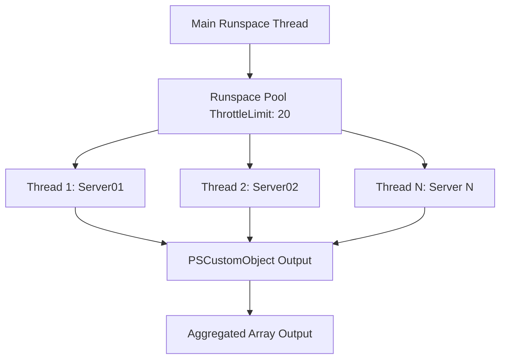

# Windows Infrastructure Architect Guide to PowerShell Mastery

Welcome to the definitive, deep-dive technical reference on PowerShell designed for Enterprise Infrastructure Architects and DevOps Engineers. This guide explores the intricate mechanisms that make PowerShell one of the most powerful automation frameworks in the enterprise ecosystem. We will eschew summaries in favor of comprehensive analysis, addressing edge cases, deep internal mechanics, and real-world implementation strategies.

---

## 1. The Object Paradigm: .NET Objects vs. Text Streams

PowerShell represents a fundamental paradigm shift from traditional Unix-like shells (e.g., bash, zsh). While traditional shells rely on plain text streams and require string parsing utilities like `grep`, `awk`, and `sed`, PowerShell is built directly on top of the .NET framework. It operates on structured, strongly-typed .NET objects.

### The Object Pipeline

When you pipe a command in PowerShell (`|`), you are not passing a string of characters; you are passing instances of .NET classes. This means all properties, methods, and types are preserved as the data travels through the pipeline. 


Consider the following scenario where you want to kill any process consuming more than 1GB of memory. In a text-based shell, you would run `ps`, use `awk` to extract specific columns, perform math on a string representation of bytes, and pipe PIDs to `kill`. In PowerShell, the pipeline natively understands the numeric properties.

```powershell
Get-Process | Where-Object { $_.WorkingSet64 -gt 1GB } | Stop-Process -Force -WhatIf
```

The `$_` (or `$PSItem`) variable represents the current object in the pipeline. Because `Get-Process` returns an array of `System.Diagnostics.Process` objects, PowerShell knows that `WorkingSet64` is an Int64, allowing native operators like `-gt` (greater than) and byte multipliers like `1GB` to function without string manipulation.

### Type System and Get-Member

The most crucial cmdlet in PowerShell is `Get-Member`. It inspects the structure of the objects coming through the pipeline using .NET reflection.

```powershell
# Inspecting the properties and methods of a Service object
Get-Service -Name "WinRM" | Get-Member
```

This reveals whether properties are ScriptProperties, NoteProperties, or AliasProperties, and exposes Methods you can invoke (like `.Stop()` or `.Start()`). When building robust enterprise scripts, you should constantly introspect your objects. Sometimes you receive a generic `PSObject`, and sometimes a specific WMI class like `ManagementBaseObject`.

### Providers and PSDrives

PowerShell abstracts data stores into a unified hierarchical structure called PSDrives, facilitated by Providers. You interact with the Registry, Active Directory, Certificates, and Environment Variables exactly as you interact with the File System.

```powershell
# View all active Providers
Get-PSProvider

# Navigate into the Local Machine Registry
Set-Location HKLM:\Software\Microsoft\Windows\CurrentVersion\Run
Get-ChildItem

# Inspect Environment Variables
Get-ChildItem Env: | Where-Object { $_.Name -match "^PATH" }
```

By abstracting these stores behind a unified set of Cmdlets (Get-Item, Set-ItemProperty, New-Item), PowerShell eliminates the need for disparate APIs or commands (like `reg.exe` or `setx`), bringing standardization to infrastructure management.

---

## 2. Advanced Functions: Building Professional Tools

To transition from "writing scripts" to "developing tooling," you must harness Advanced Functions. A basic PowerShell function acts like a simple block of code. An Advanced Function behaves exactly like a compiled C# Cmdlet.

### CmdletBinding and Parameter Validation

By simply declaring `[CmdletBinding()]` at the top of your parameter block, PowerShell automatically integrates your function with the runtime, granting it parameters like `-Verbose`, `-Debug`, `-ErrorAction`, and `-WhatIf` automatically. 

Parameter validation attributes ensure your function fails fast before execution begins.

```powershell
function Restart-EnterpriseService {
    [CmdletBinding(SupportsShouldProcess=$true, ConfirmImpact='High')]
    param(
        [Parameter(Mandatory=$true, ValueFromPipeline=$true, ValueFromPipelineByPropertyName=$true)]
        [ValidateNotNullOrEmpty()]
        [ValidatePattern("^(W3SVC|MSSQLSERVER|WinRM)$")]
        [string[]]$ServiceName,

        [Parameter(Mandatory=$false)]
        [ValidateRange(1, 10)]
        [int]$RetryCount = 3
    )

    # Function body...
}
```

### The Pipeline Lifecycle: Begin, Process, and End Blocks

When a function accepts input from the pipeline (`ValueFromPipeline=$true`), the function executes in three distinct phases. If you do not explicitly define these blocks, PowerShell implicitly wraps your entire code in an `End` block, meaning it will only process the *last* item in the pipeline.

```powershell
function Invoke-PipelineAnalysis {
    [CmdletBinding()]
    param(
        [Parameter(ValueFromPipeline=$true)]
        [int]$Number
    )

    Begin {
        Write-Verbose "Begin block runs ONCE before any pipeline objects arrive."
        $TotalSum = 0
        $ItemCount = 0
    }
    Process {
        Write-Verbose "Process block runs ONCE FOR EACH object in the pipeline. Processing: $Number"
        $TotalSum += $Number
        $ItemCount++
    }
    End {
        Write-Verbose "End block runs ONCE after all objects have been processed."
        [PSCustomObject]@{
            TotalItems = $ItemCount
            Sum = $TotalSum
            Average = ($TotalSum / $ItemCount)
        }
    }
}

# Example usage
1, 2, 3, 4, 5 | Invoke-PipelineAnalysis -Verbose
```

### Modules (.psm1) and Export-ModuleMember

A module is a package containing PowerShell commands. To build a `.psm1` module, you define your functions and strictly control what is exposed to the user using `Export-ModuleMember`. This allows you to have "private" helper functions and "public" consumer functions.

```powershell
# File: EnterpriseTools.psm1

function Get-InternalSecret {
    # Private helper function, not exported
    return "SuperSecretValue"
}

function Get-EnterpriseConfig {
    [CmdletBinding()]
    param()
    $Secret = Get-InternalSecret
    return [PSCustomObject]@{ Status = "Configured"; Token = $Secret }
}

# Only export the public API
Export-ModuleMember -Function Get-EnterpriseConfig
```

You would load this module into memory using `Import-Module .\EnterpriseTools.psm1`.

---

## 3. Enterprise Debugging and Error Handling

Enterprise scripts must fail gracefully. Silent failures in automated provisioning systems create catastrophic security and operational liabilities.

### Strict Mode and Error Preferences

Before writing any logic, harden the execution environment.

```powershell
# Forces you to declare variables before using them, preventing typos from becoming silent nulls.
Set-StrictMode -Version Latest

# Forces non-terminating errors (like a file not found) to become terminating exceptions.
$ErrorActionPreference = 'Stop'
```

### Terminating vs. Non-Terminating Errors

PowerShell differentiates between:
1. **Terminating Errors**: Exceptions that halt pipeline execution immediately (e.g., Syntax errors, OutOfMemory, `throw`).
2. **Non-Terminating Errors**: Issues where the cmdlet can continue processing subsequent items (e.g., trying to stop 5 services and 1 is missing).

By setting `$ErrorActionPreference = 'Stop'`, we force Non-Terminating errors to throw a `System.Management.Automation.ActionPreferenceStopException`, which can be caught in a `try/catch` block.

### Try / Catch / Finally Architecture

The `try/catch/finally` syntax allows precise control over exception flows.

```powershell
function Remove-StaleFiles {
    [CmdletBinding()]
    param(
        [string]$Path
    )

    try {
        Write-Verbose "Attempting to read directory: $Path"
        $Files = Get-ChildItem -Path $Path -ErrorAction Stop
        
        foreach ($File in $Files) {
            Remove-Item -Path $File.FullName -Force -ErrorAction Stop
        }
    }
    catch [System.UnauthorizedAccessException] {
        Write-Error "Access denied. Are you running as Administrator?"
        # Handle specifically
    }
    catch [System.Management.Automation.ItemNotFoundException] {
        Write-Warning "Directory not found, skipping: $Path"
    }
    catch {
        # The generic catch block captures the $_ variable (the ErrorRecord)
        $Exception = $_.Exception
        Write-Error "A fatal generic error occurred: $($Exception.Message)`n$($Exception.StackTrace)"
        throw # Re-throw up the call stack
    }
    finally {
        Write-Verbose "Cleanup operations execute regardless of success or failure."
        # Close database connections, dispose handles, remove temp files, etc.
    }
}
```

---

## 4. Parallelism: Runspaces and Multi-threading

PowerShell is inherently single-threaded. Standard `ForEach-Object` processes items sequentially. For massive tasks (pinging 10,000 servers), sequential execution takes hours.

### Runspaces vs Jobs

- **PowerShell Jobs (`Start-Job`)**: Spin up entirely new `powershell.exe` processes. High memory overhead, slow startup. Good for a few background tasks.
- **Runspaces**: Spin up new threads within the existing `powershell.exe` process. Extremely fast, low memory overhead. Requires complex runspace pool management.

### ForEach-Object -Parallel (PowerShell 7+)

PowerShell 7 introduced the `-Parallel` switch to `ForEach-Object`, wrapping the complex C# RunspacePool APIs into a native, elegant syntax.

```powershell
# Requires PowerShell 7 or later
$Servers = @("Server01", "Server02", "Server03", "Server04", "Server05")

$Results = $Servers | ForEach-Object -Parallel {
    # Inside this block, we are in a separate runspace.
    # We must use the $using: scope modifier to access variables from the parent thread.
    $Target = $_
    $StartTime = Get-Date
    
    try {
        $Ping = Test-Connection -TargetName $Target -Count 1 -ErrorAction Stop
        [PSCustomObject]@{
            ComputerName = $Target
            Status = "Online"
            LatencyMs = $Ping.Latency
            Timestamp = $StartTime
        }
    }
    catch {
        [PSCustomObject]@{
            ComputerName = $Target
            Status = "Offline"
            LatencyMs = $null
            Timestamp = $StartTime
        }
    }
} -ThrottleLimit 20 # Run up to 20 threads simultaneously

$Results | Format-Table
```



---

## 5. DevOps Integration: WMI/CIM, Remoting, and REST

Modern infrastructure requires interfacing with disparate systems.

### WMI vs CIM

Windows Management Instrumentation (WMI) is the older, DCOM-based infrastructure. Common Information Model (CIM) is the newer standard, leveraging WinRM (WS-Management). **Always use CIM over WMI in modern environments.** DCOM is unfirewall-friendly; WinRM operates over HTTP/HTTPS (ports 5985/5986).

```powershell
# Querying BIOS serial number via CIM
Get-CimInstance -ClassName Win32_BIOS -ComputerName "Server01"
```

### PowerShell Remoting (WinRM/WSMan)

PowerShell Remoting allows you to execute commands interactively or programmatically on remote nodes.

```powershell
# Interactive Session
Enter-PSSession -ComputerName "Server01" -Credential (Get-Credential)

# Programmatic Execution returning objects back to the caller
$Services = Invoke-Command -ComputerName "Server01", "Server02" -ScriptBlock {
    Get-Service | Where-Object Status -eq 'Running'
}
```
When `Invoke-Command` returns objects, they are serialized to XML over the wire and deserialized back into objects on your local machine. These deserialized objects are "snapshots" — their methods (like `.Stop()`) no longer function because they are disconnected from the remote process.

### REST API Integration

`Invoke-RestMethod` converts JSON responses directly into PowerShell custom objects, bridging the gap between Windows engineering and modern cloud APIs.

```powershell
# Interacting with a generic REST API (e.g., fetching a bearer token)
$Uri = "https://api.enterprise.local/v1/auth"
$Headers = @{
    "Authorization" = "Basic " + [Convert]::ToBase64String([Text.Encoding]::ASCII.GetBytes("user:pass"))
    "Content-Type"  = "application/json"
}

try {
    $Response = Invoke-RestMethod -Uri $Uri -Method Post -Headers $Headers
    $BearerToken = $Response.token
    Write-Output "Successfully authenticated. Token expires in $($Response.expires_in) seconds."
}
catch {
    Write-Error "API Authentication failed. HTTP Status: $($_.Exception.Response.StatusCode)"
}
```

---

## 6. The Master Script: Enterprise Server Diagnostics and Provisioning

We culminate this guide with an enterprise-grade script showcasing the convergence of the principles discussed. The script connects to a remote server, assesses storage using CIM, provisions a secure local service account using Remoting, and produces a deeply nested JSON artifact suitable for ingestion by an orchestration engine.

The full executable script is saved as `20_PowerShell_Mastery.ps1`. Below is the complete source code accompanied by deep architectural commentary.

### Complete Master Script Code

```powershell
<#
.SYNOPSIS
    Master Script: Enterprise Server Diagnostics and Provisioning
.DESCRIPTION
    This script connects to a remote server, queries CIM for disk usage,
    provisions a local user securely, and outputs a JSON report.
    It demonstrates advanced enterprise PowerShell features including CIM sessions,
    secure strings, remote execution, and structured object output.
#>

[CmdletBinding()]
param(
    [Parameter(Mandatory=$true, HelpMessage="The hostname or IP address of the target server.")]
    [ValidateNotNullOrEmpty()]
    [string]$ComputerName,

    [Parameter(Mandatory=$true, HelpMessage="The username of the local user to provision.")]
    [ValidateNotNullOrEmpty()]
    [string]$NewUsername,

    [Parameter(Mandatory=$true, HelpMessage="The secure password for the new local user.")]
    [System.Security.SecureString]$NewUserPassword
)

# Enforce strict parsing rules to catch uninitialized variables and syntax issues
Set-StrictMode -Version Latest

# Promote all errors to terminating errors for robust exception handling
$ErrorActionPreference = 'Stop'

function Get-SystemDiskInfo {
    <#
    .SYNOPSIS
        Retrieves logical disk space information via CIM.
    .DESCRIPTION
        Establishes a CIM session to the target computer and queries the Win32_LogicalDisk
        class. Calculates gigabytes and percentage of free space, returning custom objects.
    #>
    [CmdletBinding()]
    param(
        [Parameter(Mandatory=$true)]
        [string]$ComputerName
    )
    
    try {
        Write-Verbose "Connecting to CIM session on $ComputerName"
        $CimSessionOptions = New-CimSessionOption -Protocol WSMAN
        $CimSession = New-CimSession -ComputerName $ComputerName -SessionOption $CimSessionOptions
        
        # DriveType=3 corresponds to Local Fixed Disk
        Write-Verbose "Querying Win32_LogicalDisk for fixed drives."
        $LogicalDisks = Get-CimInstance -CimSession $CimSession -ClassName Win32_LogicalDisk -Filter "DriveType=3"
        
        $DiskData = foreach ($Disk in $LogicalDisks) {
            $FreeSpaceGB = [math]::Round($Disk.FreeSpace / 1GB, 2)
            $TotalSizeGB = [math]::Round($Disk.Size / 1GB, 2)
            $PercentFree = if ($TotalSizeGB -gt 0) { [math]::Round(($FreeSpaceGB / $TotalSizeGB) * 100, 2) } else { 0 }
            
            [PSCustomObject]@{
                DriveLetter = $Disk.DeviceID
                VolumeName  = $Disk.VolumeName
                TotalSizeGB = $TotalSizeGB
                FreeSpaceGB = $FreeSpaceGB
                PercentFree = $PercentFree
            }
        }
        
        Write-Verbose "Closing CIM session."
        Remove-CimSession -CimSession $CimSession
        return $DiskData
    }
    catch {
        Write-Error "Failed to retrieve disk information from $ComputerName. Detailed Error: $($_.Exception.Message)"
        throw
    }
}

function Invoke-UserProvisioning {
    <#
    .SYNOPSIS
        Provisions a new local user on a remote system.
    .DESCRIPTION
        Uses PowerShell Remoting (Invoke-Command) to create a local user and
        adds them to the local Administrators group. Checks for existing users.
    #>
    [CmdletBinding()]
    param(
        [Parameter(Mandatory=$true)]
        [string]$ComputerName,

        [Parameter(Mandatory=$true)]
        [string]$Username,

        [Parameter(Mandatory=$true)]
        [System.Security.SecureString]$Password
    )
    
    $ScriptBlock = {
        param(
            [string]$LocalUsername,
            [System.Security.SecureString]$LocalPassword
        )
        
        try {
            $UserParams = @{
                Name                 = $LocalUsername
                Password             = $LocalPassword
                FullName             = "Provisioned Service Account"
                Description          = "Account created via automated DevOps provisioning script"
                PasswordNeverExpires = $true
            }
            
            # Check if user already exists
            if (Get-LocalUser -Name $LocalUsername -ErrorAction SilentlyContinue) {
                Write-Output "User '$LocalUsername' already exists on the target system. Skipping creation."
                return $false
            }
            
            Write-Verbose "Creating new local user account."
            New-LocalUser @UserParams | Out-Null
            
            Write-Verbose "Adding user to the Administrators group."
            Add-LocalGroupMember -Group "Administrators" -Member $LocalUsername
            
            Write-Output "Successfully created user '$LocalUsername' and granted Administrator privileges."
            return $true
        }
        catch {
            Write-Error "Failed to provision user locally. Error: $($_.Exception.Message)"
            throw
        }
    }
    
    try {
        Write-Verbose "Invoking remote provisioning command on $ComputerName"
        $Result = Invoke-Command -ComputerName $ComputerName -ScriptBlock $ScriptBlock -ArgumentList $Username, $Password
        return $Result
    }
    catch {
        Write-Error "Remote execution failed during user provisioning. Error: $($_.Exception.Message)"
        throw
    }
}

try {
    Write-Verbose "Starting master execution sequence for $ComputerName"
    
    # Initialize the report structure
    $Report = [PSCustomObject]@{
        ExecutionTime      = (Get-Date).ToUniversalTime().ToString('yyyy-MM-ddTHH:mm:ssZ')
        TargetComputer     = $ComputerName
        DiskInformation    = $null
        ProvisioningStatus = $null
    }
    
    # 1. Query CIM for disk usage
    Write-Verbose "Step 1: Gathering disk usage diagnostics."
    $Report.DiskInformation = Get-SystemDiskInfo -ComputerName $ComputerName
    
    # 2. Provision local user securely
    Write-Verbose "Step 2: Provisioning local administrator account."
    $ProvisionResult = Invoke-UserProvisioning -ComputerName $ComputerName -Username $NewUsername -Password $NewUserPassword
    
    # Analyze the result array since Invoke-Command returns an array potentially containing Verbose records
    if ($ProvisionResult -contains $true) {
        $Report.ProvisioningStatus = "Success"
    } elseif ($ProvisionResult -contains $false) {
        $Report.ProvisioningStatus = "Skipped - User Existed"
    } else {
        $Report.ProvisioningStatus = "Unknown Status"
    }
    
    # 3. Output JSON report
    Write-Verbose "Step 3: Generating final JSON payload."
    $JsonReport = $Report | ConvertTo-Json -Depth 10 -Compress:$false
    
    Write-Output $JsonReport
}
catch {
    Write-Error "Master script execution terminated unexpectedly due to an unhandled exception. Error: $($_.Exception.Message)"
}
finally {
    Write-Verbose "Execution sequence completed and resources released."
}
```

### Architectural Breakdown

1. **Parameters & SecureStrings**: The script requires a `System.Security.SecureString` for the password. Standard strings exist in plain text in memory. SecureStrings are encrypted by the Data Protection API (DPAPI) in RAM and are required for cmdlets like `New-LocalUser`, ensuring secrets are never leaked in transcript logs or memory dumps.
2. **CIM Session Management**: Instead of utilizing `Get-CimInstance` directly with a `-ComputerName` parameter (which spins up temporary connections), we explicitly define a `New-CimSessionOption -Protocol WSMAN` to enforce WinRM communication, create a persistent `New-CimSession`, execute queries over that established channel, and finally tear it down. This is vastly more efficient for bulk operations and handles multi-domain routing cleanly.
3. **Data Transformations**: The CIM class `Win32_LogicalDisk` returns byte counts in Int64. We dynamically process this data during iteration using static .NET math methods `[math]::Round()` to generate human-readable metrics natively. We trap zero-byte edge cases to prevent division-by-zero exceptions.
4. **Remote ScriptBlock Injection**: `Invoke-UserProvisioning` encapsulates logic intended for execution on the target node inside a `$ScriptBlock`. The parameters `$Username` and `$Password` exist in the local scope. We pass them over the WSMan channel using `-ArgumentList`, bridging the scope gap securely. The inner logic checks for existing state (idempotency), which is critical for Infrastructure-as-Code principles.
5. **JSON Serialization**: The hierarchical object `$Report` is converted via `ConvertTo-Json -Depth 10`. Setting `-Depth` is a crucial PowerShell idiom. By default, `ConvertTo-Json` silently truncates object serialization at a depth of 2, often leading to missing nested data arrays in complex pipelines. Specifying explicit depth guarantees full fidelity output.
