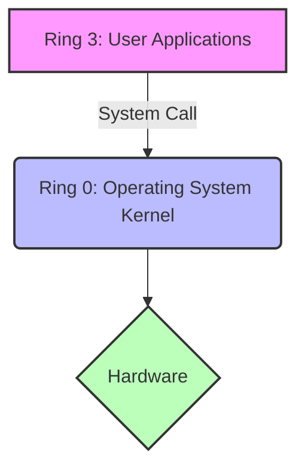
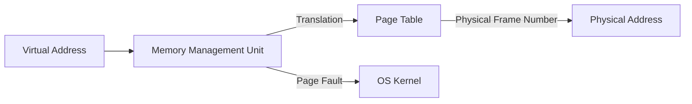
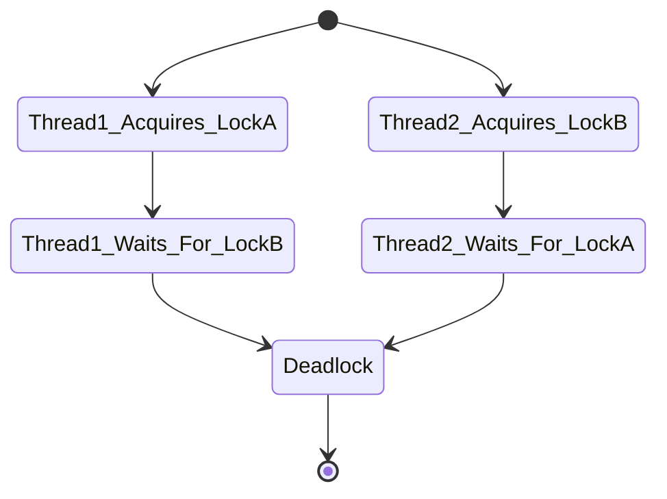
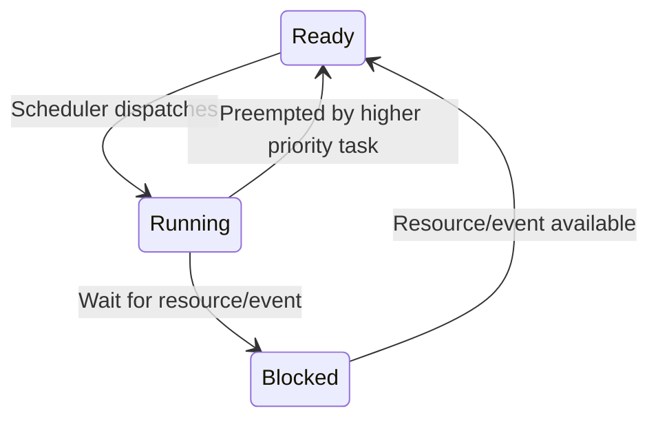
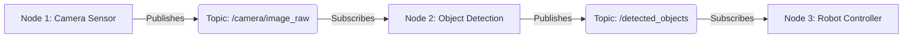

# Chapter 21: Operating System Architecture

## 1. Linux Internals

### User Space vs. Kernel Space
Modern operating systems fundamentally divide system memory and execution context into two primary domains: User Space and Kernel Space. This bifurcation is the cornerstone of system security, stability, and resource management.

- **User Space:** This is the unprivileged area where all user applications (e.g., web browsers, text editors, user-level daemons) execute. Code running here cannot directly access hardware or critical system structures. If an application crashes in User Space, it generally does not bring down the entire system.
- **Kernel Space:** This is a privileged area reserved strictly for the core operating system kernel, kernel extensions, and most device drivers. Code here has unrestricted access to the underlying hardware and all memory. A crash or fatal error in Kernel Space typically results in a system-wide panic (Kernel Panic).

### Ring 0 vs. Ring 3
The x86 architecture implements hardware-level privilege rings, ranging from Ring 0 (most privileged) to Ring 3 (least privileged).

- **Ring 0 (Kernel Mode):** Operating systems execute their core in Ring 0. Instructions that modify system state, manage memory (like manipulating CR3 for page tables), or interact with I/O devices can only be executed here.
- **Ring 3 (User Mode):** User applications run in Ring 3. They are restricted from executing privileged instructions.

### System Calls
A system call (syscall) is the programmatic mechanism through which a computer program requests a service from the kernel of the operating system it is executed on. It provides the essential interface between a process and the operating system.

When a user application needs to perform an action like reading a file, it issues a system call. This involves:
1. Setting up arguments in specific CPU registers (e.g., `RAX` for the syscall number on x86_64).
2. Executing a specialized instruction (e.g., `syscall` or `sysenter`) which triggers a software interrupt.
3. The CPU transitions from Ring 3 to Ring 0, saving the user state and jumping to a predefined kernel entry point (the system call handler).
4. The kernel validates the request, performs the operation, and then returns execution to User Space.

**Example with `strace`:**
The `strace` utility intercepts and records the system calls which are called by a process. For example, running `strace ls` will output numerous syscalls like `execve`, `mmap`, `openat`, and `write`.

### Virtual Memory, Paging, and the MMU
Virtual Memory abstracts physical memory into a contiguous address space for each process, ensuring process isolation and allowing the system to use more memory than physically available via swapping.

- **Paging:** Memory is divided into fixed-size blocks called pages (typically 4KB). Physical memory is divided into page frames of the same size. The OS maintains a Page Table for each process, mapping virtual pages to physical frames.
- **Memory Management Unit (MMU):** The MMU is hardware that translates virtual addresses to physical addresses on the fly using the Page Table. If a virtual page is not currently in physical memory, the MMU triggers a Page Fault interrupt, prompting the kernel to fetch it from disk (swap).

### Completely Fair Scheduler (CFS)
The CFS is the default process scheduler in Linux for normal tasks. It models an "ideal, precise multi-tasking CPU" on real hardware.
- Instead of using timeslices and priority queues, CFS uses a Red-Black Tree to track the "virtual runtime" (`vruntime`) of each runnable task.
- Tasks that have run less (smaller `vruntime`) are placed on the left side of the tree and are chosen next.
- Priority is handled via weights; higher priority tasks have their `vruntime` increase more slowly, allowing them to be scheduled more frequently.

## 2. Windows NT Internals

### NT Kernel Architecture
Windows NT is a highly modular, hybrid kernel architecture.
- **Executive:** Contains base OS services like Memory Management, Process and Thread Management, I/O Manager, and Security Reference Monitor.
- **Microkernel:** Handles basic thread scheduling, interrupt and exception dispatching, and multiprocessor synchronization.
- **Hardware Abstraction Layer (HAL):** Isolates the kernel and executive from hardware differences.

### Registry Structure
The Windows Registry is a hierarchical database used to store low-level settings for the OS and applications.
It is organized into Hives (e.g., `HKEY_LOCAL_MACHINE`, `HKEY_CURRENT_USER`), Keys (acting like folders), and Values (acting like files). Internally, the registry is heavily memory-mapped to ensure fast access and is critical to the boot process.

### NTFS Features
New Technology File System (NTFS) provides enterprise-class features over FAT32:
- **Journaling:** Logs changes before they are committed, preventing corruption during power loss.
- **Security:** Access Control Lists (ACLs) per file/folder.
- **Alternate Data Streams (ADS):** Allows multiple data streams within a single file.
- **Volume Shadow Copy:** Allows creating point-in-time snapshots of files, enabling backups even when files are in use.

### Windows Services Lifecycle
Services are long-running executables operating in the background. The Service Control Manager (SCM) manages them.
State transitions: `START_PENDING` -> `RUNNING` -> `STOP_PENDING` -> `STOPPED`. Services can be configured to start automatically at boot or manually, and run under specific user accounts (like `LocalSystem`, `NetworkService`).

## 3. Concurrency & IPC

### Inter-Process Communication (IPC)
Processes have isolated memory spaces; IPC mechanisms are required for them to share data.
- **Pipes:** Unidirectional byte streams. Anonymous pipes are for related processes (parent/child), while Named Pipes (FIFOs) can be used between unrelated processes.
- **Shared Memory:** The fastest IPC method. Multiple processes map the same physical memory segment into their virtual address spaces. Requires explicit synchronization.
- **Unix Domain Sockets:** Used for data exchange between processes executing on the same host operating system, providing a robust stream or datagram interface similar to network sockets but avoiding network stack overhead.
- **Signals:** Asynchronous notifications sent to a process to notify it of an event (e.g., `SIGKILL`, `SIGTERM`, `SIGSEGV`).

### Concurrency Pitfalls
- **Race Conditions:** Occurs when multiple threads/processes access and manipulate shared data concurrently, and the outcome depends on the execution order.
- **Deadlocks:** A situation where two or more processes are unable to proceed because each is waiting for a resource held by another.
- **Mutexes (Mutual Exclusion):** Synchronization primitives used to prevent multiple threads from concurrently accessing a shared resource (critical section).

## 4. Embedded OS (Bare Metal vs. RTOS)

### Bare Metal Super-loops vs. RTOS
- **Bare Metal:** The application runs directly on hardware without an OS. Typically implemented as an infinite `while(1)` super-loop containing polling logic, intermixed with Interrupt Service Routines (ISRs). Suitable for extremely resource-constrained or simple systems.
- **Real-Time Operating System (RTOS):** Provides deterministic task scheduling, guaranteeing response times within strict deadlines. Uses preemptive scheduling based on priorities.

### Task Scheduling & Context Switching
An RTOS manages multiple Tasks (threads).
- **Context Switching:** The process of saving the CPU state (registers, program counter) of a running task and restoring the state of the next task to run. This overhead must be minimized in an RTOS.
- **States:** A task is typically in one of several states: Running, Ready (waiting for CPU), or Blocked (waiting for an event/resource).

### Priority Inversion Solutions
Priority Inversion occurs when a low-priority task holds a resource needed by a high-priority task, and a medium-priority task preempts the low-priority task, effectively delaying the high-priority task indefinitely.
- **Priority Inheritance:** The low-priority task holding the resource temporarily inherits the priority of the highest-priority task waiting for it, preventing preemption by medium-priority tasks.
- **Priority Ceiling:** A resource is assigned a priority equal to the highest priority of any task that might access it. When a task acquires the resource, its priority is immediately raised to the ceiling priority.

## 5. ROS2

### Architecture
Robot Operating System 2 (ROS2) is a flexible framework for writing robot software. It is not an OS itself, but a middleware layer that provides services expected from an OS, like hardware abstraction, low-level device control, implementation of commonly used functionality, message-passing between processes, and package management.

### Nodes, Topics, Publishers, and Subscribers
- **Nodes:** Individual processes that perform computation. A robot control system comprises many nodes.
- **Topics:** Named buses over which nodes exchange messages. Topics have strong types.
- **Publishers:** Nodes that generate data send it by publishing to a topic.
- **Subscribers:** Nodes that need data subscribe to a topic.

### Data Distribution Service (DDS)
ROS2 differs from ROS1 by using DDS as its underlying communication middleware. DDS is an industry standard for data-centric connectivity, providing:
- **Decentralized Architecture:** No single master node (unlike `roscore` in ROS1), eliminating a single point of failure.
- **Quality of Service (QoS):** Fine-grained control over message delivery, including reliability (Reliable vs. Best Effort), durability (Transient Local vs. Volatile), and history limits.
- **Discovery:** Automatic discovery of nodes and topics on the network.
