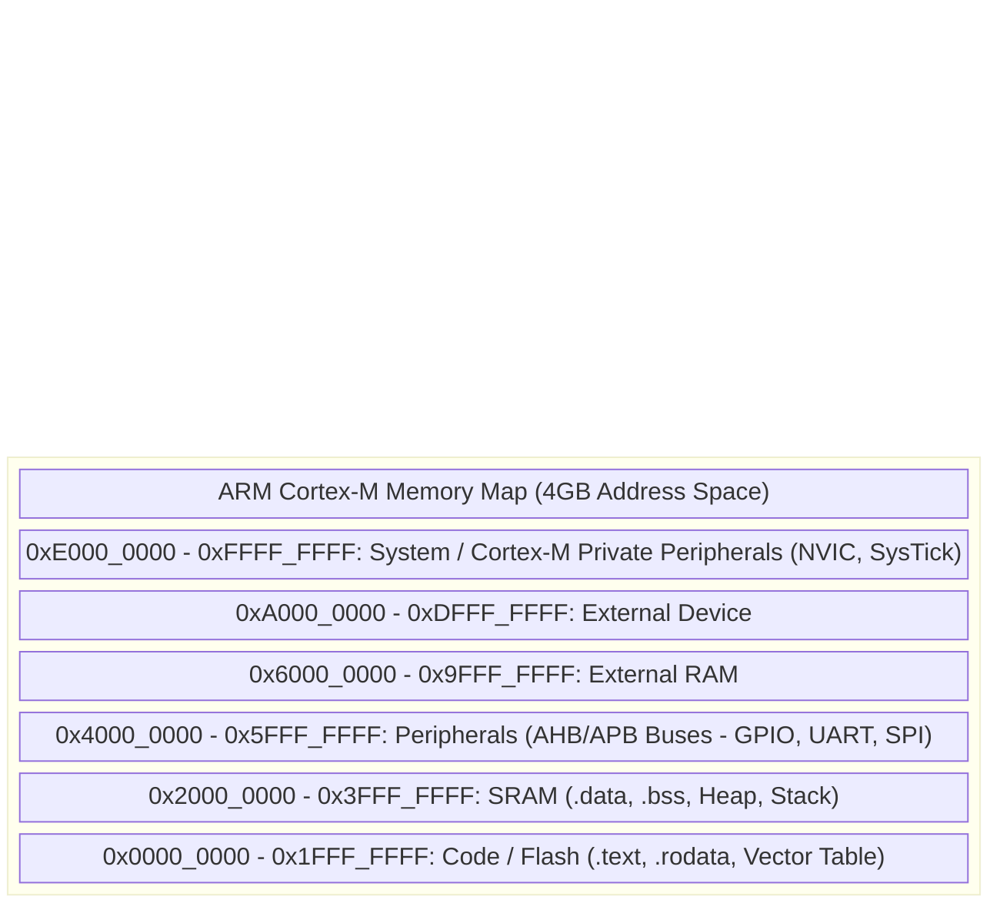

# Chapter 22: Embedded C Mastery: From Silicon to Software

Embedded systems engineering requires a profound understanding of how software interacts with hardware at the most fundamental level. Unlike desktop application development, embedded programming in C demands meticulous attention to memory constraints, real-time deterministic behavior, and direct manipulation of silicon peripherals. This comprehensive reference chapter explores the deepest concepts of Embedded C, providing production-ready patterns and deep conceptual frameworks.

---

## 1. The Embedded Toolchain & Memory Architecture

To truly master Embedded C, one must understand the journey of source code from human-readable text to executable machine instructions residing in physical silicon memory.

### 1.1 The Compilation Pipeline

The embedded toolchain (e.g., GNU Arm Embedded Toolchain `arm-none-eabi-gcc`) operates in four distinct stages:

1. **Preprocessor (`cpp`)**: Processes directives (`#include`, `#define`, `#ifdef`). It expands macros and includes header files, producing a translation unit.
2. **Compiler (`gcc`)**: Translates the preprocessed C code into assembly language specific to the target architecture (e.g., ARM Cortex-M4). This stage involves lexical analysis, syntax analysis, semantic analysis, and rigorous optimization (e.g., loop unrolling, dead code elimination).
3. **Assembler (`as`)**: Converts the assembly language into machine code (object files, `.o`). These files contain unresolved symbols and relocation tables.
4. **Linker (`ld`)**: The most critical stage in embedded systems. It combines multiple object files and libraries, resolves external symbols, and, guided by the Linker Script (`.ld`), assigns absolute physical memory addresses to every function and variable. It outputs the final executable binary (e.g., `.elf`, `.hex`, `.bin`).

### 1.2 Linker Scripts and Memory Sections

A linker script dictates exactly where in physical memory (Flash, SRAM) different parts of your program reside. An embedded binary is divided into specific sections:

- **`.text`**: Contains the executable machine code and vector table. Resides in non-volatile memory (Flash/ROM).
- **`.rodata`**: Contains read-only data, such as `const` variables and string literals. Resides in Flash/ROM to save precious RAM.
- **`.data`**: Contains initialized global and static variables. The initial values are stored in Flash (often immediately following the `.text` section), and the startup code copies them into RAM before `main()` executes.
- **`.bss` (Block Started by Symbol)**: Contains uninitialized global and static variables. These are zero-initialized by the startup code. Resides strictly in RAM. Takes no space in the Flash binary except for the address definitions.
- **`Stack`**: Used for local variables, function parameters, return addresses, and CPU register backups during interrupts. Grows downwards from the top of RAM.
- **`Heap`**: Used for dynamic memory allocation (`malloc`, `free`). Grows upwards from the end of the `.bss` section. In safety-critical embedded systems, the heap is often explicitly forbidden due to fragmentation and non-deterministic allocation times.

### 1.3 System Memory Map (ARM Cortex-M Example)



---

## 2. Low-Level C Mechanics

Embedded C requires byte-perfect manipulation of data. We interface with hardware registers that are typically 8, 16, or 32 bits wide, where individual bits control physical hardware logic gates.

### 2.1 Bitwise Operations and Masking

Directly assigning values to registers is dangerous because it overwrites all bits, potentially altering unrelated peripheral configurations. Instead, we use bitwise read-modify-write operations.

```c
#include <stdint.h>

// Define a hypothetical 32-bit register address
#define GPIOA_ODR (*((volatile uint32_t *)0x40020014))

// Bit definitions
#define PIN_5 (1UL << 5)
#define PIN_6 (1UL << 6)

void manipulate_pins(void) {
    // SET a bit (Logical OR)
    // Hardware translation: Reads ODR, ORs with 0x20, writes back.
    GPIOA_ODR |= PIN_5;

    // CLEAR a bit (Logical AND with NOT)
    // Clears bit 6 while leaving all other bits perfectly intact.
    GPIOA_ODR &= ~PIN_6;

    // TOGGLE a bit (Logical XOR)
    // Flips bit 5. If it was 1, it becomes 0. If 0, it becomes 1.
    GPIOA_ODR ^= PIN_5;

    // CHECK a bit status
    // Masks all bits except bit 5, checking if the result is non-zero.
    if ((GPIOA_ODR & PIN_5) != 0) {
        // Bit is HIGH
    }
}
```

### 2.2 Struct Packing, Padding, and Alignment

By default, the C compiler aligns variables in memory to optimize CPU access speeds (e.g., 32-bit integers align to 4-byte boundaries). This inserts invisible "padding" bytes into structures. When transmitting structs over a network (e.g., UART, Ethernet) or mapping structs directly to hardware registers, this padding causes catastrophic data misalignment.

To prevent this, we use compiler-specific attributes to enforce **packing** (removing all padding).

```c
#include <stdint.h>
#include <stddef.h>
#include <stdio.h>

// UNPACKED STRUCTURE: The compiler adds 3 bytes of padding after 'id'
// to align the 32-bit 'timestamp' to a 4-byte boundary.
// Size: 8 bytes.
struct UnpackedSensorData {
    uint8_t  id;          // 1 byte
    // 3 bytes padding inserted here implicitly
    uint32_t timestamp;   // 4 bytes
    uint16_t temperature; // 2 bytes
    // 2 bytes padding inserted here to make total size multiple of 4
};

// PACKED STRUCTURE: Instructs GCC/Clang to remove all padding.
// Size: 7 bytes. Perfect for raw byte array transmission.
struct __attribute__((__packed__)) PackedSensorData {
    uint8_t  id;          // 1 byte
    uint32_t timestamp;   // 4 bytes
    uint16_t temperature; // 2 bytes
};

void check_alignment(void) {
    // In production, statically assert sizes to catch padding issues at compile time
    _Static_assert(sizeof(struct PackedSensorData) == 7, "Struct padding detected!");
}
```

### 2.3 Advanced Pointer Arithmetic

Pointers in C increment based on the size of the underlying data type. In embedded systems, casting pointers is necessary to access generic memory blocks as specific register structures.

```c
#include <stdint.h>

void pointer_arithmetic_demo(void) {
    uint32_t memory_pool[10];
    
    // uint32_t pointer
    uint32_t *word_ptr = &memory_pool[0];
    word_ptr++; // Increments physical address by 4 bytes
    
    // Casting to a uint8_t pointer to iterate byte-by-byte
    uint8_t *byte_ptr = (uint8_t *)&memory_pool[0];
    byte_ptr++; // Increments physical address by 1 byte
    
    // Mapping a struct pointer to a raw memory address (common for hardware registers)
    // Assuming 0x40020000 is the base address of a GPIO peripheral
    struct PackedSensorData *sensor_reg = (struct PackedSensorData *)0x40020000;
    
    // Writing to hardware via the struct pointer
    sensor_reg->timestamp = 1689000000;
}
```

---

## 3. Registers & Crucial Keywords

### 3.1 Memory-Mapped I/O (MMIO)

In modern microcontrollers, peripherals (timers, ADCs, GPIOs) are controlled by reading and writing to specific memory addresses. The CPU uses the exact same assembly instructions (`LDR`, `STR` on ARM) to access RAM as it does to interact with physical hardware.

### 3.2 The Absolute Necessity of `volatile`

The `volatile` keyword tells the compiler optimizer: **"The value at this memory address can change at any time without any action taken by the code nearby."**

Without `volatile`, the compiler's optimizer assumes a variable only changes if the code explicitly writes to it. If it sees a loop reading a hardware register, it might cache the register value in a CPU register and never read the physical memory address again, creating an infinite loop.

```c
#include <stdint.h>

// INCORRECT: The compiler will optimize this into an infinite loop if
// the initial read of 0x40021000 is 0. It caches the value.
// uint32_t *hardware_flag = (uint32_t *)0x40021000;
// while (*hardware_flag == 0) { /* Wait */ }

// CORRECT: The compiler is forced to issue an LDR instruction to physical
// memory on every single iteration of the loop.
#define HARDWARE_STATUS_REG (*((volatile uint32_t *)0x40021000))

void wait_for_hardware_ready(void) {
    // Polls the physical memory address every cycle.
    while (HARDWARE_STATUS_REG == 0) {
        // Wait for a hardware peripheral to set the flag to 1
    }
}
```

### 3.3 The `const` Keyword and `const volatile`

`const` means the software cannot modify the variable, allowing the linker to place it in Flash/ROM (`.rodata`).

A combination of `const volatile` seems contradictory but is highly common in embedded systems. It means:
- `const`: The embedded software is not allowed to write to this address (it's a read-only hardware register).
- `volatile`: The hardware can change the value at any time (e.g., an ADC data register).

```c
#include <stdint.h>

// A Read-Only Hardware Register (e.g., a hardware random number generator or ADC result)
#define ADC_DATA_REG (*((const volatile uint32_t *)0x4001244C))

uint32_t read_sensor_data(void) {
    // The CPU will read physical memory every time.
    // However, if you attempt: ADC_DATA_REG = 5; the compiler will throw an error.
    return ADC_DATA_REG;
}
```

---

## 4. Hardware Execution: Boot Flow & Interrupts

### 4.1 The Vector Table and Boot Flow

When a microcontroller powers up, the CPU needs to know where to begin executing code and where the stack resides. This is defined by the **Vector Table**, typically located at address `0x0000_0000` (mapped to Flash).

The first two words of the ARM Cortex-M Vector Table are always:
1. Initial Main Stack Pointer (MSP) value (points to the end of RAM).
2. Reset Handler Address (the entry point of the boot code).

```mermaid
flowchart TD
    PowerOn[Power On / Hard Reset] --> FetchMSP[CPU fetches Initial Stack Pointer from 0x0000_0000]
    FetchMSP --> FetchReset[CPU fetches Reset Handler address from 0x0000_0004]
    FetchReset --> JumpReset[Branch to Reset_Handler()]
    JumpReset --> InitData[Copy .data section from Flash to RAM]
    InitData --> ZeroBSS[Zero out .bss section in RAM]
    ZeroBSS --> InitSystem[SystemInit(): Configure Clocks, FPU]
    InitSystem --> CallMain[Branch to main()]
```

### 4.2 Interrupt Service Routines (ISRs)

Interrupts allow hardware peripherals to asynchronously halt the CPU's current execution, force it to execute a specific function (the ISR), and then return to exactly where it left off.

**Best Practices for ISRs:**
1. **Keep it incredibly short**: Do not use `printf()`, `malloc()`, or heavy math. Set a volatile flag and exit.
2. **Clear the interrupt pending flag**: If you don't clear the hardware flag that caused the interrupt inside the ISR, the CPU will immediately re-enter the ISR upon exiting, locking up the system.
3. **Use `volatile` for shared variables**: Variables modified inside an ISR and read in the `main()` loop MUST be `volatile`.

```c
#include <stdint.h>
#include <stdbool.h>

// Simulated Interrupt Controller and Peripheral Registers
#define PERIPHERAL_INT_FLAG_REG (*((volatile uint32_t *)0x40010000))
#define INT_FLAG_BIT (1UL << 3)

// Volatile flag shared between ISR and main context
volatile bool g_data_ready = false;
volatile uint32_t g_timestamp = 0;

// The function name must exactly match the name defined in the startup assembly file's vector table
void EXTI3_IRQHandler(void) {
    // 1. Check if our specific peripheral triggered the interrupt (defensive programming)
    if ((PERIPHERAL_INT_FLAG_REG & INT_FLAG_BIT) != 0) {
        
        // 2. Perform the absolute minimum work necessary
        g_data_ready = true;
        g_timestamp++; 
        
        // 3. CRITICAL: Clear the interrupt pending flag in the hardware register.
        // Writing 1 to clear is a common hardware paradigm.
        PERIPHERAL_INT_FLAG_REG |= INT_FLAG_BIT;
    }
}
```

---

## 5. Advanced Hardware Interfacing

### 5.1 Direct Memory Access (DMA)

The CPU moving bytes from a peripheral (like a UART) to RAM wastes immense processing power. A DMA controller is a secondary hardware master on the system bus. You configure the DMA to autonomously move data from Peripheral to Memory, Memory to Peripheral, or Memory to Memory without CPU intervention. The DMA triggers an interrupt only when the entire transaction (e.g., 1024 bytes) is complete.

### 5.2 Watchdog Timers (WDT)

A Watchdog Timer is a hardware countdown timer running on an independent, rugged low-speed oscillator. The software must periodically reset (or "kick/feed") the timer before it reaches zero. If the software crashes, enters an infinite loop, or faults, it stops feeding the dog. The timer hits zero, and the hardware strictly resets the entire microcontroller, ensuring recovery from catastrophic software failures.

### 5.3 Peripheral Communication Basics

- **UART (Universal Asynchronous Receiver-Transmitter)**: Asynchronous, peer-to-peer. Uses TX and RX lines. Requires both sides to agree on a fixed baud rate beforehand.
- **SPI (Serial Peripheral Interface)**: Synchronous, Master-Slave architecture. Uses SCK (Clock), MOSI (Master Out Slave In), MISO (Master In Slave Out), and CS/SS (Chip Select). Very high speed, full-duplex.
- **I2C (Inter-Integrated Circuit)**: Synchronous, Multi-Master, Multi-Slave. Uses only two lines: SCL (Clock) and SDA (Data). Uses 7-bit or 10-bit hardware addresses to select slaves. Slower than SPI, half-duplex, but requires fewer pins.

---

## 6. The Master Embedded Script: Production-Grade Implementation

This script demonstrates a complete, production-grade embedded C file for an ARM Cortex-M architecture. It sets up a hardware timer, enables its interrupt, uses safe volatile data sharing, implements a watchdog timer feed, and utilizes a deterministic super-loop architecture.

```c
/**
 * @file    main_embedded_system.c
 * @brief   Production-grade Embedded C architecture demonstrating MMIO,
 *          Interrupts, Volatile synchronization, and a Super-Loop.
 */

#include <stdint.h>
#include <stdbool.h>

// -----------------------------------------------------------------------------
// Hardware Register Definitions (Simulated STM32 Cortex-M4)
// -----------------------------------------------------------------------------
#define PERIPH_BASE           (0x40000000UL)

// Reset and Clock Control (RCC)
#define RCC_BASE              (PERIPH_BASE + 0x21000UL)
#define RCC_APB1ENR           (*((volatile uint32_t *)(RCC_BASE + 0x40)))
#define RCC_APB1ENR_TIM2EN    (1UL << 0)

// Timer 2 (TIM2)
#define TIM2_BASE             (PERIPH_BASE + 0x0000UL)
#define TIM2_CR1              (*((volatile uint32_t *)(TIM2_BASE + 0x00)))
#define TIM2_DIER             (*((volatile uint32_t *)(TIM2_BASE + 0x0C)))
#define TIM2_SR               (*((volatile uint32_t *)(TIM2_BASE + 0x10)))
#define TIM2_PSC              (*((volatile uint32_t *)(TIM2_BASE + 0x28)))
#define TIM2_ARR              (*((volatile uint32_t *)(TIM2_BASE + 0x2C)))

#define TIM_CR1_CEN           (1UL << 0) // Counter Enable
#define TIM_DIER_UIE          (1UL << 0) // Update Interrupt Enable
#define TIM_SR_UIF            (1UL << 0) // Update Interrupt Flag

// Nested Vectored Interrupt Controller (NVIC)
#define NVIC_ISER0            (*((volatile uint32_t *)0xE000E100UL))
#define TIM2_IRQn             28
#define NVIC_ENABLE_TIM2      (1UL << (TIM2_IRQn & 0x1F))

// Independent Watchdog (IWDG)
#define IWDG_BASE             (PERIPH_BASE + 0x3000UL)
#define IWDG_KR               (*((volatile uint32_t *)(IWDG_BASE + 0x00)))
#define IWDG_KEY_RELOAD       0x0000AAAAUL
#define IWDG_KEY_START        0x0000CCCCUL

// -----------------------------------------------------------------------------
// Shared Volatile Variables (State across execution contexts)
// -----------------------------------------------------------------------------
// Flags set in ISR, processed in main loop.
volatile bool g_timer_expired_flag = false;

// Shared data. Using uint32_t ensures atomic reads on a 32-bit architecture.
volatile uint32_t g_system_ticks = 0;

// -----------------------------------------------------------------------------
// Hardware Configuration Functions
// -----------------------------------------------------------------------------
void system_clock_config(void) {
    // In a real system, configures PLLs for maximum CPU frequency.
    // For this script, we assume default internal clocks are active.
}

void watchdog_init(void) {
    // Start the watchdog timer. Hardware expects the reload key periodically.
    IWDG_KR = IWDG_KEY_START;
}

void watchdog_feed(void) {
    // Kicks the watchdog. If this isn't called, the MCU hard-resets.
    IWDG_KR = IWDG_KEY_RELOAD;
}

void timer2_init_1khz(void) {
    // 1. Enable peripheral clock for TIM2
    RCC_APB1ENR |= RCC_APB1ENR_TIM2EN;

    // 2. Configure Prescaler and Auto-Reload Register for 1ms interrupt
    // Assuming a 16MHz APB1 clock: 16MHz / 16 = 1MHz count rate
    TIM2_PSC = 16 - 1; 
    
    // 1MHz / 1000 = 1000Hz (1ms period)
    TIM2_ARR = 1000 - 1;

    // 3. Enable the Update Interrupt in the Timer
    TIM2_DIER |= TIM_DIER_UIE;

    // 4. Enable TIM2 interrupt in the Cortex-M NVIC (Interrupt Controller)
    NVIC_ISER0 |= NVIC_ENABLE_TIM2;

    // 5. Start the Timer
    TIM2_CR1 |= TIM_CR1_CEN;
}

// -----------------------------------------------------------------------------
// Application Logic
// -----------------------------------------------------------------------------
void process_telemetry(void) {
    // Represents a non-blocking background task (e.g., reading sensors, sending UART)
    // This executes synchronously in the main thread.
}

// -----------------------------------------------------------------------------
// Interrupt Service Routine (ISR) for TIM2
// -----------------------------------------------------------------------------
// This function strictly overrides the weak alias in the startup assembly file.
void TIM2_IRQHandler(void) {
    // 1. Verify the interrupt source (Update Event)
    if ((TIM2_SR & TIM_SR_UIF) != 0) {
        
        // 2. Acknowledge and CLEAR the interrupt flag immediately
        // Hardware requires writing 0 to clear in STM32 TIM SR (varies by MCU)
        TIM2_SR &= ~TIM_SR_UIF;
        
        // 3. Perform minimal, deterministic work
        g_system_ticks++;
        g_timer_expired_flag = true;
    }
}

// -----------------------------------------------------------------------------
// Main Super-Loop
// -----------------------------------------------------------------------------
int main(void) {
    // Phase 1: Hardware Initialization
    system_clock_config();
    timer2_init_1khz();
    watchdog_init();

    // Phase 2: The infinite deterministic super-loop
    while (1) {
        // Event-driven check: Has the ISR signaled an event?
        if (g_timer_expired_flag == true) {
            
            // Immediately clear the flag to prevent missing the next event
            g_timer_expired_flag = false;
            
            // Execute time-critical synchronous tasks (every 1ms)
            // e.g., PID loop calculations, sensor polling
        }

        // Background / Idle tasks executed when event processing is complete
        process_telemetry();
        
        // Vital system safety check: Prove to the hardware that software is alive
        watchdog_feed();
    }
    
    return 0; // Unreachable in an embedded system
}
```

This reference guide encapsulates the critical path of embedded software engineering: from the linker scripts controlling silicon memory mapping to the volatile variables securing deterministic interrupt handling. Mastery of these concepts is the absolute foundation of production-grade firmware.
