# DevOps & Cloud Engineering Case Interview Handbook

> **Authored for:** Principal SRE / Staff Cloud Architect interview preparation
> **Perspective:** Production-hardened, architecture-first, trade-off-aware

---
---

# Module 0: Cloud Architecture & GCP Fundamentals

> Every concept in this module follows a four-part framework:
> **What** it is → **Why** it is needed → **How** it works → **When** to use it.
> All code examples use a **Python (Flask/FastAPI) API backend** and **Terraform** for infrastructure.

---

## 0.0 Google Cloud Services Taxonomy

Before diving into specific architectures, it is crucial to understand the landscape of the cloud provider. **Google Cloud offerings can be broadly categorized into five core domains:**

1. **Compute:** The engines that run your code (e.g., Compute Engine for VMs, Google Kubernetes Engine (GKE) for containers, Cloud Run for serverless).
2. **Storage:** The persistent memory for your unstructured and structured data (e.g., Cloud Storage for objects, Persistent Disk for block storage).
3. **Big Data:** The engines for massive-scale data processing and analytics (e.g., BigQuery for data warehousing, Dataflow for stream/batch processing, Pub/Sub for messaging).
4. **Machine Learning:** The specialized hardware and managed services for AI (e.g., Vertex AI platform, TPUs, pre-trained Vision/Language APIs).
5. **Application Services:** The managed building blocks for web, mobile, analytics, and back-end solutions (e.g., Cloud SQL/Spanner for databases, Cloud CDN for content delivery, API Gateway).

Understanding which category a service belongs to helps you evaluate trade-offs when designing architectures.

---
## 0.1 Foundational Application Architecture

Before you can understand cloud services, you must understand *what you are deploying*. Every application — from a weekend side-project to Google Search — can be decomposed into **layers** (also called *tiers*). Each layer has one job. Understanding how to separate, connect, and secure these layers is the single most important architectural skill.

### The Three Layers of Any Application

Every application that serves users has three fundamental responsibilities:

```mermaid
graph TD
    PRES["📄 PRESENTATION LAYER (What the user sees)\n'Show a login form. Display search results.'\nExamples: React SPA, mobile app, HTML template"]
    APP["⚙️ APPLICATION LAYER (The brain / business logic)\n'Validate the password. Run the search algorithm.'\nExamples: Python FastAPI, Node.js, Java Spring"]
    DATA["🗄️ DATA LAYER (State / Memory)\n'Save the user to disk. Retrieve the products.'\nExamples: PostgreSQL, MongoDB, Redis"]

    PRES --> APP
    APP --> DATA

    style PRES fill:#dfd,stroke:#090
    style APP fill:#ddf,stroke:#009
    style DATA fill:#fdd,stroke:#c00
```

Now let's see what happens when you combine or separate these layers.

---

### 1-Tier Architecture (The Monolith on a Single Machine)

**What it is:** All three layers — presentation, application, and data — run on a **single machine** in a **single process**. The web server, business logic, and database all share the same computer.

**The picture:**

```mermaid
graph TB
    subgraph SINGLE_SERVER["🖥️ SINGLE SERVER / LAPTOP"]
        subgraph FLASK_APP["Python Flask App — Single Process"]
            PRES["📄 Presentation Layer\nrender_template\nHTML output"]
            LOGIC["⚙️ Application Layer\n@app.route\nBusiness Logic"]
            DATA["🗄️ Data Layer\nsqlite3.connect - app.db\nSame disk, same process"]
        end
    end

    PRES --- LOGIC --- DATA

    style SINGLE_SERVER fill:#fdd,stroke:#c00,stroke-width:2px
    style FLASK_APP fill:#fee,stroke:#c66
    style PRES fill:#ddf,stroke:#66c
    style LOGIC fill:#dfd,stroke:#6c6
    style DATA fill:#ffd,stroke:#cc6
```

**Why it exists:**
- **Simplicity.** Zero network calls. No configuration. `python app.py` and you're done.
- **Speed of development.** No infrastructure to manage. Great for prototypes, hackathons, and learning.

**Why it fails in production:**

| Problem | Explanation |
|---|---|
| **No scalability** | One machine = fixed ceiling. Can't add more CPUs without replacing the whole server. |
| **Single point of failure** | If the server dies, everything dies. Database, API, and frontend — all gone simultaneously. |
| **No independent scaling** | Maybe your API needs 8 CPUs but the database needs 64GB RAM. You can't tune them independently. |
| **Deployment means downtime** | Updating the app requires restarting the process, which also restarts the database connection. |
| **Security nightmare** | If an attacker exploits the web server, they have direct filesystem access to the database. Zero isolation. |

**When to use it:** Personal projects, prototypes, development environments, SQLite-based CLI tools. **Never in production for user-facing services.**

---

### 2-Tier Architecture (Client-Server)

**What it is:** The application is split into **two machines** — a client (presentation) and a server (application + data). The client talks to the server over a network.

**There are two common variants:**

**Variant A: Fat Client (Presentation + Logic on Client, Database on Server)**

```mermaid
graph LR
    subgraph CLIENT["🖥️ CLIENT MACHINE"]
        APP["Desktop App / Mobile App\n+ Business Logic + UI"]
    end

    subgraph SERVER["🗄️ DATABASE SERVER"]
        DB["PostgreSQL\nPort 5432\nStores all data"]
    end

    APP -- "SQL over TCP\n⚠️ Direct DB Connection" --> DB

    style CLIENT fill:#ffd,stroke:#cc6,stroke-width:2px
    style SERVER fill:#ddf,stroke:#66c,stroke-width:2px
    style APP fill:#ffe,stroke:#cc6
    style DB fill:#eef,stroke:#66c
```

> **⚠️ Problems:** Every client has a direct DB connection → SQL injection from any client = full DB compromise. Business logic on the client = can be reverse-engineered. 10,000 users = 10,000 DB connections (connection exhaustion).

**Variant B: Thin Client (Presentation on Client, API + Data on Server)**

```mermaid
graph LR
    subgraph CLIENT["🌐 CLIENT - Browser"]
        UI["React / HTML / App\nOnly renders UI\nZero business logic\nZero DB access"]
    end

    subgraph SERVER["🖥️ SINGLE SERVER"]
        API["Python FastAPI\nValidates input\nRuns logic"]
        DB2["PostgreSQL\non localhost"]
        API -- "localhost:5432" --> DB2
    end

    UI -- "HTTPS / REST\nJSON" --> API

    style CLIENT fill:#dfd,stroke:#6c6,stroke-width:2px
    style SERVER fill:#fdd,stroke:#c66,stroke-width:2px
    style UI fill:#efe,stroke:#6c6
    style API fill:#fee,stroke:#c66
    style DB2 fill:#ffd,stroke:#cc6
```

> **Better:** Client never touches DB directly. **But:** API and DB still on the same machine. Scaling the API means scaling the DB too (wasteful). DB still reachable from the API's network interface.

**Why 2-tier exists:**
- **Separation of concerns.** The client handles display, the server handles logic.
- **Centralized data.** One database, not one per client.

**Why it's still not enough for production:**
- The API and database are still coupled (same server or same network zone).
- You still can't scale them independently.
- If the server is compromised, the attacker has both the API *and* the database.

**When to use it:** Internal tools with small user bases, mobile apps with a simple backend, early-stage startups where speed-to-market beats architectural purity.

---

### 3-Tier Architecture (The Production Standard)

**What it is:** Each layer runs on its **own infrastructure**, communicates over **well-defined network interfaces**, and can be **scaled, secured, and deployed independently**.

**The picture:**

```mermaid
graph LR
    USER["👤 User / Browser"]

    subgraph TIER1["TIER 1: PRESENTATION"]
        CDN["📄 React SPA\nCloud Storage + CDN\nOR: Mobile App\nOR: Jinja2 SSR"]
    end

    subgraph TIER2["TIER 2: APPLICATION"]
        API3["⚙️ Python FastAPI\nCloud Run / GKE\n• Validates input\n• AuthN / AuthZ\n• Business logic\n• Returns JSON"]
    end

    subgraph TIER3["TIER 3: DATA"]
        DB3["🗄️ Cloud SQL PostgreSQL\nPrivate IP only\nNo public access\n• Encrypted at rest\n• Automated backups"]
    end

    USER -- "HTTPS :443\nvia Load Balancer\n(public internet)" --> CDN
    CDN -- "HTTPS REST/gRPC\nvia Cloud Load Balancer\n+ Cloud Armor WAF" --> API3
    API3 -- "TCP :5432\nvia Private VPC\n🔒 NEVER the internet" --> DB3

    style TIER1 fill:#dfd,stroke:#6c6,stroke-width:2px
    style TIER2 fill:#ddf,stroke:#66c,stroke-width:2px
    style TIER3 fill:#fdd,stroke:#c66,stroke-width:2px
    style CDN fill:#efe,stroke:#6c6
    style API3 fill:#eef,stroke:#66c
    style DB3 fill:#fee,stroke:#c66
    style USER fill:#fff,stroke:#333,stroke-width:2px
```

> **🔒 KEY SECURITY RULE:** The database has NO public IP. It is unreachable from the internet. Only the API tier, within the same VPC, can reach it. An attacker who compromises the CDN cannot reach the database.

**Why 3-tier is the production standard:**

| Benefit | How It Works |
|---|---|
| **Independent scaling** | API gets more traffic? Scale only the API (add more Cloud Run instances). Database needs more RAM? Upgrade only the DB instance. CDN handles millions of requests automatically. |
| **Security isolation** | Each tier is in a separate network zone. The database is *unreachable* from the internet. Defense in depth: compromising one tier does not automatically compromise the others. |
| **Independent deployment** | Update the React frontend without touching the API. Update the API without touching the database. Zero-downtime deployments become possible. |
| **Technology independence** | The frontend team uses React. The backend team uses Python. The data team uses PostgreSQL now but could migrate to Spanner later. Each tier's technology choice is hidden behind its interface. |
| **Fault isolation** | A bug in the UI doesn't crash the database. A slow query doesn't bring down the CDN. Failure is contained. |

**How the tiers communicate securely:**

| Connection | Protocol | Security Mechanism |
|---|---|---|
| User → Presentation | HTTPS (TLS 1.3) | Google-managed SSL certificate on the Load Balancer. |
| Presentation → API | HTTPS (REST/gRPC) | API behind a Cloud Load Balancer with WAF (Cloud Armor). JWT or OAuth2 Bearer token in the `Authorization` header. |
| API → Database | TCP (5432 for PostgreSQL) | Private IP only (no public IP). VPC firewall rule: allow TCP 5432 only from the API's subnet CIDR. IAM database authentication (Cloud SQL IAM Auth) — no passwords. |

**Terraform for 3-Tier on GCP — Skeleton:**

```hcl
# ─────────────────────────────────────────────────────────
# TIER 3: DATABASE (most restricted, deploy first)
# ─────────────────────────────────────────────────────────
resource "google_sql_database_instance" "main" {
  name             = "app-db-prod"
  database_version = "POSTGRES_15"
  region           = "us-central1"

  settings {
    tier              = "db-custom-2-8192" # 2 vCPU, 8GB RAM
    availability_type = "REGIONAL"         # Multi-zone HA

    ip_configuration {
      ipv4_enabled    = false              # NO public IP
      private_network = google_compute_network.main.id
    }

    backup_configuration {
      enabled                        = true
      point_in_time_recovery_enabled = true
    }
  }

  deletion_protection = true
}

# ─────────────────────────────────────────────────────────
# TIER 2: APPLICATION (medium restriction)
# ─────────────────────────────────────────────────────────
resource "google_cloud_run_v2_service" "api" {
  name     = "python-api"
  location = "us-central1"

  template {
    containers {
      image = "us-central1-docker.pkg.dev/my-proj/services/api:latest"

      env {
        name  = "DB_HOST"
        value = google_sql_database_instance.main.private_ip_address
      }

      # Secret injected from Secret Manager, not hardcoded
      env {
        name = "DB_PASSWORD"
        value_source {
          secret_key_ref {
            secret  = google_secret_manager_secret.db_password.secret_id
            version = "latest"
          }
        }
      }
    }

    vpc_access {
      # Cloud Run connects to the VPC to reach the private DB
      connector = google_vpc_access_connector.main.id
      egress    = "PRIVATE_RANGES_ONLY"
    }

    service_account = google_service_account.api_sa.email
  }
}

# ─────────────────────────────────────────────────────────
# TIER 1: PRESENTATION (least restricted, public-facing)
# ─────────────────────────────────────────────────────────
resource "google_storage_bucket" "frontend" {
  name     = "my-app-frontend-prod"
  location = "US"

  website {
    main_page_suffix = "index.html"
    not_found_page   = "index.html" # SPA routing
  }
}

# CDN in front of the bucket for global performance
resource "google_compute_backend_bucket" "frontend_cdn" {
  name        = "frontend-cdn"
  bucket_name = google_storage_bucket.frontend.name
  enable_cdn  = true
}
```

**When to use 3-tier:** Every production application. There are virtually no production use-cases where a 1-tier or 2-tier architecture is acceptable for a user-facing service.

### Summary Comparison

| Feature | 1-TIER | 2-TIER | 3-TIER |
|---|---|---|---|
| **Machines** | 1 | 2 | 3+ (per tier) |
| **Scalability** | None | Limited | Independent |
| **Security** | Zero isolation | Partial | Full isolation |
| **Deployment** | All-or-nothing | Partial | Independent |
| **Complexity** | Trivial | Low | Medium-High |
| **Cost** | Minimal | Low | Higher |
| **Best for** | Prototyping | Small apps, internal tools | Production, any scale |
| **GCP Example** | Compute Engine (single VM) | Compute Engine + Cloud SQL | Cloud Run + Cloud SQL + Cloud CDN + LB |

---

## 0.2 GCP Networking (VPC) Basics

### Why Not Just Use the Public Internet?

Imagine your Python API needs to talk to your PostgreSQL database. You *could* give both a public IP and have them communicate over the internet. Here's why that's a catastrophic idea:

```mermaid
graph TD
    subgraph BAD["❌ THE INTERNET (Bad)"]
        API1["Python API\n(Public IP)"]
        DB1["PostgreSQL DB\n(Public IP)"]
        API1 -- "⚠️ Unencrypted\n⚠️ Anyone can port-scan\n⚠️ Unpredictable latency\n⚠️ Paying egress twice" --> DB1
    end

    subgraph GOOD["✅ PRIVATE VPC (Good)"]
        API2["Python API\n(Private IP)"]
        DB2["PostgreSQL DB\n(Private IP, NO Public IP)"]
        API2 -- "🔒 Invisible to internet\n🔒 Google backbone (encrypted)\n🔒 Zero intra-zone egress cost" --> DB2
    end

    style BAD fill:#fdd,stroke:#c00,stroke-width:2px
    style GOOD fill:#dfd,stroke:#090,stroke-width:2px
```

A **VPC** (Virtual Private Cloud) is your private network inside Google Cloud. It's like building your own data center's network — but in software.

---

### VPC (Virtual Private Cloud)

**What it is:** A VPC is a logically isolated, software-defined network within Google Cloud. It is the **top-level networking container**. All your GCP compute resources (VMs, GKE nodes, Cloud SQL instances, Cloud Run connectors) attach to a VPC.

**Why it is needed:**
- **Isolation:** Your resources can talk to each other without traversing the public internet.
- **Security:** You control exactly who can talk to whom using firewall rules.
- **Performance:** Traffic within a VPC stays on Google's private backbone — low latency, high bandwidth.
- **Cost:** Intra-VPC traffic within the same zone is free. Even cross-zone intra-VPC traffic is cheap compared to internet egress.

**How it works:**

A GCP VPC is **global** — it spans all regions. This is different from AWS (where VPCs are regional). A single GCP VPC can have subnets in `us-central1`, `europe-west1`, and `asia-east1`, and resources in all those subnets can communicate directly.

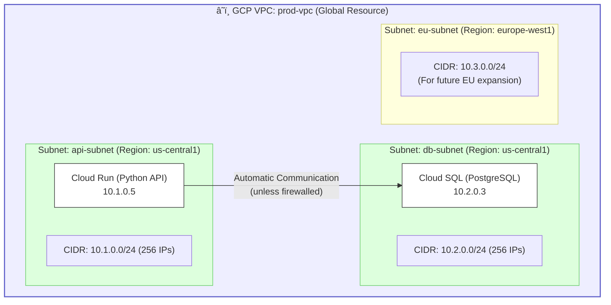

**Terraform:**

```hcl
resource "google_compute_network" "main" {
  name                    = "prod-vpc"
  auto_create_subnetworks = false  # ALWAYS false for production.
  # auto_create_subnetworks = true creates a subnet in EVERY region
  # with Google-chosen CIDRs. You lose control over IP planning.
}
```

---

### Subnets

**What it is:** A subnet is a **regional** IP address range within a VPC. It defines a block of private IPs (a CIDR range) that resources in that region can use.

**Why it is needed:**
- **IP address management.** You control which IP ranges go where.
- **Network segmentation.** Different subnets for different security tiers (API subnet vs. database subnet).
- **Firewall targeting.** Firewall rules can reference subnets, so you can say "allow traffic FROM `api-subnet` TO `db-subnet` on port 5432."

**How CIDR notation works (demystified):**

```
10.1.0.0/24

10.1.0.0  = The base network address
/24       = The first 24 bits are the "network" part (fixed).
            The remaining 8 bits (32 - 24 = 8) are for hosts.
            2^8 = 256 addresses (10.1.0.0 to 10.1.0.255).
            GCP reserves 4, so you get 252 usable IPs.

Common CIDR blocks:
/16  = 65,536 IPs  (e.g., 10.0.0.0/16 — for the entire VPC)
/20  = 4,096 IPs   (e.g., for a large GKE node pool)
/24  = 256 IPs     (e.g., for a small service tier)
/28  = 16 IPs      (e.g., for a VPC connector to Cloud Run)
```

**Terraform:**

```hcl
# Subnet for the API tier (Cloud Run / GKE)
resource "google_compute_subnetwork" "api" {
  name          = "api-subnet"
  ip_cidr_range = "10.1.0.0/24"
  region        = "us-central1"
  network       = google_compute_network.main.id

  # Enable Private Google Access so resources WITHOUT a public IP
  # can still reach Google APIs (Cloud Storage, Secret Manager, etc.)
  private_ip_google_access = true

  # Enable VPC Flow Logs for network forensics
  log_config {
    aggregation_interval = "INTERVAL_5_SEC"
    flow_sampling        = 0.5
    metadata             = "INCLUDE_ALL_METADATA"
  }
}

# Subnet for the Database tier (Cloud SQL)
resource "google_compute_subnetwork" "db" {
  name          = "db-subnet"
  ip_cidr_range = "10.2.0.0/24"
  region        = "us-central1"
  network       = google_compute_network.main.id

  private_ip_google_access = true
}

# Serverless VPC Connector — lets Cloud Run access the VPC
resource "google_vpc_access_connector" "main" {
  name          = "api-vpc-connector"
  region        = "us-central1"
  ip_cidr_range = "10.8.0.0/28" # Small /28 range for the connector
  network       = google_compute_network.main.id
}
```

---

### Firewall Rules

**What it is:** A firewall rule is a **network-level access control** that defines which traffic is allowed or denied between resources in a VPC. Think of it as the bouncer at the door: "Are you on the list? No? You don't get in."

**Why it is needed:** By default, all **ingress** (incoming) traffic to a VPC is **denied**. All **egress** (outgoing) traffic is **allowed**. Firewall rules explicitly open the specific ports and protocols your application needs — nothing more.

**How it works:**

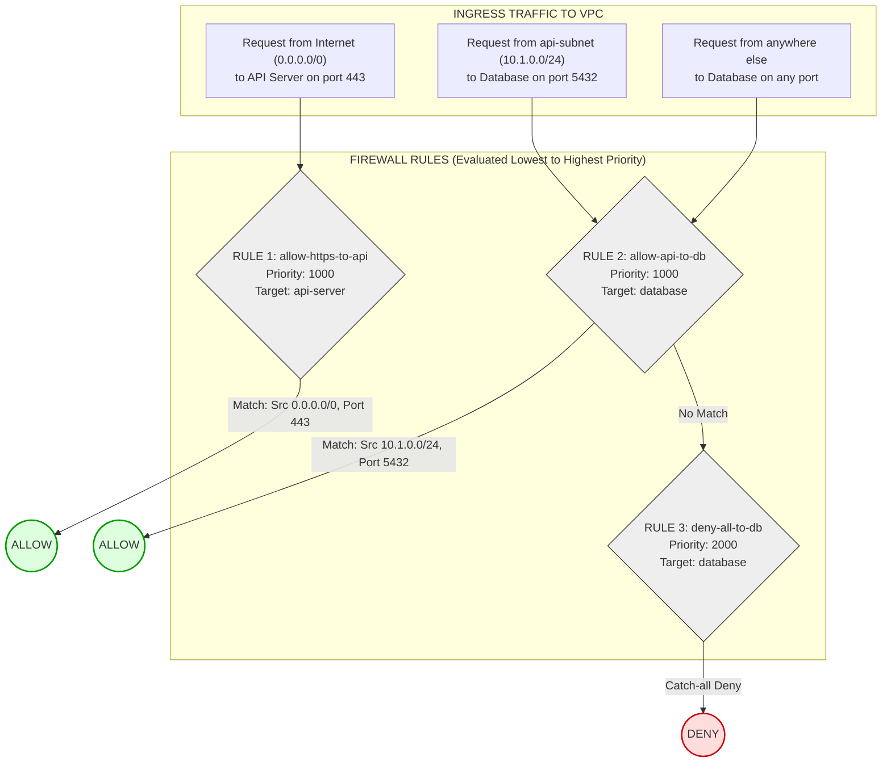

> **Priority Evaluation:** Lower number = Higher priority. GCP evaluates rules from lowest number to highest. First match wins. A request from the API subnet to the DB matches Rule 2 (Priority 1000) and is allowed. A request from the internet to the DB skips Rule 2 and matches Rule 3 (Priority 2000), which is an explicit deny-all fallback.

**Terraform:**

```hcl
# Allow HTTPS to API servers
resource "google_compute_firewall" "allow_https_to_api" {
  name    = "allow-https-to-api"
  network = google_compute_network.main.id

  allow {
    protocol = "tcp"
    ports    = ["443"]
  }

  source_ranges = ["0.0.0.0/0"]       # From anywhere (via LB)
  target_tags   = ["api-server"]        # Only to API-tagged instances
  direction     = "INGRESS"
  priority      = 1000
}

# Allow API subnet to reach Database on PostgreSQL port ONLY
resource "google_compute_firewall" "allow_api_to_db" {
  name    = "allow-api-to-db"
  network = google_compute_network.main.id

  allow {
    protocol = "tcp"
    ports    = ["5432"]
  }

  source_ranges = ["10.1.0.0/24"]      # ONLY the API subnet
  target_tags   = ["database"]          # ONLY DB-tagged instances
  direction     = "INGRESS"
  priority      = 1000
}

# Deny everything else to the database (defense-in-depth)
resource "google_compute_firewall" "deny_all_to_db" {
  name    = "deny-all-to-db"
  network = google_compute_network.main.id

  deny {
    protocol = "all"
  }

  source_ranges = ["0.0.0.0/0"]
  target_tags   = ["database"]
  direction     = "INGRESS"
  priority      = 2000   # Lower priority than the allow rule
}
```

---

### Routing and Cloud NAT

**What it is:** Routes define the **path** that network packets take from one resource to another. Cloud NAT (Network Address Translation) allows resources with **only private IPs** to reach the public internet for outbound traffic (e.g., downloading Python packages from PyPI) without having a public IP themselves.

**Why Cloud NAT is needed:**

```mermaid
graph LR
    subgraph VPC["☁️ PRIVATE VPC"]
        VM["Private VM / Cloud Run\nIP: 10.1.0.5\n(No Public IP)"]
        NAT["Cloud NAT\n(Attached to Cloud Router)\nPublic NAT IP: 34.x.x.x"]
    end

    subgraph INTERNET["🌐 INTERNET"]
        PYPI["PyPI.org"]
        STRIPE["api.stripe.com"]
    end

    VM -- "1. Outbound request\nfrom 10.1.0.5" --> NAT
    NAT -- "2. Source IP rewritten to 34.x.x.x" --> PYPI
    PYPI -- "3. Response to 34.x.x.x" --> NAT
    NAT -- "4. Dest IP rewritten to 10.1.0.5" --> VM

    VM -- "❌ Direct outbound" -.-x INTERNET
    INTERNET -- "❌ Inbound (BLOCKED)" -.-x NAT

    style VPC fill:#eef,stroke:#66c,stroke-width:2px
    style INTERNET fill:#ffe,stroke:#cc6,stroke-width:2px
    style VM fill:#fff,stroke:#333
    style NAT fill:#dfd,stroke:#090
    style PYPI fill:#fff,stroke:#333
    style STRIPE fill:#fff,stroke:#333
```

> **The Cloud NAT Problem:** Your API runs in a private subnet. It can reach Cloud SQL, but it fails to reach PyPI or Stripe because it has no internet access. Cloud NAT solves this by rewriting the source IP for outbound traffic. The VM never gets a public IP, so inbound connections from the internet are still completely blocked.

**Terraform:**

```hcl
# Cloud Router (required by Cloud NAT)
resource "google_compute_router" "main" {
  name    = "prod-router"
  region  = "us-central1"
  network = google_compute_network.main.id
}

# Cloud NAT
resource "google_compute_router_nat" "main" {
  name                               = "prod-nat"
  router                             = google_compute_router.main.name
  region                             = "us-central1"
  nat_ip_allocate_option             = "AUTO_ONLY"
  source_subnetwork_ip_ranges_to_nat = "LIST_OF_SUBNETWORKS"

  subnetwork {
    name                    = google_compute_subnetwork.api.id
    source_ip_ranges_to_nat = ["ALL_IP_RANGES"]
  }

  # Logging for security audits
  log_config {
    enable = true
    filter = "ERRORS_ONLY"
  }
}
```

### Complete VPC Architecture for a Secure 3-Tier App

```mermaid
graph TD
    INTERNET["🌐 INTERNET"]

    LB["Cloud Load Balancer\n(Public IP)\nGoogle-managed TLS\nCloud Armor WAF"]

    subgraph VPC["☁️ VPC: prod-vpc"]
        subgraph SUBNET_API["api-subnet (10.1.0.0/24)"]
            API["Cloud Run (Python API)"]
            NAT["Cloud NAT\n(Outbound only)"]
        end

        subgraph SUBNET_DB["db-subnet (10.2.0.0/24)"]
            DB["Cloud SQL (Private IP only)\n10.2.0.3"]
        end
    end

    INTERNET -- "✅ port 443" --> LB
    LB -- "✅ proxy" --> API
    API -- "✅ port 5432" --> DB
    API -- "✅ outbound" --> NAT
    NAT -- "✅ outbound" --> INTERNET

    INTERNET -. "❌ BLOCKED" .-x DB
    INTERNET -. "❌ BLOCKED" .-x API
    DB -. "❌ BLOCKED" .-x INTERNET

    style INTERNET fill:#ffe,stroke:#cc6,stroke-width:2px
    style LB fill:#efe,stroke:#6c6
    style VPC fill:#eef,stroke:#66c,stroke-width:2px
    style SUBNET_API fill:#dfd,stroke:#090
    style SUBNET_DB fill:#dfd,stroke:#090
    style API fill:#fff,stroke:#333
    style NAT fill:#dfd,stroke:#090
    style DB fill:#fff,stroke:#333
```

**FIREWALL RULES SUMMARY:**
- ✅ Internet → LB → API (port 443 only)
- ✅ API subnet → DB subnet (port 5432 only)
- ✅ API subnet → Internet (via Cloud NAT, outbound only)
- ❌ Internet → DB subnet (BLOCKED, no public IP, no NAT)
- ❌ DB subnet → Internet (BLOCKED, unnecessary)
- ❌ Internet → API directly (must go through Load Balancer)

---

## 0.3 GCP IAM (Identity and Access Management) Basics

### What IAM Is

**What it is:** IAM answers three questions for every request to a GCP resource:

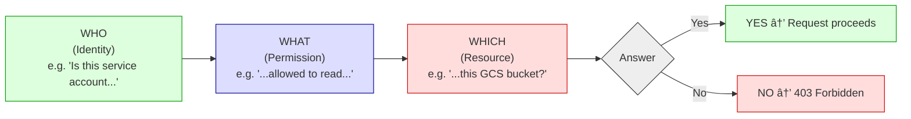

**Why it is needed:** Without IAM, either:
- Everyone can do everything (no security), or
- Nobody can do anything (no usability).

IAM is the mechanism that grants **exactly the right permissions** to **exactly the right identities** on **exactly the right resources** — and nothing more.

### The Three Pillars of IAM

```mermaid
graph TD
    subgraph IAM["IAM = WHO + WHAT + WHERE"]
        direction LR
        subgraph ID["1. IDENTITY (WHO)"]
            I1["• User Account (human@org)\n• Service Account (app@proj.iam)\n• Google Group (team@org)\n• Domain (org.com)\n• External (via WIF)"]
        end

        subgraph ROLE["2. ROLE (WHAT)"]
            R1["• Basic Role (Owner/Editor/Viewer)\n• Predefined Role (roles/storage.objectViewer)\n• Custom Role (myRole with exact perms)"]
        end

        subgraph RES["3. RESOURCE (WHERE)"]
            RE1["• Organization\n• Folder\n• Project\n• Resource (bucket, instance, topic)"]
        end
    end

    ID -->|IAM POLICY BINDING| ROLE
    ROLE -->|ON| RES

    style IAM fill:#eee,stroke:#333,stroke-width:2px
    style ID fill:#dfd,stroke:#090
    style ROLE fill:#ddf,stroke:#009
    style RES fill:#fdd,stroke:#c00
```

> **An IAM POLICY BINDING ties them together:** "Grant [ROLE] to [IDENTITY] on [RESOURCE]"
> **Example:** "Grant `roles/cloudsql.client` to `api-sa@proj.iam.gserviceaccount.com` on project `my-project`"
> **Meaning:** The API service account can connect to any Cloud SQL instance in the project. Nothing more.

### Identities: User Account vs. Service Account

| Dimension | User Account | Service Account |
|---|---|---|
| **What it is** | A Google identity for a **human being** (alice@company.com) | A Google identity for a **machine/application** (api-sa@proj.iam.gserviceaccount.com) |
| **Who uses it** | Engineers, admins, PMs — people who log in via browser | Applications, CI/CD pipelines, cloud functions — code that calls APIs |
| **Authentication** | Username + password + MFA (interactive login) | Short-lived tokens via Workload Identity, metadata server, or (worst case) JSON key files |
| **Lifecycle** | Tied to a person's employment | Tied to an application's lifecycle |
| **When to use** | Humans accessing the GCP Console or running `gcloud` commands | Any non-human identity: your Python API, your Cloud Build pipeline, your Cloud Function |

**The cardinal rule:** Applications should **never** use a User Account. Humans should **never** use a Service Account. Mixing them conflates human access with machine access, making auditing impossible.

### Roles: Basic, Predefined, and Custom

**Basic Roles (avoid in production):**

```
┌─────────────────────────────────────────────────────────────────┐
│                     BASIC ROLES                                 │
│                                                                 │
│   roles/viewer   ──▶  Read-only access to ALL resources        │
│   roles/editor   ──▶  Read + Write access to ALL resources     │
│   roles/owner    ──▶  Full control, including IAM + billing    │
│                                                                 │
│   ⚠️  WHY THESE ARE DANGEROUS:                                 │
│                                                                 │
│   roles/editor grants 3,000+ permissions across ALL GCP        │
│   services. If your Python API only needs to read from          │
│   Cloud SQL and publish to Pub/Sub, roles/editor also gives    │
│   it permission to:                                             │
│   • Delete Compute Engine instances                             │
│   • Modify firewall rules                                       │
│   • Read any GCS bucket in the project                         │
│   • Create new service accounts                                 │
│                                                                 │
│   This violates least-privilege. If the API is compromised,    │
│   the attacker can do ANYTHING in the project.                 │
│                                                                 │
│   RULE: Never use Basic Roles for service accounts.            │
│         Use Predefined or Custom Roles instead.                │
└─────────────────────────────────────────────────────────────────┘
```

**Predefined Roles (recommended starting point):**

Google provides ~1,000 predefined roles, each scoped to a specific service with a specific set of permissions:

| Role | Permissions (summary) | Use Case |
|---|---|---|
| `roles/cloudsql.client` | Connect to Cloud SQL instances | Python API connecting to its database |
| `roles/secretmanager.secretAccessor` | Read secret values | Python API reading DB password from Secret Manager |
| `roles/pubsub.publisher` | Publish messages to a Pub/Sub topic | Python API publishing events |
| `roles/storage.objectViewer` | Read objects from GCS buckets | Python API reading uploaded files |
| `roles/logging.logWriter` | Write logs to Cloud Logging | Any application writing structured logs |
| `roles/monitoring.metricWriter` | Write custom metrics to Cloud Monitoring | Application exporting custom metrics |

**Custom Roles (when predefined roles are still too broad):**

```hcl
# Terraform: Custom role with ONLY the exact permissions needed
resource "google_project_iam_custom_role" "api_role" {
  role_id     = "pythonApiRole"
  title       = "Python API Custom Role"
  description = "Minimum permissions for the payment API service"
  permissions = [
    "cloudsql.instances.connect",       # Connect to Cloud SQL
    "cloudsql.instances.get",           # Read instance metadata
    "secretmanager.versions.access",    # Read secret values
    "pubsub.topics.publish",            # Publish to Pub/Sub
    "logging.logEntries.create",        # Write logs
    "monitoring.timeSeries.create",     # Write metrics
  ]
}

resource "google_project_iam_member" "api_binding" {
  project = var.project_id
  role    = google_project_iam_custom_role.api_role.id
  member  = "serviceAccount:${google_service_account.api_sa.email}"
}
```

### The Principle of Least Privilege — Why It Matters

```
┌─────────────────────────────────────────────────────────────────┐
│               LEAST PRIVILEGE: A CONCRETE EXAMPLE              │
│                                                                 │
│  SCENARIO: Your Python API needs to read a database password   │
│            from Secret Manager.                                 │
│                                                                 │
│  ❌ OVER-PRIVILEGED:                                           │
│  Grant roles/secretmanager.admin on the PROJECT                │
│  → API can read, create, delete, and modify ALL secrets        │
│  → If compromised, attacker can read DB passwords, API keys,   │
│    TLS certs, and even CREATE new secrets (backdoor)           │
│                                                                 │
│  ❌ SLIGHTLY BETTER BUT STILL WRONG:                           │
│  Grant roles/secretmanager.secretAccessor on the PROJECT       │
│  → API can read ALL secrets in the project                     │
│  → If compromised, attacker reads every secret, not just the   │
│    DB password (stripe keys, signing keys, etc.)               │
│                                                                 │
│  ✅ CORRECT (LEAST PRIVILEGE):                                 │
│  Grant roles/secretmanager.secretAccessor on the SPECIFIC      │
│  SECRET RESOURCE (not the project)                             │
│  → API can read ONLY the db-password secret                    │
│  → If compromised, attacker gets one secret, not all           │
│                                                                 │
│  Terraform:                                                    │
│  resource "google_secret_manager_secret_iam_member" "access" { │
│    secret_id = google_secret_manager_secret.db_password.id     │
│    role      = "roles/secretmanager.secretAccessor"             │
│    member    = "serviceAccount:${google_service_account.       │
│                 api_sa.email}"                                  │
│  }                                                              │
│  # Bound to ONE secret, not the project. That's the difference.│
└─────────────────────────────────────────────────────────────────┘
```

### IAM Resource Hierarchy and Policy Inheritance

```mermaid
graph TD
    subgraph ORG["🏢 Organization (company.com)"]
        direction TB
        OP1["Policy: 'All members must use MFA'\nPolicy: 'Deny external SA key creation'"]
        
        subgraph F_ENG["📁 Folder: Engineering"]
            FP1["Policy: 'Grant security-team@ roles/viewer'\n(Inherited by ALL projects below)"]
            
            subgraph P_PROD["📦 Project: prod-app"]
                RES1["Cloud SQL instance\nCloud Run service\nGCS bucket\n(Inherits security-team@ viewer)"]
            end
            
            subgraph P_STG["📦 Project: staging-app"]
                RES2["Staging resources\n(Inherits same policies)"]
            end
        end
        
        subgraph F_DS["📁 Folder: Data Science"]
            subgraph P_ML["📦 Project: ml-experiments"]
                RES3["(Different policies for data team)"]
            end
        end
    end

    ORG --> F_ENG
    ORG --> F_DS
    F_ENG --> P_PROD
    F_ENG --> P_STG
    F_DS --> P_ML

    style ORG fill:#f4f4f4,stroke:#333,stroke-width:2px
    style F_ENG fill:#eef,stroke:#66c
    style F_DS fill:#eef,stroke:#66c
    style P_PROD fill:#dfd,stroke:#090
    style P_STG fill:#ffd,stroke:#cc6
    style P_ML fill:#dfd,stroke:#090
    style OP1 fill:#fff,stroke:#333
    style FP1 fill:#fff,stroke:#333
```

**The Google Cloud Resource Hierarchy:**
1. **Organization:** The root node (e.g., your company). Centralized control, billing, and strict top-level policies (Organization Policies) live here.
2. **Folders:** Organizational units used to group projects. Often mapped to departments (Engineering, HR) or environments (Production, Non-Production). Folders can contain other folders.
3. **Projects:** The fundamental trust boundary and grouping entity for resources. All compute, storage, and networking services are bound to exactly one project. Billing is typically tracked at the project level.
4. **Services / Resources:** The actual cloud components you deploy (Compute Engine VMs, Cloud SQL databases, Pub/Sub topics).

> **⚠️ KEY RULE: Policies are INHERITED downward and ADDITIVE.**
> You cannot REMOVE a permission granted at a higher level. You can only ADD more permissions at lower levels. If you grant `roles/editor` at the Organization level, EVERY project inherits it, and you CANNOT revoke it at the project level. This is why you should grant permissions at the **LOWEST level possible**.

### Secure Authentication: Workload Identity Federation vs. Static Keys

```
┌─────────────────────────────────────────────────────────────────┐
│      AUTHENTICATION METHODS — FROM WORST TO BEST               │
│                                                                 │
│  ❌ LEVEL 1: Hardcoded credentials in source code              │
│     db_password = "hunter2"                                    │
│     → Committed to Git. Visible to everyone. Game over.        │
│                                                                 │
│  ❌ LEVEL 2: Environment variables with static values          │
│     DB_PASSWORD=hunter2 in .env file                           │
│     → Slightly better, but .env files get committed too.       │
│     → No rotation. No audit trail. No access control.          │
│                                                                 │
│  ⚠️ LEVEL 3: Service Account JSON key file                     │
│     GOOGLE_APPLICATION_CREDENTIALS=/path/to/key.json           │
│     → Long-lived. Never expires unless manually rotated.       │
│     → Can be exfiltrated, copied, emailed, committed.          │
│     → Google strongly discourages this.                        │
│                                                                 │
│  ✅ LEVEL 4: Metadata server (on GCE/GKE/Cloud Run)           │
│     Application calls http://metadata.google.internal/...      │
│     → Auto-rotated. Short-lived tokens. No file on disk.       │
│     → Only works WITHIN GCP (not from external CI/CD).         │
│                                                                 │
│  ✅ LEVEL 5: Workload Identity (GKE pods)                      │
│     K8s ServiceAccount → mapped to GCP Service Account         │
│     → No keys. No secrets. Identity is infrastructure.         │
│     → Best for GKE workloads.                                  │
│                                                                 │
│  ✅ LEVEL 6: Workload Identity Federation (external systems)   │
│     GitHub/GitLab/AWS → OIDC token → GCP short-lived token     │
│     → No keys anywhere. Token exchange with cryptographic      │
│       verification. Best for CI/CD pipelines.                  │
│                                                                 │
│  PRODUCTION RULE:                                               │
│  On GCP compute → use attached Service Account (Level 4/5).   │
│  From external CI/CD → use WIF (Level 6).                      │
│  Static keys (Level 3) → only as a last resort, with          │
│    mandatory 90-day rotation and monitoring.                   │
└─────────────────────────────────────────────────────────────────┘
```

---

## 0.4 The End-to-End GCP DevOps Cycle

### The Deployment Story: From Code Commit to Production Monitoring

Let's follow a single code change — a Python engineer fixes a bug in the payment API — from their laptop to production, step by step:

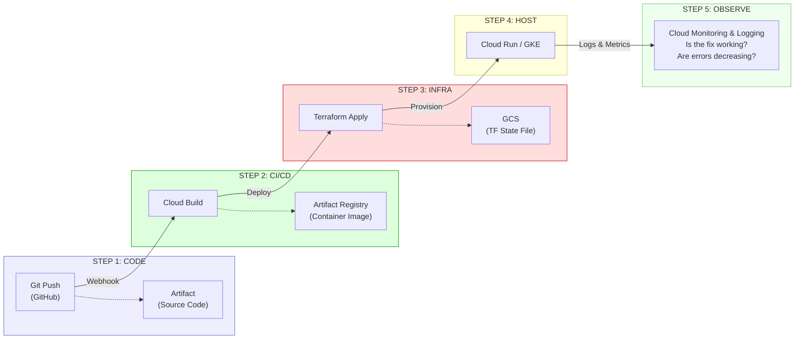

---

### Step 1: Code — The Developer Commits a Fix

```
Developer's Laptop
───────────────────

1. Engineer fixes a bug in payment_service.py:
   
   # Before (bug):
   total = item_price * quantity  # Missing tax calculation
   
   # After (fix):
   tax = item_price * quantity * tax_rate
   total = item_price * quantity + tax

2. Writes a test:
   
   def test_total_includes_tax():
       result = calculate_total(price=100, qty=2, tax_rate=0.08)
       assert result == 216.0  # 200 + 16 tax

3. Commits and pushes:
   
   git add payment_service.py tests/test_payment.py
   git commit -m "fix: include tax in order total calculation"
   git push origin fix/tax-calculation

4. Opens a Pull Request on GitHub.
```

**What happens next:** The `git push` triggers a webhook that GitHub sends to Cloud Build.

**The tool:** **Git + GitHub** — Version control and code collaboration. Git tracks every change. GitHub provides PRs, code review, and webhook integrations.

**The hand-off mechanism:** GitHub **webhook** → Cloud Build **trigger**. Cloud Build is configured to start a build when a PR is opened or updated against specific branches.

---

### Step 2: CI/CD — Cloud Build Tests, Builds, and Publishes

```
Cloud Build Pipeline
────────────────────

Trigger: GitHub webhook (PR opened against `main`)

┌─────────────────────────────────────────────────────────┐
│  Step 1: INSTALL DEPENDENCIES                           │
│  name: 'python:3.12'                                    │
│  entrypoint: 'pip'                                      │
│  args: ['install', '-r', 'requirements.txt']            │
│                                                         │
│  What: Installs Flask, SQLAlchemy, pytest, etc.         │
│  Why:  Build must be reproducible. Uses pinned versions.│
├─────────────────────────────────────────────────────────┤
│  Step 2: RUN TESTS                                      │
│  name: 'python:3.12'                                    │
│  entrypoint: 'pytest'                                   │
│  args: ['--cov=app', '--cov-fail-under=80', 'tests/']  │
│                                                         │
│  What: Runs all unit tests with coverage measurement.   │
│  Why:  Gate: if coverage < 80%, build FAILS.            │
│        The tax bug fix test runs here.                  │
├─────────────────────────────────────────────────────────┤
│  Step 3: LINT & SECURITY SCAN                           │
│  name: 'returntocorp/semgrep'                           │
│  args: ['semgrep', 'scan', '--config=auto', '--error']  │
│                                                         │
│  What: Static analysis for security vulnerabilities.    │
│  Why:  Catches SQL injection, hardcoded secrets, etc.   │
│        BEFORE they reach production.                    │
├─────────────────────────────────────────────────────────┤
│  Step 4: BUILD CONTAINER IMAGE                          │
│  name: 'gcr.io/kaniko-project/executor'                 │
│  args: [                                                │
│    '--destination=us-central1-docker.pkg.dev/           │
│      my-proj/services/payment-api:${SHORT_SHA}',        │
│    '--cache=true'                                       │
│  ]                                                      │
│                                                         │
│  What: Builds a Docker image containing the Python app. │
│  Why:  Container = portable, reproducible runtime.      │
│        Kaniko = builds inside Cloud Build without       │
│        needing Docker daemon (more secure).             │
│        --cache=true reuses unchanged layers (faster).   │
├─────────────────────────────────────────────────────────┤
│  Step 5: PUSH TO ARTIFACT REGISTRY                      │
│  (Automatic — kaniko pushes in Step 4)                  │
│                                                         │
│  What: The built image is stored in Artifact Registry.  │
│  Why:  AR is a private, secure container registry.      │
│        It scans images for known CVEs automatically.    │
│        It stores images close to Cloud Run / GKE.       │
├─────────────────────────────────────────────────────────┤
│  Step 6: POST RESULTS TO GITHUB PR                      │
│  (Via Cloud Build GitHub App integration)               │
│                                                         │
│  What: Green check ✅ or red X ❌ on the PR.            │
│  Why:  Reviewers see build status before approving.     │
└─────────────────────────────────────────────────────────┘
```

**The tool:** **Cloud Build** — GCP's serverless CI/CD platform. It runs each step as a container. Steps share a `/workspace` volume. No servers to manage.

**The hand-off mechanism:** Cloud Build pushes the image to **Artifact Registry** (tagged with the git commit SHA). On merge to `main`, a second trigger either invokes **Cloud Deploy** for managed rollouts, or runs `gcloud run deploy` / `kubectl apply` directly.

---

### Step 3: Infrastructure — Terraform Creates/Updates GCP Resources

```
Terraform Pipeline (runs in Cloud Build)
────────────────────────────────────────

WHEN: Triggered by changes to the /terraform/ directory in the repo.
      (Separate from the application CI/CD pipeline.)

┌─────────────────────────────────────────────────────────┐
│                                                         │
│  terraform init                                         │
│  │  Downloads provider plugins (google, google-beta).   │
│  │  Connects to GCS backend to load state.              │
│  │  Acquires state lock (prevents concurrent applies).  │
│  ▼                                                      │
│  terraform plan -out=tfplan                             │
│  │  Compares desired state (code) with actual state     │
│  │  (GCS state file) and real infrastructure (GCP API). │
│  │  Outputs: "Will create 1, update 2, destroy 0."     │
│  │                                                      │
│  │  Example output:                                     │
│  │  + google_cloud_run_v2_service.api (create)         │
│  │  ~ google_compute_firewall.allow_api (update)       │
│  │                                                      │
│  │  This plan is SAVED to a file (tfplan). The apply   │
│  │  will execute THIS EXACT plan, not a re-computed one.│
│  ▼                                                      │
│  [MANUAL APPROVAL FOR PROD — auto-approve for dev]      │
│  ▼                                                      │
│  terraform apply tfplan                                 │
│  │  Calls GCP APIs to create/modify/delete resources.  │
│  │  Updates the state file in GCS.                      │
│  │  Releases the state lock.                            │
│  ▼                                                      │
│  Post-apply validation                                  │
│     Smoke test: curl the Cloud Run URL, expect 200.     │
│                                                         │
└─────────────────────────────────────────────────────────┘
```

**The tool:** **Terraform** — An Infrastructure as Code (IaC) tool. You declare *what* infrastructure you want (in `.tf` files), and Terraform figures out *how* to create it (by calling cloud APIs).

**Why Terraform instead of clicking in the GCP Console?**

| GCP Console (ClickOps) | Terraform (IaC) |
|---|---|
| Changes are not tracked | Every change is in Git with an author |
| Can't reproduce across environments | `terraform apply` in dev, staging, and prod with same code |
| One person clicks; no review | PR-based review before apply |
| "Who changed this firewall rule last Tuesday?" — Unknown | `git log firewall.tf` — exact change, author, and PR link |
| Impossible to roll back reliably | `git revert` + `terraform apply` = infrastructure rollback |

**The hand-off mechanism:** Terraform creates the Cloud Run service (or GKE deployment) that references the container image in Artifact Registry. The infrastructure *points to* the application artifact.

---

### Step 4: Hosting — Cloud Run Serves Traffic

```
Cloud Run (Production)
──────────────────────

┌─────────────────────────────────────────────────────────┐
│                                                         │
│  Cloud Run receives the new container image and:       │
│                                                         │
│  1. Starts new container instances with the new image. │
│  2. Routes a portion of traffic to new instances.       │
│  3. Monitors health (HTTP health check to /healthz).   │
│  4. If healthy, shifts all traffic to new instances.    │
│  5. Drains and terminates old instances.                │
│                                                         │
│  Auto-scaling:                                          │
│  • Minimum instances: 1 (avoid cold start)             │
│  • Maximum instances: 100 (cost cap)                   │
│  • Scales based on concurrent requests per instance.    │
│  • Scales to ZERO if no traffic (pay nothing).         │
│                                                         │
│  Networking:                                            │
│  • HTTPS automatically (Google-managed TLS certificate) │
│  • Connected to VPC via Serverless VPC Connector       │
│  • Can reach Cloud SQL via private IP (never public)   │
│                                                         │
│  Identity:                                              │
│  • Runs as api-sa@ service account (via Terraform)     │
│  • Has ONLY roles/cloudsql.client + secretAccessor     │
│  • No static keys. Identity comes from the platform.   │
│                                                         │
└─────────────────────────────────────────────────────────┘

When to choose Cloud Run vs. GKE:

┌──────────────────────────┬──────────────────────────────┐
│  CLOUD RUN               │  GKE                         │
│                          │                              │
│  • Simpler (no cluster   │  • Full Kubernetes power     │
│    management)           │  • Custom networking (Istio) │
│  • Scale to zero         │  • Stateful workloads        │
│  • Per-request billing   │  • GPU/TPU workloads         │
│  • HTTP/gRPC only        │  • TCP/UDP services          │
│  • Best for: APIs,       │  • Best for: complex micro-  │
│    webhooks, simple      │    service architectures,    │
│    microservices         │    ML serving, databases     │
└──────────────────────────┴──────────────────────────────┘
```

---

### Step 5: Observe — Cloud Monitoring & Logging Verify the Fix

```
Cloud Operations Suite (Post-Deployment)
─────────────────────────────────────────

┌─────────────────────────────────────────────────────────┐
│  CLOUD LOGGING                                          │
│                                                         │
│  What: Collects and stores logs from all GCP services.  │
│  How:  Cloud Run automatically sends stdout/stderr to   │
│        Cloud Logging. No agent installation needed.     │
│                                                         │
│  The Python API writes structured logs:                 │
│                                                         │
│  import google.cloud.logging                            │
│  client = google.cloud.logging.Client()                 │
│  client.setup_logging()                                 │
│                                                         │
│  logger.info("Order total calculated",                  │
│    extra={"json_fields": {                              │
│      "order_id": "ord_123",                             │
│      "subtotal": 200.0,                                 │
│      "tax": 16.0,                                       │
│      "total": 216.0,                                    │
│      "tax_rate": 0.08                                   │
│    }})                                                  │
│                                                         │
│  You can query in Logs Explorer:                        │
│  resource.type="cloud_run_revision"                     │
│  jsonPayload.order_id="ord_123"                         │
│                                                         │
│  → See the exact calculation for that order.            │
│  → Verify the tax fix is working correctly.             │
│                                                         │
├─────────────────────────────────────────────────────────┤
│  CLOUD MONITORING                                       │
│                                                         │
│  What: Collects metrics and sends alerts.               │
│  How:  Cloud Run automatically reports:                 │
│        • Request count                                  │
│        • Request latency (P50, P95, P99)               │
│        • Container instance count                       │
│        • CPU and memory utilization                     │
│                                                         │
│  Post-deployment, you check:                            │
│  1. Error rate: Did the deploy introduce new 5xx errors?│
│     → If error rate INCREASED, the fix has a bug.       │
│     → Rollback immediately.                             │
│                                                         │
│  2. Latency: Did P99 latency change?                   │
│     → If latency INCREASED, the fix may have a         │
│       performance problem (e.g., extra DB query).      │
│                                                         │
│  3. Custom metric (from the Python app):               │
│     → "orders_with_tax_calculated_total" counter.       │
│     → If this counter is incrementing, the fix is live. │
│                                                         │
│  Alerting:                                              │
│  An alerting policy fires if:                           │
│    error_rate > 1% for > 5 minutes → PagerDuty page    │
│                                                         │
│  This closes the feedback loop:                         │
│  Code → Build → Deploy → OBSERVE → (back to Code)     │
└─────────────────────────────────────────────────────────┘
```

### The Complete Hand-Off Chain

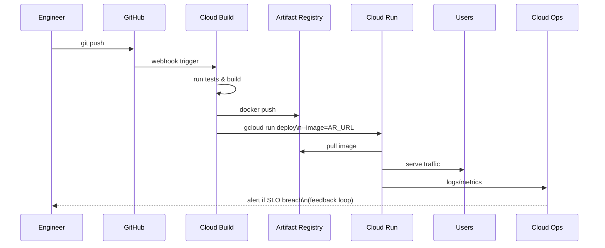

---

## 0.5 The 5-Year DevOps Engineer Interview Gauntlet

---

### Q1: "Your 3-tier Python API on Cloud Run is exposed to the internet. An auditor reports that the Cloud SQL database has a public IP. Walk me through every step to harden this architecture against unauthorized access."

**Model Answer:**

This is a **defense-in-depth** problem. I'd address it in layers, from outermost to innermost:

**Layer 1: Eliminate the database public IP.**

This is the most critical and immediate fix. A database with a public IP is directly attackable from anywhere on the internet.

```hcl
# Terraform: Disable public IP on Cloud SQL
resource "google_sql_database_instance" "main" {
  settings {
    ip_configuration {
      ipv4_enabled    = false  # Remove public IP entirely
      private_network = google_compute_network.main.id

      # Allocate a private IP range for Cloud SQL
      # (uses Private Service Connection / VPC peering)
    }
  }
}
```

After this change, the database is *invisible* to the internet. It only has a private IP (e.g., `10.2.0.3`) reachable from within the VPC.

**Layer 2: Connect Cloud Run to the VPC.**

Cloud Run is serverless — it doesn't natively live inside your VPC. To reach the private Cloud SQL instance, you need a **Serverless VPC Access Connector**:

```hcl
resource "google_vpc_access_connector" "main" {
  name          = "api-connector"
  region        = "us-central1"
  ip_cidr_range = "10.8.0.0/28"
  network       = google_compute_network.main.id
}

resource "google_cloud_run_v2_service" "api" {
  template {
    vpc_access {
      connector = google_vpc_access_connector.main.id
      egress    = "PRIVATE_RANGES_ONLY"
      # Only route PRIVATE IP traffic through VPC.
      # Public internet traffic (if needed) uses Cloud Run's
      # default egress, NOT your VPC (cleaner separation).
    }
  }
}
```

**Layer 3: Firewall rules restricting database access.**

Even within the VPC, I'd add explicit firewall rules allowing only the connector's CIDR (`10.8.0.0/28`) to reach Cloud SQL on port `5432`. All other traffic to the database is denied.

**Layer 4: IAM database authentication.**

Replace the traditional username/password with **Cloud SQL IAM authentication**. The Python API's service account is granted the `roles/cloudsql.instanceUser` role, and the database user is mapped to the SA identity:

```sql
-- In PostgreSQL:
CREATE USER "api-sa@my-project.iam" WITH LOGIN;
GRANT SELECT, INSERT, UPDATE ON ALL TABLES IN SCHEMA public TO "api-sa@my-project.iam";
-- No password. Authentication is via IAM token, auto-rotated.
```

Now there's no password to steal, rotate, or leak.

**Layer 5: Cloud Run ingress controls.**

Restrict Cloud Run to only accept traffic from the **Load Balancer**, not directly from the internet:

```hcl
resource "google_cloud_run_v2_service" "api" {
  ingress = "INGRESS_TRAFFIC_INTERNAL_LOAD_BALANCER"
  # Blocks: curl https://api-xyz.run.app (direct access)
  # Allows: traffic through the Google Cloud Load Balancer only
}
```

**Layer 6: Cloud Armor WAF.**

Attach a **Cloud Armor security policy** to the Load Balancer. This provides:
- DDoS protection (automatic with Google's Anycast network)
- IP allowlisting/denylisting
- Rate limiting (e.g., max 100 requests per IP per minute)
- OWASP Top 10 rule sets (SQL injection, XSS detection)

**Layer 7: Audit trail.**

Enable **Cloud Audit Logs** for data access. Every query to Cloud SQL is logged. If someone accesses data they shouldn't, you have the forensic trail.

**Summary — the hardened architecture has 7 layers of defense.** An attacker would need to bypass Cloud Armor, the Load Balancer, Cloud Run's ingress restriction, the VPC connector, the firewall rules, IAM authentication, *and* PostgreSQL's GRANT permissions to reach the data. That's defense in depth.

---

### Q2: "Your Python API runs in a private subnet with no public IP. During Cloud Build, `pip install` fails because it can't reach PyPI. The security team refuses to give the build environment a public IP. How do you solve this?"

**Model Answer:**

This is the classic **egress-from-private-network** problem. There are three architectures, each with different trade-offs:

**Solution A: Cloud NAT (simplest, usually correct)**

Cloud NAT lets resources in a private subnet make outbound connections to the internet without having their own public IP. It rewrites the source IP to a NAT address.

```hcl
resource "google_compute_router_nat" "build_nat" {
  name   = "build-nat"
  router = google_compute_router.main.name
  region = "us-central1"

  nat_ip_allocate_option             = "AUTO_ONLY"
  source_subnetwork_ip_ranges_to_nat = "LIST_OF_SUBNETWORKS"

  subnetwork {
    name                    = google_compute_subnetwork.build.id
    source_ip_ranges_to_nat = ["ALL_IP_RANGES"]
  }
}
```

**Trade-off:** Traffic does leave your network and reaches the public internet. The security team may object because the *response* traffic (PyPI's response) is coming from untrusted sources. You're trusting that PyPI hasn't been compromised (supply chain risk).

**Solution B: Artifact Registry Remote Repository (better security)**

Configure Artifact Registry as a **remote repository** that proxies and caches PyPI. Your build environment only talks to Artifact Registry (a GCP service reachable via Private Google Access — no internet needed).

```hcl
resource "google_artifact_registry_repository" "pypi_proxy" {
  repository_id = "pypi-proxy"
  format        = "PYTHON"
  mode          = "REMOTE_REPOSITORY"
  location      = "us-central1"

  remote_repository_config {
    python_repository {
      public_repository = "PYPI"
    }
  }
}
```

Then in `pip.conf`:
```ini
[global]
index-url = https://us-central1-python.pkg.dev/my-project/pypi-proxy/simple/
```

**Trade-off:** First-time downloads still go to PyPI (through Google's infrastructure, not yours). Subsequent downloads are served from cache. You can also scan cached packages for vulnerabilities before allowing them in builds.

**Solution C: Fully airgapped (maximum security, maximum complexity)**

- Maintain an **internal PyPI mirror** (e.g., using `devpi` or `bandersnatch`) inside the VPC.
- All packages are vetted and approved before being added to the mirror.
- Build environments only talk to the internal mirror.

**Trade-off:** Highest security but massive operational burden. You need a team to maintain the mirror, vet packages, and keep them updated. Only justified for financial services, defense, or healthcare with strict regulatory requirements.

**My recommendation:** Solution B (Artifact Registry remote repository). It gives you:
- No public IP needed (Private Google Access)
- Caching (faster builds, resilience to PyPI outages)
- Vulnerability scanning (Artifact Registry scans cached packages)
- Minimal operational burden (fully managed by GCP)

---

### Q3: "Two engineers ran `terraform apply` at the same time and the state file got corrupted. Half the infrastructure is in an unknown state. Walk me through recovery and prevention."

**Model Answer:**

**Understanding the failure mode:**

Terraform state is a JSON file that maps resource names in your code to real resource IDs in GCP. When two engineers run `apply` simultaneously:

1. Both read the same state file.
2. Both compute plans based on that (now-stale) state.
3. Both try to write updated state.
4. Result: One write overwrites the other. The state file now reflects only *one* of the two applies. Resources created by the other apply exist in GCP but are "unknown" to Terraform — **orphaned resources**.

**Immediate recovery:**

**Step 1:** Stop all Terraform operations immediately. Communicate to the team: "Terraform state is corrupted. Do NOT run plan or apply."

**Step 2:** Identify the damage. Run `terraform plan` (read-only) and look for:
- Resources that Terraform wants to *create* that actually already exist (orphaned from the lost apply).
- Resources that Terraform doesn't know about at all.

**Step 3:** For each orphaned resource, use `terraform import` to bring it back into state:

```bash
# Example: Cloud Run service exists in GCP but not in TF state
terraform import google_cloud_run_v2_service.api \
  projects/my-project/locations/us-central1/services/payment-api
```

**Step 4:** After importing all orphans, run `terraform plan` again. A clean plan (no changes) confirms state is consistent.

**Step 5:** If state is too corrupted, restore from GCS versioning (which you should have enabled):

```bash
# List previous versions of the state file
gsutil ls -la gs://my-tf-state/prod/default.tfstate

# Restore the last known good version
gsutil cp gs://my-tf-state/prod/default.tfstate#1704067200 \
  gs://my-tf-state/prod/default.tfstate
```

**Prevention — Five measures:**

1. **State locking (GCS native).** GCS backend supports native locking. When `terraform apply` starts, it acquires a lock. A second `apply` will see the lock and fail immediately with `Error: Error locking state: ...`.

   ```hcl
   # This is automatic with the GCS backend. No extra config needed.
   terraform {
     backend "gcs" {
       bucket = "my-tf-state"
       prefix = "prod"
     }
   }
   ```

2. **CI/CD-only applies.** No human should ever run `terraform apply` locally. All applies go through Cloud Build, which serializes pipeline runs. Two PRs merged simultaneously will be queued, not parallelized.

3. **GCS versioning enabled.** Point-in-time recovery for state corruption:

   ```hcl
   resource "google_storage_bucket" "tf_state" {
     name     = "my-tf-state"
     location = "US"

     versioning {
       enabled = true
     }

     lifecycle_rule {
       condition { num_newer_versions = 30 }
       action { type = "Delete" }
     }
   }
   ```

4. **`-lock-timeout` flag.** If a lock is held (e.g., by a stuck apply), `terraform apply -lock-timeout=5m` will wait up to 5 minutes before failing, instead of failing immediately. This handles the case where an apply is just slow, not stuck.

5. **State split.** As covered in Module 3, splitting state by component (network, compute, data) means a corruption in the compute state doesn't affect the network state. Blast radius is reduced.

---

### Q4: "You have three teams — Frontend, Backend, and Data Engineering — sharing one GCP project. The data team accidentally deleted the backend team's Pub/Sub topic. Design IAM boundaries to prevent cross-team interference."

**Model Answer:**

This is an **IAM segmentation** problem. The root cause is all three teams sharing a single project with overly broad permissions. There are two architectural approaches:

**Approach A: Multi-Project Architecture (recommended)**

Give each team their own GCP project. Cross-project access is granted explicitly and narrowly.

```
Organization: company.com
│
├── Folder: "Frontend"
│   └── Project: "frontend-prod"
│       └── Cloud Run (React SSR), Cloud CDN, GCS
│
├── Folder: "Backend"
│   └── Project: "backend-prod"
│       └── Cloud Run (Python API), Pub/Sub topics, Cloud SQL
│
├── Folder: "Data Engineering"
│   └── Project: "data-prod"
│       └── BigQuery, Dataflow, GCS data lake
│
└── Folder: "Shared Infrastructure"
    └── Project: "shared-networking"
        └── Shared VPC, Cloud NAT, DNS
```

**Cross-team access (narrowly scoped):**
```hcl
# Data team needs to READ from the Backend team's Pub/Sub topic.
# Grant ONLY subscribe permission on the SPECIFIC topic.
resource "google_pubsub_topic_iam_member" "data_subscriber" {
  project = "backend-prod"
  topic   = "order-events"
  role    = "roles/pubsub.subscriber"
  member  = "serviceAccount:pipeline-sa@data-prod.iam.gserviceaccount.com"
}
# The Data team can subscribe to "order-events" but CANNOT:
# - Delete it
# - Create new topics
# - Access any other Backend resource
```

**Why this works:** Project-level isolation is the strongest boundary in GCP. IAM policies are per-project. The data team's `roles/editor` on `data-prod` gives them zero access to `backend-prod`. Cross-project access requires explicit IAM bindings.

**Approach B: Resource-Level IAM within a Single Project (fallback)**

If organizational constraints prevent multi-project, use resource-level IAM:

```hcl
# Instead of granting the Data team roles/pubsub.admin on the PROJECT,
# grant them roles/pubsub.admin ONLY on their own topics.

resource "google_pubsub_topic_iam_member" "data_own_topic" {
  project = "shared-project"
  topic   = "data-pipeline-events"    # Their topic
  role    = "roles/pubsub.admin"
  member  = "group:data-team@company.com"
}

# They get ZERO permissions on backend topics.
# They can't even SEE backend topics in the Console
# (if you also deny roles/pubsub.viewer at the project level).
```

**Additional safeguards:**
- **Organization Policies:** `constraints/iam.allowedPolicyMemberDomains` — prevent external users from being granted access.
- **VPC Service Controls:** Create a perimeter around each team's project. Even if IAM is misconfigured, VPC-SC prevents data exfiltration across perimeters.
- **IAM Conditions:** Time-bound access for cross-team permissions:
  ```hcl
  condition {
    title       = "temporary_access"
    description = "Data team access expires in 90 days"
    expression  = "request.time < timestamp('2025-04-01T00:00:00Z')"
  }
  ```
- **IAM Recommender:** Run quarterly. It will identify unused permissions and recommend removal. If the Data team was granted `pubsub.admin` but only ever uses `pubsub.subscriber`, the Recommender will flag it.

---

### Q5: "Design a complete, production-ready Terraform pipeline for a team of 10 engineers deploying to both staging and production on GCP. Address state management, secrets, drift detection, and cost estimation."

**Model Answer:**

**Architecture overview:**

```
┌─────────────────────────────────────────────────────────────────────────┐
│                TERRAFORM PIPELINE ARCHITECTURE                          │
│                                                                         │
│         PR Created                   Merged to main                    │
│             │                             │                             │
│             ▼                             ▼                             │
│  ┌──────────────────────┐     ┌──────────────────────────┐             │
│  │  Cloud Build: PLAN   │     │  Cloud Build: APPLY      │             │
│  │                      │     │                          │             │
│  │  1. tf fmt -check    │     │  1. tf plan -out=tfplan  │             │
│  │  2. tf validate      │     │  2. STAGING: auto-apply  │             │
│  │  3. tflint           │     │  3. Smoke test staging   │             │
│  │  4. tfsec scan       │     │  4. PROD: manual approve │             │
│  │  5. tf plan          │     │  5. tf apply tfplan      │             │
│  │  6. infracost diff   │     │  6. Smoke test prod      │             │
│  │  7. Post to PR       │     │  7. Notify Slack         │             │
│  └──────────────────────┘     └──────────────────────────┘             │
│                                                                         │
│  State Backend:                                                        │
│  gs://my-org-tf-state/                                                 │
│  ├── staging/network/default.tfstate                                   │
│  ├── staging/compute/default.tfstate                                   │
│  ├── prod/network/default.tfstate                                      │
│  └── prod/compute/default.tfstate                                      │
│                                                                         │
│  Authentication: Workload Identity Federation (Cloud Build → SA)       │
│  No JSON keys anywhere.                                                │
└─────────────────────────────────────────────────────────────────────────┘
```

**State management:**

```hcl
# backend.tf (per environment, per component)
terraform {
  backend "gcs" {
    bucket = "my-org-tf-state"
    prefix = "prod/compute"  # Unique per env + component
  }
}
```

The state bucket has:
- **Versioning:** Enabled for point-in-time recovery.
- **Object lifecycle:** Keep 30 versions. Delete versions older than 90 days.
- **Encryption:** Customer-Managed Encryption Key (CMEK) via Cloud KMS. State files contain sensitive info (resource IDs, sometimes outputs with connection strings).
- **IAM:** Only the Cloud Build service account has `roles/storage.objectAdmin`. Engineers have `roles/storage.objectViewer` (can read state for debugging but can't corrupt it).

**Secrets handling in Terraform:**

```hcl
# NEVER put secrets in .tf files or terraform.tfvars.
# Reference them from Secret Manager or use variables with no default.

# Method 1: Read from Secret Manager (for resources that need a secret)
data "google_secret_manager_secret_version" "db_password" {
  secret = "db-password-prod"
}

resource "google_sql_user" "app_user" {
  instance = google_sql_database_instance.main.name
  name     = "app"
  password = data.google_secret_manager_secret_version.db_password.secret_data
}

# Method 2: Mark outputs as sensitive
output "db_connection_string" {
  value     = "postgresql://app:${local.db_password}@${google_sql_database_instance.main.private_ip_address}:5432/appdb"
  sensitive = true  # Won't be printed in plan/apply output
}
```

**Drift detection (automated, daily):**

```yaml
# cloudbuild-drift-detection.yaml
# Triggered by Cloud Scheduler daily at 06:00 UTC
steps:
  - name: 'hashicorp/terraform:1.7'
    entrypoint: 'sh'
    args:
      - '-c'
      - |
        terraform init -backend-config="prefix=prod/compute"
        terraform plan -detailed-exitcode -out=drift.tfplan 2>&1 | tee plan_output.txt
        EXIT_CODE=$?
        if [ $EXIT_CODE -eq 2 ]; then
          echo "⚠️ DRIFT DETECTED in prod/compute" 
          # Exit code 2 = changes detected (drift)
          # Post to Slack via webhook
          curl -X POST "$_SLACK_WEBHOOK" \
            -d "{\"text\": \"🚨 Terraform drift detected in prod/compute. Someone made manual changes via Console.\"}"
        fi
```

Drift detection catches **ClickOps** — when someone changes infrastructure manually via the GCP Console instead of through Terraform. This is one of the most insidious sources of infrastructure bugs: Terraform's state says one thing, GCP reality says another, and the next `apply` may cause unexpected changes.

**Cost estimation (Infracost):**

```yaml
  - name: 'infracost/infracost:ci-0.10'
    entrypoint: 'sh'
    args:
      - '-c'
      - |
        infracost diff \
          --path=. \
          --format=json \
          --out-file=/workspace/infracost.json
        
        infracost comment github \
          --path=/workspace/infracost.json \
          --repo=$_GITHUB_REPO \
          --pull-request=$_PR_NUMBER \
          --github-token=$$GITHUB_TOKEN
```

This posts a comment on the PR like:

```
💰 Monthly cost estimate:

+ google_compute_instance.batch_worker    $73.00/mo
~ google_sql_database_instance.main       $156.00/mo → $312.00/mo (tier upgrade)

Total change: +$229.00/mo
```

Engineers and reviewers see the cost impact *before* approving the PR. This prevents "surprise bills" from unreviewed infrastructure changes.

**Promotion flow (staging → prod):**

1. Merge to `main` triggers the apply pipeline.
2. Pipeline runs `terraform apply` against **staging** first (auto-approve).
3. Smoke test validates staging infrastructure.
4. If staging passes, pipeline **pauses for manual approval** (Cloud Build supports approval gates for production).
5. After a human approves, `terraform apply` runs against **production** with the same code.
6. Post-apply smoke test verifies production.
7. Slack notification: "✅ Terraform apply to production successful. PR #456 by @alice."

This ensures the same code is tested in staging before touching production, and a human reviews the production apply plan.

---

# Module 1: SRE & DevOps Foundations

---

## 1.1 Core Philosophy: Why DevOps & SRE Exist

### The Business Problem

Traditional IT organizations split engineering into two adversarial tribes:

```
┌─────────────────────────────────────────────────────────────────┐
│                    TRADITIONAL IT MODEL                         │
│                                                                 │
│   Development Team              Operations Team                 │
│   ┌─────────────────┐          ┌─────────────────┐             │
│   │ Incentive:      │          │ Incentive:      │             │
│   │ Ship features   │──WALL──▶│ Keep things     │             │
│   │ as fast as      │ OF      │ stable; minimize│             │
│   │ possible        │ CONF-   │ change          │             │
│   │                 │ USION   │                 │             │
│   │ Metric: velocity│          │ Metric: uptime  │             │
│   └─────────────────┘          └─────────────────┘             │
│                                                                 │
│   Result: Change is the enemy of stability.                     │
│           Stability is the enemy of velocity.                   │
│           Both teams fail.                                      │
└─────────────────────────────────────────────────────────────────┘
```

This creates a **structural conflict**: Dev is measured on feature throughput, Ops is measured on uptime. Every deployment is a negotiation. The result is:

- **Long release cycles** (weeks → months) to batch risk.
- **Massive blast radius** per release (thousands of lines changed).
- **Finger-pointing** during outages ("your code broke it" vs "your infra failed").
- **Heroic ops** culture that burns out engineers.

### MTTR vs. MTBF: The Fundamental Reliability Tradeoff

There are two philosophical strategies for achieving reliability:

| Strategy | Approach | Failure Mode |
|---|---|---|
| **Maximize MTBF** (Mean Time Between Failures) | Prevent failures from ever occurring. Heavy change-control boards, long QA cycles, frozen environments. | Failures still happen, but now teams are unpracticed at recovery. When failures occur, they are catastrophic. |
| **Minimize MTTR** (Mean Time To Recovery) | Accept that failures are inevitable. Invest in detection, diagnosis, and automated recovery. Deploy small, roll back fast. | Requires deep observability, automation, and cultural maturity. |

**The SRE insight:** For complex distributed systems, **minimizing MTTR dominates maximizing MTBF** beyond a certain complexity threshold. You cannot prevent all failures in a system with millions of moving parts. But you *can* detect a failure in seconds, diagnose it in minutes, and recover automatically.

**Availability math that proves this:**

$$A = \frac{MTBF}{MTBF + MTTR}$$

Consider two systems:

| System | MTBF | MTTR | Availability |
|---|---|---|---|
| A (MTBF-focused) | 720 hrs (30 days) | 4 hrs | 99.45% |
| B (MTTR-focused) | 168 hrs (7 days) | 5 min | 99.95% |

System B fails **4x more often** but is **an order of magnitude more available** because it recovers in 5 minutes instead of 4 hours.

### DevOps: Cultural + Technical Transformation

DevOps is not a tool, a job title, or a team. It is an organizational philosophy built on five pillars (CALMS):

| Pillar | What It Means in Practice |
|---|---|
| **Culture** | Shared ownership of production. No "throw it over the wall." Dev carries pagers. |
| **Automation** | If a human does it more than twice, automate it. Toil is the enemy. |
| **Lean** | Small batch sizes. Limit WIP. Continuous flow. Eliminate waste. |
| **Measurement** | Data-driven decisions. Measure lead time, deployment frequency, MTTR, change failure rate (the DORA four). |
| **Sharing** | Blameless culture. Post-mortems are learning artifacts, not accountability tools. |

### SRE: Google's Opinionated Implementation of DevOps

SRE is what happens when you treat operations as a software engineering problem. Ben Treynor Sloss defined it as:

> "SRE is what happens when you ask a software engineer to design an operations function."

Key differentiators from generic "DevOps":

| Concept | DevOps Says | SRE Says |
|---|---|---|
| Reliability target | "Be reliable" | "Define an SLO. Anything above it is wasted opportunity cost." |
| Toil | "Automate things" | "Toil must be < 50% of an SRE's time. Measure it. Budget it." |
| Risk | "Move fast, don't break things" | "Error budgets quantify exactly how much breakage is acceptable." |
| Incident response | "Have a process" | "Structured incident command with defined roles (IC, Comms Lead, Ops Lead)." |
| Change management | "CI/CD" | "Progressive rollouts with automatic rollback triggered by SLO burn rate." |

### Toil: The Silent Killer

**Toil** is not just "work I don't like." It has a precise definition:

Toil is work that is:
1. **Manual** — a human performs it
2. **Repetitive** — done over and over
3. **Automatable** — a machine could do it
4. **Tactical** — reactive, interrupt-driven
5. **Without enduring value** — does not permanently improve the system
6. **Scales linearly with service growth** — O(n) with load

Examples:

| Toil | Not Toil |
|---|---|
| Manually restarting a crashed pod | Writing an auto-restart controller |
| Running a deployment script by hand | Building a CI/CD pipeline |
| Manually rotating certificates | Implementing cert-manager with auto-renewal |
| Responding to the same alert class repeatedly | Writing a runbook automation that self-heals |

**The 50% rule:** SRE teams at Google enforce that no more than 50% of an SRE's time should be spent on toil. The remaining 50% is spent on engineering work that *eliminates* future toil.

---

## 1.2 Key Mechanisms: Cultural Pillars vs. Technical Automation

### Shift-Left Testing

"Shift left" means moving quality gates earlier in the development lifecycle, where defects are cheapest to fix:

```
                          COST TO FIX A DEFECT
                          
        $                                              $14,102
        ▲                                            ┌──────┐
        │                                            │      │
        │                                   $3,880   │      │
        │                                 ┌──────┐   │      │
        │                                 │      │   │      │
        │                       $977      │      │   │      │
        │                     ┌──────┐    │      │   │      │
        │           $315      │      │    │      │   │      │
        │         ┌──────┐    │      │    │      │   │      │
        │  $139   │      │    │      │    │      │   │      │
        │ ┌────┐  │      │    │      │    │      │   │      │
        └─┤    ├──┤      ├────┤      ├────┤      ├───┤      ├──▶
          Design   Code     Unit     Integration  Production
                              Test       Test
          
         ◀───── SHIFT LEFT ─────────────────────────────────
```

Shift-left techniques by stage:

| Stage | Technique | Tool Examples |
|---|---|---|
| Design | Threat modeling, architecture review | STRIDE, RFC process |
| Code | Linting, SAST, pre-commit hooks | ESLint, Semgrep, gitleaks |
| Build | Unit tests, dependency scanning | pytest, Trivy, Snyk |
| Integration | Contract tests, E2E in staging | Pact, Cypress, Selenium |
| Deploy | Canary analysis, feature flags | Kayenta, LaunchDarkly |
| Production | Chaos engineering, SLO monitoring | Litmus, Gremlin |

### CI/CD Pipeline Architecture (Production-Grade)

A mature CI/CD pipeline is not just "build and deploy." It is a risk-management system:

```
┌──────────────────────────────────────────────────────────────────────────┐
│                     PRODUCTION CI/CD PIPELINE                            │
│                                                                          │
│  ┌─────────┐    ┌──────────┐    ┌───────────┐    ┌──────────────────┐   │
│  │  CODE    │    │  BUILD   │    │  PUBLISH  │    │    DEPLOY        │   │
│  │  STAGE   │    │  STAGE   │    │   STAGE   │    │    STAGE         │   │
│  │          │    │          │    │           │    │                  │   │
│  │ • Lint   │───▶│ • Compile│───▶│ • Push to │───▶│ • Canary (5%)   │   │
│  │ • SAST   │    │ • Unit   │    │   Artifact│    │ • Soak (1hr)    │   │
│  │ • Secret │    │   tests  │    │   Registry│    │ • Linear ramp   │   │
│  │   scan   │    │ • DAST   │    │ • Sign    │    │   25%→50%→100%  │   │
│  │ • Commit │    │ • SCA    │    │   image   │    │ • Auto-rollback │   │
│  │   sign   │    │ • Fuzz   │    │ • SBOM    │    │   on SLO breach │   │
│  └─────────┘    └──────────┘    └───────────┘    └──────────────────┘   │
│       │              │               │                    │              │
│       ▼              ▼               ▼                    ▼              │
│  ┌─────────────────────────────────────────────────────────────────┐    │
│  │              QUALITY GATES (each stage must pass)               │    │
│  │  • Code coverage ≥ 80%     • Zero critical CVEs                │    │
│  │  • All tests green         • Image signed & verified           │    │
│  │  • Canary error rate < SLO • P99 latency < baseline + 10%     │    │
│  └─────────────────────────────────────────────────────────────────┘    │
└──────────────────────────────────────────────────────────────────────────┘
```

#### Key CI/CD Trade-offs

| Decision | Option A | Option B | Production Recommendation |
|---|---|---|---|
| **Trunk-based vs. GitFlow** | Trunk-based: short-lived branches, continuous integration | GitFlow: long-lived branches, release branches | Trunk-based for high-velocity teams. Feature flags replace feature branches. |
| **Monorepo vs. Polyrepo** | Monorepo: single repo, atomic cross-service changes | Polyrepo: per-service repos, independent release cycles | Monorepo for tightly coupled services. Polyrepo for independently deployable microservices. |
| **Build caching** | Hermetic builds (reproducible, slow) | Cached builds (fast, risk of cache poisoning) | Layer caching with content-addressable hashes. Verify cache integrity. |
| **Deployment strategy** | Blue/Green (instant switchover, 2x resources) | Canary (gradual, less resource overhead) | Canary for stateless services. Blue/Green for stateful services where you need instant rollback. |

---

## 1.3 SRE Metrics Framework: SLIs, SLOs, SLAs, and Error Budgets

### The Hierarchy

```
┌─────────────────────────────────────────────────────────┐
│                                                         │
│   SLA  ──▶  Business contract with financial penalties  │
│    ▲        "99.9% availability or we refund 10%"       │
│    │                                                    │
│   SLO  ──▶  Internal engineering target                 │
│    ▲        "We target 99.95% availability"             │
│    │        (Tighter than SLA to create safety margin)  │
│    │                                                    │
│   SLI  ──▶  The actual measurement                     │
│             "Proportion of requests < 300ms that        │
│              return non-5xx responses"                  │
│                                                         │
└─────────────────────────────────────────────────────────┘
```

### SLI (Service Level Indicator) — Mathematical Formulation

An SLI is a quantitative measure of some aspect of the level of service being provided. It is always expressed as a **ratio**:

$$SLI = \frac{\text{Good Events}}{\text{Total Events}} \times 100\%$$

Common SLI types:

| SLI Type | Good Event Definition | Total Event Definition | Example |
|---|---|---|---|
| **Availability** | Requests with non-5xx response | All requests | `sum(rate(http_requests_total{code!~"5.."}[5m])) / sum(rate(http_requests_total[5m]))` |
| **Latency** | Requests served < threshold | All requests | `histogram_quantile(0.99, rate(http_request_duration_seconds_bucket[5m])) < 0.3` |
| **Correctness** | Requests returning correct data | All requests | Requires application-level probes or checksums |
| **Freshness** | Data updated within threshold | All data items | `time() - last_update_timestamp < threshold` |
| **Throughput** | Successfully processed items | All submitted items | Pipeline completion rate |

**Critical implementation detail:** SLIs should be measured **at the load balancer or edge**, not at the application server. Why? If the server is down, it can't report its own failure. The load balancer observes the failure as a 503/timeout.

### SLO (Service Level Objective) — Setting the Target

An SLO is the target value (or range) for an SLI:

$$SLO: SLI \geq Target$$

Example: "99.9% of HTTP requests will return a non-5xx response within 300ms, measured over a rolling 30-day window."

**How to choose an SLO target:**

1. **Start with user expectations.** What latency/error rate causes users to abandon the product?
2. **Consider dependencies.** Your SLO cannot exceed the reliability of your least reliable critical dependency.
3. **Factor in cost.** Each additional "9" costs ~10x more. Going from 99.9% to 99.99% is not a linear investment.

**Dependency ceiling calculation:**

If service A depends on services B and C (both required for every request):

$$SLO_A \leq SLO_B \times SLO_C$$

If $SLO_B = 99.95\%$ and $SLO_C = 99.95\%$:

$$SLO_A \leq 0.9995 \times 0.9995 = 0.99900025 \approx 99.9\%$$

You cannot promise four 9s if your dependencies only provide three 9s each.

### SLA (Service Level Agreement) — The Business Contract

An SLA is an SLO with **financial consequences**:

| SLA Tier | Monthly Uptime | Credit |
|---|---|---|
| Standard | ≥ 99.9% | — |
| Degraded | 99.0%–99.9% | 10% credit |
| Major outage | 95.0%–99.0% | 25% credit |
| Critical outage | < 95.0% | 50% credit |

**Best practice:** The SLO should be **stricter** than the SLA. If your SLA promises 99.9%, set your internal SLO at 99.95%. This creates a buffer zone where you can detect and fix degradation before it becomes a contractual breach.

### Error Budget — The Innovation Fuel

The Error Budget is the **complement** of the SLO:

$$\text{Error Budget} = 1 - SLO$$

For a 99.9% SLO over 30 days:

$$\text{Error Budget} = 1 - 0.999 = 0.001 = 0.1\%$$

In concrete terms:

| Window | Allowed Downtime at 99.9% SLO |
|---|---|
| 30 days | 43.2 minutes |
| 90 days | 129.6 minutes |
| 365 days | 525.6 minutes (8.76 hours) |

**Error Budget Policy — The Enforcement Mechanism:**

```
┌────────────────────────────────────────────────────────────────┐
│                    ERROR BUDGET POLICY                          │
│                                                                │
│   Budget Remaining ≥ 50%                                       │
│   ├── Normal development velocity                              │
│   ├── Standard deployment cadence                              │
│   └── Experimentation encouraged                               │
│                                                                │
│   Budget Remaining 20%–50%                                     │
│   ├── Increased deployment scrutiny                            │
│   ├── Mandatory canary analysis                                │
│   └── Reliability work prioritized in sprint planning          │
│                                                                │
│   Budget Remaining ≤ 20%                                       │
│   ├── Feature freeze until budget recovers                     │
│   ├── All engineering effort on reliability                    │
│   ├── Root cause analysis for all recent incidents             │
│   └── Architecture review triggered                            │
│                                                                │
│   Budget Exhausted (0%)                                        │
│   ├── Hard deployment freeze (only rollbacks/hotfixes)         │
│   ├── Executive escalation                                     │
│   └── Post-mortem for budget exhaustion event                  │
└────────────────────────────────────────────────────────────────┘
```

**Why error budgets are revolutionary:** They resolve the Dev vs. Ops conflict. When budget is healthy, Dev ships fast. When budget is burned, everyone focuses on reliability. The SLO is the *objective arbiter* — no more arguments about "fast enough" vs. "stable enough."

### Multi-Window, Multi-Burn-Rate Alerting

Naive SLO alerting ("alert when availability drops below 99.9% in the last 30 days") is too slow. By the time you alert, you may have already burned your entire budget.

Instead, use **burn rate** alerting:

$$\text{Burn Rate} = \frac{\text{Observed Error Rate}}{\text{Allowed Error Rate (from SLO)}}$$

A burn rate of 1.0 means you'll exactly exhaust your budget at the end of the window. A burn rate of 14.4 means you'll exhaust your 30-day budget in **2 hours**.

**Multi-window alert configuration:**

| Severity | Long Window | Short Window | Burn Rate | Budget Consumed When Alert Fires |
|---|---|---|---|---|
| Page (Critical) | 1 hour | 5 minutes | 14.4x | 2% |
| Page (High) | 6 hours | 30 minutes | 6x | 5% |
| Ticket (Medium) | 3 days | 6 hours | 1x | 10% |

The **short window** prevents stale alerts (the error might have already stopped). The **long window** provides statistical significance.

---

## 1.4 Operational Reliability

### Incident Response Lifecycle

```
┌─────────────────────────────────────────────────────────────────────────┐
│                    INCIDENT LIFECYCLE                                    │
│                                                                         │
│   DETECT          TRIAGE         MITIGATE       RESOLVE       LEARN    │
│   ┌──────┐       ┌──────┐       ┌──────┐       ┌──────┐     ┌──────┐  │
│   │Alert │──────▶│Sev   │──────▶│Stop  │──────▶│Root  │────▶│Post- │  │
│   │fires │       │assess│       │bleed-│       │cause │     │Mortem│  │
│   │      │       │      │       │ing   │       │fix   │     │      │  │
│   │•Mon- │       │•Sev1:│       │      │       │      │     │•Time-│  │
│   │ itor │       │ page │       │•Roll │       │•Code │     │ line │  │
│   │•User │       │•Sev2:│       │ back │       │ fix  │     │•Root │  │
│   │ rept │       │ page │       │•Fea- │       │•Infra│     │ cause│  │
│   │•Syn- │       │•Sev3:│       │ ture │       │ fix  │     │•Actn │  │
│   │ thtc │       │ tkt  │       │ flag │       │•Cfg  │     │ items│  │
│   │ test │       │•Sev4:│       │•Drain│       │ fix  │     │•Prev │  │
│   │      │       │ log  │       │ node │       │      │     │ entn │  │
│   └──────┘       └──────┘       │•Scale│       └──────┘     └──────┘  │
│                                 │ up   │                               │
│                                 └──────┘                               │
│                                                                         │
│   ◀── 5 min ──▶ ◀── 5 min ──▶ ◀── 30 min ──▶ ◀── hrs/days ──▶       │
│                                                                         │
│   KEY PRINCIPLE: MITIGATE FIRST, ROOT-CAUSE LATER.                     │
│   Rollback > Debugging in production during an active incident.        │
└─────────────────────────────────────────────────────────────────────────┘
```

#### Incident Command System (ICS) Roles

| Role | Responsibility | Who |
|---|---|---|
| **Incident Commander (IC)** | Owns the incident. Coordinates. Makes decisions. Does NOT debug. | On-call rotation lead |
| **Operations Lead** | Executes technical mitigation (rollbacks, scaling, failovers). | SRE on-call |
| **Communications Lead** | Updates status page, stakeholders, and customers. | EngOps / PM |
| **Subject Matter Experts** | Brought in for specific domain knowledge (DB, networking, auth). | Escalated as needed |
| **Scribe** | Documents timeline, actions, and decisions in real-time. | Any available engineer |

**Critical rule:** The IC should **never** be the person debugging. Their job is to maintain situational awareness, delegate, and make escalation decisions. Combining IC and debugger roles causes tunnel vision.

### Blameless Post-Mortems

A blameless post-mortem is not about finding **who** caused the incident. It's about finding **what systemic conditions** allowed the incident to occur and persist.

**Post-Mortem Template:**

```
Title: [Service] [Impact] on [Date]
Severity: SEV-1
Duration: 47 minutes
Impact: 12% of API requests returned 503 for 47 minutes.
        ~340,000 failed requests. Error budget consumed: 18%.

Timeline (UTC):
14:00 — Deploy of commit abc123 begins canary rollout (5%)
14:03 — Canary metrics show P99 latency spike 300ms → 2.1s
14:05 — Canary auto-analysis PASSES (bug: only checked error 
         rate, not latency)
14:07 — Rollout progresses to 25%
14:12 — PagerDuty alert fires: "API latency SLO burn rate > 6x"
14:15 — IC declared. On-call begins investigation.
14:22 — Root cause identified: N+1 query introduced in new ORM 
         migration. Each API call now makes 47 DB queries instead of 2.
14:25 — Rollback initiated.
14:28 — Rollback complete. Latency returns to baseline.
14:47 — All queued requests drained. Incident resolved.

Root Cause:
ORM migration in commit abc123 changed eager loading to lazy 
loading for the UserProfile → Permissions relationship. This 
caused an N+1 query pattern that was not caught by unit tests 
(which mock the DB) or integration tests (which use a small 
test dataset of 3 records).

Contributing Factors:
1. Canary analysis only evaluated error rate, not latency.
2. Integration test dataset too small to surface N+1 performance.
3. No query-count assertions in performance tests.
4. ORM change was a transitive dependency update, not in the 
   PR's diff — reviewer did not see it.

Action Items:
| # | Action | Owner | Priority | Deadline |
|---|--------|-------|----------|----------|
| 1 | Add latency SLI to canary analysis config | @sre-team | P0 | 3 days |
| 2 | Add query-count performance tests | @backend | P1 | 1 sprint |
| 3 | Increase integration test dataset to 10K records | @qa | P1 | 1 sprint |
| 4 | Add ORM dependency change detection to PR bot | @platform | P2 | 2 sprints |

Lessons Learned:
- Canary analysis is only as good as the metrics it evaluates.
- "All tests pass" is a meaningless signal if tests don't 
  exercise realistic data volumes.
- Transitive dependency changes are a blind spot in code review.
```

### On-Call Rotations: Design Principles

| Principle | Implementation |
|---|---|
| **Sustainable pace** | ≤ 1 week on-call per month. 2 pages/shift maximum target. |
| **Adequate staffing** | Minimum 8 people in rotation (for sick days, vacations, burnout prevention). |
| **Compensation** | On-call time compensated (either pay or time-off-in-lieu). |
| **Escalation paths** | Primary → Secondary → Tertiary. Auto-escalate after 5 min no-ack. |
| **Runbooks** | Every alert must link to a runbook. No alert without a runbook. |
| **Handoff quality** | End-of-rotation handoff document: open issues, recent changes, known risks. |
| **Follow-the-sun** | For global teams, hand off on-call across time zones to avoid night pages. |

### Chaos Engineering

Chaos Engineering is the discipline of **experimenting on a system** to build confidence in its ability to withstand turbulent conditions in production.

**The Scientific Method of Chaos:**

```
1. HYPOTHESIZE  ──▶  "Our system can tolerate the loss of one 
                      availability zone without user impact."

2. DEFINE STEADY     "P99 latency < 300ms, error rate < 0.1%, 
   STATE          ──▶ all SLOs green."

3. INTRODUCE         "Terminate all pods in us-central1-a."
   CHAOS          ──▶

4. OBSERVE        ──▶ "Did the system maintain steady state?"

5. LEARN          ──▶ "If yes, confidence increased. If no, 
                      you found a weakness BEFORE production 
                      found it for you."
```

**Chaos Experiment Categories:**

| Category | Examples | Tools |
|---|---|---|
| **Infrastructure** | Kill nodes, AZ failure, disk fill | Litmus, Gremlin, Chaos Monkey |
| **Network** | Packet loss, latency injection, DNS failure | tc (traffic control), Toxiproxy |
| **Application** | Memory leak injection, CPU stress, exception injection | Chaos Toolkit, fault injection libraries |
| **Dependency** | Kill downstream service, slow database, certificate expiry | Simian Army, custom fault injection |

**Safety controls for Chaos in production:**
- **Blast radius limits:** Start with a single pod, then node, then zone.
- **Automatic halt:** If SLO violation is detected, immediately stop the experiment.
- **Business-hours only:** Run chaos experiments during working hours when teams are available.
- **Communication:** Announce experiments. Shadow channels, not surprise outages.

---

## Module 1: Case Interview Questions & Answers

---

### Q1: "Your team's deployment just caused a 30-minute outage. Walk me through how you'd handle this, and what you'd change to prevent recurrence."

**Model Answer:**

**Immediate Response (Mitigate First):**
During the incident, I would *not* debug the root cause. I'd initiate rollback immediately. A 30-minute outage at 99.9% SLO consumes ~69% of a monthly error budget (43.2 min allowed). Every second of continued debugging instead of rolling back is an unacceptable cost.

Parallel actions:
- IC declares the incident and opens a war room channel.
- Communications Lead updates the status page to "Investigating."
- Ops Lead executes rollback to last-known-good version.
- Once mitigated, we move to diagnosis.

**Post-Incident (Prevent Recurrence):**
I'd run a blameless post-mortem focused on the systemic gaps:
1. **Why wasn't this caught in CI?** — Possibly insufficient test coverage or test data not representative of production.
2. **Why did the canary not catch it?** — Perhaps canary traffic was too small (< 1%), or analysis metrics were incomplete, or soak time was too short.
3. **Why was MTTR 30 minutes?** — Was rollback automated? Was there a runbook? Was the on-call engineer familiar with the service?

Action items would target all three gaps with specific, measurable, time-bound deliverables.

**Structural changes:**
- Implement multi-window burn-rate alerting tied to SLOs (detect in < 5 min).
- Add latency + error rate + saturation to canary analysis (not just error rate).
- Automate rollback: if canary SLO violation detected, roll back without human intervention.
- Minimum 15-minute soak time at 5% traffic before progressive rollout.

---

### Q2: "How would you set an SLO for a service that has no historical data?"

**Model Answer:**

This is the cold-start problem for SLOs. My approach:

1. **Start with user expectations, not engineering capability.** Interview product managers and customer support: "What response time causes user complaints?" "What error rate causes customer churn?" This gives you a *ceiling* for acceptable badness.

2. **Instrument first, promise later.** Deploy the SLI measurement (e.g., availability and latency at the load balancer) *without* setting an SLO. Collect 2-4 weeks of baseline data.

3. **Set a provisional SLO at the observed baseline minus a small buffer.** If observed availability is 99.97%, set the initial SLO at 99.9%. This ensures the SLO is achievable while still providing meaningful signal.

4. **Iterate quarterly.** After one quarter, review: Were there any SLO violations? Were they correlated with user complaints? If the SLO is too loose (never breached, but users still complain), tighten it. If too tight (breached frequently with no user impact), loosen it.

5. **Key principle:** An SLO is a *living document*, not a contract set in stone. The right SLO is one where breaching it reliably predicts user unhappiness.

---

### Q3: "Explain error budgets to a VP of Product who wants to know why SRE is blocking their feature launch."

**Model Answer:**

"VP, I understand the urgency. Here's the situation in business terms:

We promised our customers 99.9% uptime. That gives us 43 minutes of allowed downtime per month. Think of it as a checking account — we have 43 minutes to 'spend.'

This month, we've already spent 38 minutes on two incidents. We have 5 minutes left. If we deploy this feature and it causes even a small issue, we breach our contractual SLA, which triggers customer credits and — more importantly — erodes customer trust.

Here are our options:
1. **Wait 11 days** for the budget to reset with the rolling window.
2. **Deploy with extra safeguards** — I can do a 1% canary with a 2-hour soak and automated rollback. This reduces risk but doesn't eliminate it.
3. **Accept the risk explicitly** — you sign off that you're willing to potentially breach the SLA if the feature is business-critical enough.

The error budget isn't SRE blocking Product. It's the *data* telling us we've used our risk allowance. I'm here to give you options, not to say no."

---

### Q4: "What's the difference between a postmortem action item that says 'be more careful' and a good action item?"

**Model Answer:**

"Be more careful" is not an action item. It's a wish. It has no mechanism, no measurement, and no accountability.

A good action item follows the **SMART + systemic** framework:

**Bad:** "Engineers should be more careful with database migrations."
**Good:** "Add a pre-merge CI check that runs `EXPLAIN ANALYZE` on all new SQL queries against a production-sized dataset and fails the build if any query exceeds 100ms or performs a full table scan. Owner: @platform-team. Deadline: March 15."

The difference:
- **Mechanism:** A CI check, not human vigilance.
- **Measurement:** Pass/fail with concrete thresholds.
- **Automation:** Removes the human from the critical path.
- **Systemic:** Fixes the *class* of problem, not just this instance.

The litmus test: "Will this action item prevent the *next* engineer who makes the *same type* of mistake from causing the *same type* of incident?" If it relies on that engineer remembering to be careful, it will fail.

---
---

# Module 2: Monitoring, Logging & Observability

---

## 2.1 Observability Pillars: Metrics, Traces, Logs

Observability is the ability to infer the **internal state** of a system by examining its **external outputs**. It differs from monitoring:

| Monitoring | Observability |
|---|---|
| Answers known questions ("Is CPU high?") | Answers unknown questions ("Why is this user's request slow?") |
| Pre-defined dashboards | Ad-hoc, exploratory queries |
| Knows the failure modes in advance | Discovers novel failure modes |
| Necessary | Necessary AND sufficient |

### The Three Pillars — Deep Dive

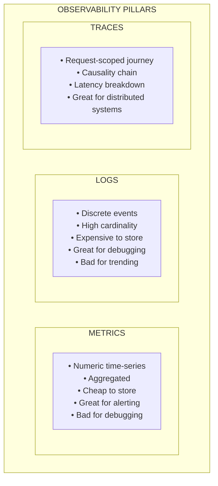
│                    ┌───────▼───────┐                          │
│                    │  CORRELATION  │                          │
│                    │  via TraceID  │                          │
│                    │  + timestamp  │                          │
│                    └───────────────┘                          │
└───────────────────────────────────────────────────────────────┘
```

### Metrics — The Aggregate View

Metrics are **numeric time-series** data points. They tell you *what* is happening at a system level.

**Types of metrics:**

| Type | Description | Example | Storage Cost |
|---|---|---|---|
| **Counter** | Monotonically increasing value. Only goes up (or resets to 0). | `http_requests_total` | Very low |
| **Gauge** | Point-in-time value. Can go up or down. | `temperature_celsius`, `queue_depth` | Very low |
| **Histogram** | Samples observations and counts them in configurable buckets. | `http_request_duration_seconds_bucket` | Medium (per bucket) |
| **Summary** | Like histogram but calculates quantiles client-side. | `http_request_duration_seconds{quantile="0.99"}` | Medium |

**Histogram vs. Summary — The Critical Trade-off:**

| Dimension | Histogram | Summary |
|---|---|---|
| Aggregatable across instances? | **Yes** (can merge buckets) | **No** (quantiles don't aggregate) |
| Accurate quantiles? | Depends on bucket boundaries | Yes (configurable accuracy) |
| CPU cost | Low (just increment bucket counters) | High (maintains sorted stream) |
| Recommendation | **Use histograms** for almost everything | Only if you need exact quantiles for a single instance |

**Why histograms over summaries?** In a fleet of 100 pods, you can merge histogram buckets to compute fleet-wide P99. You *cannot* merge per-pod P99 summaries — the P99 of P99s is mathematically meaningless.

### Distributed Tracing — The Request-Scoped View

A trace represents the **complete journey** of a single request through a distributed system:

```
Trace ID: abc-123-def

Service A (API Gateway)         ┌───────────────────────────┐
  Span 1: HTTP GET /user/42     │ 0ms ─────────────── 250ms │
                                └─────────┬─────────────────┘
                                          │
Service B (User Service)                  │  ┌──────────────────┐
  Span 2: getUserById(42)                 └──│ 15ms ──── 180ms  │
                                             └──┬────────┬──────┘
                                                │        │
Service C (Cache)                               │        │
  Span 3: cache.get("user:42")  ┌───────┐      │        │
           MISS                 │20-22ms│◀─────┘        │
                                └───────┘                │
                                                         │
Service D (Database)                                     │
  Span 4: SELECT * FROM users   ┌────────────────┐      │
           WHERE id=42          │ 25ms ── 170ms  │◀─────┘
                                └────────────────┘
                                
 Key Insight: 145ms of the 250ms total is spent in the DB query.
 The cache miss caused a DB fallback that dominates latency.
```

**Trace context propagation:**

Every request carries a trace context (typically via HTTP headers):

```
traceparent: 00-abc123def456-span789-01
             │   │              │     │
             │   Trace ID       │     Sampled flag
             Version           Span ID
```

**W3C Trace Context** is the standard. OpenTelemetry implements it. The trace context must be propagated through:
- HTTP headers (automatic with instrumented HTTP clients)
- Message queue metadata (Kafka headers, PubSub attributes)
- gRPC metadata
- Thread-local storage (for in-process propagation)

**Sampling strategies:**

| Strategy | Description | Trade-off |
|---|---|---|
| **Head-based** (probabilistic) | Decide at ingress whether to sample (e.g., 1% of requests) | May miss rare errors (a 0.01% error rate means 1 in 100 sampled errors) |
| **Tail-based** | Collect all spans, decide *after* request completes whether to keep | Captures all errors/slow requests, but requires buffering all spans temporarily — very expensive |
| **Adaptive** | Dynamically adjust sample rate based on traffic volume | Best of both worlds, but complex to implement |

**Production recommendation:** Use tail-based sampling with an OpenTelemetry Collector pipeline. Sample 100% of errors/slow requests, 1-5% of successful requests.

### Structured Logging — The Event-Scoped View

**Unstructured log (bad):**
```
2024-01-15 14:23:45 ERROR Failed to process payment for user john@example.com amount $42.99 timeout after 30s
```

**Structured log (good):**
```json
{
  "timestamp": "2024-01-15T14:23:45.123Z",
  "severity": "ERROR",
  "message": "Payment processing failed",
  "service": "payment-service",
  "traceId": "abc-123-def",
  "spanId": "span-789",
  "userId": "usr_a1b2c3",
  "amount": 42.99,
  "currency": "USD",
  "errorType": "TIMEOUT",
  "timeoutMs": 30000,
  "paymentProvider": "stripe",
  "retryCount": 3,
  "requestId": "req_x9y8z7"
}
```

**Why structured logging matters:**

1. **Queryable:** `severity = "ERROR" AND service = "payment-service" AND amount > 100` — impossible with unstructured logs.
2. **Correlatable:** The `traceId` field links this log to the distributed trace and to logs from other services handling the same request.
3. **Parseable:** No regex needed. Fields are explicitly typed.
4. **Indexable:** Log backends can index specific fields for fast queries.

**Log levels and their semantics:**

| Level | When to Use | Operational Meaning |
|---|---|---|
| **FATAL/CRITICAL** | Process cannot continue. | Page immediately. |
| **ERROR** | Operation failed. Requires attention. | Ticket or page depending on rate. |
| **WARNING** | Something unexpected but handled. | Monitor trend. Alert if rate increases. |
| **INFO** | Normal operational events (request served, job completed). | Audit trail. No alert. |
| **DEBUG** | Detailed diagnostic information. | **Never enable in production** unless actively debugging. Volume will kill your log budget. |

---

## 2.2 Monitoring Methodologies: RED, USE, and The Four Golden Signals

### RED Method (Request-Driven Services)

RED is optimized for **request-driven services** (APIs, web servers, microservices):

| Signal | What It Measures | Prometheus Example |
|---|---|---|
| **R**ate | Requests per second | `rate(http_requests_total[5m])` |
| **E**rrors | Failed requests per second (or error ratio) | `rate(http_requests_total{code=~"5.."}[5m]) / rate(http_requests_total[5m])` |
| **D**uration | Latency distribution | `histogram_quantile(0.99, rate(http_request_duration_seconds_bucket[5m]))` |

**When to use RED:** For any service that *serves requests*. API gateways, web servers, gRPC services, GraphQL endpoints.

**When NOT to use RED:** For infrastructure components (databases, message queues, storage systems) that are better modeled as *resources*.

### USE Method (Resource-Oriented Components)

USE is optimized for **resources** (CPU, memory, disk, network, database connections):

| Signal | What It Measures | Example |
|---|---|---|
| **U**tilization | Percentage of resource capacity in use | CPU at 78%, disk at 92%, connection pool 45/50 |
| **S**aturation | Work queued because resource is fully utilized | CPU run queue depth, disk I/O queue, thread pool queue |
| **E**rrors | Resource-level error events | ECC memory errors, NIC CRC errors, disk I/O errors |

**Critical insight:** **Saturation** is the most actionable signal. A CPU at 80% utilization tells you it's busy. A CPU with a run queue depth of 47 tells you work is *waiting* — and that's when users feel pain.

**Saturation vs. Utilization Matrix:**

```
                          UTILIZATION
                    Low              High
              ┌──────────────┬──────────────┐
         Low  │   HEALTHY    │  EFFICIENT   │
SATURATION    │  (idle)      │  (optimized) │
              ├──────────────┼──────────────┤
         High │  CONFIG BUG  │  OVERLOADED  │
              │  (limits too │  (need more  │
              │   low)       │   capacity)  │
              └──────────────┴──────────────┘
```

Low utilization + high saturation = **misconfigured limits**. Example: connection pool size set to 5, but CPU is idle. Increase the pool. High utilization + high saturation = **capacity exhaustion**. Scale up or out.

### The Four Golden Signals (Google SRE)

The Four Golden Signals are Google's recommended **minimum monitoring** for any service:

| Signal | Description | Subtlety |
|---|---|---|
| **Latency** | Time to serve a request | Must distinguish **successful** request latency from **error** request latency. A fast 500 error is not a "fast response." |
| **Traffic** | Demand on the system | Measure in domain-relevant units. HTTP requests/sec for a web server. Transactions/sec for a database. Messages/sec for a queue. |
| **Errors** | Rate of failed requests | Must include **explicit** errors (HTTP 5xx) AND **implicit** errors (HTTP 200 with wrong content, responses exceeding latency SLO). |
| **Saturation** | How "full" the service is | Measure the resource that will saturate first (the bottleneck). Requires *capacity planning* to know the ceiling. |

### Comparing the Three Methodologies

```
┌─────────────────────────────────────────────────────────────────┐
│              METHODOLOGY SELECTION GUIDE                        │
│                                                                 │
│   "What type of thing am I monitoring?"                        │
│                                                                 │
│   ┌──────────────────────────┐                                 │
│   │  Request-driven service? │──YES──▶ Use RED or Golden 4     │
│   │  (API, web server, gRPC) │                                 │
│   └──────────┬───────────────┘                                 │
│              NO                                                 │
│              ▼                                                  │
│   ┌──────────────────────────┐                                 │
│   │  Resource/infrastructure?│──YES──▶ Use USE                 │
│   │  (CPU, disk, DB, queue)  │                                 │
│   └──────────┬───────────────┘                                 │
│              NO                                                 │
│              ▼                                                  │
│   ┌──────────────────────────┐                                 │
│   │  Batch/pipeline system?  │──YES──▶ Use custom signals:     │
│   │  (ETL, ML training)      │        throughput, lag,         │
│   └──────────────────────────┘        completeness, freshness  │
│                                                                 │
│   BEST PRACTICE: Use ALL methodologies together.               │
│   RED for your services. USE for their underlying resources.   │
│   Golden 4 as the unifying framework for SLO-based alerting.  │
└─────────────────────────────────────────────────────────────────┘
```

---

## 2.3 Centralized Logging Architecture

### Production Log Ingestion Pipeline

```
┌─────────────────────────────────────────────────────────────────────────┐
│                 CENTRALIZED LOGGING ARCHITECTURE                        │
│                                                                         │
│  ┌──────────┐  ┌──────────┐  ┌──────────┐  ┌──────────┐  ┌─────────┐ │
│  │  LOG     │  │ COLLECT  │  │  BUFFER  │  │  PROCESS │  │  STORE  │ │
│  │ SOURCES  │  │          │  │          │  │          │  │         │ │
│  │          │  │          │  │          │  │          │  │         │ │
│  │•App logs │─▶│•Fluent   │─▶│•Kafka /  │─▶│•Logstash │─▶│•Hot:    │ │
│  │•System   │  │ Bit      │  │ Pub/Sub  │  │ / Flink  │  │ Elastic │ │
│  │ logs     │  │•OTel     │  │          │  │          │  │ (7 days)│ │
│  │•Audit    │  │ Collector│  │ WHY:     │  │•Parse    │  │         │ │
│  │ logs     │  │•Filebeat │  │ Back-    │  │•Enrich   │  │•Warm:   │ │
│  │•Network  │  │          │  │ pressure │  │•Filter   │  │ S3/GCS  │ │
│  │ flow     │  │ ROLE:    │  │ handling │  │•Redact   │  │ (90 day)│ │
│  │ logs     │  │ Tail     │  │ Decouple │  │ PII      │  │         │ │
│  │          │  │ files,   │  │ producer │  │•Route to │  │•Cold:   │ │
│  │          │  │ add      │  │ from     │  │ tier     │  │ Archive │ │
│  │          │  │ metadata,│  │ consumer │  │          │  │ (1+ yr) │ │
│  │          │  │ forward  │  │          │  │          │  │         │ │
│  └──────────┘  └──────────┘  └──────────┘  └──────────┘  └─────────┘ │
│                                                                         │
│  CRITICAL DESIGN DECISIONS:                                            │
│                                                                         │
│  1. BUFFER IS NON-NEGOTIABLE. Without Kafka/PubSub, a downstream       │
│     outage (Elastic down) causes log loss (agents drop logs) or        │
│     backpressure (agents block app processes).                         │
│                                                                         │
│  2. PII REDACTION must happen in the PROCESS stage, BEFORE storage.    │
│     Once PII hits Elasticsearch, you have a compliance problem.        │
│                                                                         │
│  3. LOG ROUTING by severity: ERROR/FATAL → hot tier (fast search).     │
│     INFO → warm tier (compressed). DEBUG → cold/dropped.               │
└─────────────────────────────────────────────────────────────────────────┘
```

### Retention Tiers and Cost Management

Log storage is one of the largest infrastructure costs. A typical production system generates **1-10 GB/day per service**. At 50 services, that's 50-500 GB/day.

| Tier | Storage Backend | Retention | Query Speed | Cost (relative) |
|---|---|---|---|---|
| **Hot** | Elasticsearch / Loki / Cloud Logging | 7-14 days | Sub-second | $$$$ |
| **Warm** | GCS / S3 (compressed, indexed) | 30-90 days | Seconds-minutes | $$ |
| **Cold** | GCS Archive / S3 Glacier | 1-7 years | Minutes-hours | $ |

**Cost reduction strategies:**

1. **Sampling:** Log 100% of errors, 10% of successful requests. Use deterministic sampling by request ID so you can reconstruct full traces.
2. **Aggregation at the edge:** Instead of shipping every log line, aggregate counters (e.g., "47 successful logins from IP range X in the last minute") and ship the aggregate.
3. **Drop debug/verbose logs in production.** They're 80% of volume but 0% of operational value.
4. **Exclusion filters:** Filter out health check logs, readiness probe logs, and other noise before ingestion.
5. **Field-level indexing:** Don't index every field. Index `severity`, `service`, `traceId`, `userId`. Store the rest as raw text.

### Kafka vs. Pub/Sub as Log Buffer

| Dimension | Apache Kafka | Google Cloud Pub/Sub |
|---|---|---|
| **Operations** | Self-managed (ZooKeeper/KRaft, brokers, partitions). Complex. | Fully managed. Zero ops. |
| **Ordering** | Per-partition ordering guaranteed | Per-key ordering with ordering keys |
| **Retention** | Configurable (hours to infinite). Log compaction. | 7 days default, configurable up to 31 days |
| **Throughput** | Millions of msgs/sec (with enough partitions) | Millions of msgs/sec (auto-scales) |
| **Replay** | Consumer offset management. Full replay possible. | Seek-to-timestamp. Full replay within retention. |
| **Cost** | Infrastructure cost (VMs, disks). Scales with ops effort. | Pay-per-message. Scales with usage. |
| **Recommendation** | Use when: you need infinite retention, complex stream processing (Kafka Streams), or multi-cloud portability. | Use when: you're on GCP, want zero ops overhead, and retention ≤ 31 days is acceptable. |

---

## 2.4 Alerting Best Practices

### Alert Fatigue: The Silent Killer of Reliability

Alert fatigue occurs when engineers receive so many alerts that they start ignoring them. This is **more dangerous than having no alerting at all** — it creates a false sense of security.

**Symptoms of alert fatigue:**
- On-call engineers auto-ack alerts without investigating.
- Alerts are muted or snoozed habitually.
- Real incidents are missed because they're buried in noise.
- Engineer turnover increases on on-call-heavy teams.

### Symptom-Based vs. Cause-Based Alerting

```
┌─────────────────────────────────────────────────────────────────┐
│                                                                 │
│   CAUSE-BASED (Bad)                SYMPTOM-BASED (Good)        │
│                                                                 │
│   "CPU > 90%"                      "P99 latency > 500ms AND   │
│                                     error rate > 1%"           │
│                                                                 │
│   Problem: CPU at 91% might be      This alert fires when     │
│   perfectly fine during a batch      USERS ARE AFFECTED.       │
│   job. You page someone at 3 AM      CPU might be at 95%      │
│   for nothing.                       but if latency is fine,  │
│                                      no page.                  │
│                                                                 │
│   ───────────────────────────────────────────────────────────  │
│                                                                 │
│   "Disk > 80%"                     "Service returning > 0.1%  │
│                                     5xx responses"             │
│   Problem: Some disks are                                      │
│   designed to run at 90%.          Users are seeing errors.    │
│   This generates constant          Page-worthy.               │
│   noise.                                                       │
│                                                                 │
│   RULE: Alert on user-facing symptoms (SLO violations).       │
│         Dashboard on causes (CPU, memory, disk).               │
│         Causes go in runbooks, not in PagerDuty.              │
└─────────────────────────────────────────────────────────────────┘
```

### Alert Design Checklist

Every alert must answer YES to all of these questions:

| Question | If NO... |
|---|---|
| Does this alert indicate **user impact** (actual or imminent)? | Convert to a dashboard panel or log-based metric. |
| Is this alert **actionable**? Can the on-call do something about it right now? | Remove it. Non-actionable alerts are noise. |
| Does this alert require **human judgment**? | If not, automate the response instead of alerting. |
| Does this alert have a **runbook**? | Write one before enabling the alert. |
| Is this alert **tuned to avoid false positives**? (< 5% false positive rate) | Adjust thresholds, add duration clauses, or use multi-signal conditions. |
| Would you be **comfortable waking someone at 3 AM** for this? | Downgrade to business-hours ticket or remove. |

### Deduplication and Escalation Architecture

```
┌─────────────────────────────────────────────────────────────────────────┐
│                    ALERT ROUTING PIPELINE                                │
│                                                                         │
│  ┌──────────┐    ┌──────────────┐    ┌──────────────┐    ┌──────────┐  │
│  │ MONITORS │    │ ALERT ROUTER │    │ DEDUPLICATION│    │ ESCALATION│  │
│  │          │    │              │    │   ENGINE     │    │  POLICY   │  │
│  │ •Prom-  │───▶│ •Severity   │───▶│              │───▶│           │  │
│  │  etheus │    │  classify   │    │ •Group by   │    │ •0 min:   │  │
│  │ •Cloud  │    │ •Route by   │    │  service +  │    │  Primary  │  │
│  │  Monitor│    │  service    │    │  alert name │    │  on-call  │  │
│  │ •Custom │    │  owner      │    │ •Suppress   │    │ •5 min:   │  │
│  │  checks │    │ •Inhibit    │    │  duplicates │    │  Secondary│  │
│  │          │    │  child      │    │  for 10min  │    │ •15 min:  │  │
│  │          │    │  alerts if  │    │ •Count and  │    │  Team lead│  │
│  │          │    │  parent     │    │  aggregate  │    │ •30 min:  │  │
│  │          │    │  fires      │    │             │    │  Director │  │
│  └──────────┘    └──────────────┘    └──────────────┘    └──────────┘  │
│                                                                         │
│  INHIBITION EXAMPLE:                                                   │
│  If "node_down" alert fires for node X, inhibit all pod-level         │
│  alerts on node X. The engineer doesn't need 47 alerts telling        │
│  them that 47 pods on a dead node are unhealthy.                      │
└─────────────────────────────────────────────────────────────────────────┘
```

### Real-World Production Incident: Alert Fatigue Leading to Outage

**Scenario:** An e-commerce platform had 3,400 active alert rules. On-call engineers received an average of 127 alerts per 12-hour shift. Most were false positives or non-actionable (disk warnings, CPU spikes during cron jobs).

**The failure:** A legitimate database replication lag alert fired at 2:47 AM. The on-call engineer, who had already been woken 4 times that night for false positives, snoozed the alert. Replication lag increased over 2 hours until the replica fell so far behind that a failover event caused 12 minutes of data inconsistency, affecting 8,400 orders.

**The fix:**
1. **Alert audit:** Reviewed all 3,400 alerts. Deleted 2,100 (62%) that were non-actionable or duplicates.
2. **Symptom-based conversion:** Replaced 800 cause-based alerts with 45 SLO-based alerts.
3. **Severity recalibration:** Only 12 alerts remained as "page-worthy." The rest became tickets.
4. **Result:** On-call pages dropped from 127/shift to 2.3/shift. MTTA (Mean Time to Acknowledge) dropped from 14 minutes to 47 seconds.

---

## Module 2: Case Interview Questions & Answers

---

### Q1: "Your microservices architecture has 50 services. Users report intermittent slowness, but no single service shows errors. How do you diagnose this?"

**Model Answer:**

This is a classic distributed systems debugging problem. The key insight is: **latency problems in microservices are almost always at the boundaries** (network, serialization, connection pool exhaustion), not within a single service.

**Step 1: Start with the user-facing symptom.**
Check the edge/API gateway latency metrics. Confirm the problem is real and quantify it: "P99 latency increased from 200ms to 1.8s starting at 14:00."

**Step 2: Distributed tracing.**
Pull traces for slow requests (P99+). The trace waterfall will show which service-to-service hop introduces the latency. Common findings:
- A downstream service has a long tail latency that cascades upstream.
- A serialization/deserialization step is slow (e.g., a 2MB JSON payload).
- Connection pool exhaustion causing queuing (saturation, not errors).

**Step 3: If tracing is not instrumented (common reality):**
Use **correlation by timestamp**. Look at all 50 services' latency metrics at 14:00. Find the service whose latency spike *precedes* the others — that's your likely root cause. The others are victims of the slow dependency.

**Step 4: The USE method for the suspect service.**
Once I've identified the suspect service, I'd check its resources:
- **Connection pool utilization**: Is it at max_connections?
- **Thread pool saturation**: Are requests queuing?
- **GC pressure**: Is the JVM doing full GCs?
- **Downstream dependency latency**: Is *its* database slow?

**Step 5: Verify with a targeted experiment.**
If I suspect service X's database, I'd check query execution times, connection counts, and replication lag. If confirmed, I'd mitigate (e.g., add connection pool capacity, optimize the slow query, add caching).

**Key learning to share with the interviewer:** Intermittent slowness with no errors is the *hardest* type of problem to diagnose. It often points to **saturation** — a resource that's at capacity but not failing. This is why the USE method's "saturation" signal is more important than "utilization."

---

### Q2: "Explain how you'd design the alerting strategy for a new service from scratch."

**Model Answer:**

I'd follow a layered approach — starting from user impact and working inward:

**Layer 1: SLO-based alerts (the only alerts that page)**
- Define SLIs: availability (non-5xx ratio) and latency (P99 < threshold).
- Set SLO: e.g., 99.9% availability, 99% of requests < 300ms.
- Configure multi-window burn-rate alerts:
  - Critical (page): 14.4x burn rate over 1 hour + 5-min short window.
  - High (page): 6x burn rate over 6 hours + 30-min short window.
  - Medium (ticket): 1x burn rate over 3 days.

**Layer 2: Symptom dashboards (not alerts)**
- RED metrics: request rate, error rate, latency distribution.
- Dependency health: latency and error rate for each downstream call.
- These are for *diagnosis during an incident*, not for paging.

**Layer 3: Resource dashboards (not alerts)**
- USE metrics for CPU, memory, disk, network, connection pools.
- Used for *capacity planning* and *root cause analysis*, not paging.

**Layer 4: Business metrics (ticket-priority alerts)**
- Checkout conversion rate, signup rate, search result quality.
- Alert if these drop significantly (> 2 standard deviations) — might indicate a functional bug that doesn't trigger technical SLO violations.

**The key principle I'd emphasize:** Start with *zero alerts* and add only when justified. Every alert is a burden. The service owner must be able to justify each alert against the checklist: is it actionable? Does it indicate user impact? Would I wake someone for it?

---

### Q3: "We're spending $800K/year on log storage. How would you cut costs by 60% without losing critical observability?"

**Model Answer:**

$800K → target $320K. I'd attack the three largest cost drivers: volume, retention, and indexing.

**1. Volume Reduction (target: 50% reduction)**
- **Drop debug/trace logs in production.** These are typically 60-70% of volume. If engineers need them, enable dynamically per-service with a feature flag for time-limited windows.
- **Sample INFO logs.** Log 100% of ERROR+, but sample 10% of INFO for successful requests. Use deterministic sampling (hash of request ID % 10 == 0) so you can reconstruct full traces for sampled requests.
- **Filter at the agent level.** Drop health check logs, readiness probe logs, and Kubernetes control plane noise in Fluent Bit before they ever hit the buffer.

**2. Tiered Retention (target: 30% cost reduction)**
- **Hot tier (Elasticsearch/Cloud Logging):** 7 days, not 30. This is where 95% of queries happen.
- **Warm tier (GCS with BigQuery for ad-hoc queries):** 90 days. Compressed, columnar. 10x cheaper than hot.
- **Cold tier (GCS Archive):** 1-7 years for compliance. 100x cheaper than hot.

**3. Smart Indexing (target: 20% cost reduction)**
- Index only high-value fields: `timestamp`, `severity`, `service`, `traceId`, `userId`, `errorCode`.
- Store the remaining fields as non-indexed JSON blob. Still searchable, just slower.
- This reduces index storage by ~60% in Elasticsearch.

**4. Architecture change:**
Consider migrating from Elasticsearch to **Grafana Loki** (or GCP's Cloud Logging with log sinks). Loki indexes *labels only* (not full text), which is dramatically cheaper. You lose full-text search but gain cost efficiency. For most operational queries, filtering by service + severity + time range is sufficient.

---
---

# Module 3: GCP DevOps Services & Cloud Best Practices

---

## 3.1 GCP DevOps Suite

### Cloud Build — Deep Dive

Cloud Build is GCP's serverless CI/CD platform. It executes build steps as containers in a pipeline.

**Architecture:**

```
┌─────────────────────────────────────────────────────────────────────┐
│                     CLOUD BUILD ARCHITECTURE                        │
│                                                                     │
│  ┌──────────┐    ┌──────────────────────────────────────┐          │
│  │  TRIGGER │    │         BUILD PIPELINE                │          │
│  │          │    │                                        │          │
│  │ •Push to │───▶│  Step 1:    Step 2:    Step 3:        │          │
│  │  main    │    │  ┌──────┐   ┌──────┐   ┌──────┐      │          │
│  │ •PR      │    │  │ Test │──▶│Build │──▶│ Push │      │          │
│  │ •Tag     │    │  │      │   │Image │   │  to  │      │          │
│  │ •Manual  │    │  │gcr.io│   │      │   │ AR   │      │          │
│  │ •PubSub  │    │  │/build│   │gcr.io│   │      │      │          │
│  │  event   │    │  │ers/  │   │/build│   │      │      │          │
│  │ •Webhook │    │  │go    │   │ers/  │   │      │      │          │
│  │          │    │  └──────┘   │docker│   └──┬───┘      │          │
│  └──────────┘    │             └──────┘      │          │          │
│                  │                           ▼          │          │
│                  │                    ┌──────────────┐   │          │
│                  │                    │Artifact      │   │          │
│                  │                    │Registry      │   │          │
│                  │                    │(signed image)│   │          │
│                  │                    └──────────────┘   │          │
│                  │                                       │          │
│                  │  /workspace (shared volume)           │          │
│                  │  ───────────────────────────           │          │
│                  │  All steps share /workspace.           │          │
│                  │  Source code is cloned here.           │          │
│                  │  Build artifacts passed via filesystem.│          │
│                  └──────────────────────────────────────┘          │
│                                                                     │
│  WORKER POOLS:                                                     │
│  • Default pool: Shared, multi-tenant. Good for most builds.       │
│  • Private pool: VPC-peered. Access private resources (Artifact    │
│    Registry in VPC-SC, private Git repos). Dedicated machines.     │
└─────────────────────────────────────────────────────────────────────┘
```

**Cloud Build Caching Strategies:**

| Strategy | How | Benefit | Trade-off |
|---|---|---|---|
| **kaniko cache** | `--cache=true --cache-ttl=72h` | Caches Docker layers in Artifact Registry. Subsequent builds reuse unchanged layers. | First build is slow. Cache is per-Dockerfile, not per-step. |
| **GCS build cache** | Upload/download build cache to GCS bucket between steps. | General-purpose. Works for any build tool (Maven, npm, Go modules). | Requires explicit cache management in `cloudbuild.yaml`. |
| **Multi-stage Docker builds** | Separate build stage from runtime stage. Cache the build stage. | Smaller final images. Build dependencies cached separately. | More complex Dockerfiles. |
| **Artifact Registry remote repositories** | Proxy and cache external registries (Docker Hub, npm, Maven Central). | Protects against external registry outages. Reduces bandwidth. | Additional AR cost. |

**Cloud Build YAML — Production Example:**

```yaml
# cloudbuild.yaml
steps:
  # Step 1: Restore dependency cache from GCS
  - name: 'gcr.io/cloud-builders/gsutil'
    args: ['-m', 'rsync', '-r', 'gs://${_CACHE_BUCKET}/go-mod-cache/', '/workspace/.cache/']
    allowFailure: true  # Don't fail build if cache doesn't exist

  # Step 2: Run tests with race detection
  - name: 'golang:1.22'
    entrypoint: 'go'
    args: ['test', '-race', '-coverprofile=coverage.out', './...']
    env:
      - 'GOMODCACHE=/workspace/.cache/go-mod'
      - 'CGO_ENABLED=1'

  # Step 3: SAST scanning
  - name: 'returntocorp/semgrep'
    args: ['semgrep', 'scan', '--config=auto', '--error']

  # Step 4: Build container image with kaniko (layer caching)
  - name: 'gcr.io/kaniko-project/executor:latest'
    args:
      - '--destination=${_AR_REPO}/${_SERVICE_NAME}:${SHORT_SHA}'
      - '--destination=${_AR_REPO}/${_SERVICE_NAME}:latest'
      - '--cache=true'
      - '--cache-ttl=168h'

  # Step 5: Container vulnerability scanning
  - name: 'gcr.io/cloud-builders/gcloud'
    entrypoint: 'bash'
    args:
      - '-c'
      - |
        gcloud artifacts docker images scan \
          ${_AR_REPO}/${_SERVICE_NAME}:${SHORT_SHA} \
          --format="value(response.scan)" > /workspace/scan_id.txt
        gcloud artifacts docker images list-vulnerabilities \
          $(cat /workspace/scan_id.txt) \
          --format="value(vulnerability.effectiveSeverity)" \
          | grep -q CRITICAL && echo "CRITICAL CVE found!" && exit 1 || true

  # Step 6: Save cache back to GCS
  - name: 'gcr.io/cloud-builders/gsutil'
    args: ['-m', 'rsync', '-r', '/workspace/.cache/', 'gs://${_CACHE_BUCKET}/go-mod-cache/']

  # Step 7: Trigger Cloud Deploy release
  - name: 'gcr.io/cloud-builders/gcloud'
    args:
      - 'deploy'
      - 'releases'
      - 'create'
      - 'release-${SHORT_SHA}'
      - '--delivery-pipeline=${_PIPELINE_NAME}'
      - '--region=${_REGION}'
      - '--images=${_SERVICE_NAME}=${_AR_REPO}/${_SERVICE_NAME}:${SHORT_SHA}'

substitutions:
  _CACHE_BUCKET: 'my-project-build-cache'
  _AR_REPO: 'us-central1-docker.pkg.dev/my-project/services'
  _SERVICE_NAME: 'payment-api'
  _PIPELINE_NAME: 'payment-api-pipeline'
  _REGION: 'us-central1'

options:
  machineType: 'E2_HIGHCPU_8'
  logging: CLOUD_LOGGING_ONLY
  pool:
    name: 'projects/my-project/locations/us-central1/workerPools/private-pool'
```

### Artifact Registry — Beyond Container Images

Artifact Registry is GCP's universal package manager. It supports:

| Format | Use Case |
|---|---|
| **Docker** | Container images |
| **Maven / Gradle** | Java artifacts |
| **npm** | JavaScript packages |
| **Python (PyPI)** | Python packages |
| **Go** | Go modules |
| **Apt / Yum** | OS packages |
| **Helm** | Kubernetes charts |
| **KubeFlow** | ML pipelines |

**Key security features:**
- **Vulnerability scanning:** Automatic CVE scanning on push. Integrates with Binary Authorization.
- **Binary Authorization:** Only images signed by specific attestors can be deployed to GKE. Prevents deploying unverified images.
- **VPC Service Controls:** Restrict access to Artifact Registry within a VPC perimeter. Prevents data exfiltration.
- **Cleanup policies:** Auto-delete images older than N days or keep only the latest N tags. Critical for cost management.

### Cloud Deploy — Progressive Delivery

Cloud Deploy is GCP's managed continuous delivery service. It models deployment as a pipeline of **targets**:

```
┌─────────────────────────────────────────────────────────────────────────┐
│                    CLOUD DEPLOY PIPELINE                                │
│                                                                         │
│   ┌──────────┐     ┌──────────┐     ┌──────────┐     ┌──────────┐     │
│   │   DEV    │────▶│ STAGING  │────▶│ CANARY   │────▶│   PROD   │     │
│   │          │     │          │     │ (5%→50%) │     │  (100%)  │     │
│   │ •Auto-  │     │ •Auto-  │     │          │     │          │     │
│   │  promote│     │  promote│     │ •Manual  │     │ •Manual  │     │
│   │ •GKE    │     │ •GKE    │     │  approve │     │  approve │     │
│   │  dev    │     │  staging│     │  or auto │     │  after   │     │
│   │  cluster│     │  cluster│     │  analysis│     │  soak    │     │
│   └──────────┘     └──────────┘     └──────────┘     └──────────┘     │
│                                                                         │
│   DEPLOYMENT STRATEGIES SUPPORTED:                                     │
│   • Standard (recreate / rolling update)                               │
│   • Canary (percentage-based traffic splitting)                        │
│   • Blue/Green (via GKE Gateway API or Istio)                         │
│                                                                         │
│   AUTOMATION:                                                          │
│   • Auto-promote between stages based on verification                  │
│   • Auto-rollback on verification failure                              │
│   • Deployment hooks (pre-deploy, post-deploy verification scripts)    │
└─────────────────────────────────────────────────────────────────────────┘
```

**Canary Deployment — Detailed Workflow on GKE:**

```yaml
# clouddeploy.yaml
apiVersion: deploy.cloud.google.com/v1
kind: DeliveryPipeline
metadata:
  name: payment-api-pipeline
serialPipeline:
  stages:
    - targetId: dev
      profiles: [dev]
    - targetId: staging
      profiles: [staging]
    - targetId: prod
      profiles: [prod]
      strategy:
        canary:
          runtimeConfig:
            kubernetes:
              gatewayServiceMesh:
                httpRoute: payment-api-route
                service: payment-api
                deployment: payment-api
          canaryDeployment:
            percentages: [5, 25, 50, 75]
            verify: true          # Run verification between phases
            predeploy:
              actions: ["run-smoke-tests"]
            postdeploy:
              actions: ["run-canary-analysis"]
```

**Canary analysis integration:** Cloud Deploy's `verify` phase can execute custom containers that query Cloud Monitoring to compare canary vs. baseline metrics. If the canary's error rate or latency exceeds the baseline by a threshold, the rollout is automatically halted.

### GKE Automation — Production Architecture

```
┌─────────────────────────────────────────────────────────────────────────┐
│                    GKE PRODUCTION ARCHITECTURE                          │
│                                                                         │
│  ┌────────────────────────────────────────────────────────────────┐     │
│  │  GKE AUTOPILOT (recommended for most workloads)               │     │
│  │                                                                │     │
│  │  • No node management. Google manages nodes.                  │     │
│  │  • Pay per pod resource request (not per node).               │     │
│  │  • Built-in security hardening (no SSH, no privileged pods).  │     │
│  │  • Automatic bin-packing and scaling.                         │     │
│  │                                                                │     │
│  │  When to use Standard instead of Autopilot:                   │     │
│  │  • Need GPU/TPU workloads                                     │     │
│  │  • Need DaemonSets (e.g., custom log agents)                  │     │
│  │  • Need privileged containers                                 │     │
│  │  • Need specific node configurations (local SSD, etc.)        │     │
│  └────────────────────────────────────────────────────────────────┘     │
│                                                                         │
│  ┌────────────────────────────────────────────────────────────────┐     │
│  │  GKE SCALING LAYERS                                           │     │
│  │                                                                │     │
│  │  Layer 1: HPA (Horizontal Pod Autoscaler)                     │     │
│  │   • Scale pods based on CPU, memory, or custom metrics        │     │
│  │   • Use custom metrics from Cloud Monitoring (e.g.,           │     │
│  │     requests_per_second from Pub/Sub subscription backlog)    │     │
│  │                                                                │     │
│  │  Layer 2: VPA (Vertical Pod Autoscaler)                       │     │
│  │   • Recommend or auto-adjust pod resource requests/limits     │     │
│  │   • Use in "recommendation" mode first, then "auto"           │     │
│  │                                                                │     │
│  │  Layer 3: Cluster Autoscaler (Standard) / NAP (Autopilot)    │     │
│  │   • Scale nodes when pods can't be scheduled                  │     │
│  │   • Configure min/max nodes per node pool                     │     │
│  │   • Use node auto-provisioning for heterogeneous workloads    │     │
│  └────────────────────────────────────────────────────────────────┘     │
│                                                                         │
│  ┌────────────────────────────────────────────────────────────────┐     │
│  │  GKE NETWORKING                                               │     │
│  │                                                                │     │
│  │  • Gateway API (replacing Ingress): L7 load balancing         │     │
│  │    with traffic splitting (critical for canary deployments)   │     │
│  │  • Anthos Service Mesh (managed Istio): mTLS, traffic         │     │
│  │    management, observability for service-to-service comms     │     │
│  │  • Network Policies: Calico-based pod-to-pod firewall rules  │     │
│  │  • Private clusters: Nodes have no public IPs. API server    │     │
│  │    accessible only via authorized networks or Private         │     │
│  │    Service Connect.                                           │     │
│  └────────────────────────────────────────────────────────────────┘     │
└─────────────────────────────────────────────────────────────────────────┘
```

---

## 3.2 Google Cloud Operations Suite

### Cloud Monitoring — Deep Dive

**MQL (Monitoring Query Language):**

MQL is Cloud Monitoring's query language for advanced metric analysis. It supports operations that the GUI metric explorer cannot express:

```sql
-- Example: Calculate error budget burn rate
-- (errors per second / allowed errors per second)
fetch https_lb_rule
| metric 'loadbalancing.googleapis.com/https/request_count'
| filter resource.url_map_name = 'payment-api-map'
| align rate(5m)
| group_by [metric.response_code_class]
| {
    -- Total requests
    t_0: ident
    | group_by [], [total: aggregate(val())]
  ;
    -- Error requests (5xx only)
    t_1: filter metric.response_code_class = 500
    | group_by [], [errors: aggregate(val())]
  }
| join
| value [error_rate: val(1).errors / val(0).total]
| value [burn_rate: val().error_rate / 0.001]  -- 0.001 = allowed error rate for 99.9% SLO
```

**Custom Metrics:**

When built-in GCP metrics don't cover your SLIs, write custom metrics using the OpenTelemetry SDK or the Cloud Monitoring API:

```python
from google.cloud import monitoring_v3
from google.api import metric_pb2

# Create a custom metric descriptor
client = monitoring_v3.MetricServiceClient()
project_name = f"projects/{project_id}"

descriptor = metric_pb2.MetricDescriptor(
    type="custom.googleapis.com/payment/checkout_success_rate",
    metric_kind=metric_pb2.MetricDescriptor.MetricKind.GAUGE,
    value_type=metric_pb2.MetricDescriptor.ValueType.DOUBLE,
    description="Ratio of successful checkouts to total checkout attempts",
    unit="1",  # dimensionless ratio
    labels=[
        metric_pb2.LabelDescriptor(
            key="payment_method",
            value_type=metric_pb2.LabelDescriptor.ValueType.STRING,
            description="Payment method used"
        ),
        metric_pb2.LabelDescriptor(
            key="region",
            value_type=metric_pb2.LabelDescriptor.ValueType.STRING,
            description="Geographic region"
        )
    ]
)

descriptor = client.create_metric_descriptor(
    name=project_name, metric_descriptor=descriptor
)
```

**Alerting Policies Architecture in Cloud Monitoring:**

```
┌────────────────────────────────────────────────────────────────────┐
│               CLOUD MONITORING ALERTING FLOW                       │
│                                                                    │
│  ┌─────────────┐    ┌──────────────────┐    ┌─────────────────┐   │
│  │  METRIC     │    │  CONDITION       │    │  NOTIFICATION   │   │
│  │  SOURCE     │    │  EVALUATION      │    │  CHANNELS       │   │
│  │             │    │                  │    │                 │   │
│  │ •Built-in  │───▶│ •Threshold       │───▶│ •PagerDuty     │   │
│  │  GCP metrics│    │ •Absence-of-    │    │ •Slack          │   │
│  │ •Custom     │    │  metric          │    │ •Email          │   │
│  │  metrics    │    │ •MQL condition   │    │ •Pub/Sub        │   │
│  │ •Log-based  │    │ •Forecast        │    │ •Webhook        │   │
│  │  metrics    │    │  (predict future │    │ •SMS            │   │
│  │ •Uptime     │    │  violation)      │    │                 │   │
│  │  checks     │    │                  │    │ ROUTING:        │   │
│  │             │    │ Duration:        │    │ •By severity    │   │
│  │             │    │ "condition must  │    │ •By project     │   │
│  │             │    │  be true for 5m" │    │ •By service     │   │
│  │             │    │ (avoid flapping) │    │  label          │   │
│  └─────────────┘    └──────────────────┘    └─────────────────┘   │
│                                                                    │
│  LOG-BASED METRICS (bridging Logging → Monitoring):               │
│  Extract numeric values from logs and expose as metrics.           │
│  Example: Count ERROR logs per service as a metric, then alert.   │
│                                                                    │
│  resource.type="k8s_container"                                    │
│  severity="ERROR"                                                  │
│  → Creates: logging.googleapis.com/user/error_count_by_service    │
└────────────────────────────────────────────────────────────────────┘
```

### Cloud Logging — Advanced Patterns

**Log Sinks Architecture:**

Log sinks route logs from Cloud Logging to different destinations based on filter expressions:

```
┌─────────────────────────────────────────────────────────────────────────┐
│                    CLOUD LOGGING SINK ARCHITECTURE                      │
│                                                                         │
│  ┌──────────────────┐                                                  │
│  │  CLOUD LOGGING   │                                                  │
│  │  (Log Router)    │                                                  │
│  │                  │                                                  │
│  │  Filter:         │                                                  │
│  │  severity≥ERROR  │──────────────────▶ ┌──────────────────────┐     │
│  │                  │                    │ Cloud Logging bucket │     │
│  │  Filter:         │                    │ (Hot: 30 day retention│     │
│  │  audit_log=true  │──────────▶         │  Custom retention)   │     │
│  │                  │           │        └──────────────────────┘     │
│  │  Filter:         │           │                                      │
│  │  ALL logs        │───▶       │        ┌──────────────────────┐     │
│  │  (aggregated     │    │      │        │ BigQuery dataset     │     │
│  │   org-level sink)│    │      └───────▶│ (Analytics: run SQL  │     │
│  │                  │    │               │  on audit logs)      │     │
│  │  Filter:         │    │               └──────────────────────┘     │
│  │  specific service│    │                                             │
│  │                  │    │               ┌──────────────────────┐     │
│  │                  │    └──────────────▶│ GCS bucket           │     │
│  │                  │                    │ (Cold: compliance    │     │
│  │                  │                    │  archive, 7yr retain)│     │
│  │                  │                    └──────────────────────┘     │
│  │                  │                                                  │
│  │  Filter:         │                    ┌──────────────────────┐     │
│  │  severity=CRITICAL│──────────────────▶│ Pub/Sub topic        │     │
│  │  AND resource=   │                    │ (Real-time alerting  │     │
│  │  production      │                    │  and custom pipeline)│     │
│  └──────────────────┘                    └──────────────────────┘     │
│                                                                         │
│  SINK TYPES:                                                           │
│  • Project-level sink: Logs from one project                           │
│  • Organization-level sink (aggregated): Logs from ALL projects        │
│    in the org. Critical for centralized security monitoring.           │
│  • Folder-level sink: Logs from all projects in a GCP folder           │
│                                                                         │
│  EXCLUSION FILTERS:                                                    │
│  Applied BEFORE sinks. Excluded logs are never stored, never billed.  │
│  Example: Exclude GKE health check logs that generate 80% of volume.  │
│                                                                         │
│  resource.type="k8s_container"                                         │
│  httpRequest.requestUrl="/healthz"                                     │
│  → EXCLUDE (save ~40% of logging costs)                               │
└─────────────────────────────────────────────────────────────────────────┘
```

**BigQuery Export — The Analytics Power Play:**

Exporting logs to BigQuery enables SQL-based log analysis at massive scale:

```sql
-- Find the top 10 error messages across all services in the last 24 hours
SELECT
  resource.labels.container_name AS service,
  JSON_EXTRACT_SCALAR(json_payload, '$.error.message') AS error_message,
  COUNT(*) AS occurrences,
  MIN(timestamp) AS first_seen,
  MAX(timestamp) AS last_seen
FROM
  `my-project.logging_dataset.stderr_*`
WHERE
  _TABLE_SUFFIX >= FORMAT_DATE('%Y%m%d', DATE_SUB(CURRENT_DATE(), INTERVAL 1 DAY))
  AND severity = 'ERROR'
GROUP BY
  service, error_message
ORDER BY
  occurrences DESC
LIMIT 10;
```

This is impossible in Cloud Logging's native Logs Explorer (which has a 1-hour scan limit for complex queries) but trivial in BigQuery.

### Cloud Trace & Profiler

**Cloud Trace:** Distributed tracing integrated with GCP services. Automatically traces requests across Cloud Run, GKE, App Engine, and Cloud Functions when using supported libraries (OpenTelemetry).

**Key features:**
- **Automatic latency analysis:** Shows latency distributions and identifies outliers.
- **Cross-project tracing:** Traces can span multiple GCP projects (critical for microservices across project boundaries).
- **Trace-to-log correlation:** Each trace links to logs generated during the traced request.

**Cloud Profiler:** Continuous production profiling with negligible overhead (~0.5% CPU).

```
┌─────────────────────────────────────────────────────────────────┐
│               CLOUD PROFILER VALUE PROPOSITION                  │
│                                                                 │
│  Traditional profiling:                                         │
│  • Run in dev/staging with synthetic load → misses production  │
│    code paths.                                                  │
│  • Add profiler to prod temporarily → high overhead, observer  │
│    effect.                                                      │
│                                                                 │
│  Cloud Profiler:                                                │
│  • Always-on in production.                                     │
│  • Statistical sampling: profiles 1 in 1000 requests.          │
│  • ~0.5% CPU overhead.                                          │
│  • Shows REAL production hotspots, not synthetic ones.          │
│                                                                 │
│  Supported languages: Go, Java, Python, Node.js                │
│                                                                 │
│  Flame graph output:                                            │
│  ┌──────────────────────────────────────────────────┐          │
│  │ main()                                     100%  │          │
│  │ ├── handleRequest()                         85%  │          │
│  │ │   ├── queryDatabase()                     62%  │          │
│  │ │   │   ├── executeSQL()                    45%  │◀── HERE  │
│  │ │   │   └── parseResults()                  17%  │          │
│  │ │   ├── serializeJSON()                     18%  │          │
│  │ │   └── validateInput()                      5%  │          │
│  │ └── logging()                               15%  │          │
│  └──────────────────────────────────────────────────┘          │
│  Insight: 45% of CPU spent in executeSQL().                    │
│  Action: Add connection pooling or optimize the query.         │
└─────────────────────────────────────────────────────────────────┘
```

---

## 3.3 Infrastructure & Security

### Workload Identity Federation — Eliminating Service Account Keys

**The problem with service account keys:**
- They are long-lived credentials (never expire by default).
- They can be exfiltrated (committed to Git, leaked in logs).
- They must be manually rotated.
- They violate the principle of least privilege (often overly broad).

**Workload Identity Federation eliminates keys entirely:**

```
┌─────────────────────────────────────────────────────────────────────────┐
│            WORKLOAD IDENTITY FEDERATION ARCHITECTURE                    │
│                                                                         │
│  EXTERNAL IDENTITY PROVIDER           GCP                              │
│  ┌────────────────────────┐          ┌────────────────────────┐        │
│  │                        │          │                        │        │
│  │  GitHub Actions        │          │  Workload Identity     │        │
│  │  (OIDC Token)          │──────▶  │  Pool                  │        │
│  │                        │   1.    │  ┌──────────────────┐  │        │
│  │  "I am the CI job for  │ Present │  │  Attribute       │  │        │
│  │   repo: org/app,       │ OIDC    │  │  Mapping:        │  │        │
│  │   branch: main,        │ token   │  │                  │  │        │
│  │   run_id: 12345"       │         │  │  google.subject  │  │        │
│  │                        │         │  │  = assertion.sub │  │        │
│  └────────────────────────┘         │  │                  │  │        │
│                                      │  │  Attribute       │  │        │
│                                      │  │  Condition:      │  │        │
│                                      │  │  assertion.      │  │        │
│                                      │  │  repository ==   │  │        │
│                                      │  │  "org/app"       │  │        │
│                                      │  └──────┬───────────┘  │        │
│                                      │         │ 2. Exchange  │        │
│                                      │         ▼ for GCP      │        │
│                                      │  ┌──────────────────┐  │        │
│                                      │  │  Service Account  │  │        │
│                                      │  │  (impersonated)   │  │        │
│                                      │  │                  │  │        │
│                                      │  │  deploy@proj.iam │  │        │
│                                      │  │  .gserviceaccount│  │        │
│                                      │  │  .com             │  │        │
│                                      │  │                  │  │        │
│                                      │  │  3. Short-lived  │  │        │
│                                      │  │  access token    │  │        │
│                                      │  │  (1hr expiry)    │  │        │
│                                      │  └──────────────────┘  │        │
│                                      └────────────────────────┘        │
│                                                                         │
│  SECURITY BENEFITS:                                                    │
│  • No long-lived keys to manage, rotate, or leak                       │
│  • Attribute conditions restrict which repos/branches can              │
│    impersonate which service accounts                                  │
│  • Short-lived tokens (1hr) limit blast radius of theft               │
│  • Full audit trail in Cloud Audit Logs                               │
└─────────────────────────────────────────────────────────────────────────┘
```

**GKE Workload Identity (pod-level):**

For workloads running *inside* GKE, Workload Identity maps Kubernetes service accounts to GCP service accounts:

```yaml
# Kubernetes ServiceAccount
apiVersion: v1
kind: ServiceAccount
metadata:
  name: payment-api
  namespace: production
  annotations:
    iam.gke.io/gcp-service-account: payment-api@my-project.iam.gserviceaccount.com
---
# IAM binding (Terraform)
resource "google_service_account_iam_binding" "workload_identity" {
  service_account_id = google_service_account.payment_api.name
  role               = "roles/iam.workloadIdentityUser"
  members = [
    "serviceAccount:my-project.svc.id.goog[production/payment-api]"
  ]
}
```

Now the pod automatically gets a GCP identity — no keys, no mounted secrets.

### Secret Manager Integration

```
┌─────────────────────────────────────────────────────────────────┐
│            SECRET MANAGER ARCHITECTURE                          │
│                                                                 │
│  ┌───────────────────────────────────────────┐                 │
│  │  SECRET MANAGER                            │                 │
│  │                                            │                 │
│  │  Secret: "db-password"                     │                 │
│  │  ├── Version 1: "oldpassword123" (disabled)│                 │
│  │  ├── Version 2: "newpassword456" (enabled) │                 │
│  │  └── Version 3: "rotated789"    (latest)   │                 │
│  │                                            │                 │
│  │  Rotation: Automatic via Cloud Function    │                 │
│  │  trigger every 90 days                     │                 │
│  │                                            │                 │
│  │  Replication: Automatic (multi-region)     │                 │
│  │  OR User-managed (specific regions)        │                 │
│  │                                            │                 │
│  │  Encryption: CMEK with Cloud KMS           │                 │
│  │  (customer-managed encryption keys)        │                 │
│  └─────────────────┬─────────────────────────┘                 │
│                    │                                            │
│         ┌──────────┼──────────────┐                            │
│         ▼          ▼              ▼                             │
│  ┌──────────┐ ┌──────────┐ ┌──────────────┐                   │
│  │ Cloud    │ │   GKE    │ │  Cloud Build │                   │
│  │ Run      │ │ (CSI     │ │ (--secret    │                   │
│  │ (env var │ │  Driver) │ │  flag)       │                   │
│  │  mount)  │ │          │ │              │                   │
│  └──────────┘ └──────────┘ └──────────────┘                   │
│                                                                 │
│  GKE CSI DRIVER:                                               │
│  Mounts secrets as files in pod filesystem.                    │
│  Auto-rotates when secret version changes.                     │
│  Pod does NOT need to restart to get new secret.               │
│                                                                 │
│  ANTI-PATTERN:                                                 │
│  ❌ Storing secrets in Kubernetes Secrets (base64, not         │
│     encrypted at rest by default, visible in etcd).            │
│  ❌ Hardcoding secrets in Docker images or config maps.        │
│  ✅ Always reference Secret Manager via CSI driver or API.     │
└─────────────────────────────────────────────────────────────────┘
```

### Terraform on GCP — State Management & Pipeline Automation

**State Management Architecture:**

```
┌─────────────────────────────────────────────────────────────────────────┐
│                TERRAFORM STATE MANAGEMENT ON GCP                        │
│                                                                         │
│  ┌─────────────────────────────────────────────────────────────────┐   │
│  │  GCS Backend (recommended)                                      │   │
│  │                                                                  │   │
│  │  terraform {                                                     │   │
│  │    backend "gcs" {                                               │   │
│  │      bucket = "my-org-terraform-state"                          │   │
│  │      prefix = "env/prod/network"                                │   │
│  │    }                                                             │   │
│  │  }                                                               │   │
│  │                                                                  │   │
│  │  GCS BUCKET CONFIGURATION:                                      │   │
│  │  • Versioning: ENABLED (recover from state corruption)          │   │
│  │  • Object Lifecycle: Keep 30 versions, delete after 90 days     │   │
│  │  • Encryption: CMEK with Cloud KMS                              │   │
│  │  • Uniform bucket-level access: ENABLED                         │   │
│  │  • Soft delete: 7 days (recover from accidental deletion)       │   │
│  │  • Lock: Native GCS state locking (prevents concurrent applies) │   │
│  └─────────────────────────────────────────────────────────────────┘   │
│                                                                         │
│  STATE ORGANIZATION (multi-environment):                               │
│                                                                         │
│  gs://my-org-terraform-state/                                          │
│  ├── bootstrap/           # The state bucket itself, IAM, org policies │
│  ├── network/             # VPCs, subnets, firewall rules, Cloud NAT   │
│  │   ├── prod/                                                         │
│  │   └── staging/                                                      │
│  ├── compute/             # GKE clusters, Cloud Run services           │
│  │   ├── prod/                                                         │
│  │   └── staging/                                                      │
│  ├── data/                # Cloud SQL, BigQuery, Pub/Sub               │
│  │   ├── prod/                                                         │
│  │   └── staging/                                                      │
│  └── security/            # IAM, Secret Manager, KMS                   │
│                                                                         │
│  WHY SPLIT STATE?                                                      │
│  • Blast radius: A bad `terraform apply` on network/ doesn't affect   │
│    compute/ state.                                                     │
│  • Parallelism: Different teams can work on different state files.     │
│  • Lock contention: Smaller states = less lock waiting.               │
│  • Plan speed: Smaller state = faster refresh/plan.                    │
└─────────────────────────────────────────────────────────────────────────┘
```

**Terraform CI/CD Pipeline on Cloud Build:**

```
┌─────────────────────────────────────────────────────────────────────────┐
│              TERRAFORM PIPELINE ON CLOUD BUILD                          │
│                                                                         │
│  PR Created ────▶ Cloud Build Trigger                                  │
│                                                                         │
│  ┌──────────────────────────────────────────────────────────────────┐  │
│  │  PR Pipeline (plan only, no apply)                               │  │
│  │                                                                   │  │
│  │  Step 1: terraform fmt -check                                    │  │
│  │          (formatting consistency)                                 │  │
│  │                                                                   │  │
│  │  Step 2: terraform validate                                      │  │
│  │          (syntax validation)                                      │  │
│  │                                                                   │  │
│  │  Step 3: terraform plan -out=tfplan                              │  │
│  │          (show what WOULD change)                                 │  │
│  │                                                                   │  │
│  │  Step 4: tflint                                                   │  │
│  │          (lint for best practices)                                │  │
│  │                                                                   │  │
│  │  Step 5: tfsec / checkov                                          │  │
│  │          (security scanning: open security groups, public         │  │
│  │           buckets, missing encryption)                            │  │
│  │                                                                   │  │
│  │  Step 6: infracost diff                                           │  │
│  │          (cost estimate of changes — post as PR comment)          │  │
│  │                                                                   │  │
│  │  Step 7: Post plan output as PR comment                          │  │
│  │          (reviewer sees exact resources created/changed/deleted)  │  │
│  └──────────────────────────────────────────────────────────────────┘  │
│                                                                         │
│  Merge to main ────▶ Cloud Build Trigger                               │
│                                                                         │
│  ┌──────────────────────────────────────────────────────────────────┐  │
│  │  Apply Pipeline (with approval gate)                              │  │
│  │                                                                   │  │
│  │  Step 1: terraform plan -out=tfplan                              │  │
│  │          (re-plan to catch drift since PR was approved)           │  │
│  │                                                                   │  │
│  │  Step 2: Manual approval (for prod) OR auto-approve (for dev)    │  │
│  │                                                                   │  │
│  │  Step 3: terraform apply tfplan                                  │  │
│  │          (apply the EXACT plan, not re-plan)                      │  │
│  │                                                                   │  │
│  │  Step 4: Post-apply validation                                    │  │
│  │          (smoke test the deployed infrastructure)                 │  │
│  └──────────────────────────────────────────────────────────────────┘  │
│                                                                         │
│  CRITICAL: Never run `terraform apply` without `-out=tfplan`.         │
│  Without it, the apply re-plans and might apply different changes      │
│  than what was reviewed.                                               │
└─────────────────────────────────────────────────────────────────────────┘
```

---

## 3.4 Architectural Best Practices

### GCP Well-Architected Framework — Reliability Pillar

```
┌─────────────────────────────────────────────────────────────────────────┐
│                    RELIABILITY ARCHITECTURE                             │
│                                                                         │
│  ┌─────────────────────────────────────────────────────────────────┐   │
│  │  MULTI-ZONAL (Default for HA)                                   │   │
│  │                                                                  │   │
│  │  Region: us-central1                                            │   │
│  │  ┌──────────┐  ┌──────────┐  ┌──────────┐                     │   │
│  │  │  Zone A  │  │  Zone B  │  │  Zone C  │                     │   │
│  │  │ ┌──────┐ │  │ ┌──────┐ │  │ ┌──────┐ │                     │   │
│  │  │ │ GKE  │ │  │ │ GKE  │ │  │ │ GKE  │ │                     │   │
│  │  │ │ Nodes│ │  │ │ Nodes│ │  │ │ Nodes│ │                     │   │
│  │  │ └──────┘ │  │ └──────┘ │  │ └──────┘ │                     │   │
│  │  │ ┌──────┐ │  │ ┌──────┐ │  │          │                     │   │
│  │  │ │Cloud │ │  │ │Cloud │ │  │ (Read    │                     │   │
│  │  │ │SQL   │ │  │ │SQL   │ │  │  replica)│                     │   │
│  │  │ │Primary│ │  │ │HA    │ │  │          │                     │   │
│  │  │ └──────┘ │  │ │Stndby│ │  │          │                     │   │
│  │  │          │  │ └──────┘ │  │          │                     │   │
│  │  └──────────┘  └──────────┘  └──────────┘                     │   │
│  │                                                                  │   │
│  │  Survives: Single zone failure (most common failure mode)       │   │
│  │  Does NOT survive: Region-level failure                         │   │
│  └─────────────────────────────────────────────────────────────────┘   │
│                                                                         │
│  ┌─────────────────────────────────────────────────────────────────┐   │
│  │  MULTI-REGIONAL (For mission-critical services)                 │   │
│  │                                                                  │   │
│  │  ┌────────────────┐           ┌────────────────┐               │   │
│  │  │  us-central1   │           │  us-east1      │               │   │
│  │  │                │           │                │               │   │
│  │  │  GKE Cluster   │◀─GCLB──▶│  GKE Cluster   │               │   │
│  │  │  Cloud SQL     │  (Global │  Cloud SQL     │               │   │
│  │  │  (Primary)     │   LB)    │  (Cross-region │               │   │
│  │  │                │           │   replica)     │               │   │
│  │  └────────────────┘           └────────────────┘               │   │
│  │                                                                  │   │
│  │  Survives: Full region failure                                  │   │
│  │  Trade-offs:                                                     │   │
│  │  • 2x infrastructure cost                                       │   │
│  │  • Cross-region replication lag (consistency vs. availability)  │   │
│  │  • Complex failover automation required                         │   │
│  │  • Database failover is the hardest part (stateful)            │   │
│  └─────────────────────────────────────────────────────────────────┘   │
└─────────────────────────────────────────────────────────────────────────┘
```

### Scalability Patterns on GCP

| Pattern | GCP Implementation | When to Use |
|---|---|---|
| **Horizontal Pod Autoscaling** | GKE HPA with CPU, memory, or custom metrics | Stateless services with variable load |
| **Serverless scaling** | Cloud Run (scale to zero, scale to thousands) | Event-driven, HTTP-triggered workloads |
| **Pub/Sub decoupling** | Pub/Sub between services for async processing | Absorb traffic spikes, decouple producer/consumer |
| **CDN edge caching** | Cloud CDN with Cloud Storage or Load Balancer | Static assets, cacheable API responses |
| **Database read replicas** | Cloud SQL read replicas, Spanner multi-region | Read-heavy workloads |
| **Global load balancing** | Google Cloud Load Balancer (Anycast IP) | Global user base, latency-sensitive apps |

### Least-Privilege IAM Design

```
┌─────────────────────────────────────────────────────────────────────────┐
│                    IAM BEST PRACTICES                                   │
│                                                                         │
│  PRINCIPLE: Grant the minimum permissions required for the minimum     │
│             time required to the minimum scope required.               │
│                                                                         │
│  ┌─────────────────────────────────────────────────────────────────┐   │
│  │  ANTI-PATTERNS                    BEST PRACTICES               │   │
│  │                                                                 │   │
│  │  ❌ roles/owner on project       ✅ Predefined roles with     │   │
│  │                                      minimal scope             │   │
│  │                                                                 │   │
│  │  ❌ User-managed SA keys         ✅ Workload Identity         │   │
│  │                                      Federation               │   │
│  │                                                                 │   │
│  │  ❌ Primitive roles (Editor)     ✅ Custom roles for exact    │   │
│  │                                      permissions needed        │   │
│  │                                                                 │   │
│  │  ❌ SA key never rotated         ✅ Short-lived tokens via    │   │
│  │                                      impersonation             │   │
│  │                                                                 │   │
│  │  ❌ SA shared across services    ✅ Per-service SA with       │   │
│  │                                      distinct permissions      │   │
│  │                                                                 │   │
│  │  ❌ Project-level bindings       ✅ Resource-level bindings   │   │
│  │     for everything                   where possible            │   │
│  └─────────────────────────────────────────────────────────────────┘   │
│                                                                         │
│  IAM RECOMMENDER:                                                      │
│  GCP's IAM Recommender analyzes actual permission usage over 90 days   │
│  and recommends removing unused permissions. Run it quarterly.         │
│                                                                         │
│  ORGANIZATION POLICY CONSTRAINTS:                                      │
│  • iam.disableServiceAccountKeyCreation — Force WIF                    │
│  • compute.requireShieldedVm — Enforce Shielded VMs                   │
│  • compute.vmExternalIpAccess — Deny external IPs on VMs             │
│  • storage.uniformBucketLevelAccess — Enforce uniform access          │
│                                                                         │
│  SERVICE ACCOUNT HIERARCHY (example):                                  │
│                                                                         │
│  ┌────────────────────────────────────────────────┐                    │
│  │  terraform-sa@project.iam.gserviceaccount.com  │                    │
│  │  Role: roles/editor on project (CI/CD only)    │                    │
│  │  Access: Only from Cloud Build via WIF         │                    │
│  └────────────────────────────────────────────────┘                    │
│                                                                         │
│  ┌────────────────────────────────────────────────┐                    │
│  │  payment-api@project.iam.gserviceaccount.com   │                    │
│  │  Roles:                                         │                    │
│  │  • roles/cloudsql.client (DB access)           │                    │
│  │  • roles/secretmanager.secretAccessor           │                    │
│  │    (on specific secrets only, not project-wide) │                    │
│  │  • roles/pubsub.publisher (on specific topic)  │                    │
│  │  Access: Only from GKE pod via Workload Identity│                    │
│  └────────────────────────────────────────────────┘                    │
│                                                                         │
│  ┌────────────────────────────────────────────────┐                    │
│  │  monitoring-sa@project.iam.gserviceaccount.com │                    │
│  │  Role: roles/monitoring.viewer (read-only)     │                    │
│  │  Access: Grafana dashboards via WIF            │                    │
│  └────────────────────────────────────────────────┘                    │
└─────────────────────────────────────────────────────────────────────────┘
```

---

## Module 3: Case Interview Questions & Answers

---

### Q1: "Design a CI/CD pipeline on GCP for a team of 30 engineers deploying 15 microservices to GKE. Walk me through the architecture."

**Model Answer:**

**Source Control:** Monorepo on GitHub with per-service directories. Trunk-based development with short-lived feature branches. PR-based review with required approvals.

**CI Pipeline (Cloud Build, triggered on PR):**

For each affected service (detected via changed file paths):
1. `terraform fmt -check` and `terraform validate` for any IaC changes.
2. `docker build` with kaniko layer caching to Artifact Registry. Tag with `git SHA`.
3. Unit tests with coverage gate (≥ 80%).
4. SAST scan (Semgrep). Fail on HIGH+ findings.
5. Container vulnerability scan (Artifact Registry on-push scanning). Fail on CRITICAL CVEs.
6. Post plan/test results as PR comments.

**CD Pipeline (Cloud Deploy, triggered on merge to main):**

1. Cloud Build creates a Cloud Deploy `Release` with the new image SHA.
2. **Dev target:** Auto-promote. GKE dev cluster. Smoke tests run post-deploy.
3. **Staging target:** Auto-promote after dev verification. Integration + E2E tests.
4. **Production target:** Canary strategy.
   - 5% traffic for 15 minutes. Automated canary analysis compares error rate and P99 latency against baseline.
   - If canary passes: 25% → 50% → 100% over 1 hour.
   - If canary fails: Auto-rollback. PagerDuty alert to on-call.
   - Manual approval gate before canary starts (for high-risk services).

**Security:**
- Cloud Build uses Workload Identity Federation (no SA keys).
- Binary Authorization enforces that only Cloud Build-signed images deploy to production GKE.
- Secrets referenced via Secret Manager CSI driver.

**Observability:**
- Cloud Build publishes build metrics to Cloud Monitoring (build duration, success rate).
- Custom dashboard: DORA metrics (deployment frequency, lead time, change failure rate, MTTR).
- Cloud Deploy publishes rollout status to a Pub/Sub topic → Cloud Function → Slack notification.

**Cost optimization:**
- Private worker pool sized for peak build volume (avoids cold start on default pool).
- Artifact Registry cleanup policy: delete untagged images after 7 days, keep latest 10 tagged images per service.
- Build caching reduces average build time from 12 minutes to 3 minutes (75% reduction).

---

### Q2: "Your team just migrated to GKE. In the first month, you had 3 outages caused by resource exhaustion — pods being OOMKilled and nodes running out of CPU. How do you fix this?"

**Model Answer:**

This is a **resource management maturity problem.** Three categories of fixes:

**1. Immediate: Set proper resource requests and limits**

Most teams either don't set requests/limits (pods compete for resources) or set them incorrectly (too low → OOM; too high → waste).

- Enable **Vertical Pod Autoscaler (VPA) in recommendation mode** for all workloads. After 1-2 weeks, VPA will recommend accurate CPU and memory requests based on actual usage.
- Apply recommendations. Set:
  - `requests` = VPA recommendation (used for scheduling).
  - `limits.memory` = 1.5x request (allow burst, but OOMKill before node exhaustion).
  - `limits.cpu` = *do not set* or set very high. CPU is compressible — throttling is better than killing.

**Why no CPU limit?** CPU limits cause **throttling** even when CPU is available on the node. This is a counter-intuitive GKE footgun. If you set `limits.cpu = 500m` and the node has 6 idle cores, your pod still gets throttled at 500m. This causes latency spikes.

**2. Short-term: Node-level protection**

- Enable **system reserved resources** on node pools:
  ```
  --system-config-from-file=system-config.yaml
  # Reserve 10% CPU and 10% memory for kubelet and system daemons
  ```
- Set **Pod Disruption Budgets (PDBs)** for critical workloads to prevent too many pods being evicted simultaneously.
- Configure **Priority Classes** to ensure critical services are evicted last.

**3. Long-term: Autoscaling stack**

- **HPA:** Scale pods horizontally based on CPU, memory, or custom metrics (e.g., queue depth from Pub/Sub).
- **Cluster Autoscaler:** Scale nodes when pods can't be scheduled. Configure `--max-nodes` to prevent cost overrun.
- **Consider GKE Autopilot:** Eliminates node management entirely. Google manages node sizing, scaling, and bin-packing. You only define pod resource requests.

**Monitoring to prevent recurrence:**
- Alert on `kube_pod_container_status_restarts_total > 3 in 5m` (crashlooping / OOMKill).
- Alert on node allocatable percentage: `(node_memory_MemAvailable / node_memory_MemTotal) < 10%`.
- Dashboard: Per-namespace resource usage vs. requests vs. limits.

---

### Q3: "Walk me through how you'd implement Workload Identity Federation for a GitHub Actions pipeline deploying to GCP."

**Model Answer:**

**Step 1: Create the Workload Identity Pool and Provider**

```bash
# Create pool
gcloud iam workload-identity-pools create "github-pool" \
  --project="${PROJECT_ID}" \
  --location="global" \
  --display-name="GitHub Actions Pool"

# Create provider (OIDC)
gcloud iam workload-identity-pools providers create-oidc "github-provider" \
  --project="${PROJECT_ID}" \
  --location="global" \
  --workload-identity-pool="github-pool" \
  --display-name="GitHub Provider" \
  --attribute-mapping="google.subject=assertion.sub,attribute.repository=assertion.repository,attribute.ref=assertion.ref" \
  --attribute-condition="assertion.repository_owner == 'my-org'" \
  --issuer-uri="https://token.actions.githubusercontent.com"
```

**Key security detail:** The `attribute-condition` restricts which GitHub repos can use this pool. Without it, *any* GitHub Actions workflow could impersonate your service account.

**Step 2: Create the service account and bind it**

```bash
# Create SA
gcloud iam service-accounts create "github-deploy" \
  --project="${PROJECT_ID}" \
  --display-name="GitHub Actions Deploy SA"

# Grant only needed permissions
gcloud projects add-iam-policy-binding "${PROJECT_ID}" \
  --member="serviceAccount:github-deploy@${PROJECT_ID}.iam.gserviceaccount.com" \
  --role="roles/container.developer"  # Deploy to GKE

# Allow WIF pool to impersonate the SA
gcloud iam service-accounts add-iam-policy-binding \
  "github-deploy@${PROJECT_ID}.iam.gserviceaccount.com" \
  --project="${PROJECT_ID}" \
  --role="roles/iam.workloadIdentityUser" \
  --member="principalSet://iam.googleapis.com/projects/${PROJECT_NUMBER}/locations/global/workloadIdentityPools/github-pool/attribute.repository/my-org/my-app"
```

**Security refinement:** I can further restrict to only the `main` branch:
```
--member="principalSet://...attribute.ref/refs/heads/main"
```

**Step 3: Configure GitHub Actions**

```yaml
# .github/workflows/deploy.yml
permissions:
  contents: read
  id-token: write  # Required for OIDC token

steps:
  - uses: google-github-actions/auth@v2
    with:
      workload_identity_provider: 'projects/${PROJECT_NUMBER}/locations/global/workloadIdentityPools/github-pool/providers/github-provider'
      service_account: 'github-deploy@${PROJECT_ID}.iam.gserviceaccount.com'

  - uses: google-github-actions/setup-gcloud@v2

  - run: gcloud container clusters get-credentials my-cluster --region us-central1
  - run: kubectl apply -f k8s/
```

**What happens at runtime:**
1. GitHub mints an OIDC token with claims (repo, branch, run_id).
2. The `auth` action exchanges this token with Google's STS (Security Token Service).
3. STS validates the token against the WIF provider's issuer URI.
4. STS checks the attribute condition (`repository_owner == 'my-org'`).
5. If valid, STS returns a short-lived GCP access token (~1 hour).
6. Subsequent `gcloud` / `kubectl` commands use this token.
7. No keys stored anywhere. Token expires after the workflow completes.

---

### Q4: "Your Terraform state file got corrupted during an apply that was interrupted. How do you recover, and how do you prevent this from happening again?"

**Model Answer:**

**Immediate recovery:**

1. **Don't panic. Don't run `terraform apply` again.** A corrupted state means Terraform's view of the world is inconsistent with reality.

2. **Restore from GCS versioning.** Since we're using GCS backend with versioning enabled:
   ```bash
   # List state versions
   gsutil ls -la gs://my-terraform-state/env/prod/network/default.tfstate

   # Copy the last known good version
   gsutil cp gs://my-terraform-state/env/prod/network/default.tfstate#1234567890 \
     gs://my-terraform-state/env/prod/network/default.tfstate
   ```

3. **Verify with `terraform plan`.** A clean plan output (no changes) means the restored state matches reality.

4. **If no good version exists:** Use `terraform import` to re-import each resource. This is painful but deterministic.

**Prevention measures:**

1. **GCS backend with versioning (already established):** Enables point-in-time recovery.

2. **State locking (native with GCS backend):** GCS uses object locks to prevent concurrent applies. If two engineers run `apply` simultaneously, one will fail with a lock error.

3. **CI/CD-only applies:** No engineer should ever run `terraform apply` from their laptop. All applies go through Cloud Build, which serializes runs.

4. **State backup before apply:**
   ```yaml
   # In cloudbuild.yaml, before apply step:
   - name: 'gcr.io/cloud-builders/gsutil'
     args: ['cp',
       'gs://my-terraform-state/env/prod/network/default.tfstate',
       'gs://my-terraform-state-backup/env/prod/network/default.tfstate.${BUILD_ID}']
   ```

5. **Drift detection:** Run `terraform plan` on a schedule (daily cron in Cloud Build). If plan shows unexpected changes, alert — someone may have made manual changes via the console (configuration drift).

6. **State file granularity:** Split state by component (network, compute, data, security). Smaller states = lower corruption blast radius and faster recovery.

---

### Q5: "A VP asks you to guarantee 99.99% availability for a new service on GCP. What questions do you ask, and what does the architecture look like?"

**Model Answer:**

**Questions I'd ask first:**

1. **"What is the cost of downtime?"** 99.99% allows only 4.3 minutes of downtime per month. The architecture to support this costs 3-5x more than 99.9%. Is the business value there?

2. **"What are the critical dependencies?"** If the service depends on Cloud SQL (99.95% SLA), we're architecturally constrained. We'd need Cloud Spanner (99.999% SLA) for the database tier.

3. **"Can we scope the SLO?"** Maybe 99.99% for reads but 99.9% for writes. Or 99.99% for the US but 99.9% globally. This dramatically changes the architecture.

4. **"What's the RPO/RTO?"** Recovery Point Objective (how much data loss is acceptable) and Recovery Time Objective (how fast must we recover). 99.99% implies RTO < 1 minute.

**Architecture for 99.99%:**

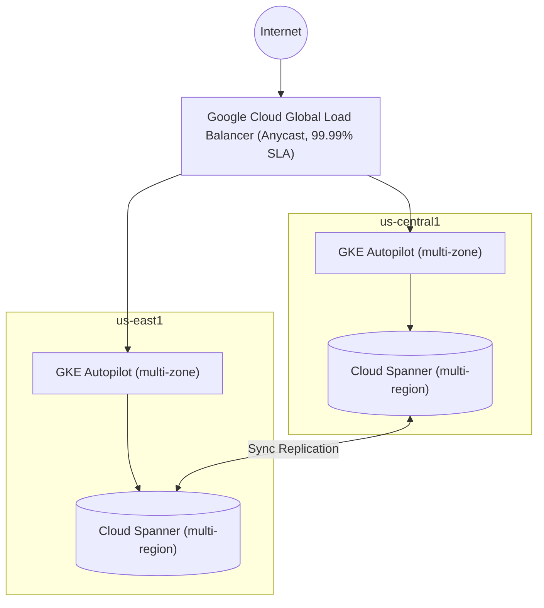
**Key architecture decisions:**
- **Cloud Spanner** instead of Cloud SQL: Multi-region, strongly consistent, 99.999% SLA.

# Module 4: Reliable Google Cloud Infrastructure: Design and Process (Course Breakdown)

*This chapter provides an exhaustive, in-depth breakdown of the "Reliable Google Cloud Infrastructure: Design and Process" course, capturing the core architectural principles, methodologies, and technical strategies discussed in the video modules and reading materials.*

## 4.1 Defining Services (Module 2)

The starting point for any cloud architecture or software development lifecycle is to deeply understand the business requirements, the users, and how to measure success. This module focuses on translating abstract business needs into concrete, measurable engineering targets.

### Requirements, Analysis, and Design
Before architecting a system, a Cloud Architect must answer: Who, What, Why, When, and How.
- **Who:** Identifies not just the end-users, but also developers and stakeholders. It builds a complete picture of who the system affects.
- **What:** Defines the main areas of functionality clearly and unambiguously.
- **Why:** The most critical question. What business problem does this system solve? Understanding the "Why" prevents scope creep and is foundational for defining KPIs and SLOs.
- **When & How:** Helps determine timelines and non-functional requirements (e.g., concurrency, payload size, regional vs. global latency requirements).

**User Roles & Personas:**
- **Roles:** Represent an actor on the system (which can be a person or another microservice). Examples include "Shopper," "Account Holder," or "Inventory Supplier." Roles help analyze requirements in a specific context.
- **Personas:** Fictional representations of a user role to help developers empathize with user needs. For example, "Jocelyn, a busy working mom who wants to automate bill payments to save time." This insight implies a need for low latency and automation in the system architecture.

**User Stories & The INVEST Criteria:**
User stories structure the requirements: *"As a [role], I want to [action] so that [benefit]."*
To ensure user stories are effective, they must pass the **INVEST** criteria:
- **I**ndependent: Stories shouldn't depend on each other, aiding prioritization.
- **N**egotiable: They stimulate collaboration and discussion, not rigid contracts.
- **V**aluable: They must deliver clear business value.
- **E**stimatable: If it can't be estimated, it lacks detail or is too large.
- **S**mall: Keeps scope tight and unambiguous.
- **T**estable: Developers must be able to verify when a requirement is "done."

### KPIs and SLIs (Measuring Success)
To manage a service well, you must measure its behavior against business and technical goals.

- **KPIs (Key Performance Indicators):** Measure business success (e.g., ROI, customer churn, conversion rate). KPIs must follow **SMART** criteria: Specific, Measurable, Achievable, Relevant, and Time-bound. "User-friendly" is not a KPI; "Section 508 accessible" is.
- **SLIs (Service Level Indicators):** A quantitative measure of a specific aspect of the service (e.g., latency, throughput, error rate, availability). 
  - *Crucial note on aggregation:* Averages can mask poor user experiences. For instance, an average latency of 200ms might hide the fact that 1% of users experience 5-second delays. Always use percentiles (e.g., 90th, 99th, or 99.9th percentile) instead of averages for metrics like latency.

### SLOs and SLAs (Setting Targets)
- **SLOs (Service Level Objectives):** The agreed-upon target for an SLI (e.g., "99% of HTTP GET requests complete in < 100ms"). 
  - *Best Practices for SLOs:* Keep them simple, minimize the number of SLOs, and **never aim for 100%**. Aiming for 100% availability requires heroic engineering efforts, drastically increases costs, and slows down development (depleting the error budget). It is better to have an achievable SLO (e.g., 99.9%) and tighten it over time if needed.
- **SLAs (Service Level Agreements):** The business contract with the customer. If an SLA is violated, financial penalties (compensations) typically apply.
  - *The Golden Rule:* **Your SLO must always be stricter than your SLA.** This provides a safety buffer for the SRE team to detect and resolve an issue before it breaches the legal SLA contract.

---

## 4.2 Microservice Design and Architecture (Module 3)

### The Microservice Paradigm
Unlike monolithic applications (single codebase, shared database), microservices divide a program into independent, loosely coupled services.
- **Primary Benefit:** Organizational scale. Independent teams can develop, test, deploy, and scale their services at their own cadence without blocking others.
- **Challenges:** Increased infrastructure complexity, network latency, distributed failure modes, and the absolute necessity of managing versioned contracts (APIs) between services.

### Decomposing the Monolith & State Management
When decomposing an application (using Domain-Driven Design), logical functional groupings (e.g., Product Management, Orders, Reviews) become microservices.

**State Management Best Practices:**
- **Stateless is King:** Services that do not hold state in memory are trivially easy to scale out and upgrade. 
- **Handling State:** When state is required, use backend managed storage services (e.g., Cloud SQL, Firestore). 
- **Avoid Sticky Sessions:** In-memory shared state forces the use of "sticky sessions" (session affinity) on load balancers, which severely hinders auto-scaling and fault tolerance.
- **Caching:** Use Memorystore (Redis) for highly available, low-latency data access to offload persistent databases.

### REST, HTTP, and API Design
To maintain loose coupling, microservices must communicate via strong, versioned contracts.
- **REST (Representational State Transfer):** Protocol-independent architectural style. Uses HTTP verbs (GET, POST, PUT, DELETE) mapped to actions on resources.
  - **PUT vs POST:** PUT is idempotent (running it multiple times has the same effect as running it once). POST is for creating new resources.
- **API Consistency:** 
  - Use singular nouns for individual resources (/pet/1) and plural for collections (/pets).
  - Do not use verbs in the URI (e.g., avoid /getpets); the HTTP verb (GET /pets) already defines the action.
  - Always version your APIs (e.g., /v1/pets) to maintain backward compatibility and avoid breaking downstream microservices when contracts change.
- **gRPC:** Developed by Google, gRPC is a highly performant binary protocol based on HTTP/2. It is ideal for internal microservice-to-microservice communication, supporting both client and server streaming with strict contracts defined via Protocol Buffers.
- **API Management:** Use Cloud Endpoints, API Gateway, or Apigee (for enterprise scale with monetization and deep analytics) to manage, secure, and authenticate API traffic.

---

## 4.3 DevOps Automation (Module 4)

### Continuous Integration (CI) and Deployment Pipelines
DevOps heavily relies on automated pipelines to integrate, deliver, and deploy code reliably. In a microservices architecture, **each microservice must have its own repository** and its own independent CI/CD pipeline.

A standard CI pipeline flow in Google Cloud:
1. **Source Code:** Code is checked into a version control system (e.g., Cloud Source Repositories).
2. **Build Triggers:** A push or commit tag triggers a build automatically via Cloud Build.
3. **Build & Test:** Cloud Build spins up ephemeral Docker containers (Cloud Builders) to run unit tests, static code analysis (linting), and integration tests.
4. **Artifact Creation:** Upon passing tests, a deployment package (usually a Docker image) is created.
5. **Artifact Storage:** The resulting image is pushed to Artifact Registry.

### Key GCP DevOps Services
- **Cloud Source Repositories:** Fully managed, private Git repositories hosted on GCP. Integrates deeply with Cloud IAM for access control and Pub/Sub for automated event triggering on commits.
- **Cloud Build:** A serverless CI/CD platform that executes builds on GCP infrastructure. Builds are defined as a series of steps in a cloudbuild.yaml file, and each step runs in a Docker container. There are no build servers to provision or maintain.
- **Artifact Registry:** The evolution of Container Registry. It is a universal package manager that stores Docker images, OCI containers, and language packages (Maven, npm). It features fine-grained IAM access control and native integration with GKE and Cloud Run.

### Security in the Pipeline (Artifact Analysis & Binary Authorization)
Security must be "baked in" to the CI/CD pipeline.
- **Artifact Analysis:** Automatically scans images uploaded to Artifact Registry for known OS and package vulnerabilities.
- **Binary Authorization (Kritis):** Ensures that only trusted containers are deployed to GKE. 
  - *Workflow:* When a container passes the vulnerability scan in Artifact Registry, an attestor cryptographically signs the image. When GKE attempts to deploy the image, Binary Authorization intercepts the request and verifies the cryptographic signature. If the signature is missing (meaning the image bypassed the CI pipeline or failed security checks), the deployment is blocked.

### Infrastructure as Code (IaC)
Moving to the cloud requires treating infrastructure as disposable rather than permanent capital expenditure (CapEx vs. OpEx).
- **The IaC Philosophy:** Instead of manually configuring servers (which leads to configuration drift and irreproducible environments), infrastructure is defined in code. If a machine breaks, you do not log in to patch it; you destroy it and let the IaC tools spin up a fresh one.
- **Terraform:** A declarative IaC tool widely supported on GCP. Deployments are described in configuration files, and Terraform figures out the API calls required to reach the desired state.
- **Benefits:** Minimizes manual errors, enables version-controlling infrastructure, allows rapid provisioning of ephemeral environments (like spin-up/tear-down test environments), and creates a single source of truth for the entire architecture.

---

## 4.4 Choosing Storage Solutions (Module 5)

A microservice architecture dictates that **each service must own its own data store**. There is no massive shared database; you select the right database per service based on its specific access patterns.

### The GCP Storage Portfolio Decision Matrix
1. **Unstructured Data:**
   - *Cloud Storage:* For binary data (images, backups, static assets). Highly durable, infinite scale, schemaless.
   - *Filestore:* When applications require a Posix-compliant shared file system (NAS) across VMs or GKE containers.
2. **Structured (Analytical / OLAP):**
   - *BigQuery:* The default data warehouse. Best for massive-scale, ad-hoc SQL reporting. Uses a fixed schema and operates cost-effectively when data doesn't change by the millisecond.
   - *Bigtable:* Wide-column NoSQL. Best for low-latency, extremely high-throughput read/write events (IoT time-series data, AdTech).
3. **Structured (Transactional / OLTP):**
   - *Cloud SQL:* Regional relational databases (MySQL, PostgreSQL). Perfect for standard web applications.
   - *Cloud Spanner:* Multi-regional, globally distributed relational database with strong consistency and 99.999% SLA. Best for global supply chains or financial services requiring limitless scale.
   - *AlloyDB:* Fully managed, PostgreSQL-compatible database optimized for Hybrid Transactional/Analytical Processing (HTAP).
4. **NoSQL / Document:**
   - *Firestore:* Fully managed, strongly consistent document database. Excellent for hierarchical data like user profiles and game states.
5. **In-Memory Caching:**
   - *Memorystore (Redis/Memcached):* Used to dramatically speed up data access (sub-millisecond latency) and offload read-heavy operations from persistent databases like Cloud SQL.

### Data Migration and Transfer Strategies
Moving large datasets into the cloud requires planning around network physics and cost.
- **Storage Transfer Service:** Best for transferring data from other clouds (AWS S3) or on-premises servers (using the on-prem Docker agent) when you have a fast internet pipe and data < 100 TB.
- **Transfer Appliance:** A physical, tamper-proof, rackable storage server shipped to your data center. Used for massive datasets (PBs) where transferring over the internet would take months. Data is AES-256 encrypted at capture.
- **BigQuery Data Transfer Service:** Automates the movement of data from SaaS applications (Google Ads, YouTube, Salesforce) and other data warehouses (Redshift, Teradata) directly into BigQuery on a scheduled basis.

---

## 4.5 Google Cloud and Hybrid Network Architecture (Module 6)

### VPC Design Principles
Google's global network backbone allows VPCs to span the entire globe.
- **Global VPCs, Regional Subnets:** Unlike AWS, a single GCP VPC is a global construct. Subnets are regional. This means VMs in different regions (e.g., us-central1 and europe-west1) can communicate via their internal, private IP addresses without needing VPNs or transit gateways.
- **Shared VPC:** A central construct for enterprise networking. A "Host Project" owns the network resources (VPC, subnets, firewall rules), and "Service Projects" attach their VMs to it. This allows network administrators to maintain strict security while developers freely deploy compute resources.

### Cloud Load Balancing
GCP load balancers are software-defined, globally distributed resources, not physical appliances.
- **Application Load Balancers (Layer 7):** Best for HTTP/HTTPS traffic. Supports SSL termination, session affinity, and URL-map-based routing.
  - *Cloud CDN:* Can be instantly enabled on global Application Load Balancers to cache content at Google's edge PoPs, drastically reducing latency and egress costs.
- **Network Load Balancers (Layer 4):** Best for non-HTTP traffic (TCP/UDP) or when you require ultra-low latency. 
  - *Proxy vs. Passthrough:* Use Proxy for TLS offloading or distributing to multiple regions. Use Passthrough when you must preserve the original client IP address and eliminate proxy overhead.

### Hybrid Connectivity
Connecting an on-premises data center to a GCP VPC.
- **VPC Peering:** Connects two GCP VPCs together privately. IP ranges must not overlap.
- **Cloud VPN:** Uses IPsec to securely tunnel traffic over the public internet.
  - *Classic VPN:* Single interface, 99.9% SLA. Supports static routing.
  - *HA VPN:* High Availability VPN provides a 99.99% SLA. It requires dynamic routing via BGP (Border Gateway Protocol) through a Cloud Router. It provisions two interfaces, and to achieve the SLA, you must configure dual tunnels (active/active or active/passive) to your on-prem gateway.
  - *MTU Constraint:* VPN encapsulation adds overhead, so the MTU of your on-prem gateway must be restricted (typically 1460 bytes) to prevent packet fragmentation.
- **Cloud Interconnect:** (Covered in advanced scenarios) For when VPN bandwidth is insufficient (e.g., needing 10 Gbps+ dedicated fiber).

---

## 4.6 Deploying Applications to Google Cloud (Module 7)

Selecting the correct deployment platform is crucial for optimizing cost, operational overhead, and scalability. GCP offers a continuum of compute options, from raw IaaS to fully managed serverless PaaS.

### The Compute Decision Tree
1. **Compute Engine (IaaS):** Use when you need absolute control over the operating system, custom hardware requirements (e.g., GPUs), or are running legacy software that cannot be containerized. Uses Managed Instance Groups (MIGs) for auto-healing and autoscaling across zones.
2. **Google Kubernetes Engine (GKE):** Use when you have complex, containerized microservice architectures requiring fine-grained orchestration. GKE balances flexibility and cost by packing multiple services into a single cluster. The **Autopilot** mode is recommended for a production-ready, hands-off cluster management experience.
3. **Cloud Run:** The premier serverless container platform. Use for stateless, containerized applications. It abstracts away all Kubernetes cluster management, scaling seamlessly from zero to thousands of instances and back to zero, meaning you only pay for the exact compute time used.
4. **App Engine (PaaS):** Use for web applications where you want zero infrastructure management. Designed originally for microservices, it handles all routing, load balancing, and scaling automatically.
5. **Cloud Run Functions (Event-Driven):** Use for single-purpose, event-driven microservices. For example, executing a lightweight script triggered by a file upload to Cloud Storage or a message arriving on a Pub/Sub topic.

---

## 4.7 Designing Reliable Systems (Module 8)

Reliability is not an accident; it is engineered into the architecture. A reliable system must gracefully handle inevitable hardware and software failures.

### Key Performance Metrics
- **Availability:** The percentage of time a system is running and serving requests.
- **Durability:** The statistical probability of not losing data (e.g., Cloud Storage provides 11 9's of durability).
- **Scalability:** The ability of the system to handle increased load without performance degradation.

### Fault Tolerance & Failure Modes
- **Single Points of Failure (SPOF):** Eliminate SPOFs by deploying redundant instances. Use the **N+2** rule: Deploy the number of instances you need (N), plus one for a potential failure, plus one for safe rolling upgrades.
- **Correlated Failures:** Occurs when related items fail simultaneously (e.g., all VMs in a single zone fail because the zone goes down). Mitigation involves deploying across multiple fault domains (multiple zones or regions).
- **Cascading Failures:** When one component fails, the load shifts to remaining components, overloading them and causing them to fail as well. 

### Design Patterns for Resilience
- **Truncated Exponential Backoff:** When a service fails, clients should not retry immediately (which creates a "positive feedback cycle" that DDoS attacks the struggling service). Instead, clients wait progressively longer periods between retries, combined with random "jitter" to avoid synchronized traffic spikes.
- **Circuit Breaker:** A proxy pattern (often implemented via Service Meshes like Istio) that monitors a backend service. If the backend begins failing, the circuit breaker "trips" and immediately returns errors to clients without forwarding the traffic, giving the backend time to recover.
- **Lazy Deletion:** Protects against accidental data loss. When a user deletes data, it is only hidden (soft delete). It remains recoverable by admins for a set period (e.g., 30 days) before a batch job permanently purges it (hard delete).

### Disaster Recovery (DR) Planning
Every architecture needs a tested DR plan based on two business metrics:
- **RTO (Recovery Time Objective):** How quickly must the system be restored? (Drives the choice between Hot vs. Cold Standby).
- **RPO (Recovery Point Objective):** How much data loss is acceptable? (Drives backup frequency and replication strategy).
- **Strategies:**
  - *Cold Standby:* Keeping snapshots and backups in Cloud Storage. In a disaster, new infrastructure is spun up from scratch. Very cheap, but high RTO.
  - *Hot Standby:* Running live replicas in multiple regions (e.g., active-active Load Balancing, Spanner multi-region). Expensive, but near-zero RTO and RPO.

---

## 4.8 Security (Module 9)

Security in Google Cloud operates on a **Shared Responsibility Model**. Google secures the underlying infrastructure (hardware, network, hypervisor), while the customer secures the data, access policies, and application logic.

### IAM and Access Control
- **Principle of Least Privilege:** Users and services should only have the exact permissions necessary to perform their tasks, nothing more.
- **Separation of Duties:** No single person should have the ability to both write code and deploy it to production, or change data and audit logs simultaneously.
- **Identities:**
  - *Users/Groups:* Always assign IAM roles to Google Groups rather than individual users for easier onboarding/offboarding.
  - *Service Accounts:* The identity used by applications (VMs, Cloud Run, GKE nodes) to make authorized API calls. 
- **Identity-Aware Proxy (IAP):** Provides Zero Trust access to web applications and VMs without requiring a traditional VPN. IAP intercepts traffic, authenticates the user, and checks IAM policies before allowing access.

### Network and Application Security
- **Private Google Access:** Allows VMs with *no external public IP address* to reach Google APIs (like Cloud Storage or BigQuery) securely over Google's internal backbone.
- **Firewall Rules:** By default, all ingress traffic is denied, and all egress is allowed. Always use tags or service accounts to apply firewall rules rather than rigid IP ranges.
- **Cloud Armor:** Google's Web Application Firewall (WAF) and DDoS mitigation service. It deploys at the global edge (on the external Load Balancer) and can block malicious traffic, SQL injection, and XSS attacks before they ever reach your VPC.

### Data Security and Encryption
Google encrypts all customer data at rest by default using Google-managed encryption keys.
- **CMEK (Customer-Managed Encryption Keys):** For regulatory compliance, you can use Cloud KMS (Key Management Service) to generate and manage your own keys, controlling the rotation schedule (e.g., every 90 days).
- **Cloud DLP (Data Loss Prevention):** An API used to automatically scan, classify, and redact sensitive PII (like Credit Card numbers, SSNs) from text, images, or storage buckets before it is processed or stored.

---

## 4.9 Maintenance, Cost Planning, and Monitoring (Module 10)

The final pillar of a reliable system is ongoing maintenance, financial governance, and deep observability.

### Deployment Strategies (Zero Downtime)
When deploying a new microservice version, you must protect the API contract and minimize risk.
- **Rolling Update:** Updates instances one by one (or in batches) behind the load balancer. Best when API changes are strictly backward compatible.
- **Blue-Green Deployment:** Two identical environments exist. "Blue" runs production. The new version is deployed to "Green" and tested. Once verified, the load balancer abruptly switches 100% of traffic to Green. Allows for instant rollback if something goes wrong.
- **Canary Release:** Deploy the new version to a tiny subset of instances and route a small fraction of traffic (e.g., 5%) to it. Monitor for errors, and if stable, gradually increase traffic to 100%.

### Cost Optimization and Capacity Planning
Cost planning in the cloud is an iterative cycle of Forecasting, Allocating, and Monitoring.
- **Discounts:** Use **Committed Use Discounts (CUDs)** for stable, predictable baseline workloads (1 or 3-year commitments). Use **Spot VMs (Preemptible)** for fault-tolerant, batch, or stateless workloads to save up to 91%.
- **Network Egress Optimization:** Egress within the same zone is free. Egress between zones or to the internet incurs costs. Always keep compute resources in the same zone/region as their data to minimize costs.
- **GKE Usage Metering:** Exports detailed resource requests vs. actual consumption data to BigQuery. Comparing the two identifies wasted, over-provisioned cluster capacity.
- **Billing Export:** Always export raw billing data to BigQuery to build custom Looker Studio dashboards for granular cost analysis.

### Observability and SRE Golden Signals
To ensure you are meeting your SLOs, you must measure the "Four Golden Signals" (Latency, Traffic, Errors, Saturation).
- **Cloud Monitoring:** Creates dashboards and tracks metrics (CPU, disk I/O, latency). 
- **Alerting Policies:** Create alerts based on SLI thresholds (e.g., "Alert if 99th percentile latency exceeds 300ms for 5 minutes"). Since your SLO is stricter than your SLA, this alert triggers an incident response *before* you owe the customer financial compensation.
- **Uptime Checks:** Probes deployed from multiple global locations to verify if your application endpoints are alive and responding with the correct HTTP status codes.

---
**End of Module 4 (Course Breakdown).**

## 4.10 Comprehensive Case Study: ClickTravel Architecture

Throughout the course, a hypothetical online travel portal called **ClickTravel** was used in the activities to apply the concepts. Here is a synthesized look at the final architecture decisions made across the different course activities, serving as a practical example of the design process.

### 1. Storage & Database Selection (Activities 6 & 7)
Instead of a single monolithic database, ClickTravel assigns specific data stores to specific microservices:
- **Inventory Service:** Suppliers upload raw inventory as JSON files into **Cloud Storage**. The service then imports that structured data into **Firestore** for fast, document-based querying.
- **Orders Service:** Requires strong consistency and transactional guarantees, so it uses a relational **Cloud SQL (PostgreSQL)** database.
- **Analytics Service:** Aggregates data from all services into **BigQuery** (Data Warehouse) for reporting.

### 2. Networking & Load Balancing (Activities 8 & 9)
- **External Traffic:** User traffic (from the US and EU) hits a **Global External Application Load Balancer**. This routes traffic to the nearest healthy region.
- **Internal Traffic:** The Web UI services communicate with the backend Orders and Inventory services via **Internal TCP Load Balancers**, keeping traffic off the public internet.
- **Hybrid Connectivity:** An on-premises reporting tool accesses BigQuery analytics over a secure **Cloud VPN** tunnel.

### 3. High Availability (Activity 10)
- **Web UI:** Deployed across multiple zones in both us-central1 and europe-west2 for global availability.
- **Backend Services:** To optimize costs initially, the Orders and Inventory backends are deployed only in us-central1, but across *multiple zones* to survive a single-zone failure.
- **Analytics:** Deployed in a single zone to save costs, as it is not customer-facing.

### 4. Disaster Recovery Planning (Activity 11)
- **Orders Database (Zero Data Loss):** Configured with a Hot Standby. A failover replica exists in another zone, along with automated backups and binary logging.
- **Inventory Database:** Handled via a Cold Standby approach. A Cloud Scheduler triggers a Cloud Function daily to export Firestore backups into a multi-regional Cloud Storage bucket.
- **Analytics:** Lowest priority. If BigQuery tables are corrupted, the recovery plan is simply to re-import the data from the source systems.

### 5. Security (Activity 12)
- **Edge Security:** **Google Cloud Armor** is attached to the Global Load Balancer to deny known malicious IPs and block DDoS attacks.
- **Internal Security:** Backend VMs are created *without* external public IPs. They use **Private Google Access** to communicate securely with Cloud SQL and Firestore. Firewall rules strictly limit SSH access only to known administrator IPs.

### The Final ClickTravel Architecture Diagram

`mermaid
graph TD
    subgraph USERS["Users"]
        U_US("US Users")
        U_EU("EU Users")
    end

    LB["Global HTTP Load Balancer<br>+ Cloud Armor (WAF/DDoS)"]
    U_US --> LB
    U_EU --> LB

    subgraph EU_WEST["Region: europe-west2"]
        WEB_EU["Web UI Service<br>(Multi-zone)"]
    end

    subgraph US_CENTRAL["Region: us-central1"]
        direction TB
        WEB_US["Web UI Service<br>(Multi-zone)"]
        
        ILB["Internal TCP Load Balancer"]
        
        INV["Inventory Service<br>(Multi-zone)"]
        ORD["Orders Service<br>(Multi-zone)"]
        
        WEB_US --> ILB
        ILB --> INV
        ILB --> ORD
        
        FS[("Firestore<br>(Multi-regional)")]
        SQL[("Cloud SQL<br>+ Failover Replica")]
        
        INV --> FS
        ORD --> SQL
    end
    
    LB --> WEB_US
    LB --> WEB_EU
    WEB_EU --> ILB
    
    subgraph DATA["Global / Multi-Region Data"]
        BQ[("BigQuery<br>(Analytics)")]
        GCS[("Cloud Storage<br>(Raw Uploads & Backups)")]
    end
    
    ONPREM["On-Premises<br>Reporting Service"]
    VPN{"Cloud VPN"}
    
    ONPREM <--> VPN
    VPN <--> BQ
`

---

# Module 5: Developing a Google SRE Culture

Site Reliability Engineering (SRE) is what happens when you ask a software engineer to design an operations team. This module covers the journey to adopting SRE culture, practices, and principles, bridging the gap between development (which seeks velocity) and operations (which seeks reliability).

## 5.1 SRE and DevOps Philosophy

**DevOps** is a philosophy, not a methodology or a specific technology. **SRE** is the practical, concrete implementation of that philosophy. Google categorizes DevOps into five key pillars, which map directly to SRE practices:

1. **Reduce Organizational Silos:** SREs share ownership with developers by defining SLOs and Error Budgets together.
2. **Accept Failure as Normal:** Computers are unreliable, and humans are imperfect. SREs conduct **Blameless Postmortems** to learn from failures rather than point fingers.
3. **Implement Gradual Change:** SREs use CI/CD and **Canary deployments** to reduce the cost of failure.
4. **Leverage Tooling and Automation:** SREs focus on eliminating **Toil** to automate this year's job away.
5. **Measure Everything:** SREs measure toil, reliability (SLIs), and monitor the health of systems based on user happiness.

## 5.2 Step 1: SLOs with Consequences

The first step in the SRE journey is changing how reliability is measured and incentivized.

### SLIs, SLOs, and Error Budgets
- **SLI (Service Level Indicator):** A quantifiable measure of reliability from the user's perspective (e.g., Good Interactions / Total Interactions).
- **SLO (Service Level Objective):** The target for an SLI over time (e.g., 99.9%). It draws the line between a happy and an unhappy customer. 100% is the wrong target because it stifles innovation.
- **Error Budget:** The difference between perfection (100%) and your SLO. It is the amount of unreliability you are willing to tolerate. It acts as a control mechanism: if the budget is intact, developers can push new features rapidly; if depleted, feature pushes freeze until reliability improves.

### Blameless Postmortems and Psychological Safety
- A **Blameless Postmortem** is a detailed document written after an outage. It focuses on the root cause, impact, and actions to prevent recurrence, *without* accusing a person or team. 
- It shifts responsibility from people to systems. "If a human error caused an outage, the system allowed the human to make that error."
- This requires **Psychological Safety**: the belief that a person won't be punished or humiliated for speaking up, asking questions, or making mistakes. Low psychological safety stifles learning and innovation.

## 5.3 Step 2: Make Tomorrow Better Than Today

To innovate faster and safer, SREs employ specific technical and cultural practices.

### CI/CD and Canarying
- **Continuous Integration (CI):** Building, integrating, and testing code automatically to catch critical issues early.
- **Continuous Delivery (CD):** Ensuring code is always in a deployable state.
- **Canarying:** Deploying a change to a small subset of users (the "canary"). If the canary survives (no errors), the change is rolled out to everyone. If it dies, the change is easily rolled back, minimizing user impact.

### Eliminating Toil
- **Toil** is work directly tied to a service that is manual, repetitive, automatable, tactical, devoid of enduring value, and scales linearly as the service grows. (Note: HR paperwork or team meetings are *overhead*, not toil).
- SREs must cap toil at **50%** of their time. The remaining 50% must be spent on engineering project work to scale the system or automate the toil away.
- **Why toil is toxic:** Leads to career stagnation, burnout, slow feature velocity, and high attrition.

### Managing Resistance to Change
Automation and cultural shifts trigger human emotions (fear of loss, deception anxiety). Leaders must connect with their teams on three levels to manage the "Change Curve":
- **Head (Rational):** The strategic vision and rationale behind the change.
- **Heart (Emotional):** How the change positively impacts them personally.
- **Feet (Behavioral):** The training, skills, and resources provided to ensure they succeed.

## 5.4 Step 3: Regulate Workload

Measurement is required to regulate workloads effectively. You cannot improve what you don't measure.

### The Four Golden Signals
Google recommends monitoring and alerting based on these four symptoms, rather than underlying causes (like CPU spikes):
1. **Latency:** The time it takes to service a request.
2. **Traffic:** A measure of how much demand is being placed on your system.
3. **Errors:** The rate of requests that fail.
4. **Saturation:** How "full" your service is.

### OKRs and Data-Driven Decision Making
- Google uses **OKRs (Objectives and Key Results)** for goal-setting. They are meant to be highly ambitious (moonshots), where achieving a 60-70% grade is considered a success.
- **Transparency:** OKRs and code repositories should be visible to everyone to build trust and eliminate silos.
- Decisions must be data-driven, requiring the removal of **Unconscious Biases** (Affinity bias, Confirmation bias, Labeling bias) which corrupt the work environment.

## 5.5 SRE Team Implementations

When scaling SRE in your organization, the team structure will evolve based on maturity and system complexity:

`mermaid
mindmap
  root((SRE Team Models))
    Kitchen Sink
      Everything SRE
      Good for small scope
      Risk: Burnout as company grows
    Infrastructure
      Maintains shared services
      Defines infra as code
      Risk: Divergence from customer needs
    Tools
      Builds reliability software
      Helps developers measure capacity
    Product/Application
      Tied to critical business apps
      High reliability focus
    Embedded
      SREs sit with developers
      Hands-on mentoring
      Time-bounded engagements
    Consulting
      Hands-off advisors
      Scales impact for mature orgs
`

## 5.6 Actionable Reflection for Leaders
1. **DORA Quick Check:** Assess your current DevOps maturity.
2. **Upskill Operators:** Traditional sysadmins must learn software engineering, system architecture, and automation to transition into SRE roles.
3. **Draft a Team Charter:** Explicitly cap toil at 50% to prevent SRE teams from degrading into traditional "break-fix" operations teams.

---
