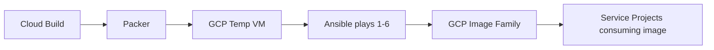

# Golden Image Pipeline — Packer + Ansible + Cloud Build

Immutable golden VM images are the foundation of the enterprise compute platform. Every image change is driven by a ServiceNow/Jira ticket, reviewed by SecOps and peer SREs, and merged through a GitHub PR. Cloud Build orchestrates Packer which uses an Ansible provisioner to produce CIS-hardened, fully configured base images stored in the enterprise Shared VPC image project. No SSH keys, bash history, or cloud-init state survive into the final image.

!!! warning "GitOps Mandatory Policy"
    Direct image modifications via SSH are strictly prohibited and monitored via Cloud Audit Logs. All changes MUST go through this pipeline. Violations trigger a SecOps incident.

## Pipeline Architecture
The image build process leverages an ephemeral virtual machine orchestrated completely within Google Cloud.



## GCP IAM Prerequisites
| Service Account | Required Roles | Purpose |
|-----------------|----------------|---------|
| Packer Builder SA | `roles/compute.instanceAdmin.v1`, `roles/iam.serviceAccountUser`, `roles/iap.tunnelResourceAccessor`, `roles/storage.objectViewer` | VM creation, IAP SSH tunneling, downloading Ansible artifacts |
| Cloud Build SA | `roles/cloudbuild.builds.builder`, `roles/storage.admin` | Orchestrating pipeline steps, writing logs to GCS |

## File Structure
```
golden-image/
├── packer.pkr.hcl
├── ansible-playbook.yaml
├── cloudbuild.yaml
└── PULL_REQUEST_TEMPLATE.md
```

---

## 1. Packer Configuration

### Understanding Packer and Its Role
Packer is an open-source tool for creating identical machine images for multiple platforms from a single source configuration. In our pipeline, it acts as the orchestrator for the build process, replacing manual, error-prone VM creation. Packer ensures our images are built consistently, reproducibly, and automatically through code.

### The `packer {}` Block
The `packer {}` block defines the required plugins and their versions to ensure stable and reproducible builds.
- **googlecompute**: Provides the builder to interact with Google Cloud Platform, launch temporary VMs, and capture images.
- **ansible**: Provides the provisioner to run our Ansible playbook against the temporary VM.

### Variables Summary
| Name | Default | Description | Override at Build Time |
|---|---|---|---|
| `project_id` | "enterprise-images" | The GCP project ID for image build and storage | `-var project_id="..."` |
| `zone` | "us-central1-a" | The GCP zone for the builder instance | `-var zone="..."` |
| `source_image_family` | "debian-12" | Source OS image family | `-var source_image_family="..."` |
| `image_family` | "enterprise-debian12-base" | Target image family | `-var image_family="..."` |
| `network` | shared-vpc | VPC network for builder VM | `-var network="..."` |
| `subnetwork` | gke-nodes-subnet | Subnetwork for builder VM | `-var subnetwork="..."` |
| `machine_type` | "n2-standard-4" | Machine type for the builder VM | `-var machine_type="..."` |
| `disk_size_gb` | 50 | Boot disk size in GB | `-var disk_size_gb="..."` |
| `disk_type` | "pd-ssd" | Boot disk type | `-var disk_type="..."` |
| `image_storage_locations`| ["us"] | Image storage locations | `-var image_storage_locations='["..."]'` |
| `ansible_playbook_path` | "./ansible-playbook.yaml" | Path to Ansible playbook | `-var ansible_playbook_path="..."` |
| `build_number` | "0" | CI build number | `-var build_number="..."` |
| `git_commit_sha` | "unknown" | Git commit SHA | `-var git_commit_sha="..."` |
| `datadog_api_key` | (none) | Datadog API key (sensitive) | Environment variable or secret injection |

### The `source "googlecompute"` Block and Security
This block defines how the temporary VM is spun up in GCP. Key security features include:
- `use_iap=true`: Ensures SSH access happens over Identity-Aware Proxy, requiring IAM authorization.
- `omit_external_ip=true` & `use_internal_ip=true`: The VM receives no public internet exposure. All traffic flows through the private VPC.
- `service_account_email`: Specifies a least-privilege SA (`packer-builder`) dedicated to building images rather than using the default compute service account.

### Build Provisioners Sequence
1. **Shell (Prereqs)**: Runs first to install basic prerequisites like `python3` and `ansible` required for the next step.
2. **Ansible**: Executes the primary hardening and configuration playbook, transforming the base OS into an enterprise standard.
3. **Shell (Cleanup)**: Executes last to scrub the system. **Critical note**: This cleanup MUST run last to ensure secrets (like SSH keys or temporary tokens) and history from the build process are entirely wiped out before the disk snapshot is taken.

### `packer.pkr.hcl`
```hcl
packer {
  required_version = ">= 1.11.0"
  required_plugins {
    googlecompute = {
      version = "~> 1.1"
      source  = "github.com/hashicorp/googlecompute"
    }
    ansible = {
      version = "~> 1.1"
      source  = "github.com/hashicorp/ansible"
    }
  }
}

variable "project_id" {
  description = "The GCP project ID where the image will be built and stored"
  type        = string
  default     = "enterprise-images"
}

variable "zone" {
  description = "The GCP zone to launch the builder instance in"
  type        = string
  default     = "us-central1-a"
}

variable "source_image_family" {
  description = "Source OS image family from GCP public images"
  type        = string
  default     = "debian-12"
}

variable "image_family" {
  description = "The family of the target image"
  type        = string
  default     = "enterprise-debian12-base"
}

variable "network" {
  description = "VPC network for builder VM"
  type        = string
  default     = "projects/enterprise-vpc-host/global/networks/shared-vpc"
}

variable "subnetwork" {
  description = "Subnetwork for builder VM"
  type        = string
  default     = "projects/enterprise-vpc-host/regions/us-central1/subnetworks/gke-nodes-subnet"
}

variable "machine_type" {
  description = "Machine type for the builder VM"
  type        = string
  default     = "n2-standard-4"
}

variable "disk_size_gb" {
  description = "Boot disk size in GB"
  type        = number
  default     = 50
}

variable "disk_type" {
  description = "Boot disk type"
  type        = string
  default     = "pd-ssd"
}

variable "image_storage_locations" {
  description = "Storage locations for the image"
  type        = list(string)
  default     = ["us"]
}

variable "ansible_playbook_path" {
  description = "Path to the Ansible playbook"
  type        = string
  default     = "./ansible-playbook.yaml"
}

variable "build_number" {
  description = "CI build number"
  type        = string
  default     = "0"
}

variable "git_commit_sha" {
  description = "Git commit SHA"
  type        = string
  default     = "unknown"
}

variable "datadog_api_key" {
  description = "Datadog API key"
  type        = string
  sensitive   = true
}

locals {
  image_name = "${var.image_family}-${var.build_number}-${substr(var.git_commit_sha, 0, 8)}"
}

source "googlecompute" "base_image" {
  project_id                  = var.project_id
  zone                        = var.zone
  source_image_family         = var.source_image_family
  image_name                  = local.image_name
  image_family                = var.image_family
  network                     = var.network
  subnetwork                  = var.subnetwork
  machine_type                = var.machine_type
  disk_size                   = var.disk_size_gb
  disk_type                   = var.disk_type
  image_storage_locations     = var.image_storage_locations
  
  use_internal_ip             = true
  omit_external_ip            = true
  use_iap                     = true
  tags                        = ["packer-build", "allow-iap-ssh"]
  
  service_account_email       = "packer-builder@enterprise-images.iam.gserviceaccount.com"
  scopes                      = ["https://www.googleapis.com/auth/cloud-platform"]
  
  image_labels = {
    built_by       = "packer"
    build_number   = var.build_number
    git_sha        = var.git_commit_sha
    base_os        = "debian-12"
    environment    = "production"
    managed_by     = "gitops"
    cis_hardened   = "true"
  }
  
  metadata = {
    enable-oslogin             = "TRUE"
    block-project-ssh-keys     = "TRUE"
    serial-port-logging-enable = "TRUE"
  }
  
  communicator                = "ssh"
  ssh_username                = "packer"
  wait_to_add_ssh_keys        = "30s"
  metadata_startup_script     = ""
}

build {
  sources = ["source.googlecompute.base_image"]

  provisioner "shell" {
    inline = [
      "echo 'Updating apt repositories...'",
      "sudo apt-get update -y",
      "sudo apt-get install -y python3 python3-pip ansible",
      "sudo pip3 install ansible-lint --break-system-packages"
    ]
  }

  provisioner "ansible" {
    playbook_file = var.ansible_playbook_path
    extra_arguments = [
      "-v",
      "--diff",
      "--extra-vars",
      "datadog_api_key=${var.datadog_api_key} build_number=${var.build_number} git_commit_sha=${var.git_commit_sha}"
    ]
    ansible_env_vars = [
      "ANSIBLE_HOST_KEY_CHECKING=False",
      "ANSIBLE_PYTHON_INTERPRETER=/usr/bin/python3"
    ]
  }

  provisioner "shell" {
    execute_command = "{{ .Vars }} sudo -E bash '{{ .Path }}'"
    inline = [
      "rm -f /root/.bash_history",
      "find /home -name .bash_history -delete",
      "rm -f /etc/ssh/ssh_host_*",
      "rm -rf /var/lib/cloud/instances /var/lib/cloud/data",
      "rm -rf /tmp/* /var/tmp/*",
      "truncate -s 0 /var/log/syslog /var/log/auth.log /var/log/dpkg.log 2>/dev/null || true",
      "apt-get clean",
      "rm -rf /var/lib/apt/lists/*",
      "pip3 cache purge 2>/dev/null || true",
      "rm -f /root/.ssh/authorized_keys",
      "sync"
    ]
  }
}
```

!!! info "IAP Tunnel Note"
    Packer connects to the builder VM exclusively through Identity-Aware Proxy (IAP) TCP tunneling. The VM has no external IP. The packer-builder service account must have `roles/iap.tunnelResourceAccessor` on the project.

---

## 2. Ansible Hardening Playbook

### Play Structure and Order
The playbook consists of 6 sequential plays. Order is crucial because baseline hardening (Play 1) establishes system rules that later components depend on. Package installation (Play 3) must complete before agents (Plays 4-5) can be installed, and cleanup (Play 6) must definitively conclude the pipeline.

### Play Summaries

**Play 1 (CIS L1)**
*What it does:* Implements Center for Internet Security (CIS) Level 1 benchmark settings. 
It covers kernel parameters, AppArmor, auditd, and SSH hardening. Key `sysctl` rules disable IPv4 routing/forwarding and source redirects to prevent man-in-the-middle attacks and spoofing.

**Play 2 (UFW)**
*What it does:* Configures the Uncomplicated Firewall (UFW) using a default-deny philosophy. 
By dropping all unsolicited incoming traffic by default, the attack surface is minimized. SSH is allowed exclusively from RFC1918 private subnets to enforce bastion-only or VPN-only administrative access.

**Play 3 (Packages)**
*What it does:* Installs requested system utilities, Docker, Kubernetes tooling (kubectl/helm), and Cloud SDKs. 
Docker is configured with the `overlay2` storage driver because it offers the most efficient union filesystem capabilities for modern kernels, greatly improving performance.

**Play 4 (Ops Agent)**
*What it does:* Deploys the Google Cloud Ops Agent. 
It collects standard system logs (`/var/log/syslog`, `auth.log`) and host metrics (CPU, memory, disk). These can be visualized and alerted upon in GCP Cloud Monitoring and Cloud Logging.

**Play 5 (Datadog)**
*What it does:* Installs the Datadog Agent. 
The `datadog.yaml` is generated to enable Application Performance Monitoring (APM) for tracing, centralized log collection, and process-level metrics, allowing deep observability into running workloads.

**Play 6 (Cleanup)**
*What it does:* Prepares the system for imaging by purging ephemeral data. 
- `bash_history`: Removed because it may contain accidentally typed secrets or infrastructure layout clues.
- `ssh_host_*`: Deleted so that each VM cloned from the image generates unique cryptographic identities. 
- `cloud-init`: Erased to force it to run fresh upon the first boot of a VM, re-evaluating metadata and user-data correctly.

### `ansible-playbook.yaml`
```yaml
---
- name: "Play 1 — CIS Level 1 Baseline Hardening (SecOps Mandatory)"
  hosts: all
  become: true
  vars:
    cis_sysctl_settings:
      net.ipv4.ip_forward: 0
      net.ipv4.conf.all.send_redirects: 0
      net.ipv4.conf.default.send_redirects: 0
      net.ipv4.conf.all.accept_redirects: 0
      net.ipv4.conf.default.accept_redirects: 0
      net.ipv4.conf.all.log_martians: 1
      net.ipv4.conf.default.log_martians: 1
      net.ipv4.icmp_echo_ignore_broadcasts: 1
      net.ipv4.tcp_syncookies: 1
      kernel.randomize_va_space: 2
      fs.suid_dumpable: 0
      kernel.core_uses_pid: 1
      net.ipv4.conf.all.rp_filter: 1
  tasks:
    - name: Disable unused filesystem modules (CIS 1.1.x)
      loop: [cramfs, freevxfs, jffs2, hfs, hfsplus, squashfs, udf, fat, vfat]
      community.general.modprobe: 
        name: "{{ item }}"
        state: absent

    - name: Blacklist unused filesystem modules
      loop: [cramfs, freevxfs, jffs2, hfs, hfsplus, squashfs, udf, fat, vfat]
      lineinfile:
        dest: /etc/modprobe.d/cis-blacklist.conf
        line: 'install {{ item }} /bin/true'
        create: yes

    - name: Apply CIS sysctl hardening (CIS 3.x)
      loop: "{{ cis_sysctl_settings | dict2items }}"
      ansible.posix.sysctl:
        name: "{{ item.key }}"
        value: "{{ item.value }}"
        state: present
        reload: yes
      ignore_errors: yes

    - name: Persist sysctl settings to /etc/sysctl.d/99-cis-hardening.conf
      copy:
        dest: /etc/sysctl.d/99-cis-hardening.conf
        content: |
          
          {{ key }} = {{ value }}
          

    - name: Ensure AppArmor is installed (CIS 1.6)
      apt:
        name: [apparmor, apparmor-utils, apparmor-profiles]
        state: present

    - name: Ensure AppArmor is enabled in grub (CIS 1.6.1.2)
      lineinfile:
        path: /etc/default/grub
        regexp: '^GRUB_CMDLINE_LINUX='
        line: 'GRUB_CMDLINE_LINUX="apparmor=1 security=apparmor"'
      notify: update-grub

    - name: Set AppArmor to enforcing mode
      command: aa-enforce /etc/apparmor.d/*
      ignore_errors: yes

    - name: Disable core dumps (CIS 1.5.1)
      lineinfile:
        path: /etc/security/limits.conf
        line: '* hard core 0'

    - name: Install and configure auditd (CIS 4.1)
      apt:
        name: [auditd, audispd-plugins]
        state: present

    - name: Write auditd rules (CIS 4.1.x)
      copy:
        dest: /etc/audit/rules.d/99-cis.rules
        content: |
          -a always,exit -F arch=b64 -S adjtimex -S settimeofday -k time-change
          -w /etc/group -p wa -k identity
          -w /etc/passwd -p wa -k identity
          -w /etc/shadow -p wa -k identity
          -w /etc/sudoers -p wa -k scope
          -a always,exit -F arch=b64 -S execve -F euid=0 -F auid>=1000 -F auid!=4294967295 -k privileged
          -e 2

    - name: Harden SSH configuration (CIS 5.2.x)
      copy:
        dest: /etc/ssh/sshd_config
        content: |
          Protocol 2
          PermitRootLogin no
          PasswordAuthentication no
          PermitEmptyPasswords no
          MaxAuthTries 3
          ClientAliveInterval 300
          ClientAliveCountMax 2
          X11Forwarding no
          AllowAgentForwarding no
          AllowTcpForwarding no
          Banner /etc/ssh/banner
          LogLevel VERBOSE
          StrictModes yes
          IgnoreRhosts yes
          HostbasedAuthentication no
          UsePAM yes

    - name: Create SSH warning banner (CIS 5.4)
      copy:
        dest: /etc/ssh/banner
        content: 'Authorized use only. All activity is monitored and logged. Unauthorized access is strictly prohibited.'

    - name: Ensure rsyslog is installed and enabled (CIS 4.2)
      apt:
        name: rsyslog
        state: present
    - name: Start rsyslog
      service:
        name: rsyslog
        enabled: yes
        state: started

    - name: Set sticky bit on world-writable directories (CIS 1.1.22)
      command: df --local -P | awk '{if (NR!=1) print $6}' | xargs -I '{}' find '{}' -xdev -type d -perm -0002 2>/dev/null | xargs chmod a+t
      ignore_errors: yes

  handlers:
    - name: update-grub
      command: update-grub

- name: "Play 2 — UFW Firewall Configuration"
  hosts: all
  become: true
  tasks:
    - name: Install UFW
      apt:
        name: ufw
        state: present
    - name: Set UFW default deny incoming
      ufw:
        direction: incoming
        policy: deny
    - name: Set UFW default allow outgoing
      ufw:
        direction: outgoing
        policy: allow
    - name: Allow SSH from internal RFC1918 ranges only
      ufw:
        rule: allow
        port: '22'
        proto: tcp
        from_ip: "{{ item }}"
      loop: [10.0.0.0/8, 172.16.0.0/12, 192.168.0.0/16]
    - name: Allow HTTP from anywhere
      ufw:
        rule: allow
        port: '80'
        proto: tcp
    - name: Allow HTTPS from anywhere
      ufw:
        rule: allow
        port: '443'
        proto: tcp
    - name: Allow Datadog APM from internal
      ufw:
        rule: allow
        port: '8126'
        proto: tcp
        from_ip: 10.0.0.0/8
    - name: Allow GCP Ops Agent from internal
      ufw:
        rule: allow
        port: '20201'
        proto: tcp
        from_ip: 10.0.0.0/8
    - name: Enable UFW
      ufw:
        state: enabled
    - name: Log UFW status
      command: ufw status verbose
      register: ufw_status
    - name: Print UFW status
      debug:
        var: ufw_status.stdout_lines

- name: "Play 3 — Developer-Requested Package Installation"
  hosts: all
  become: true
  vars:
    apt_packages:
      - git
      - curl
      - wget
      - jq
      - vim
      - htop
      - tmux
      - unzip
      - python3
      - python3-pip
      - python3-venv
      - build-essential
      - make
      - ca-certificates
      - gnupg
      - lsb-release
      - apt-transport-https
  tasks:
    - name: Install base packages
      apt:
        name: "{{ apt_packages }}"
        state: present
        update_cache: yes
    - name: Add Docker apt repository GPG key
      apt_key:
        url: https://download.docker.com/linux/debian/gpg
        state: present
    - name: Add Docker apt repository
      apt_repository:
        repo: "deb [arch=amd64] https://download.docker.com/linux/debian {{ ansible_distribution_release }} stable"
        state: present
    - name: Install Docker CE
      apt:
        name: [docker-ce, docker-ce-cli, containerd.io, docker-buildx-plugin, docker-compose-plugin]
        state: present
    - name: Configure Docker daemon (daemon.json)
      copy:
        dest: /etc/docker/daemon.json
        content: |
          {
            "log-driver": "json-file",
            "log-opts": {
              "max-size": "100m",
              "max-file": "5"
            },
            "storage-driver": "overlay2",
            "live-restore": true,
            "userland-proxy": false
          }
    - name: Enable Docker service
      service:
        name: docker
        state: started
        enabled: yes
    - name: Add kubectl apt repo GPG key
      apt_key:
        url: https://packages.cloud.google.com/apt/doc/apt-key.gpg
        state: present
    - name: Add kubectl apt repo and install kubectl
      apt_repository:
        repo: "deb https://apt.kubernetes.io/ kubernetes-xenial main"
        state: present
    - name: Install kubectl
      apt:
        name: kubectl
        state: present
    - name: Install Helm via script
      shell: curl https://raw.githubusercontent.com/helm/helm/main/scripts/get-helm-3 | bash
      args:
        creates: /usr/local/bin/helm
    - name: Add HashiCorp apt repo GPG key
      apt_key:
        url: https://apt.releases.hashicorp.com/gpg
        state: present
    - name: Add HashiCorp apt repo
      apt_repository:
        repo: "deb [arch=amd64] https://apt.releases.hashicorp.com {{ ansible_distribution_release }} main"
        state: present
    - name: Install Terraform
      apt:
        name: terraform
        state: present
    - name: Install Google Cloud SDK (gcloud)
      apt_repository:
        repo: "deb https://packages.cloud.google.com/apt cloud-sdk main"
        state: present
    - name: Install gcloud
      apt:
        name: google-cloud-cli
        state: present

- name: "Play 4 — GCP Cloud Ops Agent Installation"
  hosts: all
  become: true
  tasks:
    - name: Add Google Cloud Ops Agent apt repo
      shell: curl -sSO https://dl.google.com/cloudagents/add-google-cloud-ops-agent-repo.sh && bash add-google-cloud-ops-agent-repo.sh --also-install
      args:
        creates: /etc/google-cloud-ops-agent
    - name: Write Ops Agent configuration
      copy:
        dest: /etc/google-cloud-ops-agent/config.yaml
        content: |
          logging:
            receivers:
              syslog:
                type: files
                include_paths: [/var/log/syslog]
              auth_log:
                type: files
                include_paths: [/var/log/auth.log]
              patch_manager_log:
                type: files
                include_paths: [/var/log/patch-manager/*.log]
            service:
              pipelines:
                default_pipeline:
                  receivers: [syslog, auth_log, patch_manager_log]
          metrics:
            receivers:
              hostmetrics:
                type: hostmetrics
                collection_interval: 60s
            service:
              pipelines:
                default_pipeline:
                  receivers: [hostmetrics]
    - name: Enable and start Ops Agent
      service:
        name: google-cloud-ops-agent
        state: restarted
        enabled: yes

- name: "Play 5 — Datadog Agent Installation"
  hosts: all
  become: true
  vars:
    dd_site: datadoghq.com
  tasks:
    - name: Add Datadog apt repository
      shell: |
        curl -fsSL https://keys.datadoghq.com/DATADOG_APT_KEY_CURRENT.public | gpg --dearmor -o /usr/share/keyrings/datadog-archive-keyring.gpg
        echo "deb [signed-by=/usr/share/keyrings/datadog-archive-keyring.gpg] https://apt.datadoghq.com/ stable 7" > /etc/apt/sources.list.d/datadog.list
      args:
        creates: /etc/apt/sources.list.d/datadog.list
    - name: Install datadog-agent
      apt:
        name: datadog-agent
        state: present
        update_cache: yes
    - name: Write Datadog agent configuration
      copy:
        dest: /etc/datadog-agent/datadog.yaml
        content: |
          api_key: {{ datadog_api_key }}
          site: {{ dd_site }}
          hostname: $(curl -s http://metadata.google.internal/computeMetadata/v1/instance/name -H "Metadata-Flavor:Google")
          tags:
            - env:production
            - cloud:gcp
            - managed_by:packer
            - image_family:{{ image_family }}
          logs_enabled: true
          apm_config:
            enabled: true
            apm_non_local_traffic: false
          process_config:
            enabled: true
    - name: Enable and start Datadog agent
      service:
        name: datadog-agent
        state: started
        enabled: yes

- name: "Play 6 — Pre-Snapshot Cleanup (CRITICAL — Must Run Last)"
  hosts: all
  become: true
  tasks:
    - name: Remove bash history for root
      file:
        path: /root/.bash_history
        state: absent
    - name: Remove bash history for all home users
      shell: find /home -maxdepth 2 -name .bash_history -delete
      ignore_errors: yes
    - name: Remove SSH host keys (regenerated on first boot)
      shell: rm -f /etc/ssh/ssh_host_*
      ignore_errors: yes
    - name: Remove cloud-init instance data
      file:
        path: "{{ item }}"
        state: absent
      loop: [/var/lib/cloud/instances, /var/lib/cloud/data, /var/lib/cloud/sem]
    - name: Truncate system log files
      shell: truncate -s 0 {{ item }}
      loop: [/var/log/syslog, /var/log/auth.log, /var/log/dpkg.log, /var/log/kern.log, /var/log/messages]
      ignore_errors: yes
    - name: Clear apt cache
      command: apt-get clean
    - name: Remove apt lists
      file:
        path: /var/lib/apt/lists
        state: absent
    - name: Remove temp directories
      shell: rm -rf /tmp/* /var/tmp/*
      ignore_errors: yes
    - name: Remove pip cache
      command: pip3 cache purge
      ignore_errors: yes
    - name: Remove root authorized_keys
      file:
        path: /root/.ssh/authorized_keys
        state: absent
    - name: Sync filesystem
      command: sync
```

---

## 3. Cloud Build Pipeline

### Cloud Build Steps
1. **init-packer-plugins**: Downloads and caches the required Packer plugins (`googlecompute`, `ansible`) from HashiCorp.
2. **validate-packer**: Validates the syntax of `packer.pkr.hcl` and ensures variables are correctly bound. Fails the build early if syntax errors exist.
3. **lint-ansible-playbook**: Invokes Ansible-lint to ensure best practices and formatting in the playbook.
4. **build-debian12-image**: Executes the core Packer build, injecting necessary variables like project ID, build numbers, and secret values.
5. **notify-slack-success**: Curls a Slack webhook on successful build completion to inform the platform team.
6. **update-servicenow-cmdb**: Registers the newly generated image as a Configuration Item (CI) within the ServiceNow CMDB for enterprise inventory management.

### Secrets Handling
`availableSecrets` binds securely against GCP Secret Manager, pulling the Datadog API key directly into the build container's memory during execution. This guarantees secrets never reside in substitution defaults or source control, protecting sensitive material.

### Manual vs Automated Triggering
- **Manual Trigger**: `gcloud builds submit --config golden-image/cloudbuild.yaml --substitutions=_BUILD_NUMBER=manual,_GIT_SHA=local`
- **Automated Trigger**: GCP Cloud Build Triggers should be configured to run automatically upon a PR merge into the `main` branch, mapping git details to `_GIT_SHA` and `_BUILD_NUMBER`.

### `cloudbuild.yaml`
```yaml
substitutions:
  _BUILD_NUMBER: '0'
  _GIT_SHA: 'unknown'
  _SLACK_WEBHOOK_URL: ''
  _SNOW_INSTANCE: enterprise.service-now.com
  _SNOW_AUTH_TOKEN: ''
  _DATADOG_API_KEY: ''
  _IMAGE_FAMILY: enterprise-debian12-base

steps:
- id: init-packer-plugins
  name: 'hashicorp/packer:1.11.0'
  entrypoint: 'packer'
  args: ['init', 'golden-image/packer.pkr.hcl']

- id: validate-packer
  name: 'hashicorp/packer:1.11.0'
  entrypoint: 'packer'
  args: ['validate', '-var', 'project_id=$PROJECT_ID', '-var', 'build_number=${_BUILD_NUMBER}', '-var', 'git_commit_sha=${_GIT_SHA}', 'golden-image/packer.pkr.hcl']

- id: lint-ansible-playbook
  name: 'pipelinecomponents/ansible-lint:latest'
  args: ['golden-image/ansible-playbook.yaml']

- id: build-debian12-image
  name: 'hashicorp/packer:1.11.0'
  entrypoint: 'packer'
  args: ['build', '-var', 'project_id=$PROJECT_ID', '-var', 'build_number=${_BUILD_NUMBER}', '-var', 'git_commit_sha=${_GIT_SHA}', '-var', 'datadog_api_key=$$DATADOG_API_KEY', 'golden-image/packer.pkr.hcl']
  secretEnv: ['DATADOG_API_KEY']
  timeout: 3000s

- id: notify-slack-success
  name: 'gcr.io/cloud-builders/curl'
  entrypoint: 'bash'
  args: ['-c', 'curl -X POST -H "Content-Type: application/json" -d ''{"text": "✅ Golden image build SUCCESS: ${_IMAGE_FAMILY}-${_BUILD_NUMBER}-${_GIT_SHA:0:8}"}'' ${_SLACK_WEBHOOK_URL}']
  waitFor: ['build-debian12-image']

- id: update-servicenow-cmdb
  name: 'gcr.io/cloud-builders/curl'
  entrypoint: 'bash'
  args: ['-c', 'curl -X POST https://${_SNOW_INSTANCE}/api/now/table/cmdb_ci_server -H "Authorization: Bearer ${_SNOW_AUTH_TOKEN}" -H "Content-Type: application/json" -d ''{"name": "${_IMAGE_FAMILY}-${_BUILD_NUMBER}-${_GIT_SHA:0:8}", "build_number": "${_BUILD_NUMBER}", "git_sha": "${_GIT_SHA}", "environment": "production"}''']
  waitFor: ['build-debian12-image']

availableSecrets:
  secretManager:
  - versionName: projects/$PROJECT_ID/secrets/datadog-api-key/versions/latest
    env: 'DATADOG_API_KEY'

serviceAccount: 'projects/$PROJECT_ID/serviceAccounts/cloud-build@$PROJECT_ID.iam.gserviceaccount.com'
logsBucket: 'gs://enterprise-cloudbuild-logs-$PROJECT_ID'
timeout: 3600s
options:
  machineType: 'E2_HIGHCPU_8'
  logging: 'GCS_ONLY'
  substitutionOption: 'ALLOW_LOOSE'
  env: ['PACKER_LOG=1', 'ANSIBLE_FORCE_COLOR=1']
```

---

## 4. GitHub PR Template

### Enforcing Security and Review
A standard PR template is **mandatory** because foundational image changes inherently alter the security posture of potentially thousands of deployed applications. GitHub's `CODEOWNERS` strictly enforces that at least one member from `@enterprise/secops` approves any modification in the `golden-image/` directory, while checklist requirements demand evidence (like vulnerability scans or testing proof).

### Checklist Sections and Workflow
- **Ticket Reference**: Ensures all work traces back to Jira/ServiceNow for compliance. Failure to include blocks the merge.
- **SecOps Approval**: Guarantees no unauthorized ports or unverified packages are shipped.
- **Testing Evidence**: Proof of CI syntax/lint success and local validation. Without evidence, PRs are summarily rejected.
- **Git Workflow Example**: 
  - *Branch*: `feature/PLAT-1234-add-nginx`
  - *Commit*: `feat(image): install nginx 1.24 and ufw rules (PLAT-1234)`

### `PULL_REQUEST_TEMPLATE.md`
```markdown
## 🎫 Ticket Reference (MANDATORY)
- **Jira/ServiceNow Ticket:** <!-- RITM/CHG/JIRA number required -->
- **Ticket URL:** <!-- https://enterprise.atlassian.net/browse/PLAT-XXXX or https://enterprise.service-now.com/nav_to.do?uri=sc_req_item.do?sys_id=XXXX -->
- **Requestor:** <!-- Name and email of the requesting team -->
- **Request Type:** [ ] SecOps mandate [ ] Developer request [ ] Ops tooling [ ] Vulnerability remediation [ ] Version upgrade

## 📋 Change Description
<!-- What is being added/removed/modified in the golden image? Be specific. -->

## 🔒 SecOps Approval Checklist (Required before merge)
- [ ] Change reviewed against CIS Debian Linux L1 Benchmark v1.0.0
- [ ] No new SUID/SGID binaries introduced
- [ ] Installed packages scanned for known CVEs (attach scan output)
- [ ] No hardcoded credentials, API keys, or secrets in playbook
- [ ] Firewall rules (UFW) verified — no new external ports opened without approval
- [ ] AppArmor profiles reviewed for any new applications
- [ ] SecOps engineer @-mentioned and approved: @secops-reviewer

## 🧪 Testing Evidence
- [ ] `packer validate` passed (paste output)
- [ ] `ansible-lint` passed (paste output)
- [ ] Test VM spun up from draft image and manual validation completed
- [ ] All existing image tests pass
- Paste test evidence here:

## 🗂️ Affected Image Families
- [ ] enterprise-debian12-base
- [ ] enterprise-rhel9-base
- [ ] enterprise-ubuntu2404-base
- [ ] All families

## ↩️ Rollback Plan
<!-- How to revert if the new image causes issues in dependent systems? -->
<!-- e.g., Pin image family consumers back to previous image label; previous image: enterprise-debian12-base-145-a3f21b4c -->

## 📣 Review Requirements
> **This PR requires ALL of the following approvals before merge is permitted:**
> - [ ] 1x SecOps Engineer approval (mandatory — check SecOps checklist above)
> - [ ] 2x Platform SRE approval
> - [ ] Automated CI: packer validate + ansible-lint must pass

## 📬 Post-Merge Checklist
- [ ] Cloud Build pipeline completed successfully
- [ ] New image visible in `gcloud compute images list --project enterprise-images --filter family:enterprise-debian12-base`
- [ ] ServiceNow ticket updated to Implemented state
- [ ] Slack #platform-releases channel notified
- [ ] Downstream consumers (GKE node pool, Packer-based VMs) scheduled for image rollout
```
