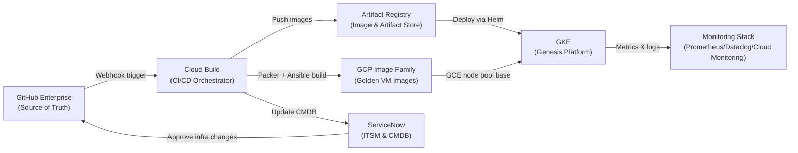

# Enterprise GCP DevOps & SRE Platform

!!! info "Platform Version"
    **Platform Version:** 2.0.0 | **Last Updated:** 2026-08 | **Maintained by:** [Platform SRE Team](mailto:platform-sre@enterprise.com)

Welcome to the **Enterprise GCP DevOps & SRE Platform** reference documentation. This site is the single source of truth for the platform architecture, Kubernetes manifests, SRE automation scripts, golden image pipeline, and observability configurations operated by the Platform SRE team.

All artifacts documented here are **production-grade**, version-controlled in GitHub Enterprise, and deployed via fully automated CI/CD pipelines following the enterprise GitOps model. Direct manual changes to any platform resource are prohibited and monitored via Cloud Audit Logs.

---

## Platform Overview



---

## Documentation Sections

| Section | Description |
|---------|-------------|
| [🏗️ Architecture Diagrams](architecture-diagrams.md) | High-level Mermaid diagrams: Shared VPC, Jenkins on GKE, CI/CD flow, SRE alert flow, Golden Image GitOps flow |
| [☸️ Jenkins on GKE Manifests](jenkins-gke-manifests.md) | Complete Kubernetes manifests: namespace, RBAC, deployment, services, ingress, agent pod templates |
| [🐍 SRE Automation Scripts](sre-automation-scripts.md) | Python Cloud Functions: Slack→PagerDuty bot, ServiceNow IAM handler, VM patch manager |
| [📦 Golden Image Pipeline](golden-image-pipeline.md) | Packer HCL, Ansible hardening playbook, Cloud Build pipeline, PR template |
| [📊 Observability & Monitoring](observability-monitoring.md) | Prometheus ServiceMonitor, Grafana dashboard, Datadog Helm values, Terraform Cloud Monitoring alert policies |

---

## Technology Stack

=== "Platform"
    | Layer | Technology | Version |
    |-------|-----------|---------|
    | Cloud | Google Cloud Platform | — |
    | Networking | Shared VPC + VPC Service Controls | — |
    | Compute | GKE (Autopilot + Standard) | 1.31 |
    | CI/CD | Jenkins LTS on GKE | 2.462.3 |
    | Build System | Google Cloud Build | — |
    | Image Registry | Artifact Registry | — |

=== "IaC & Automation"
    | Tool | Version | Purpose |
    |------|---------|---------|
    | Terraform | 1.9.x | Cloud Monitoring, Networking |
    | Packer | 1.11.x | Golden VM image building |
    | Ansible | 2.17.x | Image provisioning & hardening |
    | Helm | 3.16.x | Kubernetes application deployment |

=== "Observability"
    | Tool | Version | Purpose |
    |------|---------|---------|
    | Prometheus | 2.54.x | Metrics collection |
    | Grafana | 11.x | Dashboarding |
    | Datadog Agent | 7.56.x | Cross-platform APM/infra/logs |
    | GCP Cloud Monitoring | — | GCP-native alerting |
    | PagerDuty | — | On-call incident management |

=== "Security"
    | Control | Implementation |
    |---------|---------------|
    | Identity | Workload Identity (no static keys) |
    | OS Hardening | CIS Debian/RHEL L1 Benchmark |
    | Firewall | UFW on VMs, GKE NetworkPolicy |
    | Secrets | Google Secret Manager |
    | Image Scanning | Artifact Analysis (CVE scanning) |
    | Audit | Cloud Audit Logs + BigQuery |

---

## Quick Start — Run the MkDocs Site Locally

```bash
# 1. Clone the repository
git clone https://github.com/enterprise-org/devops-platform.git
cd devops-platform/mkdocs-devops-platform

# 2. Create and activate a virtual environment
python3 -m venv .venv
source .venv/bin/activate  # Windows: .venv\Scripts\activate

# 3. Install MkDocs and dependencies
pip install -r requirements.txt

# 4. Serve locally (hot-reload)
mkdocs serve
# → Open http://127.0.0.1:8000

# 5. Build static site
mkdocs build
# → Output in ./site/
```

---

## Contributing

!!! warning "GitOps Policy"
    All changes to this platform — including documentation, manifests, scripts, and pipeline definitions — **must** go through a GitHub Pull Request. Direct commits to `main` are blocked by branch protection rules. See the [Golden Image PR Template](golden-image-pipeline.md#4-github-pr-template) for the required review checklist format.

| Change Type | Required Approvals | Ticket Required |
|------------|-------------------|-----------------|
| Documentation only | 1x Platform SRE | No |
| K8s manifest change | 2x Platform SRE | Jira |
| Python SRE script | 2x Platform SRE + security scan | Jira |
| Golden Image recipe | 1x SecOps + 2x Platform SRE | ServiceNow RITM |
| IAM / Networking | 1x SecOps + 1x Platform SRE | ServiceNow CHG |

---

*Documentation generated and maintained by the Platform SRE Team. For questions, reach out in **#platform-sre** on Slack or file a ticket at [ServiceNow](https://enterprise.service-now.com).*
