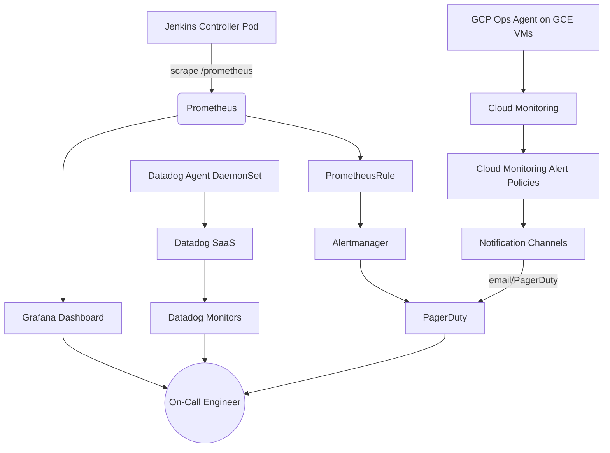

# Observability & Monitoring

The platform uses a three-pillar observability strategy — metrics, logs, and traces — implemented through Prometheus/Grafana (in-cluster), Datadog (cross-cloud agent), and Google Cloud Monitoring (GCP-native alerting). All alert policies are defined as code (Terraform) and deployed via CI/CD. PagerDuty is the notification backbone for P1/P2 incidents, with Slack for P3/P4. This multi-layered approach ensures rapid detection and resolution of infrastructure and application issues.

## Monitoring Architecture


---

## 1. Prometheus — Jenkins ServiceMonitor & Alert Rules

The Prometheus plugin for Jenkins exposes metrics at the `/prometheus` endpoint. A `ServiceMonitor` resource configures Prometheus to scrape this endpoint periodically, collecting critical data about Jenkins' health and build performance. Concurrently, a `PrometheusRule` resource defines alerting thresholds, evaluating the collected metrics and triggering alerts when anomalies such as build queue saturation or offline agents are detected.

### `servicemonitor-jenkins.yaml`
```yaml
apiVersion: monitoring.coreos.com/v1
kind: ServiceMonitor
metadata:
  name: jenkins-controller
  namespace: jenkins-prod
  labels:
    app.kubernetes.io/name: jenkins
    prometheus: kube-prometheus
    release: kube-prometheus-stack
spec:
  selector:
    matchLabels:
      app.kubernetes.io/name: jenkins
  namespaceSelector:
    matchNames: [jenkins-prod]
  endpoints:
  - port: web
    path: /prometheus
    interval: 30s
    scrapeTimeout: 10s
    honorLabels: true
    metricRelabelings:
    - sourceLabels: [__name__]
      regex: 'jenkins_(queue|executor|build|plugins|job).*'
      action: keep
    relabelings:
    - targetLabel: job
      replacement: jenkins-controller
    - sourceLabels: [__meta_kubernetes_pod_name]
      targetLabel: instance
---
apiVersion: monitoring.coreos.com/v1
kind: PrometheusRule
metadata:
  name: jenkins-alerts
  namespace: jenkins-prod
  labels:
    prometheus: kube-prometheus
    release: kube-prometheus-stack
spec:
  groups:
  - name: jenkins.critical
    interval: 30s
    rules:
    - alert: JenkinsBuildQueueSaturated
      expr: jenkins_queue_size_value > 10
      for: 5m
      labels:
        severity: warning
        team: platform-sre
        service: jenkins
      annotations:
        summary: Jenkins build queue is saturated ({{ $value }} items)
        description: Jenkins queue has had {{ $value }} items for more than 5 minutes. Agent pool may be undersized or agents are failing to start.
        runbook_url: https://wiki.enterprise.com/runbooks/jenkins-queue-saturation
    - alert: JenkinsAllAgentsOffline
      expr: jenkins_executor_free_count_value == 0
      for: 5m
      labels:
        severity: critical
        team: platform-sre
      annotations:
        summary: All Jenkins executors offline
        description: No free executors available for 5 minutes. Check Kubernetes Cloud plugin and jenkins-agents namespace.
        runbook_url: https://wiki.enterprise.com/runbooks/jenkins-agents-offline
    - alert: JenkinsBuildDurationHigh
      expr: histogram_quantile(0.95, rate(jenkins_builds_duration_milliseconds_summary_bucket[15m])) > 1800000
      for: 10m
      labels:
        severity: warning
        team: platform-sre
      annotations:
        summary: Jenkins p95 build duration > 30 minutes
        description: 95th percentile build duration is {{ $value | humanizeDuration }} which exceeds 30 minute threshold.
        runbook_url: https://wiki.enterprise.com/runbooks/jenkins-build-duration
    - alert: JenkinsControllerDown
      expr: up{job="jenkins-controller"} == 0
      for: 2m
      labels:
        severity: critical
        team: platform-sre
      annotations:
        summary: Jenkins controller is down
        description: Prometheus cannot scrape Jenkins controller for 2 minutes. Pod may be crashing.
        runbook_url: https://wiki.enterprise.com/runbooks/jenkins-controller-down
```

---

## 2. Grafana Dashboard — Jenkins Controller

This Grafana dashboard (UID: `enterprise-jenkins-001`) provides real-time visibility into the Jenkins Controller's health and activity. It refreshes every 30 seconds and defaults to a 3-hour time range. A namespace variable allows operators to filter metrics for specific Jenkins instances.

### `jenkins-dashboard.json`
```json
{
  "id": null,
  "uid": "enterprise-jenkins-001",
  "title": "Jenkins Controller — SRE Dashboard",
  "tags": ["jenkins", "sre", "platform"],
  "timezone": "browser",
  "schemaVersion": 39,
  "version": 1,
  "refresh": "30s",
  "time": {
    "from": "now-3h",
    "to": "now"
  },
  "templating": {
    "list": [
      {
        "name": "namespace",
        "type": "query",
        "datasource": "Prometheus",
        "query": "label_values(jenkins_queue_size_value, namespace)",
        "refresh": 1,
        "sort": 1
      }
    ]
  },
  "panels": [
    {
      "id": 1,
      "type": "stat",
      "title": "Build Queue Depth",
      "gridPos": { "x": 0, "y": 0, "w": 6, "h": 4 },
      "targets": [
        {
          "expr": "jenkins_queue_size_value{namespace=\"$namespace\"}",
          "refId": "A"
        }
      ],
      "fieldConfig": {
        "defaults": {
          "unit": "short",
          "thresholds": {
            "mode": "absolute",
            "steps": [
              { "color": "green", "value": null },
              { "color": "yellow", "value": 5 },
              { "color": "red", "value": 10 }
            ]
          }
        }
      },
      "options": {
        "reduceOptions": {
          "calcs": ["lastNotNull"]
        }
      }
    },
    {
      "id": 2,
      "type": "stat",
      "title": "Total Executors",
      "gridPos": { "x": 6, "y": 0, "w": 6, "h": 4 },
      "targets": [
        {
          "expr": "jenkins_executor_count_value{namespace=\"$namespace\"}",
          "refId": "A"
        }
      ],
      "fieldConfig": {
        "defaults": {
          "thresholds": {
            "mode": "absolute",
            "steps": [
              { "color": "green", "value": null }
            ]
          }
        }
      }
    },
    {
      "id": 3,
      "type": "stat",
      "title": "Free Executors",
      "gridPos": { "x": 12, "y": 0, "w": 6, "h": 4 },
      "targets": [
        {
          "expr": "jenkins_executor_free_count_value{namespace=\"$namespace\"}",
          "refId": "A"
        }
      ],
      "fieldConfig": {
        "defaults": {
          "thresholds": {
            "mode": "absolute",
            "steps": [
              { "color": "red", "value": null },
              { "color": "yellow", "value": 1 },
              { "color": "green", "value": 3 }
            ]
          }
        }
      }
    },
    {
      "id": 4,
      "type": "stat",
      "title": "Build Success Rate %",
      "gridPos": { "x": 18, "y": 0, "w": 6, "h": 4 },
      "targets": [
        {
          "expr": "100 * rate(jenkins_builds_success_build_count{namespace=\"$namespace\"}[1h]) / (rate(jenkins_builds_success_build_count{namespace=\"$namespace\"}[1h]) + rate(jenkins_builds_failed_build_count{namespace=\"$namespace\"}[1h]))",
          "refId": "A"
        }
      ],
      "fieldConfig": {
        "defaults": {
          "unit": "percent",
          "thresholds": {
            "mode": "absolute",
            "steps": [
              { "color": "red", "value": null },
              { "color": "yellow", "value": 80 },
              { "color": "green", "value": 95 }
            ]
          }
        }
      }
    },
    {
      "id": 5,
      "type": "timeseries",
      "title": "Build Duration Percentiles (ms)",
      "gridPos": { "x": 0, "y": 4, "w": 12, "h": 8 },
      "targets": [
        {
          "expr": "histogram_quantile(0.50, sum(rate(jenkins_builds_duration_milliseconds_summary_bucket{namespace=\"$namespace\"}[5m])) by (le))",
          "legendFormat": "p50",
          "refId": "A"
        },
        {
          "expr": "histogram_quantile(0.95, sum(rate(jenkins_builds_duration_milliseconds_summary_bucket{namespace=\"$namespace\"}[5m])) by (le))",
          "legendFormat": "p95",
          "refId": "B"
        },
        {
          "expr": "histogram_quantile(0.99, sum(rate(jenkins_builds_duration_milliseconds_summary_bucket{namespace=\"$namespace\"}[5m])) by (le))",
          "legendFormat": "p99",
          "refId": "C"
        }
      ],
      "fieldConfig": {
        "defaults": {
          "unit": "ms"
        }
      }
    },
    {
      "id": 6,
      "type": "timeseries",
      "title": "Build Rate (success vs failure)",
      "gridPos": { "x": 12, "y": 4, "w": 12, "h": 8 },
      "targets": [
        {
          "expr": "sum(rate(jenkins_builds_success_build_count{namespace=\"$namespace\"}[1m]))",
          "legendFormat": "Success Rate",
          "refId": "A"
        },
        {
          "expr": "sum(rate(jenkins_builds_failed_build_count{namespace=\"$namespace\"}[1m]))",
          "legendFormat": "Failure Rate",
          "refId": "B"
        }
      ]
    },
    {
      "id": 7,
      "type": "timeseries",
      "title": "JVM Heap Usage (bytes)",
      "gridPos": { "x": 0, "y": 12, "w": 12, "h": 8 },
      "targets": [
        {
          "expr": "jvm_memory_bytes_used{namespace=\"$namespace\", area=\"heap\"}",
          "legendFormat": "Heap Used",
          "refId": "A"
        }
      ],
      "fieldConfig": {
        "defaults": {
          "unit": "bytes"
        }
      }
    },
    {
      "id": 8,
      "type": "stat",
      "title": "Active Plugins",
      "gridPos": { "x": 12, "y": 12, "w": 6, "h": 4 },
      "targets": [
        {
          "expr": "jenkins_plugins_active{namespace=\"$namespace\"}",
          "refId": "A"
        }
      ]
    }
  ]
}
```

---

## 3. Datadog Agent — GKE Helm Values

The Datadog Agent is deployed as a DaemonSet across the GKE cluster using Helm. This configuration enables the Datadog Cluster Agent, Network Performance Monitoring (NPM), Cloud Security Posture Management (CSPM), and allows for Horizontal Pod Autoscaling (HPA) using custom Datadog metrics.

### `values.yaml`
```yaml
datadog:
  apiKeyExistingSecret: datadog-api-key
  appKeyExistingSecret: datadog-app-key
  site: datadoghq.com
  clusterName: enterprise-gke-prod-us-central1
  tags:
    - env:production
    - team:platform-sre
    - cloud:gcp
    - region:us-central1
    - cluster:enterprise-gke-prod-us-central1
  collectEvents: true
  leaderElection: true
  criSocketPath: /var/run/containerd/containerd.sock
  kubelet:
    tlsVerify: false
  logs:
    enabled: true
    containerCollectAll: true
    autoMultiLineDetection: true
  apm:
    portEnabled: true
    port: 8126
  processAgent:
    enabled: true
    processCollection: true
  systemProbe:
    enabled: true
    enableTCPQueueLength: true
    enableOOMKill: true
  networkMonitoring:
    enabled: true
  kubeStateMetricsEnabled: true
  orchestratorExplorer:
    enabled: true
  securityAgent:
    runtime:
      enabled: true
    compliance:
      enabled: true
      checkInterval: 20m

agents:
  image:
    tag: 7.56.2
  tolerations:
    - operator: Exists
  resources:
    requests:
      cpu: 200m
      memory: 256Mi
    limits:
      cpu: 500m
      memory: 512Mi
  updateStrategy:
    type: RollingUpdate
    rollingUpdate:
      maxUnavailable: 10%
  volumes:
    - name: containerd-sock
      hostPath:
        path: /var/run/containerd/containerd.sock
  volumeMounts:
    - name: containerd-sock
      mountPath: /var/run/containerd/containerd.sock
      readOnly: true

clusterAgent:
  enabled: true
  replicas: 2
  createPodDisruptionBudget: true
  metricsProvider:
    enabled: true
    useDatadogMetrics: true
  resources:
    requests:
      cpu: 200m
      memory: 256Mi
    limits:
      cpu: 500m
      memory: 512Mi

clusterChecksRunner:
  enabled: true
  replicas: 2
  resources:
    requests:
      cpu: 100m
      memory: 128Mi
    limits:
      cpu: 200m
      memory: 256Mi

kubeStateMetrics:
  enabled: false  # Using existing kube-state-metrics from kube-prometheus-stack
```

---

## 4. Google Cloud Monitoring — Terraform Alert Policies

Alert policies for GCP resources are fully managed via Terraform. These configurations establish automated alerting based on Monitoring Query Language (MQL) conditions and direct notifications to appropriate channels, such as PagerDuty for critical incidents and email for warnings.

### `provider.tf`
```hcl
terraform {
  required_providers {
    google = {
      source  = "hashicorp/google"
      version = "~> 5.0"
    }
  }
}

provider "google" {
  project = var.project_id
  region  = var.region
}
```

### `variables.tf`
```hcl
variable "project_id" {
  type        = string
  description = "GCP project for monitoring"
  default     = "enterprise-monitoring"
}

variable "region" {
  type        = string
  description = "GCP region"
  default     = "us-central1"
}

variable "pagerduty_service_key" {
  type        = string
  description = "PagerDuty Integration Key"
  sensitive   = true
}

variable "alert_email" {
  type        = string
  description = "Email address for non-critical alerts"
  default     = "platform-sre@enterprise.com"
}

variable "gke_cluster_name" {
  type        = string
  description = "GKE cluster name"
  default     = "enterprise-gke-prod-us-central1"
}

variable "gke_project_id" {
  type        = string
  description = "GKE project ID"
  default     = "enterprise-platform-prod"
}
```

### `alert_policies.tf`
```hcl
# Notification channels
resource "google_monitoring_notification_channel" "email" {
  display_name = "SRE Platform Email"
  type         = "email"
  labels = {
    email_address = var.alert_email
  }
}

resource "google_monitoring_notification_channel" "pagerduty" {
  display_name = "SRE PagerDuty P1/P2"
  type         = "pagerduty"
  labels = {
    service_key = var.pagerduty_service_key
  }
}

# Alert 1: GKE Pod CrashLoopBackOff
resource "google_monitoring_alert_policy" "gke_crashloopbackoff" {
  display_name = "GKE Pod CrashLoopBackOff"
  combiner     = "OR"
  conditions {
    display_name = "Container restart count > 3 in 5 minutes"
    condition_threshold {
      filter          = "resource.type=\"k8s_container\" AND metric.type=\"kubernetes.io/container/restart_count\""
      duration        = "300s"
      comparison      = "COMPARISON_GT"
      threshold_value = 3
      aggregations {
        alignment_period     = "300s"
        per_series_aligner   = "ALIGN_RATE"
        cross_series_reducer = "REDUCE_MAX"
        group_by_fields      = ["resource.label.namespace_name", "resource.label.pod_name", "resource.label.container_name"]
      }
    }
  }
  notification_channels = [
    google_monitoring_notification_channel.email.name,
    google_monitoring_notification_channel.pagerduty.name
  ]
  alert_strategy {
    auto_close = "86400s"
  }
  documentation {
    content = "The container is frequently restarting, entering CrashLoopBackOff state. Please check the logs via `kubectl logs -n ${r"$"}{resource.label.namespace_name} ${r"$"}{resource.label.pod_name} -c ${r"$"}{resource.label.container_name}`. Runbook: https://wiki.enterprise.com/runbooks/gke-crashloopbackoff"
  }
  user_labels = {
    team     = "platform-sre"
    severity = "critical"
    service  = "gke"
  }
}

# Alert 2: VM CPU Saturation
resource "google_monitoring_alert_policy" "vm_cpu_saturation" {
  display_name = "GCE VM CPU Saturation > 85%"
  combiner     = "OR"
  conditions {
    display_name = "CPU utilization over 85% for 10 minutes"
    condition_threshold {
      filter          = "resource.type=\"gce_instance\" AND metric.type=\"compute.googleapis.com/instance/cpu/utilization\""
      duration        = "600s"
      comparison      = "COMPARISON_GT"
      threshold_value = 0.85
      aggregations {
        alignment_period   = "60s"
        per_series_aligner = "ALIGN_MEAN"
      }
    }
  }
  notification_channels = [
    google_monitoring_notification_channel.email.name,
    google_monitoring_notification_channel.pagerduty.name
  ]
  documentation {
    content = "VM CPU usage exceeds 85%. Investigate top processes or scale up instance. Runbook: https://wiki.enterprise.com/runbooks/vm-cpu-saturation"
  }
}

# Alert 3: VM Memory Saturation
resource "google_monitoring_alert_policy" "vm_memory_saturation" {
  display_name = "GCE VM Memory Saturation > 90%"
  combiner     = "OR"
  conditions {
    display_name = "Memory utilization over 90% for 5 minutes"
    condition_threshold {
      filter          = "resource.type=\"gce_instance\" AND metric.type=\"agent.googleapis.com/memory/percent_used\" AND metric.labels.state=\"used\""
      duration        = "300s"
      comparison      = "COMPARISON_GT"
      threshold_value = 90
      aggregations {
        alignment_period   = "60s"
        per_series_aligner = "ALIGN_MEAN"
      }
    }
  }
  notification_channels = [
    google_monitoring_notification_channel.email.name
  ]
  documentation {
    content = "VM Memory usage exceeds 90%. Investigate memory hogs or scale instance. Runbook: https://wiki.enterprise.com/runbooks/vm-memory-saturation"
  }
}

# Alert 4: GKE Node Not Ready
resource "google_monitoring_alert_policy" "gke_node_not_ready" {
  display_name = "GKE Node Not Ready"
  combiner     = "OR"
  conditions {
    display_name = "Node Ready condition is false for 5 minutes"
    condition_threshold {
      filter          = "resource.type=\"k8s_node\" AND metric.type=\"kubernetes.io/node/condition\" AND metric.labels.condition=\"Ready\""
      duration        = "300s"
      comparison      = "COMPARISON_LT"
      threshold_value = 1
    }
  }
  notification_channels = [
    google_monitoring_notification_channel.email.name,
    google_monitoring_notification_channel.pagerduty.name
  ]
  documentation {
    content = "A GKE Node is NotReady. Pods may be unschedulable. Check node status and underlying VM. Runbook: https://wiki.enterprise.com/runbooks/gke-node-notready"
  }
}

# Alert 5: Jenkins Build Queue Deep (custom metric)
resource "google_monitoring_alert_policy" "jenkins_queue_deep" {
  display_name = "Jenkins Build Queue Deep"
  combiner     = "OR"
  conditions {
    display_name = "Queue depth > 10 for 5 minutes"
    condition_threshold {
      filter          = "resource.type=\"k8s_container\" AND metric.type=\"custom.googleapis.com/prometheus/jenkins_queue_size_value\""
      duration        = "300s"
      comparison      = "COMPARISON_GT"
      threshold_value = 10
    }
  }
  notification_channels = [
    google_monitoring_notification_channel.email.name
  ]
  documentation {
    content = "Jenkins build queue has been greater than 10 for 5 minutes. Check agent provisioning. Runbook: https://wiki.enterprise.com/runbooks/jenkins-queue-depth"
  }
}
```

### `outputs.tf`
```hcl
output "alert_policy_crashloopbackoff_id" {
  value = google_monitoring_alert_policy.gke_crashloopbackoff.id
}

output "alert_policy_cpu_id" {
  value = google_monitoring_alert_policy.vm_cpu_saturation.id
}

output "alert_policy_memory_id" {
  value = google_monitoring_alert_policy.vm_memory_saturation.id
}

output "alert_policy_node_id" {
  value = google_monitoring_alert_policy.gke_node_not_ready.id
}

output "alert_policy_jenkins_queue_id" {
  value = google_monitoring_alert_policy.jenkins_queue_deep.id
}

output "notification_channel_email_id" {
  value = google_monitoring_notification_channel.email.id
}

output "notification_channel_pagerduty_id" {
  value = google_monitoring_notification_channel.pagerduty.id
}
```

!!! tip "Terraform Deployment"
    To deploy these observability policies to the environment, run the following Terraform commands from within the infrastructure directory:
    ```bash
    terraform init
    terraform plan -var-file=prod.tfvars
    terraform apply -var-file=prod.tfvars
    ```

## Alerting Runbook Matrix

| Alert | Severity | Notification | Runbook |
|---|---|---|---|
| GKE Pod CrashLoopBackOff | Critical | PagerDuty + Email | [Link](https://wiki.enterprise.com/runbooks/gke-crashloopbackoff) |
| GCE VM CPU > 85% | Warning | PagerDuty + Email | [Link](https://wiki.enterprise.com/runbooks/vm-cpu-saturation) |
| GCE VM Memory > 90% | Warning | Email | [Link](https://wiki.enterprise.com/runbooks/vm-memory-saturation) |
| GKE Node Not Ready | Critical | PagerDuty + Email | [Link](https://wiki.enterprise.com/runbooks/gke-node-notready) |
| Jenkins Queue > 10 | Warning | Email | [Link](https://wiki.enterprise.com/runbooks/jenkins-queue-saturation) |
| JenkinsControllerDown | Critical | PagerDuty | [Link](https://wiki.enterprise.com/runbooks/jenkins-controller-down) |
| JenkinsBuildDurationHigh | Warning | Email | [Link](https://wiki.enterprise.com/runbooks/jenkins-build-duration) |
